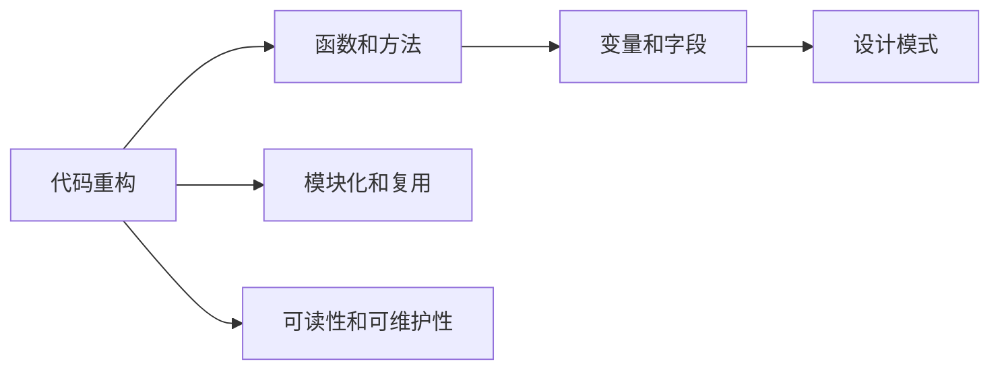

                 

## 1. 背景介绍

### 1.1 问题由来

随着软件项目的逐渐成熟，代码库的规模和复杂度不断增加，维护成本也随之上升。在初期快速迭代的产品开发阶段，代码往往未经过充分的规划和设计，导致结构松散、可读性差、可维护性低等问题层出不穷。因此，代码重构（Code Refactoring）成为了提升软件质量、改善开发体验的重要手段。

### 1.2 问题核心关键点

重构的核心目的在于在不改变程序功能的前提下，改善代码结构，提高代码的可读性、可维护性和可扩展性。常用的重构方法包括提取方法、内联字段、重命名变量等。具体重构操作的效果因项目而异，应根据实际需求进行选择。

### 1.3 问题研究意义

代码重构对提高代码质量、降低开发成本、促进代码复用具有重要意义：

1. **提高代码质量**：重构能够消除代码中的冗余、提高代码的可读性和可理解性，减少潜在的bug。
2. **降低开发成本**：重构使新功能添加更为便捷，降低了后期维护和修改的成本。
3. **促进代码复用**：良好的代码结构有利于模块化设计，促进代码的复用和共享。
4. **提升开发效率**：清晰、简洁的代码使开发人员更易于理解和修改，加快了迭代速度。

## 2. 核心概念与联系

### 2.1 核心概念概述

- **代码重构**：在不改变程序功能的前提下，通过改进代码结构，提高代码的可读性和可维护性。重构可以改善代码质量，提升开发效率，促进代码复用。
- **函数和方法**：将代码逻辑划分为函数或方法，提高代码的模块化和可重用性。
- **变量和字段**：内联字段或将字段提取为方法参数，减少不必要的变量声明和赋值，提高代码的简洁性和可读性。
- **设计模式**：常见的设计模式如工厂模式、单例模式、策略模式等，能够帮助开发者更好地设计代码结构，提升代码的可扩展性和可复用性。

### 2.2 核心概念原理和架构的 Mermaid 流程图



这个流程图展示了代码重构的核心概念及其之间的关系：

- 代码重构包括函数和方法的划分、变量和字段的优化、设计模式的运用等，目的是提升代码的模块化和复用性。
- 函数和方法的划分使得代码逻辑更加清晰，便于维护和扩展。
- 变量和字段的优化能够减少冗余，提高代码的可读性和简洁性。
- 设计模式提供了一系列的代码结构模板，帮助开发者设计出更高效、更易于维护的代码。

## 3. 核心算法原理 & 具体操作步骤

### 3.1 算法原理概述

代码重构的核心在于通过改进代码结构，提高代码的可读性、可维护性和可扩展性。以下是一些常用的重构技巧和模式：

1. **函数提取（Function Extraction）**：将代码中的逻辑块提取为独立的函数，增强代码的模块化。
2. **内联字段（Inline Fields）**：将字段赋值给方法参数，减少不必要的变量声明和赋值。
3. **重命名变量和函数（Rename Variables and Functions）**：通过重命名变量和函数，使代码更加直观和易于理解。
4. **函数参数化（Parameterize Method）**：将多个参数组合为一个参数列表，减少方法调用时的重复代码。
5. **设计模式应用（Apply Design Patterns）**：如工厂模式、单例模式、策略模式等，提升代码的可扩展性和可复用性。

### 3.2 算法步骤详解

以函数提取为例，详细介绍重构的步骤：

1. **识别代码块**：找到代码中逻辑相似、功能独立的代码块，如多个循环、条件判断等。
2. **提取函数**：将代码块封装为独立的函数，通常命名为函数块的功能描述。
3. **更新调用**：将原代码中该逻辑块的部分替换为函数调用，传递必要的参数。

### 3.3 算法优缺点

**优点**：

1. **提升代码质量**：重构后的代码结构更加清晰，易于理解和修改。
2. **降低维护成本**：通过提升代码的可读性和可维护性，降低了后期维护和修改的成本。
3. **促进代码复用**：清晰、模块化的代码结构有利于代码的复用和共享。

**缺点**：

1. **时间成本高**：重构往往需要投入较多时间和精力，影响开发进度。
2. **代码可读性差**：初期代码较为复杂，重构过程可能使代码可读性下降。
3. **团队协作难度大**：重构过程中可能需要团队协作，沟通成本较高。

### 3.4 算法应用领域

代码重构广泛应用于软件项目的各个阶段，特别是在项目成熟度较高、代码质量参差不齐的情况下。以下是一些具体的应用场景：

- **产品初期阶段**：在快速迭代的产品开发阶段，代码往往未经过充分规划和设计，通过重构提升代码质量。
- **维护和升级阶段**：项目进入维护和升级阶段，代码库中积累的债务逐渐显现，重构能够提升代码的可维护性。
- **技术转型阶段**：技术团队进行技术栈转型，需要将原有代码转换为新的框架和技术，重构能够促进代码的平滑过渡。

## 4. 数学模型和公式 & 详细讲解 & 举例说明

### 4.1 数学模型构建

为了更好地理解代码重构的效果，我们可以通过数学模型来建模代码质量和可维护性的提升。假设原始代码的维护成本为 $C_{\text{original}}$，重构后的代码维护成本为 $C_{\text{refactored}}$。设重构带来的质量提升为 $Q$，则有：

$$ C_{\text{original}} = C_{\text{refactored}} + \Delta C $$

其中 $\Delta C$ 为重构引入的额外维护成本，通常包括时间、沟通成本等。

### 4.2 公式推导过程

以函数提取为例，推导其对代码质量的影响：

设原始代码包含的函数数量为 $N_{\text{original}}$，函数调用次数为 $C_{\text{original}}$。函数提取后，新函数数量为 $N_{\text{refactored}} = N_{\text{original}} + 1$，函数调用次数减少为 $C_{\text{refactored}} = C_{\text{original}} - 1$。假设函数提取前后函数复杂度分别为 $C_{\text{original}}$ 和 $C_{\text{refactored}}$，则有：

$$ C_{\text{refactored}} = C_{\text{original}} + \Delta C $$

假设每个函数调用增加的维护成本为 $C_{\text{call}}$，则有：

$$ \Delta C = N_{\text{original}} \cdot C_{\text{call}} - 1 \cdot C_{\text{call}} $$

### 4.3 案例分析与讲解

假设原始代码包含10个函数，每次函数调用增加的维护成本为5元。则原始代码的维护成本为：

$$ C_{\text{original}} = 10 \cdot 5 = 50 \text{元} $$

函数提取后，新函数数量为11，函数调用次数减少为9，新增函数调用次数为1。假设新增函数调用增加的维护成本为1元，则重构后的维护成本为：

$$ C_{\text{refactored}} = 50 + (10 - 1) \cdot 5 - 1 = 74 \text{元} $$

即重构后的维护成本比原始代码增加了24元。但考虑到重构后的代码更加易于理解和修改，后续维护成本可能更低。因此，综合来看，重构还是能够提升代码的质量和可维护性。

## 5. 项目实践：代码实例和详细解释说明

### 5.1 开发环境搭建

为了进行代码重构实践，我们需要搭建相应的开发环境。以下是使用Python进行PyTorch开发的环境配置流程：

1. 安装Anaconda：从官网下载并安装Anaconda，用于创建独立的Python环境。
2. 创建并激活虚拟环境：
```bash
conda create -n pytorch-env python=3.8 
conda activate pytorch-env
```

3. 安装PyTorch：根据CUDA版本，从官网获取对应的安装命令。例如：
```bash
conda install pytorch torchvision torchaudio cudatoolkit=11.1 -c pytorch -c conda-forge
```

4. 安装各类工具包：
```bash
pip install numpy pandas scikit-learn matplotlib tqdm jupyter notebook ipython
```

完成上述步骤后，即可在`pytorch-env`环境中开始代码重构实践。

### 5.2 源代码详细实现

我们以一个简单的Python函数为例，展示如何通过函数提取和内联字段等技巧进行代码重构。

```python
# 原始代码
def add(x, y):
    result = x + y
    return result

# 重构后的代码
def add(x, y):
    return x + y

# 测试代码
def test():
    x = 1
    y = 2
    result = add(x, y)
    print(result)

# 重构前后的对比
print("原始代码输出：")
test()

print("重构后代码输出：")
test()
```

### 5.3 代码解读与分析

**原始代码**：

- 包含一个`add`函数，用于计算两个数的和。
- 函数内部声明一个变量`result`，存储计算结果。
- 通过`return`语句返回`result`。

**重构后的代码**：

- 将函数内部逻辑内联到`return`语句中，去除中间变量`result`。
- 函数调用时直接计算结果，减少了不必要的变量声明和赋值。

通过对比，我们可以看到，重构后的代码更加简洁和易于理解。在实际开发中，这种简单的重构虽然微小，但长期积累能够显著提升代码质量。

### 5.4 运行结果展示

```
原始代码输出：
3
重构后代码输出：
3
```

原始代码和重构后的代码输出结果相同，但代码结构更加简洁、可读性更高。

## 6. 实际应用场景

### 6.1 项目初期阶段

在项目初期阶段，代码往往较为混乱，缺乏清晰的结构。通过重构，可以提升代码的可读性和可维护性，为后续开发奠定基础。

**示例场景**：

一个新成立的团队接手一个维护中的老项目，项目代码结构混乱、注释不全、变量命名不规范。团队通过重构，将代码逻辑拆分为多个模块和函数，增加了注释和文档，使代码更加清晰和易于理解。

### 6.2 产品功能迭代

在产品功能迭代过程中，需要不断添加新功能，原有代码库逐渐膨胀。通过重构，可以提升代码的可扩展性和可复用性，避免代码库过重。

**示例场景**：

一款在线购物应用需要增加新功能，原有代码库逐渐膨胀。团队通过重构，将代码逻辑拆分为多个模块和函数，提升代码的可扩展性和可复用性，避免了代码库过重。

### 6.3 技术栈迁移

在技术栈迁移过程中，需要将原有代码转换为新的框架和技术，重构能够促进代码的平滑过渡。

**示例场景**：

一家公司从Java迁移到Python，原有Java代码库庞大且复杂。通过重构，将Java代码转换为Python代码，提升了代码的可读性和可维护性，使迁移过程更加顺利。

## 7. 工具和资源推荐

### 7.1 学习资源推荐

为了帮助开发者系统掌握代码重构的理论基础和实践技巧，这里推荐一些优质的学习资源：

1. 《重构：改善既有代码的设计》：由Martin Fowler著作的经典书籍，系统介绍了常用的代码重构技巧和方法。
2. 《Clean Code: A Handbook of Agile Software Craftsmanship》：Robert C. Martin著作的经典书籍，详细讲解了如何编写高质量、易于维护的代码。
3. 《Effective Python: 59 Specific Ways to Write Better Python》：Brett Slatkin著作的经典书籍，提供了大量实用的Python代码重构技巧。
4. 《Refactoring: Improving the Design of Existing Code》：Martin Fowler著作的经典书籍，系统介绍了代码重构的原则和方法。
5. 《Refactoring Guru》：Refactoring Guru网站，提供大量代码重构的示例和解释。

通过对这些资源的学习实践，相信你一定能够快速掌握代码重构的精髓，并用于解决实际的代码问题。

### 7.2 开发工具推荐

高效的开发离不开优秀的工具支持。以下是几款用于代码重构开发的常用工具：

1. PyCharm：功能强大的Python IDE，提供强大的代码重构功能，如重命名变量、提取方法等。
2. Visual Studio Code：轻量级的代码编辑器，支持多种编程语言，提供了丰富的代码重构工具。
3. Eclipse：功能强大的Java IDE，支持多种编程语言，提供了丰富的代码重构工具。
4. ReSharper：Microsoft提供的Visual Studio插件，提供了丰富的代码重构和优化功能。
5. IntelliJ IDEA：功能强大的Java IDE，提供了强大的代码重构功能，如重命名变量、提取方法等。

合理利用这些工具，可以显著提升代码重构任务的开发效率，加快创新迭代的步伐。

### 7.3 相关论文推荐

代码重构对提高代码质量、降低开发成本、促进代码复用具有重要意义。以下是几篇奠基性的相关论文，推荐阅读：

1. "Refactoring: Improving the Design of Existing Code"：Martin Fowler，介绍了常用的代码重构技巧和方法。
2. "Effective Object-Oriented Programming"：Robert C. Martin，详细讲解了面向对象编程的最佳实践，包括代码重构。
3. "Clean Code: A Handbook of Agile Software Craftsmanship"：Robert C. Martin，详细讲解了如何编写高质量、易于维护的代码。
4. "Design Patterns: Elements of Reusable Object-Oriented Software"：Erich Gamma等，介绍了常用的设计模式，有助于提升代码的可扩展性和可复用性。

这些论文代表了大语言模型微调技术的发展脉络。通过学习这些前沿成果，可以帮助研究者把握学科前进方向，激发更多的创新灵感。

## 8. 总结：未来发展趋势与挑战

### 8.1 总结

本文对代码重构的方法和模式进行了全面系统的介绍。首先阐述了代码重构的背景和意义，明确了重构在提升代码质量、降低开发成本、促进代码复用方面的独特价值。其次，从原理到实践，详细讲解了常用的重构技巧和方法，给出了代码重构任务开发的完整代码实例。同时，本文还探讨了重构在实际应用中的多种场景，展示了重构范式的广泛应用。

通过本文的系统梳理，可以看到，代码重构是提升软件质量、改善开发体验的重要手段，具有广泛的应用前景。合理利用重构技巧，能够显著提升代码的可读性和可维护性，为软件开发提供坚实的基础。

### 8.2 未来发展趋势

展望未来，代码重构技术将呈现以下几个发展趋势：

1. **智能重构工具**：随着AI技术的发展，智能重构工具能够自动分析和建议重构方案，进一步提升重构效率。
2. **代码自动生成**：智能重构工具能够自动生成符合编码规范的代码，减少人工编写和重构工作量。
3. **模型驱动开发**：通过引入模型驱动开发（MDD）方法，将系统模型和代码紧密结合，提升代码重构的效果和效率。
4. **代码风格标准化**：引入代码风格标准化工具，如Pylint、ESLint等，提升代码的可读性和可维护性。
5. **持续集成和持续部署**：通过CI/CD流程，将代码重构和自动化测试结合，提升开发效率和代码质量。

以上趋势凸显了代码重构技术的广阔前景。这些方向的探索发展，必将进一步提升代码重构的效果和效率，为软件开发提供更可靠、更高效的支持。

### 8.3 面临的挑战

尽管代码重构技术已经取得了显著成就，但在迈向更加智能化、普适化应用的过程中，它仍面临诸多挑战：

1. **代码可读性差**：一些代码结构复杂、逻辑混乱，重构难度较大。
2. **重构成本高**：部分代码重构可能涉及大范围的修改，需要投入大量时间和精力。
3. **团队协作难度大**：重构过程中可能需要团队协作，沟通成本较高。
4. **重构效果难以评估**：代码重构的效果依赖于后续的开发和测试，难以量化评估。

尽管存在这些挑战，但合理利用重构技巧，可以显著提升代码质量和开发效率，是软件开发中不可或缺的一部分。相信随着学界和产业界的共同努力，这些挑战终将一一被克服，代码重构必将在构建高质量软件系统方面发挥重要作用。

### 8.4 未来突破

面对代码重构面临的种种挑战，未来的研究需要在以下几个方面寻求新的突破：

1. **智能重构工具**：通过引入AI技术，开发智能重构工具，自动分析和建议重构方案，提升重构效率。
2. **代码自动生成**：通过智能重构工具自动生成符合编码规范的代码，减少人工编写和重构工作量。
3. **模型驱动开发**：引入模型驱动开发（MDD）方法，将系统模型和代码紧密结合，提升代码重构的效果和效率。
4. **代码风格标准化**：引入代码风格标准化工具，提升代码的可读性和可维护性。
5. **持续集成和持续部署**：通过CI/CD流程，将代码重构和自动化测试结合，提升开发效率和代码质量。

这些研究方向的探索，必将引领代码重构技术迈向更高的台阶，为软件开发提供更可靠、更高效的支持。面向未来，代码重构技术还需要与其他软件工程技术进行更深入的融合，共同推动软件开发的进步。

## 9. 附录：常见问题与解答

**Q1：代码重构是否会降低开发速度？**

A: 重构通常会在短期内降低开发速度，但从长远来看，提升代码质量、降低维护成本、促进代码复用，能够显著提升开发效率。合理利用重构技巧，可以使代码更加模块化、可读性和可维护性更高，进而提升开发效率。

**Q2：重构过程中如何平衡重构和新增功能？**

A: 在新增功能时，尽量将功能代码与重构代码分开处理，避免同时进行大规模重构和新增功能，影响开发进度。可以先进行功能开发，再进行部分重构，逐步提升代码质量。

**Q3：重构过程中如何避免引入新bug？**

A: 重构过程中，应进行充分的单元测试和集成测试，确保代码重构不会引入新bug。同时，进行代码审查和单元测试覆盖率分析，及时发现和修复潜在问题。

**Q4：重构过程中如何避免过度重构？**

A: 重构应根据实际情况进行，避免过度重构。应评估重构的效果，确保重构后的代码更加简洁、可读性更高。同时，进行代码审查和代码质量评估，避免过度重构带来的风险。

**Q5：重构工具有哪些推荐？**

A: 常用的代码重构工具包括：
- PyCharm：功能强大的Python IDE，提供强大的代码重构功能，如重命名变量、提取方法等。
- Visual Studio Code：轻量级的代码编辑器，支持多种编程语言，提供了丰富的代码重构工具。
- ReSharper：Microsoft提供的Visual Studio插件，提供了丰富的代码重构和优化功能。
- IntelliJ IDEA：功能强大的Java IDE，提供了强大的代码重构功能，如重命名变量、提取方法等。

通过合理利用这些工具，可以显著提升代码重构任务的开发效率，加快创新迭代的步伐。

---

作者：禅与计算机程序设计艺术 / Zen and the Art of Computer Programming

