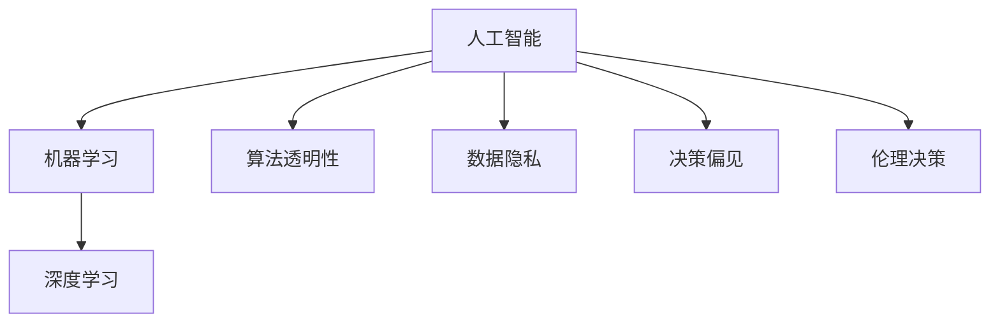

                 

# 伦理挑战：探讨人类计算带来的道德困境

## 1. 背景介绍

### 1.1 问题由来
在过去几十年中，人工智能(AI)技术飞速发展，从早期的专家系统到现代的深度学习模型，AI技术在各个领域得到了广泛应用。随着人类计算能力的提升，AI的应用范围不断扩展，从简单的自动化任务到复杂的决策支持系统，AI技术的渗透程度不断加深。

然而，这种进步伴随着一系列的道德困境和伦理问题。从数据隐私、算法透明性到决策偏见，AI技术的广泛应用引发了社会各界的广泛关注和讨论。特别是在涉及人类生命、财产等关键决策的场景下，AI技术的伦理问题尤为突出。本文旨在探讨这些道德困境，并探讨可能的解决方案。

### 1.2 问题核心关键点
AI技术的伦理问题主要集中在以下几个关键点：
- **数据隐私**：AI模型依赖大量的数据进行训练，这些数据往往包含个人隐私信息。如何在数据利用和隐私保护之间找到平衡，是一个亟待解决的问题。
- **算法透明性**：许多AI模型，尤其是深度学习模型，其决策过程非常复杂，难以解释和理解。这种“黑箱”性质可能引发不信任和法律责任问题。
- **决策偏见**：AI模型可能会继承其训练数据的固有偏见，导致不公平或歧视性决策。如何在模型设计和训练过程中消除偏见，是一个重要课题。
- **伦理决策**：AI系统在做出影响人类生命、财产等重大决策时，如何保证其符合人类的伦理标准和法律规范，是一个具有挑战性的问题。

这些核心关键点反映了AI技术在社会应用中可能带来的伦理困境，需要我们深入探讨并寻找解决方案。

## 2. 核心概念与联系

### 2.1 核心概念概述

为了更好地理解AI技术的伦理问题，我们首先需要明确几个核心概念：

- **人工智能(AI)**：指通过计算机程序模拟人类智能，实现数据处理、决策支持、自动化任务等功能的技术。
- **机器学习(ML)**：一种实现AI的技术手段，通过数据驱动的方法，让机器自主学习并提高性能。
- **深度学习(DL)**：一种特殊的机器学习方法，通过多层次的神经网络结构，实现高精度模式识别和决策。
- **算法透明性**：指AI模型的决策过程是否透明，即能否理解和解释模型是如何做出决策的。
- **数据隐私**：指个人数据在使用过程中的保护问题，包括数据的收集、存储和处理。
- **决策偏见**：指AI模型在决策过程中可能出现的系统性偏差，导致不公平或不合理的结果。
- **伦理决策**：指在AI系统做出影响人类生命、财产等重大决策时，如何保证其符合人类的伦理标准和法律规范。

这些概念之间的逻辑关系可以通过以下Mermaid流程图来展示：



这个流程图展示了几大核心概念之间的联系：

1. 人工智能通过机器学习和深度学习技术实现。
2. 算法透明性、数据隐私、决策偏见和伦理决策是影响人工智能技术应用的关键伦理问题。

## 3. 核心算法原理 & 具体操作步骤

### 3.1 算法原理概述

在AI技术的伦理问题中，算法透明性、数据隐私和决策偏见是最为突出的问题。下面将分别介绍这三个问题的核心算法原理。

### 3.2 算法步骤详解

#### 3.2.1 算法透明性

**步骤1: 选择算法和模型结构**  
首先，需要根据任务选择合适的算法和模型结构。对于需要解释和理解的模型，如决策树、线性回归等传统模型，其决策过程较为透明，易于解释。而对于复杂的深度学习模型，如卷积神经网络(CNN)、循环神经网络(RNN)等，其决策过程复杂，难以解释。

**步骤2: 训练模型**  
在训练模型时，可以通过可视化工具，如TensorBoard、ModelScope等，实时监测模型训练过程中的各项指标，帮助理解模型的学习过程。

**步骤3: 评估和解释模型**  
在模型训练完成后，可以使用可视化工具对模型进行解释，如通过LIME、SHAP等技术，解释模型对特定输入的预测结果。

**步骤4: 优化模型**  
根据解释结果，调整模型结构或优化算法，改善模型的解释性。

#### 3.2.2 数据隐私

**步骤1: 数据收集和预处理**  
在数据收集阶段，需要明确数据的来源和使用目的，确保数据收集过程合法合规。对数据进行去标识化、匿名化等预处理，以减少隐私泄露风险。

**步骤2: 数据存储和传输**  
在数据存储和传输过程中，使用加密技术，如AES、RSA等，保护数据安全。同时，限制数据访问权限，确保只有授权人员能够访问数据。

**步骤3: 数据使用和共享**  
在数据使用和共享阶段，采用差分隐私等技术，限制单个样本对模型训练的影响，保护个体隐私。

#### 3.2.3 决策偏见

**步骤1: 数据收集和标注**  
在数据收集阶段，确保数据集的多样性和代表性，避免因数据偏斜导致的偏见。在数据标注阶段，引入多样化的标注团队，减少标注偏差。

**步骤2: 模型训练和优化**  
在模型训练阶段，使用对抗性训练、重采样等技术，消除模型中的偏见。在模型优化阶段，通过公平性指标（如ROC曲线、准确率、召回率等）评估模型性能，调整模型参数。

**步骤3: 模型评估和测试**  
在模型评估和测试阶段，使用公平性测试工具，如Fairness Indicators等，检测模型是否存在偏见。

## 4. 数学模型和公式 & 详细讲解 & 举例说明

### 4.1 数学模型构建

在进行AI模型的伦理问题探讨时，可以使用数学模型和公式来描述和分析问题。

以深度学习模型为例，其核心数学模型包括：

- 神经网络结构：由输入层、隐藏层和输出层组成。
- 激活函数：如Sigmoid、ReLU、Tanh等，用于非线性变换。
- 损失函数：如均方误差(MSE)、交叉熵(Cross-Entropy)等，用于衡量模型预测与真实标签之间的差异。
- 优化器：如梯度下降法、Adam等，用于更新模型参数。

### 4.2 公式推导过程

以下以均方误差(MSE)损失函数为例，推导其公式：

$$
MSE = \frac{1}{n} \sum_{i=1}^n (y_i - \hat{y}_i)^2
$$

其中，$y_i$ 表示真实标签，$\hat{y}_i$ 表示模型预测值，$n$ 表示样本数。

在实际应用中，通过反向传播算法，计算模型预测值与真实标签之间的差异，更新模型参数。

### 4.3 案例分析与讲解

假设有一个用于信用评估的深度学习模型，其训练数据集包含不同年龄、性别、收入等特征的用户数据，以及他们的信用评分。在使用该模型进行信用评估时，需要注意：

1. 数据隐私：确保用户数据在收集、存储和传输过程中受到保护，避免隐私泄露。
2. 算法透明性：模型应当能够解释其决策过程，帮助用户理解模型为何做出特定信用评分。
3. 决策偏见：模型应当避免因数据偏斜导致的性别、种族等偏见，保证公平性。

## 5. 项目实践：代码实例和详细解释说明

### 5.1 开发环境搭建

在进行AI伦理问题的探讨时，开发环境搭建尤为重要。以下是使用Python进行TensorFlow开发的完整环境配置流程：

1. 安装Anaconda：从官网下载并安装Anaconda，用于创建独立的Python环境。

2. 创建并激活虚拟环境：
```bash
conda create -n tensorflow-env python=3.8 
conda activate tensorflow-env
```

3. 安装TensorFlow：根据CUDA版本，从官网获取对应的安装命令。例如：
```bash
conda install tensorflow==2.8.0 tensorflow-estimator tensorflow-addons
```

4. 安装TensorBoard：
```bash
pip install tensorboard
```

5. 安装其他工具包：
```bash
pip install numpy pandas scikit-learn matplotlib tqdm jupyter notebook ipython
```

完成上述步骤后，即可在`tensorflow-env`环境中开始伦理问题的探讨实践。

### 5.2 源代码详细实现

以下是一个使用TensorFlow实现信用评估模型的示例代码：

```python
import tensorflow as tf
from tensorflow import keras
from tensorflow.keras import layers
from tensorflow.keras.datasets import mnist

# 定义模型
model = keras.Sequential([
    layers.Dense(128, activation='relu', input_shape=(784,)),
    layers.Dropout(0.2),
    layers.Dense(10, activation='softmax')
])

# 编译模型
model.compile(optimizer='adam',
              loss='sparse_categorical_crossentropy',
              metrics=['accuracy'])

# 加载数据集
(x_train, y_train), (x_test, y_test) = mnist.load_data()

# 数据预处理
x_train = x_train / 255.0
x_test = x_test / 255.0

# 模型训练
model.fit(x_train, y_train, epochs=10, batch_size=32, validation_data=(x_test, y_test))

# 模型评估
model.evaluate(x_test, y_test)
```

### 5.3 代码解读与分析

让我们再详细解读一下关键代码的实现细节：

**模型定义**：
- `Sequential`：定义一个线性序列模型。
- `Dense`：定义一个全连接层。
- `Dropout`：在训练过程中随机丢弃一部分神经元，防止过拟合。
- `softmax`：输出层使用softmax激活函数，适用于多分类任务。

**模型编译**：
- `adam`：使用Adam优化器。
- `sparse_categorical_crossentropy`：使用稀疏分类交叉熵损失函数。
- `accuracy`：定义模型评估指标为准确率。

**数据加载和预处理**：
- `mnist.load_data()`：加载MNIST数据集。
- `x_train = x_train / 255.0`：对输入数据进行归一化处理。
- `y_train`：获取标签数据。

**模型训练**：
- `model.fit()`：进行模型训练。
- `epochs`：训练轮数。
- `batch_size`：批大小。
- `validation_data`：验证集。

**模型评估**：
- `model.evaluate()`：进行模型评估。

可以看到，TensorFlow提供了便捷的API，帮助开发者快速搭建和训练模型。通过这些工具，我们可以更深入地探讨AI伦理问题，并在实际应用中不断优化模型。

### 5.4 运行结果展示

在模型训练完成后，可以使用TensorBoard对模型进行可视化：

1. 启动TensorBoard服务器：
```bash
tensorboard --logdir=logs
```

2. 打开TensorBoard界面：
```bash
open http://localhost:6006
```

在TensorBoard界面中，可以查看模型训练的损失曲线、准确率曲线等，帮助理解模型的训练过程。

## 6. 实际应用场景

### 6.1 信用评估系统

在信用评估系统中，AI模型需要处理大量个人数据，如收入、信用记录等。为了保护数据隐私，需要采取以下措施：

1. 数据匿名化：对用户数据进行去标识化处理，保护用户隐私。
2. 数据加密：使用加密技术保护数据在传输和存储过程中的安全。
3. 数据访问控制：限制数据访问权限，确保只有授权人员能够访问数据。

### 6.2 智能推荐系统

智能推荐系统广泛用于电商、视频、社交网络等领域，其决策过程涉及用户的个人信息和行为数据。为了保护用户隐私，需要采取以下措施：

1. 数据最小化：只收集必要的用户数据，减少数据泄露风险。
2. 用户控制：让用户自主决定哪些数据可以被用于推荐系统。
3. 差分隐私：在推荐模型训练过程中使用差分隐私技术，保护用户隐私。

### 6.3 医疗诊断系统

医疗诊断系统在处理患者数据时，需要保证数据的安全和隐私。为了保护患者隐私，需要采取以下措施：

1. 数据去标识化：对患者数据进行去标识化处理，保护患者隐私。
2. 数据加密：使用加密技术保护数据在传输和存储过程中的安全。
3. 数据访问控制：限制数据访问权限，确保只有授权人员能够访问数据。

## 7. 工具和资源推荐

### 7.1 学习资源推荐

为了帮助开发者系统掌握AI伦理问题的理论基础和实践技巧，这里推荐一些优质的学习资源：

1. 《人工智能伦理基础》书籍：全面介绍AI伦理问题的核心概念和关键技术。
2. 《数据隐私保护》课程：由数据隐私领域的专家开设，涵盖数据隐私保护的关键技术和法律法规。
3. 《算法透明性》课程：讲解算法透明性的原理和实践方法。
4. 《决策偏见与公平性》书籍：介绍如何识别和消除决策偏见，实现公平性。
5. 《伦理决策》课程：探讨AI系统在做出重大决策时的伦理标准和法律规范。

通过对这些资源的学习实践，相信你一定能够快速掌握AI伦理问题的精髓，并用于解决实际的AI问题。

### 7.2 开发工具推荐

高效的开发离不开优秀的工具支持。以下是几款用于AI伦理问题探讨开发的常用工具：

1. TensorFlow：基于Python的开源深度学习框架，灵活动态的计算图，适合快速迭代研究。
2. PyTorch：基于Python的开源深度学习框架，动态计算图，支持各种深度学习模型的搭建和训练。
3. TensorBoard：TensorFlow配套的可视化工具，实时监测模型训练状态，并提供丰富的图表呈现方式。
4. Weights & Biases：模型训练的实验跟踪工具，可以记录和可视化模型训练过程中的各项指标，方便对比和调优。
5. Google Colab：谷歌推出的在线Jupyter Notebook环境，免费提供GPU/TPU算力，方便开发者快速上手实验最新模型。

合理利用这些工具，可以显著提升AI伦理问题探讨的开发效率，加快创新迭代的步伐。

### 7.3 相关论文推荐

AI伦理问题的发展源于学界的持续研究。以下是几篇奠基性的相关论文，推荐阅读：

1. "Data Privacy-Preserving Techniques for Deep Learning"：介绍如何保护数据隐私的多种技术，包括差分隐私、联邦学习等。
2. "Algorithmic Fairness: A Survey of Prevalent Problems, Methods, and Future Directions"：全面综述了算法公平性问题的核心概念和解决方法。
3. "Understanding the Impact of Algorithmic Bias"：探讨算法偏见的影响和消除方法。
4. "Ethics in AI"：讨论AI伦理问题的核心概念和伦理标准。
5. "AI Systems in Justice"：探讨AI系统在司法、医疗等领域的伦理问题。

这些论文代表了大规模AI伦理问题的发展脉络。通过学习这些前沿成果，可以帮助研究者把握学科前进方向，激发更多的创新灵感。

## 8. 总结：未来发展趋势与挑战

### 8.1 总结

本文对AI技术的伦理问题进行了全面系统的探讨。首先阐述了数据隐私、算法透明性和决策偏见等核心伦理问题的背景和重要性，明确了这些问题是制约AI技术应用的重要障碍。其次，从原理到实践，详细讲解了这些问题的算法原理和具体操作步骤，给出了AI伦理问题探讨的完整代码实例。同时，本文还广泛探讨了这些问题在信用评估、智能推荐、医疗诊断等多个领域的应用场景，展示了AI伦理问题的广泛影响。

通过本文的系统梳理，可以看到，AI技术的伦理问题在实际应用中面临诸多挑战，需要在数据隐私、算法透明性、决策偏见等多个维度进行全面优化。只有在数据、算法、工程、伦理等多个层面进行协同发力，才能真正实现AI技术的良性发展。

### 8.2 未来发展趋势

展望未来，AI伦理问题将呈现以下几个发展趋势：

1. 数据隐私保护技术不断进步。差分隐私、联邦学习等隐私保护技术将更加成熟，可以更好地保护用户数据。
2. 算法透明性成为共识。越来越多的模型将使用可解释模型，如决策树、逻辑回归等，帮助理解模型的决策过程。
3. 公平性成为焦点。如何消除决策偏见，实现公平性，将是未来的研究热点。
4. 伦理决策框架完善。随着AI系统在决策中的作用日益增大，伦理决策框架将更加完善，确保AI系统的决策符合人类的伦理标准和法律规范。

这些趋势凸显了AI伦理问题的广泛影响，预示着AI技术在社会应用中的不断进步。

### 8.3 面临的挑战

尽管AI伦理问题得到了广泛关注，但在迈向更加智能化、普适化应用的过程中，仍面临诸多挑战：

1. 隐私保护技术挑战。差分隐私等隐私保护技术在实际应用中仍存在一些问题，如数据泄露风险、性能损失等。
2. 算法透明性难题。复杂的深度学习模型难以解释，仍需要进一步的研究和优化。
3. 决策偏见消除困难。消除决策偏见是一个复杂的问题，需要跨学科的协作。
4. 伦理决策框架滞后。如何在AI系统做出重大决策时确保其符合伦理标准和法律规范，仍需要更多理论和实践的积累。

### 8.4 研究展望

面对AI伦理问题面临的挑战，未来的研究需要在以下几个方面寻求新的突破：

1. 引入伦理决策框架。在AI系统设计中引入伦理决策框架，确保其决策符合伦理标准和法律规范。
2. 开发可解释性模型。引入符号化的先验知识，增强模型的可解释性，帮助理解模型决策过程。
3. 融合伦理和社会价值观。在AI系统训练过程中，引入伦理和社会价值观，避免模型输出不合理的结果。
4. 跨学科研究。加强AI伦理问题的跨学科研究，结合法律、社会学、心理学等领域，全面提升AI伦理水平。

这些研究方向的探索，必将引领AI伦理问题迈向更高的台阶，为构建安全、可靠、可解释、可控的智能系统铺平道路。面向未来，AI伦理问题还需要与其他人工智能技术进行更深入的融合，如知识表示、因果推理、强化学习等，多路径协同发力，共同推动人工智能技术的发展和应用。只有勇于创新、敢于突破，才能不断拓展AI技术的边界，让人工智能更好地造福人类社会。

---

作者：禅与计算机程序设计艺术 / Zen and the Art of Computer Programming

