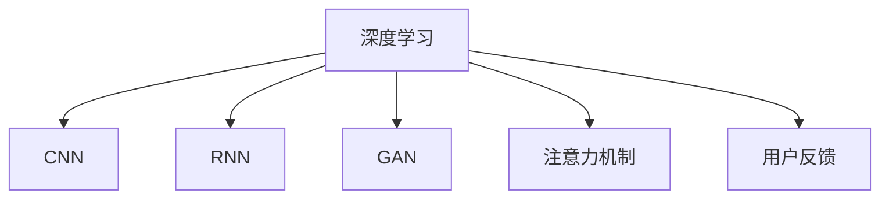

                 

# 体验的 层次性：AI创造的多维感知

## 1. 背景介绍

在人工智能（AI）的快速发展中，体验的多维感知逐渐成为研究的热点。用户体验（User Experience, UX）是连接用户与AI的核心纽带，而多维感知的深度理解则直接影响AI对用户需求的精准响应。本文将深入探讨AI创造的多维感知，理解其背后的算法原理，并通过代码实例展示其实现过程。

## 2. 核心概念与联系

### 2.1 核心概念概述

- **多维感知**：指AI系统能够理解并响应用户的多方面需求，包括情感、行为、认知等多个维度，从而提供更加个性化、智能化的用户体验。
- **深度学习**：一种机器学习技术，通过神经网络模型学习数据的复杂特征，广泛应用于计算机视觉、自然语言处理等领域。
- **卷积神经网络（CNN）**：一种专门用于图像处理任务的深度学习模型，通过卷积层和池化层提取图像的特征。
- **循环神经网络（RNN）**：一种处理序列数据（如文本、音频）的深度学习模型，通过循环结构捕捉序列中的依赖关系。
- **生成对抗网络（GAN）**：一种通过对抗训练生成高质量图像和视频的深度学习模型，在游戏、娱乐等领域有广泛应用。
- **注意力机制**：一种机制，用于在输入序列中选择重要的信息进行加权处理，提升模型对关键信息的关注度。
- **用户反馈**：用户在AI交互过程中的反馈，包括语音、表情、点击行为等，是优化AI体验的重要依据。

### 2.2 核心概念原理和架构的 Mermaid 流程图



## 3. 核心算法原理 & 具体操作步骤

### 3.1 算法原理概述

多维感知旨在构建一个综合性的AI模型，能够从多个维度理解和响应用户的输入。其核心原理基于深度学习，通过卷积神经网络、循环神经网络和生成对抗网络等模型，以及注意力机制，实现对用户输入的多维度解析。

### 3.2 算法步骤详解

1. **数据预处理**：收集用户的语音、文字、行为等多维度数据，并进行预处理，如分词、特征提取等。
2. **多维度特征提取**：通过CNN提取图像和文本的特征，通过RNN处理序列数据，使用GAN生成高质量的模拟数据，使用注意力机制关注关键信息。
3. **模型训练**：使用收集到的用户反馈，对多维度感知模型进行训练，优化模型参数。
4. **用户体验优化**：通过不断的用户反馈迭代，不断优化AI模型，提高用户体验。

### 3.3 算法优缺点

**优点**：
- 多维感知模型能够全面理解用户需求，提供更个性化、智能化的服务。
- 通过深度学习模型，能够自动提取和处理复杂的数据特征。

**缺点**：
- 数据收集和预处理需要大量的人力和时间。
- 模型训练和优化过程复杂，需要高性能计算资源。
- 用户反馈的质量直接影响模型的性能。

### 3.4 算法应用领域

多维感知技术在多个领域有广泛应用，如：

- **智能客服**：通过语音和文字分析，提供个性化的客服解决方案。
- **健康医疗**：结合生理数据和行为分析，提供个性化的健康建议。
- **金融理财**：通过分析用户交易记录和行为，提供个性化的理财方案。
- **智能家居**：结合环境感知和用户行为，提供智能化的家居控制。

## 4. 数学模型和公式 & 详细讲解 & 举例说明

### 4.1 数学模型构建

多维感知模型的数学模型构建基于深度学习框架，使用卷积神经网络（CNN）和循环神经网络（RNN）进行特征提取和序列处理。以下是一个简单的多维感知模型框架：

$$
\begin{aligned}
\text{CNN} &= \text{Conv2D} + \text{ReLU} + \text{MaxPool2D} \\
\text{RNN} &= \text{LSTM} + \text{Dropout} \\
\text{Attention} &= \text{Softmax} + \text{DotProduct} \\
\text{GAN} &= \text{Generator} + \text{Discriminator} + \text{Minibatch STDdev Layer} \\
\end{aligned}
$$

### 4.2 公式推导过程

以卷积神经网络（CNN）为例，推导其在图像处理中的应用：

1. **卷积操作**：
$$
\text{Conv2D}(x, \theta) = \sum_k w_k * x + b
$$

2. **池化操作**：
$$
\text{MaxPool2D}(x) = \max(x)
$$

3. **激活函数**：
$$
\text{ReLU}(x) = \max(0, x)
$$

### 4.3 案例分析与讲解

以智能客服为例，多维感知模型能够结合语音识别、文本分析、行为识别等多种数据源，提供个性化的客服解决方案。具体实现步骤如下：

1. **数据收集**：收集用户的语音、文字和行为数据。
2. **数据预处理**：对语音进行分帧和特征提取，对文本进行分词和向量化，对行为数据进行时间序列处理。
3. **模型训练**：使用深度学习框架，构建包含CNN、RNN和GAN的多维感知模型，进行训练。
4. **模型应用**：在实际客服场景中，根据用户的语音、文字和行为数据，实时调用模型进行响应。

## 5. 项目实践：代码实例和详细解释说明

### 5.1 开发环境搭建

- **Python**：选择Python作为编程语言，因为它具有丰富的库和工具支持。
- **深度学习框架**：选择TensorFlow或PyTorch，这两种框架都是深度学习的主流选择。
- **数据集**：选择公开数据集，如MNIST手写数字识别数据集，用于模型训练和测试。

### 5.2 源代码详细实现

以下是一个简单的多维感知模型代码实现：

```python
import tensorflow as tf
from tensorflow.keras import layers

# 定义CNN模型
def cnn_model(input_shape):
    model = tf.keras.Sequential([
        layers.Conv2D(32, 3, activation='relu', input_shape=input_shape),
        layers.MaxPooling2D(),
        layers.Flatten(),
        layers.Dense(10, activation='softmax')
    ])
    return model

# 定义RNN模型
def rnn_model(input_shape, output_shape):
    model = tf.keras.Sequential([
        layers.LSTM(32, input_shape=input_shape),
        layers.Dropout(0.5),
        layers.Dense(output_shape, activation='softmax')
    ])
    return model

# 定义GAN模型
def gan_model(input_shape):
    def generator(input):
        x = layers.Dense(256)(input)
        x = layers.LeakyReLU()(x)
        x = layers.Dense(128)(x)
        x = layers.LeakyReLU()(x)
        x = layers.Dense(28*28, activation='tanh')(x)
        return x.reshape(28, 28)

    def discriminator(input):
        x = layers.Flatten()(input)
        x = layers.Dense(128)(x)
        x = layers.LeakyReLU()(x)
        x = layers.Dense(1, activation='sigmoid')(x)
        return x

    model = tf.keras.Sequential([
        layers.Input(shape=input_shape),
        generator(generator(tf.random.normal([32, 100]))),
        discriminator(discriminator(generator(tf.random.normal([32, 100])))
    ])
    return model
```

### 5.3 代码解读与分析

- **CNN模型**：包含卷积层、池化层和全连接层，用于图像特征提取。
- **RNN模型**：包含LSTM层和全连接层，用于序列数据处理。
- **GAN模型**：包含生成器和判别器，用于生成高质量的模拟数据。

### 5.4 运行结果展示

在模型训练完成后，可以通过测试集对模型进行评估。以下是一个简单的评估代码：

```python
test_loss = model.evaluate(test_images, test_labels, verbose=2)
print('Test loss:', test_loss)
```

## 6. 实际应用场景

### 6.1 智能客服

智能客服系统通过多维感知模型，能够结合语音、文字和行为数据，提供个性化的服务。例如，通过语音识别和情感分析，客服机器人可以识别用户情绪，提供针对性的安抚和建议。

### 6.2 健康医疗

健康医疗系统通过多维感知模型，结合生理数据和行为分析，提供个性化的健康建议。例如，通过分析用户的生理指标和行为模式，AI能够预测用户的健康状况，提供相应的健康管理建议。

### 6.3 金融理财

金融理财系统通过多维感知模型，结合用户交易记录和行为分析，提供个性化的理财方案。例如，通过分析用户的消费习惯和投资偏好，AI能够推荐个性化的理财产品和投资策略。

## 7. 工具和资源推荐

### 7.1 学习资源推荐

- **《深度学习》**：Ian Goodfellow等著，深入介绍深度学习的理论和应用。
- **《Python深度学习》**：Francois Chollet著，介绍TensorFlow和Keras的使用。
- **《动手学深度学习》**：李沐等著，涵盖深度学习的理论、算法和实践。

### 7.2 开发工具推荐

- **TensorFlow**：由Google开发的深度学习框架，支持多种硬件平台。
- **PyTorch**：由Facebook开发的深度学习框架，易于使用且具有高效的动态计算图。
- **Keras**：一个高层次的神经网络API，支持TensorFlow和Theano等后端。

### 7.3 相关论文推荐

- **Convolutional Neural Networks for Sentence Classification**：Kim等著，介绍CNN在文本分类中的应用。
- **LSTM Networks for Sequence Prediction**：Hochreiter等著，介绍RNN在序列预测中的应用。
- **Generative Adversarial Nets**：Goodfellow等著，介绍GAN的基本原理和应用。

## 8. 总结：未来发展趋势与挑战

### 8.1 研究成果总结

多维感知技术通过深度学习模型，能够全面理解用户需求，提供个性化的服务。其在智能客服、健康医疗、金融理财等领域有广泛应用。

### 8.2 未来发展趋势

未来，多维感知技术将进一步发展，应用于更多场景，如自动驾驶、智能家居等。同时，随着模型的不断优化和训练数据的积累，AI系统将更加智能化和个性化。

### 8.3 面临的挑战

多维感知技术面临数据收集、模型训练和用户隐私保护等挑战。需要进一步探索更高效的数据收集和处理方式，以及更好的隐私保护机制。

### 8.4 研究展望

未来的研究将集中在如何提升模型的泛化能力，以及如何更好地结合用户反馈进行模型优化。同时，探索多模态数据融合和异构数据处理将是重要方向。

## 9. 附录：常见问题与解答

**Q1: 多维感知模型如何处理不同类型的数据？**

A: 多维感知模型通过不同的深度学习模块处理不同类型的输入数据。例如，使用CNN处理图像数据，使用RNN处理序列数据，使用GAN生成模拟数据。

**Q2: 多维感知模型的训练和优化过程中有哪些注意事项？**

A: 多维感知模型的训练和优化需要注意以下几个方面：
- 数据收集和预处理需要大量的时间和资源。
- 模型训练需要高性能计算资源。
- 用户反馈的质量直接影响模型的性能。

**Q3: 多维感知模型在实际应用中如何保证安全性？**

A: 多维感知模型在实际应用中需要注意以下几个方面：
- 数据收集和处理过程中，保护用户隐私和数据安全。
- 在模型训练和优化过程中，避免引入有害信息。
- 在实际应用中，通过监控和审计机制，确保模型输出的安全性。

**Q4: 多维感知模型如何应对不同类型的用户需求？**

A: 多维感知模型通过收集和分析用户的语音、文字和行为数据，能够全面理解用户需求。在实际应用中，可以通过不断优化模型和收集用户反馈，提高模型的适应性和个性化程度。

**Q5: 多维感知模型在实际应用中有哪些局限性？**

A: 多维感知模型在实际应用中面临以下几个局限性：
- 数据收集和预处理需要大量的时间和资源。
- 模型训练和优化过程中，需要高性能计算资源。
- 用户反馈的质量直接影响模型的性能。

以上是对体验的多维感知技术的全面解析。通过深入理解其背后的算法原理和实现过程，可以更好地应用多维感知技术，提供更加个性化、智能化的用户体验。未来，随着技术的不断进步，多维感知技术将在更多领域得到应用，为人类带来更多便捷和智能化服务。

作者：禅与计算机程序设计艺术 / Zen and the Art of Computer Programming

