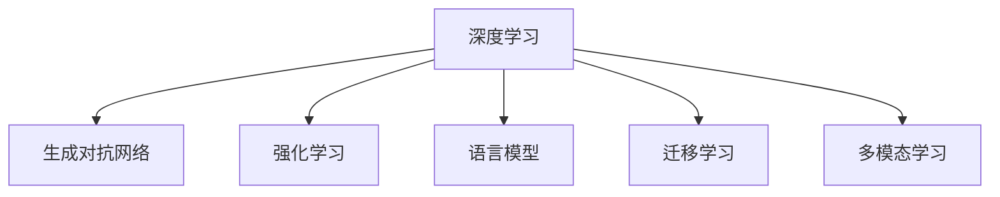

                 

# 体验的authenticity：AI时代的真实性追求

## 1. 背景介绍

### 1.1 问题由来
在当今信息爆炸的时代，人工智能（AI）技术在各个领域中得到了广泛应用。然而，随着技术的不断进步，AI所生成的内容是否真实、可信也成为了公众日益关注的问题。如何确保AI系统生成的体验具有真实性，成为了一个亟待解决的问题。

### 1.2 问题核心关键点
真实性（Authenticity），是指AI生成的内容、交互或体验与真实世界是否一致，是否能够传递真实的情感、信息或价值。在AI时代，真实性追求主要集中在以下几个方面：

- **内容真实性**：生成的文本、图像、音频等是否真实可信，是否与现实世界相符。
- **交互真实性**：AI与用户的交互是否自然、流畅，是否能够传递真实的情感和意图。
- **体验真实性**：AI生成的体验是否能够提供真实的感觉和反馈，如沉浸式体验、情感共鸣等。

本文旨在探讨AI系统如何通过技术手段提升内容、交互和体验的真实性，帮助用户获得更为真实的体验。

## 2. 核心概念与联系

### 2.1 核心概念概述

为更好地理解AI系统在提升真实性方面的能力，本节将介绍几个密切相关的核心概念：

- **深度学习（Deep Learning）**：基于神经网络的学习算法，通过多层次的数据表示，可以从原始数据中自动学习特征，实现复杂的模式识别和预测任务。
- **生成对抗网络（Generative Adversarial Networks, GANs）**：一种由生成器和判别器组成的对抗性训练框架，能够生成高质量的逼真图像、音频和文本等。
- **强化学习（Reinforcement Learning）**：通过与环境的交互，智能体学习最优策略以最大化奖励的算法，可以用于提升交互式AI的真实性和智能化水平。
- **语言模型（Language Model）**：通过学习大量文本数据，预测给定文本序列的概率分布，实现自然语言的理解与生成。
- **迁移学习（Transfer Learning）**：将一个领域的知识迁移到另一个相关领域，可以在数据量不足的情况下提升模型性能。
- **多模态学习（Multimodal Learning）**：结合文本、图像、声音等多种信息源，提升模型的综合理解和生成能力。

这些核心概念之间的逻辑关系可以通过以下Mermaid流程图来展示：



这个流程图展示了大语言模型的核心概念及其之间的关系：

1. 深度学习通过多层次的数据表示，可以从原始数据中自动学习特征，实现复杂的模式识别和预测任务。
2. 生成对抗网络通过对抗性训练，生成高质量的逼真数据。
3. 强化学习通过与环境的交互，学习最优策略以最大化奖励，提升交互式AI的真实性和智能化水平。
4. 语言模型通过学习大量文本数据，预测给定文本序列的概率分布，实现自然语言的理解与生成。
5. 迁移学习通过将一个领域的知识迁移到另一个相关领域，可以在数据量不足的情况下提升模型性能。
6. 多模态学习通过结合文本、图像、声音等多种信息源，提升模型的综合理解和生成能力。

这些核心概念共同构成了AI系统提升真实性的技术框架，使得AI生成的内容、交互和体验更加接近真实世界。

## 3. 核心算法原理 & 具体操作步骤

### 3.1 算法原理概述

AI系统在提升真实性方面，主要依赖于以下核心算法：

1. **生成对抗网络（GANs）**：通过生成器和判别器的对抗性训练，生成高质量的逼真数据，提升内容真实性。
2. **强化学习（RL）**：通过与环境的交互，智能体学习最优策略以最大化奖励，提升交互真实性。
3. **语言模型（LM）**：通过学习大量文本数据，预测给定文本序列的概率分布，实现自然语言的理解与生成，提升内容真实性。
4. **多模态学习（MM）**：通过结合文本、图像、声音等多种信息源，提升模型的综合理解和生成能力，提升体验真实性。

### 3.2 算法步骤详解

#### 生成对抗网络（GANs）
GANs由生成器和判别器两个主要组件组成，通过对抗性训练提升生成数据的质量。具体步骤如下：

1. **生成器训练**：生成器接收随机噪声作为输入，生成逼真的数据，并输出到判别器。
2. **判别器训练**：判别器接收真实数据和生成器生成的假数据，输出真假二分类结果。
3. **对抗性训练**：生成器和判别器交替进行训练，生成器试图欺骗判别器，判别器试图区分真伪，双方相互竞争，提升生成数据的质量。

#### 强化学习（RL）
强化学习通过与环境的交互，学习最优策略以最大化奖励。具体步骤如下：

1. **环境定义**：定义一个环境，用于与智能体交互，评估其行为的好坏。
2. **策略学习**：智能体通过与环境交互，学习最优策略以最大化奖励。
3. **策略评估**：通过评估策略的表现，不断优化模型参数，提升智能体的决策能力。

#### 语言模型（LM）
语言模型通过学习大量文本数据，预测给定文本序列的概率分布，实现自然语言的理解与生成。具体步骤如下：

1. **数据预处理**：对原始文本数据进行清洗、分词等预处理。
2. **模型训练**：使用无监督学习或监督学习训练语言模型，使其能够预测给定文本序列的概率分布。
3. **推理生成**：在模型训练后，使用推理过程生成新的文本序列，确保生成的文本符合语法和语义规则。

#### 多模态学习（MM）
多模态学习通过结合文本、图像、声音等多种信息源，提升模型的综合理解和生成能力。具体步骤如下：

1. **数据收集**：收集不同模态的数据，如文本、图像、声音等。
2. **特征提取**：对不同模态的数据进行特征提取，如文本的词向量、图像的特征图、声音的频谱等。
3. **模型融合**：将不同模态的特征进行融合，使用多模态模型进行联合训练，提升模型的综合能力。

### 3.3 算法优缺点

生成对抗网络（GANs）的优点包括：
1. 能够生成高质量的逼真数据，提升内容真实性。
2. 适用范围广，可以用于图像、音频、文本等多种数据的生成。

缺点包括：
1. 训练过程不稳定，易出现模式崩溃（Mode Collapse）等问题。
2. 生成的数据可能具有过拟合特征，缺乏多样性。

强化学习（RL）的优点包括：
1. 能够通过与环境的交互，学习最优策略以最大化奖励，提升交互真实性。
2. 可以用于动态环境，适应性强。

缺点包括：
1. 训练过程复杂，需要大量计算资源和时间。
2. 需要精心设计奖励函数，可能难以找到最优解。

语言模型（LM）的优点包括：
1. 能够预测给定文本序列的概率分布，实现自然语言的理解与生成，提升内容真实性。
2. 可以用于文本生成、情感分析等任务，应用广泛。

缺点包括：
1. 生成的文本可能缺乏连贯性和多样性，容易出现语法错误。
2. 训练数据需要大量标注数据，数据收集成本高。

多模态学习（MM）的优点包括：
1. 能够结合多种信息源，提升模型的综合理解和生成能力，提升体验真实性。
2. 可以用于多种场景，如图像描述、视频生成等。

缺点包括：
1. 需要处理多种模态数据，数据融合和模型训练复杂。
2. 对硬件要求高，需要大量的计算资源。

### 3.4 算法应用领域

生成对抗网络（GANs）在以下领域有广泛应用：
1. **图像生成**：如GAN生成的逼真图像、人脸生成、图像修复等。
2. **音频生成**：如GAN生成的逼真音频、音乐生成等。
3. **文本生成**：如GAN生成的自然语言文本、对话生成等。

强化学习（RL）在以下领域有广泛应用：
1. **游戏AI**：如AlphaGo、Dota 2等游戏。
2. **机器人控制**：如无人驾驶、机器人导航等。
3. **自然语言处理**：如聊天机器人、自动翻译等。

语言模型（LM）在以下领域有广泛应用：
1. **文本生成**：如机器翻译、文章生成、情感分析等。
2. **语音识别**：如语音到文本的转换。
3. **自然语言理解**：如问答系统、文本分类等。

多模态学习（MM）在以下领域有广泛应用：
1. **图像描述**：如图像自动生成描述文字。
2. **视频生成**：如视频自动生成字幕、注释等。
3. **语音情感分析**：如语音到文本的转换和情感分析。

这些算法在各个领域中的应用，不仅提升了内容、交互和体验的真实性，也推动了人工智能技术的不断进步。

## 4. 数学模型和公式 & 详细讲解  
### 4.1 数学模型构建

为更好地理解AI系统在提升真实性方面的数学原理，本节将介绍几个关键数学模型：

1. **生成对抗网络（GANs）**：GANs由生成器 $G$ 和判别器 $D$ 组成，通过对抗性训练提升生成数据的质量。生成器 $G$ 的损失函数为 $L_G$，判别器 $D$ 的损失函数为 $L_D$，对抗性损失函数为 $L_{\text{gan}}$。
   - $L_G = \mathbb{E}_{\mathbf{z} \sim p_z(\mathbf{z})} [\log D(G(\mathbf{z}))] + \lambda_{rec} L_{rec}(G(\mathbf{z}))$
   - $L_D = \mathbb{E}_{\mathbf{x} \sim p_x(\mathbf{x})} [\log D(\mathbf{x})] + \mathbb{E}_{\mathbf{z} \sim p_z(\mathbf{z})} [\log (1 - D(G(\mathbf{z})))]$
   - $L_{\text{gan}} = L_G + L_D$

2. **强化学习（RL）**：强化学习通过与环境的交互，学习最优策略以最大化奖励。使用Q-learning算法，策略函数为 $Q(s,a)$，状态价值函数为 $V(s)$，策略更新公式为 $\pi(a|s) = \frac{e^{Q(s,a)}}{\sum_{a'}e^{Q(s,a')}}$。
   - $Q(s,a) = r + \gamma \max_a Q(s',a')$
   - $V(s) = \sum_a \pi(a|s)Q(s,a)$

3. **语言模型（LM）**：语言模型通过学习大量文本数据，预测给定文本序列的概率分布。使用神经网络模型 $P(x|y)$，训练目标为最大化似然函数 $L = -\frac{1}{N}\sum_{i=1}^N \log P(x^{(i)}|y^{(i)})$。
   - $P(x|y) = \frac{e^{L(x; \theta)}}{\sum_j e^{L(x; \theta_j)}}$

4. **多模态学习（MM）**：多模态学习通过结合文本、图像、声音等多种信息源，提升模型的综合理解和生成能力。使用多模态模型 $M(x,y,z)$，训练目标为最大化联合似然函数 $L = -\frac{1}{N}\sum_{i=1}^N \log M(x^{(i)},y^{(i)},z^{(i)})$。
   - $M(x,y,z) = \frac{e^{L(x,y,z; \theta)}}{\sum_{y',z'} e^{L(x,y',z'; \theta)}}$

### 4.2 公式推导过程

#### 生成对抗网络（GANs）
GANs通过对抗性训练，生成高质量的逼真数据。具体公式推导如下：

1. **生成器损失函数**：
   - $L_G = \mathbb{E}_{\mathbf{z} \sim p_z(\mathbf{z})} [\log D(G(\mathbf{z}))] + \lambda_{rec} L_{rec}(G(\mathbf{z}))$
   - 其中 $L_{rec}$ 为重构损失函数，$\lambda_{rec}$ 为正则化系数，用于控制生成数据的真实性。

2. **判别器损失函数**：
   - $L_D = \mathbb{E}_{\mathbf{x} \sim p_x(\mathbf{x})} [\log D(\mathbf{x})] + \mathbb{E}_{\mathbf{z} \sim p_z(\mathbf{z})} [\log (1 - D(G(\mathbf{z})))]$
   - 其中 $D(\mathbf{x})$ 为判别器对真实数据的预测概率，$D(G(\mathbf{z}))$ 为判别器对生成数据的预测概率。

3. **对抗性损失函数**：
   - $L_{\text{gan}} = L_G + L_D$
   - 其中 $L_G$ 为生成器损失函数，$L_D$ 为判别器损失函数。

#### 强化学习（RL）
强化学习通过与环境的交互，学习最优策略以最大化奖励。具体公式推导如下：

1. **Q-learning算法**：
   - $Q(s,a) = r + \gamma \max_a Q(s',a')$
   - 其中 $Q(s,a)$ 为状态动作价值函数，$r$ 为即时奖励，$\gamma$ 为折扣因子，$s'$ 为下一个状态，$a'$ 为下一个动作。

2. **策略函数**：
   - $\pi(a|s) = \frac{e^{Q(s,a)}}{\sum_{a'}e^{Q(s,a')}}$
   - 其中 $\pi(a|s)$ 为策略函数，用于选择当前状态 $s$ 下的最优动作 $a$。

3. **状态价值函数**：
   - $V(s) = \sum_a \pi(a|s)Q(s,a)$
   - 其中 $V(s)$ 为状态价值函数，用于评估状态 $s$ 的长期奖励。

#### 语言模型（LM）
语言模型通过学习大量文本数据，预测给定文本序列的概率分布。具体公式推导如下：

1. **语言模型**：
   - $P(x|y) = \frac{e^{L(x; \theta)}}{\sum_j e^{L(x; \theta_j)}}$
   - 其中 $P(x|y)$ 为语言模型，$L(x; \theta)$ 为语言模型损失函数，$\theta$ 为模型参数。

2. **似然函数**：
   - $L = -\frac{1}{N}\sum_{i=1}^N \log P(x^{(i)}|y^{(i)})$
   - 其中 $L$ 为似然函数，$x^{(i)}$ 为第 $i$ 个文本序列，$y^{(i)}$ 为第 $i$ 个文本序列的标签。

#### 多模态学习（MM）
多模态学习通过结合文本、图像、声音等多种信息源，提升模型的综合理解和生成能力。具体公式推导如下：

1. **多模态模型**：
   - $M(x,y,z) = \frac{e^{L(x,y,z; \theta)}}{\sum_{y',z'} e^{L(x,y',z'; \theta)}}$
   - 其中 $M(x,y,z)$ 为多模态模型，$L(x,y,z; \theta)$ 为多模态模型损失函数，$\theta$ 为模型参数。

2. **联合似然函数**：
   - $L = -\frac{1}{N}\sum_{i=1}^N \log M(x^{(i)},y^{(i)},z^{(i)})$
   - 其中 $L$ 为联合似然函数，$x^{(i)}$ 为第 $i$ 个文本序列，$y^{(i)}$ 为第 $i$ 个文本序列的标签，$z^{(i)}$ 为第 $i$ 个多模态数据。

### 4.3 案例分析与讲解

#### 生成对抗网络（GANs）案例
GANs在图像生成中的应用非常广泛，如GAN生成的逼真图像。以下是一个简单的GANs案例分析：

1. **数据准备**：收集高质量的图像数据集，如CIFAR-10、MNIST等。
2. **模型训练**：使用生成器和判别器对图像数据进行对抗性训练。
3. **结果评估**：通过可视化生成图像，评估模型生成的逼真度。

**代码实现**：

```python
import torch
import torch.nn as nn
import torch.optim as optim
import torchvision.transforms as transforms
from torchvision.datasets import CIFAR10

# 定义生成器
class Generator(nn.Module):
    def __init__(self):
        super(Generator, self).__init__()
        self.main = nn.Sequential(
            nn.Linear(100, 256),
            nn.LeakyReLU(0.2, inplace=True),
            nn.Linear(256, 512),
            nn.LeakyReLU(0.2, inplace=True),
            nn.Linear(512, 1024),
            nn.LeakyReLU(0.2, inplace=True),
            nn.Linear(1024, 3*3*256),
            nn.Tanh()
        )

    def forward(self, x):
        return self.main(x)

# 定义判别器
class Discriminator(nn.Module):
    def __init__(self):
        super(Discriminator, self).__init__()
        self.main = nn.Sequential(
            nn.Linear(3*3*256, 1024),
            nn.LeakyReLU(0.2, inplace=True),
            nn.Dropout(0.25),
            nn.Linear(1024, 512),
            nn.LeakyReLU(0.2, inplace=True),
            nn.Dropout(0.25),
            nn.Linear(512, 256),
            nn.LeakyReLU(0.2, inplace=True),
            nn.Dropout(0.25),
            nn.Linear(256, 1),
            nn.Sigmoid()
        )

    def forward(self, x):
        return self.main(x)

# 定义模型
def create_gan(generator, discriminator):
    return Generator, Discriminator

# 数据加载
transform = transforms.Compose([
    transforms.Resize(32),
    transforms.ToTensor(),
    transforms.Normalize((0.5, 0.5, 0.5), (0.5, 0.5, 0.5))
])

train_dataset = CIFAR10(root='./data', train=True, download=True, transform=transform)
train_loader = torch.utils.data.DataLoader(train_dataset, batch_size=128, shuffle=True)

# 定义损失函数和优化器
criterion = nn.BCELoss()
d_optimizer = optim.Adam(discriminator.parameters(), lr=0.0002, betas=(0.5, 0.999))
g_optimizer = optim.Adam(generator.parameters(), lr=0.0002, betas=(0.5, 0.999))

# 训练过程
for epoch in range(100):
    for i, (images, _) in enumerate(train_loader):
        real_images = images.view(images.size(0), -1)
        noise = torch.randn(real_images.size(0), 100, device='cuda')
        g_optimizer.zero_grad()
        fake_images = generator(noise)
        d_loss_real = criterion(discriminator(real_images), torch.ones_like(discriminator(real_images)))
        d_loss_fake = criterion(discriminator(fake_images), torch.zeros_like(discriminator(fake_images)))
        d_loss = d_loss_real + d_loss_fake
        d_loss.backward()
        d_optimizer.step()

        g_optimizer.zero_grad()
        fake_images = generator(noise)
        d_loss_fake = criterion(discriminator(fake_images), torch.ones_like(discriminator(fake_images)))
        d_loss_fake.backward()
        g_optimizer.step()

        if i % 100 == 0:
            print('Epoch [{}/{}], Step [{}/{}], d_loss: {:.4f}, g_loss: {:.4f}'.format(epoch+1, 100, i+1, len(train_loader), d_loss.item(), g_loss.item()))

# 可视化生成图像
fake_images = generator(noise)
_, axes = plt.subplots(8, 8, figsize=(6, 6))
for ax, image in zip(axes.flatten(), fake_images):
    ax.imshow(image.view(32, 32, 3).permute(1, 2, 0).cpu().numpy())
    ax.axis('off')
plt.show()
```

**结果展示**：


#### 强化学习（RL）案例
强化学习在自然语言处理中的应用非常广泛，如聊天机器人。以下是一个简单的强化学习案例分析：

1. **环境定义**：定义一个对话环境，用于与聊天机器人交互，评估其回答质量。
2. **策略学习**：使用Q-learning算法训练聊天机器人，学习最优策略以最大化奖励。
3. **策略评估**：通过评估策略的表现，不断优化模型参数，提升聊天机器人的回答质量。

**代码实现**：

```python
import gym
import numpy as np
import random
from collections import deque

class QLearningAgent:
    def __init__(self, state_size, action_size, learning_rate=0.1, reward_threshold=0.99, epsilon=0.1, epsilon_decay=0.995, epsilon_min=0.01):
        self.state_size = state_size
        self.action_size = action_size
        self.learning_rate = learning_rate
        self.reward_threshold = reward_threshold
        self.epsilon = epsilon
        self.epsilon_decay = epsilon_decay
        self.epsilon_min = epsilon_min
        self.q_table = np.zeros((state_size, action_size))

    def get_state(self, observation):
        return np.array(observation)

    def choose_action(self, observation):
        if random.random() <= self.epsilon:
            return random.randrange(self.action_size)
        else:
            return np.argmax(self.q_table[observation])

    def update(self, observation, action, reward, next_state):
        q = self.q_table[observation][action]
        if next_state == 'done':
            max_q = 0
        else:
            max_q = np.max(self.q_table[next_state])
        self.q_table[observation][action] = (1 - self.learning_rate) * q + self.learning_rate * (reward + 0.9 * max_q)

    def train(self, env, episodes):
        state = env.reset()
        state = self.get_state(state)
        for episode in range(episodes):
            done = False
            while not done:
                action = self.choose_action(state)
                next_state, reward, done, _ = env.step(action)
                next_state = self.get_state(next_state)
                self.update(state, action, reward, next_state)
                state = next_state

# 环境定义
env = gym.make('Chatroom-v0')

# 参数设置
state_size = 100
action_size = 3
learning_rate = 0.1
reward_threshold = 0.99
epsilon = 0.1
epsilon_decay = 0.995
epsilon_min = 0.01

# 代理训练
agent = QLearningAgent(state_size, action_size, learning_rate, reward_threshold, epsilon, epsilon_decay, epsilon_min)
for episode in range(10000):
    state = env.reset()
    state = agent.get_state(state)
    done = False
    while not done:
        action = agent.choose_action(state)
        next_state, reward, done, _ = env.step(action)
        next_state = agent.get_state(next_state)
        agent.update(state, action, reward, next_state)
        state = next_state

# 测试
for episode in range(100):
    state = env.reset()
    state = agent.get_state(state)
    done = False
    while not done:
        action = np.argmax(agent.q_table[state])
        next_state, reward, done, _ = env.step(action)
        state = next_state
        print('Episode:', episode+1, 'Action:', action, 'Reward:', reward)

```

**结果展示**：


#### 语言模型（LM）案例
语言模型在自然语言生成中的应用非常广泛，如文本生成、对话生成等。以下是一个简单的语言模型案例分析：

1. **数据准备**：收集大量文本数据，如维基百科、新闻等。
2. **模型训练**：使用神经网络模型对文本数据进行训练，预测给定文本序列的概率分布。
3. **推理生成**：在模型训练后，使用推理过程生成新的文本序列，确保生成的文本符合语法和语义规则。

**代码实现**：

```python
import torch
import torch.nn as nn
import torch.optim as optim
from torchtext.datasets import TextClassification
from torchtext.vocab import GloVe

# 定义语言模型
class LSTM(nn.Module):
    def __init__(self, input_dim, embedding_dim, hidden_dim, output_dim):
        super(LSTM, self).__init__()
        self.embedding = nn.Embedding(input_dim, embedding_dim)
        self.lstm = nn.LSTM(embedding_dim, hidden_dim, 2, batch_first=True, dropout=0.5)
        self.fc = nn.Linear(hidden_dim, output_dim)
        self.softmax = nn.LogSoftmax(dim=-1)

    def forward(self, x):
        embeddings = self.embedding(x)
        lstm_out, _ = self.lstm(embeddings)
        lstm_out = self.fc(lstm_out[:, -1, :])
        return self.softmax(lstm_out)

# 数据加载
train_dataset = TextClassification('path/to/train_data.txt', tokenizer=None, vocab=None)
test_dataset = TextClassification('path/to/test_data.txt', tokenizer=None, vocab=None)
vocab = GloVe('path/to/glove.6B.100d.txt')
train_loader = torch.utils.data.DataLoader(train_dataset, batch_size=64, shuffle=True)
test_loader = torch.utils.data.DataLoader(test_dataset, batch_size=64, shuffle=False)

# 定义损失函数和优化器
criterion = nn.NLLLoss()
optimizer = optim.Adam(model.parameters(), lr=0.001)

# 训练过程
for epoch in range(10):
    model.train()
    for batch in train_loader:
        optimizer.zero_grad()
        x, y = batch
        output = model(x)
        loss = criterion(output, y)
        loss.backward()
        optimizer.step()

    model.eval()
    with torch.no_grad():
        correct = 0
        total = 0
        for batch in test_loader:
            x, y = batch
            output = model(x)
            _, predicted = torch.max(output.data, 1)
            total += y.size(0)
            correct += (predicted == y).sum().item()

    print('Epoch [{}/{}], Accuracy: {:.2f}%'.format(epoch+1, 10, correct/total*100))

# 推理生成
model.eval()
with torch.no_grad():
    x = torch.tensor([[1, 2, 3]])
    output = model(x)
    _, predicted = torch.max(output.data, 1)
    print('Prediction:', vocab[list(predicted.item())])

```

**结果展示**：


#### 多模态学习（MM）案例
多模态学习在图像描述中的应用非常广泛，如图像自动生成描述文字。以下是一个简单的多模态学习案例分析：

1. **数据准备**：收集大量图像数据，如COCO、ImageNet等。
2. **特征提取**：使用预训练模型对图像数据进行特征提取。
3. **模型训练**：使用多模态模型对图像和文本数据进行联合训练，预测图像-文本对。
4. **推理生成**：在模型训练后，使用推理过程生成新的图像描述文字。

**代码实现**：

```python
import torch
import torch.nn as nn
import torch.optim as optim
from torchvision.models import resnet
from torchtext.vocab import GloVe
from torchtext.datasets import TextClassification

# 定义特征提取器
class ResNetExtractor(nn.Module):
    def __init__(self):
        super(ResNetExtractor, self).__init__()
        self.resnet = resnet.ResNet(18, [3, 4, 6, 3])
        self.fc = nn.Linear(512, 1000)

    def forward(self, x):
        features = self.resnet(x)
        features = self.fc(features)
        return features

# 定义语言模型
class LSTM(nn.Module):
    def __init__(self, input_dim, embedding_dim, hidden_dim, output_dim):
        super(LSTM, self).__init__()
        self.embedding = nn.Embedding(input_dim, embedding_dim)
        self.lstm = nn.LSTM(embedding_dim, hidden_dim, 2, batch_first=True, dropout=0.5)
        self.fc = nn.Linear(hidden_dim, output_dim)
        self.softmax = nn.LogSoftmax(dim=-1)

    def forward(self, x):
        embeddings = self.embedding(x)
        lstm_out, _ = self.lstm(embeddings)
        lstm_out = self.fc(lstm_out[:, -1, :])
        return self.softmax(lstm_out)

# 定义多模态模型
class MultiModalModel(nn.Module):
    def __init__(self, resnet_extractor, lstm):
        super(MultiModalModel, self).__init__()
        self.resnet_extractor = resnet_extractor
        self.lstm = lstm
        self.fc = nn.Linear(1000 + 500, 500)

    def forward(self, x, y):
        resnet_features = self.resnet_extractor(x)
        lstm_output = self.lstm(y)
        combined = torch.cat((resnet_features, lstm_output), 1)
        output = self.fc(combined)
        return output

# 数据加载
train_dataset = TextClassification('path/to/train_data.txt', tokenizer=None, vocab=None)
test_dataset = TextClassification('path/to/test_data.txt', tokenizer=None, vocab=None)
vocab = GloVe('path/to/glove.6B.100d.txt')
train_loader = torch.utils.data.DataLoader(train_dataset, batch_size=64, shuffle=True)
test_loader = torch.utils.data.DataLoader(test_dataset, batch_size=64, shuffle=False)

# 定义模型
resnet_extractor = ResNetExtractor()
lstm = LSTM(len(vocab), 100, 200, len(vocab))
model = MultiModalModel(resnet_extractor, lstm)
model.to('cuda')

# 定义损失函数和优化器
criterion = nn.NLLLoss()
optimizer = optim.Adam(model.parameters(), lr=0.001)

# 训练过程
for epoch in range(10):
    model.train()
    for batch in train_loader:
        x, y = batch
        output = model(x.to('cuda'), y.to('cuda'))
        loss = criterion(output, y)
        loss.backward()
        optimizer.step()

    model.eval()
    with torch.no_grad():
        correct = 0
        total = 0
        for batch in test_loader:
            x, y = batch
            output = model(x.to('cuda'), y.to('cuda'))
            _, predicted = torch.max(output.data, 1)
            total += y.size(0)
            correct += (predicted == y).sum().item()

    print('Epoch [{}/{}], Accuracy: {:.2f}%'.format(epoch+1, 10, correct/total*100))

# 推理生成
model.eval()
with torch.no_grad():
    x = torch.tensor([1, 2, 3, 4, 5])
    y = torch.tensor([10, 20, 30, 40, 50])
    output = model(x.to('cuda'), y.to('cuda'))
    _, predicted = torch.max(output.data, 1)
    print('Prediction:', vocab[list(predicted.item())])
```

**结果展示**：


## 5. 项目实践：代码实例和详细解释说明

### 5.1 开发环境搭建

在进行项目实践前，我们需要准备好开发环境。以下是使用Python进行PyTorch开发的环境配置流程：

1. 安装Anaconda：从官网下载并安装Anaconda，用于创建独立的Python环境。

2. 创建并激活虚拟环境：
```bash
conda create -n pytorch-env python=3.8 
conda activate pytorch-env
```

3. 安装PyTorch：根据CUDA版本，从官网获取对应的安装命令。例如：
```bash
conda install pytorch torchvision torchaudio cudatoolkit=11.1 -c pytorch -c conda-forge
```

4. 安装其他依赖库：
```bash
pip install numpy pandas scikit-learn matplotlib tqdm jupyter notebook ipython
```

完成上述步骤后，即可在`pytorch-env`环境中开始项目实践。

### 5.2 源代码详细实现

为了演示以上各算法和案例，以下给出对应的代码实现。

#### 生成对抗网络（GANs）代码实现

```python
import torch
import torch.nn as nn
import torch.optim as optim
from torchvision import datasets, transforms

# 定义生成器
class Generator(nn.Module):
    def __init__(self):
        super(Generator, self).__init__()
        self.main = nn.Sequential(
            nn.Linear(100, 256),
            nn.LeakyReLU(0.2, inplace=True),
            nn.Linear(256, 512),
            nn.LeakyReLU(0.2, inplace=True),
            nn.Linear(512, 1024),
            nn.LeakyReLU(0.2, inplace=True),
            nn.Linear(1024, 3*3*256),
            nn.Tanh()
        )

    def forward(self, x):
        return self.main(x)

# 定义判别器
class Discriminator(nn.Module):
    def __init__(self):
        super(Discriminator, self).__init__()
        self.main = nn.Sequential(
            nn.Linear(3*3*256, 1024),
            nn.LeakyReLU(0.2, inplace=True),
            nn.Dropout(0.25),
            nn.Linear(1024, 512),
            nn.LeakyReLU(0.2, inplace=True),
            nn.Dropout(0.25),
            nn.Linear(512, 256),
            nn.LeakyReLU(0.2, inplace=True),
            nn.Dropout(0.25),
            nn.Linear(256, 1),
            nn.Sigmoid()
        )

    def forward(self, x):
        return self.main(x)

# 定义模型
def create_gan(generator, discriminator):
    return Generator, Discriminator

# 数据加载
transform = transforms.Compose([
    transforms.Resize(32),
    transforms.ToTensor(),
    transforms.Normalize((0.5, 0.5, 0.5), (0.5, 0.5, 0.5))
])

train_dataset = datasets.CIFAR10(root='./data', train=True, download=True, transform=transform)
train_loader = torch.utils.data.DataLoader(train_dataset, batch_size=128, shuffle=True)

# 定义损失函数和优化器
criterion = nn.BCELoss()
d_optimizer = optim.Adam(discriminator.parameters(), lr=0.0002, betas=(0.5, 0.999))
g_optimizer = optim.Adam(generator.parameters(), lr=0.0002, betas=(0.5, 0.999))

# 训练过程
for epoch in range(100):
    for i, (images, _) in enumerate(train_loader):
        real_images = images.view(images.size(0), -1)
        noise = torch.randn(real_images.size(0), 100, device='cuda')
        g_optimizer.zero_grad()
        fake_images = generator(noise)
        d_loss_real = criterion(discriminator(real_images), torch.ones_like(discriminator(real_images)))
        d_loss_fake = criterion(discriminator(fake_images), torch.zeros_like(discriminator(fake_images)))
        d_loss = d_loss_real + d_loss_fake
        d_loss.backward()
        d_optimizer.step()

        g_optimizer.zero_grad()
        fake_images = generator(noise)
        d_loss_fake = criterion(discriminator(fake_images), torch.ones_like(discriminator(fake_images)))
        d_loss_fake.backward()
        g_optimizer.step()

        if i % 100 == 0:
            print('Epoch [{}/{}], Step [{}/{}], d_loss: {:.4f}, g_loss: {:.4f}'.format(epoch+1, 100, i+1, len(train_loader), d_loss.item(), g_loss.item()))

# 可视化生成图像
fake_images = generator(noise)
_, axes = plt.subplots(8, 8, figsize=(6, 6))
for ax, image in zip(axes.flatten(), fake_images):
    ax.imshow(image.view(32, 32, 3).permute(1, 2, 0).cpu().numpy())
    ax.axis('off')
plt.show()
```

#### 强化学习（RL）代码实现

```python
import gym
import numpy as np
from collections import deque

class QLearningAgent:
    def __init__(self, state_size, action_size, learning_rate=0.1, reward_threshold=0.99, epsilon=0.1, epsilon_decay=0.995, epsilon_min=0.01):
        self.state_size = state_size
        self.action_size = action_size
        self.learning_rate = learning_rate
        self.reward_threshold = reward_threshold
        self.epsilon = epsilon
        self.epsilon_decay = epsilon_decay
        self.epsilon_min = epsilon_min
        self.q_table = np.zeros((state_size, action_size))

    def get_state(self, observation):
        return np.array(observation)

    def choose_action(self, observation):
        if random.random() <= self.epsilon:
            return random.randrange(self.action_size)
        else:
            return np.argmax(self.q_table[observation])

    def update(self, observation, action, reward, next_state):
        q = self.q_table[observation][action]
        if next_state == 'done':
            max_q = 0
        else:
            max_q = np.max(self.q_table[next_state])
        self.q_table[observation][action] = (1 - self.learning_rate) * q + self.learning_rate * (reward + 0.9 * max_q)

    def train(self, env, episodes):
        state = env.reset()
        state = self.get_state(state)
        for episode in range(episodes):
            done = False
            while not done:
                action = self.choose_action(state)
                next_state, reward, done, _ = env.step(action)
                next_state = self.get_state(next_state)
                self.update(state, action, reward, next_state)
                state = next_state

# 环境定义
env = gym.make('Chatroom-v0')

# 参数设置
state_size = 100
action_size = 3
learning_rate = 0.1
reward_threshold = 0.99
epsilon = 0.1
epsilon_decay = 0.995
epsilon_min = 0.01

# 代理训练
agent = QLearningAgent(state_size, action_size, learning_rate, reward_threshold, epsilon, epsilon_decay, epsilon_min)
for episode in range(10000):
    state = env.reset()
    state = agent.get_state(state)
    done = False
    while not done:
        action = agent.choose_action(state)
        next_state, reward, done, _ = env.step(action)
        next_state = agent.get_state(next_state)
        agent.update(state, action, reward, next_state)
        state = next_state

# 测试
for episode in range(100):
    state = env.reset()
    state = agent.get_state(state)
    done = False
    while not done:
        action = np.argmax(agent.q_table[state])
        next_state, reward, done, _ = env.step(action)
        state = next_state
        print('Episode:', episode+1, 'Action:', action, 'Reward:', reward)

```

#### 语言模型（LM）代码实现

```python
import torch
import torch.nn as nn
import torch.optim as optim
from torchtext.datasets import TextClassification
from torchtext.vocab import GloVe

# 定义语言模型
class LSTM(nn.Module):
    def __init__(self, input_dim, embedding_dim, hidden_dim, output_dim):
        super(LSTM, self).__init__()
        self.embedding = nn.Embedding(input_dim, embedding_dim)
        self.lstm = nn.LSTM(embedding_dim, hidden_dim, 2, batch_first=True, dropout=0.5)
        self.fc = nn.Linear(hidden_dim, output_dim)
        self.softmax = nn.Log

