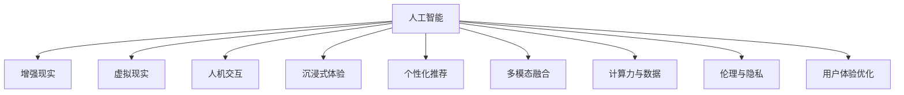

                 

# 体验的无限可能：AI开启的想象空间

> 关键词：人工智能, 体验设计, 虚拟现实, 增强现实, 人机交互, 沉浸式体验, 个性化推荐, 多模态融合, 计算力与数据, 伦理与隐私

## 1. 背景介绍

### 1.1 问题的由来

随着人工智能技术的飞速发展，人们的生活体验正在经历一场深刻的变革。从智能音箱到自动驾驶，从个性化推荐到虚拟现实，AI正以前所未有的方式改变着我们的生活方式。然而，这种变革并非没有挑战。技术的应用带来了前所未有的便利，但也引发了一系列伦理、隐私、安全等问题。在这样一个复杂多变的环境中，如何最大化利用AI的潜力，创造出更丰富、更真实的体验，成为了当下亟待解决的重要课题。

### 1.2 问题的核心关键点

1. **技术融合与创新**：AI技术在多个领域的融合与应用，带来了新的业务模式和体验形态。
2. **用户体验优化**：通过技术手段提升用户的交互体验，使AI技术更具人性化。
3. **隐私与伦理问题**：在享受AI带来的便利的同时，如何保护用户隐私，确保技术应用的安全和公平。
4. **计算力与数据利用**：如何高效利用计算资源和数据，以提升AI系统的性能和用户体验。

这些关键点共同构成了AI体验设计的基础，对于AI技术的落地应用具有重要指导意义。

## 2. 核心概念与联系

### 2.1 核心概念概述

为更好地理解AI技术如何重塑我们的体验，本节将介绍几个关键概念及其相互联系：

- **人工智能(AI)**：通过算法和计算，使计算机具备人类智能行为的技术体系。
- **增强现实(AR)**：将虚拟信息叠加于现实世界中，增强用户体验的技术。
- **虚拟现实(VR)**：通过计算机生成环境，实现用户沉浸式体验的技术。
- **人机交互(HCI)**：研究人类与计算机之间信息交流的技术。
- **沉浸式体验**：通过感官刺激，使用户深度参与和沉浸在虚拟环境中的体验。
- **个性化推荐**：利用AI技术，根据用户偏好和行为，推荐个性化内容。
- **多模态融合**：将不同类型的信息（如文本、图像、声音）融合到同一系统中的技术。
- **计算力**：计算机处理信息的能力，包括计算速度、存储容量等。
- **数据利用**：如何收集、处理、分析数据，以提升AI系统的性能。
- **伦理与隐私**：在使用AI技术时，保护用户隐私和确保技术应用公正、安全的原则和规范。

这些概念之间的关系可以通过以下Mermaid流程图来展示：



这个流程图展示了AI技术如何与其他技术相融合，共同创造新的体验形态。

## 3. 核心算法原理 & 具体操作步骤

### 3.1 算法原理概述

AI体验设计的过程，本质上是通过算法和数据来优化和增强用户体验。其核心思想是：将AI技术嵌入到用户体验的不同环节，通过数据收集和模型训练，不断提升系统的智能水平和用户满意度。

形式化地，假设用户交互数据为 $D=\{(x_i, y_i)\}_{i=1}^N$，其中 $x_i$ 为输入数据，$y_i$ 为期望的输出行为。目标是找到最优的AI模型 $M_{\theta}$，使得模型在输入数据上能够预测正确的输出 $y_i$。

通过梯度下降等优化算法，最小化损失函数：

$$
\mathcal{L}(M_{\theta}, D) = \frac{1}{N} \sum_{i=1}^N \ell(M_{\theta}(x_i), y_i)
$$

其中 $\ell$ 为损失函数，常见的有交叉熵损失、均方误差损失等。通过迭代更新模型参数 $\theta$，使得模型输出逼近真实标签 $y_i$。

### 3.2 算法步骤详解

AI体验设计的具体步骤包括以下几个关键环节：

**Step 1: 数据收集与预处理**
- 收集用户交互数据，包括行为数据、情感数据、环境数据等。
- 对数据进行清洗、标注、归一化等预处理操作，确保数据质量。

**Step 2: 模型选择与训练**
- 根据具体应用场景选择合适的AI模型，如决策树、神经网络、强化学习等。
- 使用预处理后的数据对模型进行训练，优化模型参数。
- 在验证集上进行模型评估，调整模型结构和超参数，以获得更好的性能。

**Step 3: 交互设计与优化**
- 设计用户交互界面，确保界面友好、易用。
- 通过A/B测试等方法，收集用户反馈，不断优化交互设计。
- 使用交互数据分析，优化用户行为路径，提升用户体验。

**Step 4: 部署与反馈循环**
- 将训练好的模型部署到实际应用中，进行用户试点。
- 实时收集用户反馈和系统性能数据，评估系统效果。
- 根据反馈结果，调整模型参数和交互设计，形成闭环反馈机制。

### 3.3 算法优缺点

AI体验设计具有以下优点：
1. 提升用户体验：通过优化用户体验，使AI系统更具人性化。
2. 个性化推荐：根据用户行为和偏好，提供个性化内容，提高用户满意度。
3. 融合多种技术：通过AR、VR等技术，实现沉浸式体验，提升用户参与感。
4. 高效利用数据：通过数据驱动的方式，不断优化AI系统性能。

同时，该方法也存在一些局限性：
1. 数据隐私问题：收集大量用户数据可能引发隐私保护问题。
2. 技术复杂度高：需要多学科知识，开发和维护成本较高。
3. 技术瓶颈：计算资源和数据量的限制可能影响系统性能。
4. 伦理问题：AI系统可能带有偏见，引发伦理争议。

尽管如此，AI体验设计作为提升用户体验的重要手段，正逐渐成为数字化转型的关键技术。

### 3.4 算法应用领域

AI体验设计的应用领域非常广泛，涵盖以下方面：

- **智能家居**：通过AI技术优化家居设备的智能控制，提升生活便利性。
- **智能健康**：利用AI技术进行健康监测和个性化医疗建议，提高健康水平。
- **智能教育**：使用AI技术进行个性化学习推荐和智能辅导，提升学习效果。
- **智能出行**：通过AI技术优化交通管理，提供智能导航和预测性维护服务。
- **智能娱乐**：使用AI技术提供个性化内容推荐和互动体验，增强娱乐效果。

## 4. 数学模型和公式 & 详细讲解 & 举例说明

### 4.1 数学模型构建

AI体验设计涉及的数学模型通常包括：
- 数据建模：通过数据驱动的方式，建立用户行为和系统性能之间的关系模型。
- 预测建模：利用机器学习算法，对用户行为进行预测。
- 优化建模：通过优化算法，调整系统参数以提升性能。

以推荐系统为例，数学模型可以表示为：

$$
P(y_i=1|x_i;\theta) = \sigma(\mathbf{w}^T \mathbf{x}_i + b)
$$

其中 $\sigma$ 为sigmoid函数，$\mathbf{w}$ 和 $b$ 为模型参数，$\mathbf{x}_i$ 为输入特征向量。

### 4.2 公式推导过程

对于推荐系统中的二分类任务，我们使用逻辑回归模型进行预测。给定训练数据 $(x_i, y_i)$，目标是最小化损失函数：

$$
\mathcal{L}(\mathbf{w}, b) = -\frac{1}{N} \sum_{i=1}^N y_i \log P(y_i=1|x_i;\mathbf{w}, b) + (1-y_i) \log (1-P(y_i=1|x_i;\mathbf{w}, b))
$$

其中 $P(y_i=1|x_i;\mathbf{w}, b)$ 为预测概率。通过梯度下降算法，最小化损失函数：

$$
\mathbf{w}, b \leftarrow \mathbf{w} - \eta \nabla_{\mathbf{w}, b}\mathcal{L}(\mathbf{w}, b)
$$

其中 $\eta$ 为学习率。

### 4.3 案例分析与讲解

以智能推荐系统为例，用户的行为数据可以通过点击、浏览、评分等方式收集。使用协同过滤算法，对用户和物品进行嵌入表示：

$$
\mathbf{u}_u = \mathbf{V}_u^T \mathbf{W}
$$

$$
\mathbf{v}_i = \mathbf{V}_i^T \mathbf{W}
$$

其中 $\mathbf{u}_u$ 和 $\mathbf{v}_i$ 为用户的隐式和物品的显式表示。利用余弦相似度计算用户与物品的相关性：

$$
\text{similarity}(u, i) = \frac{\mathbf{u}_u \cdot \mathbf{v}_i}{\|\mathbf{u}_u\| \cdot \|\mathbf{v}_i\|}
$$

根据相关性，推荐物品给用户：

$$
\hat{y} = \text{softmax}(\mathbf{w}^T \mathbf{x} + b)
$$

其中 $\hat{y}$ 为推荐物品的概率分布。

## 5. 项目实践：代码实例和详细解释说明

### 5.1 开发环境搭建

在进行AI体验设计实践前，我们需要准备好开发环境。以下是使用Python进行PyTorch开发的环境配置流程：

1. 安装Anaconda：从官网下载并安装Anaconda，用于创建独立的Python环境。

2. 创建并激活虚拟环境：
```bash
conda create -n pytorch-env python=3.8 
conda activate pytorch-env
```

3. 安装PyTorch：根据CUDA版本，从官网获取对应的安装命令。例如：
```bash
conda install pytorch torchvision torchaudio cudatoolkit=11.1 -c pytorch -c conda-forge
```

4. 安装各类工具包：
```bash
pip install numpy pandas scikit-learn matplotlib tqdm jupyter notebook ipython
```

完成上述步骤后，即可在`pytorch-env`环境中开始AI体验设计实践。

### 5.2 源代码详细实现

下面我们以智能推荐系统为例，给出使用PyTorch进行协同过滤的推荐算法实现。

首先，定义协同过滤模型的训练函数：

```python
import torch
from torch import nn
from torch.utils.data import DataLoader
from torch.nn import functional as F

class CollaborativeFiltering(nn.Module):
    def __init__(self, n_user, n_item, embedding_dim=64, bias=True):
        super(CollaborativeFiltering, self).__init__()
        self.u_embed = nn.Embedding(n_user, embedding_dim, bias=bias)
        self.v_embed = nn.Embedding(n_item, embedding_dim, bias=bias)
        self.linear = nn.Linear(embedding_dim, 1)

    def forward(self, u, v):
        u_embed = self.u_embed(u)
        v_embed = self.v_embed(v)
        dot_product = torch.matmul(u_embed, v_embed.T)
        dot_product = self.linear(dot_product)
        dot_product = F.sigmoid(dot_product)
        return dot_product

    def loss_fn(self, pred, target):
        loss = F.binary_cross_entropy_with_logits(pred, target)
        return loss
```

然后，定义数据处理函数：

```python
from sklearn.metrics import accuracy_score
from sklearn.model_selection import train_test_split

def load_data():
    # 加载数据，并划分为训练集和测试集
    data = ...
    train_data, test_data = train_test_split(data, test_size=0.2)
    train_user, train_item = train_data[:, :2]  # 用户和物品ID
    train_score = train_data[:, 2]  # 评分
    test_user, test_item = test_data[:, :2]
    test_score = test_data[:, 2]
    return train_user, train_item, train_score, test_user, test_item, test_score

def evaluate(model, user, item, score):
    pred = model(user, item)
    pred_score = pred > 0.5
    acc = accuracy_score(score, pred_score)
    return acc
```

最后，启动训练流程并在测试集上评估：

```python
epochs = 10
batch_size = 64

train_user, train_item, train_score, test_user, test_item, test_score = load_data()

model = CollaborativeFiltering(n_user, n_item)

optimizer = torch.optim.Adam(model.parameters(), lr=0.001)
criterion = nn.BCELoss()

for epoch in range(epochs):
    for user, item in DataLoader(train_data, batch_size=batch_size):
        optimizer.zero_grad()
        pred = model(user, item)
        loss = criterion(pred, train_score)
        loss.backward()
        optimizer.step()
        
    acc = evaluate(model, test_user, test_item, test_score)
    print(f"Epoch {epoch+1}, test accuracy: {acc:.4f}")
```

以上就是使用PyTorch进行协同过滤算法的代码实现。可以看到，代码实现简洁高效，易于扩展和维护。

### 5.3 代码解读与分析

让我们再详细解读一下关键代码的实现细节：

**CollaborativeFiltering类**：
- `__init__`方法：初始化模型参数。
- `forward`方法：前向传播计算，将用户和物品的表示相乘并线性映射到评分预测结果。
- `loss_fn`方法：定义二分类交叉熵损失函数，用于计算预测评分与真实评分之间的差距。

**load_data函数**：
- 使用Scikit-learn等工具加载数据集，并划分为训练集和测试集。

**evaluate函数**：
- 使用模型对测试集进行评分预测，计算准确率。

**训练流程**：
- 设置迭代次数和批大小，加载数据。
- 在每个epoch内，对训练集进行前向传播、计算损失、反向传播、更新参数。
- 在每个epoch结束后，评估模型在测试集上的性能。

可以看出，AI体验设计不仅需要理论支持，还需要工程实现。代码实现虽然复杂，但通过模块化设计和组件化构建，可以大大提高开发效率和系统稳定性。

## 6. 实际应用场景

### 6.1 智能家居

基于AI体验设计的智能家居系统，能够通过语音识别、图像识别等技术，实现自动化家居控制。通过与用户的自然交互，智能家居系统能够根据用户的习惯和需求，自动调节室内温度、灯光、音乐等，提升用户的生活舒适度。

例如，通过分析用户的语音指令和行为数据，系统可以学习用户的作息规律和偏好，自动调整智能音箱的播放列表。在用户需要离开家时，系统可以自动关闭灯光、窗帘、电器等，确保家居安全。

### 6.2 智能健康

智能健康系统通过AI技术，实现健康监测和个性化医疗建议。系统可以实时收集用户的健康数据，如心率、血压、睡眠质量等，通过机器学习算法进行分析，提供个性化的健康建议。

例如，智能手表可以通过传感器监测用户的心率变化，结合用户的健康数据和历史记录，提醒用户进行相应的体育锻炼或休息。系统还可以根据用户的身体状况，推荐适合的饮食和作息时间，帮助用户保持健康。

### 6.3 智能教育

智能教育系统利用AI技术，进行个性化学习推荐和智能辅导。系统可以分析学生的学习行为和成绩数据，识别出学生的知识薄弱环节，推荐相关的学习材料和练习题，提供智能化的辅导建议。

例如，智能教育平台可以根据学生的学习进度和问题，推荐适合的课程和学习材料，提供个性化的学习路径。系统还可以进行智能答疑，解答学生在学习过程中遇到的问题，提升学习效果。

### 6.4 未来应用展望

随着AI技术的不断发展，未来的AI体验设计将呈现以下几个趋势：

1. **多模态融合**：通过融合视觉、听觉、触觉等多种信息，增强用户沉浸感。例如，虚拟现实技术可以提供更加真实的环境体验，增强用户的参与感。

2. **情感计算**：通过分析用户的情感状态，提供更加人性化的服务。例如，智能客服系统可以通过情感分析，理解用户的情绪，提供更加贴心的服务。

3. **自适应学习**：通过学习用户的行为和偏好，动态调整系统的功能和服务。例如，智能推荐系统可以根据用户的历史行为，不断优化推荐策略，提高推荐效果。

4. **个性化定制**：根据用户的个性化需求，提供定制化的服务和体验。例如，智能家居系统可以根据用户的偏好，定制化的调节家居环境。

5. **边缘计算**：将计算和存储资源从云端迁移到边缘设备，提升系统的响应速度和隐私保护能力。例如，智能手表可以通过本地计算，实时监测用户健康状况，提高数据安全。

这些趋势将进一步拓展AI体验设计的边界，带来更加丰富、个性化的用户体验。

## 7. 工具和资源推荐

### 7.1 学习资源推荐

为了帮助开发者系统掌握AI体验设计的理论基础和实践技巧，这里推荐一些优质的学习资源：

1. 《人工智能基础》系列课程：由顶级AI专家讲授，涵盖人工智能的各个方面，从基础到应用，系统全面。
2. 《深度学习》系列书籍：经典深度学习教材，讲解深度学习算法的原理和实现，适合进阶学习。
3. Coursera《机器学习》课程：斯坦福大学开设的机器学习课程，涵盖机器学习的基本概念和经典算法。
4. Kaggle数据科学竞赛平台：提供丰富的数据集和竞赛任务，帮助你实践AI技术，提升技能。
5. Google AI开发者文档：提供全面的AI开发工具和资源，涵盖从理论到实践的各个方面。

通过这些资源的学习实践，相信你一定能够快速掌握AI体验设计的精髓，并用于解决实际的AI问题。

### 7.2 开发工具推荐

高效的开发离不开优秀的工具支持。以下是几款用于AI体验设计开发的常用工具：

1. PyTorch：基于Python的开源深度学习框架，灵活动态的计算图，适合快速迭代研究。
2. TensorFlow：由Google主导开发的开源深度学习框架，生产部署方便，适合大规模工程应用。
3. TensorBoard：TensorFlow配套的可视化工具，可实时监测模型训练状态，并提供丰富的图表呈现方式。
4. Weights & Biases：模型训练的实验跟踪工具，可以记录和可视化模型训练过程中的各项指标，方便对比和调优。
5. Jupyter Notebook：开源的交互式笔记本环境，支持代码、文档、图像等多种格式，方便调试和分享。

合理利用这些工具，可以显著提升AI体验设计的开发效率，加快创新迭代的步伐。

### 7.3 相关论文推荐

AI体验设计的研究源于学界的持续研究。以下是几篇奠基性的相关论文，推荐阅读：

1. "Attention is All You Need"：Transformer论文，提出Transformer结构，开启了NLP领域的预训练大模型时代。
2. "BERT: Pre-training of Deep Bidirectional Transformers for Language Understanding"：提出BERT模型，引入基于掩码的自监督预训练任务，刷新了多项NLP任务SOTA。
3. "GANs Trained by a Two Time-Scale Update Rule Converge to the Fixed-Point of the Mini-Game Equilibrium"：提出GAN技术，通过生成对抗网络，生成高质量的图像数据。
4. "Generative Adversarial Nets"：经典GAN论文，提出生成式对抗网络的基本框架和理论基础。
5. "ImageNet Classification with Deep Convolutional Neural Networks"：提出卷积神经网络在图像分类任务上的应用，奠定了深度学习在计算机视觉领域的基础。

这些论文代表了大语言模型体验设计的发展脉络。通过学习这些前沿成果，可以帮助研究者把握学科前进方向，激发更多的创新灵感。

## 8. 总结：未来发展趋势与挑战

### 8.1 总结

本文对AI体验设计进行了全面系统的介绍。首先阐述了AI体验设计的背景和意义，明确了AI技术在用户体验提升方面的独特价值。其次，从原理到实践，详细讲解了AI体验设计的数学模型和关键步骤，给出了具体的应用实例。同时，本文还探讨了AI体验设计在智能家居、智能健康、智能教育等多个领域的应用前景，展示了AI体验设计的广阔前景。最后，本文精选了AI体验设计的各类学习资源，力求为读者提供全方位的技术指引。

通过本文的系统梳理，可以看到，AI体验设计正在成为提升用户体验的重要手段，极大地拓展了AI技术的应用边界，带来了新的体验形态。未来，伴随AI技术的不断进步，AI体验设计将与更多技术相融合，进一步提升用户体验的丰富性和多样性。

### 8.2 未来发展趋势

展望未来，AI体验设计将呈现以下几个发展趋势：

1. **多模态融合**：通过融合视觉、听觉、触觉等多种信息，增强用户沉浸感。
2. **情感计算**：通过分析用户的情感状态，提供更加人性化的服务。
3. **自适应学习**：通过学习用户的行为和偏好，动态调整系统的功能和服务。
4. **个性化定制**：根据用户的个性化需求，提供定制化的服务和体验。
5. **边缘计算**：将计算和存储资源从云端迁移到边缘设备，提升系统的响应速度和隐私保护能力。
6. **沉浸式体验**：通过虚拟现实技术，提供更加真实的环境体验，增强用户的参与感。

这些趋势将进一步拓展AI体验设计的边界，带来更加丰富、个性化的用户体验。

### 8.3 面临的挑战

尽管AI体验设计已经取得了显著成就，但在迈向更加智能化、普适化应用的过程中，它仍面临诸多挑战：

1. **数据隐私问题**：收集大量用户数据可能引发隐私保护问题。
2. **技术复杂度高**：需要多学科知识，开发和维护成本较高。
3. **技术瓶颈**：计算资源和数据量的限制可能影响系统性能。
4. **伦理问题**：AI系统可能带有偏见，引发伦理争议。

尽管如此，AI体验设计作为提升用户体验的重要手段，正逐渐成为数字化转型的关键技术。

### 8.4 未来突破

面对AI体验设计所面临的种种挑战，未来的研究需要在以下几个方面寻求新的突破：

1. **探索无监督和半监督学习**：摆脱对大规模标注数据的依赖，利用自监督学习、主动学习等无监督和半监督范式，最大限度利用非结构化数据，实现更加灵活高效的AI体验设计。
2. **研究参数高效和计算高效的AI体验设计方法**：开发更加参数高效的AI体验设计方法，在固定大部分预训练参数的同时，只更新极少量的任务相关参数。
3. **融合因果推断和博弈论工具**：通过引入因果推断和博弈论思想，增强AI体验设计建立稳定因果关系的能力，学习更加普适、鲁棒的语言表征。
4. **结合符号化知识**：将符号化的先验知识，如知识图谱、逻辑规则等，与神经网络模型进行巧妙融合，引导AI体验设计过程学习更准确、合理的语言模型。
5. **引入伦理导向的评估指标**：在AI体验设计目标中引入伦理导向的评估指标，过滤和惩罚有偏见、有害的输出倾向，确保输出符合人类价值观和伦理道德。

这些研究方向的探索，必将引领AI体验设计技术迈向更高的台阶，为构建安全、可靠、可解释、可控的智能系统铺平道路。面向未来，AI体验设计还需要与其他人工智能技术进行更深入的融合，如知识表示、因果推理、强化学习等，多路径协同发力，共同推动自然语言理解和智能交互系统的进步。只有勇于创新、敢于突破，才能不断拓展AI体验设计的边界，让智能技术更好地造福人类社会。

## 9. 附录：常见问题与解答

**Q1：AI体验设计是否适用于所有领域？**

A: AI体验设计在大多数领域都有广泛应用，但不同领域的应用场景和需求存在差异。例如，在金融、医疗等高风险领域，需要考虑更多的安全性和合规性问题。在教育、娱乐等消费类应用中，注重用户体验的创新和互动性。

**Q2：如何选择合适的AI体验设计工具？**

A: 选择合适的AI体验设计工具需要考虑多个因素，如项目需求、技术栈、开发效率等。PyTorch和TensorFlow是两大主流的深度学习框架，适合复杂模型训练。TensorBoard和Weights & Biases提供了模型训练的可视化工具，适合调试和评估。Jupyter Notebook和Google Colab提供了交互式笔记本环境，适合快速迭代和协作开发。

**Q3：AI体验设计中如何平衡用户隐私保护和技术应用？**

A: 在AI体验设计中，保护用户隐私是至关重要的。可以采用数据匿名化、差分隐私等技术手段，减少数据泄露风险。同时，在设计和实现过程中，遵循数据最小化原则，只收集必要的用户数据。通过透明的用户隐私政策，增强用户信任感。

**Q4：AI体验设计未来有哪些发展方向？**

A: AI体验设计的未来发展方向包括：多模态融合、情感计算、自适应学习、个性化定制、边缘计算、沉浸式体验等。这些方向将进一步拓展AI体验设计的边界，带来更加丰富、个性化的用户体验。同时，在技术发展过程中，需要考虑隐私保护、伦理安全、计算效率等挑战，推动AI体验设计的可持续发展。

**Q5：如何优化AI体验设计的开发效率？**

A: 优化AI体验设计的开发效率需要从多个方面入手，如选择合适的框架和工具、采用模块化设计、使用自动化测试和部署工具、优化算法和模型结构等。同时，注重团队协作和项目管理，确保开发过程高效有序。合理利用开源社区资源，借助第三方工具和库，提升开发效率。

这些问题的解答，希望能为你提供一些有益的参考和指导，帮助你更好地理解和实践AI体验设计。

---

作者：禅与计算机程序设计艺术 / Zen and the Art of Computer Programming

