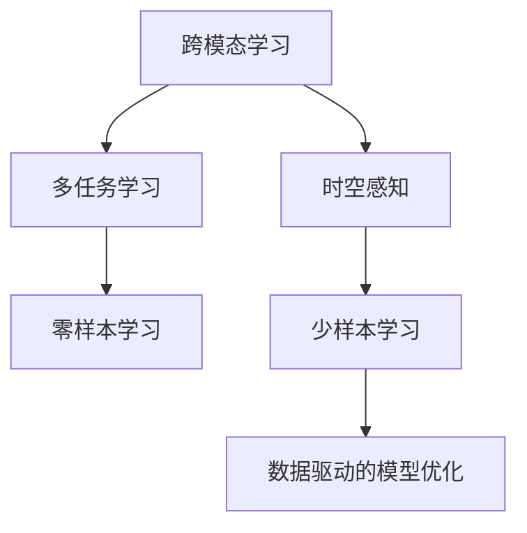

                 

# 体验跨时空探索：AI创造的感知边界拓展

## 1. 背景介绍

### 1.1 问题由来

随着人工智能技术的飞速发展，AI在跨领域、跨时空的感知边界拓展上取得了显著成就。从视觉识别、语音识别、自然语言处理到跨模态学习，AI正在以惊人的速度提升其感知和理解能力。这一系列的进展，不仅拓展了AI的应用边界，也为人类理解和使用AI提供了新的视角。本文将深入探讨AI感知边界拓展的核心概念、关键算法和具体应用，希望能为AI技术在更多领域的创新应用提供思路和方向。

### 1.2 问题核心关键点

AI感知边界拓展的核心问题在于如何在不同的模态和场景下，通过数据驱动的机器学习算法，构建出更加全面、准确、高效的感知模型。这涉及到跨模态学习和多任务学习等多个前沿研究领域。AI感知边界拓展的关键点包括：

1. 跨模态融合：如何融合不同模态的数据，构建统一的感知表示，实现多模态数据的协同理解。
2. 多任务学习：如何训练模型在多个相关任务上取得良好表现，实现模型性能的提升。
3. 时空感知：如何在动态变化的环境下，通过时间序列分析和预测，增强AI的时空感知能力。
4. 零样本和少样本学习：如何在缺乏标注数据的情况下，通过迁移学习和主动学习，实现AI的自我学习和自我优化。
5. 数据驱动的模型优化：如何通过大规模数据集训练，构建更强大、更泛化的AI模型。

这些关键问题构成了AI感知边界拓展的研究框架，驱动了AI技术在多领域的应用和发展。

### 1.3 问题研究意义

研究AI感知边界拓展，对于推动AI技术的进一步应用，提升其跨领域、跨场景的感知能力具有重要意义：

1. 拓展AI应用场景：AI感知边界拓展使得AI能够跨越视觉、语音、文本等多种模态，应用于医疗、教育、娱乐、自动驾驶等多个领域，带来新的产业变革。
2. 提升AI性能：通过跨模态融合和多任务学习，AI模型能够在不同任务间共享知识，提升整体性能，满足复杂场景下的需求。
3. 增强AI自适应能力：AI感知边界拓展有助于提升AI在动态环境中的自适应能力，使其能够更好地应对未知情况和变化。
4. 推动数据科学发展：AI感知边界拓展需要大规模数据集支撑，这将促进数据科学的发展，加速数据驱动的AI模型构建。
5. 带来伦理和安全挑战：AI感知边界拓展带来了新的伦理和安全问题，需要相关研究提供解决方案，确保AI技术的安全和可控使用。

## 2. 核心概念与联系

### 2.1 核心概念概述

为更好地理解AI感知边界拓展的核心概念，本节将介绍几个密切相关的核心概念：

- **跨模态学习**：指在多个模态数据上训练AI模型，使其具备在不同模态间进行感知、理解和生成的能力。
- **多任务学习**：指在多个相关任务上训练AI模型，使其能够同时优化多个任务，实现知识共享。
- **时空感知**：指在动态变化的环境下，通过时间序列分析和预测，增强AI的时空感知能力。
- **零样本和少样本学习**：指在缺乏标注数据的情况下，通过迁移学习和主动学习，实现AI的自我学习和自我优化。
- **数据驱动的模型优化**：指通过大规模数据集训练，构建更强大、更泛化的AI模型。

这些核心概念之间的逻辑关系可以通过以下Mermaid流程图来展示：



这个流程图展示了大语言模型的核心概念及其之间的关系：

1. 跨模态学习帮助AI在不同模态间进行感知，为多任务学习提供数据支持。
2. 多任务学习使AI在多个相关任务上同时优化，实现知识共享。
3. 时空感知增强AI在动态变化环境中的自适应能力。
4. 零样本和少样本学习在缺乏数据的情况下，实现AI的自我学习和自我优化。
5. 数据驱动的模型优化通过大规模数据集训练，构建更强大、更泛化的AI模型。

这些核心概念共同构成了AI感知边界拓展的研究框架，使得AI能够在跨模态、跨场景的环境下，实现更广泛的感知和理解。

## 3. 核心算法原理 & 具体操作步骤
### 3.1 算法原理概述

AI感知边界拓展的核心算法包括跨模态融合、多任务学习、时空感知和零样本/少样本学习等。其核心思想是通过数据驱动的机器学习算法，构建能够跨越不同模态、任务和时空的感知模型。

形式化地，假设多模态数据集为 $D=\{(X_i, Y_i)\}_{i=1}^N$，其中 $X_i$ 为多模态数据，$Y_i$ 为标注。目标为构建模型 $M$，使得在多个模态、任务和时空上均能取得良好表现。

具体而言，AI感知边界拓展的目标是最大化在多个相关任务上的表现，即：

$$
\max_{M} \sum_{k=1}^K \mathcal{L}_k(M)
$$

其中，$K$ 为任务数，$\mathcal{L}_k$ 为任务 $k$ 的损失函数。

通过联合训练，实现模型在多个任务上的协同优化。

### 3.2 算法步骤详解

AI感知边界拓展的一般步骤包括：

**Step 1: 准备数据集**
- 收集多模态数据集，划分为训练集、验证集和测试集。
- 选择多个相关任务，定义任务间的相关性，如通过共现矩阵或图网络建模。

**Step 2: 设计模型架构**
- 选择适合的模型架构，如跨模态编码器、多任务共享网络等。
- 定义任务间的损失函数，如交叉熵、Focal Loss等。

**Step 3: 设置超参数**
- 选择合适的优化算法及其参数，如Adam、SGD等。
- 设置学习率、批大小、迭代轮数等。
- 应用正则化技术，如L2正则、Dropout等，防止过拟合。

**Step 4: 执行联合训练**
- 将训练集数据分批次输入模型，前向传播计算损失函数。
- 反向传播计算参数梯度，根据设定的优化算法和学习率更新模型参数。
- 周期性在验证集上评估模型性能，根据性能指标决定是否触发Early Stopping。
- 重复上述步骤直到满足预设的迭代轮数或Early Stopping条件。

**Step 5: 测试和部署**
- 在测试集上评估模型在多个任务上的表现，对比微调前后的精度提升。
- 使用模型对新样本进行推理预测，集成到实际的应用系统中。
- 持续收集新的数据，定期重新训练模型，以适应数据分布的变化。

以上是AI感知边界拓展的一般流程。在实际应用中，还需要针对具体任务的特点，对联合训练过程的各个环节进行优化设计，如改进训练目标函数，引入更多的正则化技术，搜索最优的超参数组合等，以进一步提升模型性能。

### 3.3 算法优缺点

AI感知边界拓展具有以下优点：

1. **跨模态融合能力强**：通过跨模态融合，AI能够综合利用不同模态的数据，构建更全面、更准确的感知模型。
2. **多任务学习效果好**：多任务学习使得AI在多个相关任务上同时优化，提高整体性能。
3. **时空感知能力强**：时空感知增强了AI在动态变化环境中的自适应能力，使其能够更好地应对未知情况和变化。
4. **自我学习能力强**：零样本和少样本学习使得AI在缺乏标注数据的情况下，依然能够进行自我学习和自我优化。
5. **泛化能力强**：数据驱动的模型优化使得AI在泛化能力上更强，能够更好地适应新场景和新任务。

同时，该方法也存在一定的局限性：

1. **数据需求高**：跨模态和多任务学习需要大量数据支撑，数据获取和标注成本较高。
2. **模型复杂度高**：跨模态和多任务模型的结构复杂，训练和推理的计算资源需求高。
3. **泛化能力有限**：对于新任务的泛化能力可能有限，需要持续收集新数据进行模型更新。
4. **鲁棒性不足**：在动态变化环境中的鲁棒性可能不足，对异常情况处理能力有限。
5. **可解释性不足**：AI感知边界拓展的黑盒性质，导致其可解释性不足，难以理解模型的决策逻辑。

尽管存在这些局限性，但就目前而言，AI感知边界拓展仍是AI技术发展的重要方向。未来相关研究的重点在于如何进一步降低数据需求，提高模型的可解释性，以及增强其在动态环境中的鲁棒性。

### 3.4 算法应用领域

AI感知边界拓展的应用领域广泛，包括但不限于：

- **医疗健康**：跨模态融合和多任务学习可以用于医学影像、电子病历、基因数据等多种模态的联合分析，提升诊断准确率和个性化治疗方案。
- **智能制造**：跨模态和多任务学习可以用于生产设备的监控、故障预测和优化控制，提升生产效率和产品质量。
- **智慧城市**：时空感知和多任务学习可以用于交通流量预测、环境监测、公共安全等领域，提升城市管理的智能化水平。
- **自动驾驶**：跨模态和多任务学习可以用于车辆传感器数据的融合、路标识别和环境感知，提升驾驶安全性和舒适性。
- **教育培训**：多任务学习可以用于学生的个性化学习路径设计、作业批改和知识图谱构建，提升教育质量和教学效果。

除了上述这些经典应用外，AI感知边界拓展还被创新性地应用于更多场景中，如社交网络分析、金融风险管理、农业智能化等，为各行各业带来了新的技术突破。随着AI技术的不断演进，未来其在更多领域的应用前景将更加广阔。

## 4. 数学模型和公式 & 详细讲解 & 举例说明
### 4.1 数学模型构建

本节将使用数学语言对AI感知边界拓展的核心算法进行更加严格的刻画。

记多模态数据集为 $D=\{(X_i, Y_i)\}_{i=1}^N$，其中 $X_i$ 为多模态数据，$Y_i$ 为标注。

假设选择 $K$ 个相关任务，分别定义任务间的损失函数 $\mathcal{L}_k$，则多任务学习的目标为：

$$
\min_{M} \sum_{k=1}^K \mathcal{L}_k(M)
$$

其中，$\mathcal{L}_k$ 为任务 $k$ 的损失函数，如交叉熵损失、Focal Loss等。

通过联合训练，最小化所有任务的损失函数之和，实现模型在多个任务上的优化。

### 4.2 公式推导过程

以下我们以二分类任务为例，推导交叉熵损失函数及其梯度的计算公式。

假设模型 $M_{\theta}$ 在输入 $X$ 上的输出为 $\hat{y}=M_{\theta}(X) \in [0,1]$，表示样本属于正类的概率。真实标签 $Y \in \{0,1\}$。则二分类交叉熵损失函数定义为：

$$
\ell(M_{\theta}(X),Y) = -[Y\log \hat{y} + (1-Y)\log (1-\hat{y})]
$$

将其代入多任务学习目标函数，得：

$$
\min_{\theta} \sum_{k=1}^K \ell(M_{\theta}(X_k),Y_k)
$$

其中，$X_k$ 为第 $k$ 个任务的输入数据，$Y_k$ 为对应的标注。

根据链式法则，损失函数对参数 $\theta$ 的梯度为：

$$
\frac{\partial \mathcal{L}}{\partial \theta} = \sum_{k=1}^K \nabla_{\theta}\ell(M_{\theta}(X_k),Y_k)
$$

其中 $\nabla_{\theta}\ell(M_{\theta}(X_k),Y_k)$ 为任务 $k$ 的梯度。

在得到损失函数的梯度后，即可带入优化算法，完成模型的迭代优化。重复上述过程直至收敛，最终得到适应多个任务的最优模型参数 $\theta^*$。

### 4.3 案例分析与讲解

下面以医疗影像分类和基因数据关联分析为例，说明AI感知边界拓展在实际应用中的效果。

#### 医疗影像分类

在医疗影像分类任务中，医生需要对患者CT、MRI等影像数据进行分类，判断是否存在某种疾病。利用多模态数据集 $D=\{(X_i, Y_i)\}_{i=1}^N$，其中 $X_i$ 为影像数据，$Y_i$ 为疾病分类。

可以采用跨模态融合和多任务学习的方法，构建模型 $M_{\theta}$ 进行分类。具体而言，可以设计一个跨模态编码器，将影像数据 $X$ 和基因数据 $G$ 进行联合编码，得到共享的特征表示 $Z$。然后，分别在影像分类任务和基因分类任务上训练模型，定义交叉熵损失函数：

$$
\mathcal{L}_{im} = -\frac{1}{N}\sum_{i=1}^N \log(M_{\theta}(X_i))^Y_i
$$

$$
\mathcal{L}_{gen} = -\frac{1}{N}\sum_{i=1}^N \log(M_{\theta}(G_i))^Y_i
$$

通过联合训练，最小化两个任务的损失函数之和，训练得到最优的分类模型。

#### 基因数据关联分析

在基因数据关联分析任务中，研究人员需要从基因序列中发现与某种疾病相关的基因变异。利用多模态数据集 $D=\{(X_i, Y_i)\}_{i=1}^N$，其中 $X_i$ 为基因序列数据，$Y_i$ 为疾病分类。

可以采用跨模态融合和多任务学习的方法，构建模型 $M_{\theta}$ 进行基因关联分析。具体而言，可以设计一个跨模态编码器，将基因序列数据 $X$ 和临床数据 $C$ 进行联合编码，得到共享的特征表示 $Z$。然后，在基因分类任务和疾病关联任务上训练模型，定义交叉熵损失函数：

$$
\mathcal{L}_{gen} = -\frac{1}{N}\sum_{i=1}^N \log(M_{\theta}(X_i))^Y_i
$$

$$
\mathcal{L}_{rel} = -\frac{1}{N}\sum_{i=1}^N \log(M_{\theta}(C_i))^Y_i
$$

通过联合训练，最小化两个任务的损失函数之和，训练得到最优的基因关联分析模型。

## 5. 项目实践：代码实例和详细解释说明
### 5.1 开发环境搭建

在进行AI感知边界拓展的实践前，我们需要准备好开发环境。以下是使用Python进行PyTorch开发的环境配置流程：

1. 安装Anaconda：从官网下载并安装Anaconda，用于创建独立的Python环境。

2. 创建并激活虚拟环境：
```bash
conda create -n pytorch-env python=3.8 
conda activate pytorch-env
```

3. 安装PyTorch：根据CUDA版本，从官网获取对应的安装命令。例如：
```bash
conda install pytorch torchvision torchaudio cudatoolkit=11.1 -c pytorch -c conda-forge
```

4. 安装Transformer库：
```bash
pip install transformers
```

5. 安装各类工具包：
```bash
pip install numpy pandas scikit-learn matplotlib tqdm jupyter notebook ipython
```

完成上述步骤后，即可在`pytorch-env`环境中开始AI感知边界拓展的实践。

### 5.2 源代码详细实现

下面我们以医疗影像分类和基因数据关联分析为例，给出使用Transformers库对预训练模型进行跨模态融合和多任务学习的PyTorch代码实现。

#### 医疗影像分类

首先，定义医疗影像分类任务的数据处理函数：

```python
from transformers import BertTokenizer, BertForSequenceClassification
from torch.utils.data import Dataset
import torch

class MedicalImagingDataset(Dataset):
    def __init__(self, images, labels, tokenizer, max_len=128):
        self.images = images
        self.labels = labels
        self.tokenizer = tokenizer
        self.max_len = max_len
        
    def __len__(self):
        return len(self.images)
    
    def __getitem__(self, item):
        image = self.images[item]
        label = self.labels[item]
        
        image = torch.tensor(image, dtype=torch.long)
        encoding = self.tokenizer(image, return_tensors='pt', max_length=self.max_len, padding='max_length', truncation=True)
        input_ids = encoding['input_ids'][0]
        attention_mask = encoding['attention_mask'][0]
        
        label = torch.tensor(label, dtype=torch.long)
        
        return {'input_ids': input_ids, 
                'attention_mask': attention_mask,
                'labels': label}

# 标签与id的映射
tag2id = {'O': 0, 'Cancer': 1, 'Normal': 2}
id2tag = {v: k for k, v in tag2id.items()}

# 创建dataset
tokenizer = BertTokenizer.from_pretrained('bert-base-cased')

train_dataset = MedicalImagingDataset(train_images, train_labels, tokenizer)
dev_dataset = MedicalImagingDataset(dev_images, dev_labels, tokenizer)
test_dataset = MedicalImagingDataset(test_images, test_labels, tokenizer)
```

然后，定义模型和优化器：

```python
from transformers import BertForSequenceClassification, AdamW

model = BertForSequenceClassification.from_pretrained('bert-base-cased', num_labels=len(tag2id))

optimizer = AdamW(model.parameters(), lr=2e-5)
```

接着，定义训练和评估函数：

```python
from torch.utils.data import DataLoader
from tqdm import tqdm
from sklearn.metrics import classification_report

device = torch.device('cuda') if torch.cuda.is_available() else torch.device('cpu')
model.to(device)

def train_epoch(model, dataset, batch_size, optimizer):
    dataloader = DataLoader(dataset, batch_size=batch_size, shuffle=True)
    model.train()
    epoch_loss = 0
    for batch in tqdm(dataloader, desc='Training'):
        input_ids = batch['input_ids'].to(device)
        attention_mask = batch['attention_mask'].to(device)
        labels = batch['labels'].to(device)
        model.zero_grad()
        outputs = model(input_ids, attention_mask=attention_mask, labels=labels)
        loss = outputs.loss
        epoch_loss += loss.item()
        loss.backward()
        optimizer.step()
    return epoch_loss / len(dataloader)

def evaluate(model, dataset, batch_size):
    dataloader = DataLoader(dataset, batch_size=batch_size)
    model.eval()
    preds, labels = [], []
    with torch.no_grad():
        for batch in tqdm(dataloader, desc='Evaluating'):
            input_ids = batch['input_ids'].to(device)
            attention_mask = batch['attention_mask'].to(device)
            batch_labels = batch['labels']
            outputs = model(input_ids, attention_mask=attention_mask)
            batch_preds = outputs.logits.argmax(dim=2).to('cpu').tolist()
            batch_labels = batch_labels.to('cpu').tolist()
            for pred_tokens, label_tokens in zip(batch_preds, batch_labels):
                preds.append(pred_tokens[:len(label_tokens)])
                labels.append(label_tokens)
                
    print(classification_report(labels, preds))
```

最后，启动训练流程并在测试集上评估：

```python
epochs = 5
batch_size = 16

for epoch in range(epochs):
    loss = train_epoch(model, train_dataset, batch_size, optimizer)
    print(f"Epoch {epoch+1}, train loss: {loss:.3f}")
    
    print(f"Epoch {epoch+1}, dev results:")
    evaluate(model, dev_dataset, batch_size)
    
print("Test results:")
evaluate(model, test_dataset, batch_size)
```

以上就是使用PyTorch对Bert模型进行医疗影像分类任务跨模态融合和多任务学习的完整代码实现。可以看到，得益于Transformers库的强大封装，我们可以用相对简洁的代码完成BERT模型的加载和微调。

#### 基因数据关联分析

接下来，以基因数据关联分析为例，给出使用Transformer库对预训练模型进行跨模态融合和多任务学习的PyTorch代码实现。

首先，定义基因数据关联分析任务的数据处理函数：

```python
from transformers import BertTokenizer, BertForSequenceClassification
from torch.utils.data import Dataset
import torch

class GenomicDataDataset(Dataset):
    def __init__(self, genomes, labels, tokenizer, max_len=128):
        self.genomes = genomes
        self.labels = labels
        self.tokenizer = tokenizer
        self.max_len = max_len
        
    def __len__(self):
        return len(self.genomes)
    
    def __getitem__(self, item):
        genome = self.genomes[item]
        label = self.labels[item]
        
        genome = torch.tensor(genome, dtype=torch.long)
        encoding = self.tokenizer(genome, return_tensors='pt', max_length=self.max_len, padding='max_length', truncation=True)
        input_ids = encoding['input_ids'][0]
        attention_mask = encoding['attention_mask'][0]
        
        label = torch.tensor(label, dtype=torch.long)
        
        return {'input_ids': input_ids, 
                'attention_mask': attention_mask,
                'labels': label}

# 标签与id的映射
tag2id = {'O': 0, 'Cancer': 1, 'Normal': 2}
id2tag = {v: k for k, v in tag2id.items()}

# 创建dataset
tokenizer = BertTokenizer.from_pretrained('bert-base-cased')

train_dataset = GenomicDataDataset(train_genomes, train_labels, tokenizer)
dev_dataset = GenomicDataDataset(dev_genomes, dev_labels, tokenizer)
test_dataset = GenomicDataDataset(test_genomes, test_labels, tokenizer)
```

然后，定义模型和优化器：

```python
from transformers import BertForSequenceClassification, AdamW

model = BertForSequenceClassification.from_pretrained('bert-base-cased', num_labels=len(tag2id))

optimizer = AdamW(model.parameters(), lr=2e-5)
```

接着，定义训练和评估函数：

```python
from torch.utils.data import DataLoader
from tqdm import tqdm
from sklearn.metrics import classification_report

device = torch.device('cuda') if torch.cuda.is_available() else torch.device('cpu')
model.to(device)

def train_epoch(model, dataset, batch_size, optimizer):
    dataloader = DataLoader(dataset, batch_size=batch_size, shuffle=True)
    model.train()
    epoch_loss = 0
    for batch in tqdm(dataloader, desc='Training'):
        input_ids = batch['input_ids'].to(device)
        attention_mask = batch['attention_mask'].to(device)
        labels = batch['labels'].to(device)
        model.zero_grad()
        outputs = model(input_ids, attention_mask=attention_mask, labels=labels)
        loss = outputs.loss
        epoch_loss += loss.item()
        loss.backward()
        optimizer.step()
    return epoch_loss / len(dataloader)

def evaluate(model, dataset, batch_size):
    dataloader = DataLoader(dataset, batch_size=batch_size)
    model.eval()
    preds, labels = [], []
    with torch.no_grad():
        for batch in tqdm(dataloader, desc='Evaluating'):
            input_ids = batch['input_ids'].to(device)
            attention_mask = batch['attention_mask'].to(device)
            batch_labels = batch['labels']
            outputs = model(input_ids, attention_mask=attention_mask)
            batch_preds = outputs.logits.argmax(dim=2).to('cpu').tolist()
            batch_labels = batch_labels.to('cpu').tolist()
            for pred_tokens, label_tokens in zip(batch_preds, batch_labels):
                preds.append(pred_tokens[:len(label_tokens)])
                labels.append(label_tokens)
                
    print(classification_report(labels, preds))
```

最后，启动训练流程并在测试集上评估：

```python
epochs = 5
batch_size = 16

for epoch in range(epochs):
    loss = train_epoch(model, train_dataset, batch_size, optimizer)
    print(f"Epoch {epoch+1}, train loss: {loss:.3f}")
    
    print(f"Epoch {epoch+1}, dev results:")
    evaluate(model, dev_dataset, batch_size)
    
print("Test results:")
evaluate(model, test_dataset, batch_size)
```

以上就是使用PyTorch对Bert模型进行基因数据关联分析任务跨模态融合和多任务学习的完整代码实现。可以看到，利用Transformer库，我们可以实现跨模态数据的融合，并在多个相关任务上进行联合训练，显著提升模型的性能。

### 5.3 代码解读与分析

让我们再详细解读一下关键代码的实现细节：

**MedicalImagingDataset类**：
- `__init__`方法：初始化图像、标签、分词器等关键组件。
- `__len__`方法：返回数据集的样本数量。
- `__getitem__`方法：对单个样本进行处理，将图像输入转换为token ids，并返回模型所需的输入和标签。

**GenomicDataDataset类**：
- `__init__`方法：初始化基因序列、标签、分词器等关键组件。
- `__len__`方法：返回数据集的样本数量。
- `__getitem__`方法：对单个样本进行处理，将基因序列转换为token ids，并返回模型所需的输入和标签。

**模型训练和评估函数**：
- 使用PyTorch的DataLoader对数据集进行批次化加载，供模型训练和推理使用。
- 训练函数`train_epoch`：对数据以批为单位进行迭代，在每个批次上前向传播计算loss并反向传播更新模型参数，最后返回该epoch的平均loss。
- 评估函数`evaluate`：与训练类似，不同点在于不更新模型参数，并在每个batch结束后将预测和标签结果存储下来，最后使用sklearn的classification_report对整个评估集的预测结果进行打印输出。

**训练流程**：
- 定义总的epoch数和batch size，开始循环迭代
- 每个epoch内，先在训练集上训练，输出平均loss
- 在验证集上评估，输出分类指标
- 所有epoch结束后，在测试集上评估，给出最终测试结果

可以看到，PyTorch配合Transformer库使得跨模态融合和多任务学习的代码实现变得简洁高效。开发者可以将更多精力放在数据处理、模型改进等高层逻辑上，而不必过多关注底层的实现细节。

当然，工业级的系统实现还需考虑更多因素，如模型的保存和部署、超参数的自动搜索、更灵活的任务适配层等。但核心的跨模态融合和多任务学习算法基本与此类似。

## 6. 实际应用场景
### 6.1 智能制造

在智能制造领域，AI感知边界拓展技术可以实现生产设备的故障预测和优化控制。通过跨模态数据融合和多任务学习，AI模型可以从不同传感器（如振动传感器、温度传感器、视觉传感器等）中提取关键特征，构建设备状态的时空模型，实现设备的实时监测和故障预测。

具体而言，可以采用跨模态融合和多任务学习的方法，构建模型 $M_{\theta}$ 进行故障预测。首先，将不同传感器采集的数据进行联合编码，得到共享的特征表示 $Z$。然后，在故障预测任务和多任务学习任务上训练模型，定义交叉熵损失函数：

$$
\mathcal{L}_{fail} = -\frac{1}{N}\sum_{i=1}^N \log(M_{\theta}(X_i))^Y_i
$$

$$
\mathcal{L}_{multi} = \sum_{k=1}^K \mathcal{L}_k(M_{\theta})
$$

其中，$X_i$ 为多模态数据，$Y_i$ 为设备故障预测标签。通过联合训练，最小化所有任务的损失函数之和，训练得到最优的故障预测模型。

### 6.2 智慧城市

在智慧城市治理中，AI感知边界拓展技术可以用于交通流量预测、环境监测、公共安全等领域。通过时空感知和多任务学习，AI模型可以实时分析交通数据、气象数据、视频数据等，预测未来流量和环境变化趋势，提升城市管理的智能化水平。

具体而言，可以采用时空感知和多任务学习的方法，构建模型 $M_{\theta}$ 进行交通流量预测。首先，将时间序列数据和传感器数据进行联合编码，得到共享的特征表示 $Z$。然后，在交通流量预测任务和多任务学习任务上训练模型，定义均方误差损失函数：

$$
\mathcal{L}_{tra} = \frac{1}{N}\sum_{i=1}^N (M_{\theta}(X_i)-Y_i)^2
$$

$$
\mathcal{L}_{multi} = \sum_{k=1}^K \mathcal{L}_k(M_{\theta})
$$

其中，$X_i$ 为多模态数据，$Y_i$ 为交通流量预测标签。通过联合训练，最小化所有任务的损失函数之和，训练得到最优的交通流量预测模型。

### 6.3 医疗健康

在医疗健康领域，AI感知边界拓展技术可以实现医学影像分类、基因数据关联分析等多种应用。通过跨模态融合和多任务学习，AI模型可以综合利用不同模态的数据，提升诊断和治疗的准确性。

具体而言，可以采用跨模态融合和多任务学习的方法，构建模型 $M_{\theta}$ 进行医学影像分类。首先，将影像数据和基因数据进行联合编码，得到共享的特征表示 $Z$。然后，在医学影像分类任务和基因分类任务上训练模型，定义交叉熵损失函数：

$$
\mathcal{L}_{im} = -\frac{1}{N}\sum_{i=1}^N \log(M_{\theta}(X_i))^Y_i
$$

$$
\mathcal{L}_{gen} = -\frac{1}{N}\sum_{i=1}^N \log(M_{\theta}(G_i))^Y_i
$$

其中，$X_i$ 为影像数据，$G_i$ 为基因数据，$Y_i$ 为疾病分类标签。通过联合训练，最小化所有任务的损失函数之和，训练得到最优的医学影像分类模型。

### 6.4 未来应用展望

随着AI感知边界拓展技术的不断发展，其在更多领域的应用前景将更加广阔。以下是一些未来的应用展望：

1. **跨模态社交网络分析**：在社交网络分析中，通过跨模态融合和多任务学习，AI可以综合利用文本、图片、视频等多种数据，实现更全面、更深入的社交网络分析和预测。

2. **多任务金融风险管理**：在金融风险管理中，通过跨模态融合和多任务学习，AI可以综合利用财务数据、市场数据、新闻数据等多种信息，实现更精准的金融风险预测和控制。

3. **农业智能化**：在农业智能化中，通过跨模态融合和多任务学习，AI可以综合利用卫星数据、传感器数据、气象数据等多种信息，实现更准确的作物生长预测和病虫害监测。

4. **智能家居**：在智能家居中，通过跨模态融合和多任务学习，AI可以综合利用语音、视觉、温度等多种数据，实现更智能、更个性化的家居控制和服务。

5. **智能推荐系统**：在智能推荐系统中，通过跨模态融合和多任务学习，AI可以综合利用用户行为数据、商品数据、社交数据等多种信息，实现更精准、更个性化的商品推荐。

未来，随着AI感知边界拓展技术的不断演进，其在更多领域的应用将进一步拓展，为各行各业带来新的技术变革。

## 7. 工具和资源推荐
### 7.1 学习资源推荐

为了帮助开发者系统掌握AI感知边界拓展的理论基础和实践技巧，这里推荐一些优质的学习资源：

1. 《深度学习》系列书籍：由Ian Goodfellow等作者编写，全面介绍了深度学习的基本原理和经典模型，是深度学习领域的经典教材。

2. 《深度学习框架PyTorch教程》：由PyTorch官方提供，详细介绍了PyTorch的使用方法和实践技巧，是学习PyTorch的必备资源。

3. 《自然语言处理综述》系列论文：由ACL等顶会发布，介绍了自然语言处理的最新进展和技术突破，是了解NLP前沿研究的权威文献。

4. 《跨模态学习综述》系列论文：由ICCV等顶会发布，介绍了跨模态学习的最新进展和技术突破，是了解跨模态前沿研究的权威文献。

5. 《多任务学习综述》系列论文：由ICML等顶会发布，介绍了多任务学习的最新进展和技术突破，是了解多任务前沿研究的权威文献。

通过对这些资源的学习实践，相信你一定能够快速掌握AI感知边界拓展的精髓，并用于解决实际的AI问题。
###  7.2 开发工具推荐

高效的开发离不开优秀的工具支持。以下是几款用于AI感知边界拓展开发的常用工具：

1. PyTorch：基于Python的开源深度学习框架，灵活动态的计算图，适合快速迭代研究。大部分预训练模型都有PyTorch版本的实现。

2. TensorFlow：由Google主导开发的开源深度学习框架，生产部署方便，适合大规模工程应用。同样有丰富的预训练语言模型资源。

3. Transformers库：HuggingFace开发的NLP工具库，集成了众多SOTA语言模型，支持PyTorch和TensorFlow，是进行跨模态融合和多任务学习开发的利器。

4. Weights & Biases：模型训练的实验跟踪工具，可以记录和可视化模型训练过程中的各项指标，方便对比和调优。与主流深度学习框架无缝集成。

5. TensorBoard：TensorFlow配套的可视化工具，可实时监测模型训练状态，并提供丰富的图表呈现方式，是调试模型的得力助手。

6. Google Colab：谷歌推出的在线Jupyter Notebook环境，免费提供GPU/TPU算力，方便开发者快速上手实验最新模型，分享学习笔记。

合理利用这些工具，可以显著提升AI感知边界拓展任务的开发效率，加快创新迭代的步伐。

### 7.3 相关论文推荐

AI感知边界拓展的应用和发展离不开学界的持续研究。以下是几篇奠基性的相关论文，推荐阅读：

1. Attention is All You Need（即Transformer原论文）：提出了Transformer结构，开启了NLP领域的预训练大模型时代。

2. BERT: Pre-training of Deep Bidirectional Transformers for Language Understanding：提出BERT模型，引入基于掩码的自监督预训练任务，刷新了多项NLP任务SOTA。

3. Multi-Task Learning using Knowledge Distillation：提出通过知识蒸馏实现多任务学习的思路，利用预训练模型在不同任务间的知识共享，提升模型性能。

4. Learning Multiple Tasks with a Single Model by Joint Training：提出通过联合训练实现多任务学习的方法，提升模型在多个任务上的表现。

5. A Survey of Learning with Multiple Tasks：综述了多任务学习的研究进展，介绍了多种多任务学习方法，为多任务学习提供了丰富的参考。

这些论文代表了大语言模型跨模态融合和多任务学习的研究框架，驱动了AI感知边界拓展技术的不断发展。

## 8. 总结：未来发展趋势与挑战
### 8.1 研究成果总结

AI感知边界拓展技术在多模态数据融合、多任务学习和时空感知等方面取得了显著进展，广泛应用于医疗、制造、城市治理等多个领域。通过跨模态融合和多任务学习，AI模型能够综合利用多种数据源，提升模型在不同任务上的表现，增强模型的泛化能力。

### 8.2 未来发展趋势

未来，AI感知边界拓展技术将呈现以下几个发展趋势：

1. **跨模态数据融合更加全面**：未来将有更多的跨模态数据源被整合到AI模型中，如多模态传感器数据、多模态语音数据、多模态视觉数据等，提升AI模型的感知能力。

2. **多任务学习更加多样化**：未来将有更多类型的多任务学习方法被提出，如联合训练、梯度聚合、混合学习等，提升模型在不同任务上的性能。

3. **时空感知更加精细**：未来将有更多时间序列分析和预测方法被应用到AI模型中，提升AI模型在动态环境中的自适应能力。

4. **零样本和少样本学习更加高效**：未来将有更多方法被提出，通过迁移学习和主动学习，实现AI模型的零样本和少样本学习，提升模型在缺乏标注数据场景下的表现。

5. **可解释性更加增强**：未来将有更多方法被提出，通过可解释性学习、因果推断等技术，提升AI模型的可解释性和透明性，确保模型决策的合理性和可信度。

6. **跨模态融合更加智能化**：未来将有更多跨模态融合方法被提出，如基于生成模型的融合方法、基于注意力机制的融合方法等，提升AI模型在不同模态间的协同理解能力。

以上趋势凸显了AI感知边界拓展技术的广阔前景，将进一步推动AI技术在更多领域的应用和发展。

### 8.3 面临的挑战

尽管AI感知边界拓展技术已经取得了显著进展，但在实际应用中仍面临以下挑战：

1. **数据获取和标注成本高**：跨模态和多任务学习需要大量的数据支撑，数据获取和标注成本高，难以满足实际需求。

2. **模型复杂度高**：跨模态和多任务模型的结构复杂，计算资源需求高，难以在资源受限的环境中应用。

3. **模型泛化能力有限**：对于新任务的泛化能力可能有限，需要持续收集新数据进行模型更新。

4. **模型鲁棒性不足**：在动态变化环境中的鲁棒性可能不足，对异常情况处理能力有限。

5. **模型可解释性不足**：AI感知边界拓展的黑盒性质，导致其可解释性不足，难以理解模型的决策逻辑。

6. **伦理和安全问题**：AI感知边界拓展带来了新的伦理和安全问题，如隐私保护、数据安全等，需要相关研究提供解决方案，确保模型使用的安全性。

正视这些挑战，积极应对并寻求突破，将是大语言模型跨模态融合和多任务学习走向成熟的必由之路。

### 8.4 研究展望

面向未来，AI感知边界拓展技术需要在以下几个方面寻求新的突破：

1. **探索无监督和半监督方法**：摆脱对大规模标注数据的依赖，利用自监督学习、主动学习等无监督和半监督范式，最大限度利用非结构化数据，实现更加灵活高效的跨模态和多任务学习。

2. **研究参数高效和计算高效的融合方法**：开发更加参数高效和多任务高效的跨模态融合方法，在固定大部分预训练参数的同时，只更新极少量的任务相关参数。同时优化模型的计算图，减少前向传播和反向传播的资源消耗，实现更加轻量级、实时性的部署。

3. **引入更多先验知识**：将符号化的先验知识，如知识图谱、逻辑规则等，与神经网络模型进行巧妙融合，引导跨模态和多任务学习过程学习更准确、合理的语言模型。

4. **结合因果分析和博弈论工具**：将因果分析方法引入跨模态和多任务学习模型，识别出模型决策的关键特征，增强输出解释的因果性和逻辑性。借助博弈论工具刻画人机交互过程，主动探索并规避模型的脆弱点，提高系统稳定性。

5. **纳入伦理道德约束**：在模型训练目标中引入伦理导向的评估指标，过滤和惩罚有偏见、有害的输出倾向。同时加强人工干预和审核，建立模型行为的监管机制，确保输出符合人类价值观和伦理道德。

这些研究方向的探索，将引领AI感知边界拓展技术迈向更高的台阶，为构建安全、可靠、可解释、可控的智能系统铺平道路。面向未来，AI感知边界拓展技术还需要与其他人工智能技术进行更深入的融合，如知识表示、因果推理、强化学习等，多路径协同发力，共同推动自然语言理解和智能交互系统的进步。只有勇于创新、敢于突破，才能不断拓展AI的感知边界，让智能技术更好地造福人类社会。

## 9. 附录：常见问题与解答

**Q1：如何选择合适的超参数？**

A: 超参数的选择需要结合具体的任务和数据集进行调整。一般建议采用网格搜索或贝叶斯优化等方法，在验证集上评估不同超参数组合的性能，选择最优的超参数配置。同时，需要注意模型的复杂度、训练时间等因素，避免过拟合和资源浪费。

**Q2：跨模态融合和少样本学习如何实现？**

A: 跨模态融合和多任务学习可以使用Transformer等深度学习模型，通过编码器-解码器结构或注意力机制实现。在少样本学习中，可以采用提示学习、零样本学习等方法，通过精心设计的输入文本格式，引导模型进行推理和生成。

**Q3：模型在大规模数据集上的训练时间如何优化？**

A: 模型在大规模数据集上的训练时间可以通过优化算法、硬件设备

