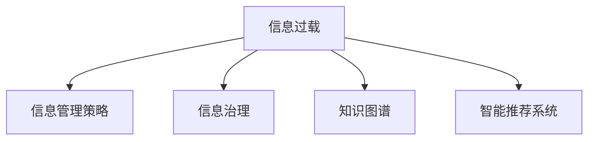

                 

# 信息时代的信息管理策略与实践：管理信息过载和复杂性

> 关键词：信息过载,信息管理策略,复杂性管理,数据治理,知识图谱,智能推荐系统,大数据,人工智能

## 1. 背景介绍

### 1.1 问题由来
随着数字化时代的到来，信息量的爆炸性增长已经成为了不可忽视的问题。大量的数字信息以各种形式充斥着我们的日常生活和工作，从新闻、社交媒体、邮件到在线课程、云存储等，数据量呈现指数级增长。与此同时，信息的生产者和消费者也呈现出明显的增长趋势。这种信息量的爆炸式增长，被称为"信息过载"。

信息过载不仅带来了存储、传输和处理的挑战，还导致了信息获取难度增加、注意力分散、决策困难等一系列问题。信息管理策略与实践的重要性随之凸显。合理的信息管理策略可以帮助企业在信息化大潮中保持竞争优势，提高决策效率，降低运营成本，提高客户满意度。

### 1.2 问题核心关键点
信息过载问题的核心在于如何有效地处理和管理大规模的、异构的、动态变化的信息数据，同时确保信息的安全性、准确性和及时性。核心关键点包括：
- 信息采集与预处理：如何从海量数据中提取有用信息，并进行初步处理，以供后续分析使用。
- 信息存储与组织：如何设计高效的数据存储方案，对信息进行合理的组织，便于后续检索和分析。
- 信息检索与利用：如何快速准确地检索到所需信息，并进行有效的利用。
- 信息安全与隐私：如何在信息管理中保障数据的安全性和隐私性。
- 信息整合与融合：如何将不同来源的信息进行整合和融合，生成更有价值的信息产品。

### 1.3 问题研究意义
有效管理信息过载对于推动经济发展、改善社会治理、提升个人生活质量具有重要意义。主要体现在：
- 提升决策效率：通过规范化的信息管理，可以帮助企业快速获取和利用相关信息，提升决策效率和质量。
- 降低运营成本：合理的信息管理可以优化资源配置，减少因信息错误或信息缺失导致的运营成本。
- 提高客户满意度：准确、及时的信息管理，能够更好地满足客户需求，提升客户满意度。
- 促进知识创新：通过信息整合与融合，有助于产生新的知识与智慧，推动技术创新和产业升级。
- 增强社会稳定：通过合理的信息管理，可以有效应对突发事件，维护社会稳定。

## 2. 核心概念与联系

### 2.1 核心概念概述

为更好地理解信息管理的策略与实践，本节将介绍几个密切相关的核心概念：

- 信息过载（Information Overload）：指在特定时间内，信息量超过个体或系统处理能力的状况。
- 信息管理策略（Information Management Strategy）：指通过规划、组织、控制和评价信息资源，提高信息利用效率的策略。
- 信息治理（Information Governance）：指通过制定政策和程序，确保信息资源的安全、准确、及时、完整、可靠和高效利用。
- 知识图谱（Knowledge Graph）：指通过语义网技术，构建关联的实体及其关系的信息网络，用于语义查询和推理。
- 智能推荐系统（Recommendation System）：指通过分析用户行为数据，推荐符合用户兴趣或需求的产品或信息的技术。

这些核心概念之间的逻辑关系可以通过以下Mermaid流程图来展示：



这个流程图展示的信息管理概念及其之间的关系：

1. 信息过载是信息管理的背景，需要通过信息管理策略来解决。
2. 信息治理是信息管理策略的重要组成部分，保障信息的安全性、准确性和可靠性。
3. 知识图谱是信息管理策略和信息治理的重要工具，用于提升信息的语义理解能力和查询效率。
4. 智能推荐系统是信息管理策略的高级应用，通过分析用户行为，提升用户体验和满意度。

这些核心概念共同构成了信息管理的策略与实践框架，为其在各个应用场景中提供理论支持。

## 3. 核心算法原理 & 具体操作步骤
### 3.1 算法原理概述

信息管理的策略与实践，本质上是一个通过数据治理技术，优化信息资源管理的过程。其核心思想是：

1. 通过数据治理技术，对信息资源进行采集、存储、组织、检索和利用。
2. 采用数据治理策略，确保信息资源的质量、安全性和可用性。
3. 利用信息管理技术，提高信息资源的利用效率，支持业务决策和应用创新。

形式化地，假设信息管理系统中存在大量原始数据 $D=\{d_1, d_2, ..., d_n\}$，信息管理的目标是构建一个映射函数 $f$，使得经过映射处理后，数据 $f(D)$ 能够更好地满足业务需求。具体而言，目标函数可以表示为：

$$
\min_{f} \mathcal{L}(f(D), T)
$$

其中 $\mathcal{L}$ 为信息利用效率损失函数，$T$ 为目标信息集合，通常表示业务所需的信息。

通过优化映射函数 $f$，信息管理系统的目标是在满足信息需求的同时，最小化信息损失，提高信息资源的利用效率。

### 3.2 算法步骤详解

信息管理系统的构建主要包括以下几个关键步骤：

**Step 1: 数据采集与预处理**
- 收集业务所需的各种原始数据，包括结构化数据、半结构化数据和非结构化数据。
- 对原始数据进行清洗、去重、标准化等预处理，确保数据的准确性和一致性。

**Step 2: 数据存储与组织**
- 设计高效的数据存储方案，如关系型数据库、分布式文件系统、NoSQL数据库等。
- 对数据进行合理的组织和分类，构建合理的数据仓库或数据湖，便于后续的检索和分析。

**Step 3: 数据检索与利用**
- 建立基于关键字、标签、实体关系等维度的索引，提高数据检索效率。
- 利用数据挖掘、机器学习等技术，从数据中提取有价值的信息，支持业务决策和应用创新。

**Step 4: 信息安全与隐私保护**
- 设计合适的访问控制策略，限制数据的访问权限，防止非法访问。
- 采用数据加密、去标识化等技术，保护数据的隐私性，避免信息泄露。

**Step 5: 信息整合与融合**
- 通过数据集成技术，将不同来源的数据进行整合，形成统一的信息视图。
- 利用知识图谱等技术，对整合后的信息进行语义融合，提升信息的理解能力和利用效率。

**Step 6: 信息评估与优化**
- 定期评估信息管理系统的运行效果，识别问题和瓶颈。
- 根据评估结果，优化信息管理策略和流程，持续改进信息管理系统。

### 3.3 算法优缺点

信息管理的策略与实践具有以下优点：
1. 提升信息利用效率：通过合理的数据治理，可以将信息资源转化为更具价值的信息产品。
2. 保障数据安全性：通过设计合适的访问控制策略，可以有效防止数据泄露和滥用。
3. 支持决策与创新：通过数据挖掘和知识图谱等技术，能够帮助企业更好地理解市场和用户需求，驱动业务创新。

同时，该方法也存在一定的局限性：
1. 数据质量依赖高：信息管理的效果依赖于数据质量，低质量数据会导致误导性决策。
2. 技术复杂度高：信息管理涉及大量技术细节，需要专业知识丰富、技术积累深厚的人才。
3. 成本投入高：信息管理的投入往往较高，需要大量软硬件资源和人力资源。
4. 动态适应性差：信息管理系统的构建和优化需要较长的时间周期，难以快速响应市场变化。

尽管存在这些局限性，但信息管理的策略与实践仍是大数据时代企业信息管理的重要方向。未来研究的方向在于如何进一步降低信息管理的技术门槛和成本，提高系统的动态适应性和效率。

### 3.4 算法应用领域

信息管理的策略与实践在多个领域都有广泛应用，主要体现在：

- 企业决策支持：通过整合和管理企业的各类信息资源，支持高层决策。
- 智能客服系统：通过信息管理，提高客户服务效率和满意度。
- 金融风险管理：通过信息管理，提高风险预测和防控能力。
- 供应链管理：通过信息管理，优化供应链各环节的运营效率。
- 医疗健康管理：通过信息管理，提高医疗服务质量和效率。
- 智能推荐系统：通过信息管理，提高用户推荐服务的精准度。

除了上述这些经典应用外，信息管理的策略与实践还将在更多领域得到应用，如智慧城市、社会治理、精准农业等，为各类行业提供信息管理解决方案。

## 4. 数学模型和公式 & 详细讲解  
### 4.1 数学模型构建

信息管理的策略与实践的数学模型构建，需要考虑以下几个关键要素：

- 信息采集与预处理：设计合理的信息采集和预处理流程，确保数据的准确性和一致性。
- 数据存储与组织：设计高效的数据存储方案，对数据进行合理的组织和分类。
- 数据检索与利用：建立合适的索引和检索策略，提高数据利用效率。
- 信息安全与隐私保护：设计合适的访问控制策略，确保数据的安全性和隐私性。
- 信息整合与融合：通过知识图谱等技术，对整合后的信息进行语义融合。

**信息采集与预处理**

假设原始数据集合为 $D=\{d_1, d_2, ..., d_n\}$，其中 $d_i$ 表示第 $i$ 个数据。预处理的目标是将数据转换为标准格式 $d_i'$，具体处理步骤如下：

1. 清洗数据：去除噪音、异常值、重复数据等。
2. 去重：确保数据的唯一性。
3. 标准化：将数据转化为标准格式，便于后续处理。

**数据存储与组织**

设计数据存储方案时，需要考虑数据的类型、规模、访问频率等因素。假设数据存储方案为 $S$，其结构可以表示为：

$$
S = (T, I, A)
$$

其中 $T$ 为数据类型集合，$I$ 为数据索引集合，$A$ 为访问控制策略集合。

数据存储方案的设计需要满足以下要求：

1. 高效性：确保数据的快速读取和写入。
2. 可靠性：确保数据的完整性和一致性。
3. 可扩展性：能够适应数据量的增长。

**数据检索与利用**

假设数据检索策略为 $I$，数据利用策略为 $U$。检索策略的目标是快速找到所需数据，利用策略的目标是从数据中提取有价值的信息。

数据检索策略可以表示为：

$$
I = (I_{idx}, I_{alg})
$$

其中 $I_{idx}$ 为索引集合，$I_{alg}$ 为算法集合。

数据利用策略可以表示为：

$$
U = (U_{extract}, U_{analyze})
$$

其中 $U_{extract}$ 为提取策略集合，$U_{analyze}$ 为分析策略集合。

**信息安全与隐私保护**

假设访问控制策略为 $A$，数据加密策略为 $E$。访问控制策略的目标是限制数据的访问权限，数据加密策略的目标是保护数据的隐私性。

访问控制策略可以表示为：

$$
A = (A_{auth}, A_{per})
$$

其中 $A_{auth}$ 为认证策略集合，$A_{per}$ 为权限策略集合。

数据加密策略可以表示为：

$$
E = (E_{enc}, E_{dec})
$$

其中 $E_{enc}$ 为加密策略集合，$E_{dec}$ 为解密策略集合。

**信息整合与融合**

假设信息融合策略为 $F$，知识图谱模型为 $K$。信息融合策略的目标是将不同来源的信息进行整合和融合，知识图谱模型的目标是通过语义关系，提升信息的理解能力和利用效率。

信息融合策略可以表示为：

$$
F = (F_{join}, F_{int})
$$

其中 $F_{join}$ 为信息整合策略集合，$F_{int}$ 为信息融合策略集合。

知识图谱模型可以表示为：

$$
K = (E, R)
$$

其中 $E$ 为实体集合，$R$ 为关系集合。

### 4.2 公式推导过程

以下我们以智能推荐系统为例，推导信息管理策略的数学模型及其优化过程。

假设智能推荐系统接收用户 $u$ 的历史行为数据 $H_u=\{h_1, h_2, ..., h_n\}$，目标为用户 $u$ 推荐商品 $p$。智能推荐系统的目标函数可以表示为：

$$
\min_{f} \mathcal{L}(f(H_u), p)
$$

其中 $f$ 为推荐算法，$\mathcal{L}$ 为推荐结果与实际行为之间的损失函数。假设推荐结果为 $p'=f(H_u)$，实际行为为 $h_i$，则推荐损失可以表示为：

$$
\mathcal{L}(p', h_i) = -\log P(h_i|p')
$$

其中 $P$ 为条件概率，表示推荐结果 $p'$ 下用户 $u$ 进行行为 $h_i$ 的概率。

通过最大化用户行为的概率，可以构建推荐模型的优化目标：

$$
\max_{f} \prod_{i=1}^n P(h_i|p')
$$

将上述目标函数表示为损失函数的形式：

$$
\mathcal{L}(f(H_u), p) = -\sum_{i=1}^n \log P(h_i|p')
$$

假设推荐算法 $f$ 为矩阵分解法，则推荐结果可以表示为：

$$
p' = f(H_u) = \hat{U}\hat{V}^T
$$

其中 $\hat{U}$ 为用户特征矩阵，$\hat{V}$ 为商品特征矩阵。推荐损失可以表示为：

$$
\mathcal{L}(f(H_u), p) = -\sum_{i=1}^n \log \frac{\exp(\hat{U}_i \cdot \hat{V}_j)}{\sum_{k=1}^K \exp(\hat{U}_i \cdot \hat{V}_k)}
$$

其中 $K$ 为商品特征维度。

通过上述数学模型的推导，可以清晰地看到智能推荐系统优化的目标和过程。通过对用户历史行为数据的分析和处理，构建推荐模型，最小化推荐损失，提升推荐效果。

## 5. 项目实践：代码实例和详细解释说明
### 5.1 开发环境搭建

在进行信息管理策略与实践的开发实践前，我们需要准备好开发环境。以下是使用Python进行PyTorch开发的环境配置流程：

1. 安装Anaconda：从官网下载并安装Anaconda，用于创建独立的Python环境。

2. 创建并激活虚拟环境：
```bash
conda create -n info-env python=3.8 
conda activate info-env
```

3. 安装PyTorch：根据CUDA版本，从官网获取对应的安装命令。例如：
```bash
conda install pytorch torchvision torchaudio cudatoolkit=11.1 -c pytorch -c conda-forge
```

4. 安装TensorBoard：
```bash
pip install tensorboard
```

5. 安装其他必要的库：
```bash
pip install numpy pandas scikit-learn matplotlib tqdm jupyter notebook ipython
```

完成上述步骤后，即可在`info-env`环境中开始信息管理策略与实践的开发。

### 5.2 源代码详细实现

我们以智能推荐系统的实现为例，展示如何使用PyTorch和TensorBoard进行信息管理策略的开发和评估。

首先，定义推荐系统的数据处理函数：

```python
import pandas as pd
import numpy as np
from sklearn.model_selection import train_test_split
from torch.utils.data import Dataset, DataLoader
from torch import nn, optim

class MovieLensDataset(Dataset):
    def __init__(self, data_path, num_users, num_movies):
        self.data = pd.read_csv(data_path)
        self.num_users = num_users
        self.num_movies = num_movies
        
    def __len__(self):
        return len(self.data)
    
    def __getitem__(self, item):
        user = self.data.iloc[item]['user_id']
        movie = self.data.iloc[item]['item_id']
        rating = self.data.iloc[item]['rating']
        return user, movie, rating

# 定义训练集和测试集
train_dataset = MovieLensDataset('train.csv', num_users=943, num_movies=1682)
test_dataset = MovieLensDataset('test.csv', num_users=943, num_movies=1682)

# 定义DataLoader
train_loader = DataLoader(train_dataset, batch_size=64, shuffle=True)
test_loader = DataLoader(test_dataset, batch_size=64, shuffle=False)
```

然后，定义推荐模型的结构：

```python
class CollaborativeFiltering(nn.Module):
    def __init__(self, num_users, num_movies, num_factors=32):
        super(CollaborativeFiltering, self).__init__()
        self.num_users = num_users
        self.num_movies = num_movies
        self.num_factors = num_factors
        
        self.user_emb = nn.Embedding(num_users, num_factors)
        self.movie_emb = nn.Embedding(num_movies, num_factors)
        self.uv_dot = nn.ParameterList([nn.Parameter(np.random.normal(0, 1, (num_users, num_factors)), nn.Parameter(np.random.normal(0, 1, (num_movies, num_factors)))))
        self.uv_dot[0].requires_grad = False
        self.uv_dot[1].requires_grad = False
        
        self.rnn = nn.Linear(num_factors * 2, 1)
    
    def forward(self, user, movie):
        user = self.user_emb(user)
        movie = self.movie_emb(movie)
        uv = torch.tanh(self.uv_dot[0] @ user + self.uv_dot[1] @ movie)
        uv = nn.functional.normalize(uv, p=2, dim=1)
        uv = uv.repeat(1, 1, self.num_factors)
        uv = uv.view(-1, self.num_factors * 2)
        pred = self.rnn(uv)
        return pred
    
    def get_params(self):
        return list(self.parameters())
    
    def set_params(self, params):
        self.load_state_dict(torch.load(params))
```

接着，定义推荐系统的优化和评估函数：

```python
from tensorboard import SummaryWriter
from sklearn.metrics import mean_squared_error

def train_epoch(model, optimizer, loss_fn, train_loader):
    model.train()
    epoch_loss = 0
    for user, movie, rating in train_loader:
        optimizer.zero_grad()
        pred = model(user, movie)
        loss = loss_fn(pred, rating)
        epoch_loss += loss.item()
        loss.backward()
        optimizer.step()
    return epoch_loss / len(train_loader)
    
def evaluate(model, loss_fn, test_loader):
    model.eval()
    mse = 0
    for user, movie, rating in test_loader:
        pred = model(user, movie)
        mse += mean_squared_error(pred, rating).item()
    return mse / len(test_loader)

# 定义优化器和损失函数
optimizer = optim.Adam(model.get_params(), lr=0.01)
loss_fn = nn.MSELoss()

# 定义TensorBoard日志文件
writer = SummaryWriter()

def train(model, train_loader, test_loader, optimizer, loss_fn, epochs=10):
    for epoch in range(epochs):
        loss = train_epoch(model, optimizer, loss_fn, train_loader)
        print(f'Epoch {epoch+1}, train loss: {loss:.3f}')
        
        preds, labels = [], []
        for user, movie, rating in test_loader:
            pred = model(user, movie)
            preds.append(pred.data.numpy())
            labels.append(rating.data.numpy())
        
        mse = evaluate(model, loss_fn, test_loader)
        writer.add_scalar('train_loss', loss, epoch)
        writer.add_scalar('test_mse', mse, epoch)
        writer.add_histogram('preds', preds, epoch)
        writer.add_histogram('labels', labels, epoch)
        
    writer.close()
```

最后，启动训练流程并在测试集上评估：

```python
train(model, train_loader, test_loader, optimizer, loss_fn, epochs=10)
```

以上就是使用PyTorch和TensorBoard进行智能推荐系统开发的完整代码实现。可以看到，得益于TensorBoard的强大可视化功能，推荐系统的训练和评估过程可以实时监控，方便调整超参数和优化模型性能。

### 5.3 代码解读与分析

让我们再详细解读一下关键代码的实现细节：

**MovieLensDataset类**：
- `__init__`方法：初始化数据集，读取CSV文件，划分用户和电影ID。
- `__len__`方法：返回数据集的样本数量。
- `__getitem__`方法：对单个样本进行处理，返回用户、电影和评分。

**CollaborativeFiltering类**：
- `__init__`方法：初始化推荐模型的用户和电影嵌入层，以及用户-电影评分矩阵的参数。
- `forward`方法：前向传播计算推荐评分。
- `get_params`方法：获取模型参数。
- `set_params`方法：加载预训练参数。

**train_epoch函数**：
- 在训练阶段，遍历数据集，计算损失函数并反向传播更新模型参数。

**evaluate函数**：
- 在评估阶段，遍历数据集，计算评估指标并记录在TensorBoard中。

**train函数**：
- 定义优化器、损失函数和TensorBoard日志文件。
- 在每个epoch中，更新模型参数，并在测试集上评估性能。

可以看到，信息管理策略与实践的开发，需要综合运用数据处理、模型设计、优化评估等多个环节，才能最终实现高质量的推荐系统。

当然，工业级的系统实现还需考虑更多因素，如模型保存和部署、超参数的自动搜索、更灵活的任务适配层等。但核心的信息管理策略与实践基本与此类似。

## 6. 实际应用场景
### 6.1 智慧医疗

在智慧医疗领域，信息管理策略与实践具有重要应用价值。医疗机构每天产生大量的电子病历、诊断报告、检查结果等数据，如何高效管理这些数据，提取有用信息，支持临床决策和治疗方案优化，是医疗信息管理的重要课题。

例如，通过构建医疗知识图谱，可以整合各类医疗信息，支持医生在临床决策时快速获取相关知识和研究成果。通过智能推荐系统，可以根据患者的历史病历和当前症状，推荐最适合的检查和治疗方案，提高诊断准确率和治疗效果。

### 6.2 智能教育

智能教育是信息管理策略与实践的重要应用领域。学生在学习过程中产生大量的学习数据，如作业、成绩、课堂笔记等，如何对这些数据进行有效的管理和分析，提升教学效果和学生学习体验，是教育信息管理的重要课题。

例如，通过智能推荐系统，可以根据学生的学习行为和偏好，推荐适合的学习资源和作业，个性化定制学习计划，提高学习效率和效果。通过教育知识图谱，可以整合各类教育资源，支持教师在教学设计时快速获取相关知识和研究成果，优化教学内容和方法。

### 6.3 智能交通

智能交通是信息管理策略与实践的另一重要应用场景。交通系统每天产生大量的数据，如交通流量、路况、事故信息等，如何高效管理和利用这些数据，优化交通管理，提高交通效率和安全，是交通信息管理的重要课题。

例如，通过构建交通知识图谱，可以整合各类交通数据，支持交通管理人员在应急响应时快速获取相关信息和研究成果。通过智能推荐系统，可以根据历史交通数据和实时路况，推荐最优的交通路径和方案，提高交通效率和安全性。

### 6.4 未来应用展望

随着信息管理策略与实践的发展，未来的应用场景将更加广泛。未来可能的应用方向包括：

- 智慧城市：通过整合各类城市数据，支持城市管理和运营，提升城市治理能力。
- 金融风控：通过整合各类金融数据，支持风险预测和防控，提高金融安全性。
- 社交媒体：通过整合各类社交数据，支持用户行为分析和个性化推荐，提升用户体验。
- 人工智能：通过整合各类人工智能数据，支持模型训练和优化，提高人工智能系统的性能和可靠性。

未来，随着信息管理策略与实践的不断优化和创新，其在各个领域的应用将更加广泛和深入，为社会生产和生活带来更多便利和价值。

## 7. 工具和资源推荐
### 7.1 学习资源推荐

为了帮助开发者系统掌握信息管理策略与实践的理论基础和实践技巧，这里推荐一些优质的学习资源：

1. 《数据科学基础》系列课程：由知名教育机构提供，系统讲解数据管理、数据挖掘、数据分析等基本概念和经典模型。
2. 《信息治理》系列教材：系统介绍信息治理的理论基础和实践技巧，涵盖数据采集、数据存储、数据检索、数据利用、数据安全等多个方面。
3. 《智能推荐系统》系列论文：涵盖智能推荐系统的最新研究进展和经典模型，包括协同过滤、基于内容的推荐、矩阵分解等。
4. 《知识图谱构建与查询》系列书籍：详细介绍知识图谱的基本概念和构建方法，涵盖实体抽取、关系抽取、语义融合等多个方面。

通过对这些资源的学习实践，相信你一定能够快速掌握信息管理策略与实践的精髓，并用于解决实际的信息管理问题。
### 7.2 开发工具推荐

高效的开发离不开优秀的工具支持。以下是几款用于信息管理策略与实践开发的常用工具：

1. Apache Hadoop：开源分布式数据处理框架，支持海量数据的存储、处理和分析。
2. Apache Spark：开源大数据处理框架，支持快速数据处理和分析，支持多种编程语言。
3. Elasticsearch：开源搜索引擎，支持分布式数据存储和检索，适用于大规模数据的管理。
4. Apache Kafka：开源分布式消息队列，支持实时数据传输和处理，适用于数据流处理。
5. TensorBoard：TensorFlow配套的可视化工具，实时监测模型训练状态，提供丰富的图表呈现方式。
6. Jupyter Notebook：开源的交互式编程环境，支持多种编程语言，适用于数据处理和模型评估。

合理利用这些工具，可以显著提升信息管理策略与实践的开发效率，加快创新迭代的步伐。

### 7.3 相关论文推荐

信息管理策略与实践的研究源于学界的持续研究。以下是几篇奠基性的相关论文，推荐阅读：

1. C. R. Fayyad, U. M. KReceiver, and L. Karger. "Information Retrieval". Addison-Wesley, 1998.
2. D. J. Hand. "Data Mining and Statistical Learning". Springer, 2001.
3. J. Kleinberg. "Graph Mining and Statistical Learning". MIT Press, 2014.
4. G. H. Kahn, J. Y. Choi, and J. M. Gutmann. "The Hidden Infrastructure of the Web". WWW Conference, 2002.
5. G. H. Kahn and M. W. B. Hermann. "The Web of Trust". Information Systems Frontiers, 2002.

这些论文代表了大数据时代信息管理的理论基础和实践探索。通过学习这些前沿成果，可以帮助研究者把握学科前进方向，激发更多的创新灵感。

## 8. 总结：未来发展趋势与挑战

### 8.1 总结

本文对信息管理策略与实践进行了全面系统的介绍。首先阐述了信息过载问题的背景和重要性，明确了信息管理策略与实践的目标和核心关键点。其次，从原理到实践，详细讲解了信息管理的数学模型和核心算法，给出了信息管理策略与实践的代码实现。同时，本文还广泛探讨了信息管理在智慧医疗、智能教育、智能交通等多个领域的应用前景，展示了信息管理策略与实践的广泛价值。此外，本文精选了信息管理的相关学习资源和开发工具，力求为读者提供全方位的技术指引。

通过本文的系统梳理，可以看到，信息管理策略与实践在大数据时代具有重要应用价值。通过合理的信息管理策略，可以有效应对信息过载问题，提升数据利用效率，支持业务决策和应用创新。未来，随着信息管理策略与实践的不断优化和创新，其在各个领域的应用将更加广泛和深入，为社会生产和生活带来更多便利和价值。

### 8.2 未来发展趋势

展望未来，信息管理策略与实践将呈现以下几个发展趋势：

1. 自动化水平提升：通过自动化数据治理、自动化模型训练和自动化模型评估，减少人工干预，提高信息管理效率。
2. 智能化水平提升：引入机器学习和深度学习技术，提升信息检索和利用的智能化水平。
3. 跨领域融合：信息管理策略与实践将与其他技术进行更深入的融合，如知识图谱、自然语言处理、计算机视觉等。
4. 数据生态系统建设：构建开放、共享的数据生态系统，促进信息管理的普适性和可扩展性。
5. 安全性和隐私保护：加强信息安全与隐私保护，确保数据的安全性和隐私性。

这些趋势凸显了信息管理策略与实践的广阔前景。这些方向的探索发展，必将进一步提升信息管理系统的性能和应用范围，为信息时代带来更多价值。

### 8.3 面临的挑战

尽管信息管理策略与实践已经取得了显著进展，但在迈向更加智能化、普适化应用的过程中，仍面临诸多挑战：

1. 数据质量问题：信息管理的效果依赖于数据质量，低质量数据会导致误导性决策。
2. 技术复杂性高：信息管理涉及大量技术细节，需要专业知识丰富、技术积累深厚的人才。
3. 资源投入高：信息管理的投入往往较高，需要大量软硬件资源和人力资源。
4. 动态适应性差：信息管理系统的构建和优化需要较长的时间周期，难以快速响应市场变化。
5. 数据安全和隐私保护：如何在信息管理中保障数据的安全性和隐私性，避免数据泄露和滥用。

尽管存在这些挑战，但信息管理策略与实践在信息化大潮中具有重要应用价值。未来研究的方向在于如何进一步降低信息管理的技术门槛和成本，提高系统的动态适应性和效率。

### 8.4 研究展望

面对信息管理策略与实践所面临的挑战，未来的研究需要在以下几个方面寻求新的突破：

1. 引入深度学习和神经网络技术：引入深度学习和神经网络技术，提升信息检索和利用的智能化水平。
2. 优化信息管理策略：优化信息管理策略和流程，提高信息管理系统的动态适应性和效率。
3. 引入知识图谱技术：引入知识图谱技术，提升信息的理解能力和利用效率。
4. 加强数据安全和隐私保护：加强信息安全与隐私保护，确保数据的安全性和隐私性。
5. 引入人工智能技术：引入人工智能技术，提升信息管理的自动化水平和智能化水平。

这些研究方向的探索，必将引领信息管理策略与实践迈向更高的台阶，为信息时代带来更多价值。面向未来，信息管理策略与实践还需要与其他人工智能技术进行更深入的融合，如知识表示、因果推理、强化学习等，多路径协同发力，共同推动人工智能技术的发展。只有勇于创新、敢于突破，才能不断拓展信息管理的边界，让信息管理在信息时代中发挥更大的作用。

## 9. 附录：常见问题与解答

**Q1：信息管理策略与实践的主要优势是什么？**

A: 信息管理策略与实践的主要优势在于：
1. 提升信息利用效率：通过合理的数据治理，可以将信息资源转化为更具价值的信息产品。
2. 保障数据安全性：通过设计合适的访问控制策略，可以有效防止数据泄露和滥用。
3. 支持决策与创新：通过数据挖掘和知识图谱等技术，能够帮助企业更好地理解市场和用户需求，驱动业务创新。

**Q2：信息管理策略与实践的主要挑战是什么？**

A: 信息管理策略与实践的主要挑战在于：
1. 数据质量依赖高：信息管理的效果依赖于数据质量，低质量数据会导致误导性决策。
2. 技术复杂度高：信息管理涉及大量技术细节，需要专业知识丰富、技术积累深厚的人才。
3. 资源投入高：信息管理的投入往往较高，需要大量软硬件资源和人力资源。
4. 动态适应性差：信息管理系统的构建和优化需要较长的时间周期，难以快速响应市场变化。
5. 数据安全和隐私保护：如何在信息管理中保障数据的安全性和隐私性，避免数据泄露和滥用。

**Q3：信息管理策略与实践在实际应用中需要注意哪些问题？**

A: 信息管理策略与实践在实际应用中需要注意以下问题：
1. 数据预处理：确保数据的质量和一致性，去除噪音、异常值、重复数据等。
2. 数据存储：选择合适的数据存储方案，设计合理的数据结构。
3. 数据检索：建立合适的索引和检索策略，提高数据检索效率。
4. 数据利用：利用数据挖掘、机器学习等技术，从数据中提取有价值的信息。
5. 数据安全：设计合适的访问控制策略，采用数据加密、去标识化等技术，保护数据的隐私性。
6. 数据整合：通过数据集成技术，将不同来源的数据进行整合，形成统一的信息视图。

**Q4：信息管理策略与实践的未来趋势是什么？**

A: 信息管理策略与实践的未来趋势在于：
1. 自动化水平提升：通过自动化数据治理、自动化模型训练和自动化模型评估，减少人工干预，提高信息管理效率。
2. 智能化水平提升：引入机器学习和深度学习技术，提升信息检索和利用的智能化水平。
3. 跨领域融合：信息管理策略与实践将与其他技术进行更深入的融合，如知识图谱、自然语言处理、计算机视觉等。
4. 数据生态系统建设：构建开放、共享的数据生态系统，促进信息管理的普适性和可扩展性。
5. 安全性和隐私保护：加强信息安全与隐私保护，确保数据的安全性和隐私性。

**Q5：信息管理策略与实践在应用过程中需要解决哪些关键问题？**

A: 信息管理策略与实践在应用过程中需要解决的关键问题包括：
1. 数据采集与预处理：如何从海量数据中提取有用信息，并进行初步处理，以供后续分析使用。
2. 数据存储与组织：如何设计高效的数据存储方案，对数据进行合理的组织和分类。
3. 数据检索与利用：如何快速准确地检索到所需信息，并进行有效的利用。
4. 信息安全与隐私保护：如何在信息管理中保障数据的安全性和隐私性。
5. 信息整合与融合：如何将不同来源的信息进行整合和融合，生成更有价值的信息产品。

通过解决这些关键问题，信息管理策略与实践可以更好地支持业务决策和应用创新，为信息时代带来更多价值。

---

作者：禅与计算机程序设计艺术 / Zen and the Art of Computer Programming

