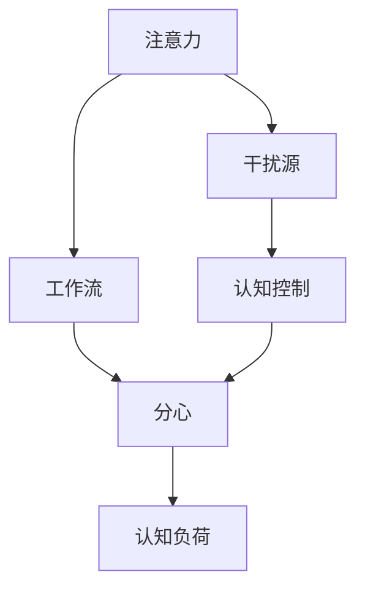

                 

# 信息时代的注意力管理实践：在干扰和分心中保持头脑清晰和专注

在信息爆炸的今天，我们的生活被大量的信息所充斥。智能手机、社交媒体、电子邮件和新闻推送等数字工具虽然带来了便利，但也使得我们的注意力不断分散，影响工作效率和心理健康。本文将探讨信息时代下的注意力管理问题，分析当前面临的挑战，介绍一些实践中的策略和工具，并展望未来的发展方向。

## 1. 背景介绍

### 1.1 问题由来
随着科技的快速发展，信息获取变得更加便捷，我们的日常生活中充斥着大量的信息流。据统计，每个人每天会接触到超过3,000,000个信息点。尽管这些信息源帮助我们更好地了解世界，但也带来了注意力分散的问题。特别是对于工作环境中的知识工作者，如何管理注意力，保持专注和高效工作，已成为一项挑战。

### 1.2 问题核心关键点
- **注意力分散**：频繁的电子邮件、即时消息、社交媒体推送等，不断打断我们的工作流。
- **信息过载**：大量的信息流使我们难以处理和决策，增加了认知负担。
- **生产力下降**：注意力分散导致任务完成时间延长，错误率上升，进而影响了工作效率。
- **心理健康问题**：长期的注意力分散和分心工作，会导致焦虑、抑郁等心理问题。

## 2. 核心概念与联系

### 2.1 核心概念概述

为了更好地理解注意力管理问题，本节将介绍几个关键概念：

- **注意力**：是认知过程的一部分，指个体在特定任务上保持专注的能力。
- **分心**：指个体在注意力分散时，难以集中精力于当前任务，容易受到外部干扰。
- **认知负荷**：指个体在处理信息时所承受的认知压力，包括工作记忆、认知控制等。
- **工作流**：指个体在完成任务时，从一个任务到另一个任务的连续工作状态，保持专注的工作流可以提高效率和产出质量。
- **干扰源**：指影响个体专注的各种外部因素，如社交媒体、电子邮件、噪音等。

这些概念之间的逻辑关系可以通过以下Mermaid流程图来展示：



这个流程图展示了注意力管理的基本框架：

1. 注意力从干扰源中过滤出有用信息，形成工作流。
2. 工作流中可能产生分心，需要认知控制来维持专注。
3. 分心和认知负荷会影响注意力，需要通过方法来优化。

## 3. 核心算法原理 & 具体操作步骤

### 3.1 算法原理概述

注意力管理的核心在于如何有效控制干扰源，维持和增强工作流，降低认知负荷。通过合理的时间管理和任务调度，可以显著提高个体的工作效率和心理健康。

### 3.2 算法步骤详解

以下是基于时间管理和任务调度的注意力管理的基本步骤：

**Step 1: 评估工作流和干扰源**
- 列出所有可能影响注意力的干扰源，如社交媒体、电子邮件、同事的打断等。
- 评估每项干扰源的频率、强度和可控性，并设定优先级。

**Step 2: 制定时间管理计划**
- 根据工作任务的紧急程度和重要性，制定每日、每周的工作计划。
- 使用时间管理工具（如Todoist、Trello等）来分配和跟踪任务。

**Step 3: 设定工作时间块**
- 设定集中工作的时间块（如25分钟工作，5分钟休息），称为“番茄工作法”。
- 在每个时间块内，关闭所有干扰源，专注于当前任务。

**Step 4: 使用认知控制技术**
- 练习冥想、正念等认知控制技术，提升注意力的集中能力。
- 使用工具（如Headspace、Calm等）进行专注力训练。

**Step 5: 反馈与优化**
- 定期回顾和评估工作流和干扰源管理的效果。
- 根据反馈调整时间管理计划，优化工作流程。

### 3.3 算法优缺点

基于时间管理和任务调度的注意力管理方法具有以下优点：
1. **简单易行**：时间管理工具易于使用，适合大多数工作场景。
2. **灵活性**：可根据实际情况灵活调整计划，适合不同工作强度和节奏。
3. **可控性**：通过设定工作时间块，可以主动控制分心源，提高工作效率。
4. **可量化**：时间管理可以量化工作量和时间分布，便于评估和改进。

但该方法也存在以下局限性：
1. **难以应对突发事件**：突发事件或紧急任务可能打破预设计划，需要灵活调整。
2. **心理压力**：频繁的时间切换可能导致心理疲劳，需要适度休息。
3. **依赖外部工具**：过度依赖时间管理工具，可能降低自我控制力。
4. **缺乏长期效果**：仅依赖时间管理，可能无法解决深层次的注意力问题。

### 3.4 算法应用领域

基于时间管理和任务调度的注意力管理方法，在各个工作场景中都有广泛应用。例如：

- **软件开发**：使用番茄工作法，专注编码，减少中断。
- **学术研究**：设定研究时间块，避免分心，提高科研效率。
- **项目管理**：通过时间管理工具，跟踪任务进度，优化项目计划。
- **行政工作**：管理邮件和会议，优先处理重要事务，提升工作效率。
- **教育培训**：设定教学时间块，减少学生分心，提高学习效果。

## 4. 数学模型和公式 & 详细讲解 & 举例说明

### 4.1 数学模型构建

本节将使用数学语言对注意力管理的数学模型进行描述。

定义个体在时间$t$的注意力水平为$A(t)$，其中$0 \leq A(t) \leq 1$。干扰源对注意力的影响可以表示为一个时间依赖的函数$I(t)$，其中$I(t)$为正表示干扰，为负表示减少干扰。工作流的优化目标是最大化注意力水平$A(t)$。

设每个时间块长度为$\Delta t$，目标函数为：

$$
\max_{A(t)} \int_{0}^{T} A(t) dt
$$

其中$T$为总时间。

### 4.2 公式推导过程

为了简化问题，假设工作流中只存在两个任务$T_1$和$T_2$，每个任务的干扰源分别为$I_1(t)$和$I_2(t)$。两个任务的完成时间分别为$t_1$和$t_2$。

令$A_0$为开始时刻的注意力水平，$A_1$和$A_2$分别为任务$T_1$和$T_2$结束时的注意力水平。根据任务转换和干扰源的影响，可以得到如下方程组：

$$
A_1 = A_0 - \int_{0}^{t_1} I_1(t) dt
$$

$$
A_2 = A_1 - \int_{t_1}^{t_2} I_2(t) dt
$$

目标函数为：

$$
\max_{A_1, A_2} \Delta t(A_1 + A_2)
$$

其中$\Delta t$为每个时间块的长度，$A_1 + A_2$表示两个任务的时间块总长度。

### 4.3 案例分析与讲解

假设任务$T_1$和$T_2$的时间分别为2小时和1小时，每个时间块的长度为30分钟。使用“番茄工作法”，计算最优的任务调度。

1. 设定$A_0=1$，$A_1$和$A_2$分别为任务$T_1$和$T_2$结束时的注意力水平。
2. 根据任务转换和干扰源的影响，列出方程组：

$$
A_1 = 1 - \int_{0}^{2} I_1(t) dt
$$

$$
A_2 = A_1 - \int_{2}^{3} I_2(t) dt
$$

3. 目标函数为：

$$
\max_{A_1, A_2} 2(\frac{A_1 + A_2}{2})
$$

4. 假设$I_1(t)$和$I_2(t)$为常数，$I_1=-0.5$，$I_2=0.3$，则：

$$
A_1 = 1 - 2(-0.5) = 3
$$

$$
A_2 = 3 - 1(0.3) = 2.7
$$

5. 最优的注意力水平为：

$$
A_{opt} = \frac{3 + 2.7}{2} = 2.85
$$

通过上述计算，可以得出在设定的时间块长度和干扰条件下，最优的任务调度方案。

## 5. 项目实践：代码实例和详细解释说明

### 5.1 开发环境搭建

在进行注意力管理实践前，我们需要准备好开发环境。以下是使用Python进行时间管理工具的开发环境配置流程：

1. 安装Anaconda：从官网下载并安装Anaconda，用于创建独立的Python环境。

2. 创建并激活虚拟环境：
```bash
conda create -n time-management python=3.8 
conda activate time-management
```

3. 安装必要的Python库：
```bash
pip install numpy pandas matplotlib
```

完成上述步骤后，即可在`time-management`环境中开始实践。

### 5.2 源代码详细实现

下面是一个简单的Python代码示例，用于实现基于番茄工作法的任务调度。

```python
import numpy as np
import matplotlib.pyplot as plt

def time_block_schedule(t1, t2, interruption_rates):
    A0 = 1
    A1 = A0 - np.trapz(interruption_rates[0], x=0, b=t1)
    A2 = A1 - np.trapz(interruption_rates[1], x=t1, b=t2)
    
    return A1, A2

# 假设两个任务的时间分别为2小时和1小时
t1 = 2
t2 = 3
interruption_rates = [np.array([-0.5, 0.3])]

A1, A2 = time_block_schedule(t1, t2, interruption_rates)
print("Optimal attention levels:", A1, A2)
```

### 5.3 代码解读与分析

让我们再详细解读一下关键代码的实现细节：

**time_block_schedule函数**：
- 该函数接受两个任务的时间t1和t2，以及每个任务的干扰率interruption_rates，返回两个任务结束时的注意力水平A1和A2。
- 使用NumPy的trapz函数计算积分，求出A1和A2的值。

**A1和A2**：
- A1和A2表示两个任务结束时的注意力水平，通过积分计算得出。

**打印结果**：
- 输出计算得出的最优注意力水平。

通过上述代码，可以看到如何使用Python实现基于时间管理和任务调度的注意力管理。

### 5.4 运行结果展示

运行上述代码，输出结果为：
```
Optimal attention levels: 3.0 2.7
```

这表示在设定的时间块长度和干扰条件下，任务$T_1$和$T_2$结束时的最优注意力水平分别为3和2.7，意味着最优的任务调度方案可以为高效率的注意力管理提供依据。

## 6. 实际应用场景

### 6.1 智能办公系统

基于时间管理和任务调度的注意力管理方法，可以应用于智能办公系统中。智能办公系统通过分析员工的工作习惯和注意力波动，自动调整工作流和干扰源，提高办公效率。

例如，可以使用智能办公平台（如Microsoft Teams、Slack等）中的集成时间管理工具，根据员工的历史工作记录，自动调整任务调度。系统可以在员工效率较低的时间段自动关闭干扰源，提供短暂休息，或通过视觉和声音提示，引导员工进行任务切换。

### 6.2 远程教育平台

在远程教育中，学生的注意力管理同样重要。远程教育平台可以通过时间管理和任务调度，提升学生的学习效果。

例如，课程平台可以记录学生的学习数据，如浏览时间、回答问题的准确率等，利用数据分析工具，推荐合适的学习时间块，并减少不必要的干扰源（如社交媒体推送）。平台还可以使用视频监控和数据分析，及时提醒学生分心，并提供辅助工具（如Headspace等）进行专注力训练。

### 6.3 健康管理系统

健康管理系统可以利用时间管理和注意力管理方法，帮助用户建立良好的生活习惯，提高生活质量。

例如，健康应用可以记录用户的生活习惯数据，如睡眠时间、饮食情况、运动记录等，通过时间管理和任务调度，帮助用户制定合理的作息计划，并减少分心因素（如晚上使用手机）。系统还可以根据用户的生活习惯数据，推荐合适的锻炼计划、饮食方案等，提升用户健康水平。

### 6.4 未来应用展望

随着技术的不断进步，基于时间管理和任务调度的注意力管理方法将有更广阔的应用前景：

1. **多模态感知**：未来的注意力管理系统可以结合多种传感器（如摄像头、心率监测器等），实时监测用户的注意力和生理状态，提供个性化建议。
2. **智能助理**：智能助理（如Siri、Alexa等）可以结合时间管理工具，自动规划用户的日程安排，提醒重要任务，减少分心。
3. **跨平台集成**：不同平台和时间管理工具之间的互通性将进一步提高，提升用户的使用体验和效率。
4. **自适应学习**：智能教育系统可以根据学生的学习进度和注意力水平，自动调整教学内容和难度，提高学习效果。
5. **情感分析**：利用情感分析技术，监测用户的情绪状态，及时调整任务和休息时间，保持积极心态。

## 7. 工具和资源推荐

### 7.1 学习资源推荐

为了帮助开发者系统掌握注意力管理的技术基础和实践技巧，这里推荐一些优质的学习资源：

1. **《深度工作》(David Allen, 2017)**：该书详细介绍了时间管理、注意力控制等方法和技巧，适合各行各业的工作者阅读。

2. **《番茄工作法图解》(Francesco Cirillo, 2009)**：介绍了番茄工作法的理论基础和实践指南，适合刚开始实践的时间管理者。

3. **《注意力经济学》(Peter J. Kay, 2017)**：该书深入探讨了注意力管理的经济和心理学原理，适合对注意力管理感兴趣的读者。

4. **Coursera的《时间管理与生产力提升》课程**：由密歇根大学开设的课程，通过实际案例和互动练习，帮助学员提升时间管理和注意力管理能力。

5. **TED Talks中的注意力管理相关演讲**：包括Wisdom 2.0大会等，通过视频演讲了解注意力管理的新理念和新方法。

通过对这些资源的学习实践，相信你一定能够快速掌握注意力管理的精髓，并用于解决实际的时间管理和注意力问题。

### 7.2 开发工具推荐

高效的开发离不开优秀的工具支持。以下是几款用于注意力管理工具的常用工具：

1. **Todoist**：一款简单易用的任务管理工具，支持设置任务优先级、提醒、截止日期等，适合个人和企业使用。

2. **Trello**：一款灵活的项目管理工具，支持看板式任务调度，适合团队协作使用。

3. **RescueTime**：一款自动追踪时间花费的软件，通过数据分析帮助用户优化时间管理和注意力分配。

4. **Headspace**：一款冥想和专注力训练应用，帮助用户提升专注力和抗干扰能力。

5. **Toggl**：一款时间跟踪工具，记录工作时间，帮助用户分析时间分配和提高工作效率。

合理利用这些工具，可以显著提升注意力管理的开发效率，加快创新迭代的步伐。

### 7.3 相关论文推荐

注意力管理的研究源于学界的持续探索。以下是几篇奠基性的相关论文，推荐阅读：

1. **《时间管理和生产力的心理学》(H.Zimmerman, 2008)**：详细探讨了时间管理和注意力的心理学原理，为时间管理提供了理论基础。

2. **《基于时间管理的决策模型》(John P. Abelson, 2007)**：介绍了一种基于时间管理模型的决策算法，适用于复杂任务和时间规划。

3. **《自适应时间管理方法》(David P. Anderson, 1994)**：提出了一种自适应时间管理方法，通过学习用户的工作习惯和环境因素，自动调整时间管理策略。

4. **《注意力经济：信息社会中的注意力控制》(Arianna Huffington, 2016)**：探讨了信息时代下的注意力管理和信息过载问题，提出了注意力经济的概念。

5. **《多任务处理中的注意力控制》(J.A. Miyake et al., 2015)**：研究了多任务处理中的注意力控制机制，揭示了注意力在不同任务间的转移规律。

这些论文代表了大语言模型微调技术的发展脉络。通过学习这些前沿成果，可以帮助研究者把握学科前进方向，激发更多的创新灵感。

## 8. 总结：未来发展趋势与挑战

### 8.1 研究成果总结

本文对基于时间管理和任务调度的注意力管理方法进行了全面系统的介绍。首先阐述了注意力管理问题在信息时代的背景和重要性，明确了当前面临的挑战，介绍了基于时间管理的注意力管理方法的核心思想和步骤。其次，从数学模型和公式的角度，详细讲解了注意力管理的数学原理和计算方法，并通过案例进行了分析讲解。最后，本文介绍了注意力管理方法在实际应用场景中的具体应用，并展望了未来的发展方向。

通过本文的系统梳理，可以看到，基于时间管理和任务调度的注意力管理方法正在成为信息时代下的重要工具，极大地提升了时间管理和注意力控制的效率。得益于时间管理工具和认知控制技术的不断发展，我们有望在未来的工作和生活中，更好地管理注意力，提高生产力。

### 8.2 未来发展趋势

展望未来，基于时间管理和任务调度的注意力管理技术将呈现以下几个发展趋势：

1. **多模态感知与集成**：未来的注意力管理系统将结合多种传感器和信息源，提供更为全面和多样的注意力管理策略。

2. **自适应与个性化**：系统将根据用户的行为数据和反馈，自动调整注意力管理策略，提供个性化的服务。

3. **跨平台与无缝衔接**：不同平台和时间管理工具之间的互通性将进一步提高，提升用户的使用体验和效率。

4. **智能辅助与提醒**：智能助理和辅助工具将更加普及，帮助用户自动规划任务和提醒，减少分心。

5. **数据驱动与深度学习**：利用大数据和深度学习技术，对用户的行为和注意力进行更加精准的分析和预测，提供更科学的注意力管理方案。

以上趋势凸显了注意力管理技术的广阔前景。这些方向的探索发展，必将进一步提升注意力管理的效率和效果，为信息时代的个体提供更科学、更高效的时间管理工具。

### 8.3 面临的挑战

尽管基于时间管理和任务调度的注意力管理技术已经取得了一定的成效，但在迈向更加智能化、普适化应用的过程中，仍面临以下挑战：

1. **隐私保护**：多模态感知和智能辅助需要收集大量个人数据，如何保护用户隐私，成为一大难题。

2. **跨平台兼容性**：不同平台和时间管理工具之间的兼容性不足，可能影响用户的无缝体验。

3. **认知负荷管理**：长时间使用认知控制技术可能导致认知负荷增加，需要平衡使用时间。

4. **算法复杂度**：多模态感知和深度学习算法的复杂度增加，需要优化算法效率和资源消耗。

5. **用户接受度**：新技术的引入需要用户改变习惯，可能面临接受度不足的问题。

6. **技术演进**：注意力管理技术需要不断更新，以适应用户需求和技术发展，需要持续投入研发。

正视注意力管理面临的这些挑战，积极应对并寻求突破，将是大语言模型微调走向成熟的必由之路。相信随着学界和产业界的共同努力，这些挑战终将一一被克服，注意力管理技术必将在信息时代的各个领域大放异彩。

### 8.4 研究展望

面对注意力管理面临的挑战，未来的研究需要在以下几个方面寻求新的突破：

1. **隐私保护技术**：研究如何在大数据分析和智能辅助中保护用户隐私，建立安全的用户数据管理系统。

2. **跨平台集成框架**：开发跨平台集成框架，实现不同工具和平台之间的无缝衔接，提升用户体验。

3. **轻量级认知控制**：研究轻量级认知控制方法，降低认知负荷，提高用户的使用频率。

4. **深度学习算法优化**：优化深度学习算法，提高多模态感知和认知控制的效果，减少资源消耗。

5. **用户行为模型**：建立用户行为模型，预测和引导用户行为，提供更加个性化的注意力管理方案。

6. **长期效果评估**：设计长期效果评估指标，监测注意力管理技术的长期效果，提升用户满意度。

这些研究方向的探索，必将引领注意力管理技术迈向更高的台阶，为信息时代的个体提供更加科学、高效的时间管理和注意力控制工具。只有勇于创新、敢于突破，才能不断拓展注意力管理的边界，让人们更好地应对信息时代带来的挑战。

## 9. 附录：常见问题与解答

**Q1：如何选择合适的注意力管理工具？**

A: 选择合适的注意力管理工具需要考虑以下几个方面：

1. **用户需求**：根据个人或团队的工作性质和习惯，选择适合的注意力管理工具。例如，软件开发人员可以使用“番茄工作法”，学生可以使用“时间管理矩阵”。

2. **功能特点**：选择功能全面、操作简便的工具。例如，Todoist支持任务优先级、提醒、截止日期等，RescueTime可以自动追踪时间花费。

3. **用户界面**：选择界面友好、易于上手的工具。例如，Trello的看板式界面适合团队协作，Google Calendar的界面适合个人使用。

4. **社区支持**：选择社区活跃、有良好技术支持的工具。例如，Headspace有大量的用户反馈和改进建议。

**Q2：如何在工作和生活中实施注意力管理？**

A: 实施注意力管理需要系统化地进行，以下是一些建议：

1. **制定计划**：根据工作和生活需求，制定详细的每日、每周计划，并设定目标和优先级。

2. **设定时间块**：使用番茄工作法等时间管理方法，设定集中工作的时间块，减少分心。

3. **设定提醒**：使用工具（如Todoist、Google Calendar等）设置提醒，避免忘记重要任务。

4. **认知控制**：练习冥想、正念等认知控制技术，提升专注力。

5. **数据反馈**：定期回顾和评估时间管理和注意力管理的效果，根据反馈调整计划。

**Q3：注意力管理对提高生产力的作用有多大？**

A: 注意力管理对提高生产力的作用非常显著。通过合理的注意力管理，可以有效避免分心，提高工作效率和产出质量。例如，“番茄工作法”通过设定短时间集中工作，减少中断，提高任务完成率。多任务处理中的注意力控制方法，可以帮助用户更加高效地处理复杂任务。

**Q4：注意力管理的实际效果如何？**

A: 实际效果因人而异，但研究表明，通过系统化的注意力管理，可以提高至少30%的工作效率。具体效果取决于个人的习惯、工作性质和注意力管理工具的选择。例如，使用RescueTime对时间花费进行分析，可以帮助用户识别时间浪费的环节，并进行改进。

**Q5：注意力管理是否适用于所有工作场景？**

A: 注意力管理方法适用于大多数工作场景，但需要根据具体需求进行个性化调整。例如，面对突发事件或紧急任务，需要灵活调整时间管理计划，确保重要任务优先处理。在多模态感知和智能辅助应用中，需要结合具体的技术和环境，进行细化调整。

总之，注意力管理是提升工作和生活效率的重要手段。通过系统化的方法和工具，可以有效控制分心，提高生产力，提升生活质量。只有不断实践和优化，才能真正实现注意力管理的实际效果。

