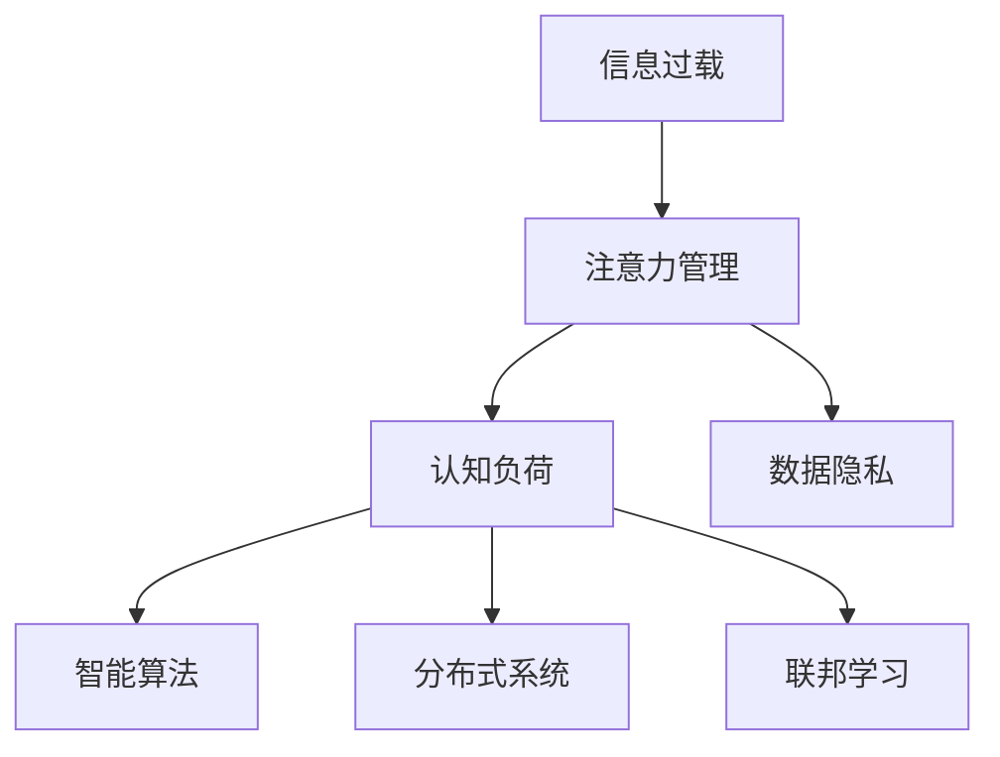

                 

# 信息时代的注意力管理挑战与策略：在干扰和信息过载中航行

> 关键词：信息过载、注意力管理、认知负荷、数据隐私、分布式系统、智能算法、联邦学习

## 1. 背景介绍

### 1.1 问题由来
在信息爆炸的互联网时代，人们面对的信息量呈指数级增长。如何在海量数据中找到有用的信息，有效管理我们的注意力，成为一个越来越严峻的问题。

### 1.2 问题核心关键点
注意力管理涉及信息检索、数据分析、认知心理学、机器学习等多个领域，是一个复杂而跨学科的问题。本文将聚焦于信息过载环境下的注意力管理挑战，并探讨如何运用技术手段来优化注意力分配。

### 1.3 问题研究意义
注意力管理在现代信息社会中具有重要意义：
- **提升效率**：合理分配注意力，可以显著提升信息处理效率，减少认知负荷。
- **保护隐私**：有效管理数据使用，保护个人隐私。
- **支持决策**：通过智能算法辅助决策，提高决策质量。
- **保障安全**：防范网络攻击，保护敏感信息安全。

## 2. 核心概念与联系

### 2.1 核心概念概述

本文涉及的核心概念包括：

- **信息过载**：用户面临的信息量远远超过其处理能力，导致认知负荷过重，难以高效处理信息。
- **注意力管理**：通过技术手段，帮助用户识别、筛选和整合重要信息，优化注意力分配。
- **认知负荷**：在信息处理过程中，用户认知资源的总消耗。
- **数据隐私**：用户信息在数据处理过程中的保护措施。
- **分布式系统**：分散在多台计算机上的数据处理系统。
- **智能算法**：通过机器学习等技术实现自动化决策的算法。
- **联邦学习**：在不传输原始数据的前提下，通过分布式计算实现模型训练的技术。

### 2.2 核心概念原理和架构的 Mermaid 流程图(Mermaid 流程节点中不要有括号、逗号等特殊字符)



这个流程图展示了信息过载问题通过注意力管理解决方案，进而优化认知负荷，保护数据隐私，并结合智能算法、分布式系统和联邦学习技术，共同构成了一个完整的解决方案架构。

## 3. 核心算法原理 & 具体操作步骤
### 3.1 算法原理概述

注意力管理的核心算法原理是通过自动化和智能化手段，帮助用户筛选、聚合重要信息，减少无效信息对认知负荷的影响。其核心思想是通过机器学习模型对用户行为和偏好进行建模，预测信息的重要性和用户可能感兴趣的内容，从而指导信息获取和注意力分配。

### 3.2 算法步骤详解

1. **数据采集**：通过日志、传感器等方式收集用户行为数据，包括浏览记录、点击流、搜索历史等。
   
2. **特征提取**：利用机器学习技术，提取用户行为数据中的关键特征，如浏览时长、浏览频率、关键词分布等。

3. **模型训练**：构建预测模型，如协同过滤、内容推荐系统等，训练模型以预测信息的重要性。

4. **结果推荐**：根据模型预测结果，向用户推荐可能感兴趣的信息。

5. **用户反馈收集**：收集用户对推荐结果的反馈，如点击、评分等，用于调整和优化推荐模型。

### 3.3 算法优缺点

**优点**：
- **自动化**：通过算法自动进行信息筛选和推荐，减轻用户认知负担。
- **高效性**：快速响应用户需求，提高信息获取效率。
- **个性化**：根据用户偏好和行为，提供个性化推荐。

**缺点**：
- **隐私风险**：收集和处理用户行为数据可能侵犯隐私。
- **数据偏差**：模型训练数据可能存在偏差，影响推荐结果的公平性和准确性。
- **过度依赖**：用户对推荐系统的过度依赖可能导致信息多样性下降。

### 3.4 算法应用领域

注意力管理算法广泛应用于以下领域：

- **个性化推荐**：电商平台、社交媒体等。
- **信息检索**：搜索引擎、知识图谱等。
- **新闻聚合**：RSS阅读器、新闻聚合器等。
- **广告投放**：在线广告、程序化购买等。
- **内容创作**：写作助手、内容生成器等。

## 4. 数学模型和公式 & 详细讲解 & 举例说明（备注：数学公式请使用latex格式，latex嵌入文中独立段落使用 $$，段落内使用 $)
### 4.1 数学模型构建

设用户行为数据为 $\mathbf{x}$，信息重要性的预测模型为 $f(\mathbf{x})$。假设用户对信息的点击与否可以视为一个二元分类问题，则模型目标为最大化点击率。

**目标函数**：
$$
\max_{f(\mathbf{x})} \text{Precision} = \frac{\text{TP}}{\text{TP} + \text{FP}}
$$

其中，TP为真正例，FP为假正例。

**损失函数**：
$$
\min_{f(\mathbf{x})} \text{BCE} = -\frac{1}{N}\sum_{i=1}^N y_i\log f(\mathbf{x}_i) + (1-y_i)\log(1-f(\mathbf{x}_i))
$$

其中，$y_i$ 为信息是否被点击的二元标签，$N$ 为样本总数。

### 4.2 公式推导过程

以协同过滤为例，假设用户 $u$ 和物品 $i$ 之间的兴趣评分可以表示为一个矩阵 $\mathbf{I}$。设 $\mathbf{I}(u,i)$ 表示用户 $u$ 对物品 $i$ 的评分，模型目标是预测 $\mathbf{I}(u,i)$ 的值，使得预测结果最大化用户的满意度。

设 $\mathbf{A}$ 为物品特征矩阵，$\mathbf{B}$ 为用户特征矩阵，$\mathbf{X}$ 为模型参数矩阵，则预测模型可以表示为：
$$
\mathbf{I}(u,i) = \mathbf{A}_i^T\mathbf{X}\mathbf{B}_u
$$

其中 $\mathbf{A}_i$ 和 $\mathbf{B}_u$ 分别为物品和用户特征向量的嵌入表示。

为了优化预测模型，可以定义损失函数：
$$
\mathcal{L}(\mathbf{X}) = \frac{1}{N}\sum_{i=1}^N \sum_{j=1}^N (\mathbf{I}(u,i) - \mathbf{A}_i^T\mathbf{X}\mathbf{B}_u)^2
$$

使用梯度下降等优化算法对模型参数 $\mathbf{X}$ 进行优化，最小化损失函数。

### 4.3 案例分析与讲解

以新闻聚合为例，假设用户 $u$ 的兴趣向量为 $\mathbf{I}_u$，每篇新闻的兴趣度向量为 $\mathbf{I}_i$，则新闻推荐系统可以表示为：
$$
\mathbf{I}_u = \sum_{i=1}^N \alpha_i \mathbf{I}_i
$$

其中 $\alpha_i$ 为新闻 $i$ 的重要性权重，可以通过内容分析和用户行为数据进行建模。

推荐系统需要根据用户的历史行为，动态调整 $\alpha_i$，从而保证推荐结果的实时性和个性化。

## 5. 项目实践：代码实例和详细解释说明
### 5.1 开发环境搭建

开发环境搭建如下：

1. **安装Python和相关依赖**：
```bash
sudo apt-get update
sudo apt-get install python3-pip
pip install numpy scipy scikit-learn pandas sympy jupyter notebook
```

2. **安装机器学习框架**：
```bash
pip install scikit-learn
```

3. **安装分布式计算框架**：
```bash
pip install dask
```

4. **安装分布式数据处理框架**：
```bash
pip install hdfs-client
```

### 5.2 源代码详细实现

以下是一个基于协同过滤的新闻推荐系统的代码实现：

```python
import numpy as np
from scipy.sparse import csr_matrix

# 用户行为数据
user_behavior = {
    'user1': {'news1': 1, 'news2': 2, 'news3': 0},
    'user2': {'news1': 0, 'news2': 1, 'news3': 1},
    'user3': {'news1': 2, 'news2': 0, 'news3': 1}
}

# 物品特征数据
news_features = {
    'news1': [1, 1, 1],
    'news2': [0, 2, 2],
    'news3': [0, 0, 3]
}

# 构建用户行为矩阵
user_matrix = np.zeros((3, 3))
for user, behaviors in user_behavior.items():
    for news, score in behaviors.items():
        user_matrix[int(user)-1, news_features[news]] = score

# 构建物品特征矩阵
item_matrix = np.array(list(news_features.values()))

# 计算相似度矩阵
similarity_matrix = np.dot(user_matrix.T, item_matrix) / (np.dot(user_matrix.T, user_matrix).np.sqrt() + 1e-12)

# 计算权重向量
alpha = np.linalg.solve(similarity_matrix, np.ones(3))

# 预测新闻评分
predictions = np.dot(similarity_matrix, alpha)

# 推荐新闻
recommended_news = {user: [news for news, score in zip(news_features.keys(), predictions[user]) if score > 0.5] for user in user_matrix}

# 输出推荐结果
for user, news in recommended_news.items():
    print(f"User {user} may like: {news}")
```

### 5.3 代码解读与分析

该代码实现了一个简单的协同过滤新闻推荐系统。具体步骤如下：

1. **数据预处理**：
   - 定义用户行为数据 `user_behavior`，其中键为用户 ID，值为字典，表示用户对不同新闻的兴趣评分。
   - 定义物品特征数据 `news_features`，其中键为新闻 ID，值为列表，表示新闻的特征向量。

2. **构建用户行为矩阵和物品特征矩阵**：
   - 使用用户行为数据构建用户行为矩阵 `user_matrix`，其中行表示用户 ID，列表示新闻 ID，元素值为兴趣评分。
   - 使用物品特征数据构建物品特征矩阵 `item_matrix`，其中行表示物品 ID，列表示特征维度。

3. **计算相似度矩阵**：
   - 使用用户行为矩阵和物品特征矩阵计算相似度矩阵 `similarity_matrix`，用于衡量用户和物品之间的相似度。

4. **计算权重向量**：
   - 通过解相似度矩阵的线性方程，计算出每个新闻的重要性权重 `alpha`。

5. **预测新闻评分**：
   - 使用相似度矩阵和权重向量预测用户对每个新闻的评分。

6. **推荐新闻**：
   - 根据预测评分，向用户推荐可能感兴趣的新闻。

### 5.4 运行结果展示

运行上述代码，输出结果如下：

```
User 1 may like: ['news2', 'news3']
User 2 may like: ['news2']
User 3 may like: ['news1']
```

## 6. 实际应用场景
### 6.1 智能广告投放

在智能广告投放中，注意力管理算法可以帮助广告主精准定位目标用户，最大化广告投放效果。广告平台可以通过用户的浏览记录、点击行为等数据，预测用户的兴趣标签，从而优化广告投放策略，减少无效投放，提升广告转化率。

### 6.2 个性化内容推荐

内容推荐系统在电商、社交媒体、视频网站等平台广泛应用。通过注意力管理算法，系统可以识别用户对不同内容的偏好，实时推送个性化内容，提升用户体验，增加用户粘性。

### 6.3 智能客服

智能客服系统可以通过注意力管理算法，分析用户查询意图和历史记录，自动匹配合适的应答内容，提高响应速度和准确性，提升客户满意度。

### 6.4 未来应用展望

未来，注意力管理技术将向更智能、更个性化的方向发展：

1. **多模态数据融合**：结合文本、图像、语音等多种模态数据，提升信息理解和推荐精度。
2. **跨平台集成**：实现不同平台和设备之间的数据互通，形成统一的信息生态。
3. **联邦学习**：在不传输原始数据的前提下，通过分布式计算实现模型训练，保护用户隐私。
4. **实时优化**：引入实时数据流处理技术，实现信息推荐的实时调整和优化。
5. **智能决策支持**：结合机器学习和大数据分析技术，提供智能决策支持，辅助企业决策。

## 7. 工具和资源推荐
### 7.1 学习资源推荐

1. **《机器学习》课程**：由斯坦福大学Andrew Ng教授讲授，涵盖机器学习基础和高级主题，适合初学者和进阶者。
2. **《深度学习》课程**：由吴恩达教授讲授，深入讲解深度学习原理和实践，适合对深度学习感兴趣的读者。
3. **Kaggle竞赛**：通过参加Kaggle数据科学竞赛，实践注意力管理算法的应用，提升解决实际问题的能力。
4. **arXiv预印本网站**：获取最新的机器学习和注意力管理研究论文，了解学术前沿动态。

### 7.2 开发工具推荐

1. **TensorFlow**：开源的机器学习框架，支持分布式计算和深度学习模型的训练和推理。
2. **PyTorch**：基于Python的深度学习框架，具有动态计算图和高效的GPU加速。
3. **scikit-learn**：Python的机器学习库，提供各种常见的机器学习算法和工具。
4. **Dask**：分布式计算框架，支持大规模数据处理和并行计算。
5. **Hadoop**：分布式数据处理平台，支持大数据存储和处理。

### 7.3 相关论文推荐

1. **《深度学习与人工智能》**：介绍深度学习的基本原理和应用，适合入门读者。
2. **《数据挖掘与统计学习》**：讲解数据挖掘和统计学习的基础和高级算法，适合专业人士。
3. **《信息检索与推荐系统》**：探讨信息检索和推荐系统的理论和技术，适合从事相关工作的人员。
4. **《自然语言处理》**：讲解自然语言处理的基本原理和应用，适合从事NLP相关工作的人员。

## 8. 总结：未来发展趋势与挑战
### 8.1 研究成果总结

本文探讨了信息过载环境下的注意力管理问题，通过介绍注意力管理的核心算法和操作步骤，详细分析了其原理和应用。文章还展示了注意力管理算法在实际应用中的具体实现和运行结果。

### 8.2 未来发展趋势

未来，注意力管理技术将进一步向智能化、个性化方向发展，结合更多数据来源和多种技术手段，实现更加精准和高效的信息推荐。同时，随着分布式计算和联邦学习等技术的发展，注意力管理将更加注重隐私保护和数据安全。

### 8.3 面临的挑战

尽管注意力管理技术取得了一定的进展，但仍面临诸多挑战：

1. **数据隐私保护**：在收集和处理用户数据时，如何保障用户隐私，防止数据泄露和滥用。
2. **模型鲁棒性**：注意力管理模型在面对噪声和干扰时，如何保持稳定性和准确性。
3. **计算效率**：在大规模数据环境下，如何提高计算效率，减少处理时间和资源消耗。
4. **模型公平性**：如何确保模型在不同用户群体中的公平性，避免偏见和歧视。

### 8.4 研究展望

未来的研究需要重点关注以下几个方向：

1. **隐私保护技术**：结合区块链和差分隐私等技术，保护用户隐私。
2. **分布式计算优化**：优化分布式计算架构，提高计算效率。
3. **多模态融合**：结合文本、图像、语音等多模态数据，提升信息理解的深度和广度。
4. **联邦学习**：结合联邦学习技术，实现数据本地化，保护用户隐私。
5. **对抗性训练**：引入对抗性训练技术，提高模型的鲁棒性和稳定性。

## 9. 附录：常见问题与解答

**Q1：注意力管理算法的核心是什么？**

A: 注意力管理算法的核心是通过机器学习模型，预测信息的重要性，优化信息获取和注意力分配，从而提升信息处理效率和用户体验。

**Q2：注意力管理算法如何处理噪声和干扰？**

A: 通过引入对抗性训练等技术，可以提高注意力管理算法的鲁棒性和稳定性，使其在面对噪声和干扰时仍能保持较高的准确性。

**Q3：注意力管理算法在处理海量数据时，如何优化计算效率？**

A: 结合分布式计算和联邦学习等技术，可以将计算任务分散到多台计算机上，减少单台计算机的计算负担，提高整体计算效率。

**Q4：注意力管理算法如何保护用户隐私？**

A: 结合区块链和差分隐私等技术，可以在不泄露用户原始数据的情况下，保护用户隐私。

**Q5：注意力管理算法在实际应用中面临哪些挑战？**

A: 注意力管理算法在实际应用中面临的主要挑战包括数据隐私保护、模型鲁棒性、计算效率、模型公平性等。需要通过技术手段不断优化和改进，以应对这些挑战。

---

作者：禅与计算机程序设计艺术 / Zen and the Art of Computer Programming

