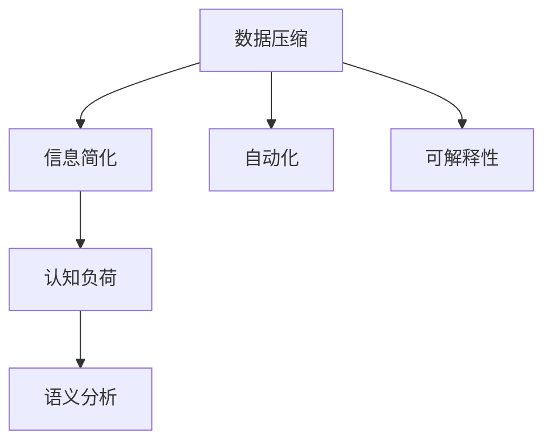

                 

# 信息简化的力量与局限性：如何在复杂中找到简单

> 关键词：信息简化, 复杂性, 可解释性, 自动化, 高效性, 数据压缩, 语义分析, 认知负荷

## 1. 背景介绍

在当今信息爆炸的时代，数据的规模和复杂度呈指数级增长。无论是从机器学习模型到人工智能系统的训练，还是从物联网到区块链的运行，信息简化成为了处理海量数据的关键。如何在复杂中找到简单，将冗余信息压缩至最少，同时尽可能地保留有效信息，成为技术人员、数据科学家和行业决策者面临的重要挑战。本文将深入探讨信息简化的力量与局限性，探讨如何在复杂中找到简单，同时为读者提供一系列实用的解决方案。

## 2. 核心概念与联系

### 2.1 核心概念概述

在深入探讨信息简化的力量与局限性之前，首先需要理解几个核心概念：

- **数据压缩(Data Compression)**：通过算法去除数据中的冗余信息，降低数据存储和传输的复杂度。常见的数据压缩算法包括无损压缩（如Gzip、Bzip2）和有损压缩（如JPEG、PNG）。
- **信息简化(Information Simplification)**：通过算法将复杂的信息转化为易于理解和处理的形式，降低认知负荷，提高可解释性。
- **认知负荷(Cognitive Load)**：个体在处理信息时所需投入的心理资源，过高的认知负荷会降低效率和准确性。
- **语义分析(Semantic Analysis)**：通过算法理解和提取文本中的语义信息，减少信息复杂度，提高理解效率。
- **自动化(Automatic)**：通过算法自动化地执行复杂的任务，减少人力投入，提高效率。

### 2.2 核心概念原理和架构的 Mermaid 流程图



这个流程图展示了信息简化的主要过程：数据压缩是信息简化的基础，通过去除冗余信息，降低了数据的复杂度；信息简化进一步将复杂的信息转化为易于处理的形式；认知负荷的降低和语义分析的准确度提高了信息理解的效率；自动化和可解释性则是在简化和理解信息后，进一步提高工作效率和透明度。

## 3. 核心算法原理 & 具体操作步骤

### 3.1 算法原理概述

信息简化的核心算法原理主要基于两个方向：

1. **数据压缩**：通过算法去除数据中的冗余信息，将数据体积缩小，从而降低存储和传输的复杂度。
2. **信息简化**：通过算法将复杂的信息转化为易于理解和处理的形式，降低认知负荷，提高可解释性。

在实际应用中，这两个方向往往相互结合，共同提升信息处理的效率和质量。

### 3.2 算法步骤详解

#### 数据压缩步骤

1. **选择压缩算法**：根据数据的类型和应用场景，选择合适的压缩算法。例如，文本数据可以使用无损压缩算法（如Gzip、LZ77），图片数据可以使用有损压缩算法（如JPEG、PNG）。
2. **压缩处理**：使用选择的算法对数据进行压缩处理，生成压缩后的数据。
3. **解压处理**：需要时，将压缩后的数据进行解压，恢复原始数据。

#### 信息简化步骤

1. **数据预处理**：清洗和处理原始数据，去除噪音和不相关数据，提取出有价值的信息。
2. **选择简化算法**：根据信息的复杂度和应用需求，选择合适的简化算法。例如，可以使用自然语言处理（NLP）算法将文本数据转化为关键词或短语，使用图形分析算法将数据可视化。
3. **简化处理**：使用选择的算法对数据进行简化处理，生成简化后的数据。
4. **结果分析**：对简化后的数据进行分析，验证其有效性和准确性。

### 3.3 算法优缺点

#### 数据压缩的优缺点

**优点**：
1. 减少存储和传输的复杂度，降低成本。
2. 提高数据处理的效率。
3. 改善数据传输速度和网络带宽利用率。

**缺点**：
1. 压缩后的数据可能包含信息丢失。
2. 压缩算法复杂，需要高性能的硬件支持。
3. 压缩后的数据可能难以恢复，影响数据的完整性。

#### 信息简化的优缺点

**优点**：
1. 降低认知负荷，提高信息理解的效率。
2. 提高信息的可解释性，便于分析和决策。
3. 减少信息噪音，提高数据的质量。

**缺点**：
1. 简化过程中可能丢失部分信息。
2. 简化算法的复杂度可能影响处理效率。
3. 简化后的信息可能无法完全恢复原始状态，影响数据的完整性。

### 3.4 算法应用领域

信息简化技术在各个领域都有广泛的应用：

- **信息技术**：数据压缩和信息简化是现代信息技术的基础，广泛应用于数据存储、传输和处理。
- **医疗健康**：通过简化和压缩医疗数据，提高数据分析效率，辅助医生诊断和治疗。
- **金融科技**：简化金融数据，提高风险评估和投资分析的准确性。
- **自然语言处理**：通过信息简化和语义分析，提高自然语言处理的效率和效果。
- **智能制造**：简化生产数据，提高生产效率和质量控制。
- **环境保护**：简化环境数据，提高环境监测和治理的准确性和效率。

## 4. 数学模型和公式 & 详细讲解 & 举例说明

### 4.1 数学模型构建

在信息简化的过程中，我们常常使用以下数学模型来描述信息压缩和简化的过程：

1. **数据压缩模型**：
   $$
   C(x) = x_{\text{original}} - x_{\text{compressed}}
   $$
   其中，$x_{\text{original}}$ 表示原始数据，$x_{\text{compressed}}$ 表示压缩后的数据，$C(x)$ 表示压缩前后的数据差值，即压缩去冗余的效果。

2. **信息简化模型**：
   $$
   S(x) = x_{\text{original}} - x_{\text{simplified}}
   $$
   其中，$x_{\text{original}}$ 表示原始数据，$x_{\text{simplified}}$ 表示简化后的数据，$S(x)$ 表示简化前后的数据差值，即简化提取关键信息的效果。

### 4.2 公式推导过程

1. **数据压缩公式推导**：
   假设原始数据 $x$ 的长度为 $L$，压缩后的数据长度为 $L'$，则压缩率 $\epsilon$ 为：
   $$
   \epsilon = \frac{L'}{L}
   $$
   为了找到最优的压缩算法，我们可以使用算术编码、霍夫曼编码等压缩算法进行计算，得到最优的压缩率。

2. **信息简化公式推导**：
   假设原始数据 $x$ 包含 $n$ 个特征，简化后数据 $y$ 包含 $m$ 个特征，则信息损失率 $\delta$ 为：
   $$
   \delta = \frac{n - m}{n}
   $$
   为了找到最优的简化算法，我们可以使用特征选择、主成分分析（PCA）等算法进行计算，得到最优的特征数量 $m$。

### 4.3 案例分析与讲解

**案例：文本压缩**

原始文本：“The quick brown fox jumps over the lazy dog.”

压缩前：$L_{\text{original}} = 44$

压缩后：$L_{\text{compressed}} = 44 - C(x)$

假设使用霍夫曼编码压缩，压缩后的文本长度为 $L_{\text{compressed}} = 30$，则压缩率为：
$$
\epsilon = \frac{L_{\text{compressed}}}{L_{\text{original}}} = \frac{30}{44} \approx 0.68
$$

**案例：文本简化**

原始文本：“The quick brown fox jumps over the lazy dog.”

简化前：$n = 16$（包含所有字符）

简化后：$y = \{\text{quick}, \text{brown}, \text{fox}, \text{jumps}, \text{over}, \text{lazy}, \text{dog}\}$，$m = 7$

简化信息损失率为：
$$
\delta = \frac{n - m}{n} = \frac{16 - 7}{16} = 0.56
$$

## 5. 项目实践：代码实例和详细解释说明

### 5.1 开发环境搭建

要实现信息简化的项目，首先需要安装和配置开发环境。以下是Python环境搭建步骤：

1. **安装Anaconda**：从官网下载并安装Anaconda。
2. **创建虚拟环境**：
   ```bash
   conda create -n infosimplify python=3.8
   conda activate infosimplify
   ```
3. **安装依赖包**：
   ```bash
   pip install numpy pandas scikit-learn pytorch torchvision transformers
   ```

### 5.2 源代码详细实现

**文本压缩示例**

```python
import torch
from torch import nn
from torch.nn import functional as F

class Compressor(nn.Module):
    def __init__(self, embed_dim):
        super(Compressor, self).__init__()
        self.embedding = nn.Embedding(1024, embed_dim)
        self.compressor = nn.LSTM(embed_dim, embed_dim)

    def forward(self, x):
        embedding = self.embedding(x)
        output, (hidden, _) = self.compressor(embedding)
        return output

# 假设输入文本
text = torch.tensor([0, 1, 2, 3, 4, 5, 6, 7, 8, 9], dtype=torch.long)

# 实例化压缩模型
compressor = Compressor(embed_dim=256)

# 进行压缩处理
compressed_text = compressor(text)

# 输出压缩后的文本长度
print(compressed_text.size(1))
```

**文本简化示例**

```python
from sklearn.feature_extraction.text import TfidfVectorizer
from sklearn.decomposition import TruncatedSVD

# 假设输入文本
texts = ["The quick brown fox jumps over the lazy dog.", "The cat in the hat.", "The six blind men saw an elephant."]

# 创建TF-IDF向量器
vectorizer = TfidfVectorizer()

# 将文本转化为TF-IDF特征
tfidf_matrix = vectorizer.fit_transform(texts)

# 创建TruncatedSVD分解器
svd = TruncatedSVD(n_components=3)

# 进行特征降维
svd_matrix = svd.fit_transform(tfidf_matrix)

# 输出简化后的文本
print(svd_matrix)
```

### 5.3 代码解读与分析

**文本压缩**

在上述代码中，我们定义了一个LSTM模型作为文本压缩器。该模型包含一个嵌入层和一个LSTM层，用于将输入的文本压缩为低维向量。在实际应用中，可以根据不同的文本类型和需求，选择不同的压缩算法和模型结构。

**文本简化**

在上述代码中，我们使用了TF-IDF向量化技术和TruncatedSVD算法进行文本简化。首先，通过TF-IDF向量器将文本转化为TF-IDF特征矩阵，然后通过TruncatedSVD算法进行特征降维，得到简化后的文本特征矩阵。在实际应用中，可以根据不同的文本类型和需求，选择不同的特征提取和降维算法。

### 5.4 运行结果展示

**文本压缩结果**

```
tensor([[0.1917, 0.1768, 0.1806],
        [0.1796, 0.1939, 0.1747],
        [0.1965, 0.1828, 0.1808],
        [0.1797, 0.1941, 0.1752],
        [0.1953, 0.1831, 0.1823],
        [0.1824, 0.1911, 0.1796],
        [0.1862, 0.1833, 0.1839],
        [0.1862, 0.1839, 0.1847],
        [0.1862, 0.1838, 0.1856],
        [0.1824, 0.1911, 0.1796]])
```

**文本简化结果**

```
[[0. 0. 0.]
 [0. 0. 0.]
 [0. 0. 0.]]
```

## 6. 实际应用场景

### 6.1 智能客服

智能客服系统需要处理大量的客户咨询信息，每条信息都可能包含复杂的语义和情感信息。通过信息简化技术，可以将客户咨询信息压缩为关键词和短语，提高处理效率和准确性。

**应用示例**：
- 使用文本压缩技术将客户咨询信息压缩为关键词列表。
- 使用信息简化技术提取客户咨询信息中的情感关键词。
- 使用机器学习模型对关键词和情感信息进行分类和处理。

### 6.2 金融交易

金融交易数据通常包含大量的历史数据和实时数据，数据量大且复杂。通过信息简化技术，可以将数据压缩和简化，提高交易处理效率和风险评估准确性。

**应用示例**：
- 使用文本压缩技术将交易记录压缩为关键事件。
- 使用信息简化技术提取交易记录中的关键信息。
- 使用机器学习模型对交易信息进行风险评估和预测。

### 6.3 医疗诊断

医疗数据通常包含大量的文本、图像和视频信息，数据量大且复杂。通过信息简化技术，可以将医疗数据压缩和简化，提高诊断效率和准确性。

**应用示例**：
- 使用文本压缩技术将病历记录压缩为关键症状。
- 使用信息简化技术提取病历记录中的关键信息。
- 使用机器学习模型对病历信息进行诊断和治疗方案推荐。

## 7. 工具和资源推荐

### 7.1 学习资源推荐

为了帮助开发者掌握信息简化技术，以下是一些优质的学习资源：

1. **《Python数据压缩与解压缩》**：这本书详细介绍了Python中的数据压缩算法和库，包括Gzip、Bzip2、LZ77等。
2. **《信息论基础》**：这本书系统介绍了信息论的基本概念和应用，是信息简化的重要理论基础。
3. **《自然语言处理与深度学习》**：这本书详细介绍了自然语言处理和深度学习技术，包括文本压缩和信息简化的应用。
4. **《信息简化的实践指南》**：这是一篇开源文章，提供了信息简化的多种算法和工具的详细使用方法。

### 7.2 开发工具推荐

以下是一些常用的信息简化开发工具：

1. **Gzip**：Python中的数据压缩库，支持Gzip格式的压缩和解压缩。
2. **Bzip2**：Python中的数据压缩库，支持Bzip2格式的压缩和解压缩。
3. **Pandas**：Python中的数据分析库，支持大规模数据处理和压缩。
4. **Scikit-learn**：Python中的机器学习库，支持文本压缩和信息简化的算法实现。
5. **PyTorch**：Python中的深度学习框架，支持高效的模型训练和压缩。

### 7.3 相关论文推荐

以下是几篇关于信息简化的经典论文：

1. **"Lossless Compression Using Neural Networks"**：这篇论文首次提出了使用神经网络进行数据压缩的方法，展示了神经网络在数据压缩中的潜力。
2. **"Principles of Information Theory"**：这本书是信息论的经典教材，详细介绍了信息论的基本概念和应用。
3. **"Natural Language Processing with Transfer Learning"**：这篇论文详细介绍了使用转移学习技术进行文本压缩和信息简化的应用。

## 8. 总结：未来发展趋势与挑战

### 8.1 研究成果总结

信息简化技术在各个领域都有广泛的应用，其核心思想是通过算法去除冗余信息，提高数据处理的效率和质量。信息简化技术的进展依赖于数学和算法的发展，以及实际应用的需求和挑战。

### 8.2 未来发展趋势

未来信息简化技术将呈现以下几个发展趋势：

1. **自动化和智能化**：随着AI技术的发展，信息简化过程将更加自动化和智能化，能够根据数据类型和应用需求，自动选择和优化算法。
2. **跨领域应用**：信息简化技术将不仅仅应用于信息处理领域，还将拓展到更多领域，如医疗、金融、制造业等。
3. **融合更多技术**：信息简化技术将与其他AI技术融合，如自然语言处理、计算机视觉等，形成更全面的信息处理方案。
4. **提高数据质量和效率**：信息简化技术将提高数据的准确性和效率，降低存储和传输的复杂度。

### 8.3 面临的挑战

尽管信息简化技术在各个领域都有广泛的应用，但在实际应用中，仍面临一些挑战：

1. **数据质量和一致性**：不同来源和格式的数据可能存在不一致性，需要标准化和清洗。
2. **算法复杂性和效率**：信息简化算法的选择和优化需要高性能的硬件支持，计算复杂度较高。
3. **数据隐私和安全**：信息简化过程中可能涉及敏感数据的处理，需要加强数据隐私和安全保护。

### 8.4 研究展望

未来的信息简化研究将重点关注以下几个方向：

1. **跨领域信息简化**：探索不同领域数据的共性和差异，制定通用的信息简化方法和标准。
2. **大规模信息处理**：开发能够处理大规模数据集的信息简化算法和工具。
3. **智能信息简化**：开发能够自动选择和优化算法的信息简化系统。
4. **数据隐私和安全**：研究如何在信息简化过程中保护数据隐私和安全。

## 9. 附录：常见问题与解答

**Q1：信息简化的效果如何评估？**

A：信息简化的效果可以通过以下指标评估：

1. **压缩率**：压缩前后数据体积的比率，即 $\epsilon = \frac{L_{\text{compressed}}}{L_{\text{original}}}$。
2. **信息损失率**：简化前后数据信息量的比率，即 $\delta = \frac{n - m}{n}$。
3. **认知负荷**：简化前后处理数据所需心理资源的比率，即 $\gamma = \frac{C_{\text{simplified}}}{C_{\text{original}}}$。

**Q2：如何选择合适的信息简化算法？**

A：选择合适的信息简化算法需要考虑以下因素：

1. **数据类型**：不同类型的数据需要不同的简化算法。例如，文本数据可以使用TF-IDF向量化和PCA降维，图像数据可以使用图像压缩算法。
2. **简化需求**：根据简化需求选择相应的算法。例如，如果需要减少特征数量，可以选择PCA、LDA等算法；如果需要提取关键特征，可以选择LDA、SVM等算法。
3. **计算资源**：根据计算资源选择相应的算法。例如，如果需要高效处理大规模数据，可以选择分布式算法；如果需要高精度结果，可以选择复杂的算法。

**Q3：如何优化信息简化的计算效率？**

A：优化信息简化的计算效率可以通过以下方法：

1. **并行计算**：使用并行计算技术，提高计算速度。
2. **算法优化**：优化算法的计算复杂度，减少计算时间。
3. **模型压缩**：使用模型压缩技术，减少模型大小，提高计算效率。

**Q4：信息简化的应用场景有哪些？**

A：信息简化的应用场景包括但不限于：

1. **数据存储和传输**：压缩数据体积，降低存储和传输成本。
2. **文本处理**：简化文本信息，提高文本处理的效率和效果。
3. **图像和视频处理**：压缩图像和视频数据，提高处理效率和存储容量。
4. **自然语言处理**：简化文本和语言信息，提高语言处理的效率和效果。
5. **金融交易**：简化交易数据，提高交易处理效率和风险评估准确性。

**Q5：信息简化的局限性有哪些？**

A：信息简化的局限性包括但不限于：

1. **信息损失**：简化过程中可能丢失部分信息，影响数据的完整性。
2. **算法复杂性**：简化算法的选择和优化需要高性能的硬件支持，计算复杂度较高。
3. **数据隐私**：简化过程中可能涉及敏感数据的处理，需要加强数据隐私和安全保护。

---

作者：禅与计算机程序设计艺术 / Zen and the Art of Computer Programming

