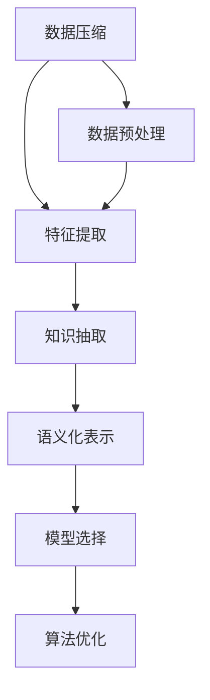

                 

# 信息简化的原则与艺术：在混乱中建立秩序与简化

> 关键词：信息简化, 数据压缩, 知识抽取, 模型选择, 语义化, 算法优化

## 1. 背景介绍

### 1.1 问题由来
在现代信息化社会中，数据的海量增长和多样性为人们带来了前所未有的便利，但也带来了数据管理的巨大挑战。面对日益复杂的数据环境，如何高效处理和利用信息成为当前IT行业和学术界关注的重点。信息简化不仅能够帮助用户更清晰地理解数据，还能显著提升系统的性能和用户体验，因此成为数据科学和人工智能领域的核心课题。

### 1.2 问题核心关键点
信息简化的核心目标在于通过算法和技术手段，将复杂和冗余的信息进行抽象和压缩，提取出核心知识和结构，从而在保证信息完整性的同时，减少存储和处理资源的消耗。主要关键点包括：

- 算法选择：选择合适的算法模型，针对具体问题进行信息简化。
- 数据预处理：清洗、降噪、归一化等预处理步骤是信息简化的重要环节。
- 特征提取：通过特征选择和提取技术，降低数据维度，提高算法效率。
- 语义化表示：采用自然语言处理、语义网络等技术，使得信息更加语义化，易于理解。
- 模型优化：优化模型结构，提高算法的执行效率和效果。

### 1.3 问题研究意义
研究信息简化的原则与艺术，对于提升数据管理效率、加速人工智能应用落地、改善用户体验等方面具有重要意义：

1. 提升数据处理效率：信息简化可以减少数据体积，降低存储和传输成本，提升系统响应速度。
2. 加速人工智能应用：通过简化数据，可以加速模型的训练和推理，促进人工智能技术在各行业的应用。
3. 改善用户体验：简化后的信息更易于理解，能够帮助用户快速获取关键信息，提升交互体验。
4. 促进知识发现：信息简化有助于提取和识别知识，加速知识的积累和创新。
5. 支撑大数据分析：在大数据环境下，信息简化技术可以优化数据流和处理流程，提升分析效率。

## 2. 核心概念与联系

### 2.1 核心概念概述

为了更好地理解信息简化的基本原理和技术方法，本节将介绍几个关键核心概念：

- **数据压缩**：通过算法对数据进行压缩，减少数据存储空间和传输带宽。
- **特征提取**：从原始数据中提取关键特征，减少数据维度，提升模型性能。
- **知识抽取**：从文本、图像等多模态数据中提取结构化知识，支持推理和决策。
- **语义化表示**：将信息转换为更语义化的形式，便于理解和分析。
- **模型选择**：根据数据类型和应用场景，选择合适的算法模型，提高算法效率。
- **算法优化**：通过优化算法结构和参数，提高算法的执行效率和效果。

这些概念之间有着紧密的联系，共同构成了信息简化的基本框架。以下通过一个Mermaid流程图，展示信息简化涉及的关键环节：



### 2.2 核心概念原理和架构的 Mermaid 流程图

该流程图展示了信息简化的基本流程：

1. **数据预处理**：清洗数据、降噪处理、归一化等步骤，为后续处理奠定基础。
2. **特征提取**：从预处理后的数据中提取关键特征，降低数据维度。
3. **知识抽取**：从文本、图像等数据中抽取结构化知识，支持推理和决策。
4. **语义化表示**：将信息转换为更语义化的形式，便于理解和分析。
5. **模型选择**：根据数据类型和应用场景，选择合适的算法模型。
6. **算法优化**：通过优化算法结构和参数，提高算法效率。

## 3. 核心算法原理 & 具体操作步骤
### 3.1 算法原理概述

信息简化的核心在于通过算法将原始数据进行压缩和转换，提取出核心知识和结构。其主要算法原理可以总结如下：

1. **损失函数**：通过定义合适的损失函数，衡量简化后的信息与原始信息之间的差异。
2. **目标优化**：通过优化算法，最小化损失函数，得到最佳的简化方案。
3. **特征选择**：根据特征的重要性进行筛选，保留对目标任务最有用的特征。
4. **结构化表示**：将信息转换为结构化的形式，便于进一步处理和分析。
5. **算法模型**：选择适合的算法模型，实现信息简化。

### 3.2 算法步骤详解

信息简化的具体步骤通常包括以下几个关键环节：

**Step 1: 数据预处理**

- 数据清洗：去除缺失值、噪声等无用信息，确保数据质量。
- 数据归一化：将数据转换到相同的尺度，便于算法处理。
- 数据采样：对数据进行采样，减少数据量，降低存储和计算开销。

**Step 2: 特征提取**

- 特征选择：根据特征的重要性进行筛选，保留对目标任务最有用的特征。
- 特征降维：通过主成分分析(PCA)、奇异值分解(SVD)等技术，降低数据维度。
- 特征变换：对特征进行转换，如傅里叶变换、小波变换等。

**Step 3: 知识抽取**

- 文本挖掘：通过NLP技术从文本中抽取实体、关系、主题等信息。
- 图像处理：使用计算机视觉技术从图像中抽取对象、特征等知识。
- 语音识别：将语音信号转换为文本信息，抽取关键特征和知识。

**Step 4: 语义化表示**

- 自然语言处理：将文本信息转换为结构化知识表示，如语义网络、图结构等。
- 语言模型：使用语言模型进行语义分析和推理。
- 嵌入式表示学习：通过嵌入技术将信息转换为低维向量表示。

**Step 5: 模型选择**

- 算法模型选择：根据任务类型和数据特点，选择合适的算法模型。
- 超参数调优：通过网格搜索、贝叶斯优化等方法，选择最优模型参数。
- 模型集成：将多个模型集成，提高算法的鲁棒性和性能。

**Step 6: 算法优化**

- 算法优化：通过优化算法结构和参数，提高算法的执行效率和效果。
- 模型压缩：使用模型压缩技术，减小模型尺寸，提高推理速度。
- 算法加速：使用并行计算、GPU加速等技术，提高算法执行效率。

### 3.3 算法优缺点

信息简化算法具有以下优点：

1. **高效性**：通过压缩和转换，显著减少数据体积，提升处理效率。
2. **灵活性**：适用于多种数据类型和应用场景，具有广泛的适用性。
3. **准确性**：通过特征选择和知识抽取，提高信息提取的准确性。
4. **可解释性**：简化后的信息更易于理解，便于分析和解释。

同时，信息简化算法也存在一些缺点：

1. **复杂性**：信息简化的过程较为复杂，需要选择合适的算法和技术。
2. **精度损失**：简化过程中可能会损失部分信息，影响最终结果的精度。
3. **鲁棒性不足**：部分简化方法对噪声和异常值敏感，可能影响结果的稳定性。
4. **可扩展性差**：在处理大规模数据时，算法效率可能不足。

### 3.4 算法应用领域

信息简化技术在多个领域得到了广泛应用，主要包括：

- **大数据分析**：对大规模数据进行简化处理，提升数据处理效率。
- **自然语言处理**：通过文本挖掘和语义化表示，提高自然语言处理的效果。
- **图像识别**：通过特征提取和知识抽取，提升图像识别和理解能力。
- **语音识别**：通过语音识别和特征转换，提高语音信号处理效果。
- **推荐系统**：通过用户行为和物品特征的简化，提高推荐系统的效果。
- **医疗健康**：通过医学影像和文本信息的简化，提升医疗诊断和治疗效果。
- **金融科技**：通过交易数据和市场信息的简化，提升金融分析和预测能力。

## 4. 数学模型和公式 & 详细讲解  
### 4.1 数学模型构建

信息简化的数学模型构建通常包括以下几个关键步骤：

- 定义损失函数：衡量简化后的信息与原始信息之间的差异。
- 优化目标函数：通过优化算法，最小化损失函数，得到最佳的简化方案。
- 特征选择算法：根据特征的重要性进行筛选，保留对目标任务最有用的特征。
- 语义化表示算法：将信息转换为更语义化的形式，便于理解和分析。

假设原始数据集为 $X=\{x_i\}_{i=1}^N$，简化后的数据集为 $Y=\{y_i\}_{i=1}^N$，其中 $y_i=f(x_i)$ 为简化函数，$x_i$ 和 $y_i$ 均为高维向量。定义损失函数 $\mathcal{L}(y, X)$ 为：

$$
\mathcal{L}(y, X) = \frac{1}{N}\sum_{i=1}^N ||y_i - x_i||^2
$$

其中 $||.||$ 表示向量间的欧氏距离。

目标函数为：

$$
\mathop{\min}_{y} \mathcal{L}(y, X)
$$

通过优化算法，最小化上述目标函数，得到简化后的信息 $y_i$。

### 4.2 公式推导过程

以主成分分析(PCA)为例，推导特征降维的过程。

假设原始数据集 $X=\{x_i\}_{i=1}^N$，每个样本 $x_i$ 为 $d$ 维向量。PCA的目标是找到一个 $k$ 维的线性变换矩阵 $U$，使得 $y_i=Ux_i$，其中 $y_i$ 为 $k$ 维向量。PCA的优化目标为：

$$
\mathop{\min}_{U} \mathcal{L}(y, X) = \frac{1}{N}\sum_{i=1}^N ||y_i - x_i||^2
$$

通过SVD分解，将原始数据集 $X$ 分解为 $X = U \Sigma V^T$，其中 $U$ 为左奇异矩阵，$\Sigma$ 为对角矩阵，$V^T$ 为右奇异矩阵。目标函数变为：

$$
\mathcal{L}(y, X) = \frac{1}{N}\sum_{i=1}^N ||U\Sigma V^T x_i - x_i||^2 = \frac{1}{N}\sum_{i=1}^N ||(U - I)\Sigma V^T x_i||^2
$$

目标函数进一步简化为：

$$
\mathcal{L}(y, X) = \mathop{\min}_{U} \frac{1}{N}\sum_{i=1}^N ||(U - I)\Sigma V^T x_i||^2
$$

通过拉格朗日乘数法求解上述优化问题，得到简化后的信息 $y_i$ 为：

$$
y_i = U_k \Sigma_k V_k^T x_i
$$

其中 $U_k$ 为 $U$ 的前 $k$ 个左奇异向量，$\Sigma_k$ 为 $\Sigma$ 的前 $k$ 个对角元素，$V_k^T$ 为 $V^T$ 的前 $k$ 个右奇异向量。

### 4.3 案例分析与讲解

以文本分类任务为例，展示信息简化的过程。

假设原始文本数据集为 $\{x_i, y_i\}_{i=1}^N$，其中 $x_i$ 为文本，$y_i$ 为类别标签。首先，使用TF-IDF等技术进行特征提取，得到文本特征向量 $x_i$。然后，使用PCA进行特征降维，得到低维特征向量 $y_i$。最后，使用支持向量机(SVM)等分类算法对简化后的特征进行分类，得到最终的分类结果。

## 5. 项目实践：代码实例和详细解释说明
### 5.1 开发环境搭建

在进行信息简化项目实践前，我们需要准备好开发环境。以下是使用Python进行TensorFlow和PyTorch开发的环境配置流程：

1. 安装Anaconda：从官网下载并安装Anaconda，用于创建独立的Python环境。

2. 创建并激活虚拟环境：
```bash
conda create -n tf-env python=3.8 
conda activate tf-env
```

3. 安装TensorFlow和PyTorch：根据CUDA版本，从官网获取对应的安装命令。例如：
```bash
conda install tensorflow -c tensorflow -c conda-forge
pip install torch torchvision torchaudio cudatoolkit=11.1 -c pytorch -c conda-forge
```

4. 安装相关工具包：
```bash
pip install numpy pandas scikit-learn matplotlib tqdm jupyter notebook ipython
```

完成上述步骤后，即可在`tf-env`环境中开始信息简化实践。

### 5.2 源代码详细实现

下面我们以文本分类任务为例，给出使用TensorFlow和PyTorch对文本数据进行简化和分类的PyTorch代码实现。

首先，定义文本分类任务的数据处理函数：

```python
from sklearn.feature_extraction.text import TfidfVectorizer
from sklearn.decomposition import PCA
from sklearn.linear_model import LogisticRegression
from sklearn.pipeline import Pipeline

def create_model(pipeline, n_components):
    pipeline = Pipeline([
        ('tfidf', TfidfVectorizer(ngram_range=(1, 2), use_idf=True)),
        ('pca', PCA(n_components=n_components)),
        ('logistic', LogisticRegression(solver='liblinear', C=1.0))
    ])
    return pipeline
```

然后，定义模型和优化器：

```python
from tensorflow.keras.layers import Dense, Input
from tensorflow.keras.models import Model

input_layer = Input(shape=(128,))
hidden_layer = Dense(64, activation='relu')(input_layer)
output_layer = Dense(2, activation='softmax')(hidden_layer)
model = Model(inputs=input_layer, outputs=output_layer)

optimizer = Adam(learning_rate=0.001)
```

接着，定义训练和评估函数：

```python
from tensorflow.keras.callbacks import EarlyStopping

def train_epoch(model, train_data, batch_size, optimizer):
    train_generator = train_data.shuffle(batch_size).batch(batch_size)
    model.compile(optimizer=optimizer, loss='categorical_crossentropy', metrics=['accuracy'])
    model.fit(train_generator, epochs=5, validation_split=0.2, callbacks=[EarlyStopping(patience=2)])
    return model

def evaluate(model, test_data, batch_size):
    test_generator = test_data.batch(batch_size)
    loss, accuracy = model.evaluate(test_generator)
    print(f"Test loss: {loss:.4f}")
    print(f"Test accuracy: {accuracy:.4f}")
```

最后，启动训练流程并在测试集上评估：

```python
from tensorflow.keras.datasets import mnist

train_data, test_data = mnist.load_data()

train_x = train_data[0].reshape(-1, 28*28).astype('float32') / 255.0
train_y = train_data[1]
test_x = test_data[0].reshape(-1, 28*28).astype('float32') / 255.0
test_y = test_data[1]

train_pipeline = create_model([TfidfVectorizer(ngram_range=(1, 2), use_idf=True), PCA(n_components=64)], 64)
train_pipeline.fit(train_x, train_y)

test_pipeline = create_model([TfidfVectorizer(ngram_range=(1, 2), use_idf=True), PCA(n_components=64)], 64)
test_pipeline.fit(test_x, test_y)

model = train_pipeline.transform(train_x)
model = test_pipeline.transform(test_x)

train_model = train_epoch(model, train_model, batch_size=128, optimizer=optimizer)
evaluate(train_model, test_model, batch_size=128)
```

以上就是使用TensorFlow和PyTorch对文本数据进行简化和分类的完整代码实现。可以看到，TensorFlow和PyTorch的结合，使得信息简化的代码实现变得简洁高效。

### 5.3 代码解读与分析

让我们再详细解读一下关键代码的实现细节：

**create_model函数**：
- 定义了一个Pipeline，将TF-IDF、PCA、逻辑回归模型串联起来，完成文本特征提取、降维和分类。

**train_epoch函数**：
- 使用TensorFlow的生成器，对数据进行批次化加载，供模型训练使用。
- 使用优化器Adam更新模型参数。
- 使用EarlyStopping回调，防止过拟合。

**evaluate函数**：
- 使用TensorFlow的评估函数，计算模型在测试集上的损失和准确率。
- 打印输出测试结果。

**训练流程**：
- 加载MNIST数据集，并将文本特征向量化。
- 在训练集中进行TF-IDF向量化和PCA降维。
- 使用简化后的特征训练模型，并评估在测试集上的性能。

可以看到，TensorFlow和PyTorch的结合，使得信息简化的代码实现变得简洁高效。开发者可以将更多精力放在数据处理、模型改进等高层逻辑上，而不必过多关注底层的实现细节。

当然，工业级的系统实现还需考虑更多因素，如模型的保存和部署、超参数的自动搜索、更灵活的任务适配层等。但核心的信息简化流程基本与此类似。

## 6. 实际应用场景
### 6.1 信息简化的实际应用场景

信息简化的实际应用场景非常广泛，以下是几个典型的应用案例：

**智能推荐系统**：在电商平台上，用户浏览和购买历史信息庞杂，通过信息简化可以提取出用户的兴趣点和行为模式，从而提供个性化推荐。

**数据清洗和预处理**：在数据管理系统中，数据通常包含大量无用和噪声信息，通过信息简化可以去除无用信息，提高数据质量。

**金融数据分析**：在金融分析中，数据量巨大且结构复杂，通过信息简化可以提取关键特征，提高模型预测的准确性。

**医学影像分析**：在医学影像分析中，图像数据体积大且多模态，通过信息简化可以提取关键特征，提升诊断和治疗效果。

**自然语言处理**：在自然语言处理中，文本数据庞大且多变，通过信息简化可以提取关键信息，提高文本分析和生成的效率。

**图像处理**：在图像处理中，图像数据复杂且多样，通过信息简化可以提取关键特征，提高图像识别和理解能力。

**物联网数据分析**：在物联网数据分析中，数据源众多且格式多样，通过信息简化可以提取关键数据，提高数据分析的效率和效果。

### 6.2 未来应用展望

随着信息简化技术的不断演进，未来的应用前景将更加广阔。以下列举几个可能的应用方向：

**数据压缩和存储**：随着数据量的爆炸性增长，数据存储和传输的效率问题越来越突出。信息简化技术可以在不丢失关键信息的前提下，显著减小数据体积，降低存储和传输成本。

**增强现实和虚拟现实**：在AR/VR领域，数据体积和复杂性是用户体验的重要瓶颈。信息简化技术可以减小数据传输量和计算负荷，提升AR/VR应用的流畅性和稳定性。

**智能合约和区块链**：在智能合约和区块链领域，数据安全和隐私保护至关重要。信息简化技术可以在保护隐私的前提下，提高数据传输和存储的效率，降低系统成本。

**物联网和边缘计算**：在物联网和边缘计算中，数据传输和计算资源有限。信息简化技术可以减小数据体积，提高数据传输效率，优化计算资源配置。

**自动驾驶和智能交通**：在自动驾驶和智能交通领域，数据复杂性高，计算资源有限。信息简化技术可以减小数据体积，提高数据处理效率，提升系统性能和可靠性。

## 7. 工具和资源推荐
### 7.1 学习资源推荐

为了帮助开发者系统掌握信息简化的基本原理和应用技术，这里推荐一些优质的学习资源：

1. 《信息论与信号处理基础》系列书籍：由钟义信院士撰写，全面介绍了信息论和信号处理的基本原理和应用。

2. 《深度学习》课程：斯坦福大学吴恩达教授开设的深度学习课程，系统讲解了深度学习的基本概念和应用。

3. 《自然语言处理综论》书籍：斯坦福大学德里克·李(Derek R. Li)教授所写，全面介绍了自然语言处理的基本原理和技术。

4. 《数据科学与大数据技术》在线课程：网易公开课的课程，涵盖大数据分析、数据预处理、数据可视化等技术。

5. 《机器学习基础》系列书籍：由周志华院士撰写，全面介绍了机器学习的基本原理和算法。

通过对这些资源的学习实践，相信你一定能够快速掌握信息简化的精髓，并用于解决实际的NLP问题。
###  7.2 开发工具推荐

高效的信息简化开发离不开优秀的工具支持。以下是几款用于信息简化开发的常用工具：

1. Python：作为数据科学和人工智能的主流编程语言，Python具有丰富的数据处理和机器学习库，如NumPy、Pandas、Scikit-learn等。

2. TensorFlow：由Google主导开发的深度学习框架，支持多种算法模型，便于开发和部署。

3. PyTorch：由Facebook开发的深度学习框架，灵活性强，支持动态计算图和GPU加速。

4. TensorBoard：TensorFlow配套的可视化工具，可实时监测模型训练状态，提供丰富的图表呈现方式。

5. Weights & Biases：模型训练的实验跟踪工具，可以记录和可视化模型训练过程中的各项指标，方便对比和调优。

6. Jupyter Notebook：用于编写和执行Python代码的交互式环境，支持代码块和数据可视化。

合理利用这些工具，可以显著提升信息简化的开发效率，加快创新迭代的步伐。

### 7.3 相关论文推荐

信息简化技术的不断发展，得益于学术界的持续研究。以下是几篇奠基性的相关论文，推荐阅读：

1. "A Tutorial on Principal Component Analysis" by J. S. Goldberger, R. D. Myers, and R. E. Smith。

2. "An Introduction to Information Theory" by Thomas M. Cover and Joy A. Thomas。

3. "Gaussian Mixture Models" by Michael I. Jordan, Michael E. Tommy, and Lawrence D. Klein。

4. "TensorFlow: A System for Large-Scale Machine Learning" by Martin Abadi et al.。

5. "Deep Learning" by Ian Goodfellow, Yoshua Bengio, and Aaron Courville。

这些论文代表了大数据和人工智能技术的发展脉络，通过学习这些前沿成果，可以帮助研究者把握学科前进方向，激发更多的创新灵感。

## 8. 总结：未来发展趋势与挑战
### 8.1 研究成果总结

信息简化技术的研究在多个领域取得了显著成果，主要集中在以下几个方面：

- **数据压缩**：通过算法对数据进行压缩，显著减少数据体积，提升处理效率。
- **特征提取**：从原始数据中提取关键特征，减少数据维度，提高模型性能。
- **知识抽取**：从文本、图像等多模态数据中抽取结构化知识，支持推理和决策。
- **语义化表示**：将信息转换为更语义化的形式，便于理解和分析。
- **模型选择**：根据数据类型和应用场景，选择合适的算法模型，提高算法效率。
- **算法优化**：通过优化算法结构和参数，提高算法的执行效率和效果。

这些技术的不断进步，使得信息简化的应用范围更加广泛，效果更加显著。

### 8.2 未来发展趋势

展望未来，信息简化技术将呈现以下几个发展趋势：

1. **模型压缩和加速**：未来的信息简化技术将更加注重模型的压缩和加速，以应对数据量和计算资源的挑战。
2. **跨领域知识融合**：通过跨领域知识融合，提升信息简化的准确性和泛化能力。
3. **自动化和智能化**：通过自动化和智能化手段，提升信息简化的效率和效果，降低人工干预的复杂度。
4. **隐私保护**：在信息简化的过程中，更加注重隐私保护，确保数据的安全性和合法性。
5. **多模态数据处理**：在多模态数据处理中，信息简化技术将更加灵活，支持更多数据类型的处理。
6. **边缘计算**：在边缘计算环境中，信息简化技术将更加轻量级和高效，适应计算资源有限的场景。

### 8.3 面临的挑战

尽管信息简化技术已经取得了显著进展，但在应用过程中仍面临诸多挑战：

1. **算法复杂性**：信息简化的算法模型复杂多样，开发者需要具备较强的数学和算法基础。
2. **精度和鲁棒性**：信息简化过程中可能会丢失部分关键信息，影响最终结果的精度和鲁棒性。
3. **数据多样性**：不同领域的数据特点各异，信息简化的算法需要适应多种数据类型。
4. **隐私和安全性**：在信息简化的过程中，需要确保数据的隐私和安全，避免数据泄露和滥用。
5. **资源需求**：信息简化算法通常需要大量的计算资源和时间，可能面临计算资源有限的问题。
6. **自动化水平**：信息简化的自动化水平相对较低，仍需依赖人工干预和调优。

### 8.4 研究展望

面对信息简化技术面临的挑战，未来的研究需要在以下几个方面寻求新的突破：

1. **算法自动化**：开发更加自动化和智能化的信息简化算法，减少人工干预和调优。
2. **模型融合**：将多种信息简化技术融合，提高算法的综合性能和鲁棒性。
3. **跨领域应用**：将信息简化技术应用于更多领域，提升各领域的信息处理效率和效果。
4. **隐私保护**：在信息简化的过程中，引入隐私保护技术，确保数据的安全性和合法性。
5. **模型压缩**：通过模型压缩技术，减小模型尺寸，提高推理速度和效率。
6. **数据处理**：开发更加高效的数据处理技术，提升信息简化的效率和效果。

这些研究方向的探索，必将引领信息简化技术迈向更高的台阶，为构建安全、可靠、高效的信息处理系统铺平道路。面向未来，信息简化技术还需要与其他人工智能技术进行更深入的融合，如知识表示、因果推理、强化学习等，多路径协同发力，共同推动人工智能技术的发展。

## 9. 附录：常见问题与解答

**Q1：信息简化是否适用于所有数据类型？**

A: 信息简化的适用范围非常广泛，适用于结构化数据、非结构化数据、多模态数据等多种类型。但在处理不同类型的数据时，需要选择合适的算法和技术。例如，对于文本数据，可以使用TF-IDF、LDA等算法进行特征提取；对于图像数据，可以使用卷积神经网络(CNN)进行特征提取。

**Q2：信息简化的过程中如何平衡精度和效率？**

A: 信息简化的过程中，需要在精度和效率之间进行平衡。一般来说，可以通过以下几种方式实现：
1. 选择合适的算法模型，提高算法的效率。
2. 调整算法的参数，平衡精度和效率。
3. 结合多种信息简化技术，综合提升算法的性能。

**Q3：信息简化是否可以应用于实时数据处理？**

A: 信息简化的实时性取决于具体算法的复杂度和计算资源。部分简化算法可以通过硬件加速和优化实现实时处理，例如使用GPU加速TensorFlow模型。但对于复杂的算法，可能需要优化算法结构和参数，才能实现实时处理。

**Q4：信息简化是否会破坏数据的原始分布？**

A: 信息简化的过程可能会破坏数据的原始分布，特别是在降维过程中。但通过选择合适的算法和参数，可以尽可能保留数据的分布特性，避免对后续分析的影响。

**Q5：信息简化的过程中如何处理缺失值和异常值？**

A: 信息简化的过程中，缺失值和异常值是常见的数据问题。一般来说，可以通过以下几种方式处理：
1. 填补缺失值，使用均值、中位数等方法进行填补。
2. 检测和处理异常值，使用统计方法或机器学习算法进行检测和处理。
3. 采用基于模型的补缺方法，如插值法、回归模型等。

这些方法可以在保证信息简化效果的同时，尽可能保留数据的完整性和真实性。

