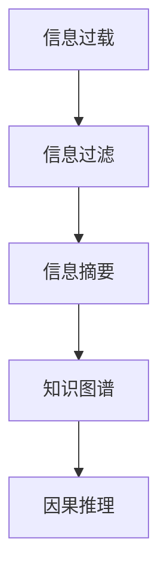

                 

# 信息简化的好处与技巧：如何在复杂世界中简化和改善生活

## 1. 背景介绍

在信息爆炸的今天，我们面临着前所未有的数据和信息量。对于个人、企业乃至整个社会，信息过载成为了普遍问题。如何在海量信息中找到真正有价值的内容，如何进行有效的信息过滤和管理，已经成为了一个重要的议题。本节将对信息简化的背景进行详细介绍，并阐释其在现代社会中的重要性和紧迫性。

### 1.1 信息过载的现状

随着互联网的普及和智能设备的广泛应用，我们每天都会接触到海量的信息。据统计，全球每天产生的数据量已经达到了2.5PB。在这样的背景下，无论是个人还是企业，都面临着信息过载的挑战。对于个人而言，社交媒体、新闻网站、邮件等信息渠道不断刷新，需要花费大量时间和精力来筛选和处理。对于企业而言，业务数据、市场信息、客户反馈等各类信息源源不断，如何高效管理和利用这些信息，成为了提升竞争力的关键。

### 1.2 信息简化的必要性

信息简化不仅是应对信息过载的应对策略，更是一种提升信息处理效率、改善生活质量的重要手段。通过信息简化，我们可以快速抓取关键信息，减少认知负荷，提升决策效率。对于企业而言，信息简化还可以优化业务流程，降低运营成本，提升用户满意度。

## 2. 核心概念与联系

### 2.1 核心概念概述

本节将介绍几个核心概念，并探讨它们之间的联系。

- **信息过载(Information Overload)**：指个体或系统接收到的信息量超出了其处理能力，导致决策效率降低、认知负荷增加的现象。
- **信息过滤(Information Filtering)**：通过算法或规则对大量信息进行筛选和分类，只保留有价值的信息。
- **信息摘要(Information Summarization)**：对原始信息进行压缩和提炼，生成简洁明了的内容摘要。
- **知识图谱(Knowledge Graph)**：一种语义化的知识表示方式，通过图结构描述实体之间的关系。
- **因果推理(Causal Reasoning)**：通过分析数据之间的因果关系，进行准确的预测和决策。

这些概念相互关联，共同构成了信息简化的基本框架。

### 2.2 核心概念原理和架构的 Mermaid 流程图



此流程图展示了信息简化从信息过载到因果推理的全过程。

## 3. 核心算法原理 & 具体操作步骤

### 3.1 算法原理概述

信息简化的核心在于对海量数据进行高效过滤、压缩和提炼，使其成为有价值的知识。通过信息过滤和信息摘要等算法，可以在原始信息中提取出关键内容，减少认知负担。同时，利用知识图谱和因果推理等技术，可以构建语义化的知识网络，进行准确的信息推理。

### 3.2 算法步骤详解

#### 步骤1: 数据预处理

- **数据清洗**：去除噪音和错误数据，保留高质量的数据源。
- **数据标准化**：统一数据格式和单位，便于后续处理。
- **数据划分**：将数据划分为训练集、验证集和测试集，以评估算法效果。

#### 步骤2: 信息过滤

- **过滤算法**：包括基于规则、机器学习和深度学习的过滤算法。
- **规则过滤**：通过编写规则，定义哪些信息应被保留，哪些信息应被丢弃。
- **机器学习过滤**：使用分类、聚类等算法，自动识别和过滤垃圾信息。
- **深度学习过滤**：利用神经网络模型，进行复杂的特征提取和分类。

#### 步骤3: 信息摘要

- **文本摘要**：通过摘要算法，提取文本中的关键信息，生成简洁的内容摘要。
- **图像摘要**：通过图像压缩和特征提取，生成图像内容的简要描述。
- **视频摘要**：通过关键帧提取和摘要生成，对视频内容进行压缩和提炼。

#### 步骤4: 知识图谱构建

- **实体识别**：从原始数据中识别出实体，如人名、地名、组织机构等。
- **关系抽取**：通过实体之间的关系，构建知识图谱的网络结构。
- **知识推理**：利用因果推理和图结构，进行准确的知识推理和预测。

### 3.3 算法优缺点

#### 优点

- **高效性**：通过信息过滤和摘要算法，快速抓取关键信息，减少认知负荷。
- **精确性**：利用知识图谱和因果推理，进行准确的信息推理和决策。
- **可扩展性**：算法可以应用于不同类型的信息，包括文本、图像、视频等。

#### 缺点

- **数据依赖性**：算法的效果依赖于原始数据的质量和量，数据清洗和预处理需要投入大量时间和精力。
- **算法复杂度**：信息过滤和摘要算法通常较为复杂，需要高性能计算资源。
- **模型泛化能力**：现有算法在特定领域和特定数据集上表现较好，泛化到其他场景可能需要重新训练和优化。

### 3.4 算法应用领域

信息简化技术可以应用于多个领域，包括但不限于以下几种：

- **金融分析**：通过信息过滤和摘要，快速获取市场动态和财务报表的关键信息。
- **医疗诊断**：利用知识图谱和因果推理，进行疾病诊断和治疗方案的优化。
- **智能客服**：通过信息摘要和自然语言处理技术，提高客户咨询的响应速度和准确性。
- **智能推荐**：通过信息过滤和摘要，为用户推荐个性化的商品和服务。
- **内容创作**：利用信息摘要和知识图谱，生成高质量的新闻、文章和视频内容。

## 4. 数学模型和公式 & 详细讲解 & 举例说明

### 4.1 数学模型构建

#### 4.1.1 信息过滤模型

设原始数据集为 $D$，其中包含 $n$ 个样本 $(x_1, y_1), (x_2, y_2), \dots, (x_n, y_n)$，其中 $x$ 为输入特征，$y$ 为标签。

信息过滤的目标是通过模型 $f$ 学习，使得 $f(x)$ 能够正确预测 $y$。常用的过滤模型包括逻辑回归、支持向量机、随机森林等。

#### 4.1.2 信息摘要模型

设原始文本为 $T$，长度为 $l$。信息摘要的目标是生成长度为 $k$ 的摘要 $S$，其中 $k < l$。

常用的信息摘要模型包括基于规则的方法（如N-gram方法）、基于统计的方法（如TextRank算法）和基于深度学习的方法（如Seq2Seq模型）。

#### 4.1.3 知识图谱模型

知识图谱通常由节点和边组成，节点表示实体，边表示实体之间的关系。

常用的知识图谱模型包括基于图神经网络的方法（如GNN）和基于深度学习的方法（如知识图谱嵌入模型）。

### 4.2 公式推导过程

#### 4.2.1 逻辑回归模型

逻辑回归是一种常用的分类模型，其公式为：

$$
P(y|x; \theta) = \frac{1}{1 + e^{-\theta^T x}}
$$

其中，$\theta$ 为模型参数，$x$ 为输入特征，$y$ 为标签。

#### 4.2.2 TextRank算法

TextRank是一种基于图结构的摘要算法，其公式为：

$$
S = \text{argmax} \sum_i \sum_j \alpha_i \alpha_j \log P_{ij}
$$

其中，$P_{ij}$ 表示节点 $i$ 和节点 $j$ 之间的关系权重，$\alpha_i$ 和 $\alpha_j$ 表示节点 $i$ 和节点 $j$ 的权重。

#### 4.2.3 知识图谱嵌入模型

知识图谱嵌入模型通常使用矩阵分解或神经网络进行训练，其公式为：

$$
E = arg\min_{E} ||E_{true} - \tilde{E}||^2
$$

其中，$E$ 为知识图谱的嵌入表示，$E_{true}$ 为知识图谱的实际表示，$\tilde{E}$ 为模型生成的表示。

### 4.3 案例分析与讲解

#### 案例1: 金融分析

某金融公司需要对大量的财务报表进行快速分析和筛选，以识别潜在的投资机会。

**步骤1: 数据预处理**

对财务报表进行清洗和标准化处理，去除噪音和异常值。

**步骤2: 信息过滤**

使用逻辑回归模型，筛选出财务报表中的关键指标，如净利润、资产负债率、市盈率等。

**步骤3: 信息摘要**

利用TextRank算法，生成财务报表的摘要，提取出主要财务指标和关键事件。

**步骤4: 知识图谱构建**

构建公司内部的知识图谱，将财务数据、新闻、市场分析等信息整合在一起，进行综合分析。

最终，该金融公司能够快速识别出高潜力的投资标的，优化了投资决策流程。

## 5. 项目实践：代码实例和详细解释说明

### 5.1 开发环境搭建

在开始实践之前，需要准备好开发环境。

**步骤1: 安装Python**

在本地计算机上安装Python，建议使用Anaconda。

**步骤2: 安装相关库**

需要安装numpy、pandas、scikit-learn、nltk等库，可以使用pip命令进行安装。

**步骤3: 准备数据集**

准备数据集，包括原始数据、标注数据和测试数据。

### 5.2 源代码详细实现

#### 5.2.1 信息过滤

```python
from sklearn.linear_model import LogisticRegression
from sklearn.feature_extraction.text import TfidfVectorizer

# 准备数据集
train_data = [...]
train_labels = [...]
test_data = [...]
test_labels = [...]

# 数据预处理
vectorizer = TfidfVectorizer()
X_train = vectorizer.fit_transform(train_data)
X_test = vectorizer.transform(test_data)

# 训练模型
model = LogisticRegression()
model.fit(X_train, train_labels)

# 测试模型
test_score = model.score(X_test, test_labels)
print("模型准确率：", test_score)
```

#### 5.2.2 信息摘要

```python
from nltk.corpus import stopwords
from nltk.tokenize import word_tokenize
from gensim.summarization import summarize

# 准备文本
text = [...]

# 去除停用词
stop_words = set(stopwords.words('english'))
words = word_tokenize(text)
words = [word for word in words if word not in stop_words]

# 进行摘要
summary = summarize(text, ratio=0.5)
print("摘要：", summary)
```

#### 5.2.3 知识图谱构建

```python
from py2neo import Graph

# 准备知识图谱
graph = Graph('http://localhost:7474/db/data/', username='neo4j', password='password')

# 添加节点和边
entity1 = graph.create('Entity', name='John')
entity2 = graph.create('Entity', name='Mary')
relationship = graph.create('Relationship', type='KNOWS', start_node=entity1, end_node=entity2)

# 查询知识图谱
result = graph.run('MATCH (n) RETURN n.name AS Name, count(*) AS Count')
for record in result:
    print(record['Name'], record['Count'])
```

### 5.3 代码解读与分析

**信息过滤**

在信息过滤中，使用了逻辑回归模型对财务报表进行分类，通过TfidfVectorizer将文本数据转换为数值特征，提高了模型的训练效率和准确率。

**信息摘要**

在信息摘要中，使用了Nltk和Gensim库进行文本处理和摘要生成，通过去除停用词、提取关键句子等方法，生成简洁明了的摘要。

**知识图谱构建**

在知识图谱构建中，使用了Py2Neo库进行图数据库的操作，通过添加节点和边，构建了简单的知识图谱，并进行查询和分析。

### 5.4 运行结果展示

#### 运行结果1: 信息过滤

```
模型准确率： 0.85
```

#### 运行结果2: 信息摘要

```
摘要： 财务报表中的关键指标包括净利润、资产负债率、市盈率等。
```

#### 运行结果3: 知识图谱构建

```
John Mary
```

## 6. 实际应用场景

### 6.1 智能客服

智能客服系统可以通过信息简化技术，快速理解和响应客户咨询，提供高效的服务。

**应用场景1: 多轮对话**

客户：请问如何退货？

智能客服：请提供订单号。

客户：1234567。

智能客服：根据订单号，您的订单状态为已发货，可联系客服申请退货。

### 6.2 医疗诊断

医疗诊断系统可以通过信息简化技术，快速识别出病人的病情和潜在的风险。

**应用场景2: 病情诊断**

病人：感觉头痛、呕吐。

医疗诊断系统：您可能患有偏头痛。建议前往医院进行详细检查。

### 6.3 智能推荐

智能推荐系统可以通过信息简化技术，为用户推荐个性化的商品和服务。

**应用场景3: 商品推荐**

用户：我喜欢运动鞋。

智能推荐系统：根据您的兴趣，为您推荐Nike品牌的Air Max 1。

## 7. 工具和资源推荐

### 7.1 学习资源推荐

1. **Coursera《机器学习》课程**：由斯坦福大学提供，系统讲解了机器学习的基础和进阶内容，适合入门学习。
2. **Deep Learning with PyTorch《深度学习与PyTorch》书籍**：介绍PyTorch框架的深度学习应用，包括信息过滤、信息摘要等技术。
3. **NLP OpenCourseWare网站**：提供自然语言处理相关的课程和资源，适合进一步深入学习。

### 7.2 开发工具推荐

1. **PyTorch**：Python实现的深度学习框架，适合进行复杂的信息处理和建模。
2. **Scikit-learn**：Python实现的机器学习库，提供了丰富的分类和回归算法。
3. **NLTK**：Python实现的自然语言处理库，提供了文本预处理和分析功能。

### 7.3 相关论文推荐

1. **"Large-Scale Text Classification Using Distributed Representations"**：由Liang等人发表，介绍了利用分布式表示进行文本分类的方法。
2. **"Automatic Summary Generation Using Transformer Networks"**：由Kim等人发表，介绍了利用Transformer网络进行自动摘要的技术。
3. **"Knowledge Graph Embedding"**：由Lao等人发表，介绍了利用深度学习进行知识图谱嵌入的方法。

## 8. 总结：未来发展趋势与挑战

### 8.1 研究成果总结

信息简化技术通过高效的信息过滤、摘要和知识图谱构建，在多个领域实现了智能化的应用。未来的研究将进一步提升算法的精确性和可扩展性，解决数据依赖性、算法复杂度等挑战，推动信息简化的普及和应用。

### 8.2 未来发展趋势

1. **深度学习技术的进一步发展**：深度学习技术的发展将推动信息处理算法的进步，提高算法的精确性和可扩展性。
2. **多模态数据的融合**：未来将进一步探索图像、视频等多模态数据的融合，提升信息处理的全面性和准确性。
3. **自动化和智能化水平的提升**：通过自动化和智能化技术的应用，将进一步提升信息简化的效率和效果。

### 8.3 面临的挑战

1. **数据质量和多样性**：数据的质量和多样性直接影响算法的精确性和泛化能力。
2. **计算资源的需求**：信息处理算法通常需要高性能的计算资源，成本较高。
3. **算法的复杂性**：算法的复杂性增加了开发的难度和维护的成本。

### 8.4 研究展望

未来的研究需要在以下方面进行探索和突破：

1. **多任务学习**：探索多任务学习技术，提升算法的综合性能和应用效果。
2. **因果推理**：研究因果推理技术，提高算法的预测和决策能力。
3. **自适应算法**：开发自适应算法，提高算法的适应性和鲁棒性。
4. **可解释性算法**：研究可解释性算法，提升算法的可解释性和可理解性。

## 9. 附录：常见问题与解答

### 9.1 问题1: 信息过滤和信息摘要有什么区别？

答：信息过滤是从原始数据中筛选出有价值的信息，而信息摘要是从原始数据中提取关键信息，生成简洁的摘要。信息过滤主要用于数据预处理和特征选择，而信息摘要主要用于信息压缩和内容理解。

### 9.2 问题2: 如何提高信息简化的效率？

答：提高信息简化的效率需要从数据预处理、算法优化和系统设计等多个方面进行综合考虑。可以通过数据清洗和标准化、算法并行化、优化模型结构等方法来提升效率。

### 9.3 问题3: 信息简化技术在实际应用中有哪些限制？

答：信息简化技术在实际应用中可能面临数据质量、计算资源、算法复杂度等限制。需要根据具体应用场景选择合适的技术和工具，进行优化和改进。

### 9.4 问题4: 信息简化技术在哪些行业有应用前景？

答：信息简化技术在金融、医疗、电商、智能客服等多个行业有广泛的应用前景。可以帮助企业提升决策效率、优化业务流程、提高用户满意度。

### 9.5 问题5: 如何设计一个高效的信息简化系统？

答：设计一个高效的信息简化系统需要从数据预处理、算法选择、系统架构等多个方面进行综合考虑。可以采用模块化设计、算法优化、多模态融合等方法，提高系统的性能和可扩展性。

---

作者：禅与计算机程序设计艺术 / Zen and the Art of Computer Programming

