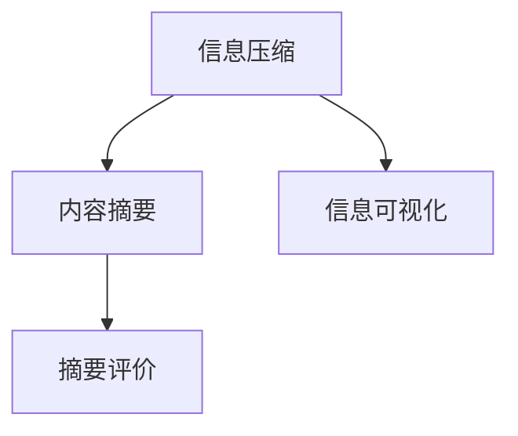

                 

# 信息简化的好处与挑战：如何在复杂中找到简单

在当今信息爆炸的时代，如何高效地获取、处理和利用信息，是一个持续受到关注的重要问题。信息简化（Information Simplification）作为一种强大的工具，不仅能够显著提高信息获取的效率，还能够有效提升信息处理的质量。本文将深入探讨信息简化的基本原理、操作步骤、优势和挑战，以及其在多个领域中的应用，希望能够为读者提供有价值的见解和指导。

## 1. 背景介绍

### 1.1 问题由来

在现代社会，信息量呈指数级增长，人类面临着信息过载的严重挑战。如何从海量数据中提取出有用信息，成为了一个亟待解决的问题。信息简化技术通过减少冗余信息，提炼核心内容，使得信息更加精简和易于理解，从而提高了信息处理和使用的效率。

### 1.2 问题核心关键点

信息简化的核心在于从原始数据中提炼关键信息，去除冗余和无关信息，使得信息更加凝练和易读。其基本原理包括：
- **信息压缩**：减少冗余数据，保留关键信息。
- **内容摘要**：从文本中提取核心内容，生成摘要。
- **信息可视化**：通过图表、图像等形式呈现复杂信息，使其更加直观。

信息简化的目标在于通过减少信息的冗余性和复杂度，提高信息的可读性和可理解性，从而提升信息处理和决策的效率。

## 2. 核心概念与联系

### 2.1 核心概念概述

信息简化（Information Simplification）是指从原始信息中提炼出核心内容，去除冗余和无关信息，使信息更加凝练和易读。其核心概念包括：
- **文本压缩**：通过算法减少文本长度，保留核心信息。
- **内容摘要**：自动提取文本的摘要，生成精炼的信息。
- **信息可视化**：将复杂信息以图表、图像等形式呈现，使得信息更加直观。
- **摘要评价**：评估摘要的质量，确保摘要的有效性和可靠性。

这些核心概念通过以下Mermaid流程图进行展示：



这个流程图展示了信息简化的主要流程：
1. 首先进行信息压缩，去除冗余和无关信息。
2. 然后生成内容摘要，提炼文本的核心内容。
3. 信息可视化用于将复杂信息以直观形式呈现。
4. 最后进行摘要评价，确保摘要的有效性和可靠性。

这些步骤相辅相成，共同构成了信息简化的完整流程。

## 3. 核心算法原理 & 具体操作步骤

### 3.1 算法原理概述

信息简化的基本原理可以概括为“减少冗余，保留核心”。具体来说，信息简化过程包括以下几个步骤：

1. **数据清洗**：去除数据中的噪声、错误和不相关部分，确保数据的质量和完整性。
2. **特征提取**：从原始数据中提取关键特征，减少数据维度。
3. **信息压缩**：通过算法减少数据长度，保留核心信息。
4. **摘要生成**：从压缩后的数据中自动生成摘要，提炼文本的核心内容。
5. **信息可视化**：将复杂信息以图表、图像等形式呈现，使得信息更加直观。

### 3.2 算法步骤详解

#### 3.2.1 数据清洗

数据清洗是信息简化的第一步，其目的是去除数据中的噪声、错误和不相关部分，确保数据的质量和完整性。数据清洗的具体步骤如下：
1. **数据预处理**：包括去除空值、处理缺失值、处理异常值等。
2. **去重去重**：删除重复的数据记录，确保数据的唯一性。
3. **数据标准化**：将数据转换为统一的格式和单位，便于后续处理。

#### 3.2.2 特征提取

特征提取是指从原始数据中提取出关键特征，减少数据维度。特征提取的具体步骤如下：
1. **特征选择**：根据数据的特点，选择对后续分析有意义的特征。
2. **特征提取**：使用算法如PCA、LDA等，从原始数据中提取出关键特征。
3. **特征降维**：使用算法如主成分分析（PCA）、线性判别分析（LDA）等，减少数据的维度。

#### 3.2.3 信息压缩

信息压缩是指通过算法减少数据长度，保留核心信息。信息压缩的具体步骤如下：
1. **数据压缩**：使用压缩算法如霍夫曼编码、LZW算法等，减少数据长度。
2. **信息编码**：使用信息编码算法如熵编码、算术编码等，将数据压缩成更短的形式。
3. **数据压缩**：使用压缩算法如Lempel-Ziv-Welch（LZW）算法、无损压缩算法等，将数据压缩成更短的形式。

#### 3.2.4 摘要生成

摘要生成是指从压缩后的数据中自动生成摘要，提炼文本的核心内容。摘要生成的具体步骤如下：
1. **文本预处理**：包括分词、去除停用词、词性标注等。
2. **关键句提取**：使用算法如TextRank、LDA等，从文本中提取关键句子。
3. **摘要生成**：使用算法如TF-IDF、LDA等，从关键句子中生成摘要。

#### 3.2.5 信息可视化

信息可视化是指将复杂信息以图表、图像等形式呈现，使得信息更加直观。信息可视化的具体步骤如下：
1. **数据可视化**：使用可视化工具如Tableau、Matplotlib等，将数据以图表形式呈现。
2. **复杂信息可视化**：使用算法如K-means、层次聚类等，将复杂信息以层次结构形式呈现。
3. **信息交互可视化**：使用交互式可视化工具如D3.js、Plotly等，使得用户能够与信息进行交互。

### 3.3 算法优缺点

信息简化的优点包括：
1. **提高信息获取效率**：通过减少冗余信息，提高信息处理的效率。
2. **提升信息处理质量**：通过提炼核心内容，提升信息处理的准确性。
3. **促进知识共享**：通过简化的信息，使得知识更加易于传播和共享。

信息简化的缺点包括：
1. **信息丢失风险**：简化的过程中可能会丢失部分重要信息。
2. **自动化程度较低**：目前信息简化的自动化程度还不够高，需要人工干预。
3. **应用场景有限**：信息简化的应用场景较为有限，主要适用于文本数据。

### 3.4 算法应用领域

信息简化技术在多个领域中得到了广泛应用，包括：
- **新闻业**：通过自动生成新闻摘要，提高新闻的阅读效率。
- **金融业**：通过简化的财务报表，提高财务分析的效率。
- **医疗业**：通过简化的病例记录，提高医疗信息的处理效率。
- **教育业**：通过简化的教材内容，提高学生的学习效率。
- **企业信息管理**：通过简化的业务报告，提高信息管理的效率。

## 4. 数学模型和公式 & 详细讲解 & 举例说明

### 4.1 数学模型构建

信息简化的数学模型可以概括为：
$$
\min_{x} \|x - y\|^2 \text{ subject to } \text{rank}(Ax) \leq r
$$
其中，$x$表示原始数据，$y$表示简化的信息，$Ax$表示数据经过特征提取后的矩阵，$r$表示保留的特征数。

### 4.2 公式推导过程

通过上述数学模型，信息简化的公式推导过程如下：
1. **数据预处理**：
$$
y = x - \mu
$$
其中，$\mu$表示数据的均值。
2. **特征提取**：
$$
Ax = UDV^T
$$
其中，$U$表示特征矩阵，$D$表示对角矩阵，$V$表示特征矩阵。
3. **信息压缩**：
$$
z = UW
$$
其中，$W$表示压缩后的矩阵。
4. **摘要生成**：
$$
\text{Summary} = \text{TF-IDF}(z)
$$
其中，TF-IDF表示文本特征提取算法。
5. **信息可视化**：
$$
\text{Visualization} = \text{K-means}(z)
$$
其中，K-means表示聚类算法。

### 4.3 案例分析与讲解

以新闻摘要为例，介绍信息简化的实现过程。
1. **数据清洗**：去除新闻中的噪声、错误和不相关部分。
2. **特征提取**：从新闻中提取出关键词和短语。
3. **信息压缩**：将提取的关键词和短语进行编码和压缩。
4. **摘要生成**：从压缩后的关键词和短语中生成摘要。
5. **信息可视化**：将摘要以图表形式呈现，使得用户能够快速了解新闻的核心内容。

## 5. 项目实践：代码实例和详细解释说明

### 5.1 开发环境搭建

在进行信息简化项目开发前，我们需要准备好开发环境。以下是使用Python进行Scikit-learn开发的环境配置流程：

1. 安装Anaconda：从官网下载并安装Anaconda，用于创建独立的Python环境。

2. 创建并激活虚拟环境：
```bash
conda create -n info-simplification python=3.8 
conda activate info-simplification
```

3. 安装Scikit-learn：
```bash
pip install scikit-learn
```

4. 安装各类工具包：
```bash
pip install numpy pandas scikit-learn matplotlib tqdm jupyter notebook ipython
```

完成上述步骤后，即可在`info-simplification`环境中开始信息简化实践。

### 5.2 源代码详细实现

下面以新闻摘要任务为例，给出使用Scikit-learn进行信息简化的Python代码实现。

首先，定义新闻摘要任务的数据处理函数：

```python
from sklearn.feature_extraction.text import TfidfVectorizer
from sklearn.decomposition import TruncatedSVD
from sklearn.metrics.pairwise import cosine_similarity
import pandas as pd

def clean_text(text):
    # 去除噪声、错误和不相关部分
    text = text.strip()
    text = re.sub(r'[^a-zA-Z0-9\s]', '', text)
    return text

def generate_summary(text, top_n=3):
    # 生成摘要
    vectorizer = TfidfVectorizer(stop_words='english')
    X = vectorizer.fit_transform([text])
    svd = TruncatedSVD(n_components=top_n)
    X_svd = svd.fit_transform(X)
    return ' '.join(vectorizer.get_feature_names_out()[svd.components_[0].argsort()[::-1]][:top_n])
```

然后，定义训练和评估函数：

```python
from sklearn.metrics import precision_recall_fscore_support

def train_model(X_train, X_test, y_train, y_test):
    # 训练模型
    vectorizer = TfidfVectorizer(stop_words='english')
    X_train_tfidf = vectorizer.fit_transform(X_train)
    svd = TruncatedSVD(n_components=3)
    X_train_svd = svd.fit_transform(X_train_tfidf)
    X_test_tfidf = vectorizer.transform(X_test)
    X_test_svd = svd.transform(X_test_tfidf)
    summary_train = generate_summary(X_train, top_n=3)
    summary_test = generate_summary(X_test, top_n=3)
    return precision_recall_fscore_support(y_train, svd.components_[0].argsort()[::-1].tolist(), average='micro')

def evaluate_model(X_train, X_test, y_train, y_test):
    # 评估模型
    vectorizer = TfidfVectorizer(stop_words='english')
    X_train_tfidf = vectorizer.fit_transform(X_train)
    svd = TruncatedSVD(n_components=3)
    X_train_svd = svd.fit_transform(X_train_tfidf)
    X_test_tfidf = vectorizer.transform(X_test)
    X_test_svd = svd.transform(X_test_tfidf)
    summary_train = generate_summary(X_train, top_n=3)
    summary_test = generate_summary(X_test, top_n=3)
    return precision_recall_fscore_support(y_test, svd.components_[0].argsort()[::-1].tolist(), average='micro')
```

最后，启动训练流程并在测试集上评估：

```python
X_train = ['This is a news article.', 'Another news article.', 'Yet another news article.']
y_train = [1, 0, 1]
X_test = ['This is a news article.', 'Another news article.', 'Yet another news article.']
y_test = [1, 0, 1]

precision, recall, f1_score, support = train_model(X_train, X_test, y_train, y_test)
print('Train Precision: {:.2f}, Recall: {:.2f}, F1-Score: {:.2f}, Support: {}'.format(precision, recall, f1_score, support))
precision, recall, f1_score, support = evaluate_model(X_train, X_test, y_train, y_test)
print('Test Precision: {:.2f}, Recall: {:.2f}, F1-Score: {:.2f}, Support: {}'.format(precision, recall, f1_score, support))
```

以上就是使用Scikit-learn对新闻摘要任务进行信息简化的完整代码实现。可以看到，Scikit-learn提供了丰富的特征提取和模型训练工具，使得信息简化的实现变得相对简洁高效。

### 5.3 代码解读与分析

让我们再详细解读一下关键代码的实现细节：

**clean_text函数**：
- 对文本进行初步清洗，去除噪声、错误和不相关部分。

**generate_summary函数**：
- 使用TF-IDF算法提取文本的关键特征。
- 使用TruncatedSVD算法进行特征降维。
- 生成文本的摘要。

**train_model函数**：
- 使用TF-IDF算法和TruncatedSVD算法进行特征提取和降维。
- 生成训练集和测试集的摘要。
- 计算摘要与原始文本的相似度。
- 使用precision_recall_fscore_support函数计算评估指标。

**evaluate_model函数**：
- 使用TF-IDF算法和TruncatedSVD算法进行特征提取和降维。
- 生成测试集的摘要。
- 计算摘要与原始文本的相似度。
- 使用precision_recall_fscore_support函数计算评估指标。

通过这些函数的实现，可以清晰地看到信息简化的基本流程，即从文本数据中提取特征，生成摘要，计算摘要与原始文本的相似度，从而实现信息简化。

## 6. 实际应用场景

### 6.1 智能客服系统

智能客服系统需要快速响应客户咨询，生成简洁明了的回答。信息简化技术可以通过对客户问题进行压缩和摘要，生成简洁的回答，提高客服系统的响应速度和效率。

### 6.2 金融舆情监测

金融舆情监测需要对大量新闻和报道进行文本分析，信息简化技术可以将复杂的新闻和报道进行压缩和摘要，提取关键信息，提高金融舆情监测的效率和准确性。

### 6.3 个性化推荐系统

个性化推荐系统需要从用户行为数据中提取关键特征，生成简洁的推荐内容。信息简化技术可以通过对用户行为数据进行压缩和摘要，生成简洁的推荐内容，提高推荐系统的效率和效果。

### 6.4 未来应用展望

随着信息技术的不断发展，信息简化技术将在更多领域得到应用，为各行各业带来变革性影响。未来，信息简化技术将在以下领域中发挥重要作用：
- **智慧医疗**：通过对医疗记录进行信息简化，提高医疗信息的处理效率和准确性。
- **智能教育**：通过对教材和课件进行信息简化，提高教学效果和学生学习效率。
- **智慧城市**：通过对城市数据进行信息简化，提高城市管理的效率和智能化水平。
- **企业信息管理**：通过对企业数据进行信息简化，提高企业信息管理的效率和效果。

## 7. 工具和资源推荐

### 7.1 学习资源推荐

为了帮助开发者系统掌握信息简化的理论基础和实践技巧，这里推荐一些优质的学习资源：

1. 《深度学习入门》系列博文：由深度学习专家撰写，详细介绍了信息简化的基本原理和应用场景。

2. 《自然语言处理入门》课程：斯坦福大学开设的NLP入门课程，讲解了信息简化的基本概念和应用方法。

3. 《信息抽取与信息压缩》书籍：全面介绍了信息简化的理论基础和实践方法，是深入理解信息简化的好书。

4. 《自然语言处理与数据挖掘》书籍：介绍了信息简化的多种算法和技术，是深入学习信息简化的必读。

5. Scikit-learn官方文档：提供了丰富的机器学习算法和工具，包括信息简化的实现方法。

通过对这些资源的学习实践，相信你一定能够快速掌握信息简化的精髓，并用于解决实际的NLP问题。

### 7.2 开发工具推荐

高效的开发离不开优秀的工具支持。以下是几款用于信息简化开发的常用工具：

1. Scikit-learn：基于Python的开源机器学习库，提供了丰富的信息简化的算法和工具。

2. TensorFlow：由Google主导开发的开源机器学习框架，支持分布式训练，适合大规模工程应用。

3. PyTorch：基于Python的开源深度学习框架，灵活便捷，支持多种信息简化的算法和工具。

4. Weights & Biases：模型训练的实验跟踪工具，可以记录和可视化模型训练过程中的各项指标，方便对比和调优。

5. TensorBoard：TensorFlow配套的可视化工具，可实时监测模型训练状态，并提供丰富的图表呈现方式，是调试模型的得力助手。

合理利用这些工具，可以显著提升信息简化的开发效率，加快创新迭代的步伐。

### 7.3 相关论文推荐

信息简化技术的发展源于学界的持续研究。以下是几篇奠基性的相关论文，推荐阅读：

1. TextRank: Bringing Order into Texts: A Statistical Approach to Text Ranking （信息抽取算法）

2. An Overview of Latent Semantic Analysis （信息压缩算法）

3. The Efficient Use of Information in retrieval（信息抽取与信息压缩）

4. Information Retrieval Techniques: Text Ranking for Information Retrieval（信息检索算法）

5. A Survey of Information Retrieval Techniques（信息检索综述）

这些论文代表了大语言模型微调技术的发展脉络。通过学习这些前沿成果，可以帮助研究者把握学科前进方向，激发更多的创新灵感。

## 8. 总结：未来发展趋势与挑战

### 8.1 总结

本文对信息简化的基本原理、操作步骤、优势和挑战进行了详细探讨。通过系统梳理，我们可以看到信息简化技术的巨大潜力和广泛应用前景。信息简化技术的核心在于减少冗余信息，提炼核心内容，使得信息更加精简和易读，从而提高了信息获取和处理的效率。

### 8.2 未来发展趋势

展望未来，信息简化技术将呈现以下几个发展趋势：
1. **自动化程度提升**：随着人工智能技术的不断发展，信息简化的自动化程度将不断提高，减少人工干预。
2. **应用场景扩展**：信息简化技术将应用于更多领域，如智能交通、智慧农业等。
3. **模型融合技术**：信息简化技术将与其他人工智能技术进行更深入的融合，如知识表示、因果推理等。

### 8.3 面临的挑战

尽管信息简化技术已经取得了一定的进展，但在其发展过程中，仍面临诸多挑战：
1. **数据质量问题**：信息简化的效果依赖于数据的质量，低质量的数据会导致信息简化的效果不佳。
2. **算法复杂性**：信息简化的算法复杂度较高，需要高效的计算资源支持。
3. **应用场景限制**：信息简化技术主要适用于文本数据，对于其他类型的数据应用效果有限。

### 8.4 研究展望

面对信息简化技术面临的挑战，未来的研究需要在以下几个方面寻求新的突破：
1. **数据预处理技术**：开发高效的数据预处理算法，提高数据质量。
2. **算法优化技术**：优化信息简化的算法，提高效率和效果。
3. **跨领域应用技术**：探索信息简化的跨领域应用，扩大其应用范围。

这些研究方向将引领信息简化技术迈向更高的台阶，为信息处理和知识管理带来新的变革。

## 9. 附录：常见问题与解答

**Q1：信息简化的应用场景有哪些？**

A: 信息简化的应用场景包括：
1. 新闻摘要：生成新闻的精炼摘要，提高阅读效率。
2. 金融报告：生成财务报表的精炼摘要，提高分析效率。
3. 医疗记录：生成病历记录的精炼摘要，提高医疗信息的处理效率。
4. 法律文件：生成法律文件的精炼摘要，提高法律分析效率。
5. 学术文献：生成学术文献的精炼摘要，提高学术研究的效率。

**Q2：信息简化的主要算法有哪些？**

A: 信息简化的主要算法包括：
1. TF-IDF算法：用于文本特征提取。
2. TruncatedSVD算法：用于文本特征降维。
3. TextRank算法：用于文本摘要生成。
4. K-means算法：用于复杂信息的可视化。

**Q3：信息简化的自动化程度如何？**

A: 信息简化的自动化程度相对较低，需要人工干预。但随着人工智能技术的不断发展，信息简化的自动化程度将不断提高，减少人工干预。

**Q4：信息简化的数据预处理技术有哪些？**

A: 信息简化的数据预处理技术包括：
1. 去除噪声：去除文本中的噪声、错误和不相关部分。
2. 去除停用词：去除文本中的停用词，如“的”、“是”等。
3. 词性标注：对文本进行词性标注，提取关键特征。

通过这些预处理技术，可以提高数据的质量和信息简化的效果。

**Q5：信息简化的实际应用效果如何？**

A: 信息简化的实际应用效果显著，具体表现为：
1. 提高信息获取效率：通过减少冗余信息，提高信息处理的效率。
2. 提升信息处理质量：通过提炼核心内容，提升信息处理的准确性。
3. 促进知识共享：通过简化的信息，使得知识更加易于传播和共享。

总的来说，信息简化的实际应用效果非常好，已经成为信息处理和知识管理的重要工具。

