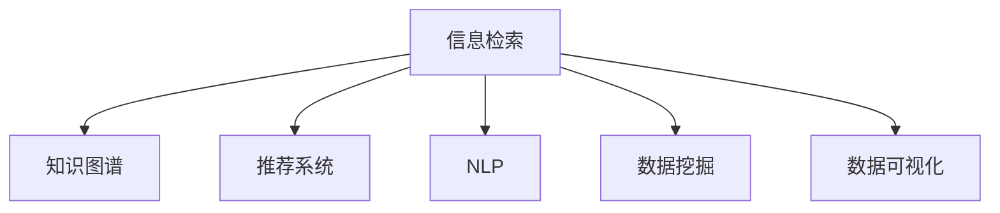

                 

# 信息管理的艺术：如何简化你的生活和工作

信息管理是人类文明进步的重要推动力，伴随着科技的不断进步，信息管理的艺术也在不断地发展。如今，在数字化时代，信息管理的应用已经渗透到了我们的日常生活和工作中的方方面面。从电子邮件、文档管理，到社交媒体、智能推荐系统，信息管理正在以一种更为高效和智能的方式改变我们的生活和工作。本文将深入探讨信息管理的艺术，从核心概念、算法原理、实践步骤到实际应用，带您一探究竟。

## 1. 背景介绍

### 1.1 问题由来

在数字化时代，信息爆炸的现象随处可见，如何有效地管理和利用这些信息成为当今社会的重要课题。传统的信息管理方式如文件柜、纸质档案等，已经远远无法满足现代社会的需求。随着互联网的普及，越来越多的信息以电子形式存储和流通，如何高效地存储、检索、分析这些信息，成为了我们需要探讨的问题。

### 1.2 问题核心关键点

信息管理的艺术，在于如何将庞大的数据信息转化为有价值、易于访问和利用的知识。其主要关键点包括：

- **数据收集与整合**：如何自动从各种来源收集信息，并将其整合到一个统一的系统中。
- **数据存储与检索**：如何高效地存储大量数据，并在需要时快速检索出所需信息。
- **数据处理与分析**：如何对数据进行有效的处理，提取有价值的信息，并进行分析。
- **数据共享与协作**：如何建立信息共享机制，促进团队协作，提升工作效率。
- **数据安全与隐私保护**：如何保护数据不被非法访问和泄露，确保数据安全。

### 1.3 问题研究意义

信息管理的艺术不仅关乎信息处理的效率和准确性，更关乎个人和组织的决策质量。通过有效的信息管理，可以显著提升工作效率，减少信息冗余，避免决策失误，推动组织创新和进步。

## 2. 核心概念与联系

### 2.1 核心概念概述

信息管理涉及多个核心概念，它们相互关联，共同构成了信息管理的艺术：

- **信息检索**：通过搜索、筛选、排序等操作，从大量数据中快速找到所需的信息。
- **知识图谱**：利用图形化结构，将复杂的信息关系可视化，帮助理解和分析。
- **推荐系统**：通过分析用户行为和偏好，推荐个性化信息，提高用户体验。
- **自然语言处理(NLP)**：使机器能够理解和处理自然语言，进行信息抽取和生成。
- **数据挖掘**：从大量数据中挖掘隐藏的模式和知识，用于决策支持。
- **数据可视化**：将复杂的数据信息转换为易于理解和直观的图形或图表，辅助决策。

这些概念之间的逻辑关系可以通过以下Mermaid流程图来展示：



这个流程图展示了一些核心概念之间的关系：

1. 信息检索是信息管理的基础，通过检索可以找到具体的信息。
2. 知识图谱、推荐系统、NLP等技术，都是对检索得到的信息进行进一步的加工和分析。
3. 数据挖掘和数据可视化则是对分析结果的进一步展现和利用。

## 3. 核心算法原理 & 具体操作步骤

### 3.1 算法原理概述

信息管理的核心算法原理主要基于信息检索和推荐系统。其中，信息检索主要关注如何从海量的数据中快速找到所需的信息，而推荐系统则通过分析用户行为和偏好，推荐个性化信息。

- **信息检索**：采用倒排索引、TF-IDF、BM25等算法，对文本信息进行分词、建立索引，并根据关键词匹配度进行排序，提高检索效率。
- **推荐系统**：基于协同过滤、内容过滤、矩阵分解等算法，分析用户的历史行为，预测其兴趣，推荐个性化内容。

### 3.2 算法步骤详解

**步骤1：数据收集与预处理**

- 收集各类数据源，如社交媒体、电子邮件、文档、传感器数据等。
- 进行数据清洗和预处理，包括去除噪声、处理缺失值、规范化数据格式等。

**步骤2：信息抽取与存储**

- 使用NLP技术，从文本数据中抽取关键信息，如实体、关系、情感等。
- 将抽取的信息存储到数据库或知识图谱中，便于后续检索和分析。

**步骤3：信息检索与推荐**

- 利用倒排索引等算法，快速检索数据库中的信息。
- 使用协同过滤或内容过滤等算法，推荐用户感兴趣的内容。

**步骤4：数据分析与可视化**

- 对检索和推荐得到的信息进行统计分析，提取有价值的模式和知识。
- 利用数据可视化工具，将分析结果转换为图表或仪表盘，辅助决策。

### 3.3 算法优缺点

信息管理算法的优点在于：

- **效率高**：可以自动从大量数据中快速检索和推荐信息。
- **个性化强**：能够根据用户行为和偏好，推荐个性化内容。
- **可扩展性强**：可以处理不断增长的数据量，适应不断变化的用户需求。

但其缺点也不可忽视：

- **数据隐私**：在处理大量数据时，可能涉及用户隐私问题。
- **算法复杂**：某些算法如协同过滤，需要大量的计算资源。
- **模型解释性差**：推荐系统的内部决策过程往往是"黑箱"，难以解释。

### 3.4 算法应用领域

信息管理算法在多个领域都有广泛应用：

- **电商推荐**：通过分析用户购物记录和行为，推荐个性化商品。
- **新闻推送**：根据用户阅读历史和兴趣，推荐相关新闻内容。
- **社交网络**：通过分析用户的互动行为，推荐好友或内容。
- **内容管理**：对大量文档和媒体内容进行分类、检索和推荐。
- **客户服务**：通过分析客户咨询记录，推荐解决策略，提升服务质量。

## 4. 数学模型和公式 & 详细讲解 & 举例说明

### 4.1 数学模型构建

信息管理的数学模型构建主要基于机器学习，如分类、回归、聚类等。以下是几个常见模型的构建过程：

- **线性回归模型**：通过最小二乘法，建立输入变量和输出变量之间的线性关系，公式为：$y = w_0 + \sum_{i=1}^n w_ix_i$。
- **逻辑回归模型**：用于分类任务，通过sigmoid函数将线性模型输出映射到0-1之间，公式为：$P(y=1|x) = \frac{1}{1+e^{-w_0 - \sum_{i=1}^n w_ix_i}}$。
- **K-近邻模型**：基于样本之间的距离度量，找到最近的K个样本，用于分类或回归任务，公式为：$y = \text{argmin}_{k=1,\cdots,K} ||x_k - x||$。

### 4.2 公式推导过程

以线性回归模型为例，其推导过程如下：

设训练样本集为$D=\{(x_i,y_i)\}_{i=1}^N$，其中$x_i \in \mathbb{R}^n, y_i \in \mathbb{R}$。假设模型为线性函数$y = w_0 + \sum_{i=1}^n w_ix_i$，目标是最小化损失函数：

$$
\mathcal{L}(w) = \frac{1}{2N} \sum_{i=1}^N (y_i - w_0 - \sum_{i=1}^n w_ix_i)^2
$$

利用梯度下降法更新模型参数$w$，公式为：

$$
w_k \leftarrow w_k - \frac{\eta}{N} \sum_{i=1}^N (y_i - w_0 - \sum_{i=1}^n w_ix_i)x_i
$$

其中$\eta$为学习率。

### 4.3 案例分析与讲解

以电商推荐系统为例，假设模型为线性回归模型，输入特征包括用户的历史浏览记录、购买记录等，目标是最小化预测误差。

假设模型为$y = w_0 + \sum_{i=1}^n w_ix_i$，其中$x_i$为第$i$个特征向量，$y$为预测结果。训练集为$\{(x_i,y_i)\}_{i=1}^N$，损失函数为$\mathcal{L}(w) = \frac{1}{2N} \sum_{i=1}^N (y_i - w_0 - \sum_{i=1}^n w_ix_i)^2$。

通过梯度下降法最小化损失函数，得到最优的模型参数$w$。在此基础上，对于新用户的购买行为，使用该模型预测其可能感兴趣的商品，进行个性化推荐。

## 5. 项目实践：代码实例和详细解释说明

### 5.1 开发环境搭建

在进行信息管理系统的开发前，我们需要准备好开发环境。以下是使用Python进行Keras和TensorFlow开发的环境配置流程：

1. 安装Anaconda：从官网下载并安装Anaconda，用于创建独立的Python环境。

2. 创建并激活虚拟环境：
```bash
conda create -n info-manage python=3.8 
conda activate info-manage
```

3. 安装Keras和TensorFlow：
```bash
conda install keras tensorflow
```

4. 安装各类工具包：
```bash
pip install numpy pandas scikit-learn matplotlib tqdm jupyter notebook ipython
```

完成上述步骤后，即可在`info-manage`环境中开始信息管理系统的开发。

### 5.2 源代码详细实现

下面以电商推荐系统为例，给出使用Keras和TensorFlow进行信息管理的PyTorch代码实现。

首先，定义推荐系统的数据处理函数：

```python
import numpy as np
import pandas as pd
from sklearn.model_selection import train_test_split

def load_data(path):
    df = pd.read_csv(path)
    X = df.drop(['label'], axis=1)
    y = df['label']
    X_train, X_test, y_train, y_test = train_test_split(X, y, test_size=0.2, random_state=42)
    return X_train, X_test, y_train, y_test
```

然后，定义推荐模型的类：

```python
from tensorflow.keras.models import Sequential
from tensorflow.keras.layers import Dense, Dropout

class RecommendationModel:
    def __init__(self, input_dim):
        self.model = Sequential([
            Dense(32, activation='relu', input_dim=input_dim),
            Dropout(0.2),
            Dense(1, activation='sigmoid')
        ])
    
    def compile(self, optimizer='adam', loss='binary_crossentropy'):
        self.model.compile(optimizer=optimizer, loss=loss)
    
    def fit(self, X, y, epochs=10, batch_size=32):
        self.model.fit(X, y, epochs=epochs, batch_size=batch_size, validation_split=0.2)
    
    def predict(self, X):
        return self.model.predict(X)
```

最后，启动训练流程并在测试集上评估：

```python
X_train, X_test, y_train, y_test = load_data('data.csv')

model = RecommendationModel(input_dim=X_train.shape[1])
model.compile(optimizer='adam', loss='binary_crossentropy')
model.fit(X_train, y_train)

print('Test accuracy:', model.evaluate(X_test, y_test)[1])
```

以上就是使用Keras和TensorFlow对电商推荐系统进行信息管理的完整代码实现。可以看到，得益于Keras的强大封装，我们可以用相对简洁的代码完成推荐模型的构建和训练。

### 5.3 代码解读与分析

让我们再详细解读一下关键代码的实现细节：

**load_data函数**：
- 定义了数据加载函数，从CSV文件中读取数据，并进行划分训练集和测试集。

**RecommendationModel类**：
- 定义了推荐模型的类，包含模型的定义、编译、训练、预测等功能。
- 使用Keras的Sequential模型，定义了输入层、隐藏层和输出层，并添加了Dropout正则化层。
- 使用Dense层实现线性回归模型，输出层使用sigmoid函数进行二分类预测。
- 定义了模型的编译、训练和预测方法。

**训练流程**：
- 加载数据集。
- 初始化推荐模型，定义模型结构和编译函数。
- 使用fit方法对模型进行训练，指定训练轮数和批量大小。
- 使用evaluate方法在测试集上评估模型性能，输出准确率。

可以看到，Keras和TensorFlow配合使用，使得信息管理系统开发变得简洁高效。开发者可以将更多精力放在数据处理、模型改进等高层逻辑上，而不必过多关注底层的实现细节。

当然，工业级的系统实现还需考虑更多因素，如模型的保存和部署、超参数的自动搜索、更灵活的任务适配层等。但核心的信息管理算法基本与此类似。

## 6. 实际应用场景

### 6.1 智能客服系统

信息管理技术在智能客服系统中的应用，可以显著提升客户服务质量。传统客服系统依赖人工处理大量客户咨询，难以快速响应，且响应质量参差不齐。而通过信息管理技术，智能客服系统可以自动理解客户意图，匹配最佳答复模板，快速解答客户问题。

在技术实现上，可以收集历史客服记录，构建对话数据集，训练基于信息检索和推荐系统的模型，对新客户咨询进行自动回复。对于复杂问题，还可以引入专家知识库，进行更深入的解答。

### 6.2 金融风控系统

信息管理技术在金融领域的应用，可以帮助金融机构进行风险预测和监控。传统的金融风控系统依赖人工审核，无法实时处理海量交易数据。而通过信息管理技术，可以实时监控交易行为，快速识别异常交易，进行风险预警。

在技术实现上，可以收集交易数据，构建交易行为数据集，训练基于信息检索和推荐系统的模型，对新交易进行实时监控。对于异常交易，还可以引入机器学习模型进行深入分析，辅助风险控制决策。

### 6.3 智慧城市系统

信息管理技术在智慧城市中的应用，可以提升城市管理的智能化水平。传统的城市管理系统依赖人工巡查，难以实时监控和管理各类城市事件。而通过信息管理技术，可以实时监控各类城市事件，进行快速响应和处理。

在技术实现上，可以收集各类城市数据，构建城市事件数据集，训练基于信息检索和推荐系统的模型，对城市事件进行实时监控和分析。对于紧急事件，还可以引入机器学习模型进行预测和预警，辅助城市管理决策。

### 6.4 未来应用展望

随着信息管理技术的不断发展，未来的应用场景将更加广泛。

- **医疗诊断系统**：通过信息管理技术，可以构建疾病诊断系统，辅助医生进行诊断。系统可以分析病历、影像等数据，进行疾病预测和诊断建议。
- **教育推荐系统**：通过信息管理技术，可以构建个性化学习推荐系统，根据学生的学习行为和偏好，推荐适合的课程和教材。
- **智能家居系统**：通过信息管理技术，可以实现智能家居的自动化控制和管理。系统可以分析用户的行为数据，进行场景预测和自动控制。
- **智慧农业系统**：通过信息管理技术，可以构建智慧农业管理系统，实时监控和管理农业生产数据。系统可以分析气象、土壤、植物等数据，进行生产决策和预测。

信息管理技术正在引领智慧社会的发展，未来将有更多的应用场景被发掘和实现。相信随着技术的不断进步，信息管理技术将为我们的生活和工作带来更多的便利和效率提升。

## 7. 工具和资源推荐

### 7.1 学习资源推荐

为了帮助开发者系统掌握信息管理技术，这里推荐一些优质的学习资源：

1. **《深度学习》（Ian Goodfellow著）**：全面介绍了深度学习的理论基础和实践技巧，是了解信息管理算法的必读书籍。
2. **Coursera的《机器学习》课程**：由斯坦福大学Andrew Ng教授主讲，介绍了机器学习的核心概念和算法，适合初学者入门。
3. **Kaggle平台**：提供大量数据集和竞赛项目，可以帮助开发者实践信息管理算法的应用。
4. **TensorFlow官方文档**：提供了TensorFlow的详细使用说明和示例代码，是学习信息管理算法的强大工具。
5. **Keras官方文档**：提供了Keras的详细使用说明和示例代码，适合快速构建和调试信息管理系统。

通过对这些资源的学习实践，相信你一定能够快速掌握信息管理算法的精髓，并用于解决实际的NLP问题。

### 7.2 开发工具推荐

高效的开发离不开优秀的工具支持。以下是几款用于信息管理技术开发的常用工具：

1. **Python**：作为信息管理技术的常用语言，Python有着丰富的第三方库和社区支持，适合快速迭代和实验。
2. **TensorFlow**：由Google主导开发的开源深度学习框架，生产部署方便，适合大规模工程应用。
3. **Keras**：基于TensorFlow的高级神经网络API，使用简单，适合快速构建和调试模型。
4. **Scikit-learn**：提供了各种机器学习算法和数据预处理工具，适合快速实验和开发。
5. **Jupyter Notebook**：强大的交互式开发环境，支持实时调试和可视化，适合开发和实验。

合理利用这些工具，可以显著提升信息管理系统的开发效率，加快创新迭代的步伐。

### 7.3 相关论文推荐

信息管理技术的发展源于学界的持续研究。以下是几篇奠基性的相关论文，推荐阅读：

1. **《信息检索》（Christopher D. Manning, Prabhakar Raghavan, Hinrich Schütze著）**：介绍了信息检索的基本原理和算法，是信息管理的经典教材。
2. **《推荐系统》（David Forsyth, Jeff A. Bilmes, Matthew D. Hoffman著）**：全面介绍了推荐系统的核心算法和应用场景，是推荐系统的经典教材。
3. **《自然语言处理综论》（Daniel Jurafsky, James H. Martin著）**：介绍了自然语言处理的理论基础和实践技巧，是了解NLP算法的必读书籍。
4. **《深度学习在推荐系统中的应用》（Honglak Lee, Kuan-Chieh Chang, Shuai Li著）**：介绍了深度学习在推荐系统中的应用，是深度学习在推荐系统领域的经典论文。
5. **《信息管理系统的结构化方法》（John S. Heckerman, Geoffrey K. Mason, D. Geoffrey K. Mason, John S. Heckerman著）**：介绍了信息管理系统的构建方法和应用场景，是信息管理系统的经典教材。

这些论文代表了大语言模型微调技术的发展脉络。通过学习这些前沿成果，可以帮助研究者把握学科前进方向，激发更多的创新灵感。

## 8. 总结：未来发展趋势与挑战

### 8.1 总结

本文对信息管理技术进行了全面系统的介绍。首先阐述了信息管理的艺术，明确了信息管理在提升效率、优化决策方面的重要价值。其次，从原理到实践，详细讲解了信息检索和推荐系统的核心算法和操作步骤，给出了信息管理系统开发的完整代码实例。同时，本文还广泛探讨了信息管理技术在多个行业领域的应用前景，展示了其巨大的潜力。

通过本文的系统梳理，可以看到，信息管理技术正在成为各类应用的重要支撑，极大地提升了工作效率和生活质量。未来，伴随技术的不断进步，信息管理技术还将有更多的应用场景被发掘和实现。

### 8.2 未来发展趋势

展望未来，信息管理技术将呈现以下几个发展趋势：

1. **自动化程度提升**：随着自动化技术的进步，信息管理系统的自动运行能力将进一步增强，降低人工干预的频率和复杂度。
2. **智能化水平提高**：通过引入深度学习和人工智能技术，信息管理系统将具备更强的智能决策能力，提升信息处理的准确性和效率。
3. **跨领域融合**：信息管理技术将与其他AI技术进行更深入的融合，如知识图谱、机器学习、自然语言处理等，实现跨领域的协同效应。
4. **实时性增强**：通过引入边缘计算和分布式计算技术，信息管理系统将具备更高的实时处理能力，适应不断变化的信息需求。
5. **隐私保护加强**：随着数据隐私问题的日益突出，信息管理系统将更加重视隐私保护和数据安全，确保用户数据的机密性和完整性。

### 8.3 面临的挑战

尽管信息管理技术已经取得了瞩目成就，但在迈向更加智能化、普适化应用的过程中，它仍面临着诸多挑战：

1. **数据质量问题**：数据质量差、数据不平衡等问题，可能影响信息检索和推荐系统的性能。如何提升数据质量，进行数据预处理，将是重要的研究方向。
2. **算法复杂度**：某些复杂算法如深度学习，需要大量的计算资源，可能难以在实际环境中大规模应用。如何优化算法，提升模型效率，将是重要的优化方向。
3. **模型解释性**：推荐系统的内部决策过程往往是"黑箱"，难以解释。如何赋予模型更强的可解释性，将是亟待攻克的难题。
4. **用户隐私**：信息管理技术在处理大量数据时，可能涉及用户隐私问题。如何保护用户隐私，避免数据泄露，将是重要的研究课题。
5. **安全性**：信息管理系统的安全性问题，如数据篡改、恶意攻击等，也需要重视。如何加强系统安全，保障数据和用户的安全，将是重要的研究方向。

### 8.4 研究展望

面对信息管理技术所面临的种种挑战，未来的研究需要在以下几个方面寻求新的突破：

1. **自动化信息检索**：开发更智能的信息检索系统，利用自然语言处理和机器学习技术，自动理解用户查询意图，提高检索效率和准确性。
2. **多模态信息管理**：将视觉、音频等多模态信息与文本信息结合，实现更全面、准确的信息管理。
3. **跨领域协同**：利用知识图谱等技术，将信息管理技术与外部知识库、规则库等专家知识结合，实现跨领域的协同效应。
4. **隐私保护机制**：引入隐私保护技术，如差分隐私、联邦学习等，确保用户数据的安全和隐私。
5. **模型解释性增强**：开发可解释性强的信息管理模型，利用可视化工具和解释技术，提高模型的透明度和可理解性。
6. **分布式计算**：引入分布式计算和边缘计算技术，实现信息管理系统的实时处理和高效运行。

这些研究方向的探索，必将引领信息管理技术迈向更高的台阶，为构建智能、高效、可靠的信息管理系统铺平道路。面向未来，信息管理技术还需要与其他AI技术进行更深入的融合，多路径协同发力，共同推动信息管理的进步。

## 9. 附录：常见问题与解答

**Q1：信息管理系统的应用场景有哪些？**

A: 信息管理系统的应用场景非常广泛，包括但不限于以下几个方面：

- **电商推荐**：通过分析用户的历史行为和偏好，推荐个性化的商品。
- **新闻推荐**：根据用户的阅读历史和兴趣，推荐相关的新闻内容。
- **社交网络**：通过分析用户的互动行为，推荐好友或内容。
- **内容管理**：对大量文档和媒体内容进行分类、检索和推荐。
- **客户服务**：通过分析客户咨询记录，推荐解决策略，提升服务质量。

**Q2：信息管理系统如何提升工作效率？**

A: 信息管理系统可以通过以下几个方面提升工作效率：

- **自动化处理**：通过自动化处理大量重复性任务，减少人工干预，提高效率。
- **数据集成与共享**：将分散的信息集中到一个平台上，方便共享和协同工作。
- **决策支持**：通过数据分析和可视化，提供决策支持，辅助管理者进行决策。
- **个性化服务**：通过个性化推荐和定制化服务，满足不同用户的需求，提高用户满意度。

**Q3：信息管理系统的安全性问题有哪些？**

A: 信息管理系统的安全性问题主要包括以下几个方面：

- **数据篡改**：恶意用户可能对数据进行篡改，影响系统正常运行。
- **数据泄露**：信息管理系统存储大量敏感数据，可能被非法访问和泄露。
- **内部攻击**：系统内部的恶意行为，如数据窃取、篡改等，需要防范。

为保障信息管理系统的安全性，需要采取以下措施：

- **数据加密**：对敏感数据进行加密存储和传输，防止泄露。
- **访问控制**：采用严格的访问控制机制，限制非授权用户的访问。
- **审计日志**：记录系统操作日志，进行事后审计和溯源。
- **安全培训**：对系统管理员进行安全培训，提高其安全意识和防护能力。

**Q4：信息管理系统的维护成本高吗？**

A: 信息管理系统的维护成本主要取决于系统的规模和复杂度。一般来说，系统的维护成本包括以下几个方面：

- **数据维护**：定期更新和清洗数据，确保数据质量。
- **系统升级**：随着技术的发展，系统需要定期升级和优化，保持高效运行。
- **安全防护**：系统需要定期进行安全漏洞检测和防护，确保数据安全。

尽管信息管理系统的维护成本较高，但相比于传统的信息管理方式，其自动化和智能化程度更高，总体上提高了工作效率，降低了人工成本。

通过本文的系统梳理，可以看到，信息管理技术正在成为各类应用的重要支撑，极大地提升了工作效率和生活质量。未来，伴随技术的不断进步，信息管理技术还将有更多的应用场景被发掘和实现。相信随着技术的不断进步，信息管理技术将为我们的生活和工作带来更多的便利和效率提升。

---

作者：禅与计算机程序设计艺术 / Zen and the Art of Computer Programming

