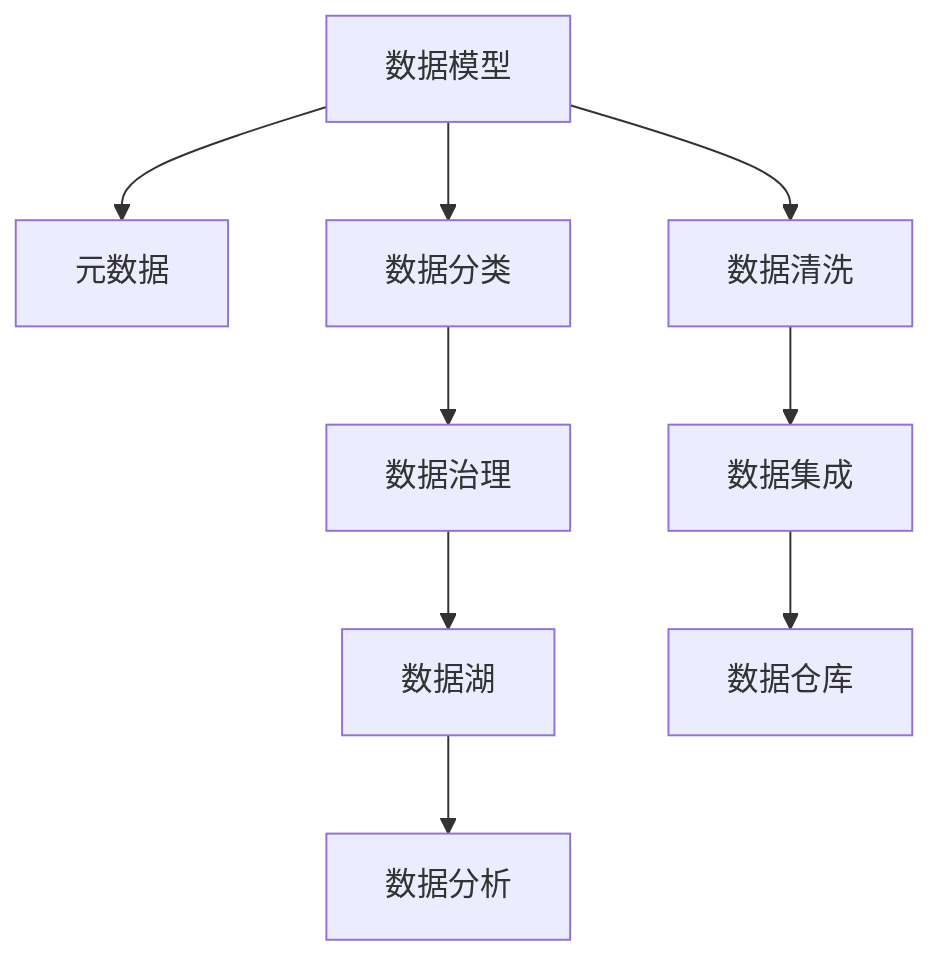

                 

# 信息组织和分类的最佳实践：如何管理你的数字资产

在数字化转型加速的今天，企业的数据资产变得越来越丰富，但如何有效管理和利用这些数据，成为困扰企业和组织的重要问题。本文将从信息组织和分类的角度出发，探讨如何通过最佳实践，提升数字资产的管理效率，解锁其商业价值。

## 1. 背景介绍

### 1.1 问题由来

随着企业数字化转型的不断深入，数据已经成为企业最重要的资产之一。然而，数据量的激增也带来了管理上的挑战：数据孤岛、数据冗余、数据不一致等现象频现，严重影响了数据的利用效率。因此，如何通过高效的信息组织和分类，最大化数据价值，成为了企业亟待解决的问题。

### 1.2 问题核心关键点

信息组织和分类是数据管理的核心，涉及数据模型、元数据、存储方式等多个方面。其核心目标是通过合理的结构和标签，使数据变得易于访问、理解和利用，从而提升数据管理的效率和质量。

## 2. 核心概念与联系

### 2.1 核心概念概述

为了更好地理解信息组织和分类的最佳实践，本节将介绍几个关键概念及其联系：

- **数据模型(Data Model)**：用于描述数据及其之间的结构、属性和关系的数据建模技术。常见的数据模型包括关系型数据库模型、文档模型、图模型等。
- **元数据(Metadata)**：描述数据本身的数据，包括数据的来源、格式、质量、应用场景等。元数据是数据管理的灵魂，贯穿数据治理的各个环节。
- **数据分类(Data Classification)**：按照一定的标准将数据分为不同类别，如结构化数据、半结构化数据、非结构化数据等。分类有助于数据管理和利用。
- **数据治理(Data Governance)**：确保数据质量和业务一致性，涵盖数据标准、数据质量管理、数据安全、数据共享等多个方面。数据治理是实现数据价值的关键。
- **数据湖(Data Lake)**：一个集中存储海量数据的环境，支持大规模数据分析和处理。数据湖能够提供数据访问和共享的统一平台。

这些核心概念之间的关系可以通过以下Mermaid流程图来展示：



这个流程图展示了大数据管理和利用中的关键环节及其相互关系：

1. 数据模型定义了数据的结构和属性，为数据治理和分析提供基础。
2. 元数据描述了数据本身的信息，支持数据质量的监控和数据的自动分类。
3. 数据分类使数据有序组织，方便数据管理和利用。
4. 数据治理确保数据的质量和安全，为数据管理提供制度保障。
5. 数据湖集中存储海量数据，提供统一的数据访问平台。
6. 数据分析和数据清洗、集成等过程共同支撑数据价值实现。

这些概念共同构成了数据管理的基础框架，帮助企业系统化、规范化地管理和利用数据。

## 3. 核心算法原理 & 具体操作步骤

### 3.1 算法原理概述

信息组织和分类的算法原理主要包括数据建模、数据分类和数据治理三个方面：

- **数据建模**：通过结构化或半结构化数据模型定义数据的结构和关系，确保数据的完整性和一致性。
- **数据分类**：按照业务需求或数据特征将数据分为不同类别，便于管理和利用。
- **数据治理**：制定数据管理标准和流程，确保数据质量和安全，支持数据的自动化管理和分析。

### 3.2 算法步骤详解

信息组织和分类的具体步骤包括：

1. **数据采集**：收集企业内外部的数据，包括结构化数据、非结构化数据、日志数据等。
2. **数据清洗**：去除数据中的噪音和异常值，确保数据质量。
3. **数据建模**：定义数据模型，将数据结构化和规范化。
4. **数据分类**：根据业务需求，对数据进行分类，如按数据来源、数据类型、业务主题等。
5. **数据存储**：将清洗和分类后的数据存储到数据湖或数据仓库中。
6. **数据治理**：制定数据管理标准和流程，确保数据质量和安全。
7. **数据分析和利用**：基于数据湖或数据仓库，进行数据探索、分析和可视化，提取数据价值。

### 3.3 算法优缺点

数据组织和分类的算法具有以下优点：

- **规范化管理**：通过标准化数据模型和分类标准，使数据管理规范化、统一化。
- **提高效率**：通过数据分类和元数据管理，提高数据的访问和利用效率。
- **增强数据质量**：通过数据清洗和治理，提升数据质量，减少数据冗余和噪声。

同时，也存在以下缺点：

- **复杂度高**：数据建模和分类需要投入大量人力和资源，实施复杂。
- **灵活性不足**：数据模型和分类标准可能无法灵活适应业务需求的变化。
- **数据孤岛问题**：如果数据管理分散在不同的系统，可能会导致数据孤岛问题。

### 3.4 算法应用领域

数据组织和分类技术广泛应用于多个领域，具体包括：

- **金融行业**：金融数据具有高价值和高敏感性，数据分类和治理是确保数据安全和质量的关键。
- **医疗健康**：医疗数据涉及大量敏感信息，数据分类和治理能保障数据安全和合规。
- **电子商务**：电商数据涉及用户行为和交易记录，通过数据分类和治理，可以优化用户体验和提升交易效率。
- **制造业**：制造数据具有高度实时性和精确性，数据建模和分类有助于优化生产流程和提高产品质量。
- **媒体娱乐**：媒体数据包含大量文本和图像，数据分类和治理能提升内容管理和用户体验。

## 4. 数学模型和公式 & 详细讲解 & 举例说明

### 4.1 数学模型构建

数据建模通常使用以下数学模型：

- **关系型数据模型**：使用表格结构存储数据，支持复杂的查询操作。
- **文档数据模型**：使用文档结构存储数据，支持自然语言的查询和搜索。
- **图数据模型**：使用图结构存储数据，支持复杂的关系推理和社交网络分析。

### 4.2 公式推导过程

以关系型数据模型为例，其数学模型可以表示为：

$$
\text{Table} = (R, C, D, F)
$$

其中，$R$ 为关系集合，$C$ 为属性集合，$D$ 为数据集合，$F$ 为函数集合。

对于给定的数据集，关系型模型通过定义实体和关系，将数据结构化表示。例如，对于一张员工表：

$$
\text{Employee} = (E, Name, Age, Department, Salary)
$$

其中，$E$ 为员工实体，$Name$、$Age$、$Department$、$Salary$ 分别为属性，表示员工的姓名、年龄、部门和薪资。

### 4.3 案例分析与讲解

假设某电商公司需要管理用户行为数据，可以按照以下步骤进行数据建模：

1. **实体定义**：定义用户、商品、订单、评论等实体。
2. **关系定义**：定义实体之间的关联关系，如用户购买商品、商品被评价等。
3. **属性定义**：定义实体的属性，如用户信息、商品信息、订单信息等。

通过上述步骤，电商公司可以构建一个完整的关系型数据模型，支撑其电商业务的运营。

## 5. 项目实践：代码实例和详细解释说明

### 5.1 开发环境搭建

在进行数据管理和分类实践前，我们需要准备好开发环境。以下是使用Python进行数据管理实践的环境配置流程：

1. 安装Anaconda：从官网下载并安装Anaconda，用于创建独立的Python环境。

2. 创建并激活虚拟环境：
```bash
conda create -n data-env python=3.8 
conda activate data-env
```

3. 安装Pandas、NumPy、SQLAlchemy等工具包：
```bash
pip install pandas numpy sqlalchemy
```

完成上述步骤后，即可在`data-env`环境中开始数据管理实践。

### 5.2 源代码详细实现

以下是使用Python进行数据建模和分类的示例代码：

```python
import pandas as pd
import numpy as np
from sqlalchemy import create_engine

# 创建SQLite数据库连接
engine = create_engine('sqlite:///data.db')

# 创建数据表
def create_table(data, table_name):
    with engine.connect() as con:
        con.execute(f"CREATE TABLE {table_name} (id INTEGER PRIMARY KEY, data TEXT)")

# 插入数据
def insert_data(data, table_name):
    with engine.connect() as con:
        con.execute(f"INSERT INTO {table_name} VALUES (?, ?)", data)

# 查询数据
def query_data(table_name):
    with engine.connect() as con:
        return pd.read_sql(f"SELECT * FROM {table_name}", con)

# 示例数据
data = [
    ("Alice", 25, "Sales", 5000),
    ("Bob", 30, "Marketing", 6000),
    ("Charlie", 35, "IT", 7000),
    ("David", 40, "HR", 8000),
    ("Eve", 45, "Finance", 9000)
]

# 创建用户表
create_table(data, "User")

# 插入用户数据
insert_data(data, "User")

# 查询所有用户数据
users = query_data("User")
print(users)
```

### 5.3 代码解读与分析

让我们再详细解读一下关键代码的实现细节：

**create_table函数**：
- 定义了一个创建数据表的函数，使用SQLAlchemy的create_table方法动态创建数据表。

**insert_data函数**：
- 定义了一个插入数据的函数，使用SQLAlchemy的execute方法执行SQL语句，将数据插入到指定表中。

**query_data函数**：
- 定义了一个查询数据的函数，使用SQLAlchemy的read_sql方法执行SQL语句，从指定表中读取数据。

**示例数据**：
- 定义了一个示例数据，包含用户的姓名、年龄、部门和薪资。

**创建和插入数据**：
- 使用create_table和insert_data函数创建并插入用户表数据。

**查询数据**：
- 使用query_data函数查询所有用户数据，并输出结果。

以上代码展示了如何使用Python进行数据建模和基本的数据操作。通过SQLAlchemy等工具，可以轻松地进行数据的插入、查询和修改等操作，适合用于小规模的数据管理。

## 6. 实际应用场景

### 6.1 智能客服系统

智能客服系统是数据管理和分类的经典应用场景之一。通过智能客服系统，企业可以实时响应客户咨询，提升客户满意度。

在技术实现上，可以收集历史客服对话记录，将其按照用户、产品、服务主题等分类，建立知识库。然后，使用自然语言处理技术，对客户咨询进行理解和分类，从知识库中匹配并生成回复。

### 6.2 金融风险管理

金融风险管理需要实时监控和分析大量数据，以评估金融产品的风险和收益。

在实践中，可以收集客户的交易记录、信用评分、市场数据等，将其分类存储在数据湖中。然后，使用数据挖掘和机器学习技术，对数据进行探索性分析、风险评估和预测，制定风险控制策略。

### 6.3 营销数据分析

营销数据分析是数据管理和分类的重要应用。通过分析客户行为数据，企业可以了解客户需求，优化营销策略。

在实践中，可以收集客户的购买历史、浏览记录、社交媒体互动等数据，将其分类存储在数据仓库中。然后，使用数据挖掘和分析技术，对客户行为进行建模，识别出高价值客户，制定个性化营销方案。

### 6.4 未来应用展望

未来，随着数据管理和分类的技术不断发展，其在各个行业的应用将更加广泛和深入。

在智能城市治理中，数据管理和分类技术将助力城市管理，提升城市运行效率和服务水平。

在智慧农业中，数据管理和分类技术将优化农业生产过程，提高农业生产的精准度和效率。

在智能医疗中，数据管理和分类技术将支持临床决策和疾病预测，提升医疗服务水平。

## 7. 工具和资源推荐

### 7.1 学习资源推荐

为了帮助开发者系统掌握数据管理和分类的技术基础和实践方法，这里推荐一些优质的学习资源：

1. **《数据管理与数据仓库》（第3版）**：由数据库领域的权威专家撰写，全面介绍了数据管理和数据仓库的基础理论和实践方法。

2. **《数据治理最佳实践》**：提供了一系列实用的数据治理案例和实践指南，适合数据治理工作的实际操作。

3. **《数据分类与数据建模》**：介绍了数据分类和数据建模的基本概念和实际应用案例，适合初学者入门。

4. **Kaggle数据科学竞赛**：Kaggle是一个数据科学竞赛平台，提供大量的真实数据和挑战任务，适合实践数据管理和分类的技巧。

5. **Coursera数据科学课程**：由知名大学和专家开设的数据科学课程，涵盖数据管理、数据处理、数据分析等多个方面，适合系统学习。

通过这些资源的学习实践，相信你一定能够快速掌握数据管理和分类的精髓，并用于解决实际的数据问题。

### 7.2 开发工具推荐

高效的开发离不开优秀的工具支持。以下是几款用于数据管理和分类的常用工具：

1. **SQLAlchemy**：Python的ORM框架，支持关系型数据库的操作，包括CRUD、查询优化等。

2. **Pandas**：Python的数据处理库，支持数据清洗、数据转换和数据统计等操作。

3. **Apache Spark**：大数据处理引擎，支持分布式数据处理和分析。

4. **Amazon Redshift**：云端数据仓库，支持大规模数据的存储和查询。

5. **DataRobot**：自动化数据科学平台，支持数据的自动化建模和分析。

6. **Tableau**：数据可视化工具，支持数据的探索性分析和报告。

合理利用这些工具，可以显著提升数据管理和分类的开发效率，加快创新迭代的步伐。

### 7.3 相关论文推荐

数据管理和分类技术的发展源于学界的持续研究。以下是几篇奠基性的相关论文，推荐阅读：

1. **《数据管理：概念与实践》**：由数据管理领域的权威专家撰写，系统介绍了数据管理的理论基础和实践方法。

2. **《数据仓库技术与应用》**：介绍了数据仓库的设计、实现和应用，提供了丰富的案例和实践经验。

3. **《数据治理：实践与挑战》**：探讨了数据治理的实践和挑战，提供了数据治理的解决方案和策略。

4. **《大规模数据分类与聚类》**：介绍了大规模数据分类和聚类的算法和应用，提供了丰富的算法和实验结果。

5. **《数据湖：一种新的数据存储和管理方式》**：介绍了数据湖的概念、优势和应用，提供了数据湖的实现方法和案例。

这些论文代表了大数据管理和分类技术的发展脉络。通过学习这些前沿成果，可以帮助研究者把握学科前进方向，激发更多的创新灵感。

## 8. 总结：未来发展趋势与挑战

### 8.1 总结

本文对数据管理和分类的最佳实践进行了全面系统的介绍。首先阐述了数据管理和分类的研究背景和意义，明确了其在企业数字化转型中的关键作用。其次，从原理到实践，详细讲解了数据建模、数据分类和数据治理的数学原理和关键步骤，给出了数据管理任务开发的完整代码实例。同时，本文还广泛探讨了数据管理和分类方法在智能客服、金融风险管理、营销数据分析等多个行业领域的应用前景，展示了数据管理和分类技术的巨大潜力。此外，本文精选了数据管理和分类的各类学习资源，力求为读者提供全方位的技术指引。

通过本文的系统梳理，可以看到，数据管理和分类技术已经成为企业数字化转型的重要基石。这些技术的应用，帮助企业系统化、规范化地管理和利用数据，提升了数据的利用效率和商业价值。未来，伴随数据管理和分类技术的不断演进，数据管理的智能化、自动化水平将进一步提升，为企业的数字化转型注入新的动力。

### 8.2 未来发展趋势

展望未来，数据管理和分类技术将呈现以下几个发展趋势：

1. **自动化和智能化**：随着AI技术的不断进步，数据管理和分类将更加自动化和智能化，减少人工干预，提高数据处理效率。
2. **跨领域融合**：数据管理和分类技术将与其他技术进行更深入的融合，如机器学习、区块链、物联网等，形成更加全面、高效的数据管理生态。
3. **实时性和高可用性**：数据管理和分类系统将实现实时处理和高效可用，支持企业对数据的高频次访问和分析。
4. **数据安全和隐私保护**：数据管理和分类系统将引入更多的数据安全和隐私保护机制，确保数据的合规性和安全性。
5. **开放数据平台**：开放数据平台将成为数据管理和分类的重要方向，企业将共享数据资源，推动数据共享和合作。

这些趋势凸显了数据管理和分类技术的广阔前景。这些方向的探索发展，必将进一步提升数据管理的智能化水平，实现数据的最大化利用和商业价值的最大化。

### 8.3 面临的挑战

尽管数据管理和分类技术已经取得了显著成就，但在迈向更加智能化、自动化应用的过程中，仍面临诸多挑战：

1. **数据孤岛问题**：由于数据来源和管理系统分散，数据孤岛问题难以完全解决，阻碍数据的集成和利用。
2. **数据质量问题**：数据质量和数据一致性问题仍然困扰着许多企业，数据治理和数据清洗需要持续投入。
3. **技术复杂度**：数据管理和分类的技术复杂度高，需要系统化的数据管理和治理策略。
4. **数据安全和隐私**：数据管理和分类的过程中，如何保障数据安全和隐私，避免数据泄露和滥用，仍需持续改进。
5. **成本投入**：数据管理和分类技术的实施和维护需要大量人力和资源投入，企业需要平衡成本和收益。

正视数据管理和分类所面临的这些挑战，积极应对并寻求突破，将是大数据管理和分类技术迈向成熟的必由之路。相信随着学界和产业界的共同努力，这些挑战终将一一被克服，数据管理和分类技术必将在构建人机协同的智能时代中扮演越来越重要的角色。

### 8.4 研究展望

面对数据管理和分类所面临的种种挑战，未来的研究需要在以下几个方面寻求新的突破：

1. **自动化数据管理**：探索自动化数据管理技术，如数据自动化清洗、自动化分类、自动化治理等，减少人工干预，提高数据处理的效率和质量。

2. **智能数据治理**：结合AI技术，实现智能化的数据治理，自动发现数据质量问题，提出治理建议，提升数据治理的效果和效率。

3. **跨领域数据融合**：研究跨领域数据融合技术，探索如何将不同领域的数据进行高效整合，形成更加全面的数据视图。

4. **数据隐私保护**：研究数据隐私保护技术，如差分隐私、联邦学习等，确保数据处理过程中的隐私保护。

5. **实时数据管理**：研究实时数据管理技术，支持数据的高频次访问和实时分析，满足企业对数据的实时需求。

6. **开放数据平台**：探索开放数据平台，推动企业间的数据共享和合作，形成数据生态。

这些研究方向将推动数据管理和分类技术的不断进步，为企业的数字化转型提供更加坚实的基础。

## 9. 附录：常见问题与解答

**Q1：数据管理和分类是否适用于所有企业？**

A: 数据管理和分类技术适用于大多数企业，特别是那些具有大量数据和复杂业务需求的企业。然而，对于某些小型企业或特定的业务场景，数据管理和分类的复杂度和成本可能较高，需要谨慎选择。

**Q2：如何进行数据分类？**

A: 数据分类通常包括两个步骤：

1. **特征提取**：从数据中提取有意义的特征，如文本分类中的TF-IDF特征、图像分类中的卷积特征等。
2. **分类算法**：使用分类算法对数据进行分类，常见的分类算法包括K-means、SVM、随机森林等。

**Q3：数据治理主要包括哪些方面？**

A: 数据治理主要包括数据标准、数据质量、数据安全、数据共享等多个方面。

- **数据标准**：定义数据命名规范、数据格式、数据编码等标准，确保数据的一致性。
- **数据质量**：制定数据质量评估和监控标准，确保数据的准确性和完整性。
- **数据安全**：制定数据安全和隐私保护策略，确保数据的安全性。
- **数据共享**：制定数据共享和访问规则，确保数据共享和使用的合规性。

**Q4：如何构建一个高效的数据管理和分类系统？**

A: 构建一个高效的数据管理和分类系统，需要考虑以下几个关键要素：

1. **数据模型**：选择合适的数据模型，将数据结构化和规范化。
2. **数据分类**：根据业务需求，对数据进行分类，便于管理和利用。
3. **数据存储**：选择合适的数据存储方式，如数据湖、数据仓库等。
4. **数据治理**：制定数据管理标准和流程，确保数据质量和安全。
5. **数据分析和利用**：基于数据管理和分类系统，进行数据分析和利用，提取数据价值。

通过合理规划和实施，可以构建一个高效、可靠的数据管理和分类系统，支持企业对数据的系统化管理和利用。

---

作者：禅与计算机程序设计艺术 / Zen and the Art of Computer Programming

