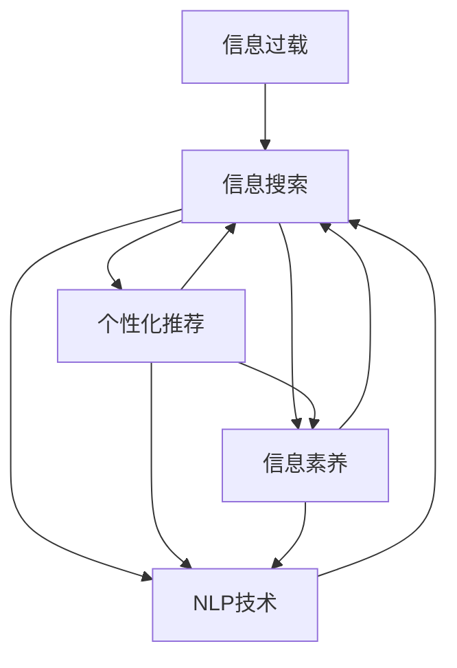

                 

# 信息过载与信息搜索策略：在庞大的信息海洋中找到有价值的信息

## 1. 背景介绍

在数字化时代，信息的爆炸式增长已经成为一个显著的社会现象。海量的数据和信息涌入我们的日常生活，带来了前所未有的便利，同时也带来了一系列问题。信息过载(Information Overload)成为了现代社会的典型痛点，人们很难从中快速找到有价值的内容，浪费了宝贵的时间和精力。针对这一问题，信息搜索技术应运而生，旨在帮助用户在海量信息中找到感兴趣、有价值的答案。

### 1.1 问题由来

互联网的快速发展，尤其是移动互联网和社交网络的普及，使得信息量呈指数级增长。无论是新闻、博客、论坛还是视频平台，每天都在产生数以亿计的内容。海量的信息一方面极大地丰富了我们的知识储备，另一方面也造成了用户在选择信息时的困难，甚至产生了困惑和焦虑。信息过载不仅仅是技术问题，更是社会问题，它影响了人们的学习、工作和生活的方方面面。

### 1.2 问题核心关键点

信息过载的核心问题在于，信息量的大幅增加远远超出了人们处理和利用的能力。如何高效地搜索和筛选信息，成为用户和开发者亟需解决的难题。

为了解决信息过载问题，研究者们提出了许多有针对性的策略和方法。这些方法大致可以分为两类：一类是提升信息搜索技术本身，如改进搜索算法、优化搜索结果、增强个性化推荐；另一类是通过教育、工具等手段，提升用户的信息素养和搜索技能。

## 2. 核心概念与联系

### 2.1 核心概念概述

为了更好地理解如何处理信息过载问题，本文将介绍几个核心概念及其联系：

- **信息过载(Information Overload)**：指信息量过大，用户难以有效处理，甚至会产生困惑和焦虑的现象。
- **信息搜索(Information Retrieval, IR)**：指通过特定的算法和工具，从大量信息中提取出用户感兴趣的内容的过程。
- **个性化推荐(Personalized Recommendation)**：指根据用户的历史行为和兴趣，推荐个性化内容的技术。
- **信息素养(Information Literacy)**：指用户获取、评估、利用信息的能力，包括信息意识、信息技能和信息伦理。
- **自然语言处理(Natural Language Processing, NLP)**：指通过计算机处理和理解人类语言的技术，广泛应用于信息搜索和推荐系统。

这些概念之间存在密切联系。信息过载问题是信息搜索技术存在的主要原因，而个性化推荐则是提升信息搜索效率的重要手段。信息素养对于用户来说至关重要，有助于提升搜索效果和信息利用率。而自然语言处理技术则为信息搜索和推荐系统提供了强大的语言理解和处理能力。

### 2.2 核心概念原理和架构的 Mermaid 流程图



这个流程图展示了信息过载、信息搜索、个性化推荐、信息素养和NLP技术之间的关系：

1. 信息过载推动了信息搜索技术的发展。
2. 个性化推荐提升了信息搜索的效率和效果。
3. 信息素养是用户有效使用信息搜索技术的基础。
4. NLP技术为信息搜索和推荐系统提供了核心能力。
5. 这些技术和素养共同作用，帮助用户在海量信息中获取有价值的内容。

## 3. 核心算法原理 & 具体操作步骤

### 3.1 算法原理概述

信息搜索技术的目标是帮助用户在大量的信息中找到最相关的答案。其核心在于两个方面：一是如何高效地组织信息，二是如何准确地匹配用户需求。

信息组织方面，通常采用索引技术，将信息转化为可搜索的形式，如倒排索引、元数据索引等。匹配用户需求方面，主要依赖于搜索引擎算法，如TF-IDF、BM25、SimHash等。

### 3.2 算法步骤详解

信息搜索的主要步骤如下：

**Step 1: 索引构建**
- 收集和预处理数据，提取关键信息，如标题、摘要、标签等。
- 通过自然语言处理技术，将文本转化为向量表示。
- 构建倒排索引或元数据索引，以便快速检索相关内容。

**Step 2: 查询处理**
- 用户输入查询关键词，发送到搜索引擎。
- 搜索引擎解析查询，进行分词、词性标注等处理。
- 根据查询关键词和索引数据，匹配相关内容。

**Step 3: 结果排序**
- 对匹配到的内容进行排序，通常使用TF-IDF、BM25等算法。
- 考虑内容的相关性、权威性、更新时间等因素，进行加权排序。

**Step 4: 结果展示**
- 将排序后的结果展示给用户，包括标题、摘要、URL等。
- 用户可以查看搜索结果，进一步筛选和阅读相关内容。

### 3.3 算法优缺点

信息搜索技术的主要优点包括：

1. **高效检索**：能够快速从海量信息中检索出相关内容，节省用户时间。
2. **个性化推荐**：通过个性化算法，提供符合用户兴趣和需求的结果，提升用户体验。
3. **用户友好**：界面简洁，操作方便，易于学习和使用。

然而，该技术也存在一些局限：

1. **结果质量**：依赖于数据质量和算法设计，低质量的数据和算法可能导致误导性结果。
2. **算法复杂性**：优化算法和索引构建可能涉及复杂的数学和工程问题。
3. **维护成本**：需要定期更新索引，维护服务器等，成本较高。
4. **隐私问题**：搜索结果中可能包含用户个人信息，存在隐私风险。

### 3.4 算法应用领域

信息搜索技术广泛应用于各类在线服务中，如搜索引擎、推荐系统、社交媒体等。例如：

- **搜索引擎**：如Google、Bing等，通过文本检索技术，快速获取网页信息。
- **推荐系统**：如Amazon、Netflix等，根据用户行为推荐商品和内容。
- **社交媒体**：如Twitter、Facebook等，通过用户交互数据，推送个性化内容。
- **新闻网站**：如CNN、BBC等，通过新闻分类和检索技术，提供及时的信息。

## 4. 数学模型和公式 & 详细讲解

### 4.1 数学模型构建

信息搜索的核心数学模型是倒排索引和向量空间模型。倒排索引用于组织数据，而向量空间模型用于计算查询与内容的匹配度。

### 4.2 公式推导过程

假设有一个倒排索引，其中每个文档对应一个逆向索引，包含所有包含该词的文档列表。如果查询关键词为$q$，其对应的逆向索引为$I_q$，则匹配的文档集合为$D_q=I_q \cap D$，其中$D$为整个文档集合。

对于向量空间模型，假设查询$q$和文档$d$的词向量表示分别为$v_q$和$v_d$，则查询与文档的匹配度$score(d)$可以表示为：

$$
score(d) = \text{similarity}(v_q, v_d)
$$

其中$\text{similarity}$为查询向量与文档向量的相似度函数，如余弦相似度：

$$
\text{similarity}(v_q, v_d) = \frac{v_q \cdot v_d}{\|v_q\| \cdot \|v_d\|}
$$

### 4.3 案例分析与讲解

以Google搜索为例，Google采用PageRank算法和向量空间模型结合的方式进行信息搜索。用户输入查询后，Google首先使用PageRank算法计算网页的重要性，然后使用TF-IDF向量空间模型计算查询与网页的匹配度。最终，根据匹配度和重要性，将结果排序展示给用户。

## 5. 项目实践：代码实例和详细解释说明

### 5.1 开发环境搭建

要进行信息搜索系统的开发，首先需要搭建好开发环境。以下是Python+ElasticSearch的开发环境配置流程：

1. 安装Python：
```bash
conda create -n ir-env python=3.8 
conda activate ir-env
```

2. 安装ElasticSearch：
```bash
sudo apt-get update
sudo apt-get install elasticsearch
```

3. 安装Flask：
```bash
pip install flask
```

4. 安装Flask-RESTful：
```bash
pip install flask-restful
```

完成上述步骤后，即可在`ir-env`环境中开始信息搜索系统的开发。

### 5.2 源代码详细实现

下面以ElasticSearch为基础，给出一个简单的信息搜索系统代码实现。

首先，创建一个Flask应用：

```python
from flask import Flask, request, jsonify
from flask_restful import Resource, Api
import requests

app = Flask(__name__)
api = Api(app)

@app.route('/')
def index():
    return 'Welcome to the Information Retrieval API!'

class Document(Resource):
    def get(self, id):
        url = f'http://localhost:9200/documents/{id}'
        response = requests.get(url)
        return jsonify(response.json()), 200

class Search(Resource):
    def get(self):
        query = request.args.get('query')
        url = f'http://localhost:9200/search?q={query}'
        response = requests.get(url)
        return jsonify(response.json()), 200

api.add_resource(Document, '/documents/<id>')
api.add_resource(Search, '/search')

if __name__ == '__main__':
    app.run(debug=True, port=5000)
```

然后，编写ElasticSearch的索引和查询逻辑：

```python
from elasticsearch import Elasticsearch

es = Elasticsearch()

def create_index():
    es.indices.create(index='documents', ignore=400)

def index_document(doc):
    es.index(index='documents', body=doc)

def search_documents(query):
    res = es.search(index='documents', body={'query': {'match': {'content': query}}})
    return res['hits']['hits']

create_index()
doc1 = {'content': 'This is a sample document.'}
index_document(doc1)
doc2 = {'content': 'Another sample document.'}
index_document(doc2)
query = 'sample'
results = search_documents(query)
for result in results:
    print(result['_source'])
```

最后，测试ElasticSearch的索引和搜索功能：

```python
from elasticsearch import Elasticsearch

es = Elasticsearch()

def create_index():
    es.indices.create(index='documents', ignore=400)

def index_document(doc):
    es.index(index='documents', body=doc)

def search_documents(query):
    res = es.search(index='documents', body={'query': {'match': {'content': query}}})
    return res['hits']['hits']

create_index()
doc1 = {'content': 'This is a sample document.'}
index_document(doc1)
doc2 = {'content': 'Another sample document.'}
index_document(doc2)
query = 'sample'
results = search_documents(query)
for result in results:
    print(result['_source'])
```

### 5.3 代码解读与分析

让我们再详细解读一下关键代码的实现细节：

**Flask应用**：
- 使用Flask框架，定义一个简单的API接口。
- 定义两个资源：Document和Search，分别用于获取单个文档和搜索文档。
- 启动Flask应用，监听5000端口。

**ElasticSearch索引和查询**：
- 使用ElasticSearch库，连接到本地ElasticSearch服务。
- 定义三个函数：create_index创建索引，index_document索引文档，search_documents搜索文档。
- 创建索引，索引两个文档，最后进行搜索并打印结果。

可以看到，利用Python和ElasticSearch，我们可以轻松地搭建起一个信息搜索系统。开发者可以根据具体需求，进行更高级的功能开发，如查询扩展、结果排序、个性化推荐等。

## 6. 实际应用场景

### 6.1 智能问答系统

智能问答系统是信息搜索技术的一个重要应用场景。传统问答系统依赖于预定义的知识库和规则，难以处理复杂的自然语言输入。而基于信息搜索的问答系统，能够动态地从互联网中获取知识，回答用户的问题。

在技术实现上，可以构建一个索引数据库，包含各类知识点的文档。用户输入问题后，系统使用搜索引擎算法检索相关的知识点文档，并结合自然语言处理技术，解析问题的意图和上下文，最终提供合理的回答。

### 6.2 电商平台推荐系统

电商平台推荐系统是信息搜索技术的另一个典型应用。通过分析用户的历史浏览和购买记录，推荐系统可以推荐用户可能感兴趣的商品。

在技术实现上，可以使用向量空间模型，将用户行为转化为向量，与商品特征向量进行匹配。通过TF-IDF、BM25等算法，计算匹配度和推荐分数，最终返回推荐的商品列表。

### 6.3 学术文献检索系统

学术文献检索系统需要高效地从海量的学术论文中检索出相关文献。使用信息搜索技术，可以构建索引数据库，包含各类论文的摘要和关键词。用户输入查询后，系统使用搜索引擎算法检索相关论文，并提供摘要和引用信息。

### 6.4 未来应用展望

随着信息搜索技术的不断发展，其在更多领域将得到应用，为各行各业带来变革性影响。

在智慧城市管理中，信息搜索技术可以用于智能交通、公共安全、城市规划等方面，提供实时数据分析和决策支持。

在医疗健康领域，信息搜索技术可以帮助医生快速检索最新的医学文献和研究成果，提升诊疗水平。

在金融领域，信息搜索技术可以用于市场分析、风险评估、投资决策等方面，提高金融机构的竞争力。

此外，在教育、娱乐、安全等多个领域，信息搜索技术也将不断拓展，为人类认知智能的进化带来新的机遇。相信随着技术的日益成熟，信息搜索方法将成为信息时代不可或缺的工具，助力构建智慧社会。

## 7. 工具和资源推荐

### 7.1 学习资源推荐

为了帮助开发者掌握信息搜索技术，这里推荐一些优质的学习资源：

1. 《Introduction to Information Retrieval》教材：介绍了信息检索的基础理论和算法，适合入门学习。
2. CSIRLS《Information Retrieval》课程：斯坦福大学开设的课程，涵盖了信息检索的核心概念和应用。
3. Kaggle竞赛：Kaggle上定期举办的信息检索竞赛，通过实践提高搜索技能。
4. arXiv预印本：最新研究论文的发布平台，可以快速了解信息搜索领域的最新进展。
5. GitHub开源项目：如ElasticSearch、TensorFlow等，提供了丰富的信息搜索和推荐系统实现。

通过对这些资源的学习实践，相信你一定能够快速掌握信息搜索技术的精髓，并用于解决实际的搜索问题。

### 7.2 开发工具推荐

高效的信息搜索系统开发离不开优秀的工具支持。以下是几款常用的工具：

1. Python：Python语言简洁易用，适用于数据处理和算法实现。
2. Elasticsearch：ElasticSearch提供了强大的搜索引擎功能，易于集成和使用。
3. TensorFlow：TensorFlow支持复杂的深度学习模型，适用于高质量的推荐系统开发。
4. Apache Spark：Spark提供了大数据处理能力，可以用于大规模数据索引和查询。
5. Apache Solr：Solr是一个开源搜索引擎，提供了强大的索引和查询功能。

合理利用这些工具，可以显著提升信息搜索系统的开发效率，加快创新迭代的步伐。

### 7.3 相关论文推荐

信息搜索技术的发展离不开学界的持续研究。以下是几篇奠基性的相关论文，推荐阅读：

1. SMIR: Systematic Modeling of Information Retrieval：介绍了信息检索系统的建模方法和评估指标，是信息检索领域的经典论文。
2. BM25: A Statistical Approach to IR Vector Space Model：提出了BM25算法，用于改进文本匹配度计算。
3. PageRank: An Algorithm for Web Ranking：提出了PageRank算法，用于网页重要性计算。
4. Information Retrieval Algorithms and Applications：介绍了各类信息检索算法，如倒排索引、向量空间模型等。
5. Deep Learning for Natural Language Processing：介绍了深度学习在自然语言处理中的应用，包括信息检索和推荐系统。

这些论文代表了大规模信息检索技术的发展脉络。通过学习这些前沿成果，可以帮助研究者把握学科前进方向，激发更多的创新灵感。

## 8. 总结：未来发展趋势与挑战

### 8.1 总结

本文对信息搜索技术进行了全面系统的介绍。首先阐述了信息过载问题的背景和核心点，明确了信息搜索技术的重要性。其次，从原理到实践，详细讲解了信息搜索的数学模型和核心算法，给出了信息搜索系统的代码实现。同时，本文还广泛探讨了信息搜索技术在智能问答、电商平台、学术文献检索等场景中的应用，展示了其广阔的应用前景。此外，本文精选了信息搜索技术的学习资源、开发工具和相关论文，力求为读者提供全方位的技术指引。

通过本文的系统梳理，可以看到，信息搜索技术在解决信息过载问题中扮演了重要角色，极大地提升了信息检索的效率和效果。未来，伴随技术的不断演进和应用场景的拓展，信息搜索技术必将在更多领域发挥更大价值，成为现代社会不可或缺的基础技术。

### 8.2 未来发展趋势

展望未来，信息搜索技术将呈现以下几个发展趋势：

1. **实时搜索**：随着大数据和云计算技术的发展，实时搜索和分析将成为可能，用户可以即时获取最新的信息。
2. **多模态搜索**：未来的搜索技术将融合文本、图像、视频等多种模态的信息，提供更全面的搜索结果。
3. **个性化推荐**：通过深度学习和强化学习技术，实现更加精准的个性化推荐，提升用户体验。
4. **语义搜索**：引入自然语言理解和推理技术，理解查询意图和上下文，提供更准确的搜索结果。
5. **跨平台集成**：未来的搜索系统将跨多个平台和设备，实现无缝的用户体验。

这些趋势凸显了信息搜索技术的发展潜力和应用前景。随着技术的日益成熟，信息搜索技术将在更多场景中发挥重要作用，成为构建智能社会的基础设施。

### 8.3 面临的挑战

尽管信息搜索技术已经取得了显著进展，但在迈向更智能、更普适应用的过程中，它仍面临诸多挑战：

1. **数据质量**：搜索系统的性能很大程度上依赖于数据质量。数据量不足、标注错误等问题，会导致搜索结果不准确。
2. **算法复杂性**：优化算法和索引构建可能涉及复杂的数学和工程问题，需要高效的计算资源和算法。
3. **隐私保护**：搜索结果中可能包含用户个人信息，存在隐私泄露的风险。如何保护用户隐私，是一个重要的挑战。
4. **计算成本**：大规模数据索引和实时搜索需要高性能的计算资源，成本较高。如何降低计算成本，是实际应用中需要考虑的问题。
5. **普适性不足**：现有搜索系统往往依赖于特定领域的知识库和规则，难以推广到更多领域。如何提高搜索系统的普适性，是未来研究的重要方向。

### 8.4 研究展望

面对信息搜索技术所面临的挑战，未来的研究需要在以下几个方面寻求新的突破：

1. **提升数据质量**：通过自动化标注、数据清洗等手段，提升数据质量。
2. **简化算法模型**：开发更加简洁高效的算法模型，减少计算资源消耗。
3. **强化隐私保护**：引入隐私保护技术，如差分隐私、同态加密等，保护用户隐私。
4. **降低计算成本**：采用分布式计算、压缩存储等技术，降低搜索系统的计算成本。
5. **增强普适性**：构建跨领域的通用知识库和规则，提升搜索系统的普适性。

这些研究方向将为信息搜索技术的发展提供新的思路和突破口。只有在数据、算法、隐私、计算等方面进行全面优化，才能实现信息搜索技术的全面普及和应用。

## 9. 附录：常见问题与解答

**Q1：信息搜索技术是否适用于所有领域？**

A: 信息搜索技术在大多数领域都能取得不错的效果，特别是对于数据量较大的领域。但对于一些特定领域，如医疗、法律等，仅仅依靠通用语料索引的模型可能难以很好地适应。此时需要在特定领域语料上进一步索引，再进行搜索，才能获得理想效果。

**Q2：如何提升信息搜索系统的性能？**

A: 提升信息搜索系统性能的关键在于优化算法和索引构建。以下是一些提升搜索系统性能的策略：
1. 优化查询解析器，准确理解用户意图。
2. 引入先进的数据压缩和索引技术，提高数据处理效率。
3. 使用深度学习模型，提升搜索系统的智能化程度。
4. 引入推荐算法，提供更精准的搜索结果。
5. 采用分布式计算，提高搜索系统的处理能力。

**Q3：信息搜索技术在落地部署时需要注意哪些问题？**

A: 将信息搜索技术转化为实际应用，还需要考虑以下问题：
1. 索引构建和维护：定期更新索引，确保数据的时效性和相关性。
2. 计算资源管理：合理分配计算资源，平衡搜索速度和成本。
3. 用户隐私保护：采取隐私保护措施，确保用户数据的安全。
4. 系统监控和告警：实时监控系统状态，设置异常告警机制，确保系统稳定。
5. 接口设计：设计简单易用的接口，方便用户使用。

信息搜索技术的发展离不开工程实践的不断打磨。只有在数据、算法、工程、业务等多个维度进行全面优化，才能实现搜索系统的全面落地和应用。总之，信息搜索技术需要在数据质量、算法优化、隐私保护、计算成本等方面进行持续创新，方能真正实现其价值。

---

作者：禅与计算机程序设计艺术 / Zen and the Art of Computer Programming

