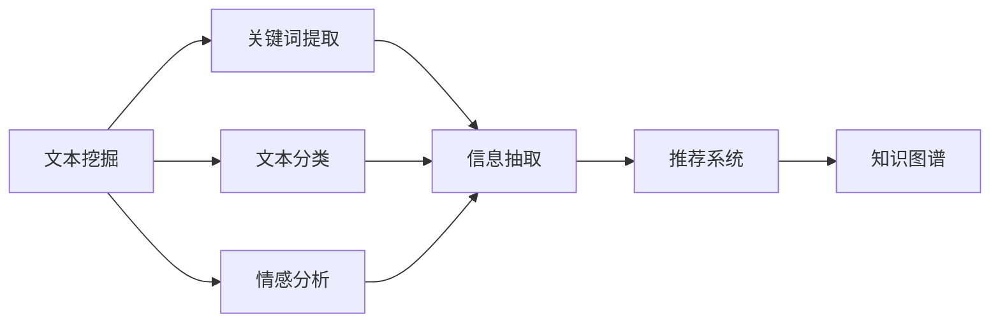

                 

## 1. 背景介绍

### 1.1 问题由来

在信息爆炸的时代，互联网、社交媒体、新闻订阅等各种渠道的海量信息源源不断。人们每天接收的信息量急剧增加，然而，并非所有信息都有价值。信息过载导致人们难以分辨有价值的内容，增加了信息筛选的难度，也引发了信息获取效率低下、决策困难等问题。信息筛选技术的出现，旨在帮助用户在海量信息中快速找到有价值的信息，从而提升信息获取和决策的效率。

### 1.2 问题核心关键点

当前，信息筛选技术已成为互联网信息服务的重要组成部分。其核心在于如何从海量信息中自动识别并提取有价值的内容，通过算法、模型或工具进行高效筛选和呈现。关键技术点包括：

- 文本挖掘：通过自然语言处理（NLP）技术，从文本中提取关键词、主题、情感等信息。
- 推荐系统：利用机器学习算法，根据用户的历史行为数据，推荐可能感兴趣的信息。
- 知识图谱：构建实体和关系的网络结构，提供实体间的关联信息。
- 信息抽取：从非结构化数据中提取结构化信息，如实体、属性、关系等。

这些核心技术相互融合，形成了完整的信息筛选框架。通过信息筛选，人们能够更快、更精准地获取到自己需要的信息，提升工作效率和生活质量。

## 2. 核心概念与联系

### 2.1 核心概念概述

为更好地理解信息筛选技术的原理和应用，本节将介绍几个关键概念及其相互关系：

- 文本挖掘(Text Mining)：从文本数据中自动提取和分析有价值的信息，包括关键词提取、文本分类、情感分析等。
- 推荐系统(Recommender System)：基于用户行为数据，利用机器学习算法推荐可能感兴趣的信息。
- 知识图谱(Knowledge Graph)：利用图结构表示实体和属性之间的关系，支持信息检索和推理。
- 信息抽取(Information Extraction)：从非结构化数据中提取结构化信息，形成结构化数据库。

这些核心概念共同构成了信息筛选技术的理论基础，通过信息挖掘和处理，为用户提供更加精准、高效的信息获取体验。

### 2.2 核心概念原理和架构的 Mermaid 流程图



这个流程图展示了信息筛选技术的主要流程：从文本挖掘开始，经过关键词提取、文本分类、情感分析等多个环节，最终形成结构化信息，输入推荐系统和知识图谱，进行更深入的筛选和关联，最后呈现给用户。

## 3. 核心算法原理 & 具体操作步骤
### 3.1 算法原理概述

信息筛选技术的核心算法原理主要基于自然语言处理和机器学习的技术，通过从文本数据中提取有价值的信息，并进行高效处理和关联，以提供精准的信息推荐和检索服务。

具体来说，信息筛选过程通常包括以下几个步骤：

1. **文本预处理**：去除噪音、分词、词性标注、命名实体识别等。
2. **特征提取**：从文本中提取关键词、主题、情感等信息。
3. **信息抽取**：从非结构化数据中抽取结构化信息。
4. **信息检索**：根据用户查询，从信息库中检索相关内容。
5. **信息推荐**：利用机器学习算法，根据用户行为数据，推荐可能感兴趣的信息。

通过这些步骤，信息筛选技术能够自动化的完成信息的识别和关联，提升信息获取的效率和准确性。

### 3.2 算法步骤详解

以一个简单的推荐系统为例，详细阐述信息筛选技术的具体操作步骤：

**Step 1: 数据收集和预处理**
- 收集用户的历史行为数据，如浏览记录、购买记录等。
- 对收集到的数据进行清洗和预处理，去除无效或噪音数据。

**Step 2: 特征提取**
- 利用自然语言处理技术，对用户的评论、文章等文本数据进行分词、词性标注、命名实体识别等。
- 提取关键词、主题、情感等信息，形成特征向量。

**Step 3: 信息抽取**
- 利用信息抽取技术，从非结构化数据中抽取结构化信息，如实体、属性、关系等。
- 将抽取的信息与用户行为数据进行关联，形成用户画像。

**Step 4: 信息检索**
- 根据用户查询，构建查询向量。
- 将查询向量与信息库中的所有文档向量进行相似度计算。
- 选取相似度最高的文档，推荐给用户。

**Step 5: 信息推荐**
- 利用机器学习算法（如协同过滤、深度学习等），根据用户行为数据和用户画像，推荐可能感兴趣的信息。
- 根据推荐结果，进行反馈收集和调整，优化推荐模型。

### 3.3 算法优缺点

信息筛选技术在提升信息获取效率和精准性方面具有显著优势：

**优点**：
- 自动化处理：能够自动完成信息提取、处理和关联，减少了人工操作的时间和成本。
- 精准推荐：利用机器学习算法，根据用户行为数据，推荐可能感兴趣的信息。
- 跨领域应用：适用于各种信息服务领域，如新闻推荐、商品推荐、知识图谱等。

**缺点**：
- 数据依赖：信息筛选效果很大程度上依赖于数据质量，高质量数据的获取成本较高。
- 算法复杂：推荐算法和信息抽取技术的复杂度较高，需要大量的计算资源。
- 隐私问题：用户行为数据的收集和分析可能涉及隐私问题，需要严格的数据保护措施。

尽管存在这些局限性，信息筛选技术仍是大数据时代不可或缺的重要工具，帮助人们在信息洪流中快速找到有价值的信息。

### 3.4 算法应用领域

信息筛选技术已经被广泛应用于各种信息服务领域，例如：

- **新闻推荐系统**：根据用户阅读历史和兴趣，推荐可能感兴趣的新闻。
- **商品推荐系统**：根据用户购物历史和浏览记录，推荐可能感兴趣的商品。
- **知识图谱构建**：构建实体和关系的网络结构，支持信息检索和推理。
- **舆情监测系统**：从社交媒体等数据源中提取关键信息，监测舆情动态。
- **智能客服系统**：根据用户历史对话，推荐可能相关的问题和答案。

这些应用展示了信息筛选技术的广泛适用性，无论是在电商、新闻、知识服务还是社交媒体领域，信息筛选技术都提供了强有力的支持。

## 4. 数学模型和公式 & 详细讲解 & 举例说明

### 4.1 数学模型构建

信息筛选技术的数学模型通常包括：

- **文本分类**：通过训练一个分类器，将文本分为不同类别。数学模型为：
  $$
  p(y_i|x_i) = \frac{exp(x_i^Tw_i)}{\sum_j exp(x_j^Tw_i)}
  $$
  其中 $x_i$ 为输入文本向量，$y_i$ 为分类标签，$w_i$ 为分类器参数。

- **信息抽取**：通过构建抽取模型，从非结构化数据中提取实体、属性等信息。数学模型为：
  $$
  p(y_i|x_i) = \frac{exp(z_i^T\theta)}{\sum_j exp(z_j^T\theta)}
  $$
  其中 $z_i$ 为抽取模型的特征向量，$\theta$ 为抽取模型的参数。

- **相似度计算**：通过计算查询向量与文档向量的相似度，推荐相关文档。数学模型为：
  $$
  \cos(\theta) = \frac{\vec{u} \cdot \vec{v}}{||\vec{u}|| \times ||\vec{v}||}
  $$
  其中 $\vec{u}$ 为查询向量，$\vec{v}$ 为文档向量，$\cos(\theta)$ 为相似度。

### 4.2 公式推导过程

以下分别对文本分类和信息抽取的数学模型进行推导：

**文本分类模型推导**：
设训练集为 $\{(x_i,y_i)\}_{i=1}^N$，其中 $x_i$ 为文本向量，$y_i$ 为分类标签。定义分类器参数为 $w_i$，则分类器为：
  $$
  p(y_i|x_i) = \frac{exp(x_i^Tw_i)}{\sum_j exp(x_j^Tw_i)}
  $$
  通过最大化似然函数，求得最优参数 $w_i$：
  $$
  \max_{w_i} \sum_{i=1}^N \log p(y_i|x_i)
  $$
  即：
  $$
  \max_{w_i} \sum_{i=1}^N \log \frac{exp(x_i^Tw_i)}{\sum_j exp(x_j^Tw_i)}
  $$
  通过对数展开，得到：
  $$
  \max_{w_i} \sum_{i=1}^N (x_i^Tw_i - \log(\sum_j exp(x_j^Tw_i)))
  $$
  利用梯度下降等优化算法，求得最优 $w_i$。

**信息抽取模型推导**：
设抽取任务为从文本中抽取实体，定义抽取模型为：
  $$
  p(y_i|x_i) = \frac{exp(z_i^T\theta)}{\sum_j exp(z_j^T\theta)}
  $$
  其中 $z_i$ 为抽取模型的特征向量，$\theta$ 为抽取模型的参数。
  通过对数展开，得到：
  $$
  \max_{z_i,\theta} \sum_{i=1}^N (z_i^T\theta - \log(\sum_j exp(z_j^T\theta)))
  $$
  利用梯度下降等优化算法，求得最优 $z_i$ 和 $\theta$。

### 4.3 案例分析与讲解

以一个简单的文本分类模型为例，进行具体分析：

假设训练集为 $\{(x_i,y_i)\}_{i=1}^N$，其中 $x_i$ 为文本向量，$y_i$ 为分类标签。定义分类器参数为 $w_i$，则分类器为：
  $$
  p(y_i|x_i) = \frac{exp(x_i^Tw_i)}{\sum_j exp(x_j^Tw_i)}
  $$
  通过最大化似然函数，求得最优参数 $w_i$：
  $$
  \max_{w_i} \sum_{i=1}^N \log p(y_i|x_i)
  $$
  即：
  $$
  \max_{w_i} \sum_{i=1}^N (x_i^Tw_i - \log(\sum_j exp(x_j^Tw_i)))
  $$
  通过对数展开，得到：
  $$
  \max_{w_i} \sum_{i=1}^N (x_i^Tw_i - \log(\sum_j exp(x_j^Tw_i)))
  $$
  利用梯度下降等优化算法，求得最优 $w_i$。

在实际应用中，通过对输入文本进行向量化处理，可以将其转换为向量形式，然后进行分类器计算。例如，假设有一个二分类任务，可以使用朴素贝叶斯分类器，其向量表示形式为：
  $$
  x_i = [w_1, w_2, ..., w_n]
  $$
  分类器计算公式为：
  $$
  p(y_i|x_i) = \frac{exp(x_i^Tw_i)}{\sum_j exp(x_j^Tw_i)}
  $$
  通过对数展开，得到：
  $$
  \max_{w_i} \sum_{i=1}^N (x_i^Tw_i - \log(\sum_j exp(x_j^Tw_i)))
  $$
  利用梯度下降等优化算法，求得最优 $w_i$。

## 5. 项目实践：代码实例和详细解释说明

### 5.1 开发环境搭建

在进行信息筛选技术项目实践前，我们需要准备好开发环境。以下是使用Python进行Scikit-learn开发的环境配置流程：

1. 安装Anaconda：从官网下载并安装Anaconda，用于创建独立的Python环境。

2. 创建并激活虚拟环境：
```bash
conda create -n sklearn-env python=3.8 
conda activate sklearn-env
```

3. 安装Scikit-learn：从官网获取对应的安装命令。例如：
```bash
conda install scikit-learn
```

4. 安装各类工具包：
```bash
pip install numpy pandas scikit-learn matplotlib tqdm jupyter notebook ipython
```

完成上述步骤后，即可在`sklearn-env`环境中开始信息筛选技术的项目实践。

### 5.2 源代码详细实现

这里我们以文本分类任务为例，给出使用Scikit-learn进行文本分类的PyTorch代码实现。

首先，定义文本分类任务的模型：

```python
from sklearn.feature_extraction.text import TfidfVectorizer
from sklearn.naive_bayes import MultinomialNB
from sklearn.pipeline import Pipeline

# 定义文本分类模型
text_clf = Pipeline([('tfidf', TfidfVectorizer()),
                     ('clf', MultinomialNB())])
```

然后，准备数据集并训练模型：

```python
from sklearn.datasets import fetch_20newsgroups
from sklearn.model_selection import train_test_split

# 加载20newsgroups数据集
newsgroups_data = fetch_20newsgroups(subset='train')
# 提取特征和标签
X_train, y_train = newsgroups_data.data, newsgroups_data.target

# 使用train_test_split分割训练集和测试集
X_train, X_test, y_train, y_test = train_test_split(X_train, y_train, test_size=0.2)

# 训练模型
text_clf.fit(X_train, y_train)
```

最后，在测试集上评估模型：

```python
from sklearn.metrics import accuracy_score, precision_score, recall_score, f1_score

# 预测测试集标签
y_pred = text_clf.predict(X_test)

# 计算分类指标
accuracy = accuracy_score(y_test, y_pred)
precision = precision_score(y_test, y_pred, average='macro')
recall = recall_score(y_test, y_pred, average='macro')
f1 = f1_score(y_test, y_pred, average='macro')

# 打印结果
print('Accuracy:', accuracy)
print('Precision:', precision)
print('Recall:', recall)
print('F1-Score:', f1)
```

以上就是使用Scikit-learn进行文本分类的完整代码实现。可以看到，利用Scikit-learn的Pipeline和模块化设计，我们可以用相对简洁的代码完成文本分类任务。

### 5.3 代码解读与分析

让我们再详细解读一下关键代码的实现细节：

**Pipeline模块**：
- 利用Pipeline模块，可以将多个步骤组合成一个流水线，简化代码实现。

**TfidfVectorizer类**：
- TfidfVectorizer类负责将文本数据转换为TF-IDF特征向量，将文本转换为数值形式，方便机器学习算法处理。

**MultinomialNB类**：
- MultinomialNB类为朴素贝叶斯分类器，通过训练数据集，可以预测新文本的分类标签。

**train_test_split函数**：
- train_test_split函数用于将数据集分割成训练集和测试集，方便模型训练和评估。

**模型评估指标**：
- 使用accuracy_score、precision_score、recall_score和f1_score函数，可以计算出模型的准确率、精确率、召回率和F1-Score，综合评估模型的性能。

通过以上代码实现，可以看出，Scikit-learn提供的工具和模块，极大地方便了信息筛选技术的研究和开发，使得开发者能够更加专注于算法和模型的设计和优化。

## 6. 实际应用场景

### 6.1 智能客服系统

基于信息筛选技术，智能客服系统能够快速响应客户咨询，并推荐相关问题的解答。通过文本分类和信息抽取技术，智能客服系统可以自动识别客户的问题类型，并从知识库中检索相应的答案。

在技术实现上，可以收集历史客服对话记录，利用文本分类技术将问题分为不同类别，并抽取相关实体和属性，构建知识图谱。在用户咨询时，系统根据输入的文本进行分类和实体抽取，从而匹配到最相关的答案。如果知识库中缺少相关答案，还可以动态生成答案，如通过模型生成对话内容，从而提升客户服务体验。

### 6.2 金融舆情监测

金融舆情监测需要实时监测市场舆论动向，以避免负面信息传播和金融风险。通过信息筛选技术，可以从社交媒体等数据源中提取关键信息，监测舆情动态，及时预警潜在的金融风险。

具体实现上，可以收集金融领域相关的新闻、报道、评论等文本数据，利用信息抽取技术提取实体和关系，构建知识图谱。根据用户设定的舆情关键词，系统可以实时监测舆情变化，识别出舆情动态，并生成舆情报告，帮助金融机构及时应对风险。

### 6.3 个性化推荐系统

个性化推荐系统能够根据用户的历史行为数据，推荐可能感兴趣的内容。通过信息抽取和推荐系统，能够为用户提供更加精准、多样化的推荐结果。

在实际应用中，可以收集用户浏览、点击、评论、分享等行为数据，利用信息抽取技术提取特征，构建用户画像。利用推荐系统算法，根据用户画像和历史行为数据，推荐可能感兴趣的内容。通过不断优化推荐模型，可以实现更加精准的推荐效果。

### 6.4 未来应用展望

随着信息筛选技术的不断发展，其在更多领域的应用前景将更加广阔：

1. **智能医疗**：基于病历、报告等文本数据，利用信息抽取技术提取关键信息，构建知识图谱，辅助医生诊疗和决策。
2. **智能教育**：从学生作业、考试等数据中提取特征，利用推荐系统，提供个性化的学习内容和建议。
3. **智慧城市**：从社交媒体、传感器等数据中提取关键信息，监测城市事件和舆情，提升城市管理效率。
4. **工业制造**：通过文本分类和信息抽取技术，从生产记录、维修记录等数据中提取关键信息，辅助生产管理和维护。
5. **智能交通**：从交通监控、事故记录等数据中提取关键信息，监测交通动态，提升交通管理效率。

## 7. 工具和资源推荐

### 7.1 学习资源推荐

为了帮助开发者系统掌握信息筛选技术的理论基础和实践技巧，这里推荐一些优质的学习资源：

1. 《自然语言处理入门》：经典教材，全面介绍NLP的基础概念和技术，包括文本挖掘、信息抽取等。
2. 《机器学习实战》： hands-on 项目导向的机器学习教程，适合初学者入门。
3. 《深度学习》：深度学习领域的经典教材，介绍了深度神经网络、卷积神经网络等技术。
4. 《Python数据科学手册》：全面介绍Python在数据科学和机器学习中的应用，包括Scikit-learn、TensorFlow等工具。
5. 《TensorFlow实战》： hands-on TensorFlow实践教程，适合TensorFlow新手。
6. Kaggle：全球最大的数据科学竞赛平台，提供了大量真实场景的竞赛数据和解决方案。

通过学习这些资源，相信你一定能够全面掌握信息筛选技术的原理和实践，并用于解决实际的NLP问题。

### 7.2 开发工具推荐

高效的开发离不开优秀的工具支持。以下是几款用于信息筛选技术开发的常用工具：

1. Scikit-learn：基于Python的开源机器学习库，提供了丰富的机器学习算法和数据处理工具。
2. TensorFlow：由Google主导开发的深度学习框架，支持分布式计算和多种硬件设备。
3. PyTorch：由Facebook主导开发的深度学习框架，支持动态计算图和高效优化。
4. Keras：高层API，可以简化深度学习模型的构建和训练。
5. Jupyter Notebook：交互式Python编程环境，适合数据科学和机器学习开发。
6. Pandas：数据处理和分析库，支持大规模数据集的读写和处理。

合理利用这些工具，可以显著提升信息筛选技术的开发效率，加快创新迭代的步伐。

### 7.3 相关论文推荐

信息筛选技术的不断发展得益于学界的持续研究。以下是几篇奠基性的相关论文，推荐阅读：

1. Text Mining: Concepts and Techniques（《文本挖掘：概念与技术》）：全面介绍了文本挖掘的基本概念和技术，适合初学者入门。
2. Pattern Recognition and Machine Learning（《模式识别与机器学习》）：经典教材，介绍了机器学习的基本概念和算法。
3. Information Retrieval（《信息检索》）：介绍了信息检索的基本概念和技术，适合了解信息筛选技术的原理。
4. Deep Learning（《深度学习》）：深度学习领域的经典教材，介绍了深度神经网络、卷积神经网络等技术。
5. Information Extraction（《信息抽取》）：介绍了信息抽取的基本概念和技术，适合了解信息抽取的原理和应用。

这些论文代表了大数据时代信息筛选技术的发展脉络。通过学习这些前沿成果，可以帮助研究者把握学科前进方向，激发更多的创新灵感。

## 8. 总结：未来发展趋势与挑战

### 8.1 总结

本文对信息筛选技术进行了全面系统的介绍。首先阐述了信息过载和信息筛选技术的重要性，明确了信息筛选技术在提升信息获取效率和精准性方面的独特价值。其次，从原理到实践，详细讲解了信息筛选技术的数学模型和算法实现，给出了信息筛选任务开发的完整代码实例。同时，本文还广泛探讨了信息筛选技术在智能客服、金融舆情、个性化推荐等多个领域的应用前景，展示了信息筛选技术的巨大潜力。此外，本文精选了信息筛选技术的各类学习资源，力求为读者提供全方位的技术指引。

通过本文的系统梳理，可以看到，信息筛选技术正在成为大数据时代不可或缺的重要工具，帮助人们在信息洪流中快速找到有价值的信息，提升信息获取和决策的效率。未来，伴随信息抽取技术的不断发展，基于信息筛选技术的更多应用场景将不断涌现，为各行业带来变革性影响。

### 8.2 未来发展趋势

展望未来，信息筛选技术将呈现以下几个发展趋势：

1. **自动化程度提升**：通过机器学习算法，实现更高效的信息抽取和分类，提升自动化程度。
2. **多模态融合**：结合文本、图像、音频等多模态数据，提供更加全面和精准的信息服务。
3. **跨领域应用拓展**：信息筛选技术将拓展到更多领域，如智能医疗、智慧城市、智能交通等。
4. **知识图谱深度学习**：利用深度学习技术，提升知识图谱的构建和应用效果。
5. **推荐系统优化**：通过优化推荐算法和模型，提升个性化推荐的效果。
6. **隐私保护加强**：加强用户数据保护，确保信息抽取和推荐过程中的隐私安全。

这些趋势凸显了信息筛选技术的广泛应用前景，将为各行业带来更全面、高效、可靠的信息服务。

### 8.3 面临的挑战

尽管信息筛选技术已经取得了一定的进展，但在应用过程中仍面临诸多挑战：

1. **数据质量和多样性**：信息筛选技术的效果很大程度上依赖于数据质量和多样性，如何获取高质量、多样化的数据是一个难题。
2. **算法复杂度**：信息筛选算法和模型的复杂度较高，需要大量的计算资源和时间成本。
3. **隐私问题**：用户数据的收集和处理可能涉及隐私问题，需要严格的数据保护措施。
4. **泛化能力不足**：信息筛选技术在特定领域的应用效果可能不理想，泛化能力不足是一个挑战。
5. **模型可解释性**：信息筛选模型的内部机制和决策逻辑往往缺乏可解释性，难以满足高风险领域的需求。

尽管存在这些挑战，信息筛选技术仍是大数据时代不可或缺的重要工具，帮助人们在信息洪流中快速找到有价值的信息，提升信息获取和决策的效率。

### 8.4 研究展望

面对信息筛选技术面临的诸多挑战，未来的研究需要在以下几个方面寻求新的突破：

1. **无监督学习**：探索无监督学习技术，如自监督、半监督学习，以降低对标注数据的依赖。
2. **多模态融合**：研究多模态融合技术，将文本、图像、音频等多种信息源结合起来，提供更加全面和精准的信息服务。
3. **隐私保护**：加强用户数据的隐私保护，设计隐私保护机制，确保用户数据的隐私安全。
4. **知识图谱深度学习**：利用深度学习技术，提升知识图谱的构建和应用效果。
5. **推荐系统优化**：通过优化推荐算法和模型，提升个性化推荐的效果。
6. **模型可解释性**：研究模型可解释性技术，如LIME、SHAP等，提升模型的可解释性和可审计性。

这些研究方向的探索，必将引领信息筛选技术迈向更高的台阶，为各行业带来更全面、高效、可靠的信息服务。面向未来，信息筛选技术还需要与其他人工智能技术进行更深入的融合，如自然语言理解、深度学习、强化学习等，多路径协同发力，共同推动人工智能技术的发展。只有勇于创新、敢于突破，才能不断拓展信息筛选技术的边界，让信息服务更加智能、精准和可靠。

## 9. 附录：常见问题与解答

**Q1：信息筛选技术能否应用于文本挖掘领域？**

A: 信息筛选技术在文本挖掘领域有着广泛的应用。通过文本分类和信息抽取技术，可以从大规模文本数据中自动识别和提取有价值的信息，形成结构化数据，用于文本挖掘任务。例如，可以用于文本分类、情感分析、实体识别等任务，提升文本挖掘的效率和准确性。

**Q2：信息筛选技术在实际应用中面临哪些资源瓶颈？**

A: 信息筛选技术在实际应用中面临以下资源瓶颈：

1. **数据质量**：信息筛选技术的效果很大程度上依赖于数据质量，高质量数据的获取成本较高。
2. **计算资源**：信息抽取和推荐系统算法复杂度较高，需要大量的计算资源和时间成本。
3. **存储空间**：大规模数据集和知识图谱的存储和处理需要大量的存储空间。

为了缓解这些瓶颈，可以采用数据清洗和预处理、分布式计算、模型压缩等技术手段。

**Q3：如何提高信息筛选技术的泛化能力？**

A: 提高信息筛选技术的泛化能力，可以通过以下方法：

1. **多任务学习**：利用多任务学习技术，将多个相关任务联合训练，提升模型的泛化能力。
2. **迁移学习**：通过迁移学习技术，将一个领域的知识迁移到另一个领域，提升模型的泛化能力。
3. **领域自适应**：利用领域自适应技术，将模型应用于不同的数据分布，提升泛化能力。
4. **模型集成**：通过模型集成技术，将多个模型的输出进行加权平均或投票，提升模型的泛化能力。
5. **数据增强**：利用数据增强技术，扩充训练集的多样性，提升模型的泛化能力。

这些方法可以帮助提升信息筛选技术的泛化能力，使其在更多领域和任务上取得更好的效果。

通过以上介绍和分析，相信你一定能够全面理解信息筛选技术的原理和应用，并用于解决实际的NLP问题。在未来的研究和实践中，通过不断的探索和创新，信息筛选技术必将进一步提升信息获取和决策的效率，为人类的生产和生活带来深远的影响。

---

作者：禅与计算机程序设计艺术 / Zen and the Art of Computer Programming

