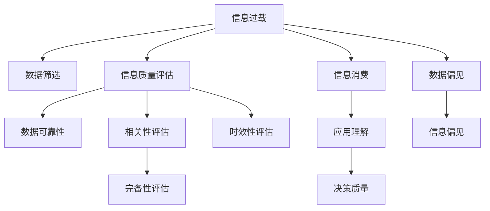

                 

# 信息过载与信息质量评估策略：批判性地评估和消费信息

> 关键词：信息过载, 信息质量评估, 信息消费, 数据筛选, 数据可靠性, 数据偏见

## 1. 背景介绍

### 1.1 问题由来

在当今数字化时代，信息的洪流以近乎实时的方式涌向我们，带来前所未有的信息过载问题。信息过载指的是人们接收的信息量超过其处理能力，从而影响决策和行为的状况。特别是在社交媒体、电子邮件、在线新闻等平台中，信息的数量和种类不断激增，如何有效管理和利用这些信息成为越来越大的挑战。

### 1.2 问题核心关键点

信息过载和信息质量评估与消费者行为密切相关。人们如何评估和消费信息，如何筛选和识别高质量、可靠的信息，以及如何避免信息偏见和误导，都是亟需解决的问题。因此，本文将深入探讨信息质量评估策略，以帮助消费者批判性地评估和消费信息。

### 1.3 问题研究意义

理解信息过载和信息质量评估，对于提升个人和组织的决策质量、促进健康的信息消费、增强信息素养具有重要意义。在信息泛滥的数字化时代，有效管理和利用信息变得至关重要，能够帮助用户更好地理解和利用信息，减少信息偏见，提升决策准确性。

## 2. 核心概念与联系

### 2.1 核心概念概述

为更好地理解信息质量评估，本节将介绍几个密切相关的核心概念：

- **信息过载 (Information Overload)**：指个体或组织接收的信息量超出其处理能力，导致决策困难和效率低下的现象。
- **信息质量评估 (Information Quality Assessment)**：指通过一系列方法和标准，对信息的准确性、可靠性、相关性、完备性、时效性等进行评估的过程。
- **信息消费 (Information Consumption)**：指用户对信息的接收、处理、理解和应用的整个过程。
- **数据筛选 (Data Filtering)**：指从大量数据中挑选出对用户有用的信息，以减少信息过载。
- **数据可靠性 (Data Reliability)**：指数据的准确性和可信度，是信息质量评估的重要组成部分。
- **数据偏见 (Data Bias)**：指数据中存在的不公正或不客观的倾向，可能导致信息偏见。

这些概念之间的逻辑关系可以通过以下Mermaid流程图来展示：



这个流程图展示了几大核心概念及其之间的关系：

1. 信息过载导致数据筛选和信息质量评估的需求。
2. 数据可靠性、相关性、完备性、时效性等是信息质量评估的关键维度。
3. 数据偏见可能影响信息消费和决策质量。
4. 信息消费和决策质量提升依赖于高质量的信息和合理的筛选。

## 3. 核心算法原理 & 具体操作步骤

### 3.1 算法原理概述

信息质量评估的本质是一个多维度的综合评价过程，涉及信息的准确性、可靠性、相关性、完备性、时效性等多个方面。评估时，需要通过一系列指标和方法来量化和比较不同信息源的质量，并根据用户的特定需求进行筛选和排序。

### 3.2 算法步骤详解

信息质量评估通常包括以下关键步骤：

**Step 1: 定义评估指标**

- **准确性 (Accuracy)**：信息源提供的陈述或数据是否与事实相符。
- **可靠性 (Reliability)**：信息源的可信度和来源。
- **相关性 (Relevance)**：信息与用户需求和兴趣的契合度。
- **完备性 (Completeness)**：信息的全面性和完整性。
- **时效性 (Timeliness)**：信息的最新程度。
- **可理解性 (Understandability)**：信息的清晰度和易读性。
- **可靠性 (Security)**：信息的安全性，如数据的隐私保护和抗干扰性。

**Step 2: 数据收集与预处理**

- 收集来自不同渠道的信息源，包括新闻网站、学术文章、社交媒体、数据库等。
- 对收集到的数据进行清洗和预处理，如去重、格式化、去除噪声等。

**Step 3: 数据评估**

- 使用标准化的评估框架和工具，对每个指标进行打分或量化评估。
- 引入专家评估和自动化算法，如机器学习模型，来提高评估的准确性和效率。

**Step 4: 信息筛选**

- 根据评估结果，对信息源进行筛选和排序，选择最符合用户需求和质量标准的信息。
- 采用数据筛选算法，如信息过滤、协同过滤等，自动推送高质量信息。

**Step 5: 信息整合**

- 将筛选后的信息整合并呈现给用户，如通过摘要、图表、推荐系统等。
- 使用多模态信息表示方法，如知识图谱、语义网络，提升信息呈现的准确性和可用性。

**Step 6: 反馈与迭代**

- 收集用户反馈，对信息质量评估模型和筛选算法进行迭代优化。
- 根据用户行为和反馈，动态调整信息推送策略，提升用户体验。

### 3.3 算法优缺点

信息质量评估方法具有以下优点：

1. 系统化评估信息源的多维度质量，有助于用户全面理解信息的价值。
2. 采用自动化算法和专家评估相结合的方式，提高评估的准确性和效率。
3. 动态调整信息筛选策略，提升信息推送的个性化和时效性。

同时，该方法也存在一定的局限性：

1. 评估指标和标准可能存在主观性，难以完全客观量化。
2. 自动化评估模型可能存在数据偏差和算法偏见。
3. 用户需求和兴趣的多样性导致难以找到统一的信息质量标准。
4. 实时性要求高，需要持续维护和更新信息源和评估模型。

尽管存在这些局限性，但就目前而言，信息质量评估仍是信息管理和消费的重要手段。未来相关研究的方向在于如何进一步提升评估的客观性和自动化水平，减少主观性和偏见，提高信息筛选的准确性和效率。

### 3.4 算法应用领域

信息质量评估技术在众多领域都有广泛应用，例如：

- 商业情报：评估和筛选市场数据、竞争对手信息、消费者行为等，辅助商业决策。
- 新闻编辑：对新闻来源和报道质量进行评估，确保信息的准确性和可靠性。
- 学术研究：评估学术论文的质量和可信度，筛选高质量的文献。
- 政府信息：评估和筛选公共信息，确保信息的透明度和可靠性。
- 个人知识管理：对个人文档、笔记、学习资料进行筛选和排序，提升学习效率。

## 4. 数学模型和公式 & 详细讲解 & 举例说明

### 4.1 数学模型构建

信息质量评估的数学模型可以定义为：

$$
\text{评估得分} = f(\text{准确性}, \text{可靠性}, \text{相关性}, \text{完备性}, \text{时效性}, \text{可理解性}, \text{安全性})
$$

其中，$f$为评估函数，根据不同的信息源和评估指标，可能采用不同的函数形式。

### 4.2 公式推导过程

假设我们有两个信息源 $A$ 和 $B$，每个信息源的各个指标得分分别为 $a_i, b_i$，其中 $i$ 表示指标类型。根据信息质量评估模型，$A$ 和 $B$ 的综合评估得分分别为：

$$
\text{得分}_A = \sum_{i=1}^n w_i a_i
$$

$$
\text{得分}_B = \sum_{i=1}^n w_i b_i
$$

其中 $w_i$ 为第 $i$ 个指标的权重，可根据实际需求进行设定。

### 4.3 案例分析与讲解

以评估新闻文章为例，可以定义以下指标：

- **准确性 (Accuracy)**：报道的事实是否与客观事实相符，得分范围 $[0,1]$。
- **可靠性 (Reliability)**：新闻来源的可信度，得分范围 $[0,1]$。
- **相关性 (Relevance)**：新闻内容与用户兴趣和需求的相关度，得分范围 $[0,1]$。
- **完备性 (Completeness)**：新闻内容的全面性和完整性，得分范围 $[0,1]$。
- **时效性 (Timeliness)**：新闻的最新程度，得分范围 $[0,1]$。
- **可理解性 (Understandability)**：新闻内容的清晰度和易读性，得分范围 $[0,1]$。
- **安全性 (Security)**：新闻的安全性，得分范围 $[0,1]$。

使用信息质量评估模型计算 $A$ 和 $B$ 的综合得分：

$$
\text{得分}_A = 0.3a_1 + 0.2a_2 + 0.2a_3 + 0.1a_4 + 0.1a_5 + 0.1a_6 + 0.1a_7
$$

$$
\text{得分}_B = 0.3b_1 + 0.2b_2 + 0.2b_3 + 0.1b_4 + 0.1b_5 + 0.1b_6 + 0.1b_7
$$

最终，根据得分大小，选择更高质量的新闻文章。

## 5. 项目实践：代码实例和详细解释说明

### 5.1 开发环境搭建

在进行信息质量评估项目开发前，我们需要准备好开发环境。以下是使用Python进行TensorFlow开发的环境配置流程：

1. 安装Anaconda：从官网下载并安装Anaconda，用于创建独立的Python环境。

2. 创建并激活虚拟环境：
```bash
conda create -n tf-env python=3.8 
conda activate tf-env
```

3. 安装TensorFlow：根据CUDA版本，从官网获取对应的安装命令。例如：
```bash
conda install tensorflow -c tensorflow -c conda-forge
```

4. 安装必要的库：
```bash
pip install numpy pandas sklearn
```

完成上述步骤后，即可在`tf-env`环境中开始信息质量评估项目的开发。

### 5.2 源代码详细实现

下面我们以信息筛选系统为例，给出使用TensorFlow进行信息质量评估的PyTorch代码实现。

首先，定义数据处理函数：

```python
import pandas as pd
from sklearn.feature_extraction.text import TfidfVectorizer

def preprocess_data(data):
    # 数据清洗
    data = data.dropna()
    data = data.replace('NaN', 'N/A')
    # 特征提取
    vectorizer = TfidfVectorizer()
    X = vectorizer.fit_transform(data['content'])
    y = data['label']
    return X, y
```

然后，定义模型和评估指标：

```python
from tensorflow.keras.models import Sequential
from tensorflow.keras.layers import Dense, Dropout
from tensorflow.keras.optimizers import Adam
from sklearn.metrics import accuracy_score, precision_score, recall_score, f1_score

model = Sequential([
    Dense(64, input_shape=(X.shape[1],), activation='relu'),
    Dropout(0.5),
    Dense(1, activation='sigmoid')
])
model.compile(optimizer=Adam(lr=0.001), loss='binary_crossentropy', metrics=['accuracy'])

# 定义评估指标
def evaluate_model(X, y, model, X_test, y_test):
    y_pred = model.predict(X_test)
    accuracy = accuracy_score(y_test, y_pred)
    precision = precision_score(y_test, y_pred)
    recall = recall_score(y_test, y_pred)
    f1 = f1_score(y_test, y_pred)
    return accuracy, precision, recall, f1
```

接着，定义训练和评估函数：

```python
from tensorflow.keras.callbacks import EarlyStopping

def train_model(X, y, X_train, y_train, X_val, y_val, epochs=10, batch_size=32):
    model.fit(X_train, y_train, epochs=epochs, batch_size=batch_size, validation_data=(X_val, y_val), callbacks=[EarlyStopping(patience=3)])
    accuracy, precision, recall, f1 = evaluate_model(X_val, y_val, model, X_test, y_test)
    return accuracy, precision, recall, f1
```

最后，启动训练流程并在测试集上评估：

```python
X, y = preprocess_data(data)
X_train, X_test, y_train, y_test = train_test_split(X, y, test_size=0.2, random_state=42)

accuracy, precision, recall, f1 = train_model(X, y, X_train, y_train, X_test, y_test)
print(f'Accuracy: {accuracy:.2f}, Precision: {precision:.2f}, Recall: {recall:.2f}, F1 Score: {f1:.2f}')
```

以上就是使用TensorFlow进行信息筛选系统的完整代码实现。可以看到，TensorFlow提供了强大的计算图和模型构建能力，使得信息筛选的实现变得简洁高效。

### 5.3 代码解读与分析

让我们再详细解读一下关键代码的实现细节：

**preprocess_data函数**：
- 数据清洗：去除NaN值，替换为'N/A'。
- 特征提取：使用TF-IDF算法将文本转化为数值特征向量。

**model定义**：
- 构建了一个简单的神经网络模型，包含一个全连接层、一个Dropout层和一个输出层。
- 使用Adam优化器和二元交叉熵损失函数进行训练。

**evaluate_model函数**：
- 定义了几个常用的评估指标，包括准确率、精确率、召回率和F1分数。
- 通过预测值和真实标签计算各项指标的值。

**train_model函数**：
- 定义了EarlyStopping回调函数，防止过拟合。
- 在训练过程中计算各项评估指标。

**训练流程**：
- 使用train_test_split函数对数据集进行分割。
- 调用train_model函数进行模型训练和评估。

可以看到，TensorFlow提供了一系列高效的模型构建和评估工具，使得信息筛选系统的开发变得便捷高效。开发者可以利用这些工具快速构建和训练模型，评估模型性能，迭代优化模型结构。

当然，工业级的系统实现还需考虑更多因素，如模型的保存和部署、超参数的自动搜索、更灵活的评估指标等。但核心的信息筛选范式基本与此类似。

## 6. 实际应用场景

### 6.1 新闻推荐系统

信息质量评估技术在新闻推荐系统中有着广泛应用。推荐系统通过评估新闻文章的多维度质量，结合用户的历史行为和兴趣，智能推荐高质量的新闻内容。

在技术实现上，可以收集用户的新闻阅读历史和评价，定义多个信息质量指标，如新闻来源、报道质量、相关性等。通过微调深度学习模型，使得模型能够学习新闻与用户的关联度，并根据模型预测结果进行推荐。推荐算法可以采用协同过滤、内容推荐、混合推荐等多种方法，提升推荐的准确性和多样性。

### 6.2 学术文献筛选

信息质量评估技术在学术文献筛选中也有重要作用。学术文献的筛选不仅需要评估文献的内容质量，还需要考虑其作者和发表机构的可信度。

在实践中，可以定义多个评估指标，如论文的引用次数、发表期刊的影响因子、作者的研究背景等。通过对这些指标的加权求和，计算每篇文献的综合得分。然后，根据得分对文献进行排序，选取最符合用户研究方向的文献。

### 6.3 金融新闻监控

信息质量评估技术在金融新闻监控中也有广泛应用。金融新闻监控系统需要实时监测市场动态，识别关键信息，预测市场趋势。

在实践中，可以定义多个评估指标，如新闻来源的可信度、报道内容的全面性和准确性、新闻的时效性等。通过评估这些指标，系统可以动态调整新闻的优先级和重要性，及时推送关键信息给用户。

### 6.4 未来应用展望

随着信息质量评估技术的发展，未来在更多领域将有更广泛的应用，例如：

- 智能搜索：评估搜索结果的质量，提升搜索的准确性和相关性。
- 社交媒体分析：评估社交媒体内容的质量，筛选高质量的信息。
- 健康信息管理：评估医疗信息的质量，帮助用户管理健康信息。
- 法律咨询：评估法律信息的准确性和可靠性，帮助用户快速找到合适的法律咨询。
- 教育资源筛选：评估教育资源的有效性和适宜性，帮助用户选择合适的学习资源。

这些应用场景展示了信息质量评估技术的强大潜力和广阔前景。相信随着技术的不断进步，信息质量评估将成为信息管理和消费的重要工具，助力用户更好地理解和利用信息。

## 7. 工具和资源推荐

### 7.1 学习资源推荐

为了帮助开发者系统掌握信息质量评估的理论基础和实践技巧，这里推荐一些优质的学习资源：

1. 《深度学习实践》系列博文：由深度学习领域的专家撰写，系统介绍了深度学习的基本概念、常用技术和实际应用。
2. 《自然语言处理入门》课程：斯坦福大学开设的NLP明星课程，系统讲解了NLP的基本知识和常见模型。
3. 《信息检索》书籍：介绍了信息检索的基本原理和应用方法，是信息管理和筛选的重要参考。
4. Weights & Biases：模型训练的实验跟踪工具，可以记录和可视化模型训练过程中的各项指标，方便对比和调优。
5. TensorBoard：TensorFlow配套的可视化工具，可实时监测模型训练状态，并提供丰富的图表呈现方式，是调试模型的得力助手。

通过对这些资源的学习实践，相信你一定能够快速掌握信息质量评估的精髓，并用于解决实际的信息管理和消费问题。

### 7.2 开发工具推荐

高效的信息质量评估系统需要依托于高效的工具实现。以下是几款用于信息质量评估开发的常用工具：

1. TensorFlow：由Google主导开发的开源深度学习框架，生产部署方便，适合大规模工程应用。
2. PyTorch：基于Python的开源深度学习框架，灵活动态的计算图，适合快速迭代研究。
3. Scikit-learn：基于Python的机器学习库，提供了丰富的评估和筛选算法。
4. Weights & Biases：模型训练的实验跟踪工具，可以记录和可视化模型训练过程中的各项指标，方便对比和调优。
5. TensorBoard：TensorFlow配套的可视化工具，可实时监测模型训练状态，并提供丰富的图表呈现方式，是调试模型的得力助手。

合理利用这些工具，可以显著提升信息质量评估系统的开发效率，加快创新迭代的步伐。

### 7.3 相关论文推荐

信息质量评估技术的发展源于学界的持续研究。以下是几篇奠基性的相关论文，推荐阅读：

1. "Information Quality and Usability Assessment in Web Systems"（网页系统的信息质量和可用性评估）：介绍了一套系统化的信息质量评估方法，适用于Web系统的信息筛选和推荐。
2. "Information Quality Assessment Framework for Healthcare Information Systems"（医疗信息系统信息质量评估框架）：提出了一套针对医疗信息系统的信息质量评估框架，评估医疗信息的质量和可信度。
3. "Enhancing Information Quality and Usability in Information Retrieval Systems"（提升信息检索系统的信息质量和可用性）：提出了一系列方法提升信息检索系统的信息质量和用户满意度。
4. "Assessing the Quality of Information in Multimedia Databases"（多媒体数据库中信息质量的评估）：研究了多媒体数据库中信息质量评估的方法和技术。
5. "Principles of Information Quality: A Conceptual Foundation"（信息质量的原理：概念基础）：系统介绍了信息质量的原理和定义，是信息质量评估的重要理论基础。

这些论文代表了大数据和信息质量评估的研究脉络。通过学习这些前沿成果，可以帮助研究者把握学科前进方向，激发更多的创新灵感。

## 8. 总结：未来发展趋势与挑战

### 8.1 总结

本文对信息质量评估方法进行了全面系统的介绍。首先阐述了信息过载和信息质量评估的研究背景和意义，明确了信息质量评估在提升信息消费效率和质量中的关键作用。其次，从原理到实践，详细讲解了信息质量评估的数学模型和具体操作步骤，给出了信息筛选系统的完整代码实例。同时，本文还广泛探讨了信息质量评估在新闻推荐、学术文献筛选、金融新闻监控等领域的实际应用，展示了信息质量评估技术的强大潜力和广阔前景。此外，本文精选了信息质量评估技术的各类学习资源，力求为读者提供全方位的技术指引。

通过本文的系统梳理，可以看到，信息质量评估技术在数字化时代中具有重要价值。随着技术的不断演进，信息质量评估将帮助我们更好地管理和利用信息，提升决策准确性和用户满意度，推动社会信息化水平的提升。

### 8.2 未来发展趋势

展望未来，信息质量评估技术将呈现以下几个发展趋势：

1. 自动化和智能化。随着深度学习和机器学习技术的不断进步，自动化信息质量评估方法将得到广泛应用，进一步提升评估的效率和准确性。
2. 多模态信息融合。未来的信息质量评估将不仅仅局限于文本信息，而是融合图像、视频、音频等多模态数据，提升信息评估的全面性和准确性。
3. 用户参与和反馈。引入用户反馈机制，动态调整信息质量评估模型，提升评估结果的用户可接受性。
4. 跨领域应用。信息质量评估技术将在更多领域得到应用，如医疗、教育、金融等，提升相关领域的决策质量和用户体验。
5. 多语言支持。信息质量评估技术将支持更多语言，推动全球范围内的信息管理和消费。

以上趋势凸显了信息质量评估技术的广阔前景。这些方向的探索发展，必将进一步提升信息管理和消费的效率和质量，推动社会信息化水平的提升。

### 8.3 面临的挑战

尽管信息质量评估技术已经取得了瞩目成就，但在迈向更加智能化、普适化应用的过程中，它仍面临着诸多挑战：

1. 数据多样性和复杂性。不同领域的信息质量和评估指标存在显著差异，需要针对不同场景设计专门的评估模型。
2. 数据噪声和偏见。信息中可能存在噪声和偏见，影响评估结果的准确性和可靠性。
3. 评估模型的可解释性。信息质量评估模型的复杂性和黑盒特性，可能导致难以理解和解释其决策过程。
4. 用户需求的多样性。不同用户对信息质量的要求不同，难以找到统一的信息质量标准。
5. 计算资源的需求。自动化评估和筛选可能需要大量计算资源，对硬件和算法要求较高。

尽管存在这些挑战，但信息质量评估技术的发展前景仍然广阔。未来相关研究的方向在于如何进一步提升评估的自动化水平，减少主观性和偏见，提高评估模型的可解释性和泛化能力，以及如何更好地处理数据多样性和复杂性，满足用户的多样化需求。

### 8.4 研究展望

面对信息质量评估面临的种种挑战，未来的研究需要在以下几个方面寻求新的突破：

1. 开发更加自动化和智能化的方法，减少人工干预和评估误差。
2. 引入多模态数据融合技术，提升信息评估的全面性和准确性。
3. 研究可解释性方法，提高信息质量评估模型的透明度和可信度。
4. 设计面向不同领域的信息质量评估模型，满足多样化的需求。
5. 探索跨语言信息质量评估方法，推动全球范围内的信息管理和消费。

这些研究方向的探索，必将引领信息质量评估技术迈向更高的台阶，为构建更加智能、高效、可靠的信息管理和消费系统铺平道路。面向未来，信息质量评估技术还需要与其他人工智能技术进行更深入的融合，如知识表示、因果推理、强化学习等，多路径协同发力，共同推动信息管理和消费系统的进步。只有勇于创新、敢于突破，才能不断拓展信息质量评估技术的边界，让信息管理更好地服务于人类社会。

## 9. 附录：常见问题与解答

**Q1：如何筛选高质量的信息源？**

A: 筛选高质量的信息源需要综合考虑信息的准确性、可靠性、相关性、完备性、时效性等多个维度。可以构建一个综合评估模型，使用多种指标进行加权求和，然后根据得分对信息源进行排序和筛选。

**Q2：信息质量评估的指标应该如何定义？**

A: 信息质量评估的指标需要根据具体应用场景和任务来定义。一般包括准确性、可靠性、相关性、完备性、时效性、可理解性等。这些指标可以根据实际情况进行权衡和调整。

**Q3：信息质量评估的自动化方法有哪些？**

A: 信息质量评估的自动化方法包括机器学习模型、知识图谱、语义网络等。使用这些方法可以显著提高评估的准确性和效率，但需要注意模型训练和评估的数据质量。

**Q4：信息质量评估的挑战和解决方案是什么？**

A: 信息质量评估面临的主要挑战包括数据多样性和复杂性、数据噪声和偏见、评估模型的可解释性、用户需求的多样性、计算资源的需求等。解决方案包括设计多模态融合的评估模型、引入用户反馈机制、开发可解释的评估方法、使用自动化和智能化的评估算法等。

**Q5：信息质量评估在实际应用中的意义是什么？**

A: 信息质量评估在提升信息消费效率和质量中具有重要意义。通过评估信息的准确性、可靠性、相关性等，可以帮助用户快速找到高质量的信息，提升决策准确性和用户体验。

通过对这些问题的解答，可以看出信息质量评估在信息管理和消费中的重要性和复杂性。信息质量评估需要综合考虑多种因素，采用科学的方法和工具，才能实现高效和可靠的信息管理和消费。相信随着技术的不断进步，信息质量评估将更好地服务于人类社会的数字化转型。

