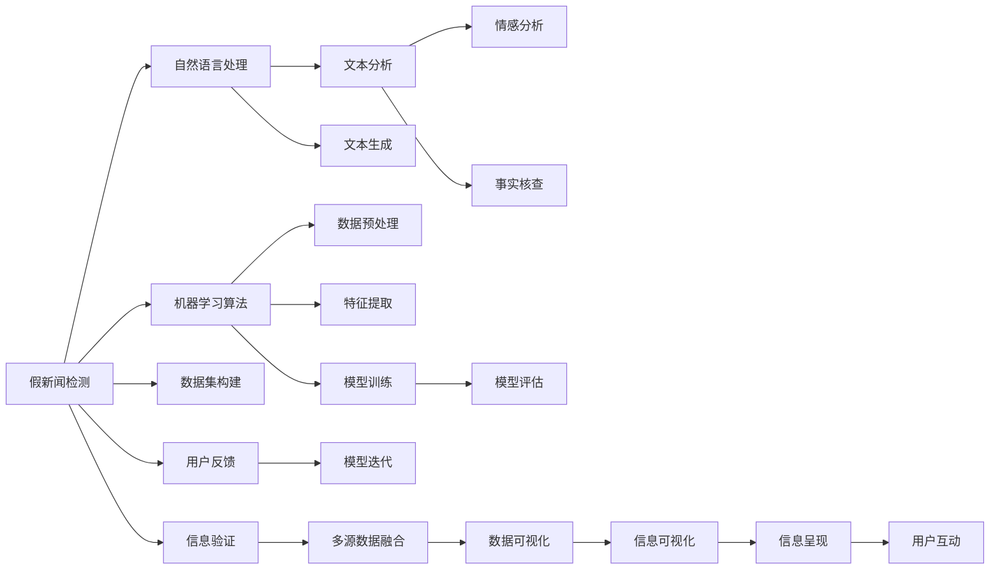

                 

# 信息验证和批判性思考指南：在假新闻和媒体操纵的时代导航

> 关键词：假新闻检测, 媒体操纵识别, 批判性思考, 信息验证, 算法与技术, 人工智能, 数据科学

## 1. 背景介绍

### 1.1 问题由来
在信息爆炸的时代，假新闻和媒体操纵的肆虐，给社会带来了巨大的负面影响。假新闻通常是指通过篡改、伪造、误导等方式传播的虚假信息，目的在于误导公众，引发恐慌或冲突。媒体操纵则包括策划、发布、传播虚假信息的行为，以实现特定的政治、经济或社会目的。这些行为不仅对公众认知造成干扰，也破坏了社会秩序和信任。

面对这一问题，越来越多的人开始关注信息的真实性验证和批判性思考，希望通过技术和科学的方法，识别和遏制假新闻和媒体操纵。本文将详细探讨这一领域的核心概念、原理和实践方法，旨在帮助读者在假新闻和媒体操纵的时代，能够更加有效地识别和抵御虚假信息的影响。

### 1.2 问题核心关键点
信息验证和批判性思考的核心关键点主要包括：
1. **假新闻检测**：利用机器学习算法和技术，自动检测和过滤假新闻。
2. **媒体操纵识别**：通过自然语言处理技术，识别媒体发布的各类操纵行为。
3. **批判性思考**：培养用户批判性思维能力，提升其对信息真实性的识别能力。
4. **信息验证**：通过多维度的信息源验证，确保信息的真实性和可靠性。
5. **算法与技术**：借助先进的算法和技术，提升假新闻和媒体操纵识别的效率和准确性。
6. **人工智能**：利用人工智能技术，推动信息验证和批判性思考的自动化和智能化。
7. **数据科学**：通过数据分析和挖掘，揭示假新闻和媒体操纵的特征和规律，为信息验证提供数据支持。

这些关键点共同构成了信息验证和批判性思考的全面框架，旨在帮助读者从多个角度提升对假新闻和媒体操纵的识别能力。

## 2. 核心概念与联系

### 2.1 核心概念概述

为了更好地理解信息验证和批判性思考，我们首先介绍几个核心概念：

- **假新闻检测**：通过机器学习算法，自动识别和过滤假新闻的过程。
- **媒体操纵识别**：利用自然语言处理技术，识别媒体发布的操纵性信息。
- **批判性思考**：通过逻辑推理和证据评估，对信息真实性进行判断和验证。
- **信息验证**：通过多种数据源交叉验证，确认信息的真实性和可靠性。
- **算法与技术**：指用于假新闻检测和媒体操纵识别的各种机器学习算法和技术。
- **人工智能**：涉及信息验证和批判性思考中的人工智能技术和方法。
- **数据科学**：用于揭示假新闻和媒体操纵特征的数据挖掘和分析方法。

这些概念之间存在着密切的联系，可以构成一个相互支撑的体系。

### 2.2 核心概念原理和架构的 Mermaid 流程图

以下是这些核心概念的 Mermaid 流程图，展示了它们之间的联系和交互：



这个流程图展示了从假新闻检测到信息验证的全流程，包括假新闻的检测、特征提取、模型训练、多源数据融合等步骤。通过这一系列环节，可以构建一个完整的假新闻识别和验证系统。

## 3. 核心算法原理 & 具体操作步骤

### 3.1 算法原理概述

信息验证和批判性思考的算法原理，主要集中在机器学习、自然语言处理和数据科学三个领域。这些算法和技术的核心目标，是通过自动化和智能化的方法，提升对假新闻和媒体操纵的识别能力。

**机器学习算法**：包括监督学习、无监督学习和半监督学习等。其中，监督学习通过标注数据集进行训练，模型能够从历史数据中学习到规律，对新数据进行预测。无监督学习和半监督学习则不需要标注数据，直接从数据中挖掘模式和结构。

**自然语言处理**：包括文本预处理、文本分析、情感分析、事实核查等。自然语言处理技术能够自动识别文本中的关键信息、情感倾向和事实真实性，从而辅助判断信息的可靠性。

**数据科学**：包括数据挖掘、数据分析、数据可视化等。数据科学方法能够从大量数据中揭示假新闻和媒体操纵的特征和规律，提供科学的证据支持。

### 3.2 算法步骤详解

基于以上原理，假新闻和媒体操纵的识别和验证过程可以分为以下步骤：

**Step 1: 数据收集与预处理**
- 收集假新闻和媒体操纵的相关数据，包括新闻文章、社交媒体帖子、论坛帖子等。
- 对收集到的数据进行清洗和预处理，去除噪声和冗余信息。

**Step 2: 特征提取与表示**
- 使用自然语言处理技术，提取文本的特征，如关键词、情感倾向、句法结构等。
- 将文本特征转换为模型可以处理的数值表示形式。

**Step 3: 模型训练与评估**
- 选择合适的机器学习算法，构建训练数据集。
- 对模型进行训练，并使用验证集评估模型性能。
- 根据评估结果调整模型参数，进行模型迭代优化。

**Step 4: 信息验证与验证**
- 对验证过的模型进行信息验证，使用多源数据进行交叉验证。
- 综合不同数据源的信息，生成综合报告，确保信息的真实性和可靠性。

### 3.3 算法优缺点

信息验证和批判性思考的算法具有以下优点：
1. 自动化程度高，能够高效处理大量信息。
2. 覆盖面广，能够识别多种类型的假新闻和媒体操纵。
3. 提供科学依据，能够通过数据分析和挖掘，揭示假新闻和媒体操纵的特征和规律。

同时，这些算法也存在一些缺点：
1. 数据质量依赖度高，需要高质量的标注数据和数据集。
2. 模型泛化能力有限，可能对未见过的数据表现不佳。
3. 存在偏见和误判风险，需要定期更新和调整模型。
4. 需要大量的计算资源和时间，对硬件设备要求较高。

### 3.4 算法应用领域

基于这些算法的信息验证和批判性思考技术，已经在多个领域得到了应用：

1. **新闻业**：帮助新闻媒体和记者识别和验证假新闻，提升新闻质量。
2. **社交媒体**：帮助社交媒体平台检测和过滤虚假信息，维护平台秩序。
3. **学术研究**：用于研究假新闻和媒体操纵的特征和规律，推动相关领域的理论研究。
4. **政府和机构**：用于政策制定、舆情监测和风险评估，保障社会稳定。
5. **教育**：用于培养学生的批判性思维能力，提升信息素养。
6. **公共卫生**：用于识别和防范虚假健康信息，保护公众健康。
7. **企业**：用于保护企业品牌和声誉，防范虚假宣传和市场操纵。

这些应用领域展示了信息验证和批判性思考技术的广泛适用性和重要价值。

## 4. 数学模型和公式 & 详细讲解 & 举例说明

### 4.1 数学模型构建

本节将使用数学语言对信息验证和批判性思考的数学模型进行更加严格的刻画。

设假新闻检测的数据集为 $D=\{(x_i,y_i)\}_{i=1}^N$，其中 $x_i$ 为新闻文本，$y_i$ 为标签（真/假）。定义模型 $M_{\theta}$ 在输入 $x$ 上的输出为 $\hat{y}$，则假新闻检测的目标是：

$$
\hat{y} = \arg\min_{y \in \{0,1\}} \mathcal{L}(M_{\theta}, x)
$$

其中 $\mathcal{L}(M_{\theta}, x)$ 为损失函数，表示模型 $M_{\theta}$ 在输入 $x$ 上的预测输出与真实标签之间的差异。

### 4.2 公式推导过程

以下我们以二分类任务为例，推导逻辑回归模型的损失函数及其梯度计算公式。

假设模型 $M_{\theta}$ 在输入 $x$ 上的输出为 $\hat{y}=M_{\theta}(x) \in [0,1]$，真实标签 $y \in \{0,1\}$。则二分类逻辑回归损失函数定义为：

$$
\ell(M_{\theta}(x),y) = -[y\log \hat{y} + (1-y)\log (1-\hat{y})]
$$

将其代入经验风险公式，得：

$$
\mathcal{L}(\theta) = -\frac{1}{N}\sum_{i=1}^N [y_i\log M_{\theta}(x_i)+(1-y_i)\log(1-M_{\theta}(x_i))]
$$

根据链式法则，损失函数对参数 $\theta_k$ 的梯度为：

$$
\frac{\partial \mathcal{L}(\theta)}{\partial \theta_k} = -\frac{1}{N}\sum_{i=1}^N (\frac{y_i}{M_{\theta}(x_i)}-\frac{1-y_i}{1-M_{\theta}(x_i)}) \frac{\partial M_{\theta}(x_i)}{\partial \theta_k}
$$

其中 $\frac{\partial M_{\theta}(x_i)}{\partial \theta_k}$ 可进一步递归展开，利用自动微分技术完成计算。

在得到损失函数的梯度后，即可带入参数更新公式，完成模型的迭代优化。重复上述过程直至收敛，最终得到适应假新闻检测任务的最优模型参数 $\theta^*$。

### 4.3 案例分析与讲解

假新闻检测中常用的算法包括逻辑回归、支持向量机、决策树、随机森林等。这里以逻辑回归为例，展示其基本原理和应用。

逻辑回归是一种线性分类模型，通过对新闻文本特征进行线性组合，得到预测结果的概率。其基本思路是通过最大似然估计方法，求解模型参数 $\theta$，使得预测结果最接近真实标签。具体步骤如下：

1. **数据预处理**：对新闻文本进行分词、去停用词、词向量表示等预处理。
2. **特征提取**：提取文本的关键词、情感倾向、句法结构等特征，转换为向量形式。
3. **模型训练**：使用逻辑回归算法，对训练集进行拟合，得到模型参数 $\theta$。
4. **模型评估**：在验证集上评估模型性能，如准确率、精确率、召回率等指标。
5. **模型优化**：根据评估结果调整模型参数，进行模型迭代优化。
6. **信息验证**：使用多源数据进行交叉验证，确保模型的泛化能力。

逻辑回归模型在假新闻检测中的应用，通过数据预处理和特征提取，将文本转换为数值向量。通过模型训练和评估，得到最优的模型参数 $\theta$。最终，通过模型预测和信息验证，实现假新闻的自动识别和过滤。

## 5. 项目实践：代码实例和详细解释说明

### 5.1 开发环境搭建

在进行信息验证和批判性思考的实践前，我们需要准备好开发环境。以下是使用Python进行Pandas和Scikit-learn开发的Python环境配置流程：

1. 安装Anaconda：从官网下载并安装Anaconda，用于创建独立的Python环境。

2. 创建并激活虚拟环境：
```bash
conda create -n info-validation-env python=3.8 
conda activate info-validation-env
```

3. 安装Pandas：
```bash
pip install pandas
```

4. 安装Scikit-learn：
```bash
pip install scikit-learn
```

5. 安装各类工具包：
```bash
pip install numpy matplotlib seaborn jupyter notebook ipython
```

完成上述步骤后，即可在`info-validation-env`环境中开始项目实践。

### 5.2 源代码详细实现

这里我们以假新闻检测为例，给出使用Pandas和Scikit-learn库对逻辑回归模型进行训练和验证的Python代码实现。

首先，定义数据处理函数：

```python
import pandas as pd
from sklearn.model_selection import train_test_split
from sklearn.feature_extraction.text import TfidfVectorizer
from sklearn.linear_model import LogisticRegression
from sklearn.metrics import classification_report

def load_data(path):
    df = pd.read_csv(path)
    return df

def split_data(df):
    X = df['text']
    y = df['label']
    X_train, X_test, y_train, y_test = train_test_split(X, y, test_size=0.2, random_state=42)
    return X_train, X_test, y_train, y_test

def vectorize_data(X):
    vectorizer = TfidfVectorizer(stop_words='english')
    X_vectorized = vectorizer.fit_transform(X)
    return X_vectorized

def train_model(X_train, y_train):
    model = LogisticRegression()
    model.fit(X_train, y_train)
    return model

def evaluate_model(model, X_test, y_test):
    y_pred = model.predict(X_test)
    report = classification_report(y_test, y_pred)
    print(report)
```

然后，加载数据并进行模型训练和评估：

```python
# 加载数据
df = load_data('news_dataset.csv')

# 数据预处理
X_train, X_test, y_train, y_test = split_data(df)

# 特征提取
X_train_vectorized = vectorize_data(X_train)
X_test_vectorized = vectorize_data(X_test)

# 模型训练
model = train_model(X_train_vectorized, y_train)

# 模型评估
evaluate_model(model, X_test_vectorized, y_test)
```

以上就是使用Pandas和Scikit-learn库进行假新闻检测的完整代码实现。可以看到，通过Pandas进行数据处理和Scikit-learn进行模型训练和评估，能够快速构建一个假新闻检测系统。

### 5.3 代码解读与分析

让我们再详细解读一下关键代码的实现细节：

**load_data函数**：
- 定义了一个数据加载函数，用于从指定路径读取CSV文件，将其转换为Pandas DataFrame格式。

**split_data函数**：
- 定义了一个数据集划分函数，使用train_test_split将数据集划分为训练集和测试集，保留20%的数据用于测试。

**vectorize_data函数**：
- 定义了一个特征提取函数，使用TfidfVectorizer将文本数据转换为数值向量，并进行去停用词等预处理。

**train_model函数**：
- 定义了一个模型训练函数，使用Scikit-learn的LogisticRegression算法对训练集进行拟合，得到模型参数。

**evaluate_model函数**：
- 定义了一个模型评估函数，使用Scikit-learn的classification_report函数，计算模型的精确率、召回率、F1值等指标。

**代码流程**：
- 加载数据集，进行数据预处理和特征提取。
- 使用训练数据对模型进行拟合，得到最优的模型参数。
- 使用测试数据对模型进行评估，输出模型的性能指标。

可以看到，Pandas和Scikit-learn的结合，使得数据处理和模型训练的代码实现变得简洁高效。开发者可以将更多精力放在模型优化和特征工程等高级逻辑上，而不必过多关注底层的实现细节。

当然，工业级的系统实现还需考虑更多因素，如模型压缩、超参数调优、分布式训练等，但核心的算法思想基本与此类似。通过学习这些代码实现细节，相信你一定能够掌握信息验证和批判性思考的关键技术。

## 6. 实际应用场景

### 6.1 新闻业

在新闻业中，假新闻的识别和验证是提高新闻质量的重要手段。假新闻的泛滥不仅会损害媒体声誉，还会误导公众，引发社会动荡。新闻业可以利用信息验证和批判性思考技术，自动检测和过滤假新闻，提升新闻的可信度和权威性。

### 6.2 社交媒体

社交媒体平台面临着大量虚假信息的传播，需要通过信息验证技术，及时识别和过滤虚假信息，维护平台秩序。社交媒体平台可以利用自然语言处理技术，自动识别和标记虚假信息，提升用户体验和平台安全。

### 6.3 学术研究

学术研究中，假新闻和媒体操纵识别是研究的重要方向之一。研究者可以利用信息验证技术，识别和分析虚假信息的特征和规律，推动相关领域的理论研究。

### 6.4 政府和机构

政府和机构需要及时获取和验证各类信息，确保决策的科学性和可靠性。通过信息验证技术，可以识别和防范虚假信息的传播，保障公共安全和政策制定的正确性。

### 6.5 公共卫生

公共卫生领域，假新闻和媒体操纵的危害尤为明显。虚假健康信息的传播，会导致公众恐慌和社会动荡。通过信息验证技术，可以识别和防范虚假健康信息，保护公众健康。

### 6.6 企业

企业需要保护品牌声誉和市场利益，防范虚假宣传和市场操纵。通过信息验证技术，可以识别和过滤虚假信息，提升企业的市场竞争力和品牌形象。

### 6.7 教育

教育领域，信息素养培养是重要的目标之一。通过信息验证技术，可以培养学生的批判性思维能力，提升信息素养，推动教育的现代化和智能化。

这些应用场景展示了信息验证和批判性思考技术的广泛适用性和重要价值。

## 7. 工具和资源推荐

### 7.1 学习资源推荐

为了帮助开发者系统掌握信息验证和批判性思考的理论基础和实践技巧，这里推荐一些优质的学习资源：

1. 《深度学习》系列书籍：深度学习领域的经典教材，涵盖了深度学习的基础知识、算法原理和实际应用。

2. 《自然语言处理综论》：自然语言处理领域的权威教材，全面介绍了自然语言处理的理论和方法，包括文本预处理、特征提取、模型训练等。

3. 《机器学习实战》：实战型的机器学习入门书籍，结合实际案例，介绍了机器学习的算法和应用。

4. 《Python机器学习》：Python语言下的机器学习实战教程，涵盖Pandas、Scikit-learn等常用工具的详细使用。

5. Coursera和edX：提供高质量的在线课程，涵盖深度学习、自然语言处理、机器学习等领域。

通过对这些资源的学习实践，相信你一定能够快速掌握信息验证和批判性思考的关键技术，并用于解决实际的假新闻和媒体操纵问题。

### 7.2 开发工具推荐

高效的开发离不开优秀的工具支持。以下是几款用于信息验证和批判性思考开发的常用工具：

1. Python：Python语言是信息验证和批判性思考开发的主流语言，具备强大的数据处理和机器学习库。

2. Pandas：Python下的数据处理库，提供了高效的数据清洗、预处理和分析功能。

3. Scikit-learn：Python下的机器学习库，提供了丰富的机器学习算法和模型，适合进行假新闻检测和媒体操纵识别。

4. TensorFlow和PyTorch：深度学习框架，提供了强大的模型训练和优化功能，适合进行复杂的深度学习任务。

5. Weights & Biases：模型训练的实验跟踪工具，可以记录和可视化模型训练过程中的各项指标，方便对比和调优。

6. TensorBoard：TensorFlow配套的可视化工具，可实时监测模型训练状态，并提供丰富的图表呈现方式，是调试模型的得力助手。

合理利用这些工具，可以显著提升信息验证和批判性思考任务的开发效率，加快创新迭代的步伐。

### 7.3 相关论文推荐

信息验证和批判性思考的发展源于学界的持续研究。以下是几篇奠基性的相关论文，推荐阅读：

1. "A Survey of False News Detection Methods and Challenges"：综述了假新闻检测的最新研究进展和挑战。

2. "Identifying False News Articles with Machine Learning: A Survey and Taxonomy"：介绍了机器学习在假新闻检测中的应用和分类。

3. "Debunking Misinformation in Media: An Empirical Study of the Social Media Dynamics"：分析了社交媒体上的虚假信息传播机制和应对策略。

4. "The Taming of the Snakes: Identifying and Neutralizing Fake News Stories on the Internet"：探讨了虚假信息的识别和过滤方法。

5. "Fact-Checking for Credible Information in the Age of Misinformation"：介绍了事实核查在假新闻检测中的应用和效果。

这些论文代表了大语言模型微调技术的发展脉络。通过学习这些前沿成果，可以帮助研究者把握学科前进方向，激发更多的创新灵感。

## 8. 总结：未来发展趋势与挑战

### 8.1 总结

本文对信息验证和批判性思考的理论基础、核心算法和实践方法进行了全面系统的介绍。首先阐述了假新闻和媒体操纵的背景和核心关键点，明确了信息验证和批判性思考的重要性和适用场景。其次，从原理到实践，详细讲解了信息验证和批判性思考的数学模型和算法步骤，给出了实际项目开发的代码实例。最后，对信息验证和批判性思考的未来趋势和面临的挑战进行了总结。

通过本文的系统梳理，可以看到，信息验证和批判性思考技术正在成为假新闻和媒体操纵领域的重要范式，极大地拓展了信息真实性的验证能力，推动了信息素养和媒体伦理的发展。未来，伴随算法的不断演进和技术的持续进步，信息验证和批判性思考必将发挥更大的作用，构建一个更加透明、可信的社会环境。

### 8.2 未来发展趋势

展望未来，信息验证和批判性思考技术将呈现以下几个发展趋势：

1. 自动化程度提升：随着机器学习技术的进步，信息验证和批判性思考将更加自动化，能够处理更大规模的数据集，识别更多类型的虚假信息。

2. 多模态融合：除了文本数据，信息验证技术将更多地利用图像、视频、音频等多模态数据，提升识别准确性。

3. 动态更新：信息验证模型将不断更新和迭代，适应新的数据和变化的环境，提高模型的泛化能力。

4. 跨领域应用：信息验证技术将更多地应用于公共卫生、金融、医疗等领域，提升各行业的信息素养和安全性。

5. 数据驱动：信息验证技术将更加依赖数据驱动，通过大数据分析和挖掘，揭示虚假信息的特征和规律，提供科学的证据支持。

6. 融合AI技术：信息验证技术将与人工智能技术深度融合，利用自然语言处理、图像识别、语音识别等技术，提升虚假信息识别的效率和准确性。

这些趋势凸显了信息验证和批判性思考技术的广阔前景，必将为构建更加透明、可信的社会环境做出更大的贡献。

### 8.3 面临的挑战

尽管信息验证和批判性思考技术已经取得了显著进展，但在迈向更加智能化、普适化应用的过程中，它仍面临着诸多挑战：

1. 数据质量和标注依赖度高：高质量的标注数据和数据集是信息验证的基础，但获取标注数据的过程往往耗时耗力。

2. 模型泛化能力有限：信息验证模型可能在未见过的数据上表现不佳，需要不断优化和改进。

3. 用户理解难度大：信息验证技术需要用户具备一定的技术背景，才能有效使用和理解。

4. 误判风险高：信息验证模型可能误判真实信息，影响信息的准确性和可信度。

5. 法律和伦理问题：信息验证技术需要处理大量敏感信息，可能引发隐私保护和伦理问题。

6. 资源和计算要求高：信息验证技术需要大量的计算资源和存储空间，对硬件设备要求较高。

正视这些挑战，积极应对并寻求突破，将使信息验证和批判性思考技术更加成熟和可靠。

### 8.4 研究展望

面对信息验证和批判性思考技术所面临的挑战，未来的研究需要在以下几个方面寻求新的突破：

1. 提高数据标注效率：研究自动标注和半监督学习等方法，降低对标注数据的依赖，提升数据处理效率。

2. 增强模型泛化能力：研究新的机器学习算法和技术，提高模型的泛化能力和适应性。

3. 提升用户体验：研究用户友好的界面和交互方式，降低技术门槛，提升用户体验。

4. 优化模型误判率：研究模型误判的识别和纠正方法，减少误判风险。

5. 保护用户隐私：研究隐私保护和伦理约束的技术，确保数据安全。

6. 降低计算成本：研究模型压缩、优化和分布式训练等方法，降低计算资源需求。

这些研究方向的探索，必将推动信息验证和批判性思考技术迈向更高的台阶，为构建透明、可信的社会环境提供更加有力的技术支撑。

## 9. 附录：常见问题与解答

**Q1：信息验证和批判性思考的算法有哪些？**

A: 常用的信息验证算法包括逻辑回归、支持向量机、决策树、随机森林、深度学习等。常用的批判性思考算法包括规则推理、知识图谱、因果推断等。

**Q2：如何进行数据预处理和特征提取？**

A: 数据预处理包括文本分词、去停用词、词向量表示等步骤。特征提取可以使用自然语言处理技术，如TF-IDF、词袋模型、词嵌入等方法，将文本转换为数值向量。

**Q3：如何评估信息验证模型的性能？**

A: 信息验证模型的评估指标包括准确率、精确率、召回率、F1值等。常用的评估方法包括交叉验证、留一法等。

**Q4：信息验证和批判性思考的应用场景有哪些？**

A: 信息验证和批判性思考的应用场景包括新闻业、社交媒体、学术研究、政府机构、公共卫生、企业、教育等领域。

**Q5：如何进行信息验证和批判性思考的自动化？**

A: 信息验证和批判性思考的自动化可以通过机器学习算法和自然语言处理技术实现。自动化系统需要具备数据收集、特征提取、模型训练、模型评估、结果呈现等功能。

通过这些问题的回答，相信你能够更好地理解信息验证和批判性思考的核心概念和关键技术，提升对假新闻和媒体操纵的识别和防范能力。

