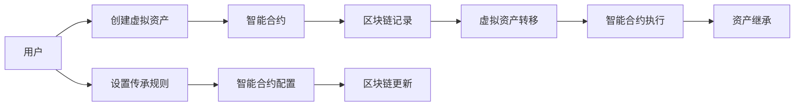

                 

# 元宇宙中的数字遗产:虚拟资产的传承

> 关键词：元宇宙,数字遗产,虚拟资产,传承,技术栈,标准规范,互操作性,安全保障

## 1. 背景介绍

随着虚拟现实(VR)、增强现实(AR)、区块链等技术的融合，元宇宙概念应运而生。元宇宙是一个开放、共享、沉浸式的虚拟空间，用户可以在其中进行社交、游戏、创作、商务等活动，形成一个虚拟的现实世界。在这个过程中，数字资产扮演着重要角色，如虚拟土地、虚拟房地产、数字艺术品等。然而，随着元宇宙的快速发展和用户的不断积累，如何保障这些虚拟资产的传承和保护，成为了一个重要的议题。

### 1.1 问题的由来
在元宇宙中，用户的虚拟资产存储在分布式账本(如区块链)中，这些资产的所有权和转移通常以智能合约的形式进行记录和处理。但是，如果用户离世或不再使用该元宇宙，其虚拟资产的归属和管理将面临巨大挑战。现有的互联网继承法律和传统遗产保护措施在元宇宙中并不适用，需要一种新的方式来处理数字资产的传承问题。

### 1.2 问题核心关键点
元宇宙中的数字遗产传承问题主要包括以下几个方面：
- 资产归属的明确性：如何确定虚拟资产的归属和所有权。
- 法律适用性：现有的法律框架如何适用于虚拟资产的传承。
- 操作安全性：如何确保传承过程的安全性和不可篡改性。
- 传承管理：如何在虚拟世界中管理和维护虚拟资产。

### 1.3 问题研究意义
解决元宇宙中的数字遗产传承问题，对于保障用户权益、维护元宇宙生态系统的健康发展具有重要意义。具体而言：

1. **保障用户权益**：确保用户离世后，其虚拟资产能够按照其意愿进行传承，避免资产的流失和滥用。
2. **促进元宇宙生态**：构建一个开放、共享、安全的元宇宙环境，鼓励更多的用户参与创造和消费，提升生态系统活力。
3. **推动技术创新**：为数字遗产传承领域的技术创新提供契机，如智能合约、区块链、加密技术等。

## 2. 核心概念与联系

### 2.1 核心概念概述

在讨论元宇宙中的数字遗产传承问题时，涉及多个核心概念：

- **元宇宙**：由虚拟现实、增强现实、区块链等技术支持的沉浸式虚拟空间。
- **数字遗产**：用户在虚拟世界中所创造和积累的资产，如虚拟土地、数字艺术品、虚拟财产等。
- **智能合约**：基于区块链的自动执行合同，用于处理虚拟资产的所有权转移和管理。
- **区块链**：分布式账本技术，用于记录和验证虚拟资产的转移和归属。
- **NFT (Non-Fungible Tokens)**：不可替代的数字资产，具有唯一性和所有权证明。
- **DAO (Decentralized Autonomous Organization)**：去中心化自治组织，通过智能合约管理元宇宙中的资源和规则。

这些概念之间存在着密切的联系，共同构成了元宇宙数字遗产传承的基础框架。

### 2.2 核心概念原理和架构的 Mermaid 流程图



这个流程图展示了元宇宙中数字遗产传承的基本流程：
1. 用户创建虚拟资产。
2. 智能合约处理资产的创建和所有权。
3. 区块链记录资产的转移和归属。
4. 用户通过智能合约设置传承规则。
5. 智能合约根据规则进行资产的继承和转移。

## 3. 核心算法原理 & 具体操作步骤

### 3.1 算法原理概述

在元宇宙中，数字遗产传承的算法原理主要基于区块链和智能合约技术。这些技术提供了去中心化、不可篡改的数据记录和自动执行合同的能力，确保了数字资产的传承过程的安全性和透明度。

具体而言，算法原理如下：
1. **区块链记录**：资产的创建、转移和所有权变更通过区块链进行记录，保证了数据的不可篡改性和透明性。
2. **智能合约**：通过智能合约自动执行资产的传承和管理规则，确保了传承过程的自动化和公平性。
3. **多层次验证**：结合公钥密码学和多重签名等技术，确保资产传承的多层次验证，防止欺诈和纠纷。

### 3.2 算法步骤详解

数字遗产传承的算法步骤可以分为以下几个阶段：

**Step 1: 创建虚拟资产**
- 用户使用数字创意工具在元宇宙中创建虚拟资产。
- 通过智能合约记录资产的创建信息和所有者信息。

**Step 2: 设置传承规则**
- 用户可以通过智能合约设置虚拟资产的传承规则，如传承人、传承时间、传承条件等。

**Step 3: 资产记录与验证**
- 智能合约将资产的创建和转移信息记录在区块链上，并通过哈希函数进行验证。
- 资产的所有权变更通过公钥密码学和多重签名技术进行验证，确保数据的完整性和安全性。

**Step 4: 资产传承**
- 当预设的传承条件满足时，智能合约自动执行传承操作，将资产转移给指定的继承人。
- 区块链更新资产的所有权信息，确保传承过程的不可篡改性。

**Step 5: 传承确认与记录**
- 继承人通过智能合约确认传承信息，并在区块链上进行记录。
- 智能合约生成传承证明，供后续验证和审计使用。

### 3.3 算法优缺点

**优点**：
1. **去中心化**：区块链和智能合约技术提供了去中心化的解决方案，避免了单点故障和第三方控制。
2. **不可篡改性**：区块链的不可篡改性和透明性确保了传承过程的公正性和可信度。
3. **自动化执行**：智能合约的自动执行能力减少了人工干预，提高了传承过程的效率。

**缺点**：
1. **技术复杂性**：区块链和智能合约技术较为复杂，需要专业知识和技能。
2. **成本高**：初始的创建和记录费用较高，且每次传承操作也需要支付一定的费用。
3. **法律适用性**：现有的法律框架如何适用于虚拟资产的传承尚需明确。

### 3.4 算法应用领域

数字遗产传承算法在多个领域中具有广泛应用，包括但不限于：
- **元宇宙资产管理**：在虚拟世界中进行虚拟土地、数字艺术品、虚拟房产等资产的管理和传承。
- **数字艺术品保护**：数字艺术品的创作、复制、转移和继承，确保作品的独特性和所有权。
- **游戏资产传承**：游戏中的虚拟物品、装备、角色等的创建、转移和传承。
- **数字身份继承**：虚拟身份、虚拟角色的传承和继承，保障用户在游戏世界中的权益。
- **虚拟经济系统**：在虚拟经济系统中的虚拟货币、虚拟资产的传承和交易。

## 4. 数学模型和公式 & 详细讲解 & 举例说明

### 4.1 数学模型构建

数字遗产传承的核心数学模型主要涉及智能合约和区块链的交互，其中智能合约的执行逻辑和区块链的哈希函数是关键组成部分。

假设智能合约的执行逻辑为 $f(x,y)$，其中 $x$ 为传承条件，$y$ 为资产信息。智能合约的执行结果为 $f(x,y)$ 是否满足传承规则。

区块链的哈希函数 $H$ 将资产信息 $x$ 转换为唯一且不可逆的哈希值 $H(x)$，确保了数据的完整性和不可篡改性。

### 4.2 公式推导过程

**智能合约执行逻辑**：
- 假设传承条件为 $x=\{时间、身份、金额\}$，资产信息为 $y=\{所有者、金额\}$。
- 智能合约的执行逻辑为：$M=f(x,y) = \begin{cases}
\text{True}, & \text{if } x \text{ 满足条件，且 } y \text{ 合法} \\
\text{False}, & \text{otherwise}
\end{cases}$

**哈希函数计算**：
- 假设资产信息为 $y=\{所有者、金额\}$，哈希函数 $H$ 为：$H(y) = \text{SHA-256}(y)$
- 哈希函数计算公式为：$H(y) = \text{SHA-256}(\text{所有者}, \text{金额})$

### 4.3 案例分析与讲解

**案例1: 虚拟土地传承**
- 用户在元宇宙中创建虚拟土地，智能合约记录土地信息（位置、大小、所有者）。
- 用户通过智能合约设置传承规则，如子女继承、特定时间段后继承等。
- 当传承条件满足时，智能合约自动执行传承操作，将土地信息更新为新的所有者，并记录在区块链上。

**案例2: 数字艺术品传承**
- 用户在元宇宙中创作数字艺术品，智能合约记录艺术品信息（名称、作者、版权）。
- 用户通过智能合约设置传承规则，如指定继承人、特定时间后继承等。
- 当传承条件满足时，智能合约自动执行传承操作，将艺术品信息更新为新的所有者，并记录在区块链上。

## 5. 项目实践：代码实例和详细解释说明

### 5.1 开发环境搭建

开发元宇宙数字遗产传承系统的环境搭建需要考虑以下几个方面：

**Step 1: 选择合适的开发语言和框架**
- 推荐使用Solidity或Serum作为智能合约的开发语言，结合Node.js或React等框架构建前端界面。

**Step 2: 安装相关开发工具**
- 安装Solidity IDE，如Remix或Truffle。
- 安装区块链节点，如Ganache或Ropsten。
- 安装HTTP客户端，如Web3.js。

**Step 3: 设置开发环境**
- 配置智能合约部署工具，如Truffle或Hardhat。
- 搭建本地区块链网络，进行智能合约的测试和部署。

### 5.2 源代码详细实现

以下是一个简单的智能合约示例，用于记录和传承虚拟资产：

```solidity
pragma solidity ^0.8.0;

contract DigitalAsset {
    address public owner;
    uint public amount;
    
    constructor(uint _amount, address _owner) {
        owner = _owner;
        amount = _amount;
    }
    
    function transfer(address _newOwner, uint _sharedSecret) external {
        uint hash = keccak256(abi.encodePacked(owner, amount, _sharedSecret));
        require(hash == _newOwner);
        owner = _newOwner;
    }
}
```

这个智能合约定义了一个虚拟资产的所有者和金额，并提供了一个 `transfer` 函数用于资产的传承。函数通过哈希函数验证传承条件，确保传承过程的安全性和合法性。

### 5.3 代码解读与分析

**代码解析**：
- `constructor` 函数：初始化虚拟资产的所有者和金额。
- `transfer` 函数：执行资产的传承操作，验证传承条件，更新所有者信息。

**关键细节**：
- `keccak256` 哈希函数：将输入的三个参数进行哈希计算，生成唯一的哈希值。
- `abi.encodePacked` 编码函数：将输入的参数编码为二进制数据。

### 5.4 运行结果展示

**运行结果**：
- 在区块链节点上部署智能合约，记录虚拟资产的所有者和金额。
- 在客户端通过 `transfer` 函数执行资产传承，验证传承条件。
- 区块链上更新资产的所有权信息，记录传承过程。

## 6. 实际应用场景

### 6.1 智能资产管理
在元宇宙中，智能资产管理平台可以为用户提供虚拟资产的创建、转移、继承等功能。用户可以在平台上创建和管理虚拟土地、数字艺术品等资产，并通过智能合约进行传承。平台需要确保资产的透明性和安全性，保障用户权益。

### 6.2 游戏资产传承
游戏平台可以提供游戏资产的创建、转移和继承功能，如虚拟货币、装备、角色等。通过智能合约和区块链技术，确保资产的传承过程公正、可信。平台还应提供易用的界面和详细的传承规则配置，方便用户管理游戏资产。

### 6.3 数字艺术品保护
数字艺术品创作者可以通过平台创建和管理自己的作品，并通过智能合约进行版权保护和传承。平台需要提供数字水印和哈希函数等技术手段，确保艺术品的独特性和所有权。创作者还可以设置传承规则，指定作品传承人，保障作品的长期保存和传承。

### 6.4 虚拟经济系统
虚拟经济系统可以提供虚拟货币、虚拟资产的创建、转移和继承功能，如虚拟土地、虚拟房产等。系统需要确保资产的合法性、透明性和安全性，保障用户的经济权益。智能合约可以自动执行传承规则，减少人工干预，提高系统效率。

## 7. 工具和资源推荐

### 7.1 学习资源推荐

- **《智能合约实战》**：一本全面介绍智能合约开发的书籍，涵盖了Solidity、以太坊、Truffle等工具的使用。
- **《区块链基础》**：一本介绍区块链技术的书籍，涵盖区块链原理、智能合约、分布式账本等基础内容。
- **《Web3.js 入门与实战》**：一本介绍Web3.js开发环境的书籍，涵盖HTTP客户端的使用、智能合约的交互等。

### 7.2 开发工具推荐

- **Remix IDE**：一个用于开发和测试Solidity智能合约的IDE，提供了丰富的开发工具和调试功能。
- **Truffle**：一个用于智能合约开发的框架，提供了自动部署、测试等功能。
- **Web3.js**：一个HTTP客户端库，用于与以太坊节点交互，调用智能合约功能。

### 7.3 相关论文推荐

- **《数字遗产的区块链技术实现》**：介绍数字遗产传承在区块链上的技术实现，涵盖智能合约、哈希函数等核心技术。
- **《去中心化身份管理的智能合约设计》**：介绍基于智能合约的虚拟身份管理和传承技术，涵盖身份验证、权限控制等。
- **《数字艺术品的区块链保护与传承》**：介绍数字艺术品在区块链上的保护与传承技术，涵盖数字水印、版权保护等。

## 8. 总结：未来发展趋势与挑战

### 8.1 研究成果总结

本文对元宇宙中的数字遗产传承问题进行了全面系统的介绍，涵盖了智能合约、区块链、哈希函数等核心概念和技术，为元宇宙资产管理、游戏资产传承、数字艺术品保护等实际应用提供了参考。

### 8.2 未来发展趋势

未来，元宇宙中的数字遗产传承技术将呈现以下几个发展趋势：

1. **去中心化治理**：DAO将更多地参与到数字遗产传承的管理和决策中，增强系统的公平性和透明性。
2. **跨链互操作性**：不同区块链之间的互操作性将提高数字遗产的跨平台传承能力。
3. **隐私保护**：引入隐私保护技术，如零知识证明、同态加密等，确保用户隐私不被泄露。
4. **区块链分片**：通过区块链分片技术，提高系统的扩展性和处理能力，支持更多用户的并发操作。
5. **智能合约优化**：优化智能合约的执行效率，减少费用，提高系统的可用性和可扩展性。

### 8.3 面临的挑战

尽管元宇宙中的数字遗产传承技术已经取得了一定的进展，但仍然面临一些挑战：

1. **技术复杂性**：智能合约和区块链技术的复杂性增加了开发和部署难度。
2. **成本问题**：区块链上的费用和智能合约的部署费用较高，增加了系统的使用门槛。
3. **法律适用性**：现有的法律框架如何适用于数字遗产传承问题，尚需明确。
4. **隐私和安全性**：如何在确保传承过程公正、透明的同时，保护用户的隐私和数据安全。
5. **系统扩展性**：如何应对大规模用户的并发操作，保障系统的稳定性和可扩展性。

### 8.4 研究展望

未来，数字遗产传承技术需要在以下几个方面进行进一步研究：

1. **智能合约简化**：简化智能合约的编写和部署过程，降低开发难度，提高系统的可用性。
2. **隐私保护技术**：引入隐私保护技术，确保用户数据的隐私和安全。
3. **跨链互操作性**：研究不同区块链之间的互操作性，支持数字遗产的跨平台传承。
4. **法律适用性研究**：研究数字遗产传承在现有法律框架下的适用性，制定相应的法律规范。
5. **安全性和稳定性**：加强系统的安全性和稳定性，防止欺诈和故障。

总之，元宇宙中的数字遗产传承技术还有很大的研究空间，需要在技术、法律、隐私保护等方面进行深入探索和创新。相信随着技术的不断进步和应用场景的拓展，数字遗产传承将成为元宇宙生态系统的重要组成部分，为虚拟世界的可持续发展和用户权益保护提供有力保障。

## 9. 附录：常见问题与解答

**Q1: 如何在元宇宙中创建和管理虚拟资产？**

A: 用户可以通过平台提供的数字创意工具，在元宇宙中创建虚拟资产，如虚拟土地、数字艺术品等。创建完成后，平台提供智能合约功能，用于记录和管理资产的所有权、金额等信息。用户可以在平台上设置传承规则，确保资产的传承过程公正、可信。

**Q2: 智能合约的执行效率如何？**

A: 智能合约的执行效率受到区块链的计算能力和网络带宽的影响。目前以太坊的计算能力和扩展性正在不断提升，但仍有改进空间。通过优化合约代码和采用分片等技术，可以提高合约的执行效率，降低费用。

**Q3: 数字遗产传承的法律适用性如何？**

A: 现有的法律框架如何适用于数字遗产传承问题，尚需明确。各地司法部门和立法机构应尽快出台相关法规，明确数字遗产的传承规则和权益保障措施。同时，平台也应制定相应的用户协议和规则，确保用户权益的保护。

**Q4: 如何确保数字遗产传承的安全性和隐私性？**

A: 通过哈希函数和多重签名技术，确保资产传承的多层次验证，防止欺诈和篡改。引入隐私保护技术，如零知识证明、同态加密等，确保用户数据的隐私和安全。

**Q5: 未来元宇宙资产管理平台应具备哪些功能？**

A: 未来元宇宙资产管理平台应具备以下功能：
- 数字资产的创建、转移、继承功能。
- 智能合约的自动执行和验证功能。
- 平台管理员的权限管理和监督功能。
- 用户界面和交互功能，方便用户管理和操作。
- 跨平台互操作性和系统扩展性，支持大规模用户的操作。

总之，元宇宙中的数字遗产传承问题是一个多学科交叉的研究领域，需要技术、法律、隐私保护等多方面的综合考虑。相信随着技术的不断发展和应用的深入，数字遗产传承技术将逐步成熟，为元宇宙生态系统的健康发展和用户权益保障提供有力支撑。

---

作者：禅与计算机程序设计艺术 / Zen and the Art of Computer Programming

