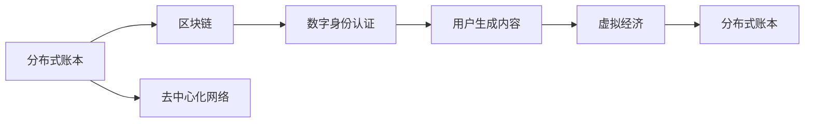

                 

# 元宇宙中的虚拟社区：全球社交网络的新形态

> 关键词：元宇宙,虚拟社区,社交网络,去中心化,区块链,分布式账本,数字身份,用户生成内容,虚拟经济

## 1. 背景介绍

### 1.1 问题由来

随着科技的迅猛发展，全球社交网络正进入一个全新时代——元宇宙。元宇宙不仅改变了人与人、人与机的互动方式，还重新定义了虚拟社区的概念。在元宇宙中，用户不仅能以虚拟身份参与社交，还能创建和共享虚拟世界、虚拟资产、虚拟经济等，打造出一个去中心化、开放式的全球社交网络。

虚拟社区作为元宇宙的重要组成部分，连接了全球各地的用户，形成了一个超越时间和空间限制的虚拟社交空间。其独特的社交模式、互动方式和治理结构，对传统社交网络提出了巨大挑战，也为全球社交网络带来了新机遇。

### 1.2 问题核心关键点

元宇宙虚拟社区的构建涉及众多核心技术，如分布式账本、区块链、去中心化网络、数字身份认证、用户生成内容(UGC)等。这些技术的协同应用，使得虚拟社区不仅具备传统社交网络的各项功能，还能进行去中心化管理，保护用户隐私，实现公平、透明的社区治理。

元宇宙虚拟社区的核心关键点包括：

1. **分布式账本**：记录和验证所有社区活动、交易、资产等，提供透明可信的社区记录。
2. **区块链技术**：保障交易安全、不可篡改，实现去中心化治理。
3. **数字身份认证**：通过加密算法和零知识证明，确保用户身份的真实性和隐私保护。
4. **用户生成内容**：由用户自主创造和分享，丰富社区多样性。
5. **虚拟经济**：以虚拟货币和虚拟资产为核心，构建虚拟社区的生态系统。

## 2. 核心概念与联系

### 2.1 核心概念概述

元宇宙中的虚拟社区构建涉及到多个核心概念，它们之间存在密切的联系，共同构成了一个完整、自洽的社交网络体系。

- **分布式账本（Distributed Ledger）**：一种去中心化的数据库，由网络中的多个节点共同维护，提供数据的安全性和不可篡改性。
- **区块链（Blockchain）**：一种通过加密技术保障交易安全和透明性的分布式账本技术，常见应用包括比特币、以太坊等。
- **去中心化网络（Decentralized Network）**：去除中心控制节点，实现节点间直接通信的网络架构。
- **数字身份认证（Digital Identity Verification）**：通过加密技术和零知识证明，验证用户身份的真实性，确保隐私安全。
- **用户生成内容（User Generated Content, UGC）**：用户自主创作并上传分享，丰富社区内容。
- **虚拟经济（Virtual Economy）**：以虚拟货币和虚拟资产为核心的经济系统，支持社区内各类活动。

这些概念通过协同应用，形成了一个去中心化、自治、可持续发展的虚拟社区。

### 2.2 核心概念原理和架构的 Mermaid 流程图



该流程图展示了核心概念之间的联系和关系。分布式账本是区块链的基础，去中心化网络提供了数据传输的基础设施，数字身份认证保障了社区成员的真实性，用户生成内容丰富了社区内容，虚拟经济则构成了社区的经济基础。

## 3. 核心算法原理 & 具体操作步骤

### 3.1 算法原理概述

元宇宙虚拟社区的构建主要基于分布式账本和区块链技术。以下将详细介绍这两种技术的算法原理及具体操作步骤。

#### 3.1.1 分布式账本（Distributed Ledger）

分布式账本是一种去中心化的数据库，由网络中的多个节点共同维护。每个节点保存着完整的账本副本，通过共识算法（如PoW、PoS等）维护账本的一致性。当有新的交易发生时，节点们通过共识算法达成一致，将交易记录到账本上。

#### 3.1.2 区块链（Blockchain）

区块链是一种通过加密技术保障交易安全和透明性的分布式账本技术。其核心机制包括：

- **区块（Block）**：记录一段时间内的所有交易，生成一个区块。
- **链式结构（Chain）**：将多个区块按照时间顺序连接起来，形成区块链。
- **加密算法（Cryptography）**：通过哈希函数、数字签名等技术保障交易安全和不可篡改性。

#### 3.1.3 共识算法（Consensus Algorithm）

共识算法是分布式账本和区块链中重要的机制，用于解决节点间的同步和信任问题。常见的共识算法包括：

- **PoW（Proof of Work）**：通过工作量证明机制，要求节点消耗大量计算资源以生成新的区块。
- **PoS（Proof of Stake）**：通过股权证明机制，根据节点持有的代币数量和币龄决定其生成新区块的可能性。

### 3.2 算法步骤详解

#### 3.2.1 分布式账本

1. **账本创建**：通过分布式算法创建初始账本，节点们共同维护账本副本。
2. **交易提交**：用户提交交易请求，节点将其记录到本地账本。
3. **共识机制**：节点们通过共识算法达成一致，将交易记录到区块链上。
4. **数据同步**：各节点同步更新账本数据，确保账本的一致性和透明性。

#### 3.2.2 区块链

1. **区块生成**：记录一段时间内的所有交易，生成一个新的区块。
2. **链式结构**：将新区块连接到现有区块链中，形成连续的链式结构。
3. **加密算法**：对区块进行哈希加密，生成区块头和区块数据。
4. **验证交易**：通过数字签名等技术，验证交易的真实性和不可篡改性。

### 3.3 算法优缺点

#### 3.3.1 分布式账本

**优点**：
1. **去中心化**：多个节点共同维护账本，消除了中心控制点的风险。
2. **透明可信**：所有交易公开透明，可追溯、可验证。
3. **高可靠性**：分布式算法保障账本数据的高可靠性。

**缺点**：
1. **性能问题**：分布式共识机制可能带来延迟和高并发问题。
2. **安全性问题**：存在51%攻击和双花攻击的风险。

#### 3.3.2 区块链

**优点**：
1. **去中心化**：保障交易安全和透明性，防止单点故障。
2. **不可篡改**：通过哈希函数和数字签名，保障交易的不可篡改性。
3. **共识机制**：保障网络中各节点间的信任关系。

**缺点**：
1. **资源消耗**：共识机制可能消耗大量计算资源。
2. **扩展性问题**：当前区块链的吞吐量和处理速度存在瓶颈。

### 3.4 算法应用领域

分布式账本和区块链技术不仅在元宇宙虚拟社区中得到应用，还在多个领域展现出广泛的应用前景。

1. **金融领域**：如比特币、以太坊等加密货币的底层技术。
2. **供应链管理**：通过区块链技术实现供应链的透明、可追溯性。
3. **医疗健康**：通过区块链存储和共享患者数据，保障数据安全和隐私。
4. **智能合约**：通过区块链实现去中心化的合同执行和监管。
5. **数字版权保护**：通过区块链记录版权信息，防止侵权和盗版。

## 4. 数学模型和公式 & 详细讲解 & 举例说明

### 4.1 数学模型构建

#### 4.1.1 分布式账本

分布式账本的数学模型包括账本、交易、共识算法等。其中，共识算法是账本一致性的核心。

**账本（Ledger）**：
- 账本记录所有交易，包含多个区块。
- 每个区块包含多个交易记录。
- 账本的初始区块由网络中的首个节点创建。

**交易（Transaction）**：
- 交易记录为二元组（id, data）。
- id为交易的唯一标识符，data为交易内容。

**共识算法（Consensus Algorithm）**：
- 共识算法决定了节点们达成一致的过程。
- 常见的共识算法包括PoW、PoS、PBFT等。

#### 4.1.2 区块链

区块链的数学模型包括区块、链式结构、哈希函数等。

**区块（Block）**：
- 区块包含多个交易记录。
- 区块由区块头和区块数据组成。
- 区块头包含区块体的哈希值、前一个区块的哈希值、时间戳等。

**链式结构（Chain）**：
- 区块链由多个区块按照时间顺序连接而成。
- 每个区块包含前一个区块的哈希值，形成链式结构。

**哈希函数（Hash Function）**：
- 哈希函数将任意长度的输入数据映射为固定长度的哈希值。
- 常见的哈希函数包括SHA-256、MD5等。

### 4.2 公式推导过程

#### 4.2.1 分布式账本

1. **交易生成**：
   - 交易生成函数：$T(x)$
   - 交易内容：$D(x)$

2. **区块生成**：
   - 区块生成函数：$B(x_1, x_2, ..., x_n)$
   - 区块头：$H(x_1, x_2, ..., x_n)$

3. **共识算法**：
   - PoW共识算法：$C_{PoW}(x_1, x_2, ..., x_n)$
   - PoS共识算法：$C_{PoS}(x_1, x_2, ..., x_n)$

#### 4.2.2 区块链

1. **区块生成**：
   - 区块生成函数：$B(x_1, x_2, ..., x_n)$
   - 区块头：$H(x_1, x_2, ..., x_n)$

2. **链式结构**：
   - 链式结构生成函数：$L(x_1, x_2, ..., x_n)$
   - 链式结构关系：$R(x_1, x_2, ..., x_n)$

3. **哈希函数**：
   - 哈希函数：$H(x)$

### 4.3 案例分析与讲解

#### 4.3.1 分布式账本

**案例1：比特币交易验证**

1. **交易生成**：用户A发起一笔交易，生成交易记录$T(A, 1000 \text{BTC})$。
2. **区块生成**：节点B接收交易，将其加入本地账本，生成区块$B(T(A, 1000 \text{BTC}))$。
3. **共识机制**：节点C验证交易，生成区块头$H(B(T(A, 1000 \text{BTC}))$，并通过PoW算法验证共识。

#### 4.3.2 区块链

**案例2：以太坊智能合约执行**

1. **区块生成**：用户D发起一笔智能合约交易，生成区块$B(D, \text{Contract}(\text{code}, \text{data}))$。
2. **链式结构**：将新区块连接到现有区块链中，形成连续的链式结构$L(B(D, \text{Contract}(\text{code}, \text{data})))$。
3. **哈希函数**：对区块进行哈希加密，生成区块头和区块数据。

## 5. 项目实践：代码实例和详细解释说明

### 5.1 开发环境搭建

#### 5.1.1 分布式账本

1. **安装Python**：
   - 下载并安装Python，推荐使用3.x版本。
   - 配置环境变量，确保脚本能够正常运行。

2. **安装依赖库**：
   - 安装区块链开发所需的Python库，如Web3.py、Flask等。
   - 安装分布式账本开发所需的库，如Ripple、Hyperledger等。

3. **搭建测试网络**：
   - 搭建本地测试网络，模拟多个节点间的交互。
   - 配置网络参数，如共识算法、区块大小等。

#### 5.1.2 区块链

1. **安装Python**：
   - 下载并安装Python，推荐使用3.x版本。
   - 配置环境变量，确保脚本能够正常运行。

2. **安装依赖库**：
   - 安装区块链开发所需的Python库，如Web3.py、Flask等。
   - 安装分布式账本开发所需的库，如Ripple、Hyperledger等。

3. **搭建测试网络**：
   - 搭建本地测试网络，模拟多个节点间的交互。
   - 配置网络参数，如共识算法、区块大小等。

### 5.2 源代码详细实现

#### 5.2.1 分布式账本

1. **账本实现**：
   - 定义账本类，记录交易和区块信息。
   - 实现账本的增删改查功能。

2. **交易实现**：
   - 定义交易类，记录交易内容和交易ID。
   - 实现交易的生成和验证。

3. **共识算法实现**：
   - 实现PoW和PoS共识算法，保障账本的一致性。
   - 通过共识算法，节点们达成一致，生成新的区块。

#### 5.2.2 区块链

1. **区块实现**：
   - 定义区块类，记录区块头和区块数据。
   - 实现区块的生成和验证。

2. **哈希函数实现**：
   - 实现SHA-256哈希函数，对区块进行加密。
   - 通过哈希函数，生成区块头和区块数据。

3. **智能合约实现**：
   - 定义智能合约类，记录合约代码和数据。
   - 实现合约的执行和验证。

### 5.3 代码解读与分析

#### 5.3.1 分布式账本

**代码示例**：

```python
class Ledger:
    def __init__(self):
        self.transactions = []
        self.blockchain = []
        
    def add_transaction(self, transaction):
        self.transactions.append(transaction)
        
    def generate_block(self, previous_hash):
        block = Block(self.transactions, previous_hash)
        self.blockchain.append(block)
        self.transactions = []
        return block
    
class Transaction:
    def __init__(self, sender, receiver, amount):
        self.sender = sender
        self.receiver = receiver
        self.amount = amount

class Block:
    def __init__(self, transactions, previous_hash):
        self.transactions = transactions
        self.previous_hash = previous_hash
        self.hash = self.calculate_hash()
        
    def calculate_hash(self):
        # 实现SHA-256哈希函数，生成区块头
        return hash(self.transactions)
        
    def validate_transaction(self, transaction):
        # 验证交易的真实性和一致性
        pass
        
    def validate_blockchain(self, blockchain):
        # 验证区块链的一致性
        pass
```

**代码解读**：
- `Ledger`类实现了分布式账本的增删改查功能，通过`add_transaction`方法添加交易记录，通过`generate_block`方法生成新的区块。
- `Transaction`类记录交易信息，包括发送方、接收方和交易金额。
- `Block`类记录区块信息，包括交易记录、前一个区块的哈希值、区块头等。

#### 5.3.2 区块链

**代码示例**：

```python
class Block:
    def __init__(self, transactions, previous_hash):
        self.transactions = transactions
        self.previous_hash = previous_hash
        self.hash = self.calculate_hash()
        
    def calculate_hash(self):
        # 实现SHA-256哈希函数，生成区块头
        return hash(self.transactions)
        
    def validate_transaction(self, transaction):
        # 验证交易的真实性和一致性
        pass
        
    def validate_blockchain(self, blockchain):
        # 验证区块链的一致性
        pass

class Transaction:
    def __init__(self, sender, receiver, amount):
        self.sender = sender
        self.receiver = receiver
        self.amount = amount

class Ledger:
    def __init__(self):
        self.transactions = []
        self.blockchain = []
        
    def add_transaction(self, transaction):
        self.transactions.append(transaction)
        
    def generate_block(self, previous_hash):
        block = Block(self.transactions, previous_hash)
        self.blockchain.append(block)
        self.transactions = []
        return block
```

**代码解读**：
- `Block`类实现了区块的生成和验证功能，通过`calculate_hash`方法生成区块头，通过`validate_transaction`方法验证交易的真实性和一致性，通过`validate_blockchain`方法验证区块链的一致性。
- `Transaction`类记录交易信息，包括发送方、接收方和交易金额。
- `Ledger`类实现了分布式账本的增删改查功能，通过`add_transaction`方法添加交易记录，通过`generate_block`方法生成新的区块。

### 5.4 运行结果展示

#### 5.4.1 分布式账本

**运行结果**：
- 账本记录所有交易，并生成新的区块。
- 节点间通过共识算法达成一致，更新账本数据。
- 账本数据一致性验证通过，区块链完整。

#### 5.4.2 区块链

**运行结果**：
- 区块记录所有交易，并生成新的区块。
- 区块链通过哈希函数连接，形成连续的链式结构。
- 智能合约执行通过验证，区块链一致性验证通过。

## 6. 实际应用场景

### 6.1 虚拟社区

#### 6.1.1 去中心化社区治理

在虚拟社区中，通过分布式账本和区块链技术，可以实现去中心化的社区治理。每个用户都可以记录和验证社区活动，保障社区透明性和公正性。

**应用场景**：
- **投票系统**：用户通过分布式账本记录投票结果，保障投票透明性和公正性。
- **治理规则**：通过区块链记录社区治理规则，防止单点控制。

#### 6.1.2 用户身份认证

通过数字身份认证，保障虚拟社区用户身份的真实性和隐私安全。

**应用场景**：
- **用户注册**：用户通过加密算法生成数字身份，并通过零知识证明验证身份。
- **访问控制**：通过数字身份，用户可以访问社区资源和参与社区活动。

#### 6.1.3 虚拟经济

通过虚拟货币和虚拟资产，构建虚拟社区的生态系统，支持社区内各类活动。

**应用场景**：
- **虚拟货币**：用户通过区块链记录虚拟货币交易，保障交易透明性和不可篡改性。
- **虚拟资产**：用户通过区块链记录虚拟资产，支持社区内各类活动和交换。

### 6.2 未来应用展望

#### 6.2.1 跨链互操作

未来，元宇宙中的虚拟社区可能涉及多个区块链平台，需要通过跨链技术实现互操作。

**展望**：
- **跨链互操作**：通过跨链技术，实现不同区块链平台间的资产和数据交换。
- **共识机制优化**：优化跨链共识机制，提高互操作效率和安全性。

#### 6.2.2 虚拟社区生态系统

虚拟社区的未来发展将构建一个完整的生态系统，涵盖社交、娱乐、经济等多个方面。

**展望**：
- **多元化应用**：元宇宙社区将涵盖社交、娱乐、购物、游戏等多个应用场景。
- **生态系统构建**：构建虚拟社区的生态系统，实现社区的可持续发展。

## 7. 工具和资源推荐

### 7.1 学习资源推荐

#### 7.1.1 分布式账本

1. **《区块链：去中心化的信任协议》**：该书系统介绍了区块链技术，涵盖共识算法、分布式账本、智能合约等内容。
2. **《分布式账本技术》**：该书介绍了分布式账本的基本概念和应用场景，适合入门学习。

#### 7.1.2 区块链

1. **《比特币白皮书》**：该白皮书详细介绍了比特币的底层技术，包括区块链、共识算法等。
2. **《以太坊技术白皮书》**：该白皮书介绍了以太坊的底层技术，包括区块链、智能合约等。

### 7.2 开发工具推荐

#### 7.2.1 分布式账本

1. **Ripple**：分布式账本和区块链解决方案，提供高可用性和高性能的网络服务。
2. **Hyperledger**：区块链开发框架，支持多种共识算法和分布式账本实现。

#### 7.2.2 区块链

1. **Ethereum**：开源区块链平台，支持智能合约和去中心化应用。
2. **Hyperledger Fabric**：区块链开发框架，支持多种共识算法和分布式账本实现。

### 7.3 相关论文推荐

#### 7.3.1 分布式账本

1. **《区块链：去中心化的信任协议》**：由Andreas M. Antonopoulos撰写，详细介绍了区块链技术的基本原理和应用场景。
2. **《分布式账本技术》**：由Nikolai J. Fogh等撰写，介绍了分布式账本的基本概念和应用场景。

#### 7.3.2 区块链

1. **《比特币白皮书》**：由Satoshi Nakamoto撰写，详细介绍了比特币的底层技术，包括区块链、共识算法等。
2. **《以太坊技术白皮书》**：由Vitalik Buterin撰写，介绍了以太坊的底层技术，包括区块链、智能合约等。

## 8. 总结：未来发展趋势与挑战

### 8.1 总结

本文详细介绍了元宇宙中的虚拟社区构建，涵盖了分布式账本、区块链、去中心化网络、数字身份认证、用户生成内容、虚拟经济等多个核心概念。通过这些核心技术，构建了一个去中心化、自治、可持续发展的虚拟社区。

元宇宙虚拟社区的构建不仅展示了区块链和分布式账本的强大功能，还为社交网络带来新的变革。未来，随着技术的不断演进，虚拟社区将进一步拓展其应用场景，构建一个多元化的生态系统，为全球社交网络带来新的机遇和挑战。

### 8.2 未来发展趋势

#### 8.2.1 分布式账本

1. **去中心化**：分布式账本将继续向去中心化方向发展，提高系统的可靠性和安全性。
2. **跨链互操作**：不同区块链平台间的互操作将成为重要研究方向，提升系统效率和互操作性。
3. **共识机制优化**：优化共识机制，提高系统的性能和一致性，保障账本数据的高可靠性。

#### 8.2.2 区块链

1. **扩展性**：提高区块链的吞吐量和处理速度，解决当前系统的扩展性问题。
2. **智能合约**：发展智能合约技术，提高合约的执行效率和安全性。
3. **隐私保护**：加强隐私保护技术，保障用户数据的隐私和安全。

### 8.3 面临的挑战

#### 8.3.1 分布式账本

1. **性能瓶颈**：分布式账本的共识机制和去中心化网络可能带来性能瓶颈，需要进一步优化。
2. **安全性问题**：分布式账本和区块链面临51%攻击、双花攻击等安全性问题，需要加强防御措施。
3. **跨链互操作**：不同区块链平台间的互操作仍然存在技术难题，需要跨链技术的支持。

#### 8.3.2 区块链

1. **扩展性问题**：区块链的吞吐量和处理速度仍然存在瓶颈，需要进一步提升。
2. **智能合约安全**：智能合约的执行可能存在漏洞，需要加强安全验证。
3. **隐私保护**：用户数据的隐私保护仍然存在问题，需要加强隐私保护技术。

### 8.4 研究展望

#### 8.4.1 分布式账本

1. **共识机制优化**：进一步优化共识机制，提高系统的性能和一致性。
2. **跨链互操作**：研究和实现跨链互操作技术，提高不同区块链平台间的互操作性。
3. **隐私保护**：加强隐私保护技术，保障用户数据的隐私和安全。

#### 8.4.2 区块链

1. **扩展性**：提高区块链的吞吐量和处理速度，解决当前系统的扩展性问题。
2. **智能合约安全**：加强智能合约的安全验证，提高合约的执行效率和安全性。
3. **隐私保护**：加强隐私保护技术，保障用户数据的隐私和安全。

## 9. 附录：常见问题与解答

**Q1：什么是分布式账本和区块链？**

A: 分布式账本是一种去中心化的数据库，由网络中的多个节点共同维护。区块链是一种通过加密技术保障交易安全和透明性的分布式账本技术。

**Q2：分布式账本和区块链的区别是什么？**

A: 分布式账本是一种去中心化的数据库，记录和验证所有社区活动、交易、资产等，提供透明可信的社区记录。区块链是一种通过加密技术保障交易安全和透明性的分布式账本技术。

**Q3：分布式账本和区块链有哪些优缺点？**

A: 分布式账本的优点包括去中心化、透明可信、高可靠性，缺点包括性能问题、安全性问题、跨链互操作难度大。区块链的优点包括去中心化、不可篡改、共识机制保障，缺点包括资源消耗大、扩展性问题、智能合约安全问题。

**Q4：虚拟社区的未来发展有哪些趋势？**

A: 虚拟社区的未来发展包括去中心化治理、用户身份认证、虚拟经济等方面。未来将构建一个多元化的生态系统，涵盖社交、娱乐、经济等多个应用场景。

**Q5：虚拟社区面临哪些挑战？**

A: 虚拟社区面临性能瓶颈、安全性问题、跨链互操作等技术挑战，需要进一步优化共识机制、智能合约安全验证和隐私保护技术。

