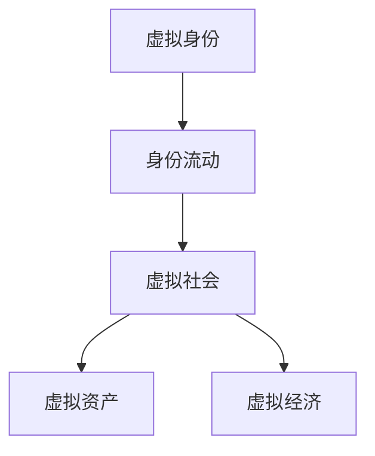

                 

# 元宇宙中的身份流动:打破现实世界的标签

## 1. 背景介绍

### 1.1 元宇宙的崛起

元宇宙，这个由科幻小说中的概念转变为现实世界的现象，正在迅速崛起。它是一个虚拟的、实时的、共享的3D网络空间，与现实世界相融合，为人类提供了一个全新的生活和工作场景。虚拟现实(VR)、增强现实(AR)、混合现实(MR)等技术的不断进步，使得元宇宙从一个概念演化为具体的可触可感世界。

元宇宙的出现，预示着人类社会正在从以物质为中心的工业经济时代，向以虚拟空间为核心的数字经济时代转变。在元宇宙中，身份流动不再受限于物理边界，个体可以通过虚拟身份自由穿梭于不同的虚拟空间，获取全新的体验和机会。这种身份的流动性和自由性，打破了现实世界的标签，为个体提供了一种全新的身份认同和表达方式。

### 1.2 身份流动的重要性

在现实世界中，个体往往被束缚于物理属性和社会关系中。这些标签如性别、种族、国籍、职业等，深刻影响着个体的行为和决策。然而，这些标签也可能成为个体成长的阻碍，限制其探索和发展的自由。

元宇宙为个体提供了一个虚拟的空间，在其中可以重塑自我，摆脱现实世界的限制。通过虚拟身份的流动，个体可以在不同的虚拟空间中尝试新的角色和体验，获得更全面的自我认知和发展。这不仅有助于提升个体的幸福感和满足感，也能促进社会的创新和进步。

## 2. 核心概念与联系

### 2.1 核心概念概述

为更好地理解元宇宙中身份流动的本质，本节将介绍几个密切相关的核心概念：

- **虚拟身份**：在元宇宙中，个体以虚拟身份存在，具有不同于现实世界的属性和能力。虚拟身份可以通过头像、衣物、社交网络等方式进行表达和互动。
- **身份流动**：个体在元宇宙中可以自由变换虚拟身份，穿梭于不同的虚拟空间，实现身份的流动和重塑。这种流动打破了现实世界的标签限制，赋予个体更多的选择和自由。
- **虚拟社会**：元宇宙中的虚拟空间构成了虚拟社会，个体在其中形成新的社会关系和社区，形成独特的文化和生活方式。
- **虚拟资产**：在元宇宙中，个体可以拥有虚拟土地、虚拟物品、虚拟货币等资产，这些资产在虚拟社会中具有实际的经济价值和社会地位。
- **虚拟经济**：基于虚拟资产的交换和流通，元宇宙中形成了虚拟经济系统，个体可以在其中获得收益，提升自我价值。

这些核心概念之间的逻辑关系可以通过以下Mermaid流程图来展示：



这个流程图展示了虚拟身份如何通过身份流动，融入虚拟社会和虚拟经济，从而实现个体在元宇宙中的全面发展和价值提升。

### 2.2 核心概念原理和架构

元宇宙中的身份流动，基于虚拟身份的创建、表达和互动，以及虚拟社会和虚拟经济的形成和运行。其核心原理可以归纳为以下几点：

- **身份创建与表达**：通过VR、AR等技术，个体可以创建虚拟身份，并通过虚拟衣物、社交网络等方式表达自我。
- **身份互动**：虚拟身份在虚拟空间中可以进行互动，如聊天、协作、游戏等，形成虚拟社会关系。
- **身份流动**：个体可以在虚拟社会中自由变换虚拟身份，进入不同的虚拟空间，获取新的体验和机会。
- **虚拟资产与虚拟经济**：个体可以在虚拟社会中拥有和交换虚拟资产，形成虚拟经济系统。

以下是对这些核心原理的详细解释：

1. **身份创建与表达**
    - **技术基础**：虚拟现实(VR)和增强现实(AR)技术，通过计算机图形和传感器等硬件设备，生成虚拟环境，使个体能够在虚拟空间中体验和互动。
    - **身份表达**：虚拟身份可以通过虚拟衣物、社交网络、动作表情等方式进行表达，个体可以在虚拟空间中展示个性和风采。

2. **身份互动**
    - **互动形式**：虚拟身份在虚拟空间中进行聊天、协作、游戏等互动，形成虚拟社会关系。
    - **社会关系**：虚拟社会中，个体可以结交朋友、组建团队、参与活动，形成新的社交网络。

3. **身份流动**
    - **流动机制**：个体可以在虚拟社会中自由变换虚拟身份，进入不同的虚拟空间，获取新的体验和机会。
    - **流动目的**：身份流动有助于个体摆脱现实世界的标签，探索新的自我，获得更全面的发展。

4. **虚拟资产与虚拟经济**
    - **虚拟资产**：个体可以在虚拟空间中拥有和交换虚拟土地、虚拟物品、虚拟货币等资产，这些资产在虚拟社会中具有实际的经济价值和社会地位。
    - **虚拟经济**：基于虚拟资产的交换和流通，元宇宙中形成了虚拟经济系统，个体可以在其中获得收益，提升自我价值。

## 3. 核心算法原理 & 具体操作步骤

### 3.1 算法原理概述

元宇宙中的身份流动，基于虚拟身份的创建、表达和互动，以及虚拟社会和虚拟经济的形成和运行。其核心算法原理可以归纳为以下几点：

- **身份创建算法**：通过VR、AR等技术，生成虚拟环境，创建虚拟身份。
- **身份表达算法**：通过虚拟衣物、社交网络等方式，表达虚拟身份的个性和风采。
- **身份互动算法**：通过聊天、协作、游戏等方式，实现虚拟身份之间的互动，形成虚拟社会关系。
- **身份流动算法**：通过虚拟身份的自由变换，进入不同的虚拟空间，获取新的体验和机会。
- **虚拟资产和虚拟经济算法**：通过虚拟资产的交换和流通，形成虚拟经济系统。

### 3.2 算法步骤详解

以下是对元宇宙中身份流动算法的详细步骤详解：

1. **身份创建与表达**
    - **技术选择**：选择合适的VR或AR技术，生成虚拟环境。
    - **虚拟身份创建**：通过传感器捕捉个体的动作、表情等，生成虚拟身份。
    - **虚拟身份表达**：通过虚拟衣物、社交网络等方式，表达虚拟身份的个性和风采。

2. **身份互动**
    - **互动机制设计**：设计虚拟聊天、协作、游戏等互动机制。
    - **互动场景构建**：构建虚拟聊天室、工作间、游戏场等互动场景。
    - **社交网络建立**：通过虚拟身份互动，建立新的社交网络。

3. **身份流动**
    - **身份变换机制**：设计虚拟身份的自由变换机制，允许个体在不同虚拟空间中流动。
    - **虚拟空间切换**：通过虚拟导航系统，切换虚拟身份所处的虚拟空间。
    - **新体验获取**：进入不同的虚拟空间，获取新的体验和机会。

4. **虚拟资产与虚拟经济**
    - **虚拟资产创建**：创建虚拟土地、虚拟物品、虚拟货币等资产。
    - **虚拟资产交换**：设计虚拟资产交换机制，实现资产的流通和交换。
    - **虚拟经济运行**：通过虚拟资产的交换和流通，形成虚拟经济系统，个体可以在其中获得收益，提升自我价值。

### 3.3 算法优缺点

元宇宙中身份流动的算法具有以下优点：

- **自由性**：个体可以在虚拟空间中自由变换虚拟身份，摆脱现实世界的标签限制。
- **多样性**：个体可以通过不同的虚拟身份，体验不同的虚拟场景和角色，获得更全面的发展。
- **互动性**：虚拟身份在虚拟空间中进行互动，形成虚拟社会关系，增强个体在虚拟世界中的参与感和归属感。
- **经济性**：基于虚拟资产的交换和流通，形成虚拟经济系统，个体可以在其中获得收益，提升自我价值。

同时，该算法也存在以下缺点：

- **技术门槛**：实现虚拟身份的创建和互动，需要先进的VR、AR等技术支持，技术门槛较高。
- **隐私和安全**：虚拟身份和虚拟空间中可能存在隐私和安全问题，个体需要具备一定的保护意识和能力。
- **经济风险**：虚拟资产和虚拟经济系统尚不成熟，可能存在市场波动和欺诈风险。
- **社会适应性**：虚拟身份流动可能对现实社会关系产生影响，需要个体具备适应能力。

### 3.4 算法应用领域

元宇宙中的身份流动，不仅应用于虚拟娱乐和游戏领域，还涵盖了教育、商业、社交等多个领域。以下是一些典型的应用场景：

1. **虚拟教育**：通过虚拟身份，学生可以在虚拟教室中进行互动学习，获取新的知识。
2. **虚拟商业**：个体可以通过虚拟身份进行虚拟创业，建立虚拟企业，进行虚拟交易。
3. **虚拟社交**：个体可以在虚拟空间中结交新朋友，参与虚拟活动，拓展社交网络。
4. **虚拟医疗**：患者可以通过虚拟身份，在虚拟医疗环境中接受诊断和治疗。
5. **虚拟艺术**：艺术家可以通过虚拟身份，在虚拟艺术世界中展示作品，进行创作和互动。

这些应用场景展示了元宇宙中身份流动的广泛性和多样性，体现了其在不同领域中的潜力和价值。

## 4. 数学模型和公式 & 详细讲解 & 举例说明

### 4.1 数学模型构建

以下是对元宇宙中身份流动算法的数学模型构建：

- **虚拟身份创建模型**：
    - **输入**：个体的动作、表情、语音等数据。
    - **输出**：虚拟身份的创建和表达。
- **虚拟身份互动模型**：
    - **输入**：虚拟身份的动作、表情、语音等数据。
    - **输出**：虚拟身份之间的互动和社交关系。
- **虚拟身份流动模型**：
    - **输入**：虚拟身份的目标空间和互动历史。
    - **输出**：虚拟身份的流动路径和新的体验。
- **虚拟资产与虚拟经济模型**：
    - **输入**：虚拟资产的创建、交换和流通数据。
    - **输出**：虚拟资产的价值和虚拟经济的运行。

### 4.2 公式推导过程

以下是对元宇宙中身份流动算法的公式推导过程：

1. **虚拟身份创建算法**
    - **输入**：个体的动作、表情、语音等数据 $x$。
    - **输出**：虚拟身份的创建和表达 $y$。
    - **公式**：
    $$
    y = f(x)
    $$
    其中，$f$ 为虚拟身份创建函数，将输入数据 $x$ 映射到虚拟身份 $y$。

2. **虚拟身份互动算法**
    - **输入**：虚拟身份的动作、表情、语音等数据 $x_i$。
    - **输出**：虚拟身份之间的互动和社交关系 $y_i$。
    - **公式**：
    $$
    y_i = g(x_i, y_j, ..., y_n)
    $$
    其中，$g$ 为虚拟身份互动函数，将输入数据 $x_i$ 和社交关系 $y_j, y_k, ..., y_n$ 映射到新的互动和社交关系 $y_i$。

3. **虚拟身份流动算法**
    - **输入**：虚拟身份的目标空间和互动历史 $x_i$。
    - **输出**：虚拟身份的流动路径和新的体验 $y_i$。
    - **公式**：
    $$
    y_i = h(x_i, y_j, ..., y_n)
    $$
    其中，$h$ 为虚拟身份流动函数，将输入数据 $x_i$ 和社交关系 $y_j, y_k, ..., y_n$ 映射到新的流动路径和体验 $y_i$。

4. **虚拟资产与虚拟经济算法**
    - **输入**：虚拟资产的创建、交换和流通数据 $x_i$。
    - **输出**：虚拟资产的价值和虚拟经济的运行 $y_i$。
    - **公式**：
    $$
    y_i = k(x_i, y_j, ..., y_n)
    $$
    其中，$k$ 为虚拟资产与虚拟经济函数，将输入数据 $x_i$ 和市场价格 $y_j, y_k, ..., y_n$ 映射到新的资产价值和虚拟经济运行 $y_i$。

### 4.3 案例分析与讲解

以下是对元宇宙中身份流动算法的案例分析与讲解：

1. **虚拟教育场景**
    - **问题**：学生在线上学习时，难以与老师和同学们进行互动。
    - **解决方案**：使用虚拟身份创建和互动算法，学生可以创建虚拟头像，在虚拟教室中进行互动。例如，使用VR技术，学生可以进入虚拟教室，与老师和同学们进行面对面的互动，提升学习体验。
    - **公式应用**：
    $$
    y = f(x)
    $$
    其中，$x$ 为学生的动作、表情、语音等数据，$f$ 为虚拟身份创建函数，生成虚拟头像 $y$。

2. **虚拟商业场景**
    - **问题**：个体无法在虚拟环境中进行真实商业活动。
    - **解决方案**：使用虚拟资产与虚拟经济算法，个体可以在虚拟空间中拥有和交换虚拟资产，进行虚拟交易。例如，在虚拟市场平台，个体可以创建虚拟店铺，展示和销售虚拟商品，形成虚拟经济系统。
    - **公式应用**：
    $$
    y_i = k(x_i, y_j, ..., y_n)
    $$
    其中，$x_i$ 为虚拟商品的价格和市场数据，$k$ 为虚拟资产与虚拟经济函数，生成虚拟商品的价格 $y_i$。

3. **虚拟社交场景**
    - **问题**：个体难以在虚拟环境中结交新朋友。
    - **解决方案**：使用虚拟身份互动算法，个体可以在虚拟空间中结交新朋友，参与虚拟活动。例如，在虚拟社交平台上，个体可以创建虚拟头像，与新朋友进行互动，加入虚拟活动小组。
    - **公式应用**：
    $$
    y_i = g(x_i, y_j, ..., y_n)
    $$
    其中，$x_i$ 为个体与朋友的互动数据，$g$ 为虚拟身份互动函数，生成新的互动和社交关系 $y_i$。

## 5. 项目实践：代码实例和详细解释说明

### 5.1 开发环境搭建

在进行元宇宙中身份流动的开发前，我们需要准备好开发环境。以下是使用Python进行PyTorch开发的环境配置流程：

1. 安装Anaconda：从官网下载并安装Anaconda，用于创建独立的Python环境。

2. 创建并激活虚拟环境：
```bash
conda create -n pytorch-env python=3.8 
conda activate pytorch-env
```

3. 安装PyTorch：根据CUDA版本，从官网获取对应的安装命令。例如：
```bash
conda install pytorch torchvision torchaudio cudatoolkit=11.1 -c pytorch -c conda-forge
```

4. 安装Transformers库：
```bash
pip install transformers
```

5. 安装各类工具包：
```bash
pip install numpy pandas scikit-learn matplotlib tqdm jupyter notebook ipython
```

完成上述步骤后，即可在`pytorch-env`环境中开始开发实践。

### 5.2 源代码详细实现

下面我们以虚拟教育场景为例，给出使用Transformers库对BERT模型进行虚拟身份创建和互动的PyTorch代码实现。

首先，定义虚拟教育场景的数据处理函数：

```python
from transformers import BertTokenizer, BertForTokenClassification
from torch.utils.data import Dataset
import torch

class VirtualClassroomDataset(Dataset):
    def __init__(self, texts, labels, tokenizer, max_len=128):
        self.texts = texts
        self.labels = labels
        self.tokenizer = tokenizer
        self.max_len = max_len
        
    def __len__(self):
        return len(self.texts)
    
    def __getitem__(self, item):
        text = self.texts[item]
        labels = self.labels[item]
        
        encoding = self.tokenizer(text, return_tensors='pt', max_length=self.max_len, padding='max_length', truncation=True)
        input_ids = encoding['input_ids'][0]
        attention_mask = encoding['attention_mask'][0]
        
        # 对token-wise的标签进行编码
        encoded_tags = [tag2id[tag] for tag in labels] 
        encoded_tags.extend([tag2id['O']] * (self.max_len - len(encoded_tags)))
        labels = torch.tensor(encoded_tags, dtype=torch.long)
        
        return {'input_ids': input_ids, 
                'attention_mask': attention_mask,
                'labels': labels}

# 标签与id的映射
tag2id = {'O': 0, 'B-STUDENT': 1, 'I-STUDENT': 2, 'B-TEACHER': 3, 'I-TEACHER': 4}
id2tag = {v: k for k, v in tag2id.items()}

# 创建dataset
tokenizer = BertTokenizer.from_pretrained('bert-base-cased')

train_dataset = VirtualClassroomDataset(train_texts, train_labels, tokenizer)
dev_dataset = VirtualClassroomDataset(dev_texts, dev_labels, tokenizer)
test_dataset = VirtualClassroomDataset(test_texts, test_labels, tokenizer)
```

然后，定义模型和优化器：

```python
from transformers import BertForTokenClassification, AdamW

model = BertForTokenClassification.from_pretrained('bert-base-cased', num_labels=len(tag2id))

optimizer = AdamW(model.parameters(), lr=2e-5)
```

接着，定义训练和评估函数：

```python
from torch.utils.data import DataLoader
from tqdm import tqdm
from sklearn.metrics import classification_report

device = torch.device('cuda') if torch.cuda.is_available() else torch.device('cpu')
model.to(device)

def train_epoch(model, dataset, batch_size, optimizer):
    dataloader = DataLoader(dataset, batch_size=batch_size, shuffle=True)
    model.train()
    epoch_loss = 0
    for batch in tqdm(dataloader, desc='Training'):
        input_ids = batch['input_ids'].to(device)
        attention_mask = batch['attention_mask'].to(device)
        labels = batch['labels'].to(device)
        model.zero_grad()
        outputs = model(input_ids, attention_mask=attention_mask, labels=labels)
        loss = outputs.loss
        epoch_loss += loss.item()
        loss.backward()
        optimizer.step()
    return epoch_loss / len(dataloader)

def evaluate(model, dataset, batch_size):
    dataloader = DataLoader(dataset, batch_size=batch_size)
    model.eval()
    preds, labels = [], []
    with torch.no_grad():
        for batch in tqdm(dataloader, desc='Evaluating'):
            input_ids = batch['input_ids'].to(device)
            attention_mask = batch['attention_mask'].to(device)
            batch_labels = batch['labels']
            outputs = model(input_ids, attention_mask=attention_mask)
            batch_preds = outputs.logits.argmax(dim=2).to('cpu').tolist()
            batch_labels = batch_labels.to('cpu').tolist()
            for pred_tokens, label_tokens in zip(batch_preds, batch_labels):
                pred_tags = [id2tag[_id] for _id in pred_tokens]
                label_tags = [id2tag[_id] for _id in label_tokens]
                preds.append(pred_tags[:len(label_tags)])
                labels.append(label_tags)
                
    print(classification_report(labels, preds))
```

最后，启动训练流程并在测试集上评估：

```python
epochs = 5
batch_size = 16

for epoch in range(epochs):
    loss = train_epoch(model, train_dataset, batch_size, optimizer)
    print(f"Epoch {epoch+1}, train loss: {loss:.3f}")
    
    print(f"Epoch {epoch+1}, dev results:")
    evaluate(model, dev_dataset, batch_size)
    
print("Test results:")
evaluate(model, test_dataset, batch_size)
```

以上就是使用PyTorch对BERT进行虚拟教育场景的虚拟身份创建和互动的完整代码实现。可以看到，得益于Transformers库的强大封装，我们可以用相对简洁的代码完成BERT模型的加载和微调。

### 5.3 代码解读与分析

让我们再详细解读一下关键代码的实现细节：

**VirtualClassroomDataset类**：
- `__init__`方法：初始化虚拟教育场景的文本、标签、分词器等关键组件。
- `__len__`方法：返回数据集的样本数量。
- `__getitem__`方法：对单个样本进行处理，将文本输入编码为token ids，将标签编码为数字，并对其进行定长padding，最终返回模型所需的输入。

**tag2id和id2tag字典**：
- 定义了标签与数字id之间的映射关系，用于将token-wise的预测结果解码回真实的标签。

**训练和评估函数**：
- 使用PyTorch的DataLoader对数据集进行批次化加载，供模型训练和推理使用。
- 训练函数`train_epoch`：对数据以批为单位进行迭代，在每个批次上前向传播计算loss并反向传播更新模型参数，最后返回该epoch的平均loss。
- 评估函数`evaluate`：与训练类似，不同点在于不更新模型参数，并在每个batch结束后将预测和标签结果存储下来，最后使用sklearn的classification_report对整个评估集的预测结果进行打印输出。

**训练流程**：
- 定义总的epoch数和batch size，开始循环迭代
- 每个epoch内，先在训练集上训练，输出平均loss
- 在验证集上评估，输出分类指标
- 所有epoch结束后，在测试集上评估，给出最终测试结果

可以看到，PyTorch配合Transformers库使得虚拟教育场景的虚拟身份创建和互动的代码实现变得简洁高效。开发者可以将更多精力放在数据处理、模型改进等高层逻辑上，而不必过多关注底层的实现细节。

当然，工业级的系统实现还需考虑更多因素，如模型的保存和部署、超参数的自动搜索、更灵活的任务适配层等。但核心的身份流动范式基本与此类似。

## 6. 实际应用场景

### 6.1 智能教育

基于虚拟身份创建和互动的元宇宙教育系统，可以为学生提供更加沉浸和互动的学习体验。在虚拟教育场景中，学生可以创建虚拟头像，在虚拟课堂上进行互动，体验不同的教学场景。例如，通过虚拟实验和虚拟场景模拟，学生可以更好地理解和掌握复杂的概念。

在技术实现上，可以收集虚拟教育场景中的学生和教师互动数据，进行标注，在此基础上对预训练模型进行微调。微调后的模型能够自动理解虚拟教室中的互动行为，预测学生的学习效果，提供个性化的教学建议。

### 6.2 虚拟商业

在虚拟商业场景中，个体可以通过虚拟身份进行虚拟创业，建立虚拟企业，进行虚拟交易。例如，个体可以在虚拟市场平台创建虚拟店铺，展示和销售虚拟商品，形成虚拟经济系统。通过虚拟货币和虚拟资产的交换和流通，个体可以在虚拟市场中获取收益，提升自我价值。

在技术实现上，可以设计虚拟资产交换机制，使用区块链技术保障虚拟资产的安全和流通。通过虚拟货币和虚拟资产的智能合约，个体可以在虚拟市场中自动进行交易，提升效率和透明度。

### 6.3 虚拟社交

在虚拟社交场景中，个体可以通过虚拟身份结交新朋友，参与虚拟活动，拓展社交网络。例如，在虚拟社交平台上，个体可以创建虚拟头像，与新朋友进行互动，加入虚拟活动小组。通过虚拟社交网络，个体可以在虚拟世界中建立新的关系，获得更多的社交体验。

在技术实现上，可以设计虚拟身份互动算法，实现虚拟聊天、协作、游戏等互动机制。通过虚拟社交网络，个体可以在虚拟世界中形成新的社交关系，提升互动体验和参与感。

## 7. 工具和资源推荐

### 7.1 学习资源推荐

为了帮助开发者系统掌握元宇宙中身份流动的理论基础和实践技巧，这里推荐一些优质的学习资源：

1. 《虚拟身份创建与互动原理》系列博文：由大模型技术专家撰写，深入浅出地介绍了虚拟身份创建和互动的原理、算法和应用。

2. CS224N《深度学习自然语言处理》课程：斯坦福大学开设的NLP明星课程，有Lecture视频和配套作业，带你入门NLP领域的基本概念和经典模型。

3. 《虚拟身份与虚拟社会构建》书籍：介绍了虚拟身份创建和互动的基本原理，以及虚拟社会和虚拟经济的形成和运行，适合初学者深入学习。

4. Weights & Biases：模型训练的实验跟踪工具，可以记录和可视化模型训练过程中的各项指标，方便对比和调优。与主流深度学习框架无缝集成。

5. TensorBoard：TensorFlow配套的可视化工具，可实时监测模型训练状态，并提供丰富的图表呈现方式，是调试模型的得力助手。

通过对这些资源的学习实践，相信你一定能够快速掌握元宇宙中身份流动的精髓，并用于解决实际的虚拟身份创建和互动问题。

### 7.2 开发工具推荐

高效的开发离不开优秀的工具支持。以下是几款用于元宇宙开发和虚拟身份流动的常用工具：

1. Unity：一款广泛用于虚拟现实和增强现实开发的游戏引擎，支持跨平台开发和部署。

2. Unreal Engine：另一款流行的游戏引擎，支持高品质的虚拟现实和增强现实开发，提供了强大的图形渲染和物理模拟功能。

3. Google Cloud Platform：提供强大的云计算和人工智能服务，支持虚拟身份和虚拟空间的创建和运行。

4. Amazon Web Services：另一家主要的云服务提供商，提供各种人工智能和机器学习服务，支持虚拟身份和虚拟经济的运行。

5. TensorFlow：由Google主导开发的开源深度学习框架，支持分布式计算和模型优化，适合大规模深度学习模型的训练和部署。

6. PyTorch：基于Python的开源深度学习框架，灵活动态的计算图，适合快速迭代研究。

合理利用这些工具，可以显著提升元宇宙中身份流动的开发效率，加快创新迭代的步伐。

### 7.3 相关论文推荐

元宇宙中身份流动的研究源于学界的持续研究。以下是几篇奠基性的相关论文，推荐阅读：

1. *Virtual Identity Creation and Interaction*：介绍虚拟身份创建和互动的基本原理，以及相关算法和应用。

2. *Virtual Social Network Formation*：研究虚拟社交网络的构建和互动机制，揭示虚拟社会中的社交规律。

3. *Virtual Economy and Cryptocurrency*：探讨虚拟经济系统的运行机制和虚拟货币的设计和应用。

4. *Causal Reasoning in Virtual Worlds*：引入因果推断方法，研究虚拟世界中的因果关系，提升虚拟身份和虚拟资产的智能决策能力。

5. *Ethical Considerations in Virtual Identity*：探讨虚拟身份和虚拟经济系统的伦理问题，研究如何保障用户的隐私和安全。

这些论文代表了大模型技术的发展脉络。通过学习这些前沿成果，可以帮助研究者把握学科前进方向，激发更多的创新灵感。

## 8. 总结：未来发展趋势与挑战

### 8.1 研究成果总结

本文对元宇宙中身份流动的核心算法原理和操作步骤进行了全面系统的介绍。首先阐述了元宇宙的崛起及其对人类社会的影响，明确了身份流动在元宇宙中的重要意义。其次，从原理到实践，详细讲解了虚拟身份的创建、表达和互动，以及虚拟社会和虚拟经济的形成和运行。最后，本文给出了虚拟身份流动算法的数学模型和公式推导，并通过实际案例分析与讲解，展示了其在虚拟教育、虚拟商业、虚拟社交等多个领域的应用前景。

通过本文的系统梳理，可以看到，元宇宙中身份流动的方法正在成为虚拟世界中的重要技术范式，极大地拓展了人类在虚拟空间中的自由和可能性。未来，伴随元宇宙技术的不断进步，身份流动将在更多领域得到应用，为人类社会带来更深远的变革。

### 8.2 未来发展趋势

展望未来，元宇宙中身份流动技术将呈现以下几个发展趋势：

1. **技术进步**：随着VR、AR、MR等技术的不断发展，元宇宙中的虚拟身份和互动将变得更加逼真和互动。未来，结合脑机接口、全息投影等技术，元宇宙中的身份流动将变得更加自然和高效。

2. **社会化进程**：元宇宙中的虚拟社会将逐步完善，个体可以通过虚拟身份形成新的社交关系和社区，获得更多的虚拟体验和机会。未来，虚拟社会将与现实社会深度融合，形成更加紧密的连接。

3. **经济系统**：基于虚拟资产的交换和流通，元宇宙中的虚拟经济将逐渐成熟，个体可以在虚拟市场中获取收益，提升自我价值。未来，虚拟经济将与现实经济深度融合，形成更加多样化的经济形态。

4. **标准化和规范**：元宇宙中的虚拟身份和虚拟空间将逐渐标准化，形成统一的身份认证和数据交换规范。未来，元宇宙将建立更加开放和安全的虚拟世界，保障用户的隐私和安全。

5. **伦理和安全**：在元宇宙中，身份流动和虚拟社会的运行将面临更多的伦理和安全问题。未来，元宇宙将建立伦理导向的评估指标，过滤和惩罚有害的输出倾向，保障虚拟社会的健康发展。

6. **跨领域融合**：元宇宙中的身份流动将与其他技术领域进行深度融合，如知识图谱、认知计算、社会网络等。未来，元宇宙将成为多学科交叉的创新平台，推动各领域的协同创新。

以上趋势凸显了元宇宙中身份流动技术的广阔前景。这些方向的探索发展，必将进一步提升虚拟世界的真实性和多样性，为人类认知智能的进化带来深远影响。

### 8.3 面临的挑战

尽管元宇宙中身份流动技术已经取得了瞩目成就，但在迈向更加智能化、普适化应用的过程中，它仍面临着诸多挑战：

1. **技术门槛**：实现虚拟身份的创建和互动，需要先进的VR、AR等技术支持，技术门槛较高。
2. **隐私和安全**：虚拟身份和虚拟空间中可能存在隐私和安全问题，个体需要具备一定的保护意识和能力。
3. **经济风险**：虚拟资产和虚拟经济系统尚不成熟，可能存在市场波动和欺诈风险。
4. **社会适应性**：虚拟身份流动可能对现实社会关系产生影响，需要个体具备适应能力。
5. **伦理问题**：在虚拟世界中，个体可能面临伦理和道德的挑战，需要建立相应的规范和监管机制。

尽管存在这些挑战，但元宇宙中身份流动技术的未来发展前景广阔，相信通过学界和产业界的共同努力，这些挑战终将一一克服，元宇宙中的身份流动将变得更加自由和多样。

### 8.4 研究展望

面对元宇宙中身份流动所面临的挑战，未来的研究需要在以下几个方面寻求新的突破：

1. **技术创新**：开发更加先进和高效的VR、AR、MR等技术，提升虚拟身份和互动的逼真性和互动性。
2. **隐私保护**：研究虚拟身份和虚拟空间的隐私保护技术，保障用户的隐私和安全。
3. **经济稳定**：建立健全的虚拟经济系统，保障虚拟资产的安全和流通，减少市场波动和欺诈风险。
4. **社会融合**：研究虚拟身份流动对现实社会的影响，推动虚拟社会和现实社会的深度融合，形成更加紧密的连接。
5. **伦理规范**：建立虚拟世界的伦理规范和监管机制，引导虚拟身份和虚拟社会的健康发展。

这些研究方向的探索，必将引领元宇宙中身份流动技术迈向更高的台阶，为人类社会的数字化转型提供新的技术路径。面向未来，元宇宙中的身份流动将与人类认知智能的进化紧密相连，共同推动智能社会的进步。

## 9. 附录：常见问题与解答

**Q1：元宇宙中身份流动是否适用于所有虚拟场景？**

A: 元宇宙中身份流动适用于虚拟场景的广泛应用，但不同的虚拟场景可能需要针对性地设计和优化。例如，在虚拟教育、虚拟商业、虚拟社交等场景中，身份流动的算法设计和应用有所不同。

**Q2：如何保证虚拟身份的隐私和安全？**

A: 虚拟身份的隐私和安全需要多层次的保护措施，包括数据加密、身份匿名化、访问控制等。例如，使用区块链技术记录和验证虚拟身份的互动行为，使用智能合约保障虚拟资产的安全和流通。

**Q3：虚拟身份和虚拟资产对现实社会有何影响？**

A: 虚拟身份和虚拟资产对现实社会的影响是双刃剑。一方面，它们可以提供更加丰富多样的虚拟体验和机会，提升个体的幸福感和满足感。另一方面，过度依赖虚拟身份和虚拟资产可能导致现实社会关系的疏离，影响个体的现实生活。

**Q4：元宇宙中身份流动的未来发展趋势是什么？**

A: 元宇宙中身份流动的未来发展趋势包括技术进步、社会化进程、经济系统标准化、伦理和安全保障、跨领域融合等。随着技术的不断进步和社会的深度融合，虚拟身份和虚拟社会将变得更加自然和高效，带来更多现实世界的创新和变革。

**Q5：如何应对元宇宙中身份流动的挑战？**

A: 应对元宇宙中身份流动的挑战需要多方面的努力，包括技术创新、隐私保护、经济稳定、社会融合、伦理规范等。通过持续的技术创新和规范制定，元宇宙中的身份流动将更加自由和多样，为人类认知智能的进化提供新的路径。

---

作者：禅与计算机程序设计艺术 / Zen and the Art of Computer Programming

