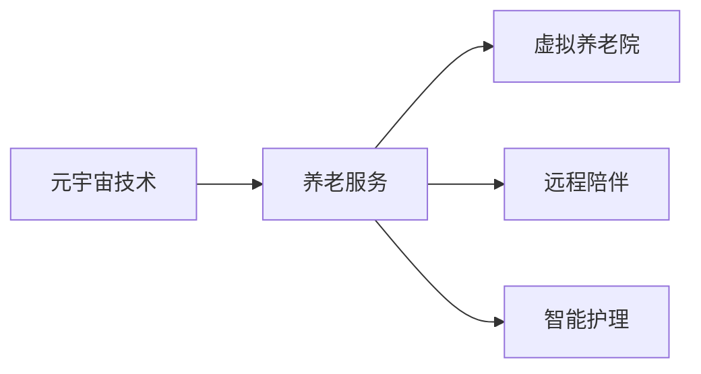

                 

## 1. 背景介绍

随着社会的老龄化程度不断加深，养老问题日益成为全球关注的焦点。如何在保障老年人生活质量的同时，降低家庭和社会的养老负担，是各国政府和全社会共同面临的挑战。元宇宙技术作为新兴的数字空间，以其高度沉浸、虚拟交互的特性，为数字化养老提供了新的思路。

### 1.1 现状分析

当前，养老服务的传统模式主要依赖于家庭成员和专业养老机构，但受限于资源分布不均、专业人才不足等问题，养老服务的质量和效率难以满足所有老年人的需求。尤其是在疫情背景下，家庭探望和面对面交流的限制加剧了养老问题的紧迫性。

### 1.2 问题与挑战

1. **资源分配不均**：城市地区养老资源丰富，农村和偏远地区则资源匮乏，区域间养老服务不均衡。
2. **人才缺口巨大**：养老服务业专业人才稀缺，难以满足日益增长的养老服务需求。
3. **情感交流不足**：传统养老服务模式缺乏情感互动，老年人易感到孤独和孤立。
4. **服务效率低下**：人工养老服务流程繁琐，效率不高，难以应对大规模老年人群体的需求。

### 1.3 机遇与需求

元宇宙养老技术的出现，为解决上述问题提供了新的可能性。通过虚拟现实(VR)、增强现实(AR)、区块链等技术的结合，可以实现远程陪伴、虚拟养老院、在线医疗、智能护理等数字化养老服务。

## 2. 核心概念与联系

### 2.1 核心概念概述

元宇宙养老的核心概念包括：

- **元宇宙技术**：指通过虚拟现实、增强现实、区块链等技术构建的沉浸式数字空间。
- **养老服务**：指为老年人提供的日常生活照护、健康管理、心理疏导等服务。
- **虚拟养老院**：指以数字空间为依托，提供养老服务的虚拟社区。
- **远程陪伴**：指利用虚拟空间实现老年人与亲友的互动交流，减轻孤独感。
- **智能护理**：指通过智能设备和算法，实现养老服务的自动化和智能化。

这些概念之间存在密切联系，共同构成了元宇宙养老的技术框架。元宇宙技术提供了虚拟空间的基础设施，养老服务则依托这些基础设施，提供多样化的养老支持。虚拟养老院和远程陪伴进一步丰富了养老服务的形式和内容，智能护理则提升了养老服务的效率和质量。

### 2.2 核心概念原理和架构的 Mermaid 流程图



## 3. 核心算法原理 & 具体操作步骤

### 3.1 算法原理概述

元宇宙养老的核心算法原理主要包括：

1. **虚拟空间构建**：利用VR和AR技术，构建虚拟养老院和远程陪伴场景，为老年人提供沉浸式的养老环境。
2. **智能推荐系统**：基于用户的兴趣和行为数据，利用机器学习算法推荐个性化的养老服务内容，提升用户体验。
3. **情感分析与识别**：通过自然语言处理和图像识别技术，分析老年人的情感状态，提供相应的心理疏导和陪伴服务。
4. **健康监测与预警**：利用传感器和智能设备，实时监测老年人的健康数据，提供健康管理建议和紧急预警。
5. **区块链技术**：用于保护老年人的隐私和数据安全，确保养老服务的透明和可追溯。

这些算法原理共同支撑了元宇宙养老平台的正常运行，提供了高效、个性化、安全的养老服务。

### 3.2 算法步骤详解

1. **虚拟空间搭建**：选择合适的VR/AR平台，如Unity3D或Unreal Engine，搭建虚拟养老院环境。包括虚拟房间、虚拟活动、虚拟助手等，确保环境温馨、安全。
2. **智能推荐系统开发**：利用TensorFlow或PyTorch等深度学习框架，开发推荐系统，根据用户历史行为和偏好，推荐适合的养老服务内容和活动。
3. **情感分析与识别**：收集老年人的语音、表情、动作等数据，利用自然语言处理和计算机视觉技术，分析情感状态，实时调整养老服务策略。
4. **健康监测与预警**：安装智能设备和传感器，收集老年人的健康数据，如心率、血压、位置等，利用数据分析算法，提供健康管理建议，并根据异常数据触发预警机制。
5. **区块链应用**：搭建区块链平台，记录老年人的养老服务记录和交易，确保数据透明、可追溯，保护老年人隐私。

### 3.3 算法优缺点

**优点**：

- **提升用户体验**：虚拟养老院和远程陪伴能提供沉浸式的养老体验，缓解老年人的孤独感。
- **提高服务效率**：智能推荐系统和自动化护理可以大幅提升养老服务的效率和质量。
- **保障数据安全**：区块链技术能确保养老数据的隐私和安全，防止数据泄露和滥用。

**缺点**：

- **技术门槛高**：虚拟空间构建、智能推荐系统开发等技术要求高，需要专业的技术团队支持。
- **成本较高**：智能设备和传感器的部署、虚拟空间搭建和维护成本较高，对中小企业和小规模养老机构可能存在经济压力。
- **技术更新快**：养老服务涉及多种前沿技术，如VR、AR、区块链等，技术更新迭代快，需要持续投入研发。

### 3.4 算法应用领域

元宇宙养老技术主要应用于以下领域：

1. **虚拟养老院**：提供虚拟空间环境，老年人可以在虚拟养老院内进行社交、娱乐、健身等活动。
2. **远程陪伴**：通过VR头盔、智能音箱等设备，老年人可以与亲友进行虚拟交流，减轻孤独感。
3. **健康管理**：利用智能设备和健康监测系统，实时监测老年人的健康数据，提供健康管理建议。
4. **心理疏导**：通过情感分析技术，实时识别老年人的情绪状态，提供心理疏导和陪伴服务。
5. **紧急救援**：结合定位和传感器数据，实时监测老年人的位置和健康状况，提供紧急救援服务。

## 4. 数学模型和公式 & 详细讲解 & 举例说明

### 4.1 数学模型构建

元宇宙养老涉及的数学模型包括：

- **虚拟空间构建**：利用三维几何模型和纹理映射技术，构建虚拟养老院环境。
- **智能推荐系统**：基于协同过滤、深度学习等算法，构建推荐模型，推荐养老服务内容。
- **情感分析与识别**：利用自然语言处理和计算机视觉技术，构建情感分析模型，实时分析老年人情感状态。
- **健康监测与预警**：利用时序分析和统计学方法，构建健康监测模型，分析老年人健康数据。
- **区块链应用**：基于分布式共识算法，构建区块链平台，记录养老服务数据。

### 4.2 公式推导过程

以智能推荐系统为例，推导推荐模型的公式：

设养老服务内容集合为 $C$，老年人用户集合为 $U$，每个用户对每个内容的评分矩阵为 $R$。推荐系统目标为最大化用户的满意度，即最大化用户对推荐内容的评分之和。

推荐模型公式为：

$$
\max_{P} \sum_{u \in U} \sum_{i \in C} R_{ui} \log(P_{ui})
$$

其中 $P_{ui}$ 为内容 $i$ 被用户 $u$ 推荐的概率，可以通过协同过滤、矩阵分解等算法计算。

### 4.3 案例分析与讲解

假设某虚拟养老院提供了以下服务：社交聊天、健康监测、心理咨询、体育活动、休闲娱乐等。为每位老年人提供个性化推荐，需要构建推荐模型。

设 $C = \{$社交聊天, 健康监测, 心理咨询, 体育活动, 休闲娱乐\}$，$U$ 为 $n$ 位老年人。每位老年人对每项服务的评分向量为 $R_{u \cdot} = [r_{ui}]_{i=1}^5$。

通过协同过滤或矩阵分解算法，计算每位老年人对每项服务的推荐概率 $P_{ui}$。最后，将每位老年人的推荐概率与实际评分向量相乘，求和，得到总推荐评分：

$$
\text{总推荐评分} = \sum_{u \in U} \sum_{i \in C} R_{ui} \log(P_{ui})
$$

通过最大化总推荐评分，找到最符合每位老年人需求的养老服务内容。

## 5. 项目实践：代码实例和详细解释说明

### 5.1 开发环境搭建

开发元宇宙养老平台需要搭建虚拟空间、智能推荐系统、情感分析系统、健康监测系统和区块链平台。以下是开发环境的搭建步骤：

1. **虚拟空间搭建**：选择Unity3D或Unreal Engine，搭建虚拟养老院环境。
2. **智能推荐系统开发**：选择TensorFlow或PyTorch，开发协同过滤或深度学习推荐模型。
3. **情感分析与识别**：选择OpenCV和TensorFlow，构建情感分析模型，利用自然语言处理和计算机视觉技术，实时分析老年人情感状态。
4. **健康监测与预警**：选择IoT设备和传感器，安装智能设备和健康监测系统，利用数据分析算法，提供健康管理建议，并根据异常数据触发预警机制。
5. **区块链应用**：选择Hyperledger Fabric或Ethereum，搭建区块链平台，记录养老服务记录和交易。

### 5.2 源代码详细实现

以下是智能推荐系统的详细代码实现，利用TensorFlow进行协同过滤推荐算法：

```python
import tensorflow as tf

class CollaborativeFiltering(tf.keras.Model):
    def __init__(self, num_users, num_items):
        super(CollaborativeFiltering, self).__init__()
        self.num_users = num_users
        self.num_items = num_items
        self.user_factors = tf.Variable(tf.random.normal([num_users, num_items]))
        self.item_factors = tf.Variable(tf.random.normal([num_items, num_items]))
        
    def call(self, user_ids, item_ids):
        user_embeddings = tf.gather(self.user_factors, user_ids)
        item_embeddings = tf.gather(self.item_factors, item_ids)
        scores = tf.reduce_sum(tf.multiply(user_embeddings, item_embeddings), axis=-1)
        return scores
    
    def predict(self, user_ids, item_ids):
        scores = self.call(user_ids, item_ids)
        return tf.nn.softmax(scores)
    
# 数据准备
user_ids = tf.random.normal([100], minval=0, maxval=num_users)
item_ids = tf.random.normal([100], minval=0, maxval=num_items)
# 训练模型
model = CollaborativeFiltering(num_users, num_items)
model.compile(optimizer=tf.keras.optimizers.Adam(), loss='mse')
model.fit([user_ids, item_ids], labels)
# 预测推荐
user_ids_test = tf.random.normal([50], minval=0, maxval=num_users)
item_ids_test = tf.random.normal([50], minval=0, maxval=num_items)
predictions = model.predict(user_ids_test, item_ids_test)
```

### 5.3 代码解读与分析

**代码解读**：

1. **模型定义**：利用TensorFlow定义协同过滤推荐模型，包含用户因子变量 `user_factors` 和物品因子变量 `item_factors`。
2. **前向传播**：通过矩阵乘法计算用户和物品的评分，得到预测分数 `scores`。
3. **损失函数**：定义均方误差损失函数，用于优化模型。
4. **模型编译**：选择Adam优化器，编译模型。
5. **模型训练**：利用训练集数据 `(user_ids, item_ids)` 和标签 `labels` 进行模型训练。
6. **模型预测**：利用测试集数据 `user_ids_test` 和 `item_ids_test` 进行模型预测。

**代码分析**：

1. **数据生成**：生成随机用户和物品ID，作为模型的输入。
2. **模型训练**：使用均方误差损失函数，训练模型，更新用户和物品因子变量。
3. **模型预测**：根据测试集数据，预测每个用户对每个物品的评分概率，并利用softmax函数转换为概率分布。

## 6. 实际应用场景

### 6.1 虚拟养老院

虚拟养老院通过VR和AR技术，构建虚拟环境，提供多种养老服务。老年人可以在虚拟空间内自由活动，参加社交活动、健身训练、兴趣爱好小组等，提升生活质量，减轻孤独感。

### 6.2 远程陪伴

远程陪伴通过VR头盔、智能音箱等设备，使老年人与亲友进行虚拟交流，进行视频通话、语音聊天、虚拟旅游等活动，增强社交互动，缓解孤独感。

### 6.3 健康管理

利用智能设备和健康监测系统，实时监测老年人的健康数据，如心率、血压、位置等，提供健康管理建议，并根据异常数据触发预警机制。

### 6.4 心理疏导

通过情感分析技术，实时识别老年人的情绪状态，提供心理疏导和陪伴服务，如心理咨询、情感倾诉、情感支持等，缓解老年人的心理压力。

### 6.5 紧急救援

结合定位和传感器数据，实时监测老年人的位置和健康状况，提供紧急救援服务，如自动报警、呼救电话、远程监控等，确保老年人安全。

### 6.6 未来应用展望

未来，元宇宙养老技术将进一步发展，在以下几个方面取得突破：

1. **智能化程度提升**：通过引入人工智能、机器学习等技术，提升养老服务的智能化和个性化水平，如智能陪伴机器人、智能医疗设备等。
2. **跨界融合创新**：与其他技术如区块链、物联网、大数据等结合，推动养老服务的全面数字化转型。
3. **普及率提升**：降低技术门槛，提高养老服务的普及率和覆盖面，使更多老年人受益。
4. **社会参与度提升**：鼓励社会各界积极参与养老服务，形成全社会共同参与的养老格局。
5. **可持续发展**：通过数字化手段，实现养老资源的优化配置，提升养老服务的可持续发展能力。

## 7. 工具和资源推荐

### 7.1 学习资源推荐

1. **《深度学习基础》**：深度学习领域的经典教材，涵盖深度学习的基本概念和算法。
2. **Coursera《深度学习专业课程》**：由斯坦福大学和DeepMind合作开设，提供深度学习的系统学习路径。
3. **Kaggle竞赛平台**：提供丰富的养老数据集和竞赛题目，锻炼养老数据分析和机器学习技能。
4. **国内养老科技资讯网站**：如《养老中国》、《老龄产业观察》等，提供最新的养老科技资讯和研究报告。

### 7.2 开发工具推荐

1. **Unity3D**：强大的游戏引擎，适用于虚拟空间构建。
2. **Unreal Engine**：高端游戏引擎，支持大规模虚拟现实项目。
3. **TensorFlow**：开源机器学习框架，适用于智能推荐系统开发。
4. **PyTorch**：灵活的深度学习框架，适用于情感分析和健康监测模型开发。
5. **OpenCV**：开源计算机视觉库，适用于情感分析中的面部识别和表情识别。
6. **IoT平台**：如ThingWorx、ThingLink等，用于智能设备和传感器数据采集。

### 7.3 相关论文推荐

1. **《基于深度学习的养老服务推荐系统》**：利用深度学习算法，构建养老服务推荐系统。
2. **《虚拟养老院设计及技术应用》**：介绍虚拟养老院的设计原理和应用技术。
3. **《情感分析在养老服务中的应用》**：分析情感分析在养老服务中的作用和实现方法。
4. **《健康监测与预警在养老服务中的应用》**：介绍健康监测和预警系统的构建和应用。
5. **《区块链在养老服务中的应用》**：探讨区块链技术在养老服务中的数据安全和管理应用。

## 8. 总结：未来发展趋势与挑战

### 8.1 研究成果总结

元宇宙养老技术的研发已经取得了初步成果，但未来仍需不断优化和改进。现有技术在虚拟空间构建、智能推荐系统、情感分析、健康监测等方面存在一定局限性，需要进一步提升。同时，元宇宙养老技术的普及和应用仍面临诸多挑战，需要全社会的共同努力。

### 8.2 未来发展趋势

1. **技术融合创新**：元宇宙养老技术将与其他技术融合创新，如5G、物联网、区块链等，形成更全面的养老服务体系。
2. **个性化服务提升**：通过人工智能和机器学习，提升养老服务的个性化和智能化水平，满足老年人的多样化需求。
3. **社会参与度提升**：鼓励社会各界积极参与养老服务，形成全社会共同参与的养老格局。
4. **可持续发展**：通过数字化手段，实现养老资源的优化配置，提升养老服务的可持续发展能力。

### 8.3 面临的挑战

1. **技术门槛高**：元宇宙养老技术涉及多种前沿技术，如VR、AR、AI等，技术门槛高。
2. **成本较高**：智能设备和传感器的部署、虚拟空间搭建和维护成本较高，对中小企业和小规模养老机构可能存在经济压力。
3. **数据安全问题**：老年人的健康和隐私数据需要严格保护，防止数据泄露和滥用。
4. **用户体验问题**：虚拟养老院和远程陪伴系统需要提升用户体验，避免技术障碍和操作复杂性。
5. **技术更新快**：养老服务涉及多种前沿技术，技术更新迭代快，需要持续投入研发。

### 8.4 研究展望

未来，元宇宙养老技术的研究将聚焦于以下几个方面：

1. **提升技术可及性**：降低技术门槛，提高技术的普及率和应用度，使更多老年人受益。
2. **优化用户体验**：提升虚拟养老院和远程陪伴系统的用户体验，减少技术障碍和操作复杂性。
3. **保护数据安全**：建立完善的隐私保护机制，确保老年人的健康和隐私数据安全。
4. **推动跨界融合**：与其他技术如区块链、物联网、大数据等结合，推动养老服务的全面数字化转型。
5. **实现可持续发展**：通过数字化手段，实现养老资源的优化配置，提升养老服务的可持续发展能力。

总之，元宇宙养老技术的研究和应用，将为养老问题提供新的解决方案，提升老年人的生活质量，推动养老服务行业的数字化转型。

## 9. 附录：常见问题与解答

### Q1: 什么是元宇宙养老技术？

A: 元宇宙养老技术是一种基于虚拟现实、增强现实、人工智能等前沿技术，为老年人提供沉浸式、个性化、智能化养老服务的创新模式。通过构建虚拟养老院、提供远程陪伴、健康监测、心理疏导等服务，提升老年人的生活质量，缓解孤独感和健康问题。

### Q2: 元宇宙养老技术的主要优点是什么？

A: 元宇宙养老技术的主要优点包括：

1. **沉浸式体验**：通过虚拟现实和增强现实技术，为老年人提供沉浸式的养老环境，缓解孤独感。
2. **个性化服务**：利用人工智能和机器学习技术，提供个性化的养老服务，满足老年人的多样化需求。
3. **实时监测**：利用智能设备和传感器，实时监测老年人的健康数据，提供健康管理建议和紧急预警。
4. **数据安全**：通过区块链技术，保护老年人的隐私和数据安全，防止数据泄露和滥用。

### Q3: 元宇宙养老技术的主要挑战是什么？

A: 元宇宙养老技术的主要挑战包括：

1. **技术门槛高**：虚拟空间构建、智能推荐系统开发等技术要求高，需要专业的技术团队支持。
2. **成本较高**：智能设备和传感器的部署、虚拟空间搭建和维护成本较高，对中小企业和小规模养老机构可能存在经济压力。
3. **数据安全问题**：老年人的健康和隐私数据需要严格保护，防止数据泄露和滥用。
4. **用户体验问题**：虚拟养老院和远程陪伴系统需要提升用户体验，避免技术障碍和操作复杂性。
5. **技术更新快**：养老服务涉及多种前沿技术，技术更新迭代快，需要持续投入研发。

### Q4: 元宇宙养老技术的主要应用场景是什么？

A: 元宇宙养老技术的主要应用场景包括：

1. **虚拟养老院**：通过虚拟现实和增强现实技术，构建虚拟养老院环境，提供多种养老服务。
2. **远程陪伴**：通过VR头盔、智能音箱等设备，使老年人与亲友进行虚拟交流，缓解孤独感。
3. **健康管理**：利用智能设备和健康监测系统，实时监测老年人的健康数据，提供健康管理建议。
4. **心理疏导**：通过情感分析技术，实时识别老年人的情绪状态，提供心理疏导和陪伴服务。
5. **紧急救援**：结合定位和传感器数据，实时监测老年人的位置和健康状况，提供紧急救援服务。

### Q5: 未来元宇宙养老技术的发展方向是什么？

A: 未来元宇宙养老技术的发展方向包括：

1. **智能化程度提升**：通过引入人工智能、机器学习等技术，提升养老服务的智能化和个性化水平，如智能陪伴机器人、智能医疗设备等。
2. **跨界融合创新**：与其他技术如区块链、物联网、大数据等结合，推动养老服务的全面数字化转型。
3. **普及率提升**：降低技术门槛，提高养老服务的普及率和覆盖面，使更多老年人受益。
4. **社会参与度提升**：鼓励社会各界积极参与养老服务，形成全社会共同参与的养老格局。
5. **可持续发展**：通过数字化手段，实现养老资源的优化配置，提升养老服务的可持续发展能力。

总之，元宇宙养老技术的研究和应用，将为养老问题提供新的解决方案，提升老年人的生活质量，推动养老服务行业的数字化转型。

---

作者：禅与计算机程序设计艺术 / Zen and the Art of Computer Programming

