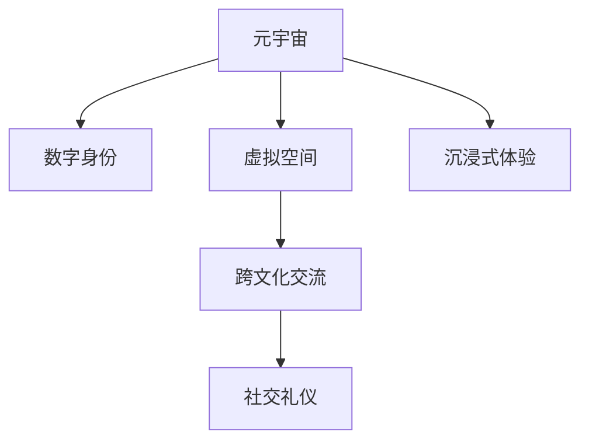

                 

# 元宇宙社交礼仪:虚拟世界的人际交往准则

> 关键词：元宇宙,社交礼仪,虚拟世界,人际交往准则,数字身份,虚拟现实,沉浸式体验

## 1. 背景介绍

### 1.1 问题由来

随着虚拟现实技术(VR)和增强现实技术(AR)的不断成熟，元宇宙(Utopia)这一概念逐渐浮出水面。它是一个全新的社交生态，用户可以创造自己的数字身份，进入一个完全虚拟化的空间中，进行工作、学习、娱乐等活动。元宇宙的崛起，预示着人类将进入一个全新的数字化生存时代，人们的社交行为和互动方式也将发生深刻变革。

然而，元宇宙的虚拟空间并非是无序的。如何构建一个健康、高效、友好的社交环境，成为元宇宙时代亟待解决的重要课题。社交礼仪，作为人际交往的基础准则，在虚拟世界中也同样重要。本文旨在探讨元宇宙社交礼仪的构建原则，为元宇宙用户提供实用指南，促进虚拟世界的和谐发展。

### 1.2 问题核心关键点

本文聚焦于以下几个核心关键点：

- **元宇宙社交礼仪：** 即虚拟世界中人际交往所应遵循的规范和准则。
- **数字身份：** 用户在虚拟世界中的虚拟形象，代表着用户的虚拟存在。
- **虚拟空间：** 元宇宙中用户可以互动的虚拟场所，如虚拟会议室、社交俱乐部等。
- **沉浸式体验：** 用户沉浸在虚拟世界中，进行全面感官互动的过程。
- **跨文化交流：** 不同国家和地区的用户，在元宇宙中进行跨文化交流和互动。

这些关键点共同构成了元宇宙社交礼仪的框架，为虚拟世界的人际交往提供指导和规范。

## 2. 核心概念与联系

### 2.1 核心概念概述

为更好地理解元宇宙社交礼仪，本节将介绍几个密切相关的核心概念：

- **元宇宙(Utopia)：** 一个由虚拟现实技术构建的、用户可以自由创造和互动的虚拟空间。
- **数字身份(Digital Identity)：** 用户在虚拟世界中的虚拟形象，代表了其在虚拟空间中的身份和权利。
- **虚拟空间(Virtual Space)：** 元宇宙中用户可以互动的虚拟场所，如虚拟会议室、社交俱乐部等。
- **沉浸式体验(Immersive Experience)：** 用户完全沉浸在虚拟世界中，进行全面感官互动的过程。
- **跨文化交流(Cross-cultural Interaction)：** 不同国家和地区的用户，在元宇宙中进行跨文化交流和互动。

这些概念之间的逻辑关系可以通过以下Mermaid流程图来展示：



这个流程图展示了几大核心概念之间的关联：

1. 元宇宙通过虚拟现实技术构建，包含数字身份和虚拟空间。
2. 数字身份在虚拟空间中进行互动，形成沉浸式体验。
3. 跨文化交流是虚拟空间中常见的互动方式。
4. 社交礼仪是跨文化交流的基础准则。

这些概念共同构成了元宇宙社交礼仪的核心框架，其构建原则和行为规范对虚拟世界的发展至关重要。

## 3. 核心算法原理 & 具体操作步骤
### 3.1 算法原理概述

元宇宙社交礼仪的核心算法原理，可以概括为以下几个步骤：

1. **数字身份构建：** 用户创建和自定义自己的虚拟形象，赋予其在虚拟空间中的身份和权限。
2. **虚拟空间设计：** 虚拟空间的设计者需要遵循一定的规范，确保空间的安全性和互动性。
3. **沉浸式体验优化：** 通过技术手段提升用户的沉浸感和互动体验。
4. **跨文化交流引导：** 构建跨文化交流的桥梁，促进不同文化背景用户间的理解和互动。
5. **社交礼仪制定：** 制定并推广元宇宙社交礼仪规范，确保虚拟世界的和谐稳定。

### 3.2 算法步骤详解

#### 3.2.1 数字身份构建

数字身份的构建是元宇宙社交礼仪的基础。用户可以通过各种平台创建自己的虚拟形象，包括自定义外观、服装、背景等。这一过程中，应遵循以下原则：

- **个性化与安全性：** 允许用户充分自定义虚拟形象，同时确保其隐私安全。
- **互动性与沉浸感：** 确保虚拟形象能够与虚拟环境和其他用户互动，带来沉浸式体验。
- **跨平台兼容性：** 保证在不同平台间可以无缝切换和使用，便于用户跨平台互动。

#### 3.2.2 虚拟空间设计

虚拟空间的设计，需遵循以下几个关键准则：

- **开放性与包容性：** 确保虚拟空间对所有用户开放，不论其文化背景、语言、信仰等。
- **功能性与便利性：** 提供实用的功能，如聊天室、会议系统、社交俱乐部等，提升用户体验。
- **安全性与监管：** 建立有效的安全机制和监管措施，防止不当行为和内容传播。
- **互动性与娱乐性：** 设计互动元素和娱乐内容，吸引用户长期互动。

#### 3.2.3 沉浸式体验优化

沉浸式体验的优化，涉及以下几个关键环节：

- **感官体验：** 利用视觉、听觉、触觉等多感官技术，提升用户体验。
- **交互设计：** 设计直观易用的交互界面，简化用户操作。
- **系统性能：** 优化服务器和网络性能，减少延迟和卡顿。
- **个性化推荐：** 根据用户偏好和历史行为，推荐个性化的内容和活动。

#### 3.2.4 跨文化交流引导

跨文化交流的引导，需从以下几个方面入手：

- **语言支持：** 提供多语言支持，促进不同语言背景用户间的交流。
- **文化理解：** 通过教育和文化交流活动，提高用户对不同文化的理解和尊重。
- **行为规范：** 制定并推广跨文化交流的行为规范，避免文化冲突。
- **技术支持：** 利用AI和机器翻译等技术，促进跨语言交流。

#### 3.2.5 社交礼仪制定

社交礼仪的制定，需遵循以下几个原则：

- **通用性与普遍性：** 制定适合所有用户的通用礼仪规范。
- **动态性与适应性：** 根据用户反馈和需求，灵活调整和优化礼仪规范。
- **强制性与指导性：** 部分礼仪规范需强制执行，部分则通过引导和教育实现。
- **多元性与包容性：** 尊重不同文化背景用户的需求和习惯，制定多元化的礼仪规范。

### 3.3 算法优缺点

#### 3.3.1 优点

元宇宙社交礼仪的构建，具有以下几个优点：

- **提升用户体验：** 良好的社交礼仪可以提升用户的沉浸感和互动体验，增强用户粘性。
- **促进文化交流：** 跨文化交流的引导，有助于促进不同文化背景用户间的理解和互动，增强社会凝聚力。
- **保障安全稳定：** 严格的社交礼仪和监管措施，可以有效防止不当行为和内容传播，保障虚拟世界的安全稳定。

#### 3.3.2 缺点

然而，元宇宙社交礼仪的构建也面临以下挑战：

- **文化差异复杂：** 不同文化背景用户的需求和习惯差异巨大，难以制定统一的礼仪规范。
- **技术门槛较高：** 虚拟现实技术的复杂性，增加了礼仪规范的实施难度。
- **用户行为难以控制：** 用户在虚拟世界中的行为不受现实世界法律约束，礼仪规范的执行难度较大。
- **隐私和数据安全：** 用户数字身份和虚拟空间中的数据隐私和安全问题，仍需进一步解决。

### 3.4 算法应用领域

元宇宙社交礼仪的应用，涉及以下几个领域：

- **虚拟办公：** 在虚拟会议、培训和协作中，遵循社交礼仪规范，提升团队合作效率。
- **虚拟教育：** 在虚拟课堂和学术交流中，制定合适的礼仪规范，促进知识传播和学术交流。
- **虚拟娱乐：** 在虚拟游戏和社交活动中，遵循礼仪规范，创造健康和谐的互动环境。
- **虚拟商业：** 在虚拟商业和交易活动中，制定合理的礼仪规范，保障商业活动的正常进行。

这些领域都是元宇宙社交礼仪的重要应用场景，良好的礼仪规范可以有效提升用户体验和互动效率，促进虚拟世界的健康发展。

## 4. 数学模型和公式 & 详细讲解 & 举例说明

### 4.1 数学模型构建

本节将使用数学语言对元宇宙社交礼仪的构建进行更加严格的刻画。

假设元宇宙中的社交行为可以用以下符号表示：

- $I$：用户的数字身份
- $S$：虚拟空间
- $U$：用户的沉浸式体验
- $C$：跨文化交流
- $P$：社交礼仪

则元宇宙社交礼仪的构建过程可以用以下模型表示：

$$
P = f(I, S, U, C)
$$

其中，$f$为映射函数，表示社交礼仪构建过程。

### 4.2 公式推导过程

#### 4.2.1 数字身份构建

数字身份的构建过程可以用以下公式表示：

$$
I = g(D, P, A)
$$

其中：
- $D$：用户提供的个人数据
- $P$：用户自定义的个性化参数
- $A$：身份验证和授权机制

该公式表示，用户通过提供个人数据和自定义参数，经过身份验证和授权，创建自己的数字身份。

#### 4.2.2 虚拟空间设计

虚拟空间的设计过程可以用以下公式表示：

$$
S = h(I, C, T, R)
$$

其中：
- $I$：用户数字身份
- $C$：跨文化交流需求
- $T$：空间功能和技术要求
- $R$：安全监管措施

该公式表示，虚拟空间的设计者根据用户身份、跨文化需求、技术要求和安全监管措施，设计合适的虚拟空间。

#### 4.2.3 沉浸式体验优化

沉浸式体验的优化过程可以用以下公式表示：

$$
U = o(S, E, P, M)
$$

其中：
- $S$：虚拟空间
- $E$：环境感知和交互元素
- $P$：个性化推荐机制
- $M$：系统性能优化

该公式表示，通过环境感知、交互元素、个性化推荐和系统性能优化，提升用户的沉浸式体验。

#### 4.2.4 跨文化交流引导

跨文化交流的引导过程可以用以下公式表示：

$$
C = k(S, L, E, P)
$$

其中：
- $S$：虚拟空间
- $L$：多语言支持和翻译
- $E$：文化教育和交流活动
- $P$：行为规范和监管机制

该公式表示，通过多语言支持、文化教育、交流活动和行为规范，引导跨文化交流。

#### 4.2.5 社交礼仪制定

社交礼仪的制定过程可以用以下公式表示：

$$
P = n(I, S, U, C)
$$

其中：
- $I$：用户数字身份
- $S$：虚拟空间
- $U$：沉浸式体验
- $C$：跨文化交流

该公式表示，社交礼仪的制定和推广，需根据用户身份、虚拟空间、沉浸式体验和跨文化交流的特点，进行灵活调整和优化。

### 4.3 案例分析与讲解

#### 4.3.1 虚拟会议礼仪

在虚拟会议中，用户需要遵循以下礼仪规范：

- **着装规范：** 用户需穿着得体，避免不当着装，如穿着暴露、咒骂等行为。
- **语言使用：** 使用礼貌用语，避免粗俗和攻击性语言。
- **互动礼仪：** 使用摄像头和麦克风进行互动，避免打断他人发言。
- **隐私保护：** 保护个人信息，不泄露敏感数据。

这些礼仪规范在虚拟会议中至关重要，可以提升会议效率和互动体验，同时保障用户的隐私安全。

#### 4.3.2 虚拟课堂礼仪

在虚拟课堂中，教师和学生需遵循以下礼仪规范：

- **教学规范：** 教师需使用标准的教学语言，避免使用不当词汇。
- **互动规范：** 学生需积极互动，避免迟到、缺席和扰乱课堂秩序。
- **反馈规范：** 教师和学生需尊重彼此的意见，避免恶意攻击。
- **技术支持：** 教师需提供技术支持，帮助学生解决设备和技术问题。

这些礼仪规范在虚拟课堂中，可以确保教学活动的顺利进行，提升教学质量和学习效果。

#### 4.3.3 虚拟游戏礼仪

在虚拟游戏中，玩家需遵循以下礼仪规范：

- **公平竞技：** 遵守游戏规则，不使用外挂和作弊工具。
- **尊重对手：** 尊重对手的游戏行为，不进行言语攻击和恶意行为。
- **团队合作：** 团队合作中，需积极配合，避免个人主义和团队冲突。
- **资源共享：** 在共享资源时，需公平合理，不抢夺他人资源。

这些礼仪规范在虚拟游戏中，可以保障游戏的公平性和娱乐性，提升玩家的游戏体验。

## 5. 项目实践：代码实例和详细解释说明
### 5.1 开发环境搭建

在进行元宇宙社交礼仪构建的实践前，我们需要准备好开发环境。以下是使用Python进行Web开发的开发环境配置流程：

1. 安装Anaconda：从官网下载并安装Anaconda，用于创建独立的Python环境。

2. 创建并激活虚拟环境：
```bash
conda create -n web-env python=3.8 
conda activate web-env
```

3. 安装Flask和Jinja2：
```bash
pip install flask jinja2
```

4. 安装WebVR工具包：
```bash
pip install webvr
```

完成上述步骤后，即可在`web-env`环境中开始元宇宙社交礼仪的构建实践。

### 5.2 源代码详细实现

这里我们以虚拟会议的礼仪规范构建为例，给出使用Flask框架构建的代码实现。

首先，定义虚拟会议的页面模板：

```html
<!DOCTYPE html>
<html>
<head>
    <title>虚拟会议礼仪规范</title>
</head>
<body>
    <h1>虚拟会议礼仪规范</h1>
    <p>在虚拟会议中，用户需遵守以下礼仪规范：</p>
    <ul>
        <li>着装规范：穿着得体，避免不当着装，如穿着暴露、咒骂等行为。</li>
        <li>语言使用：使用礼貌用语，避免粗俗和攻击性语言。</li>
        <li>互动礼仪：使用摄像头和麦克风进行互动，避免打断他人发言。</li>
        <li>隐私保护：保护个人信息，不泄露敏感数据。</li>
    </ul>
    <p>请遵守以上规范，共同营造一个安全、和谐的虚拟会议环境。</p>
</body>
</html>
```

然后，定义虚拟会议的页面路由：

```python
from flask import Flask, render_template

app = Flask(__name__)

@app.route('/')
def home():
    return render_template('home.html')

if __name__ == '__main__':
    app.run(debug=True)
```

最后，启动Flask服务器并访问虚拟会议页面：

```bash
python app.py
```

在浏览器中访问`http://localhost:5000`，即可看到虚拟会议礼仪规范页面。

### 5.3 代码解读与分析

让我们再详细解读一下关键代码的实现细节：

**模板文件**：
- 通过Jinja2模板引擎，将虚拟会议的礼仪规范内容渲染成HTML页面。
- 使用`<h1>`标签定义页面标题，`<p>`标签定义页面内容，`<ul>`标签定义列表项。

**路由函数**：
- 使用Flask框架定义路由函数，指定根路由`/`，当访问`/`时，返回渲染后的虚拟会议礼仪规范页面。
- 使用`render_template`方法，指定模板文件`home.html`，将其渲染成HTML页面并返回。

**服务器启动**：
- 在`if __name__ == '__main__':`块中，使用`app.run(debug=True)`启动Flask服务器，并开启调试模式，方便调试和测试。

可以看到，通过Flask框架，我们可以快速构建虚拟会议的礼仪规范页面，帮助用户了解和遵守虚拟会议礼仪规范。

## 6. 实际应用场景
### 6.1 虚拟办公

在虚拟办公中，元宇宙社交礼仪尤为重要。虚拟办公室需遵循以下礼仪规范：

- **工作时间：** 遵守办公时间，不随意迟到、早退。
- **工作环境：** 保持办公环境整洁，避免杂乱无序。
- **邮件回复：** 及时回复邮件，不拖延不忽视。
- **会议安排：** 合理安排会议时间，避免频繁打扰。

这些礼仪规范可以提升虚拟办公的效率和协作效果，确保工作顺利进行。

### 6.2 虚拟教育

在虚拟教育中，元宇宙社交礼仪同样重要。虚拟课堂需遵循以下礼仪规范：

- **教学秩序：** 遵守课堂秩序，不随意打断教师授课。
- **学习态度：** 积极参与学习，不消极怠工。
- **交流互动：** 积极互动，不扰乱课堂秩序。
- **作业提交：** 按时提交作业，不拖延不抄袭。

这些礼仪规范可以保障虚拟教育的效果和质量，提升学生的学习体验。

### 6.3 虚拟娱乐

在虚拟娱乐中，元宇宙社交礼仪可以提升用户的游戏体验。虚拟游戏需遵循以下礼仪规范：

- **公平竞技：** 遵守游戏规则，不使用外挂和作弊工具。
- **尊重对手：** 尊重对手的游戏行为，不进行言语攻击和恶意行为。
- **团队合作：** 团队合作中，需积极配合，避免个人主义和团队冲突。
- **资源共享：** 在共享资源时，需公平合理，不抢夺他人资源。

这些礼仪规范可以保障游戏的公平性和娱乐性，提升玩家的游戏体验。

### 6.4 未来应用展望

随着元宇宙技术的不断成熟，虚拟世界中的应用场景将更加丰富。未来，元宇宙社交礼仪将在更多领域得到应用，为虚拟世界的健康发展提供保障。

在智慧城市治理中，元宇宙社交礼仪可以用于城市事件监测、舆情分析、应急指挥等环节，提高城市管理的自动化和智能化水平，构建更安全、高效的未来城市。

在智慧医疗领域，元宇宙社交礼仪可以用于医疗问答、病历分析、药物研发等环节，提升医疗服务的智能化水平，辅助医生诊疗，加速新药开发进程。

在智能教育领域，元宇宙社交礼仪可以用于作业批改、学情分析、知识推荐等方面，因材施教，促进教育公平，提高教学质量。

在智能客服系统中，元宇宙社交礼仪可以用于智能客服的构建，提升客服系统的智能化水平，提升客户咨询体验和问题解决效率。

## 7. 工具和资源推荐
### 7.1 学习资源推荐

为了帮助开发者系统掌握元宇宙社交礼仪的理论基础和实践技巧，这里推荐一些优质的学习资源：

1. **元宇宙研究报告：** 各大科技公司、研究机构发布的多份元宇宙研究报告，涵盖了元宇宙社交礼仪、虚拟身份、虚拟空间等多个方面，是理解元宇宙技术的重要参考资料。
2. **虚拟现实教程：** 在线教育平台提供的虚拟现实技术教程，包括VR硬件、软件、开发工具等方面的内容，帮助开发者快速上手虚拟现实开发。
3. **社交礼仪书籍：** 各类社交礼仪书籍，涵盖面对面交往、网络交流等方面的内容，为元宇宙社交礼仪的构建提供理论基础。
4. **元宇宙社群：** 各大社交媒体平台上的元宇宙社群，包括Twitter、Discord等，汇聚了元宇宙爱好者和技术开发者，是交流和分享元宇宙社交礼仪的最佳场所。
5. **开源项目：** 开源社区中，有许多元宇宙相关的开源项目，提供了丰富的代码和资源，有助于开发者快速开发和部署元宇宙应用。

通过对这些资源的学习实践，相信你一定能够快速掌握元宇宙社交礼仪的精髓，并用于解决实际的元宇宙问题。

### 7.2 开发工具推荐

高效的开发离不开优秀的工具支持。以下是几款用于元宇宙社交礼仪开发的常用工具：

1. **Flask：** 基于Python的轻量级Web框架，适用于构建简单的虚拟会议和社交应用。
2. **Django：** 基于Python的全栈Web框架，适用于构建复杂的应用系统。
3. **Unity：** 强大的游戏引擎，支持虚拟现实和增强现实开发，适用于构建虚拟游戏和娱乐应用。
4. **Unreal Engine：** 领先的游戏引擎，支持虚拟现实和增强现实开发，适用于构建虚拟办公和教育应用。
5. **WebVR：** 基于Web的虚拟现实开发工具，适用于构建Web端的虚拟空间和应用。

合理利用这些工具，可以显著提升元宇宙社交礼仪开发的效率，加快创新迭代的步伐。

### 7.3 相关论文推荐

元宇宙社交礼仪的研究源于学界的持续研究。以下是几篇奠基性的相关论文，推荐阅读：

1. **《元宇宙的伦理和道德问题研究》**：探讨了元宇宙中伦理和道德问题的挑战和解决策略，为元宇宙社交礼仪的构建提供了伦理指导。
2. **《虚拟身份和数字自我：一个理论框架》**：提出了虚拟身份和数字自我理论框架，为元宇宙社交礼仪的构建提供了理论基础。
3. **《虚拟空间中的跨文化交流：一个实践指南》**：提供了跨文化交流的实践指南，为元宇宙社交礼仪的构建提供了方法论。
4. **《社交礼仪在虚拟现实中的应用》**：探讨了社交礼仪在虚拟现实中的应用，为元宇宙社交礼仪的构建提供了技术支持。
5. **《虚拟世界中的人际交往准则》**：提出了虚拟世界的人际交往准则，为元宇宙社交礼仪的构建提供了理论指导。

这些论文代表了大语言模型微调技术的发展脉络。通过学习这些前沿成果，可以帮助研究者把握学科前进方向，激发更多的创新灵感。

## 8. 总结：未来发展趋势与挑战

### 8.1 总结

本文对元宇宙社交礼仪的构建原则进行了全面系统的介绍。首先阐述了元宇宙社交礼仪的研究背景和意义，明确了社交礼仪在虚拟世界中的重要性。其次，从原理到实践，详细讲解了元宇宙社交礼仪的构建过程，给出了元宇宙社交礼仪构建的完整代码实例。同时，本文还广泛探讨了元宇宙社交礼仪在虚拟办公、虚拟教育、虚拟娱乐等多个行业领域的应用前景，展示了元宇宙社交礼仪的广泛潜力。此外，本文精选了元宇宙社交礼仪的学习资源，力求为读者提供全方位的技术指引。

通过本文的系统梳理，可以看到，元宇宙社交礼仪的构建原则，为虚拟世界的人际交往提供了指导和规范，对于虚拟世界的健康发展至关重要。随着元宇宙技术的不断成熟，元宇宙社交礼仪将成为构建虚拟世界的重要基础，推动元宇宙技术的广泛应用。

### 8.2 未来发展趋势

展望未来，元宇宙社交礼仪的发展趋势如下：

1. **多语言支持：** 随着元宇宙用户的国际化，多语言支持将成为元宇宙社交礼仪的重要内容。
2. **跨文化融合：** 不同文化背景的用户将更多地进行跨文化交流，元宇宙社交礼仪将促进文化融合和理解。
3. **个性化定制：** 根据用户偏好和历史行为，提供个性化的社交礼仪推荐，提升用户体验。
4. **沉浸式体验：** 利用虚拟现实和增强现实技术，提升社交礼仪的沉浸感和互动性。
5. **智能推荐：** 利用AI技术，智能推荐合适的社交礼仪规范，提升用户遵守规范的自觉性。

这些趋势将使元宇宙社交礼仪更加丰富和多样化，提升用户的社交体验和互动效率，推动虚拟世界的健康发展。

### 8.3 面临的挑战

尽管元宇宙社交礼仪的构建取得了一定的进展，但在迈向更加智能化、普适化应用的过程中，仍面临诸多挑战：

1. **文化差异复杂：** 不同文化背景用户的需求和习惯差异巨大，难以制定统一的礼仪规范。
2. **技术门槛较高：** 虚拟现实技术的复杂性，增加了礼仪规范的实施难度。
3. **用户行为难以控制：** 用户在虚拟世界中的行为不受现实世界法律约束，礼仪规范的执行难度较大。
4. **隐私和数据安全：** 用户数字身份和虚拟空间中的数据隐私和安全问题，仍需进一步解决。
5. **技术更新迅速：** 元宇宙技术发展迅速，需要不断更新社交礼仪规范以适应新技术。

正视元宇宙社交礼仪面临的这些挑战，积极应对并寻求突破，将是大语言模型微调走向成熟的必由之路。相信随着学界和产业界的共同努力，这些挑战终将一一被克服，元宇宙社交礼仪必将在构建安全、可靠、可解释、可控的智能系统铺平道路。

### 8.4 研究展望

面向未来，元宇宙社交礼仪的研究方向如下：

1. **多语言支持：** 探讨多语言支持的技术和应用，提升元宇宙社交礼仪的跨文化适应性。
2. **个性化定制：** 利用AI技术，实现个性化的社交礼仪推荐，提升用户体验。
3. **沉浸式体验：** 结合虚拟现实和增强现实技术，提升社交礼仪的沉浸感和互动性。
4. **智能推荐：** 利用AI技术，实现智能化的社交礼仪推荐，提升用户遵守规范的自觉性。
5. **伦理道德约束：** 引入伦理道德约束，确保社交礼仪规范符合伦理道德标准，保障用户安全。

这些研究方向将引领元宇宙社交礼仪技术迈向更高的台阶，为构建安全、可靠、可解释、可控的智能系统铺平道路。唯有勇于创新、敢于突破，才能不断拓展元宇宙社交礼仪的边界，让智能技术更好地造福人类社会。

## 9. 附录：常见问题与解答

**Q1：元宇宙社交礼仪是否适用于所有虚拟应用？**

A: 元宇宙社交礼仪适用于大多数虚拟应用，特别是需要人机交互和互动的场景。但对于一些纯自动化或简单交互的应用，社交礼仪的构建需求较低。

**Q2：元宇宙社交礼仪的制定如何考虑文化差异？**

A: 制定元宇宙社交礼仪时，应充分考虑不同文化背景用户的需求和习惯，避免使用偏颇的语言和行为规范。可以引入跨文化交流的专家团队，进行文化差异分析，制定多元化的礼仪规范。

**Q3：元宇宙社交礼仪的实施如何保障用户隐私？**

A: 在虚拟空间中，应严格控制用户数据的使用范围和权限，避免数据泄露。使用加密技术和数据脱敏技术，保护用户隐私。同时，建立明确的隐私政策和使用协议，告知用户数据的使用方式和保护措施。

**Q4：如何评估元宇宙社交礼仪的实施效果？**

A: 评估元宇宙社交礼仪的实施效果，可以采用以下方法：
1. 用户反馈调查：收集用户对社交礼仪规范的反馈，了解其满意度和改进需求。
2. 行为数据监控：监控用户在虚拟空间中的行为数据，分析是否符合礼仪规范。
3. 专家评审：邀请跨文化交流专家和伦理学家，对社交礼仪规范进行评审和建议。
4. 随机抽样测试：在虚拟空间中随机抽取用户样本，进行社交礼仪规范的测试和评估。

通过这些方法，可以全面评估元宇宙社交礼仪的实施效果，并进行优化和改进。

**Q5：元宇宙社交礼仪的构建和实施，是否需要法律和政策支持？**

A: 元宇宙社交礼仪的构建和实施，需要法律和政策的支持。政府和相关机构应制定相应的法律法规和政策规范，确保社交礼仪的合法性和有效性。同时，法律和政策支持也能保障用户的权益和隐私安全。

---

作者：禅与计算机程序设计艺术 / Zen and the Art of Computer Programming

