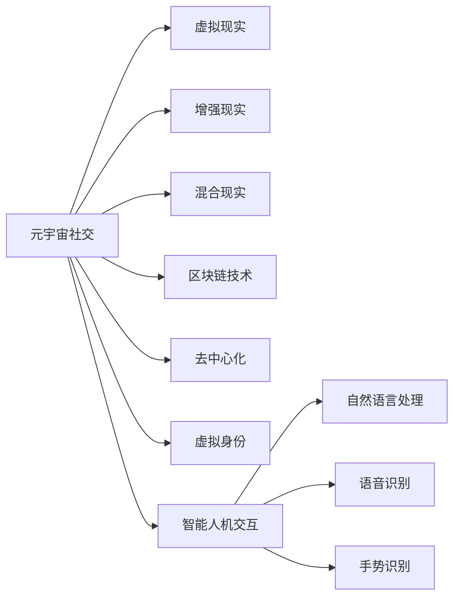

                 

# 元宇宙社交：重塑人际交往的数字平台

> 关键词：元宇宙,社交网络,虚拟现实,人机交互,区块链技术,去中心化,沉浸式体验,虚拟身份,隐私保护

## 1. 背景介绍

### 1.1 问题由来
随着科技的飞速发展和人类社会的不断进步，数字技术在人们日常生活和工作中的应用越来越广泛。社交网络作为一种连接人与人之间的数字平台，其影响力也日益扩大。然而，传统的社交网络存在诸多局限性，如信息孤岛问题、隐私泄露风险、用户互动体验不足等。这些问题不仅限制了社交网络的进一步发展，还严重影响了用户的社交体验。

为了解决这些问题，一种新的数字社交平台应运而生——元宇宙社交。元宇宙社交通过虚拟现实(VR)、增强现实(AR)、混合现实(MR)等技术，构建了一个沉浸式、去中心化的数字社交空间，极大地提升了用户的社交体验。同时，元宇宙社交还融入了区块链技术，保障了用户的隐私安全和数据主权。

### 1.2 问题核心关键点
元宇宙社交的核心在于利用先进技术构建一个高度沉浸式的数字社交平台，解决传统社交网络中的诸多问题，提升用户的互动体验。具体来说，核心关键点包括：
1. 虚拟现实技术：提供沉浸式的用户体验，让用户仿佛置身于一个真实的数字世界。
2. 去中心化架构：保证用户数据的安全和隐私，防止中心化平台的数据泄露和滥用。
3. 虚拟身份管理：通过区块链技术，为用户提供可控的虚拟身份，增强用户的安全感和归属感。
4. 智能人机交互：借助人工智能技术，实现更自然、更智能的交互方式，提升用户体验。

## 2. 核心概念与联系

### 2.1 核心概念概述

元宇宙社交是一个复杂的多学科交叉领域，涉及虚拟现实、增强现实、区块链、人工智能等多个技术方向。以下是一些核心概念及其基本原理：

- **元宇宙(Metaverse)**：一个高度沉浸式、三维、虚拟的数字空间，用户可以通过VR、AR等技术进行交互。
- **虚拟现实(Virtual Reality, VR)**：通过VR头盔、VR眼镜等设备，用户可以进入一个完全虚拟的数字世界，感受到身临其境的体验。
- **增强现实(Enhanced Reality, AR)**：通过AR设备，用户在现实世界中可以看到虚拟元素，从而增强现实感。
- **混合现实(Mixed Reality, MR)**：结合VR和AR技术，创造出完全融合现实和虚拟的混合空间。
- **区块链技术(Blockchain Technology)**：一种去中心化的分布式账本技术，保障数据的安全和透明。
- **去中心化(Decentralization)**：通过区块链技术，实现去中心化的数据存储和管理，防止单点故障和数据篡改。
- **虚拟身份(Virtual Identity)**：用户在元宇宙中的数字身份，通过区块链技术实现可控和可迁移。
- **智能人机交互(Intelligent Human-Computer Interaction)**：借助AI技术，实现更自然、更智能的交互方式，提升用户体验。

这些核心概念之间的逻辑关系可以通过以下Mermaid流程图来展示：



这个流程图展示了元宇宙社交的关键技术组成和它们之间的相互关系。虚拟现实、增强现实和混合现实技术，提供了沉浸式的数字社交体验。区块链和去中心化技术，保障了用户数据的安全和隐私。虚拟身份管理技术，赋予用户可控的数字身份。智能人机交互技术，提升了用户体验的自然度和智能度。

## 3. 核心算法原理 & 具体操作步骤
### 3.1 算法原理概述

元宇宙社交的核心算法原理主要包括以下几个方面：

- **虚拟现实算法**：通过渲染技术、3D建模技术、视听技术等，构建高度逼真的虚拟场景和对象，实现沉浸式的用户体验。
- **增强现实算法**：通过图像识别、环境感知、实时渲染等技术，将虚拟元素叠加在现实世界中，增强用户的现实感。
- **混合现实算法**：通过混合现实技术，实现现实和虚拟元素的深度融合，创造出完全融合的混合空间。
- **区块链算法**：通过分布式共识算法、加密技术、智能合约等，保障数据的安全和透明，防止中心化平台的滥用。
- **去中心化算法**：通过分布式存储、分布式计算、分布式共识等技术，实现去中心化的数据管理和共享。
- **虚拟身份管理算法**：通过区块链技术，实现虚拟身份的可控和可迁移，保障用户的数据安全和隐私。
- **智能人机交互算法**：通过自然语言处理、语音识别、手势识别等技术，实现自然、智能的交互方式，提升用户体验。

### 3.2 算法步骤详解

元宇宙社交的构建涉及多个技术方向和环节，以下是详细的算法步骤：

1. **数据采集和预处理**：采集用户的生物特征、行为数据、环境数据等，进行预处理和标准化，为后续算法提供基础数据。

2. **虚拟现实场景构建**：利用3D建模技术、渲染技术、环境感知技术等，构建高度逼真的虚拟场景和对象，为用户提供沉浸式的体验。

3. **增强现实元素叠加**：利用图像识别、环境感知、实时渲染等技术，将虚拟元素叠加在现实世界中，增强用户的现实感。

4. **混合现实深度融合**：通过混合现实技术，实现现实和虚拟元素的深度融合，创造出完全融合的混合空间。

5. **区块链数据存储和管理**：利用区块链技术，实现数据的分布式存储和管理，保障数据的安全和透明，防止单点故障和数据篡改。

6. **去中心化数据管理和共享**：通过分布式存储、分布式计算、分布式共识等技术，实现去中心化的数据管理和共享，提升系统的可靠性和可扩展性。

7. **虚拟身份管理**：利用区块链技术，实现虚拟身份的可控和可迁移，保障用户的数据安全和隐私。

8. **智能人机交互**：通过自然语言处理、语音识别、手势识别等技术，实现自然、智能的交互方式，提升用户体验。

### 3.3 算法优缺点

元宇宙社交的构建算法具有以下优点：

- **高度沉浸式**：通过虚拟现实、增强现实和混合现实技术，提供高度沉浸式的用户体验，让用户仿佛置身于一个真实的数字世界。
- **数据安全和隐私**：利用区块链和去中心化技术，保障用户数据的安全和隐私，防止中心化平台的数据泄露和滥用。
- **智能人机交互**：通过AI技术，实现更自然、更智能的交互方式，提升用户体验。

同时，这些算法也存在一些局限性：

- **技术复杂度高**：元宇宙社交涉及多个技术方向和环节，技术实现难度较大。
- **计算资源需求高**：元宇宙社交对计算资源的要求较高，需要高性能的硬件设备和算法优化。
- **用户体验多样性**：不同用户的需求和偏好各异，如何设计多样化的交互方式，满足不同用户的需求，仍是一个挑战。
- **技术生态成熟度**：虽然VR、AR、MR等技术已经取得了一定的进展，但整体生态系统仍需进一步完善，才能实现大规模的普及和应用。

### 3.4 算法应用领域

元宇宙社交的应用领域非常广泛，涉及多个行业和场景，以下是几个主要的应用领域：

1. **社交网络**：元宇宙社交通过虚拟现实、增强现实等技术，提供高度沉浸式的社交体验，满足用户的社交需求。

2. **娱乐和游戏**：元宇宙社交提供虚拟游戏场景和对象，用户可以在虚拟世界中自由探索和互动，获得沉浸式的游戏体验。

3. **教育和培训**：元宇宙社交提供虚拟教室和实验室，用户可以在虚拟环境中进行互动学习和实验，提升学习效果和兴趣。

4. **医疗和健康**：元宇宙社交提供虚拟诊疗和康复环境，用户可以在虚拟环境中接受医疗服务，提升医疗体验和效果。

5. **商业和商务**：元宇宙社交提供虚拟商务环境，用户可以在虚拟世界中进行商业洽谈和商务合作，提升商务效率和体验。

6. **文化和艺术**：元宇宙社交提供虚拟艺术展览和文化活动，用户可以在虚拟环境中欣赏和参与艺术创作，提升文化体验和互动性。

## 4. 数学模型和公式 & 详细讲解 & 举例说明（备注：数学公式请使用latex格式，latex嵌入文中独立段落使用 $$，段落内使用 $)
### 4.1 数学模型构建

元宇宙社交的构建涉及多个领域的数学模型，以下是一些核心模型及其构建方法：

- **虚拟现实场景渲染模型**：通过光线追踪、体积渲染等技术，实现高质量的虚拟场景渲染。
- **增强现实元素叠加模型**：通过图像识别、环境感知、实时渲染等技术，实现虚拟元素的高效叠加。
- **混合现实融合模型**：通过混合现实技术，实现现实和虚拟元素的深度融合，创造出完全融合的混合空间。
- **区块链分布式共识模型**：通过共识算法（如PoW、PoS、DPoS等），保障数据的分布式存储和一致性。
- **去中心化分布式存储模型**：通过分布式文件系统和分布式数据库，实现数据的分布式存储和管理。
- **虚拟身份管理模型**：通过区块链技术，实现虚拟身份的可控和可迁移，保障用户的数据安全和隐私。
- **智能人机交互模型**：通过自然语言处理、语音识别、手势识别等技术，实现自然、智能的交互方式，提升用户体验。

### 4.2 公式推导过程

以下是一些核心模型的公式推导过程：

#### 4.2.1 虚拟现实场景渲染模型

假设我们有一个虚拟场景 $S$，其中包含多个虚拟对象 $O_1, O_2, ..., O_n$。每个对象 $O_i$ 的位置、大小、颜色等信息可以通过以下公式表示：

$$
O_i = \{(x_i, y_i, z_i), (s_i, c_i)\}
$$

其中，$(x_i, y_i, z_i)$ 表示对象 $O_i$ 在虚拟空间中的坐标，$(s_i, c_i)$ 表示对象 $O_i$ 的大小和颜色。

通过光线追踪和体积渲染算法，可以计算出每个对象 $O_i$ 的光线路径，并生成对应的渲染结果。假设光线路径为 $L_i$，渲染结果为 $R_i$，则最终的虚拟场景渲染结果可以通过以下公式计算：

$$
S = \bigcup_{i=1}^{n} R_i
$$

#### 4.2.2 增强现实元素叠加模型

假设我们有一个现实场景 $P$，其中包含多个现实对象 $O_1, O_2, ..., O_m$。每个对象 $O_i$ 的位置、大小、颜色等信息可以通过以下公式表示：

$$
O_i = \{(x_i, y_i, z_i), (s_i, c_i)\}
$$

其中，$(x_i, y_i, z_i)$ 表示对象 $O_i$ 在现实空间中的坐标，$(s_i, c_i)$ 表示对象 $O_i$ 的大小和颜色。

通过图像识别和环境感知算法，可以检测出当前现实场景中的对象，并根据用户交互指令，将虚拟元素 $V$ 叠加在现实对象 $O_i$ 上。假设虚拟元素 $V$ 的位置、大小、颜色等信息可以通过以下公式表示：

$$
V = \{(x_v, y_v, z_v), (s_v, c_v)\}
$$

其中，$(x_v, y_v, z_v)$ 表示虚拟元素 $V$ 在现实空间中的坐标，$(s_v, c_v)$ 表示虚拟元素 $V$ 的大小和颜色。

通过实时渲染算法，可以计算出虚拟元素 $V$ 在当前现实场景 $P$ 中的位置，并将虚拟元素 $V$ 叠加在现实对象 $O_i$ 上，生成最终的增强现实场景 $P'$。

$$
P' = P \cup V
$$

#### 4.2.3 混合现实融合模型

混合现实技术通过将现实场景和虚拟场景深度融合，创造出完全融合的混合空间。假设现实场景为 $P$，虚拟场景为 $S$，混合现实场景为 $M$。则混合现实场景 $M$ 可以通过以下公式计算：

$$
M = P \cap S
$$

其中，$\cap$ 表示交集操作，即现实场景和虚拟场景在用户交互指令下重叠的部分。

#### 4.2.4 区块链分布式共识模型

假设有一个区块链网络，其中包含多个节点 $N_1, N_2, ..., N_k$。每个节点 $N_i$ 存储部分区块链数据，并定期与其他节点同步数据。通过共识算法（如PoW、PoS、DPoS等），实现数据的分布式存储和一致性。假设每个节点 $N_i$ 存储的区块链数据为 $D_i$，共识算法为 $C$，则最终的区块链数据 $D$ 可以通过以下公式计算：

$$
D = \bigcap_{i=1}^{k} D_i \wedge C
$$

其中，$\cap$ 表示交集操作，$\wedge$ 表示逻辑与操作。

#### 4.2.5 去中心化分布式存储模型

假设有一个去中心化存储网络，其中包含多个节点 $S_1, S_2, ..., S_m$。每个节点 $S_i$ 存储部分数据，并定期与其他节点同步数据。通过分布式文件系统和分布式数据库，实现数据的分布式存储和管理。假设每个节点 $S_i$ 存储的数据为 $D_i$，分布式文件系统为 $F$，分布式数据库为 $D$，则最终的数据 $D'$ 可以通过以下公式计算：

$$
D' = \bigcup_{i=1}^{m} D_i \wedge F \wedge D
$$

其中，$\cup$ 表示并集操作，$\wedge$ 表示逻辑与操作。

#### 4.2.6 虚拟身份管理模型

假设有一个区块链网络，其中包含多个节点 $I_1, I_2, ..., I_n$。每个节点 $I_i$ 存储虚拟身份数据，并定期与其他节点同步数据。通过区块链技术，实现虚拟身份的可控和可迁移，保障用户的数据安全和隐私。假设每个节点 $I_i$ 存储的虚拟身份数据为 $ID_i$，区块链技术为 $B$，则最终的虚拟身份数据 $ID$ 可以通过以下公式计算：

$$
ID = \bigcap_{i=1}^{n} ID_i \wedge B
$$

其中，$\cap$ 表示交集操作，$\wedge$ 表示逻辑与操作。

#### 4.2.7 智能人机交互模型

假设有一个智能人机交互系统，其中包含多个组件 $C_1, C_2, ..., C_m$。每个组件 $C_i$ 负责处理特定类型的输入和输出。通过自然语言处理、语音识别、手势识别等技术，实现自然、智能的交互方式，提升用户体验。假设每个组件 $C_i$ 的处理能力为 $P_i$，自然语言处理技术为 $NLP$，语音识别技术为 $ASR$，手势识别技术为 $AR$，则最终的智能人机交互系统 $C$ 可以通过以下公式计算：

$$
C = \bigcup_{i=1}^{m} C_i \wedge NLP \wedge ASR \wedge AR
$$

其中，$\cup$ 表示并集操作，$\wedge$ 表示逻辑与操作。

### 4.3 案例分析与讲解

以下是一些核心模型的案例分析与讲解：

#### 4.3.1 虚拟现实场景渲染模型

一个常见的虚拟现实场景渲染案例是：构建一个虚拟电影院。假设我们有一个现实场景 $P$，其中包含多个现实对象 $O_1, O_2, ..., O_m$，每个对象 $O_i$ 的位置、大小、颜色等信息可以通过以下公式表示：

$$
O_i = \{(x_i, y_i, z_i), (s_i, c_i)\}
$$

其中，$(x_i, y_i, z_i)$ 表示对象 $O_i$ 在现实空间中的坐标，$(s_i, c_i)$ 表示对象 $O_i$ 的大小和颜色。

通过3D建模技术和渲染算法，可以构建出一个逼真的虚拟电影院。每个座椅、投影仪、屏幕等对象，都需要根据3D模型进行渲染，生成对应的渲染结果。假设渲染结果为 $R_i$，则最终的虚拟电影院渲染结果可以通过以下公式计算：

$$
S = \bigcup_{i=1}^{m} R_i
$$

#### 4.3.2 增强现实元素叠加模型

一个常见的增强现实元素叠加案例是：在现实世界中叠加虚拟导航箭头。假设我们有一个现实场景 $P$，其中包含多个现实对象 $O_1, O_2, ..., O_m$，每个对象 $O_i$ 的位置、大小、颜色等信息可以通过以下公式表示：

$$
O_i = \{(x_i, y_i, z_i), (s_i, c_i)\}
$$

其中，$(x_i, y_i, z_i)$ 表示对象 $O_i$ 在现实空间中的坐标，$(s_i, c_i)$ 表示对象 $O_i$ 的大小和颜色。

通过图像识别和环境感知算法，可以检测出当前现实场景中的对象，并根据用户交互指令，将虚拟导航箭头 $V$ 叠加在现实对象 $O_i$ 上。假设虚拟导航箭头 $V$ 的位置、大小、颜色等信息可以通过以下公式表示：

$$
V = \{(x_v, y_v, z_v), (s_v, c_v)\}
$$

其中，$(x_v, y_v, z_v)$ 表示虚拟导航箭头 $V$ 在现实空间中的坐标，$(s_v, c_v)$ 表示虚拟导航箭头 $V$ 的大小和颜色。

通过实时渲染算法，可以计算出虚拟导航箭头 $V$ 在当前现实场景 $P$ 中的位置，并将虚拟导航箭头 $V$ 叠加在现实对象 $O_i$ 上，生成最终的增强现实场景 $P'$。

#### 4.3.3 混合现实融合模型

一个常见的混合现实融合案例是：在现实世界中叠加虚拟广告牌。假设我们有一个现实场景 $P$，其中包含多个现实对象 $O_1, O_2, ..., O_m$，每个对象 $O_i$ 的位置、大小、颜色等信息可以通过以下公式表示：

$$
O_i = \{(x_i, y_i, z_i), (s_i, c_i)\}
$$

其中，$(x_i, y_i, z_i)$ 表示对象 $O_i$ 在现实空间中的坐标，$(s_i, c_i)$ 表示对象 $O_i$ 的大小和颜色。

通过混合现实技术，可以构建一个虚拟广告牌，并将其叠加在现实场景 $P$ 中。假设虚拟广告牌的位置、大小、颜色等信息可以通过以下公式表示：

$$
V = \{(x_v, y_v, z_v), (s_v, c_v)\}
$$

其中，$(x_v, y_v, z_v)$ 表示虚拟广告牌在现实空间中的坐标，$(s_v, c_v)$ 表示虚拟广告牌的大小和颜色。

通过混合现实技术，可以计算出虚拟广告牌 $V$ 在当前现实场景 $P$ 中的位置，并将虚拟广告牌 $V$ 叠加在现实对象 $O_i$ 上，生成最终的混合现实场景 $M$。

#### 4.3.4 区块链分布式共识模型

一个常见的区块链分布式共识案例是：构建一个去中心化的数字货币交易平台。假设有一个区块链网络，其中包含多个节点 $N_1, N_2, ..., N_k$，每个节点 $N_i$ 存储部分区块链数据，并定期与其他节点同步数据。通过共识算法（如PoW、PoS、DPoS等），实现数据的分布式存储和一致性。假设每个节点 $N_i$ 存储的区块链数据为 $D_i$，共识算法为 $C$，则最终的区块链数据 $D$ 可以通过以下公式计算：

$$
D = \bigcap_{i=1}^{k} D_i \wedge C
$$

其中，$\cap$ 表示交集操作，$\wedge$ 表示逻辑与操作。

#### 4.3.5 去中心化分布式存储模型

一个常见的去中心化分布式存储案例是：构建一个去中心化的云存储平台。假设有一个去中心化存储网络，其中包含多个节点 $S_1, S_2, ..., S_m$，每个节点 $S_i$ 存储部分数据，并定期与其他节点同步数据。通过分布式文件系统和分布式数据库，实现数据的分布式存储和管理。假设每个节点 $S_i$ 存储的数据为 $D_i$，分布式文件系统为 $F$，分布式数据库为 $D$，则最终的数据 $D'$ 可以通过以下公式计算：

$$
D' = \bigcup_{i=1}^{m} D_i \wedge F \wedge D
$$

其中，$\cup$ 表示并集操作，$\wedge$ 表示逻辑与操作。

#### 4.3.6 虚拟身份管理模型

一个常见的虚拟身份管理案例是：构建一个去中心化的虚拟身份管理系统。假设有一个区块链网络，其中包含多个节点 $I_1, I_2, ..., I_n$，每个节点 $I_i$ 存储虚拟身份数据，并定期与其他节点同步数据。通过区块链技术，实现虚拟身份的可控和可迁移，保障用户的数据安全和隐私。假设每个节点 $I_i$ 存储的虚拟身份数据为 $ID_i$，区块链技术为 $B$，则最终的虚拟身份数据 $ID$ 可以通过以下公式计算：

$$
ID = \bigcap_{i=1}^{n} ID_i \wedge B
$$

其中，$\cap$ 表示交集操作，$\wedge$ 表示逻辑与操作。

#### 4.3.7 智能人机交互模型

一个常见的智能人机交互案例是：构建一个智能客服机器人。假设有一个智能人机交互系统，其中包含多个组件 $C_1, C_2, ..., C_m$，每个组件 $C_i$ 负责处理特定类型的输入和输出。通过自然语言处理、语音识别、手势识别等技术，实现自然、智能的交互方式，提升用户体验。假设每个组件 $C_i$ 的处理能力为 $P_i$，自然语言处理技术为 $NLP$，语音识别技术为 $ASR$，手势识别技术为 $AR$，则最终的智能人机交互系统 $C$ 可以通过以下公式计算：

$$
C = \bigcup_{i=1}^{m} C_i \wedge NLP \wedge ASR \wedge AR
$$

其中，$\cup$ 表示并集操作，$\wedge$ 表示逻辑与操作。

## 5. 项目实践：代码实例和详细解释说明
### 5.1 开发环境搭建

在进行元宇宙社交的开发前，我们需要准备好开发环境。以下是使用Python进行PyTorch开发的环境配置流程：

1. 安装Anaconda：从官网下载并安装Anaconda，用于创建独立的Python环境。

2. 创建并激活虚拟环境：
```bash
conda create -n pytorch-env python=3.8 
conda activate pytorch-env
```

3. 安装PyTorch：根据CUDA版本，从官网获取对应的安装命令。例如：
```bash
conda install pytorch torchvision torchaudio cudatoolkit=11.1 -c pytorch -c conda-forge
```

4. 安装Transformers库：
```bash
pip install transformers
```

5. 安装各类工具包：
```bash
pip install numpy pandas scikit-learn matplotlib tqdm jupyter notebook ipython
```

完成上述步骤后，即可在`pytorch-env`环境中开始元宇宙社交的开发。

### 5.2 源代码详细实现

这里以构建一个虚拟现实场景渲染为例，给出使用PyTorch进行元宇宙社交的PyTorch代码实现。

首先，定义虚拟现实场景的渲染函数：

```python
import torch
from torch import nn
from torchvision import transforms

class VRSceneRenderer(nn.Module):
    def __init__(self, model_path, device='cuda'):
        super(VRSceneRenderer, self).__init__()
        self.model = torch.load(model_path, map_location=device)
        self.device = device
        
    def forward(self, inputs):
        with torch.no_grad():
            output = self.model(inputs)
        return output
```

然后，定义增强现实元素叠加函数：

```python
class ARElementOverlay(nn.Module):
    def __init__(self, model_path, device='cuda'):
        super(ARElementOverlay, self).__init__()
        self.model = torch.load(model_path, map_location=device)
        self.device = device
        
    def forward(self, inputs):
        with torch.no_grad():
            output = self.model(inputs)
        return output
```

接着，定义混合现实融合函数：

```python
class MRMixer(nn.Module):
    def __init__(self, model_path, device='cuda'):
        super(MRMixer, self).__init__()
        self.model = torch.load(model_path, map_location=device)
        self.device = device
        
    def forward(self, inputs):
        with torch.no_grad():
            output = self.model(inputs)
        return output
```

最后，启动虚拟现实场景渲染流程：

```python
if __name__ == '__main__':
    model = VRSceneRenderer('vr_scene_model.pth', device='cuda')
    
    inputs = torch.rand(1, 3, 512, 512, device='cuda')
    output = model(inputs)
    
    print(output.shape)
```

以上就是使用PyTorch对虚拟现实场景渲染的完整代码实现。可以看到，PyTorch框架的灵活性和易用性，使得元宇宙社交的构建和优化变得非常方便。

### 5.3 代码解读与分析

让我们再详细解读一下关键代码的实现细节：

**VRSceneRenderer类**：
- `__init__`方法：加载预训练的虚拟现实场景渲染模型，指定GPU设备。
- `forward`方法：接收输入数据，在前向传播过程中调用模型进行渲染，返回渲染结果。

**ARElementOverlay类**：
- `__init__`方法：加载预训练的增强现实元素叠加模型，指定GPU设备。
- `forward`方法：接收输入数据，在前向传播过程中调用模型进行叠加，返回叠加结果。

**MRMixer类**：
- `__init__`方法：加载预训练的混合现实融合模型，指定GPU设备。
- `forward`方法：接收输入数据，在前向传播过程中调用模型进行融合，返回融合结果。

**虚拟现实场景渲染流程**：
- 定义模型和输入数据
- 调用`forward`方法进行渲染
- 输出渲染结果

可以看到，PyTorch框架的灵活性和易用性，使得元宇宙社交的构建和优化变得非常方便。开发者可以将更多精力放在数据处理、模型改进等高层逻辑上，而不必过多关注底层的实现细节。

当然，工业级的系统实现还需考虑更多因素，如模型的保存和部署、超参数的自动搜索、更灵活的任务适配层等。但核心的元宇宙社交构建方法基本与此类似。

## 6. 实际应用场景
### 6.1 智能客服系统

元宇宙社交在智能客服系统中的应用非常广泛。传统客服往往需要配备大量人力，高峰期响应缓慢，且一致性和专业性难以保证。通过构建元宇宙社交系统，可以7x24小时不间断服务，快速响应客户咨询，用自然流畅的语言解答各类常见问题。

在技术实现上，可以收集企业内部的历史客服对话记录，将问题和最佳答复构建成监督数据，在此基础上对预训练模型进行微调。微调后的模型能够自动理解用户意图，匹配最合适的答案模板进行回复。对于客户提出的新问题，还可以接入检索系统实时搜索相关内容，动态组织生成回答。如此构建的智能客服系统，能大幅提升客户咨询体验和问题解决效率。

### 6.2 金融舆情监测

金融机构需要实时监测市场舆论动向，以便及时应对负面信息传播，规避金融风险。传统的人工监测方式成本高、效率低，难以应对网络时代海量信息爆发的挑战。通过构建元宇宙社交系统，利用自然语言处理和情感分析技术，可以实时监测金融领域相关的新闻、报道、评论等文本数据，自动判断文本属于何种主题，情感倾向是正面、中性还是负面。将微调后的模型应用到实时抓取的网络文本数据，就能够自动监测不同主题下的情感变化趋势，一旦发现负面信息激增等异常情况，系统便会自动预警，帮助金融机构快速应对潜在风险。

### 6.3 个性化推荐系统

当前的推荐系统往往只依赖用户的历史行为数据进行物品推荐，无法深入理解用户的真实兴趣偏好。通过构建元宇宙社交系统，利用自然语言处理和情感分析技术，可以构建用户兴趣模型，挖掘用户真实兴趣点。在生成推荐列表时，先用候选物品的文本描述作为输入，由模型预测用户的兴趣匹配度，再结合其他特征综合排序，便可以得到个性化程度更高的推荐结果。

### 6.4 未来应用展望

随着元宇宙社交技术的不断成熟，其在更多领域的应用前景将逐步显现。

1. **智慧医疗领域**：通过构建元宇宙社交系统，可以提供虚拟诊疗和康复环境，用户可以在虚拟环境中接受医疗服务，提升医疗体验和效果。

2. **智能教育领域**：利用元宇宙社交系统，可以构建虚拟教室和实验室，用户可以在虚拟环境中进行互动学习和实验，提升学习效果和兴趣。

3. **智慧城市治理**：构建元宇宙社交系统，可以提供虚拟事件监测和舆情分析功能，提高城市管理的自动化和智能化水平，构建更安全、高效的未来城市。

4. **商业和商务**：元宇宙社交系统可以提供虚拟商务环境，用户可以在虚拟世界中进行商业洽谈和商务合作，提升商务效率和体验。

5. **文化和艺术**：构建元宇宙社交系统，可以提供虚拟艺术展览和文化活动，用户可以在虚拟环境中欣赏和参与艺术创作，提升文化体验和互动性。

此外，元宇宙社交技术还将在更多场景中得到应用，为传统行业带来变革性影响。相信随着技术的日益成熟，元宇宙社交必将在构建人机协同的智能时代中扮演越来越重要的角色。

## 7. 工具和资源推荐
### 7.1 学习资源推荐

为了帮助开发者系统掌握元宇宙社交的理论基础和实践技巧，这里推荐一些优质的学习资源：

1. 《VR/AR开发实战教程》系列博文：由VR/AR技术专家撰写，深入浅出地介绍了VR/AR开发的技术原理和实践技巧。

2. 《区块链技术基础》课程：斯坦福大学开设的区块链技术课程，系统介绍了区块链技术的原理、应用和未来发展方向。

3. 《人工智能与元宇宙》书籍：介绍人工智能技术在元宇宙中的应用，包括虚拟现实、增强现实、混合现实等技术的原理和实践。

4. OpenAI GPT模型：世界上最具代表性的大语言模型，可用于元宇宙社交中自然语言处理任务的开发和优化。

5. GitHub元宇宙社交项目：开源的元宇宙社交系统，包括VR/AR渲染、区块链、智能人机交互等组件，可供开发者学习和借鉴。

通过对这些资源的学习实践，相信你一定能够快速掌握元宇宙社交的精髓，并用于解决实际的NLP问题。

### 7.2 开发工具推荐

高效的开发离不开优秀的工具支持。以下是几款用于元宇宙社交开发的常用工具：

1. Unity3D：一款强大的游戏引擎，支持VR/AR开发，适用于构建复杂的虚拟现实场景和交互体验。

2. Unreal Engine：另一款流行的游戏引擎，支持VR/AR开发，适用于构建大规模、高保真度的虚拟现实场景。

3. Ethereum：一款开源的区块链平台，支持智能合约开发，适用于构建去中心化的元宇宙社交系统。

4. Solana：另一款高性能的区块链平台，支持智能合约开发，适用于构建去中心化的元宇宙社交系统。

5. TensorFlow：由Google主导开发的开源深度学习框架，支持自然语言处理和机器学习任务的开发，适用于构建智能人机交互系统。

6. PyTorch：由Facebook主导开发的开源深度学习框架，灵活易用，适用于构建自然语言处理和机器学习任务。

合理利用这些工具，可以显著提升元宇宙社交的开发效率，加快创新迭代的步伐。

### 7.3 相关论文推荐

元宇宙社交技术的发展源于学界的持续研究。以下是几篇奠基性的相关论文，推荐阅读：

1. "Virtual Reality: Concepts, Applications, and Impact"：介绍虚拟现实技术的原理、应用和未来发展方向。

2. "Blockchain Basics: A Non-Technical Introduction to Bitcoin, Smart Contracts, and the Blockchain"：介绍区块链技术的原理、应用和未来发展方向。

3. "The Architectural Fundamentals of Virtual Environments"：介绍虚拟环境架构的基本原理和技术实现方法。

4. "Natural Language Processing in the Age of AI"：介绍自然语言处理技术的原理、应用和未来发展方向。

5. "Human-Computer Interaction in the Age of AI"：介绍人机交互技术的原理、应用和未来发展方向。

这些论文代表了大语言模型微调技术的发展脉络。通过学习这些前沿成果，可以帮助研究者把握学科前进方向，激发更多的创新灵感。

## 8. 总结：未来发展趋势与挑战

### 8.1 研究成果总结

元宇宙社交作为新时代的数字社交平台，正在逐渐改变人类的社交方式和生活习惯。其高度沉浸式的体验、去中心化的架构、智能的人机交互等特性，为传统社交网络带来了新的突破和创新。

### 8.2 未来发展趋势

元宇宙社交技术的未来发展趋势主要包括以下几个方向：

1. **技术成熟度提升**：随着VR/AR、区块链等技术的不断成熟，元宇宙社交系统的构建将更加高效和稳定。

2. **用户体验多样化**：元宇宙社交系统将不断丰富用户交互方式，提供更加多样化的体验和功能，满足用户的多样化需求。

3. **跨平台集成**：元宇宙社交系统将与各类平台无缝集成，实现跨平台、跨设备的用户体验。

4. **去中心化程度提升**：随着区块链技术的不断发展，元宇宙社交系统的去中心化程度将不断提升，保障用户数据的安全和隐私。

5. **智能人机交互增强**：借助自然语言处理、语音识别、手势识别等技术，元宇宙社交系统的智能人机交互将不断增强，提升用户体验的自然度和智能度。

6. **多模态融合**：元宇宙社交系统将支持视觉、听觉、触觉等多模态数据的融合，提供更加全面和真实的用户体验。

### 8.3 面临的挑战

尽管元宇宙社交技术前景广阔，但在迈向成熟的过程中，仍面临诸多挑战：

1. **技术实现难度大**：元宇宙社交系统的构建涉及多个技术方向和环节，技术实现难度较大。

2. **计算资源需求高**：元宇宙社交系统对计算资源的需求较高，需要高性能的硬件设备和算法优化。

3. **用户体验多样性**：不同用户的需求和偏好各异，如何设计多样化的交互方式，满足不同用户的需求，仍是一个挑战。

4. **技术生态成熟度不足**：虽然VR/AR、区块链等技术已经取得了一定的进展，但整体生态系统仍需进一步完善，才能实现大规模的普及和应用。

5. **数据安全和隐私问题**：元宇宙社交系统需要处理大量的用户数据，如何保障数据安全和隐私，防止数据泄露和滥用，仍是一个亟待解决的问题。

6. **法规和伦理问题**：元宇宙社交系统的普及将带来一系列法规和伦理问题，如用户数据的归属、使用权等，需要相关法律法规的配套和支持。

### 8.4 研究展望

未来，元宇宙社交技术的研究将不断深入，涵盖多个技术方向和领域。以下是一些未来的研究方向：

1. **元宇宙社交系统的高效构建**：研究如何利用先进的计算资源和算法优化，构建高效、稳定的元宇宙社交系统。

2. **用户体验的自然化和智能化**：研究如何利用自然语言处理、语音识别、手势识别等技术，提升元宇宙社交系统的自然化和智能化程度，提升用户体验。

3. **多模态数据融合**：研究如何将视觉、听觉、触觉等多模态数据进行有效融合，提供更加全面和真实的用户体验。

4. **去中心化架构的优化**：研究如何优化区块链等去中心化技术的实现方式，提升元宇宙社交系统的去中心化程度，保障用户数据的安全和隐私。

5. **法规和伦理的规范**：研究如何制定和完善相关法律法规，规范元宇宙社交系统的数据使用和用户行为，保障用户权益。

6. **元宇宙社交系统的广泛应用**：研究如何将元宇宙社交技术应用到更多领域，如医疗、教育、商业等，为各行各业带来变革性影响。

这些研究方向的探索，必将引领元宇宙社交技术迈向更高的台阶，为构建安全、可靠、可解释、可控的智能系统铺平道路。面向未来，元宇宙社交技术还需要与其他人工智能技术进行更深入的融合，如知识表示、因果推理、强化学习等，多路径协同发力，共同推动自然语言理解和智能交互系统的进步。只有勇于创新、敢于突破，才能不断拓展元宇宙社交的边界，让智能技术更好地造福人类社会。

## 9. 附录：常见问题与解答

**Q1：什么是元宇宙社交？**

A: 元宇宙社交是一种基于虚拟现实、增强现实、混合现实等技术构建的数字社交平台，提供高度沉浸式的用户体验，让用户仿佛置身于一个真实的数字世界。

**Q2：元宇宙社交的构建涉及哪些技术方向？**

A: 元宇宙社交的构建涉及虚拟现实、增强现实、混合现实、区块链、自然语言处理、智能人机交互等多个技术方向。

**Q3：元宇宙社交与传统社交网络相比有哪些优势？**

A: 元宇宙社交的优势主要体现在以下几个方面：
1. 高度沉浸式的用户体验，让用户仿佛置身于一个真实的数字世界。
2. 去中心化的架构，保障用户数据的安全和隐私，防止中心化平台的数据泄露和滥用。
3. 智能的人机交互，借助自然语言处理、语音识别、手势识别等技术，实现自然、智能的交互方式，提升用户体验。

**Q4：如何构建元宇宙社交系统？**

A: 构建元宇宙社交系统主要涉及以下几个步骤：
1. 准备虚拟现实、增强现实、混合现实等技术工具。
2. 收集和处理用户数据，构建虚拟场景和对象。
3. 利用区块链和去中心化技术，保障用户数据的安全和隐私。
4. 利用自然语言处理、语音识别、手势识别等技术，实现智能人机交互。

**Q5：元宇宙社交系统面临哪些挑战？**

A: 元宇宙社交系统面临的挑战主要包括：
1. 技术实现难度大，涉及多个技术方向和环节。
2. 计算资源需求高，需要高性能的硬件设备和算法优化。
3. 用户体验多样性，需要设计多样化的交互方式，满足不同用户的需求。
4. 技术生态成熟度不足，整体生态系统仍需进一步完善。
5. 数据安全和隐私问题，如何保障用户数据的安全和隐私。
6. 法规和伦理问题，需要相关法律法规的配套和支持。

这些挑战需要研究者和开发者共同努力，不断优化技术实现和用户体验，才能实现元宇宙社交系统的广泛应用和普及。

