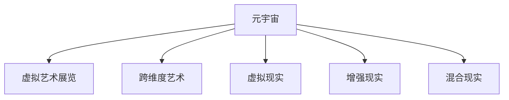

                 

# 元宇宙艺术策展:跨维度艺术展览的新形式

## 1. 背景介绍

### 1.1 问题由来
随着科技的迅速发展和数字化的持续演进，人们对于艺术的理解和欣赏方式也在发生深刻变化。传统艺术展览局限于物理空间，受限于时间和地域限制，难以满足日益增长的艺术需求。而元宇宙（Metaverse）作为一种全新的沉浸式数字化空间，为艺术展览带来了无限可能，打破了时空的限制，实现了艺术的无限跨越。

### 1.2 问题核心关键点
元宇宙艺术策展的核心关键点在于如何构建一个能够容纳并展示多维度艺术作品的空间，并使其能够支持虚拟观众的沉浸式体验。同时，该过程需要处理虚拟与现实的交互，以及如何高效地展示和分发艺术作品。

### 1.3 问题研究意义
研究元宇宙艺术策展，对于拓展艺术展览的形式、提升观众体验、探索数字艺术新境界、推动艺术与科技的深度融合，具有重要意义。它不仅能够解决传统艺术展览面临的问题，还能为艺术创作提供新的平台和思路。

## 2. 核心概念与联系

### 2.1 核心概念概述

为了更好地理解元宇宙艺术策展的过程，本节将介绍几个密切相关的核心概念：

- **元宇宙（Metaverse）**：一个以虚拟世界为核心的、持续发展的、开放的、可交互的数字空间。用户可以通过虚拟现实(VR)、增强现实(AR)、混合现实(MR)等技术，进入这个虚拟世界，进行社交、娱乐、学习等活动。
- **虚拟艺术展览**：在元宇宙中，通过虚拟空间展示艺术作品的展览形式。展览空间可以是虚拟现实中的三维空间，也可以是模拟现实世界环境的虚拟平台。
- **跨维度艺术**：指在元宇宙中进行展示的艺术作品，这些作品可以在不同的维度（如时间、空间、交互性）上进行创新和表达。
- **虚拟现实（VR）**：通过计算机技术生成一个模拟的三维视觉、听觉等感官环境，使用户能够沉浸其中，体验虚拟世界的全方位感受。
- **增强现实（AR）**：将数字信息叠加在现实世界之上，增强用户对现实世界的认知和体验。
- **混合现实（MR）**：将虚拟世界与现实世界融合，创建出一个新的、超越现实的环境。

这些核心概念之间的逻辑关系可以通过以下Mermaid流程图来展示：



这个流程图展示出元宇宙艺术策展的核心概念及其之间的关系：

1. 元宇宙提供了虚拟艺术展览的底层空间。
2. 跨维度艺术作品在元宇宙中得以展示。
3. 通过VR、AR、MR等技术，提升用户体验。

## 3. 核心算法原理 & 具体操作步骤
### 3.1 算法原理概述

元宇宙艺术策展的基本原理是通过虚拟空间技术，将艺术作品数字化并呈现在元宇宙中，同时利用AI技术进行虚拟观众的互动和体验提升。核心算法分为两个部分：

- **数字资产创建与展示**：将现实中的艺术作品通过扫描、建模等技术转换为数字资产，并在虚拟空间中展示。
- **虚拟观众互动体验**：利用AI技术，如自然语言处理（NLP）、计算机视觉（CV）、机器学习（ML）等，增强虚拟观众与艺术作品的互动体验。

### 3.2 算法步骤详解

元宇宙艺术策展的核心算法步骤如下：

**Step 1: 艺术作品数字化**

- **收集数据**：收集现实中的艺术作品数据，如绘画、雕塑、音乐、视频等。
- **数据处理**：对收集到的数据进行预处理，如格式转换、噪声去除、纹理修复等。
- **三维建模**：利用三维建模软件，将数据转化为三维模型。
- **纹理贴图**：为三维模型添加相应的纹理贴图，增强视觉效果。

**Step 2: 数字资产展示**

- **虚拟空间选择**：选择合适的虚拟空间，如虚拟画廊、虚拟博物馆等。
- **资产导入**：将数字化后的艺术作品导入虚拟空间，进行布局和展示。
- **交互设计**：为观众设计虚拟展览的交互方式，如点击、拖拽、旋转等。

**Step 3: 虚拟观众互动体验**

- **AI模型部署**：部署NLP、CV、ML等AI模型，用于虚拟观众的互动和体验。
- **自然语言处理**：实现观众与作品的自然语言对话，提供丰富的交互内容。
- **计算机视觉**：利用CV技术进行图像识别，识别观众的交互行为，并作出响应。
- **机器学习**：通过ML算法分析观众的行为数据，提升互动体验，如个性化推荐等。

### 3.3 算法优缺点

元宇宙艺术策展算法具有以下优点：

1. **沉浸式体验**：通过VR、AR、MR等技术，提供全方位的沉浸式体验。
2. **全球共享**：元宇宙空间不受地理限制，全球观众可以实时观看展览。
3. **互动性高**：利用AI技术，实现观众与艺术作品的高互动，增强体验。
4. **成本低**：相较于传统展览，数字资产的创建和展示成本更低。

同时，该算法也存在一些局限性：

1. **技术门槛高**：需要专业的三维建模、AI开发等技术支持。
2. **设备限制**：观众需要特定的硬件设备（如VR头盔、AR眼镜等）才能体验。
3. **网络带宽要求高**：大规模的虚拟展览需要稳定的网络带宽支持。
4. **数据隐私问题**：观众数据隐私保护需重点关注。

### 3.4 算法应用领域

元宇宙艺术策展技术在以下几个领域具有广泛应用：

- **艺术馆**：创建虚拟艺术博物馆、画廊，展示知名艺术家的作品，如卢浮宫、大英博物馆等。
- **艺术教育**：提供虚拟艺术课程，学生可以通过虚拟现实技术进行互动式学习。
- **文化旅游**：展示世界各地的名胜古迹、历史遗迹，如兵马俑、长城等。
- **商业广告**：利用虚拟展览进行品牌推广，吸引潜在客户。
- **个性化体验**：定制化虚拟展览，满足观众的个性化需求。

## 4. 数学模型和公式 & 详细讲解 & 举例说明

### 4.1 数学模型构建

假设有一幅二维画作，其像素坐标为 $(x,y)$，对应RGB颜色值为 $(R,G,B)$。艺术作品数字化后，将其映射为三维空间中的点 $(x,y,z)$，并将颜色值映射为纹理贴图。

设虚拟展览空间为三维坐标系 $(x,y,z)$，展览空间由若干个立方体单元组成，每个立方体单元的大小为 $dx, dy, dz$，其位置为 $(x_i, y_i, z_i)$。艺术作品在展览空间中的位置为 $(x_p, y_p, z_p)$，与立方体单元的关系可以通过坐标差分计算。

### 4.2 公式推导过程

设 $L$ 为艺术作品与立方体单元的最小距离，则艺术作品在展览空间中的位置可由以下公式计算：

$$
(x_p, y_p, z_p) = \arg\min_{(x_i, y_i, z_i)} \|(x_i - x_p, y_i - y_p, z_i - z_p)\|_2
$$

其中，$\|\cdot\|_2$ 表示欧式距离。找到最小距离对应的立方体单元，即为艺术作品的位置。

艺术作品在虚拟展览中的展示方式，可以是简单的展示，也可以是与观众互动的方式，如虚拟讲解、观看视频等。互动方式的计算模型较为复杂，涉及NLP、CV、ML等技术。

### 4.3 案例分析与讲解

以虚拟画廊为例，其展示方式可以通过以下步骤实现：

- **选择画廊空间**：选择一个虚拟空间，如360度全景图。
- **导入画作**：将数字化后的画作导入虚拟空间，并进行布局。
- **设计交互**：为观众设计互动方式，如点击画作切换视角、观看视频等。
- **观众互动**：观众通过VR头盔进入虚拟画廊，与画作进行互动。

## 5. 项目实践：代码实例和详细解释说明
### 5.1 开发环境搭建

在进行元宇宙艺术策展实践前，我们需要准备好开发环境。以下是使用Python进行PyTorch开发的环境配置流程：

1. 安装Anaconda：从官网下载并安装Anaconda，用于创建独立的Python环境。

2. 创建并激活虚拟环境：
```bash
conda create -n pytorch-env python=3.8 
conda activate pytorch-env
```

3. 安装PyTorch：根据CUDA版本，从官网获取对应的安装命令。例如：
```bash
conda install pytorch torchvision torchaudio cudatoolkit=11.1 -c pytorch -c conda-forge
```

4. 安装各类工具包：
```bash
pip install numpy pandas scikit-learn matplotlib tqdm jupyter notebook ipython
```

完成上述步骤后，即可在`pytorch-env`环境中开始开发实践。

### 5.2 源代码详细实现

这里我们以虚拟画廊为例，给出使用PyTorch进行开发的PyTorch代码实现。

首先，定义虚拟画廊的虚拟空间：

```python
class VirtualGallery:
    def __init__(self, gallery_size):
        self.gallery_size = gallery_size
        self.gallery = self.create_gallery()
    
    def create_gallery(self):
        gallery = []
        for x in range(self.gallery_size[0]):
            row = []
            for y in range(self.gallery_size[1]):
                row.append([])
                for z in range(self.gallery_size[2]):
                    row[z] = 0
            gallery.append(row)
        return gallery
```

然后，定义艺术作品的展示方式：

```python
class ArtWork:
    def __init__(self, artwork_data, gallery_position):
        self.artwork_data = artwork_data
        self.gallery_position = gallery_position
    
    def show_artwork(self):
        # 将艺术作品展示在虚拟画廊中
        pass
```

最后，定义观众的互动方式：

```python
class Visitor:
    def __init__(self, gallery, artwork_position):
        self.gallery = gallery
        self.artwork_position = artwork_position
    
    def interact_with_artwork(self):
        # 与艺术作品互动
        pass
```

在上述代码基础上，可以进一步实现具体的交互逻辑和展示效果。

### 5.3 代码解读与分析

让我们再详细解读一下关键代码的实现细节：

**VirtualGallery类**：
- `__init__`方法：初始化虚拟画廊的大小和展示空间。
- `create_gallery`方法：创建一个三维的虚拟空间，初始化每个立方体单元为0。

**ArtWork类**：
- `__init__`方法：初始化艺术作品的数据和在虚拟空间中的位置。
- `show_artwork`方法：在虚拟空间中展示艺术作品。

**Visitor类**：
- `__init__`方法：初始化观众和虚拟空间中的艺术作品位置。
- `interact_with_artwork`方法：与艺术作品进行互动。

可以看到，PyTorch提供了一个灵活的框架，可以方便地进行虚拟空间和艺术作品的创建与展示。开发者可以在此基础上进行更复杂的交互逻辑实现，如虚拟讲解、观看视频等。

## 6. 实际应用场景
### 6.1 智能博物馆

虚拟博物馆可以为无法亲临现场的用户提供深入的艺术体验。用户可以通过VR头盔进入虚拟博物馆，进行自由探索和互动。在虚拟博物馆中，观众可以近距离观看古代艺术品，聆听专家的讲解，甚至可以与历史人物进行虚拟对话。

### 6.2 艺术教育

虚拟艺术教育平台可以为学生提供沉浸式学习体验。学生可以通过虚拟现实技术，进入虚拟艺术教室，进行互动式学习。如模拟绘画、雕塑、音乐等创作过程，实时得到反馈和指导，提升学习效果。

### 6.3 跨文化交流

虚拟艺术展览可以打破地域限制，促进不同文化之间的交流。世界各地的艺术家可以共同参与虚拟展览，展示自己的作品，并进行互动。这种跨文化的交流，有助于增进不同文化之间的理解和尊重。

### 6.4 未来应用展望

随着技术的不断发展，元宇宙艺术策展将带来更多可能性。未来，虚拟艺术展览可以进一步结合AR、MR等技术，提升互动体验。同时，结合AI技术，可以提供更加个性化的艺术推荐和互动体验。

## 7. 工具和资源推荐
### 7.1 学习资源推荐

为了帮助开发者系统掌握元宇宙艺术策展的理论基础和实践技巧，这里推荐一些优质的学习资源：

1. 《Unity基础教程》系列博文：深入介绍Unity3D的开发环境和基本技术，适合初学者的入门学习。
2. 《WebVR技术栈》课程：由WebVR社区推出，涵盖WebVR技术栈的基本概念和实践方法，适合Web开发者学习。
3. 《Unity与VR》书籍：详细介绍了Unity3D与VR技术结合的开发方法，包括3D建模、物理引擎、交互设计等。
4. 《Virtual Reality in Action》课程：由Unity提供，介绍VR技术的原理和应用，适合有一定编程基础的开发者学习。
5. 《元宇宙的艺术》书籍：探讨元宇宙技术对艺术的影响和变革，适合艺术和技术的跨领域学习者。

通过对这些资源的学习实践，相信你一定能够快速掌握元宇宙艺术策展的理论基础和实践技巧。

### 7.2 开发工具推荐

高效的开发离不开优秀的工具支持。以下是几款用于元宇宙艺术策展开发的常用工具：

1. Unity3D：由Unity Technologies开发的实时3D图形引擎，适合开发高质量的虚拟现实应用。
2. Unreal Engine：由Epic Games开发的实时3D图形引擎，适合开发高保真度的虚拟现实应用。
3. Blender：开源的3D建模软件，支持多种文件格式和插件，适合进行3D建模和渲染。
4. AutoCAD：专业的CAD软件，支持多种格式和插件，适合进行3D建模和设计。
5. Autodesk Maya：专业的3D动画制作软件，适合进行复杂动画和特效的创作。

合理利用这些工具，可以显著提升元宇宙艺术策展任务的开发效率，加快创新迭代的步伐。

### 7.3 相关论文推荐

元宇宙艺术策展技术的发展源于学界的持续研究。以下是几篇奠基性的相关论文，推荐阅读：

1. "Virtual Reality Art Exhibitions: A Survey" by Marco Hess, Alessandro P. Avanzini: 这篇论文详细介绍了虚拟艺术展览的发展历程和最新进展，适合对虚拟艺术展览有深入了解的需求。
2. "Virtual Reality in the Art Museum: A Case Study" by H. J. Michael Smith: 这篇论文通过案例研究，展示了VR技术在艺术博物馆中的应用效果，适合实践应用领域的学习者。
3. "Interactive Art in Virtual Reality: A Survey" by Orjan Lebrecht, Dror Bilchik: 这篇论文详细介绍了虚拟艺术展览中的交互设计，适合对互动设计有深入需求的学习者。
4. "Augmented Reality in Art Education: A Survey" by Ron Aminoff, Rolf Gruen: 这篇论文通过案例研究，展示了AR技术在艺术教育中的应用效果，适合艺术教育领域的学习者。
5. "Virtual Reality for Art History and Cultural Studies" by Michael Bunz: 这篇论文详细介绍了VR技术在艺术史和文化研究中的应用，适合对跨文化交流有深入需求的学习者。

通过对这些资源的学习实践，相信你一定能够快速掌握元宇宙艺术策展的理论基础和实践技巧。

## 8. 总结：未来发展趋势与挑战

### 8.1 总结

本文对元宇宙艺术策展方法进行了全面系统的介绍。首先阐述了元宇宙艺术策展的背景和意义，明确了虚拟空间和艺术作品的数字化、展示与互动等核心步骤。其次，从原理到实践，详细讲解了元宇宙艺术策展的数学模型和具体实现方法，给出了完整的代码实例和解释分析。同时，本文还探讨了元宇宙艺术策展在智能博物馆、艺术教育、跨文化交流等实际应用场景中的应用，展示了元宇宙艺术策展的广阔前景。

通过本文的系统梳理，可以看到，元宇宙艺术策展方法正在成为艺术展览的重要范式，极大地拓展了艺术展览的形式，提升了观众体验，带来了艺术与科技的深度融合。未来，伴随技术的不断发展，元宇宙艺术策展必将在更多的领域得到应用，为艺术创作和欣赏带来新的可能性。

### 8.2 未来发展趋势

展望未来，元宇宙艺术策展技术将呈现以下几个发展趋势：

1. **技术融合加速**：元宇宙艺术策展将进一步融合AR、MR等技术，提升互动体验。同时，结合AI技术，可以提供更加个性化的艺术推荐和互动体验。
2. **跨文化交流增强**：虚拟艺术展览可以打破地域限制，促进不同文化之间的交流，增进不同文化之间的理解和尊重。
3. **艺术创作工具普及**：元宇宙平台可以为艺术家提供更加便捷的艺术创作工具，提升创作效率。
4. **虚拟艺术市场形成**：元宇宙平台可以形成虚拟艺术市场，艺术家和观众可以实时互动，进行艺术品交易和展示。
5. **教育与培训普及**：虚拟艺术教育平台可以为学生提供沉浸式学习体验，提升学习效果。

以上趋势凸显了元宇宙艺术策展技术的广阔前景。这些方向的探索发展，必将进一步提升艺术展览的体验，推动艺术与科技的深度融合。

### 8.3 面临的挑战

尽管元宇宙艺术策展技术已经取得了一定的成果，但在迈向更加智能化、普适化应用的过程中，它仍面临诸多挑战：

1. **技术门槛高**：元宇宙艺术策展需要专业的三维建模、AI开发等技术支持，对开发者要求较高。
2. **设备限制**：观众需要特定的硬件设备（如VR头盔、AR眼镜等）才能体验，设备普及率较低。
3. **网络带宽要求高**：大规模的虚拟展览需要稳定的网络带宽支持，目前网络条件限制较多。
4. **数据隐私问题**：观众数据隐私保护需重点关注，如何确保数据安全是一个重要课题。
5. **内容审核难度大**：虚拟艺术展览内容繁多，需要专业的审核团队进行内容筛选和管理，工作量较大。

正视元宇宙艺术策展面临的这些挑战，积极应对并寻求突破，将使技术更好地服务于艺术创作和观众体验。

### 8.4 研究展望

面对元宇宙艺术策展所面临的种种挑战，未来的研究需要在以下几个方面寻求新的突破：

1. **提升技术可及性**：开发更加易用、高效的艺术创作和展示工具，降低技术门槛，普及元宇宙技术。
2. **增强用户互动性**：利用AI技术，提升虚拟观众的互动体验，增强艺术作品的吸引力。
3. **优化网络性能**：研究高效的传输算法和数据压缩技术，提升网络带宽利用率，支持大规模虚拟展览。
4. **保障数据安全**：研究数据加密、用户隐私保护等技术，确保用户数据安全。
5. **加强内容审核**：开发智能内容审核系统，提升内容审核效率和准确性。

这些研究方向的探索，必将引领元宇宙艺术策展技术迈向更高的台阶，为艺术创作和观众体验提供新的可能。

## 9. 附录：常见问题与解答

**Q1：元宇宙艺术策展是否适用于所有艺术作品？**

A: 元宇宙艺术策展适用于大多数艺术作品，包括绘画、雕塑、音乐、视频等。但对于一些需要实际体验的艺术形式，如现场表演、互动装置等，需要结合实际需求进行特定开发。

**Q2：元宇宙艺术策展是否需要高昂的开发成本？**

A: 元宇宙艺术策展的开发成本主要集中在3D建模和VR设备上。但随着技术的发展和开源社区的壮大，相关工具和资源逐渐增多，开发成本正在逐步降低。同时，使用开源平台如Unity、Unreal Engine等，可以大大降低开发门槛。

**Q3：如何保障元宇宙艺术展览的安全性？**

A: 保障元宇宙艺术展览的安全性，需要从技术和管理两个方面入手。技术上，采用数据加密、用户隐私保护等技术，确保数据安全。管理上，制定严格的内容审核制度，避免不良内容的传播。

**Q4：元宇宙艺术策展如何满足多样化的观众需求？**

A: 元宇宙艺术策展可以通过个性化的推荐系统，根据观众的兴趣和偏好，推荐不同的艺术作品和展览。同时，结合AI技术，提供虚拟讲解、视频展示等多种互动方式，满足观众的多样化需求。

**Q5：元宇宙艺术策展如何提升教育效果？**

A: 元宇宙艺术策展可以通过虚拟现实技术，提供沉浸式学习体验。学生可以在虚拟环境中，进行互动式学习，提升学习效果。同时，利用AI技术，提供个性化的学习推荐，帮助学生更好地掌握知识。

---

作者：禅与计算机程序设计艺术 / Zen and the Art of Computer Programming

