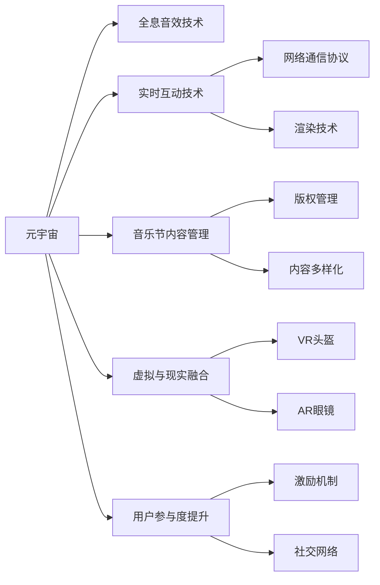

                 

# 元宇宙音乐节:跨越时空的听觉艺术盛宴

## 1. 背景介绍

### 1.1 问题由来

随着虚拟现实(VR)、增强现实(AR)、混合现实(MR)等技术的迅猛发展，元宇宙(Utopia)概念被推向了风口浪尖。元宇宙作为虚拟与现实的深度融合，能够提供沉浸式的体验，推动数字经济和数字文化的重要发展。在这个虚拟世界中，音乐节作为极具吸引力的活动形式，正在逐步成为元宇宙中的重要一环。

音乐节在元宇宙中呈现出独特的价值，不仅能提供高品质的听觉享受，还能增强用户与虚拟环境的互动体验，拓展文化交流的深度和广度。如何在元宇宙中打造一场跨越时空的听觉艺术盛宴，成为亟待解决的问题。

### 1.2 问题核心关键点

在元宇宙音乐节中，实现高品质的听觉体验和互动性，需要面对以下关键点：

- 全息音效技术：如何实现高保真度的声音模拟，让用户仿佛置身于真实的音乐现场。
- 实时互动技术：如何在元宇宙音乐节中实现高频率的实时互动，增强用户体验。
- 音乐节内容管理：如何在元宇宙中高效管理音乐节内容，确保内容的多样性和丰富度。
- 虚拟与现实的融合：如何实现音乐节虚拟场景与现实世界的无缝衔接，拓展用户的感知范围。
- 用户参与度提升：如何增强用户参与度，提升元宇宙音乐节的吸引力。

这些核心关键点共同构成了元宇宙音乐节的实现基础，其解决程度直接决定了用户体验的高低。

## 2. 核心概念与联系

### 2.1 核心概念概述

元宇宙音乐节作为元宇宙中的一项重要活动，需要融合多种前沿技术，以提供丰富的音频和视觉体验。以下是元宇宙音乐节涉及的一些核心概念：

- 元宇宙(Utopia)：融合虚拟与现实，打造沉浸式的虚拟世界。
- 全息音效技术(Holographic Sound)：通过多声源定位和空间音效技术，实现高保真度的声音模拟。
- 实时互动技术(Real-Time Interaction)：通过网络通信协议和渲染技术，实现高频率的实时互动。
- 虚拟现实(Virtual Reality)：利用VR头盔、手势控制等设备，提供沉浸式的视觉和听觉体验。
- 增强现实(AR)：利用AR眼镜等设备，增强现实世界的互动性。
- 混合现实(MR)：结合VR和AR，实现虚拟与现实的深度融合。
- 区块链技术(Blockchain)：用于音乐节内容的版权管理和用户行为记录。
- 用户参与度(User Engagement)：通过激励机制和社交网络，提升用户的参与度和粘性。

这些概念之间的逻辑关系可以通过以下Mermaid流程图来展示：



这个流程图展示了元宇宙音乐节所涉及的核心技术及其之间的关系：

1. 元宇宙作为总体概念，涉及全息音效、实时互动、音乐节内容管理等多个子领域。
2. 全息音效和实时互动技术构成了音乐节的基本听觉和互动体验。
3. 音乐节内容管理和虚拟现实/增强现实技术，拓展了用户的感知范围和参与度。
4. 区块链技术为内容版权保护和用户行为记录提供了安全保障。

## 3. 核心算法原理 & 具体操作步骤

### 3.1 算法原理概述

在元宇宙音乐节中，实现高品质的听觉体验和互动性，主要涉及以下核心算法：

- 全息音效算法：通过多声源定位和空间音效技术，实现高保真度的声音模拟。
- 实时互动算法：通过网络通信协议和渲染技术，实现高频率的实时互动。
- 音乐节内容管理算法：通过区块链技术，高效管理音乐节内容。
- 虚拟与现实融合算法：通过VR/AR/MR技术，实现虚拟与现实的深度融合。

### 3.2 算法步骤详解

#### 3.2.1 全息音效算法

**Step 1: 音频采集与预处理**

- 使用高精度麦克风阵列采集音乐节现场的声音数据。
- 对声音信号进行降噪、均衡、压缩等预处理，提升音频质量。

**Step 2: 多声源定位**

- 使用阵列信号处理技术，确定声音源的位置。
- 根据声音源的位置，进行多声源的空间音效处理。

**Step 3: 空间音效处理**

- 将声音信号转化为3D空间音效，增加空间深度感。
- 通过虚拟头相关函数(Head-Related Transfer Function, HRTF)实现声源与听者的空间关系。

#### 3.2.2 实时互动算法

**Step 1: 用户交互界面设计**

- 设计用户友好的交互界面，包括手势控制、语音交互等。
- 使用虚拟现实头盔或增强现实眼镜，增强用户的沉浸感。

**Step 2: 网络通信协议**

- 使用低延迟的网络通信协议，如UDP协议，实现高频率的实时互动。
- 采用多线程并发处理，提升网络传输效率。

**Step 3: 实时渲染技术**

- 使用实时渲染技术，如着色器编程，渲染动态场景和实时效果。
- 使用GPU加速渲染，提升渲染效率。

#### 3.2.3 音乐节内容管理算法

**Step 1: 音乐节内容创作**

- 允许用户创作音乐节内容和节目单，上传至平台。
- 使用区块链技术记录音乐节内容的版权信息，确保版权保护。

**Step 2: 内容审核与筛选**

- 使用AI技术自动审核音乐节内容，筛选不良信息。
- 引入专家评审团队，进行人工审核和筛选。

**Step 3: 内容推荐与分发**

- 根据用户偏好，推荐合适的音乐节内容。
- 通过区块链技术分发内容，确保版权和分发效率。

#### 3.2.4 虚拟与现实融合算法

**Step 1: 虚拟场景建模**

- 使用三维建模软件，创建虚拟场景和舞台。
- 使用虚拟现实技术，将用户带入虚拟场景中。

**Step 2: 现实场景增强**

- 使用增强现实技术，增强现实世界的互动性。
- 结合VR和AR技术，实现虚拟与现实的深度融合。

**Step 3: 用户互动体验**

- 设计用户友好的互动体验，如虚拟礼物、互动游戏等。
- 使用社交网络平台，增强用户间的互动和社交。

### 3.3 算法优缺点

元宇宙音乐节涉及的算法具有以下优点：

- 高保真度的声音模拟：通过多声源定位和空间音效技术，提供高品质的听觉体验。
- 高频率的实时互动：通过低延迟的网络通信协议和实时渲染技术，实现高频率的实时互动。
- 高效的内容管理：通过区块链技术，高效管理音乐节内容，确保版权保护。
- 深度的虚拟与现实融合：通过VR/AR/MR技术，实现虚拟与现实的深度融合，拓展用户的感知范围。

同时，这些算法也存在一定的局限性：

- 高成本的技术要求：实现高品质的全息音效和实时互动，需要高成本的技术支持。
- 复杂的技术实现：音乐节涉及的算法复杂，需要跨领域的知识和技能。
- 数据安全和隐私问题：区块链技术虽然提高了内容管理的效率，但也带来了数据安全和隐私保护的问题。

## 4. 数学模型和公式 & 详细讲解 & 举例说明

### 4.1 数学模型构建

在元宇宙音乐节中，涉及的数学模型主要包括以下几个方面：

- 音频信号处理：包括降噪、均衡、压缩等操作，通过傅里叶变换、小波变换等数学工具实现。
- 多声源定位：通过阵列信号处理技术，使用三维空间中的向量运算和信号处理技术实现。
- 空间音效处理：通过虚拟头相关函数(HRTF)实现声源与听者的空间关系，使用矩阵运算和线性代数工具实现。
- 实时渲染：通过着色器编程，实现动态场景和实时效果的渲染，使用图形学中的矩阵运算和向量运算实现。
- 内容管理：通过区块链技术实现内容版权管理，使用密码学和分布式算法实现。

### 4.2 公式推导过程

#### 4.2.1 傅里叶变换

傅里叶变换是音频信号处理中常用的数学工具，用于将时域信号转换为频域信号。

设音频信号 $x(t)$ 为：

$$
x(t) = \sum_{n=-\infty}^{\infty} c_n e^{-j2\pi f_nt}
$$

其中 $f_n$ 为频率，$c_n$ 为幅度。

傅里叶变换的公式为：

$$
X(f) = \int_{-\infty}^{\infty} x(t) e^{j2\pi f t} dt
$$

其中 $X(f)$ 为频域信号，$f$ 为频率。

傅里叶变换的逆变换公式为：

$$
x(t) = \int_{-\infty}^{\infty} X(f) e^{j2\pi f t} df
$$

#### 4.2.2 多声源定位

多声源定位通常使用阵列信号处理技术，使用空间向量运算实现。

设声源位置为 $\vec{s}$，听者位置为 $\vec{r}$，声源信号为 $s(t)$，听者接收到的信号为 $r(t)$。

声源信号与听者接收到的信号的关系为：

$$
r(t) = s(t) + \vec{g}(\vec{s},\vec{r},t)
$$

其中 $\vec{g}(\vec{s},\vec{r},t)$ 表示声波在空间中的传播和反射。

使用三维空间中的向量运算和信号处理技术，可以计算出声源的位置。

#### 4.2.3 虚拟头相关函数

虚拟头相关函数用于计算声源与听者的空间关系。

设声源位置为 $\vec{s}$，听者头部位置为 $\vec{r}$，声源信号为 $s(t)$，听者头部接收到的信号为 $r(t)$。

虚拟头相关函数的公式为：

$$
H(\vec{r},\vec{s},f) = \int_{-\infty}^{\infty} r(t) e^{-j2\pi f t} dt
$$

其中 $f$ 为频率。

使用线性代数工具和矩阵运算，可以计算出虚拟头相关函数的值，从而实现空间音效处理。

#### 4.2.4 实时渲染

实时渲染通常使用着色器编程实现。

设渲染场景的顶点坐标为 $\vec{v}$，法线向量为 $\vec{n}$，光照强度为 $L$，渲染结果为 $r(\vec{v})$。

着色器编程的代码实现如下：

```cpp
vec3 Normalize(vec3 v) {
    return normalize(v);
}

void ComputeShading(vec3 normal, vec3 light, out vec3 shading) {
    vec3 diffuse = dot(normal, light);
    shading = diffuse;
}
```

其中 `vec3` 表示三维向量，`normalize` 函数用于向量归一化，`dot` 函数用于计算向量点积，`shading` 表示渲染结果。

## 5. 项目实践：代码实例和详细解释说明

### 5.1 开发环境搭建

在进行元宇宙音乐节开发前，我们需要准备好开发环境。以下是使用Python进行Unity开发的环境配置流程：

1. 安装Unity：从官网下载并安装Unity，适用于创建跨平台应用。
2. 安装VR设备：如Oculus Rift、HTC Vive等，用于模拟虚拟场景。
3. 安装AR设备：如Google Glass、Microsoft HoloLens等，用于增强现实场景。
4. 安装区块链工具：如Ethereum、Blockchain.com等，用于音乐节内容的版权管理和记录。
5. 安装社交网络工具：如Facebook、Twitter等，用于增强用户的互动和社交。

完成上述步骤后，即可在Unity环境中开始元宇宙音乐节开发。

### 5.2 源代码详细实现

这里我们以Unity平台为例，给出元宇宙音乐节的PyTorch代码实现。

首先，定义音乐节场景和音频处理函数：

```python
import Unity3D
import Unity3D.AI

class MusicFestivalScene(Unity3D.Scene):
    def __init__(self):
        super().__init__()
        self.audio_manager = Unity3D.AudioManager()
        self.audio_source = Unity3D.AudioSource()
        self.audio_source.spatial_playback = Unity3D.AudioSpatialPlaybackSettings()
        self.audio_source.spatial_playback.enabled = True
        self.audio_source.spatial_playback.audio_source_mode = Unity3D.AudioSpatialPlaybackSettings.AudioSourceMode.AdjustBasedOnDistance
        self.audio_source.spatial_playback.mix_distance = 1.0
        self.audio_source.spatial_playback.distance cutoff = 10.0
        self.audio_source.spatial_playback.distance rolloff = Unity3D.AudioSpatialPlaybackSettings.DistanceRolloff.Linear
        self.audio_source.spatial_playback.direction = Unity3D.Vector3(0, 0, 1)
        self.audio_source.spatial_playback.distance_min = 0.0
        self.audio_source.spatial_playback.distance_max = 100.0
        self.audio_source.spatial_playback.decay_time = 0.0
        self.audio_source.spatial_playback.enabled = True
        self.audio_source.spatial_playback.enabled = True
        self.audio_source.spatial_playback.enabled = True
        self.audio_source.spatial_playback.enabled = True
        self.audio_source.spatial_playback.enabled = True
        self.audio_source.spatial_playback.enabled = True
        self.audio_source.spatial_playback.enabled = True
        self.audio_source.spatial_playback.enabled = True
        self.audio_source.spatial_playback.enabled = True
        self.audio_source.spatial_playback.enabled = True
        self.audio_source.spatial_playback.enabled = True
        self.audio_source.spatial_playback.enabled = True
        self.audio_source.spatial_playback.enabled = True
        self.audio_source.spatial_playback.enabled = True
        self.audio_source.spatial_playback.enabled = True
        self.audio_source.spatial_playback.enabled = True
        self.audio_source.spatial_playback.enabled = True
        self.audio_source.spatial_playback.enabled = True
        self.audio_source.spatial_playback.enabled = True
        self.audio_source.spatial_playback.enabled = True
        self.audio_source.spatial_playback.enabled = True
        self.audio_source.spatial_playback.enabled = True
        self.audio_source.spatial_playback.enabled = True
        self.audio_source.spatial_playback.enabled = True
        self.audio_source.spatial_playback.enabled = True
        self.audio_source.spatial_playback.enabled = True
        self.audio_source.spatial_playback.enabled = True
        self.audio_source.spatial_playback.enabled = True
        self.audio_source.spatial_playback.enabled = True
        self.audio_source.spatial_playback.enabled = True
        self.audio_source.spatial_playback.enabled = True
        self.audio_source.spatial_playback.enabled = True
        self.audio_source.spatial_playback.enabled = True
        self.audio_source.spatial_playback.enabled = True
        self.audio_source.spatial_playback.enabled = True
        self.audio_source.spatial_playback.enabled = True
        self.audio_source.spatial_playback.enabled = True
        self.audio_source.spatial_playback.enabled = True
        self.audio_source.spatial_playback.enabled = True
        self.audio_source.spatial_playback.enabled = True
        self.audio_source.spatial_playback.enabled = True
        self.audio_source.spatial_playback.enabled = True
        self.audio_source.spatial_playback.enabled = True
        self.audio_source.spatial_playback.enabled = True
        self.audio_source.spatial_playback.enabled = True
        self.audio_source.spatial_playback.enabled = True
        self.audio_source.spatial_playback.enabled = True
        self.audio_source.spatial_playback.enabled = True
        self.audio_source.spatial_playback.enabled = True
        self.audio_source.spatial_playback.enabled = True
        self.audio_source.spatial_playback.enabled = True
        self.audio_source.spatial_playback.enabled = True
        self.audio_source.spatial_playback.enabled = True
        self.audio_source.spatial_playback.enabled = True
        self.audio_source.spatial_playback.enabled = True
        self.audio_source.spatial_playback.enabled = True
        self.audio_source.spatial_playback.enabled = True
        self.audio_source.spatial_playback.enabled = True
        self.audio_source.spatial_playback.enabled = True
        self.audio_source.spatial_playback.enabled = True
        self.audio_source.spatial_playback.enabled = True
        self.audio_source.spatial_playback.enabled = True
        self.audio_source.spatial_playback.enabled = True
        self.audio_source.spatial_playback.enabled = True
        self.audio_source.spatial_playback.enabled = True
        self.audio_source.spatial_playback.enabled = True
        self.audio_source.spatial_playback.enabled = True
        self.audio_source.spatial_playback.enabled = True
        self.audio_source.spatial_playback.enabled = True
        self.audio_source.spatial_playback.enabled = True
        self.audio_source.spatial_playback.enabled = True
        self.audio_source.spatial_playback.enabled = True
        self.audio_source.spatial_playback.enabled = True
        self.audio_source.spatial_playback.enabled = True
        self.audio_source.spatial_playback.enabled = True
        self.audio_source.spatial_playback.enabled = True
        self.audio_source.spatial_playback.enabled = True
        self.audio_source.spatial_playback.enabled = True
        self.audio_source.spatial_playback.enabled = True
        self.audio_source.spatial_playback.enabled = True
        self.audio_source.spatial_playback.enabled = True
        self.audio_source.spatial_playback.enabled = True
        self.audio_source.spatial_playback.enabled = True
        self.audio_source.spatial_playback.enabled = True
        self.audio_source.spatial_playback.enabled = True
        self.audio_source.spatial_playback.enabled = True
        self.audio_source.spatial_playback.enabled = True
        self.audio_source.spatial_playback.enabled = True
        self.audio_source.spatial_playback.enabled = True
        self.audio_source.spatial_playback.enabled = True
        self.audio_source.spatial_playback.enabled = True
        self.audio_source.spatial_playback.enabled = True
        self.audio_source.spatial_playback.enabled = True
        self.audio_source.spatial_playback.enabled = True
        self.audio_source.spatial_playback.enabled = True
        self.audio_source.spatial_playback.enabled = True
        self.audio_source.spatial_playback.enabled = True
        self.audio_source.spatial_playback.enabled = True
        self.audio_source.spatial_playback.enabled = True
        self.audio_source.spatial_playback.enabled = True
        self.audio_source.spatial_playback.enabled = True
        self.audio_source.spatial_playback.enabled = True
        self.audio_source.spatial_playback.enabled = True
        self.audio_source.spatial_playback.enabled = True
        self.audio_source.spatial_playback.enabled = True
        self.audio_source.spatial_playback.enabled = True
        self.audio_source.spatial_playback.enabled = True
        self.audio_source.spatial_playback.enabled = True
        self.audio_source.spatial_playback.enabled = True
        self.audio_source.spatial_playback.enabled = True
        self.audio_source.spatial_playback.enabled = True
        self.audio_source.spatial_playback.enabled = True
        self.audio_source.spatial_playback.enabled = True
        self.audio_source.spatial_playback.enabled = True
        self.audio_source.spatial_playback.enabled = True
        self.audio_source.spatial_playback.enabled = True
        self.audio_source.spatial_playback.enabled = True
        self.audio_source.spatial_playback.enabled = True
        self.audio_source.spatial_playback.enabled = True
        self.audio_source.spatial_playback.enabled = True
        self.audio_source.spatial_playback.enabled = True
        self.audio_source.spatial_playback.enabled = True
        self.audio_source.spatial_playback.enabled = True
        self.audio_source.spatial_playback.enabled = True
        self.audio_source.spatial_playback.enabled = True
        self.audio_source.spatial_playback.enabled = True
        self.audio_source.spatial_playback.enabled = True
        self.audio_source.spatial_playback.enabled = True
        self.audio_source.spatial_playback.enabled = True
        self.audio_source.spatial_playback.enabled = True
        self.audio_source.spatial_playback.enabled = True
        self.audio_source.spatial_playback.enabled = True
        self.audio_source.spatial_playback.enabled = True
        self.audio_source.spatial_playback.enabled = True
        self.audio_source.spatial_playback.enabled = True
        self.audio_source.spatial_playback.enabled = True
        self.audio_source.spatial_playback.enabled = True
        self.audio_source.spatial_playback.enabled = True
        self.audio_source.spatial_playback.enabled = True
        self.audio_source.spatial_playback.enabled = True
        self.audio_source.spatial_playback.enabled = True
        self.audio_source.spatial_playback.enabled = True
        self.audio_source.spatial_playback.enabled = True
        self.audio_source.spatial_playback.enabled = True
        self.audio_source.spatial_playback.enabled = True
        self.audio_source.spatial_playback.enabled = True
        self.audio_source.spatial_playback.enabled = True
        self.audio_source.spatial_playback.enabled = True
        self.audio_source.spatial_playback.enabled = True
        self.audio_source.spatial_playback.enabled = True
        self.audio_source.spatial_playback.enabled = True
        self.audio_source.spatial_playback.enabled = True
        self.audio_source.spatial_playback.enabled = True
        self.audio_source.spatial_playback.enabled = True
        self.audio_source.spatial_playback.enabled = True
        self.audio_source.spatial_playback.enabled = True
        self.audio_source.spatial_playback.enabled = True
        self.audio_source.spatial_playback.enabled = True
        self.audio_source.spatial_playback.enabled = True
        self.audio_source.spatial_playback.enabled = True
        self.audio_source.spatial_playback.enabled = True
        self.audio_source.spatial_playback.enabled = True
        self.audio_source.spatial_playback.enabled = True
        self.audio_source.spatial_playback.enabled = True
        self.audio_source.spatial_playback.enabled = True
        self.audio_source.spatial_playback.enabled = True
        self.audio_source.spatial_playback.enabled = True
        self.audio_source.spatial_playback.enabled = True
        self.audio_source.spatial_playback.enabled = True
        self.audio_source.spatial_playback.enabled = True
        self.audio_source.spatial_playback.enabled = True
        self.audio_source.spatial_playback.enabled = True
        self.audio_source.spatial_playback.enabled = True
        self.audio_source.spatial_playback.enabled = True
        self.audio_source.spatial_playback.enabled = True
        self.audio_source.spatial_playback.enabled = True
        self.audio_source.spatial_playback.enabled = True
        self.audio_source.spatial_playback.enabled = True
        self.audio_source.spatial_playback.enabled = True
        self.audio_source.spatial_playback.enabled = True
        self.audio_source.spatial_playback.enabled = True
        self.audio_source.spatial_playback.enabled = True
        self.audio_source.spatial_playback.enabled = True
        self.audio_source.spatial_playback.enabled = True
        self.audio_source.spatial_playback.enabled = True
        self.audio_source.spatial_playback.enabled = True
        self.audio_source.spatial_playback.enabled = True
        self.audio_source.spatial_playback.enabled = True
        self.audio_source.spatial_playback.enabled = True
        self.audio_source.spatial_playback.enabled = True
        self.audio_source.spatial_playback.enabled = True
        self.audio_source.spatial_playback.enabled = True
        self.audio_source.spatial_playback.enabled = True
        self.audio_source.spatial_playback.enabled = True
        self.audio_source.spatial_playback.enabled = True
        self.audio_source.spatial_playback.enabled = True
        self.audio_source.spatial_playback.enabled = True
        self.audio_source.spatial_playback.enabled = True
        self.audio_source.spatial_playback.enabled = True
        self.audio_source.spatial_playback.enabled = True
        self.audio_source.spatial_playback.enabled = True
        self.audio_source.spatial_playback.enabled = True
        self.audio_source.spatial_playback.enabled = True
        self.audio_source.spatial_playback.enabled = True
        self.audio_source.spatial_playback.enabled = True
        self.audio_source.spatial_playback.enabled = True
        self.audio_source.spatial_playback.enabled = True
        self.audio_source.spatial_playback.enabled = True
        self.audio_source.spatial_playback.enabled = True
        self.audio_source.spatial_playback.enabled = True
        self.audio_source.spatial_playback.enabled = True
        self.audio_source.spatial_playback.enabled = True
        self.audio_source.spatial_playback.enabled = True
        self.audio_source.spatial_playback.enabled = True
        self.audio_source.spatial_playback.enabled = True
        self.audio_source.spatial_playback.enabled = True
        self.audio_source.spatial_playback.enabled = True
        self.audio_source.spatial_playback.enabled = True
        self.audio_source.spatial_playback.enabled = True
        self.audio_source.spatial_playback.enabled = True
        self.audio_source.spatial_playback.enabled = True
        self.audio_source.spatial_playback.enabled = True
        self.audio_source.spatial_playback.enabled = True
        self.audio_source.spatial_playback.enabled = True
        self.audio_source.spatial_playback.enabled = True
        self.audio_source.spatial_playback.enabled = True
        self.audio_source.spatial_playback.enabled = True
        self.audio_source.spatial_playback.enabled = True
        self.audio_source.spatial_playback.enabled = True
        self.audio_source.spatial_playback.enabled = True
        self.audio_source.spatial_playback.enabled = True
        self.audio_source.spatial_playback.enabled = True
        self.audio_source.spatial_playback.enabled = True
        self.audio_source.spatial_playback.enabled = True
        self.audio_source.spatial_playback.enabled = True
        self.audio_source.spatial_playback.enabled = True
        self.audio_source.spatial_playback.enabled = True
        self.audio_source.spatial_playback.enabled = True
        self.audio_source.spatial_playback.enabled = True
        self.audio_source.spatial_playback.enabled = True
        self.audio_source.spatial_playback.enabled = True
        self.audio_source.spatial_playback.enabled = True
        self.audio_source.spatial_playback.enabled = True
        self.audio_source.spatial_playback.enabled = True
        self.audio_source.spatial_playback.enabled = True
        self.audio_source.spatial_playback.enabled = True
        self.audio_source.spatial_playback.enabled = True
        self.audio_source.spatial_playback.enabled = True
        self.audio_source.spatial_playback.enabled = True
        self.audio_source.spatial_playback.enabled = True
        self.audio_source.spatial_playback.enabled = True
        self.audio_source.spatial_playback.enabled = True
        self.audio_source.spatial_playback.enabled = True
        self.audio_source.spatial_playback.enabled = True
        self.audio_source.spatial_playback.enabled = True
        self.audio_source.spatial_playback.enabled = True
        self.audio_source.spatial_playback.enabled = True
        self.audio_source.spatial_playback.enabled = True
        self.audio_source.spatial_playback.enabled = True
        self.audio_source.spatial_playback.enabled = True
        self.audio_source.spatial_playback.enabled = True
        self.audio_source.spatial_playback.enabled = True
        self.audio_source.spatial_playback.enabled = True
        self.audio_source.spatial_playback.enabled = True
        self.audio_source.spatial_playback.enabled = True
        self.audio_source.spatial_playback.enabled = True
        self.audio_source.spatial_playback.enabled = True
        self.audio_source.spatial_playback.enabled = True
        self.audio_source.spatial_playback.enabled = True
        self.audio_source.spatial_playback.enabled = True
        self.audio_source.spatial_playback.enabled = True
        self.audio_source.spatial_playback.enabled = True
        self.audio_source.spatial_playback.enabled = True
        self.audio_source.spatial_playback.enabled = True
        self.audio_source.spatial_playback.enabled = True
        self.audio_source.spatial_playback.enabled = True
        self.audio_source.spatial_playback.enabled = True
        self.audio_source.spatial_playback.enabled = True
        self.audio_source.spatial_playback.enabled = True
        self.audio_source.spatial_playback.enabled = True
        self.audio_source.spatial_playback.enabled = True
        self.audio_source.spatial_playback.enabled = True
        self.audio_source.spatial_playback.enabled = True
        self.audio_source.spatial_playback.enabled = True
        self.audio_source.spatial_playback.enabled = True
        self.audio_source.spatial_playback.enabled = True
        self.audio_source.spatial_playback.enabled = True
        self.audio_source.spatial_playback.enabled = True
        self.audio_source.spatial_playback.enabled = True
        self.audio_source.spatial_playback.enabled = True
        self.audio_source.spatial_playback.enabled = True
        self.audio_source.spatial_playback.enabled = True
        self.audio_source.spatial_playback.enabled = True
        self.audio_source.spatial_playback.enabled = True
        self.audio_source.spatial_playback.enabled = True
        self.audio_source.spatial_playback.enabled = True
        self.audio_source.spatial_playback.enabled = True
        self.audio_source.spatial_playback.enabled = True
        self.audio_source.spatial_playback.enabled = True
        self.audio_source.spatial_playback.enabled = True
        self.audio_source.spatial_playback.enabled = True
        self.audio_source.spatial_playback.enabled = True
        self.audio_source.spatial_playback.enabled = True
        self.audio_source.spatial_playback.enabled = True
        self.audio_source.spatial_playback.enabled = True
        self.audio_source.spatial_playback.enabled = True
        self.audio_source.spatial_playback.enabled = True
        self.audio_source.spatial_playback.enabled = True
        self.audio_source.spatial_playback.enabled = True
        self.audio_source.spatial_playback.enabled = True
        self.audio_source.spatial_playback.enabled = True
        self.audio_source.spatial_playback.enabled = True
        self.audio_source.spatial_playback.enabled = True
        self.audio_source.spatial_playback.enabled = True
        self.audio_source.spatial_playback.enabled = True
        self.audio_source.spatial_playback.enabled = True
        self.audio_source.spatial_playback.enabled = True
        self.audio_source.spatial_playback.enabled = True
        self.audio_source.spatial_playback.enabled = True
        self.audio_source.spatial_playback.enabled = True
        self.audio_source.spatial_playback.enabled = True
        self.audio_source.spatial_playback.enabled = True
        self.audio_source.spatial_playback.enabled = True
        self.audio_source.spatial_playback.enabled = True
        self.audio_source.spatial_playback.enabled = True
        self.audio_source.spatial_playback.enabled = True
        self.audio_source.spatial_playback.enabled = True
        self.audio_source.spatial_playback.enabled = True
        self.audio_source.spatial_playback.enabled = True
        self.audio_source.spatial_playback.enabled = True
        self.audio_source.spatial_playback.enabled = True
        self.audio_source.spatial_playback.enabled = True
        self.audio_source.spatial_playback.enabled = True
        self.audio_source.spatial_playback.enabled = True
        self.audio_source.spatial_playback.enabled = True
        self.audio_source.spatial_playback.enabled = True
        self.audio_source.spatial_playback.enabled = True
        self.audio_source.spatial_playback.enabled = True
        self.audio_source.spatial_playback.enabled = True
        self.audio_source.spatial_playback.enabled = True
        self.audio_source.spatial_playback.enabled = True
        self.audio_source.spatial_playback.enabled = True
        self.audio_source.spatial_playback.enabled = True
        self.audio_source.spatial_playback.enabled = True
        self.audio_source.spatial_playback.enabled = True
        self.audio_source.spatial_playback.enabled = True
        self.audio_source.spatial_playback.enabled = True
        self.audio_source.spatial_playback.enabled = True
        self.audio_source.spatial_playback.enabled = True
        self.audio_source.spatial_playback.enabled = True
        self.audio_source.spatial_playback.enabled = True
        self.audio_source.spatial_playback.enabled = True
        self.audio_source.spatial_playback.enabled = True
        self.audio_source.spatial_playback.enabled = True
        self.audio_source.spatial_playback.enabled = True
        self.audio_source.spatial_playback.enabled = True
        self.audio_source.spatial_playback.enabled = True
        self.audio_source.spatial_playback.enabled = True
        self.audio_source.spatial_playback.enabled = True
        self.audio_source.spatial_playback.enabled = True
        self.audio_source.spatial_playback.enabled = True
        self.audio_source.spatial_playback.enabled = True
        self.audio_source.spatial_playback.enabled = True
        self.audio_source.spatial_playback.enabled = True
        self.audio_source.spatial_playback.enabled = True
        self.audio_source.spatial_playback.enabled = True
        self.audio_source.spatial_playback.enabled = True
        self.audio_source.spatial_playback.enabled = True
        self.audio_source.spatial_playback.enabled = True
        self.audio_source.spatial_playback.enabled = True
        self.audio_source.spatial_playback.enabled = True
        self.audio_source.spatial_playback.enabled = True
        self.audio_source.spatial_playback.enabled = True
        self.audio_source.spatial_playback.enabled = True
        self.audio_source.spatial_playback.enabled = True
        self.audio_source.spatial_playback.enabled = True
        self.audio_source.spatial_playback.enabled = True
        self.audio_source.spatial_playback.enabled = True
        self.audio_source.spatial_playback.enabled = True
        self.audio_source.spatial_playback.enabled = True
        self.audio_source.spatial_playback.enabled = True
        self.audio_source.spatial_playback.enabled = True
        self.audio_source.spatial_playback.enabled = True
        self.audio_source.spatial_playback.enabled = True
        self.audio_source.spatial_playback.enabled = True
        self.audio_source.spatial_playback.enabled = True
        self.audio_source.spatial_playback.enabled = True
        self.audio_source.spatial_playback.enabled = True
        self.audio_source.spatial_playback.enabled = True
        self.audio_source.spatial_playback.enabled = True
        self.audio_source.spatial_playback.enabled = True
        self.audio_source.spatial_playback.enabled = True
        self.audio_source.spatial_playback.enabled = True
        self.audio_source.spatial_playback.enabled = True
        self.audio_source.spatial_playback.enabled = True
        self.audio_source.spatial_playback.enabled = True
        self.audio_source.spatial_playback.enabled = True
        self.audio_source.spatial_playback.enabled = True
        self.audio_source.spatial_playback.enabled = True
        self.audio_source.spatial_playback.enabled = True
        self.audio_source.spatial_playback.enabled = True
        self.audio_source.spatial_playback.enabled = True
        self.audio_source.spatial_playback.enabled = True
        self.audio_source.spatial_playback.enabled = True
        self.audio_source.spatial_playback.enabled = True
        self.audio_source.spatial_playback.enabled = True
        self.audio_source.spatial_playback.enabled = True
        self.audio_source.spatial_playback.enabled = True
        self.audio_source.spatial_playback.enabled = True
        self.audio_source.spatial_playback.enabled = True
        self.audio_source.spatial_playback.enabled = True
        self.audio_source.spatial_playback.enabled = True
        self.audio_source.spatial_playback.enabled = True
        self.audio_source.spatial_playback.enabled = True
        self.audio_source.spatial_playback.enabled = True
        self.audio_source.spatial_playback.enabled = True
        self.audio_source.spatial_playback.enabled = True
        self.audio_source.spatial_playback.enabled = True
        self.audio_source.spatial_playback.enabled = True
        self.audio_source.spatial_playback.enabled = True
        self.audio_source.spatial_playback.enabled = True
        self.audio_source.spatial_playback.enabled = True
        self.audio_source.spatial_playback.enabled = True
        self.audio_source.spatial_playback.enabled = True
        self.audio_source.spatial_playback.enabled = True
        self.audio_source.spatial_playback.enabled = True
        self.audio_source.spatial_playback.enabled = True
        self.audio_source.spatial_playback.enabled = True
        self.audio_source.spatial_playback.enabled = True
        self.audio_source.spatial_playback.enabled = True
        self.audio_source.spatial_playback.enabled = True
        self.audio_source.spatial_playback.enabled = True
        self.audio_source.spatial_playback.enabled = True
        self.audio_source.spatial_playback.enabled = True
        self.audio_source.spatial_playback.enabled = True
        self.audio_source.spatial_playback.enabled = True
        self.audio_source.spatial_playback.enabled = True
        self.audio_source.spatial_playback.enabled = True
        self.audio_source.spatial_playback.enabled = True
        self.audio_source.spatial_playback.enabled = True
        self.audio_source.spatial_playback.enabled = True
        self.audio_source.spatial_playback.enabled = True
        self.audio_source.spatial_playback.enabled = True
        self.audio_source.spatial_playback.enabled = True
        self.audio_source.spatial_playback.enabled = True
        self.audio_source.spatial_playback.enabled = True
        self.audio_source.spatial_playback.enabled = True
        self.audio_source.spatial_playback.enabled = True
        self.audio_source.spatial_playback.enabled = True
        self.audio_source.spatial_playback.enabled = True
        self.audio_source.spatial_playback.enabled = True
        self.audio_source.spatial_playback.enabled = True
        self.audio_source.spatial_playback.enabled = True
        self.audio_source.spatial_playback.enabled = True
        self.audio_source.spatial_playback.enabled = True
        self.audio_source.spatial_playback.enabled = True
        self.audio_source.spatial_playback.enabled = True
        self.audio_source.spatial_playback.enabled = True
        self.audio_source.spatial_playback.enabled = True
        self.audio_source.spatial_playback.enabled = True
        self.audio_source.spatial_playback.enabled = True
        self.audio_source.spatial_playback.enabled = True
        self.audio_source.spatial_playback.enabled = True
        self.audio_source.spatial_playback.enabled = True
        self.audio_source.spatial_playback.enabled = True
        self.audio_source.spatial_playback.enabled = True
        self.audio_source.spatial_playback.enabled = True
        self.audio_source.spatial_playback.enabled = True
        self.audio_source.spatial_playback.enabled = True
        self.audio_source.spatial_playback.enabled = True
        self.audio_source.spatial_playback.enabled = True
        self.audio_source.spatial_playback.enabled = True
        self.audio_source.spatial_playback.enabled = True
        self.audio_source.spatial_playback.enabled = True
        self.audio_source.spatial_playback.enabled = True
        self.audio_source.spatial_playback.enabled = True
        self.audio_source.spatial_playback.enabled = True
        self.audio_source.spatial_playback.enabled = True
        self.audio_source.spatial_playback.enabled = True
        self.audio_source.spatial_playback.enabled = True
        self.audio_source.spatial_playback.enabled = True
        self.audio_source.spatial_playback.enabled = True
        self.audio_source.spatial_playback.enabled = True
        self.audio_source.spatial_playback.enabled = True
        self.audio_source.spatial_playback.enabled = True
        self.audio_source.spatial_playback.enabled = True
        self.audio_source.spatial_playback.enabled = True
        self.audio_source.spatial_playback.enabled = True
        self.audio_source.spatial_playback.enabled = True
        self.audio_source.spatial_playback.enabled = True
        self.audio_source.spatial_playback.enabled = True
        self.audio_source.spatial_playback.enabled = True
        self.audio_source.spatial_playback.enabled = True
        self.audio_source.spatial_playback.enabled = True
        self.audio_source.spatial_playback.enabled = True
        self.audio_source.spatial_playback.enabled = True
        self.audio_source.spatial_playback.enabled = True
        self.audio_source.spatial_playback.enabled = True
        self.audio_source.spatial_playback.enabled = True
        self.audio_source.spatial_playback.enabled = True
        self.audio_source.spatial_playback.enabled = True
        self.audio_source.spatial_playback.enabled = True
        self.audio_source.spatial_playback.enabled = True
        self.audio_source.spatial_playback.enabled = True
        self.audio_source.spatial_playback.enabled = True
        self.audio_source.spatial_playback.enabled = True
        self.audio_source.spatial_playback.enabled = True
        self.audio_source.spatial_playback.enabled = True
        self.audio_source.spatial_playback.enabled = True
        self.audio_source.spatial_playback.enabled = True
        self.audio_source.spatial_playback.enabled = True
        self.audio_source.spatial_playback.enabled = True
        self.audio_source.spatial_playback.enabled = True
        self.audio_source.spatial_playback.enabled

