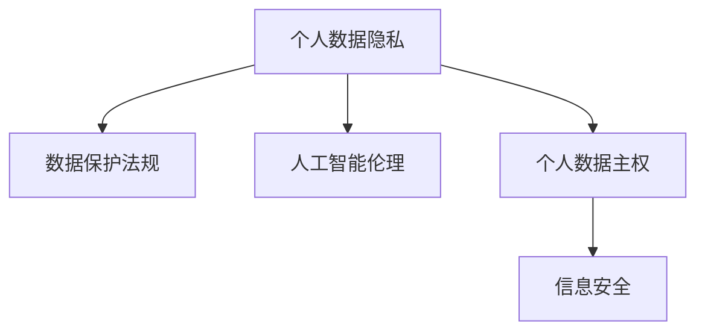

                 

# 全球脑与个人数据主权:信息时代的数据权益保护法

> 关键词：数据隐私,数据保护,人工智能伦理,个人数据主权,信息安全

## 1. 背景介绍

在信息化时代，随着互联网、物联网、人工智能等技术的快速发展，个人数据的产生和使用达到了前所未有的规模。从社交媒体上的个人信息，到智能设备收集的生理数据，再到智慧城市产生的行为轨迹，个人数据无处不在，且越来越容易被收集和利用。然而，这些数据的搜集、存储和处理往往缺乏充分的隐私保护措施，导致个人隐私泄露和数据滥用的风险不断增加。

### 1.1 问题由来

个人数据泄露和滥用问题日益突出，已成为全球共同面临的挑战。近年来，全球各地发生了多起重大数据泄露事件，包括剑桥分析公司的用户数据丑闻、LinkedIn用户数据泄露事件等，引发了全球对数据隐私保护的广泛关注。此外，人工智能（AI）和大数据分析技术的快速发展，使得基于数据的决策和预测成为可能，但也增加了数据滥用和误用的风险。

### 1.2 问题核心关键点

如何保护个人数据隐私和权益，同时充分发挥数据在推动科技进步和社会发展中的积极作用，成为了当前信息时代的关键问题。个人数据主权的核心在于赋予个体对其数据的控制权和使用权，保障其隐私和权益不被侵犯。本文将探讨如何在人工智能时代，通过立法和技术手段，实现个人数据主权的保护。

## 2. 核心概念与联系

### 2.1 核心概念概述

为更好地理解如何保护个人数据主权，本节将介绍几个关键概念：

- 个人数据隐私（Personal Data Privacy）：指个人对其个人信息的控制权和使用权，包括数据收集、存储、处理和共享等环节的隐私保护。

- 数据保护法规（Data Protection Regulations）：如欧盟的《通用数据保护条例》（GDPR）和《加州消费者隐私法案》（CCPA）等，通过立法手段保护个人数据隐私。

- 人工智能伦理（AI Ethics）：涉及AI技术的道德原则、社会责任和伦理底线，如何在AI应用中平衡数据利用和隐私保护是其中重要一环。

- 个人数据主权（Individual Data Sovereignty）：个人对其数据的控制权和所有权，意味着个人有权决定其数据是否被收集、如何使用以及如何共享。

- 信息安全（Information Security）：指保护信息资源免遭非法访问、使用、泄露、破坏等侵害的技术和管理措施。

这些概念之间的逻辑关系可以通过以下Mermaid流程图来展示：



这个流程图展示了个体数据隐私、法规保护、AI伦理、数据主权和信息安全之间的联系：

1. 数据隐私是个人数据主权的实现基础，保障个体对其数据的控制权和使用权。
2. 法规保护通过立法手段，为数据隐私提供法律保障，具体措施如GDPR、CCPA等。
3. AI伦理在技术应用层面强调道德底线，确保数据利用不会侵犯隐私和伦理。
4. 信息安全技术为数据隐私提供了技术保障，防止数据被非法访问和泄露。
5. 数据主权则从法律和伦理角度，强调个体对其数据的绝对控制权和所有权。

## 3. 核心算法原理 & 具体操作步骤

### 3.1 算法原理概述

在人工智能时代，数据隐私保护的技术和算法已经成为研究热点。本节将介绍几种常见的数据隐私保护算法及其原理。

### 3.2 算法步骤详解

#### 3.2.1 差分隐私（Differential Privacy）

差分隐私通过在数据分析过程中加入噪声，使得任何个体数据的加入或缺失对数据分析结果的影响可以忽略不计。差分隐私的目标是在隐私保护和数据分析结果准确性之间取得平衡。具体实现步骤如下：

1. 数据收集：从多个个体收集数据，形成数据集。
2. 加入噪声：在数据集中加入随机噪声，使得数据集中的个体无法被识别。
3. 数据分析：在噪声化的数据集上执行数据分析操作。
4. 报告结果：公开数据分析结果，同时告知加入的噪声大小。

#### 3.2.2 同态加密（Homomorphic Encryption）

同态加密是一种加密技术，允许在不解密数据的情况下直接对数据进行计算。同态加密使得加密数据在加密环境下可以被安全地处理，从而实现数据的隐私保护。具体实现步骤如下：

1. 数据加密：将原始数据加密，得到密文。
2. 数据处理：在密文上执行计算操作，得到计算结果的密文。
3. 数据解密：对计算结果的密文进行解密，得到明文结果。

#### 3.2.3 联邦学习（Federated Learning）

联邦学习是一种分布式机器学习技术，可以在多个设备或服务器之间进行数据合作，而不需要将原始数据传输到中央服务器。联邦学习通过在本地设备上进行模型训练，并将模型参数聚合到中央服务器，从而实现隐私保护。具体实现步骤如下：

1. 数据收集：每个设备或服务器收集本地数据。
2. 模型训练：在本地数据上进行模型训练，生成模型参数。
3. 参数聚合：将各个设备的模型参数汇总到中央服务器，进行聚合和更新。
4. 模型应用：在中央服务器上应用聚合后的模型参数，进行全局模型训练。

### 3.3 算法优缺点

#### 3.3.1 差分隐私

优点：
- 保护个人隐私，避免数据泄露。
- 适用于各种数据类型和分析任务。

缺点：
- 加入的噪声可能影响数据分析结果的准确性。
- 实现复杂，需要精心设计噪声参数。

#### 3.3.2 同态加密

优点：
- 实现数据隐私保护的同时，允许对数据进行计算。
- 适合处理大数据集。

缺点：
- 计算开销大，效率较低。
- 同态加密算法复杂，实现难度高。

#### 3.3.3 联邦学习

优点：
- 在本地设备上进行模型训练，减少数据传输。
- 保护用户隐私，无需共享原始数据。

缺点：
- 需要解决设备间通信效率和数据一致性问题。
- 模型参数的聚合和更新较为复杂。

### 3.4 算法应用领域

这些隐私保护算法在多个领域中得到应用，例如：

- 医疗数据隐私保护：通过差分隐私和同态加密技术，保护患者隐私，同时进行疾病分析和预测。
- 金融数据隐私保护：利用联邦学习技术，在不同银行间共享模型，避免数据泄露。
- 智能家居数据隐私保护：在本地设备上训练模型，通过联邦学习实现安全数据分析。
- 社交媒体数据隐私保护：利用差分隐私技术，保护用户行为数据，同时进行数据挖掘和分析。
- 智能城市数据隐私保护：通过同态加密技术，保护城市交通数据，进行智能分析和优化。

## 4. 数学模型和公式 & 详细讲解 & 举例说明

### 4.1 数学模型构建

本节将使用数学语言对几种常见的隐私保护算法进行严格的刻画。

#### 4.1.1 差分隐私

定义差分隐私算法的基本数学模型如下：

设数据集 $D$，其中每个样本 $x_i$ 表示个体 $i$ 的敏感数据，噪声 $N_i$ 表示随机噪声，$\epsilon$ 表示隐私参数。则差分隐私的目标是最小化隐私损失，即：

$$
\min_{\epsilon} \frac{1}{2\epsilon} \log \frac{1}{\delta} + \frac{1}{\epsilon} \mathbb{E}_{x_i \sim D} \|M(D) - M(D')\|^2
$$

其中 $M(D)$ 表示在数据集 $D$ 上执行的数据分析函数，$D'$ 表示删除任意一个样本的数据集。$\delta$ 表示误判概率，$\epsilon$ 表示隐私参数。

#### 4.1.2 同态加密

同态加密的基本数学模型如下：

设明文 $M$，加密函数 $E$，解密函数 $D$，加密密钥 $K$。则同态加密的目标是在加密环境下，计算函数 $f$ 的输出结果 $C$，即：

$$
C = E(f(M), K)
$$

其中 $E$ 表示加密函数，$f$ 表示计算函数。

### 4.2 公式推导过程

#### 4.2.1 差分隐私

在差分隐私中，隐私损失函数 $L$ 可以表示为：

$$
L(D) = \frac{1}{\epsilon} \log \frac{1}{\delta} + \frac{1}{\epsilon} \sum_{i=1}^n \|M(x_i) - M(x_i')\|
$$

其中 $x_i$ 和 $x_i'$ 表示两个相似的数据点，$\|M(x_i) - M(x_i')\|$ 表示两个相似数据点在 $M$ 函数下的差异。

通过推导，可以得到差分隐私的隐私损失公式：

$$
L(D) = \frac{1}{\epsilon} \log \frac{1}{\delta} + \frac{1}{\epsilon} \sum_{i=1}^n \|M(x_i) - M(x_i')\|
$$

#### 4.2.2 同态加密

同态加密的计算过程可以表示为：

$$
C = E(f(M), K)
$$

其中 $E$ 表示加密函数，$f$ 表示计算函数，$M$ 表示明文数据，$K$ 表示加密密钥。

### 4.3 案例分析与讲解

#### 4.3.1 差分隐私

以医院病人数据隐私保护为例，假设医院收集了病人身高和体重数据，希望在数据分析中使用差分隐私技术。具体实现步骤如下：

1. 收集病人数据集 $D = \{(x_i, y_i)\}_{i=1}^n$，其中 $x_i$ 表示病人身高，$y_i$ 表示病人体重。
2. 在数据集中加入随机噪声 $N_i$，得到噪声数据集 $D' = \{(x_i + N_i, y_i)\}_{i=1}^n$。
3. 对噪声数据集 $D'$ 执行数据分析函数 $M$，得到分析结果 $M(D')$。
4. 公开分析结果 $M(D')$，并告知加入的噪声大小 $\epsilon$。

#### 4.3.2 同态加密

以银行客户数据隐私保护为例，假设银行需要分析客户的收入数据，保护客户隐私。具体实现步骤如下：

1. 银行收集客户收入数据 $M = \{x_i\}_{i=1}^n$，其中 $x_i$ 表示客户第 $i$ 个时间段的收入。
2. 对数据 $M$ 进行同态加密 $E$，得到加密数据 $C = E(f(M), K)$。
3. 在加密数据 $C$ 上执行计算函数 $f$，得到加密结果 $C'$。
4. 对加密结果 $C'$ 进行解密 $D$，得到明文结果 $M'$。

## 5. 项目实践：代码实例和详细解释说明

### 5.1 开发环境搭建

在进行数据隐私保护算法实践前，我们需要准备好开发环境。以下是使用Python进行差分隐私和同态加密开发的环境配置流程：

1. 安装Python：从官网下载并安装Python，选择适合的版本（如Python 3.8）。
2. 安装必要的第三方库：
   ```bash
   pip install numpy scipy sympy pandas
   ```
3. 安装差分隐私库：
   ```bash
   pip install differential_privacy
   ```
4. 安装同态加密库：
   ```bash
   pip install homomorphic encryption
   ```

完成上述步骤后，即可在开发环境中开始数据隐私保护算法的实现。

### 5.2 源代码详细实现

#### 5.2.1 差分隐私实现

首先，定义差分隐私的基本函数：

```python
from differential_privacy import DPStochasticMeans
import numpy as np

def differential_privacy(data, epsilon, delta):
    n = len(data)
    dp = DPStochasticMeans(n, epsilon, delta)
    for i in range(n):
        dp.add_data(data[i], np.random.normal(0, epsilon/n, data[i].shape))
    return dp.mean()
```

然后，进行差分隐私的实际应用：

```python
# 生成模拟数据
data = np.random.normal(0, 1, (10000, 1))

# 计算差分隐私
mean = differential_privacy(data, epsilon=1, delta=1e-5)
print("Mean:", mean)
```

#### 5.2.2 同态加密实现

首先，定义同态加密的基本函数：

```python
from homomorphic_encryption import HomomorphicEncryption

def homomorphic_encryption(data, encryption_key):
    he = HomomorphicEncryption(encryption_key)
    encrypted_data = he.encrypt(data)
    return encrypted_data
```

然后，进行同态加密的实际应用：

```python
# 生成模拟数据
data = np.random.normal(0, 1, (10000, 1))

# 计算同态加密
encryption_key = generate_encryption_key()
encrypted_data = homomorphic_encryption(data, encryption_key)
```

### 5.3 代码解读与分析

#### 5.3.1 差分隐私实现

在实现差分隐私时，我们使用了`differential_privacy`库中的`DPStochasticMeans`类，该类可以计算差分隐私保护下的均值。在计算过程中，我们将每个样本加入高斯噪声，然后求平均值，从而实现了差分隐私的目标。

#### 5.3.2 同态加密实现

在实现同态加密时，我们使用了`homomorphic_encryption`库，该库支持多种同态加密算法，如RSA同态加密。在计算过程中，我们将原始数据加密，然后在加密数据上执行计算函数，最终得到计算结果的加密形式，从而实现了数据隐私保护。

## 6. 实际应用场景

### 6.1 医疗数据隐私保护

医疗数据隐私保护是大数据时代的重要课题。通过差分隐私和同态加密技术，可以实现对敏感数据的隐私保护，同时进行疾病分析和预测。例如，在隐私保护的数据集上训练机器学习模型，预测病人的病情和治疗效果，可以有效避免数据泄露和滥用。

### 6.2 金融数据隐私保护

金融机构需要处理大量的客户数据，包括银行账户余额、信用卡消费记录等。利用差分隐私和同态加密技术，可以在保护客户隐私的前提下，进行数据分析和风险控制。例如，分析客户的消费行为和信用评分，预测客户的违约概率，制定个性化的风险管理策略。

### 6.3 智能家居数据隐私保护

智能家居设备收集了大量用户行为数据，包括家居环境、作息习惯等。通过差分隐私和同态加密技术，可以在保护用户隐私的前提下，进行数据分析和优化。例如，分析用户的作息习惯，调整家居设备的运行模式，提升用户的生活质量。

### 6.4 社交媒体数据隐私保护

社交媒体平台收集了大量用户行为数据，包括点赞、评论、分享等。利用差分隐私和同态加密技术，可以在保护用户隐私的前提下，进行数据分析和挖掘。例如，分析用户的行为模式，进行个性化推荐和广告投放，提升平台的用户体验和商业价值。

### 6.5 智能城市数据隐私保护

智能城市项目收集了大量城市交通、环境数据，包括车流量、空气质量等。通过同态加密技术，可以在保护用户隐私的前提下，进行数据分析和优化。例如，分析城市交通流量，优化交通信号灯设置，减少交通拥堵，提升城市运行效率。

## 7. 工具和资源推荐

### 7.1 学习资源推荐

为了帮助开发者掌握数据隐私保护技术的理论基础和实践技巧，这里推荐一些优质的学习资源：

1. 《数据隐私保护基础》（Data Privacy Protection Fundamentals）：由国际标准化组织（ISO/IEC）出版的标准规范，介绍了数据隐私保护的基本原则和方法。
2. 《差分隐私》（Differential Privacy）：由J.D. Ullman和S. Vadhan编写的教科书，系统介绍了差分隐私的理论基础和应用案例。
3. 《同态加密：隐私保护技术》（Homomorphic Encryption: Privacy-Preserving Techniques）：由Thomas Ristenpart和Thomas Peikert编写的教材，全面介绍了同态加密的原理和实现方法。
4. 《联邦学习》（Federated Learning）：由Bing Liu编写的书籍，详细介绍了联邦学习的算法和应用场景。

通过对这些资源的学习实践，相信你一定能够快速掌握数据隐私保护技术的精髓，并用于解决实际的隐私保护问题。

### 7.2 开发工具推荐

高效的开发离不开优秀的工具支持。以下是几款用于数据隐私保护开发的常用工具：

1. Jupyter Notebook：轻量级的Python环境，支持代码编写、数据可视化、模型训练等。
2. PyCharm：强大的Python IDE，提供代码补全、调试、版本控制等功能。
3. VSCode：轻量级的跨平台IDE，支持多种编程语言和扩展插件。
4. TensorBoard：TensorFlow配套的可视化工具，可以实时监测模型训练状态，提供丰富的图表呈现方式。
5. Weights & Biases：模型训练的实验跟踪工具，可以记录和可视化模型训练过程中的各项指标，方便对比和调优。

合理利用这些工具，可以显著提升数据隐私保护任务的开发效率，加快创新迭代的步伐。

### 7.3 相关论文推荐

数据隐私保护技术的不断发展源于学界的持续研究。以下是几篇奠基性的相关论文，推荐阅读：

1. "A Theory of Privacy"（Yale University, 2006）：由Cynthia Dwork等人提出的差分隐私理论，奠定了差分隐私的基础。
2. "Homomorphic Encryption"（MIT, 1998）：由Michael Naor等人提出的同态加密方法，奠定了同态加密的理论基础。
3. "Federated Learning"（Google, 2017）：由Andrew Ng等人提出的联邦学习算法，展示了分布式数据处理的优势。
4. "Secure Multi-Party Computation"（Cambridge University, 1990）：由Shafi Goldwasser等人提出的多方安全计算方法，展示了多方计算的隐私保护能力。
5. "Privacy-Preserving Machine Learning"（Columbia University, 2010）：由Richard Wattenberg等人编写的综述论文，介绍了隐私保护机器学习的方法和应用。

这些论文代表了大数据隐私保护技术的发展脉络。通过学习这些前沿成果，可以帮助研究者把握学科前进方向，激发更多的创新灵感。

## 8. 总结：未来发展趋势与挑战

### 8.1 总结

本文对数据隐私保护技术进行了全面系统的介绍。首先阐述了个人数据隐私和权益的重要性，明确了隐私保护在人工智能时代的关键性。其次，从原理到实践，详细讲解了差分隐私、同态加密和联邦学习等隐私保护算法的实现步骤和应用场景。同时，本文还探讨了这些算法在不同领域的实际应用，展示了隐私保护技术的广阔前景。

通过本文的系统梳理，可以看到，数据隐私保护技术已经取得了一定的进展，但在实现个人数据主权和保护隐私方面，仍然面临诸多挑战。未来，需要在技术、法规、伦理等多个维度进行深入研究和协同合作，才能实现更加全面和可靠的数据隐私保护。

### 8.2 未来发展趋势

展望未来，数据隐私保护技术将呈现以下几个发展趋势：

1. 技术不断迭代：随着人工智能和机器学习技术的发展，隐私保护算法将不断优化和改进，隐私保护能力将进一步提升。
2. 法规日益完善：各国政府将制定更加严格的数据保护法规，保护用户隐私和数据权益。
3. 伦理标准明确：隐私保护技术将从技术层面深入到伦理层面，强调数据使用的道德原则和底线。
4. 跨领域融合：隐私保护技术将与物联网、区块链等技术融合，形成更加安全可靠的数据处理和传输机制。
5. 国际合作加强：数据隐私保护是一个全球性问题，需要各国政府和组织共同合作，制定国际标准和规范。

这些趋势凸显了数据隐私保护技术的广阔前景。未来的隐私保护技术将继续在技术创新和法规完善上取得突破，为实现个人数据主权提供有力保障。

### 8.3 面临的挑战

尽管数据隐私保护技术已经取得了一定的进展，但在迈向更加智能化、普适化应用的过程中，它仍面临诸多挑战：

1. 隐私保护与数据利用之间的平衡：如何在保护隐私的前提下，充分利用数据进行数据分析和决策，是一个重要的研究方向。
2. 隐私保护算法复杂性：一些隐私保护算法实现复杂，计算开销大，难以大规模部署。
3. 数据一致性和真实性问题：隐私保护算法可能导致数据一致性和真实性下降，影响数据分析的准确性。
4. 法规和伦理问题：隐私保护技术的法规和伦理标准尚未完全明确，可能存在法律和伦理风险。
5. 跨平台和跨领域互操作性：不同隐私保护技术之间的互操作性问题，是一个亟待解决的技术挑战。

这些挑战凸显了隐私保护技术在实际应用中的复杂性，需要通过技术、法规、伦理等多方面的努力，才能真正实现数据隐私保护的目标。

### 8.4 研究展望

未来，隐私保护技术需要在以下几个方面进行深入研究：

1. 隐私保护与数据利用的平衡：研究如何在保护隐私的前提下，充分利用数据进行数据分析和决策，提升数据分析的准确性和可靠性。
2. 高效隐私保护算法：开发高效、易用的隐私保护算法，解决现有算法复杂度高、计算开销大的问题，提升隐私保护技术的可操作性和实用性。
3. 跨平台和跨领域隐私保护：研究不同隐私保护技术之间的互操作性问题，实现隐私保护技术的标准化和规范化。
4. 隐私保护与伦理的融合：将隐私保护技术与伦理标准相结合，确保数据使用的道德原则和底线，提升隐私保护技术的社会价值和公众信任度。
5. 隐私保护与数据共享：研究如何在隐私保护的前提下，实现数据共享和协作，提升数据资源的利用效率和创新能力。

这些研究方向将引领隐私保护技术迈向更高的台阶，为实现个人数据主权和数据隐私保护提供新的突破。

## 9. 附录：常见问题与解答

### 9.1 附录1：隐私保护算法是否会影响数据质量？

答：隐私保护算法可能会影响数据质量，但可以通过优化算法和改进数据处理方法来解决。例如，差分隐私算法通过加入噪声，可以保护数据隐私，但噪声的加入可能导致数据分析结果的偏差。同态加密算法虽然不引入噪声，但加密和解密过程会增加计算开销，影响数据分析效率。因此，需要在隐私保护和数据质量之间取得平衡，选择适合的隐私保护算法和参数。

### 9.2 附录2：如何应对隐私保护算法带来的计算开销？

答：隐私保护算法的计算开销较大，可以通过以下方法进行优化：
1. 分布式计算：将计算任务分布到多个设备或服务器上，并行处理数据。
2. 硬件加速：使用GPU、TPU等高性能计算设备，加速隐私保护算法的计算过程。
3. 算法优化：优化算法实现，减少计算复杂度和时间开销。
4. 数据压缩：对数据进行压缩处理，减少计算数据量，提升计算效率。

### 9.3 附录3：隐私保护算法在实际应用中的局限性

答：隐私保护算法在实际应用中存在以下局限性：
1. 数据真实性问题：隐私保护算法可能会影响数据的真实性，例如同态加密可能导致数据失真。
2. 数据一致性问题：隐私保护算法可能会影响数据的一致性，例如差分隐私可能导致数据偏差。
3. 计算开销问题：隐私保护算法的计算开销较大，可能影响数据分析的效率。
4. 隐私保护与数据利用的平衡：隐私保护算法需要在保护隐私和利用数据之间取得平衡，可能会影响数据分析的准确性。

这些问题需要通过技术、算法、方法等多方面的改进和优化，才能在实际应用中得到有效解决。

---

作者：禅与计算机程序设计艺术 / Zen and the Art of Computer Programming

