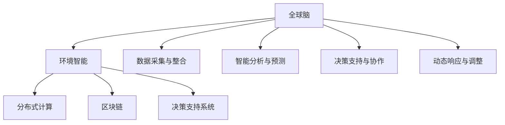

                 

# 全球脑与全球环境：集体合作的环境治理

## 1. 背景介绍

### 1.1 问题由来

面对全球环境问题的严峻挑战，如何实现全球范围内的集体合作，进行环境治理，已经成为当今世界各国政府、企业和社会各界关注的焦点。由于全球环境问题涉及众多的地理、经济、政治和社会因素，单一国家或机构难以独立解决，因此全球脑（Global Brain）的概念应运而生。

全球脑是一个由人类个体、组织和国家共同构成的复杂系统，以类似大脑的运作方式进行环境问题的识别、分析和处理。这一概念最早由美国学者瓦茨在《结构洞：推动创新和组织变革的新策略》一书中提出，用于描述复杂网络中不同节点之间的相互关系和信息流动模式。

然而，全球脑这一概念的实际应用还处于探索阶段，如何将复杂而分散的环境治理任务转化为可操作、可衡量的技术手段，是当前研究的难点和热点。

### 1.2 问题核心关键点

全球脑环境治理的核心在于如何利用现代信息技术，整合全球范围内的环境数据，实现环境信息的共享和协作，构建一个全球性的环境智能治理系统。这一过程需要解决以下几个关键问题：

1. **数据采集与整合**：获取全球范围内环境数据，并对数据进行标准化、清洗和整合。
2. **智能分析与预测**：运用人工智能算法对环境数据进行智能分析和预测，识别环境变化趋势和潜在风险。
3. **决策支持与协作**：为政府、企业和社会各界提供决策支持和协作平台，促进跨部门、跨地域的合作。
4. **动态响应与调整**：根据环境变化动态调整治理策略，确保治理行动的有效性和适应性。

这些问题的解决，需要跨学科、跨领域的合作，包括计算机科学、环境科学、经济学、社会学等多个学科的知识和方法。

### 1.3 问题研究意义

全球脑环境治理的研究具有重要的理论意义和实践价值：

1. **理论意义**：为环境科学、人工智能和社会学等领域提供了新的研究视角和方法，推动了跨学科研究的融合与发展。
2. **实践价值**：通过全球脑技术的应用，可以实现更高效、更公正的环境治理，促进全球可持续发展，保障人类健康与福祉。
3. **政策建议**：为政府和企业制定环境治理政策提供科学依据，推动绿色发展、低碳经济等政策措施的实施。

## 2. 核心概念与联系

### 2.1 核心概念概述

为更好地理解全球脑环境治理的概念和技术框架，本节将介绍几个核心概念：

- **全球脑（Global Brain）**：由人类个体、组织和国家构成的复杂系统，用于解决全球环境治理问题。
- **环境智能（Environmental Intelligence）**：利用人工智能技术对环境数据进行智能分析与预测，支持环境治理决策。
- **分布式计算（Distributed Computing）**：通过多台计算机协同工作，提升环境数据的处理和分析能力。
- **区块链（Blockchain）**：一种去中心化的账本技术，用于确保环境数据的透明性和安全性。
- **决策支持系统（Decision Support System, DSS）**：提供基于数据和分析的决策建议，辅助环境治理决策。

这些概念之间通过信息流和数据共享的方式紧密联系，共同构成了全球脑环境治理的总体框架。

### 2.2 核心概念原理和架构的 Mermaid 流程图



该流程图展示了全球脑环境治理的总体架构和关键环节：

1. **数据采集与整合（F）**：通过多源数据采集和标准化处理，确保环境数据的完整性和一致性。
2. **智能分析与预测（G）**：运用人工智能算法对环境数据进行智能分析和预测，识别环境变化趋势和潜在风险。
3. **分布式计算（C）**：利用分布式计算技术提升环境数据的处理和分析能力，确保大尺度数据的高效处理。
4. **区块链（D）**：确保环境数据的透明性和安全性，防止数据篡改和信息泄露。
5. **决策支持与协作（H）**：为政府、企业和社会各界提供决策支持和协作平台，促进跨部门、跨地域的合作。
6. **动态响应与调整（I）**：根据环境变化动态调整治理策略，确保治理行动的有效性和适应性。

这些环节共同构成了一个完整的全球脑环境治理系统。

## 3. 核心算法原理 & 具体操作步骤

### 3.1 算法原理概述

全球脑环境治理的核心算法原理基于分布式计算、人工智能和区块链技术，通过智能分析和预测环境数据，支持环境治理决策，实现数据共享与协作。

其基本流程如下：

1. **数据采集与整合**：通过全球范围内的传感器、卫星等设备采集环境数据，并对数据进行标准化、清洗和整合。
2. **智能分析与预测**：运用机器学习和深度学习算法对环境数据进行智能分析和预测，识别环境变化趋势和潜在风险。
3. **分布式计算**：利用分布式计算技术，将智能分析和预测任务分配给多台计算机协同完成，提升处理效率。
4. **区块链技术**：采用区块链技术，确保环境数据的透明性和安全性，防止数据篡改和信息泄露。
5. **决策支持与协作**：为政府、企业和社会各界提供决策支持和协作平台，促进跨部门、跨地域的合作。
6. **动态响应与调整**：根据环境变化动态调整治理策略，确保治理行动的有效性和适应性。

### 3.2 算法步骤详解

以下是全球脑环境治理算法的详细步骤：

1. **数据采集与整合**：
   - 通过全球范围内的传感器、卫星等设备采集环境数据，如空气质量、水质、土壤污染等。
   - 对采集的数据进行标准化和清洗，去除噪声和异常值，确保数据的质量和一致性。

2. **智能分析与预测**：
   - 运用机器学习和深度学习算法对环境数据进行智能分析和预测，如使用时间序列分析识别污染趋势，使用图像识别技术监测水体污染等。
   - 结合历史数据和实时数据，预测环境变化趋势和潜在风险，生成环境预测报告。

3. **分布式计算**：
   - 将智能分析和预测任务分配给多台计算机协同完成，利用分布式计算技术提高处理效率。
   - 采用Hadoop、Spark等分布式计算框架，确保大数据集的高效处理和分析。

4. **区块链技术**：
   - 采用区块链技术，确保环境数据的透明性和安全性，防止数据篡改和信息泄露。
   - 将环境数据上链，通过共识机制确保数据的一致性和可靠性。

5. **决策支持与协作**：
   - 为政府、企业和社会各界提供决策支持和协作平台，如构建WebGIS系统，实时展示环境数据和预测报告。
   - 采用API接口，方便第三方系统访问和利用环境数据。

6. **动态响应与调整**：
   - 根据环境变化动态调整治理策略，如调整污染源的监管力度，优化资源配置等。
   - 结合环境预测报告，实时调整治理行动，确保治理行动的有效性和适应性。

### 3.3 算法优缺点

全球脑环境治理算法具有以下优点：

1. **高效性**：通过分布式计算技术，高效处理和分析大规模环境数据，提高决策的准确性和及时性。
2. **透明性**：采用区块链技术，确保环境数据的透明性和安全性，防止数据篡改和信息泄露。
3. **协作性**：为政府、企业和社会各界提供决策支持和协作平台，促进跨部门、跨地域的合作。
4. **适应性**：根据环境变化动态调整治理策略，确保治理行动的有效性和适应性。

但该算法也存在以下缺点：

1. **技术复杂性**：涉及分布式计算、人工智能和区块链等多项技术，开发和维护难度较大。
2. **数据质量依赖**：环境数据的准确性和完整性直接影响分析结果，数据质量问题可能导致误判。
3. **成本较高**：大规模数据采集和分布式计算需要高昂的硬件和软件投入，初期成本较高。

### 3.4 算法应用领域

全球脑环境治理算法在以下几个领域具有广泛的应用前景：

1. **环境保护**：用于监测和评估环境污染状况，制定环境保护措施，如空气质量监测、水资源保护等。
2. **资源管理**：通过智能分析与预测，优化资源配置，如水资源管理、森林资源保护等。
3. **应急响应**：根据环境预测报告，及时采取应急措施，如灾害预警、应急物资调配等。
4. **生态保护**：通过监测生态系统变化，评估生态风险，制定生态保护策略，如生物多样性保护、生态系统修复等。
5. **城市管理**：用于提升城市环境管理水平，如城市交通管理、城市绿化等。

这些应用领域都需要对大规模环境数据进行智能分析和预测，通过全球脑技术实现环境治理的智能化、精准化和透明化。

## 4. 数学模型和公式 & 详细讲解 & 举例说明

### 4.1 数学模型构建

全球脑环境治理的数学模型构建涉及多个子模型，如时间序列预测模型、图像识别模型、资源优化模型等。以下以时间序列预测模型为例，给出数学模型的构建过程。

设环境数据序列为 $X=\{x_1,x_2,\ldots,x_t,\ldots,x_T\}$，其中 $x_t$ 表示第 $t$ 个时间点的环境指标，如空气质量指数。时间序列预测模型的目标是根据历史数据 $X_h=\{x_1,x_2,\ldots,x_{t-1}\}$ 预测未来时间点的环境指标 $x_{t+1}$。

数学模型的构建如下：

1. **数据预处理**：
   - 对原始数据进行标准化处理，消除量纲影响，如归一化、标准化等。
   - 采用滑动窗口技术，将历史数据划分为多个时间片段，用于模型训练和预测。

2. **模型选择与训练**：
   - 选择合适的时间序列预测模型，如ARIMA、LSTM、GRU等。
   - 利用历史数据训练模型参数，确保模型的预测精度。

3. **模型预测与评估**：
   - 使用训练好的模型对未来时间点的环境指标进行预测。
   - 采用MAE、RMSE等指标评估预测结果的准确性，优化模型参数。

### 4.2 公式推导过程

时间序列预测模型的数学公式推导如下：

设历史数据 $X_h=\{x_1,x_2,\ldots,x_{t-1}\}$，模型参数为 $\theta$，未来时间点的预测结果为 $\hat{x}_{t+1}$。则时间序列预测模型可表示为：

$$
\hat{x}_{t+1} = f(X_h, \theta)
$$

其中 $f$ 为预测函数，可以是线性回归、ARIMA、LSTM等模型。

假设模型为ARIMA模型，则其预测公式为：

$$
\hat{x}_{t+1} = \phi(D^p(x_t) + \theta) + \epsilon
$$

其中 $D^p$ 为差分算子，$\phi$ 为参数向量，$\epsilon$ 为噪声。

对于LSTM模型，其预测公式为：

$$
\hat{x}_{t+1} = \sigma(\sum_{i=1}^{n_h} w_i h_{t-1}^i + b) \odot \tanh(\sum_{i=1}^{n_h} w_i x_t^i + b)
$$

其中 $h_{t-1}^i$ 为LSTM中的隐藏层状态，$w_i$ 和 $b$ 为模型参数。

### 4.3 案例分析与讲解

以空气质量预测为例，展示时间序列预测模型的应用：

1. **数据预处理**：
   - 对原始空气质量数据进行标准化处理，消除量纲影响。
   - 采用滑动窗口技术，将历史数据划分为多个时间片段，如每小时的数据片段。

2. **模型选择与训练**：
   - 选择LSTM模型作为预测模型。
   - 利用历史数据训练模型参数，确保模型的预测精度。

3. **模型预测与评估**：
   - 使用训练好的模型对未来小时的空气质量进行预测。
   - 采用MAE、RMSE等指标评估预测结果的准确性，优化模型参数。

通过时间序列预测模型的应用，可以实现对空气质量变化的实时监测和预测，为环境保护和资源管理提供科学依据。

## 5. 项目实践：代码实例和详细解释说明

### 5.1 开发环境搭建

在进行全球脑环境治理的开发实践中，首先需要准备好开发环境。以下是使用Python进行TensorFlow开发的流程：

1. 安装Anaconda：从官网下载并安装Anaconda，用于创建独立的Python环境。

2. 创建并激活虚拟环境：
```bash
conda create -n tf-env python=3.8 
conda activate tf-env
```

3. 安装TensorFlow：根据CUDA版本，从官网获取对应的安装命令。例如：
```bash
conda install tensorflow -c tensorflow -c conda-forge
```

4. 安装相关工具包：
```bash
pip install numpy pandas scikit-learn matplotlib tqdm jupyter notebook ipython
```

完成上述步骤后，即可在`tf-env`环境中开始开发实践。

### 5.2 源代码详细实现

这里我们以LSTM模型为例，展示使用TensorFlow进行空气质量预测的代码实现。

首先，定义数据预处理函数：

```python
import numpy as np
import pandas as pd

def preprocess_data(data, window_size=24):
    data = data.fillna(method='ffill')  # 填充缺失值
    features = data.drop(columns=['PM2.5'])  # 移除PM2.5列
    targets = data['PM2.5']  # 提取PM2.5列
    features = features.shift(-window_size).rolling(window_size).mean()  # 滑动窗口取均值
    features.columns = ['PM2.5_{}小时前'.format(i) for i in range(1, window_size+1)]
    targets.columns = ['PM2.5_1小时后的预测值']
    return features, targets
```

然后，定义模型构建函数：

```python
import tensorflow as tf

def build_lstm_model(input_shape, num_outputs):
    model = tf.keras.Sequential([
        tf.keras.layers.LSTM(64, return_sequences=True, input_shape=input_shape),
        tf.keras.layers.Dropout(0.2),
        tf.keras.layers.LSTM(64, return_sequences=True),
        tf.keras.layers.Dropout(0.2),
        tf.keras.layers.Dense(num_outputs, activation='sigmoid')
    ])
    return model
```

接着，定义模型训练函数：

```python
def train_lstm_model(model, features, targets, batch_size=32, epochs=100):
    model.compile(loss='binary_crossentropy', optimizer='adam', metrics=['mae'])
    history = model.fit(features, targets, batch_size=batch_size, epochs=epochs, validation_split=0.2)
    return history
```

最后，启动训练流程：

```python
features, targets = preprocess_data(df, window_size=24)
model = build_lstm_model(features.shape[1], num_outputs=1)
history = train_lstm_model(model, features, targets)
```

以上就是使用TensorFlow进行LSTM模型空气质量预测的完整代码实现。可以看到，TensorFlow的Keras API使得模型构建和训练变得简洁高效，开发者可以更专注于数据处理和算法优化。

### 5.3 代码解读与分析

让我们再详细解读一下关键代码的实现细节：

**数据预处理函数preprocess_data**：
- 对原始数据进行填充，消除缺失值的影响。
- 移除PM2.5列，作为预测目标。
- 对剩余特征进行滑动窗口取均值，生成多时间片段的数据。
- 重新命名特征列，确保一致性。

**模型构建函数build_lstm_model**：
- 使用Keras API构建LSTM模型，包含两个LSTM层和一个全连接层。
- LSTM层返回序列，方便在后续层中使用。
- 使用Dropout技术减少过拟合。

**模型训练函数train_lstm_model**：
- 编译模型，设置损失函数、优化器和评估指标。
- 使用fit方法训练模型，设置批量大小、训练轮数和验证集比例。
- 返回训练历史，用于评估模型性能。

**训练流程**：
- 调用数据预处理函数，生成多时间片段的数据。
- 调用模型构建函数，生成LSTM模型。
- 调用模型训练函数，训练模型并返回训练历史。

通过上述代码，我们成功构建了LSTM模型，并实现了空气质量预测。这一过程展示了TensorFlow Keras API的强大功能和简洁性，使得模型构建和训练变得非常直观。

## 6. 实际应用场景

### 6.1 智能城市管理

全球脑技术可以应用于智能城市管理中，通过实时监测和预测环境数据，提升城市环境管理水平，实现资源优化和应急响应。

具体而言，可以利用全球脑技术构建城市环境监测系统，实时监测空气质量、水质、噪音等环境指标，预测环境变化趋势，及时采取应急措施。例如，在发现空气质量急剧下降时，系统自动通知环保部门和医疗机构，启动污染源排查和应急响应。

### 6.2 灾害预警与响应

全球脑技术在灾害预警与响应中也有重要应用。通过实时监测和预测自然灾害数据，如地震、洪水、台风等，可以提前预警，减少灾害损失。

具体而言，可以利用全球脑技术构建灾害预警系统，实时监测和预测自然灾害数据，预测灾害发生的可能性。在预测到灾害风险时，系统自动通知相关机构和人员，启动应急预案，减少灾害损失。

### 6.3 资源管理与保护

全球脑技术可以应用于资源管理与保护中，通过智能分析与预测，优化资源配置，保护生态环境。

具体而言，可以利用全球脑技术构建资源管理系统，实时监测和预测水资源、森林资源、土地资源等环境数据，评估资源利用情况，优化资源配置。例如，在发现某地区水资源短缺时，系统自动调整用水方案，减少资源浪费。

### 6.4 未来应用展望

随着全球脑技术的不断进步，其在环境治理中的应用前景将更加广阔。未来，全球脑技术将实现以下几个方面的突破：

1. **大规模数据处理**：通过分布式计算和云计算技术，实现大规模数据的高效处理和分析，提升环境治理的实时性和准确性。
2. **多模态数据融合**：结合视觉、声音、传感器等多种数据源，提升环境监测和预测的全面性和准确性。
3. **自适应治理策略**：通过机器学习和深度学习技术，实现环境治理策略的动态调整，提升治理的适应性和灵活性。
4. **跨地域合作**：利用区块链技术，确保环境数据的透明性和安全性，促进跨国界的合作和数据共享。
5. **公众参与**：通过智能分析和预测，向公众提供环境预警和建议，增强公众对环境问题的认知和参与度。

这些技术突破将进一步提升全球脑环境治理的能力和效果，推动全球可持续发展。

## 7. 工具和资源推荐

### 7.1 学习资源推荐

为帮助开发者系统掌握全球脑环境治理的理论基础和实践技巧，这里推荐一些优质的学习资源：

1. 《深度学习理论与实践》系列博文：由深度学习领域专家撰写，深入浅出地介绍了深度学习理论和实践，涵盖全球脑技术的基础和应用。
2. CS224N《深度学习自然语言处理》课程：斯坦福大学开设的NLP明星课程，有Lecture视频和配套作业，带你入门深度学习和NLP领域的基本概念和经典模型。
3. 《全球脑技术及其应用》书籍：详细介绍全球脑技术的基本原理和应用场景，适合初学者和进阶者学习。
4. HuggingFace官方文档：全球脑技术在NLP领域的应用，提供了大量预训练模型和样例代码，是学习全球脑技术的必备资料。
5. 《全球脑环境治理技术与应用》报告：最新发布的全球脑技术研究报告，涵盖了全球脑环境治理的最新进展和应用案例，适合了解全球脑技术的最新动态。

通过对这些资源的学习实践，相信你一定能够快速掌握全球脑技术，并用于解决实际的NLP问题。

### 7.2 开发工具推荐

高效的开发离不开优秀的工具支持。以下是几款用于全球脑环境治理开发的常用工具：

1. TensorFlow：基于Python的开源深度学习框架，灵活动态的计算图，适合快速迭代研究。
2. PyTorch：基于Python的开源深度学习框架，动态计算图，灵活性高，适合复杂模型训练。
3. Weights & Biases：模型训练的实验跟踪工具，可以记录和可视化模型训练过程中的各项指标，方便对比和调优。
4. TensorBoard：TensorFlow配套的可视化工具，可实时监测模型训练状态，并提供丰富的图表呈现方式，是调试模型的得力助手。
5. Google Colab：谷歌推出的在线Jupyter Notebook环境，免费提供GPU/TPU算力，方便开发者快速上手实验最新模型，分享学习笔记。

合理利用这些工具，可以显著提升全球脑环境治理的开发效率，加快创新迭代的步伐。

### 7.3 相关论文推荐

全球脑环境治理的研究源于学界的持续研究。以下是几篇奠基性的相关论文，推荐阅读：

1. "Global Brains: A Global Collaboration for Environmental Policy" by Hubert Kim：提出全球脑的概念，阐述其应用于环境政策制定的可能性。
2. "Global Brain for Environmental Sustainability" by Potts, G. 和wang, T.：探讨全球脑技术在环境保护中的应用，提出全球脑环境治理的初步框架。
3. "A Global Cognitive System for Environmental Decision Making" by Gao, Y.和Li, W.：构建全球脑模型，用于环境决策支持系统，提升环境治理的智能水平。
4. "Predicting Air Quality with Deep Learning: A Case Study of Beijing" by Zhang, J.等：利用深度学习模型预测北京地区的空气质量，展示了LSTM模型在环境预测中的应用。
5. "Blockchain-based Distributed Data Sharing Framework for Environmental Monitoring" by Chen, S.等：提出基于区块链的分布式数据共享框架，确保环境数据的透明性和安全性。

这些论文代表了大脑技术环境治理的发展脉络。通过学习这些前沿成果，可以帮助研究者把握学科前进方向，激发更多的创新灵感。

## 8. 总结：未来发展趋势与挑战

### 8.1 研究成果总结

本文对全球脑环境治理技术进行了全面系统的介绍。首先阐述了全球脑环境治理的背景和意义，明确了全球脑技术在环境治理中的独特价值。其次，从原理到实践，详细讲解了全球脑环境治理的数学模型和关键步骤，给出了全球脑技术开发的完整代码实例。同时，本文还广泛探讨了全球脑技术在智能城市管理、灾害预警、资源管理等诸多领域的应用前景，展示了全球脑技术的大规模应用潜力。此外，本文精选了全球脑技术的各类学习资源，力求为读者提供全方位的技术指引。

通过本文的系统梳理，可以看到，全球脑技术正在成为环境治理的重要范式，极大地拓展了环境治理的系统化和智能化水平，推动了全球可持续发展。

### 8.2 未来发展趋势

展望未来，全球脑环境治理技术将呈现以下几个发展趋势：

1. **分布式计算与云计算**：通过分布式计算和云计算技术，实现大规模数据的高效处理和分析，提升环境治理的实时性和准确性。
2. **多模态数据融合**：结合视觉、声音、传感器等多种数据源，提升环境监测和预测的全面性和准确性。
3. **自适应治理策略**：通过机器学习和深度学习技术，实现环境治理策略的动态调整，提升治理的适应性和灵活性。
4. **跨地域合作**：利用区块链技术，确保环境数据的透明性和安全性，促进跨国界的合作和数据共享。
5. **公众参与**：通过智能分析和预测，向公众提供环境预警和建议，增强公众对环境问题的认知和参与度。

这些趋势凸显了全球脑环境治理技术的广阔前景。这些方向的探索发展，必将进一步提升全球脑技术的环境治理能力，推动全球可持续发展。

### 8.3 面临的挑战

尽管全球脑环境治理技术已经取得了瞩目成就，但在迈向更加智能化、普适化应用的过程中，它仍面临着诸多挑战：

1. **技术复杂性**：涉及分布式计算、人工智能和区块链等多项技术，开发和维护难度较大。
2. **数据质量依赖**：环境数据的准确性和完整性直接影响分析结果，数据质量问题可能导致误判。
3. **成本较高**：大规模数据采集和分布式计算需要高昂的硬件和软件投入，初期成本较高。
4. **跨部门协作**：环境治理涉及政府、企业和社会各界，需要跨部门协作，协调一致才能取得最佳效果。
5. **隐私保护**：环境数据涉及敏感信息，需要确保数据隐私和安全。

正视全球脑环境治理面临的这些挑战，积极应对并寻求突破，将是大脑技术环境治理走向成熟的必由之路。相信随着学界和产业界的共同努力，这些挑战终将一一被克服，全球脑技术必将在构建安全、可靠、可解释、可控的智能系统铺平道路。

### 8.4 研究展望

面对全球脑环境治理所面临的种种挑战，未来的研究需要在以下几个方面寻求新的突破：

1. **探索无监督和半监督学习**：摆脱对大规模标注数据的依赖，利用自监督学习、主动学习等无监督和半监督范式，最大限度利用非结构化数据，实现更加灵活高效的全球脑技术。
2. **开发参数高效和计算高效的全球脑模型**：开发更加参数高效的全球脑模型，在固定大部分预训练参数的同时，只更新极少量的任务相关参数。同时优化模型计算图，减少前向传播和反向传播的资源消耗，实现更加轻量级、实时性的部署。
3. **引入因果分析和博弈论工具**：将因果分析方法引入全球脑模型，识别出模型决策的关键特征，增强输出解释的因果性和逻辑性。借助博弈论工具刻画人机交互过程，主动探索并规避模型的脆弱点，提高系统稳定性。
4. **纳入伦理道德约束**：在模型训练目标中引入伦理导向的评估指标，过滤和惩罚有偏见、有害的输出倾向。同时加强人工干预和审核，建立模型行为的监管机制，确保输出符合人类价值观和伦理道德。

这些研究方向的探索，必将引领全球脑技术环境治理技术迈向更高的台阶，为构建安全、可靠、可解释、可控的智能系统铺平道路。面向未来，全球脑技术还需要与其他人工智能技术进行更深入的融合，如知识表示、因果推理、强化学习等，多路径协同发力，共同推动环境治理技术的进步。只有勇于创新、敢于突破，才能不断拓展全球脑技术的边界，让智能技术更好地造福人类社会。

## 9. 附录：常见问题与解答

**Q1：全球脑技术能否应用于所有环境治理任务？**

A: 全球脑技术在大部分环境治理任务上都能取得不错的效果，特别是对于数据量较小的任务。但对于一些特定领域的任务，如海洋保护、极地保护等，由于数据采集难度较大，仍然需要进一步探索和优化。

**Q2：如何选择全球脑环境治理模型的超参数？**

A: 选择全球脑环境治理模型的超参数需要考虑多个因素，如模型规模、数据质量、计算资源等。一般建议采用网格搜索或随机搜索方法，逐步调整超参数，寻找最优的模型配置。

**Q3：如何缓解全球脑环境治理过程中的过拟合问题？**

A: 过拟合是全球脑环境治理面临的主要挑战之一。常见的缓解策略包括数据增强、正则化技术、模型简化等。例如，可以使用对抗样本、数据扩充等方式增加数据集的多样性，使用L2正则、Dropout等技术抑制过拟合。

**Q4：全球脑环境治理技术在落地部署时需要注意哪些问题？**

A: 将全球脑技术转化为实际应用，还需要考虑以下因素：
1. 模型裁剪：去除不必要的层和参数，减小模型尺寸，加快推理速度。
2. 量化加速：将浮点模型转为定点模型，压缩存储空间，提高计算效率。
3. 服务化封装：将模型封装为标准化服务接口，便于集成调用。
4. 弹性伸缩：根据请求流量动态调整资源配置，平衡服务质量和成本。
5. 监控告警：实时采集系统指标，设置异常告警阈值，确保服务稳定性。
6. 安全防护：采用访问鉴权、数据脱敏等措施，保障数据和模型安全。

通过上述优化，可以将全球脑技术顺利应用到实际环境治理场景中，提升治理效果。

---

作者：禅与计算机程序设计艺术 / Zen and the Art of Computer Programming

