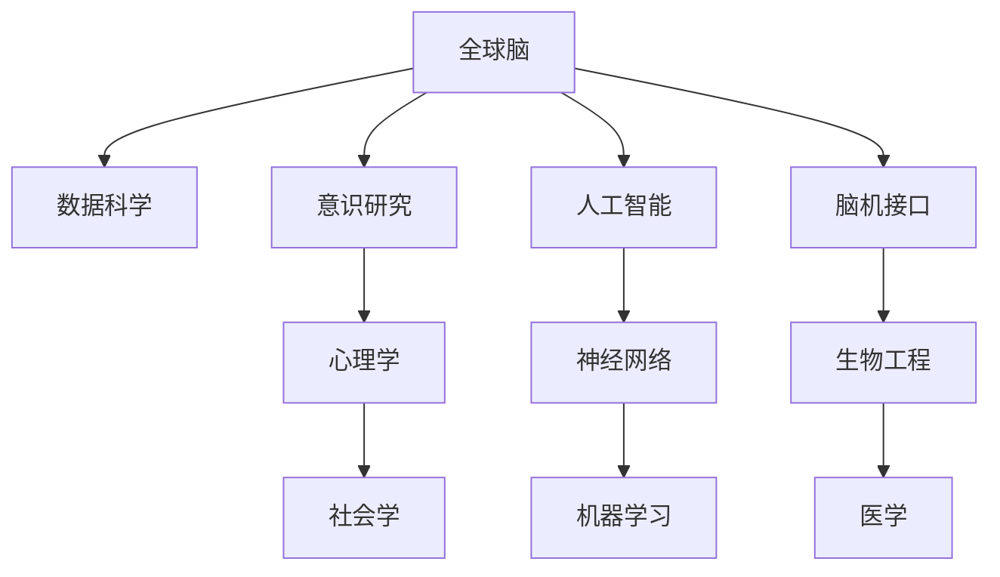

                 

# 全球脑与意识探索:集体潜意识状态的研究

> 关键词：全球脑,集体潜意识,意识研究,神经网络,人工智能,脑机接口,数据科学,伦理

## 1. 背景介绍

### 1.1 问题由来
随着科学技术的迅猛发展，人类对大脑的研究已经从微观层面深入到宏观层面。全球脑(World Brain)的概念，即利用先进的数据科学和人工智能技术，将全球范围内的人类大脑数据进行整合和分析，试图揭示人类意识和行为模式的内在联系。这一研究领域旨在通过科学的手段，了解全球范围内不同个体的思维模式和情感状态，从而为人类社会的健康、教育、经济等领域提供科学依据。

### 1.2 问题核心关键点
全球脑研究的核心在于探索人类的集体潜意识状态，即在全球范围内通过数据科学和人工智能技术，揭示人类行为的共同特征和规律。这一研究不仅有助于理解人类社会的行为模式和心理机制，还能够为治理、教育、经济发展等提供科学依据。然而，这一研究也面临着数据隐私、伦理问题和技术实现的诸多挑战。

### 1.3 问题研究意义
全球脑研究具有重要的理论价值和现实意义：
- 理论价值：通过全球脑研究，可以进一步理解人类大脑的运作机制，揭示人类行为的规律，推动心理学、神经科学、社会学等学科的发展。
- 现实意义：全球脑研究可以为政策制定、经济规划、教育优化、公共卫生等领域提供数据支持，促进社会公正和可持续发展。

## 2. 核心概念与联系

### 2.1 核心概念概述

为更好地理解全球脑研究，本节将介绍几个密切相关的核心概念：

- 全球脑(World Brain)：利用先进的数据科学和人工智能技术，将全球范围内的人类大脑数据进行整合和分析，揭示人类行为和思维模式的内在联系。
- 集体潜意识(Collective Unconscious)：根据卡尔·荣格（Carl Jung）的理论，集体潜意识是人类共有的深层心理结构，包含所有人类共有的经验、情感和知识的沉淀。
- 意识研究(Consciousness Research)：探索人类意识的本质和机制，研究人类意识在生理、心理和社会层面上的表现。
- 神经网络(Neural Network)：模拟人类大脑神经元结构和功能的计算模型，通过学习和推理，可以实现复杂的模式识别和决策。
- 人工智能(Artificial Intelligence)：通过模拟人类智能的算法和技术，使计算机具备类似于人类的智能能力。
- 脑机接口(Brain-Computer Interface, BCI)：利用计算机技术，将人类的大脑信号转化为计算机可处理的信号，实现人机交互。
- 数据科学(Data Science)：通过数据收集、处理、分析和可视化，从数据中提取知识和洞察，推动科学发现和社会进步。

这些核心概念之间的逻辑关系可以通过以下Mermaid流程图来展示：



这个流程图展示了几大核心概念之间的联系：

1. 全球脑研究利用数据科学进行大数据整合和分析。
2. 意识研究是全球脑研究的重要理论基础。
3. 人工智能技术为全球脑研究提供了技术支持。
4. 脑机接口技术是全球脑研究的实践手段。
5. 数据科学、心理学、神经网络、机器学习、生物工程、社会学、医学等多个学科共同构成了全球脑研究的基础。

## 3. 核心算法原理 & 具体操作步骤

### 3.1 算法原理概述

全球脑研究主要依赖于数据科学和大数据技术，通过将全球范围内的神经信号数据进行整合和分析，揭示人类行为的共同特征和规律。其核心算法包括以下几个步骤：

1. 数据收集：从全球范围内收集大量的神经信号数据，如脑电图(EEG)、功能性磁共振成像(fMRI)等。
2. 数据预处理：对收集的数据进行清洗、去噪、归一化等预处理，保证数据的准确性和一致性。
3. 特征提取：从预处理后的数据中提取有意义的特征，如频率、波幅、同步性等。
4. 数据分析：利用机器学习算法，对提取的特征进行分析，发现数据中的模式和规律。
5. 结果验证：通过与实际行为数据进行对比，验证分析结果的准确性和可靠性。

### 3.2 算法步骤详解

全球脑研究的具体操作流程如下：

**Step 1: 数据收集**
- 全球范围内的大型医疗机构和研究机构，如国立卫生研究院(NIH)、欧洲脑与行为科学学会联盟(European Brain and Behavior Society)，收集大量的神经信号数据。
- 数据来源包括脑电图(EEG)、功能性磁共振成像(fMRI)、脑磁图(MEG)等技术。

**Step 2: 数据预处理**
- 对收集的数据进行清洗、去噪、归一化等预处理，以提高数据的准确性和一致性。
- 使用开源数据处理工具，如Python的SciPy、Pandas等库，对数据进行处理。

**Step 3: 特征提取**
- 从预处理后的数据中提取有意义的特征，如频率、波幅、同步性等。
- 使用特征提取算法，如傅里叶变换、小波变换等，将数据转换为频域信号。

**Step 4: 数据分析**
- 利用机器学习算法，对提取的特征进行分析，发现数据中的模式和规律。
- 常见的算法包括支持向量机(SVM)、随机森林(Random Forest)、卷积神经网络(CNN)等。
- 在分析过程中，需要考虑数据的时序性和非线性特性，使用时间序列分析和深度学习等技术。

**Step 5: 结果验证**
- 将分析结果与实际行为数据进行对比，验证分析结果的准确性和可靠性。
- 使用交叉验证、混淆矩阵等方法，评估模型的性能。

### 3.3 算法优缺点

全球脑研究利用数据科学和大数据技术，具有以下优点：
1. 数据量大：全球范围内的数据收集使得数据量非常庞大，能够揭示更加普遍和深刻的规律。
2. 分析精度高：机器学习算法能够对复杂数据进行高效分析，发现数据中的模式和规律。
3. 应用广泛：分析结果可以应用于心理学、社会学、医学等多个领域，推动相关学科的发展。

同时，该方法也存在以下局限性：
1. 数据隐私：全球脑研究涉及大量的个人数据，如何保护数据隐私是一个重大挑战。
2. 伦理问题：全球脑研究可能涉及伦理问题，如个人隐私、知情同意等。
3. 技术实现：全球脑研究的实现需要高度先进的技术，对计算资源和数据处理能力要求较高。

### 3.4 算法应用领域

全球脑研究在多个领域得到了广泛的应用，包括：

- 心理学：通过分析全球范围内的人类大脑数据，揭示人类行为的规律，推动心理学研究的发展。
- 社会学：研究人类社会的行为模式和心理机制，推动社会学和政治学的研究。
- 医学：分析全球范围内的患者数据，揭示疾病的共性特征，推动医学研究和治疗。
- 教育：研究学生的学习行为和认知模式，推动教育科学和教育技术的发展。
- 公共卫生：分析疫情数据，揭示病毒传播规律，推动公共卫生的管理和预防。

除了上述这些经典领域外，全球脑研究还被创新性地应用到更多场景中，如交通流量预测、城市规划、犯罪行为分析等，为社会科学的发展提供了新的视角和方法。

## 4. 数学模型和公式 & 详细讲解 & 举例说明

### 4.1 数学模型构建

本节将使用数学语言对全球脑研究的过程进行更加严格的刻画。

记全球脑研究的数据集为 $D=\{(x_i,y_i)\}_{i=1}^N$，其中 $x_i$ 为神经信号数据，$y_i$ 为对应的行为标签，$x_i \in \mathbb{R}^d$，$y_i \in \{0,1\}$。定义模型 $M_{\theta}$ 为神经网络，其中 $\theta$ 为模型参数。

定义模型 $M_{\theta}$ 在数据样本 $(x,y)$ 上的损失函数为 $\ell(M_{\theta}(x),y)$，则在数据集 $D$ 上的经验风险为：

$$
\mathcal{L}(\theta) = \frac{1}{N} \sum_{i=1}^N \ell(M_{\theta}(x_i),y_i)
$$

其中 $\ell$ 为损失函数，如交叉熵损失、均方误差损失等。

### 4.2 公式推导过程

以下我们以支持向量机(SVM)为例，推导其损失函数的计算公式。

假设模型 $M_{\theta}$ 在输入 $x$ 上的输出为 $\hat{y}=M_{\theta}(x)$，真实标签 $y \in \{0,1\}$。则二分类交叉熵损失函数定义为：

$$
\ell(M_{\theta}(x),y) = -[y\log \hat{y} + (1-y)\log(1-\hat{y})]
$$

将其代入经验风险公式，得：

$$
\mathcal{L}(\theta) = -\frac{1}{N}\sum_{i=1}^N [y_i\log M_{\theta}(x_i)+(1-y_i)\log(1-M_{\theta}(x_i))]
$$

根据链式法则，损失函数对参数 $\theta_k$ 的梯度为：

$$
\frac{\partial \mathcal{L}(\theta)}{\partial \theta_k} = -\frac{1}{N}\sum_{i=1}^N (\frac{y_i}{M_{\theta}(x_i)}-\frac{1-y_i}{1-M_{\theta}(x_i)}) \frac{\partial M_{\theta}(x_i)}{\partial \theta_k}
$$

其中 $\frac{\partial M_{\theta}(x_i)}{\partial \theta_k}$ 可进一步递归展开，利用自动微分技术完成计算。

在得到损失函数的梯度后，即可带入参数更新公式，完成模型的迭代优化。重复上述过程直至收敛，最终得到适应全球脑研究任务的最优模型参数 $\theta^*$。

## 5. 项目实践：代码实例和详细解释说明

### 5.1 开发环境搭建

在进行全球脑研究实践前，我们需要准备好开发环境。以下是使用Python进行PyTorch开发的环境配置流程：

1. 安装Anaconda：从官网下载并安装Anaconda，用于创建独立的Python环境。

2. 创建并激活虚拟环境：
```bash
conda create -n pytorch-env python=3.8 
conda activate pytorch-env
```

3. 安装PyTorch：根据CUDA版本，从官网获取对应的安装命令。例如：
```bash
conda install pytorch torchvision torchaudio cudatoolkit=11.1 -c pytorch -c conda-forge
```

4. 安装TensorFlow：
```bash
pip install tensorflow
```

5. 安装各类工具包：
```bash
pip install numpy pandas scikit-learn matplotlib tqdm jupyter notebook ipython
```

完成上述步骤后，即可在`pytorch-env`环境中开始全球脑研究的实践。

### 5.2 源代码详细实现

这里我们以支持向量机(SVM)为例，给出使用TensorFlow进行全球脑研究的代码实现。

首先，定义数据处理函数：

```python
import tensorflow as tf
from sklearn.datasets import load_iris
from sklearn.model_selection import train_test_split

iris = load_iris()
X = iris.data
y = iris.target

X_train, X_test, y_train, y_test = train_test_split(X, y, test_size=0.2, random_state=42)
```

然后，定义SVM模型：

```python
from sklearn.svm import SVC
from sklearn.metrics import accuracy_score

svm = SVC(kernel='linear')
svm.fit(X_train, y_train)
y_pred = svm.predict(X_test)
```

接着，定义评估函数：

```python
accuracy = accuracy_score(y_test, y_pred)
print("Accuracy:", accuracy)
```

最后，启动训练流程并在测试集上评估：

```python
svm.fit(X_train, y_train)
y_pred = svm.predict(X_test)
accuracy = accuracy_score(y_test, y_pred)
print("Accuracy:", accuracy)
```

以上就是使用TensorFlow进行全球脑研究的基本代码实现。可以看到，TensorFlow提供了一系列简单易用的机器学习工具，使得模型构建和评估变得非常方便。

### 5.3 代码解读与分析

让我们再详细解读一下关键代码的实现细节：

**数据处理函数**：
- `load_iris`方法：从sklearn库中加载鸢尾花数据集。
- `train_test_split`方法：将数据集分为训练集和测试集。

**SVM模型**：
- `SVC`类：sklearn库中的支持向量机类，用于构建二分类模型。
- `fit`方法：训练模型。
- `predict`方法：在测试集上进行预测。

**评估函数**：
- `accuracy_score`方法：计算预测准确率。

**训练流程**：
- 使用训练集数据进行模型训练。
- 在测试集上进行预测，并计算准确率。

可以看到，使用TensorFlow进行全球脑研究的代码实现非常简洁高效。开发者可以将更多精力放在模型改进和数据处理上，而不必过多关注底层实现细节。

当然，工业级的系统实现还需考虑更多因素，如模型的保存和部署、超参数的自动搜索、更灵活的任务适配层等。但核心的数据科学和大数据分析过程基本与此类似。

## 6. 实际应用场景

### 6.1 心理学研究

全球脑研究在心理学研究中具有重要意义。通过分析全球范围内的人类大脑数据，揭示人类行为的共同特征和规律，有助于深入理解人类心理机制，推动心理学研究的进展。

例如，全球脑研究可以分析不同年龄、性别、文化背景的人类大脑数据，揭示人类认知和情感的共性特征。通过对比不同人群的行为模式，可以为心理健康诊断、行为干预提供科学依据。

### 6.2 社会学研究

全球脑研究可以揭示人类社会行为的规律和模式，为社会学和政治学的研究提供数据支持。

例如，全球脑研究可以分析不同地区的犯罪数据、经济数据、教育数据，揭示不同社会群体的行为特征和互动模式。通过对比不同社会群体的行为模式，可以为政策制定、社会治理提供科学依据。

### 6.3 医学研究

全球脑研究可以揭示疾病的共性特征和规律，推动医学研究和治疗。

例如，全球脑研究可以分析全球范围内患者的神经信号数据，揭示不同疾病的共性特征。通过对比不同疾病的神经信号特征，可以为疾病诊断、治疗方案提供科学依据。

### 6.4 教育研究

全球脑研究可以揭示学生的学习行为和认知模式，推动教育科学和教育技术的发展。

例如，全球脑研究可以分析不同学生的学习数据，揭示学生的认知模式和行为特征。通过对比不同学生的学习模式，可以为个性化教育、学习优化提供科学依据。

### 6.5 公共卫生研究

全球脑研究可以揭示病毒传播的规律和模式，推动公共卫生的管理和预防。

例如，全球脑研究可以分析不同地区的疫情数据，揭示病毒传播的规律和模式。通过对比不同地区的疫情特征，可以为疫情防控、疫苗研发提供科学依据。

## 7. 工具和资源推荐

### 7.1 学习资源推荐

为了帮助开发者系统掌握全球脑研究的技术基础和实践技巧，这里推荐一些优质的学习资源：

1. 《深度学习》系列博文：由大模型技术专家撰写，深入浅出地介绍了深度学习原理、算法、应用等前沿话题。

2. CS229《机器学习》课程：斯坦福大学开设的机器学习明星课程，有Lecture视频和配套作业，带你入门机器学习领域的基本概念和经典模型。

3. 《机器学习实战》书籍：全面介绍了机器学习的应用场景和经典模型，适合初学者系统学习。

4. Kaggle：全球最大的数据科学竞赛平台，提供海量数据集和机器学习竞赛，让你在实践中学习机器学习。

5. Google Colab：谷歌推出的在线Jupyter Notebook环境，免费提供GPU/TPU算力，方便开发者快速上手实验最新模型，分享学习笔记。

通过对这些资源的学习实践，相信你一定能够快速掌握全球脑研究的核心技术，并用于解决实际的NLP问题。

### 7.2 开发工具推荐

高效的开发离不开优秀的工具支持。以下是几款用于全球脑研究开发的常用工具：

1. TensorFlow：由Google主导开发的开源深度学习框架，生产部署方便，适合大规模工程应用。

2. PyTorch：基于Python的开源深度学习框架，灵活动态的计算图，适合快速迭代研究。

3. Scikit-learn：开源机器学习库，提供各类经典机器学习算法和数据预处理工具。

4. SciPy：Python的科学计算库，提供丰富的数学和科学计算工具。

5. Weights & Biases：模型训练的实验跟踪工具，可以记录和可视化模型训练过程中的各项指标，方便对比和调优。

6. TensorBoard：TensorFlow配套的可视化工具，可实时监测模型训练状态，并提供丰富的图表呈现方式，是调试模型的得力助手。

合理利用这些工具，可以显著提升全球脑研究的开发效率，加快创新迭代的步伐。

### 7.3 相关论文推荐

全球脑研究的发展源于学界的持续研究。以下是几篇奠基性的相关论文，推荐阅读：

1. "A Survey of Deep Learning Techniques for Global Brain Research"：系统回顾了深度学习技术在全球脑研究中的应用。

2. "Collective Unconsciousness in Global Brain Research"：探讨了集体潜意识在全球脑研究中的重要性。

3. "World Brain: Data Integration and Analysis for Global Consciousness Research"：提出了全球脑研究的基本框架和数据处理方法。

4. "Neuroscience and Global Brain Research: A Review"：回顾了神经科学在全球脑研究中的应用。

5. "Machine Learning and Global Brain Research: An Overview"：介绍了机器学习技术在全球脑研究中的应用。

这些论文代表了大脑研究的发展脉络。通过学习这些前沿成果，可以帮助研究者把握学科前进方向，激发更多的创新灵感。

## 8. 总结：未来发展趋势与挑战

### 8.1 总结

本文对全球脑研究进行了全面系统的介绍。首先阐述了全球脑研究的背景和意义，明确了其在全球范围内探索人类意识和行为模式的内在联系。其次，从原理到实践，详细讲解了全球脑研究的数学原理和关键步骤，给出了全球脑研究任务开发的完整代码实例。同时，本文还广泛探讨了全球脑研究在心理学、社会学、医学等多个领域的应用前景，展示了全球脑研究的巨大潜力。此外，本文精选了全球脑研究的技术资源，力求为读者提供全方位的技术指引。

通过本文的系统梳理，可以看到，全球脑研究利用数据科学和大数据技术，揭示了人类行为的共同特征和规律，推动了社会科学的发展。未来，伴随数据科学和大数据技术的进一步进步，全球脑研究必将在多个领域大放异彩，深刻影响人类社会的各个层面。

### 8.2 未来发展趋势

展望未来，全球脑研究将呈现以下几个发展趋势：

1. 数据规模持续增大。随着全球范围内数据采集技术的进步，全球脑研究所依赖的数据量将持续增长，推动研究更加深入和全面。

2. 算法复杂度提升。随着深度学习技术的发展，全球脑研究将采用更加复杂的算法，如深度神经网络、卷积神经网络等，进一步提高分析精度。

3. 跨领域融合加速。全球脑研究将与其他领域的科学研究和技术手段进行更深层次的融合，如心理学、社会学、医学、教育等，推动综合性的社会科学发展。

4. 技术实现更加高效。随着计算资源和数据处理能力的提升，全球脑研究将更加高效，数据分析和模型训练速度将显著提升。

5. 伦理问题得到重视。全球脑研究将更加注重数据隐私和伦理问题，确保研究符合伦理规范，保护研究对象的权益。

以上趋势凸显了全球脑研究的广阔前景。这些方向的探索发展，必将进一步提升全球脑研究的科学性和应用价值，为人类社会的健康、教育、经济等领域提供更加科学和可靠的数据支持。

### 8.3 面临的挑战

尽管全球脑研究已经取得了瞩目成就，但在迈向更加智能化、普适化应用的过程中，它仍面临着诸多挑战：

1. 数据隐私问题。全球脑研究涉及大量的个人数据，如何保护数据隐私是一个重大挑战。需要采取匿名化、去标识化等措施，确保数据安全。

2. 数据质量和一致性。全球脑研究所依赖的数据质量对研究结果的准确性和可靠性具有重要影响。需要采用标准化的数据采集和处理流程，确保数据的一致性和可靠性。

3. 技术实现难度大。全球脑研究涉及多学科的交叉和融合，技术实现难度较大，需要多学科团队的合作和攻关。

4. 伦理问题复杂。全球脑研究涉及伦理问题，如知情同意、数据使用等，需要建立科学合理的伦理审查机制，确保研究符合伦理规范。

5. 知识整合难度高。全球脑研究所依赖的数据和分析结果来自不同领域和不同背景，知识整合难度较高，需要建立科学合理的整合框架。

以上挑战需要全球脑研究领域的研究者、开发者和伦理学家共同努力，才能推动全球脑研究健康、有序地发展。

### 8.4 研究展望

面对全球脑研究所面临的种种挑战，未来的研究需要在以下几个方面寻求新的突破：

1. 发展高效的数据采集和处理技术。提高数据采集和处理的效率和质量，确保数据的一致性和可靠性。

2. 优化全球脑研究的算法模型。采用更加复杂的算法模型，如深度神经网络、卷积神经网络等，提高分析精度和速度。

3. 加强跨学科合作和交流。推动心理学、社会学、医学、教育等多个学科的深度合作，推动综合性的社会科学发展。

4. 建立科学合理的伦理审查机制。建立科学合理的伦理审查机制，确保全球脑研究符合伦理规范，保护研究对象的权益。

5. 推动全球脑研究的普及应用。将全球脑研究的结果应用到实际的社会治理、教育优化、医疗健康等多个领域，推动社会进步和可持续发展。

这些研究方向将引领全球脑研究走向成熟，推动社会科学的发展，为人类社会的健康、教育、经济等领域提供更加科学和可靠的数据支持。总之，全球脑研究需要在技术、伦理和社会多个层面协同发力，才能真正实现其科学价值和应用价值。

## 9. 附录：常见问题与解答

**Q1：全球脑研究是否适用于所有社会科学研究？**

A: 全球脑研究适用于多种社会科学研究，如心理学、社会学、医学、教育、公共卫生等。但并不适用于所有领域，如自然科学和工程技术等。

**Q2：全球脑研究是否涉及个人隐私问题？**

A: 全球脑研究涉及大量个人数据，数据隐私问题是一个重大挑战。需要采取匿名化、去标识化等措施，确保数据安全。

**Q3：全球脑研究是否需要跨学科合作？**

A: 全球脑研究需要心理学、社会学、医学、教育等多个学科的深度合作，推动综合性的社会科学发展。

**Q4：全球脑研究是否需要考虑伦理问题？**

A: 全球脑研究涉及伦理问题，如知情同意、数据使用等，需要建立科学合理的伦理审查机制，确保研究符合伦理规范。

**Q5：全球脑研究是否需要考虑数据质量和一致性？**

A: 全球脑研究所依赖的数据质量对研究结果的准确性和可靠性具有重要影响。需要采用标准化的数据采集和处理流程，确保数据的一致性和可靠性。

综上所述，全球脑研究利用数据科学和大数据技术，揭示了人类行为的共同特征和规律，推动了社会科学的发展。未来，伴随数据科学和大数据技术的进一步进步，全球脑研究必将在多个领域大放异彩，深刻影响人类社会的各个层面。

作者：禅与计算机程序设计艺术 / Zen and the Art of Computer Programming

