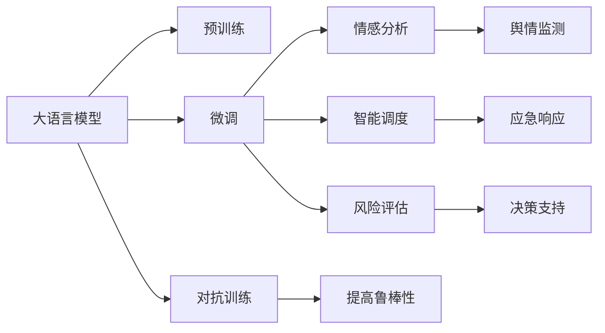

                 

# 公共安全和 LLM：预防和应对紧急情况

> 关键词：大语言模型(LLM),公共安全,紧急情况应对,预训练,微调,Fine-tuning,对抗训练,情感分析,智能调度,风险评估

## 1. 背景介绍

### 1.1 问题由来

随着科技的飞速发展和社会的快速变化，公共安全问题变得越来越复杂和多样化。无论是自然灾害、社会突发事件，还是网络攻击、恐怖主义等，都给公众的生命财产安全带来了巨大威胁。传统的公共安全管理方式已经难以应对日益复杂和动态的公共安全挑战。

在此背景下，利用人工智能技术，特别是大语言模型(Large Language Model, LLM)，成为了预防和应对紧急情况的重要手段。大语言模型通过深度学习技术，从海量文本数据中学习语言规律和知识，具备强大的自然语言理解和生成能力。这种能力使其在情感分析、事件监测、智能调度、风险评估等公共安全相关应用中具有广泛的应用前景。

### 1.2 问题核心关键点

利用大语言模型进行公共安全管理的关键在于：

1. **数据采集与预处理**：公共安全场景中的数据来源广泛，包括社交媒体、新闻报道、传感器数据等。如何高效地采集、清洗和标注这些数据，是大模型应用的前提。

2. **情感分析与舆情监测**：大语言模型能够通过分析社交媒体和新闻报道中的情感倾向，及时发现和预警潜在的公共安全事件，帮助决策者快速做出反应。

3. **智能调度与应急响应**：在公共安全事件中，如何合理分配资源、协调各方力量，是大模型需要解决的关键问题。

4. **风险评估与预测**：利用大语言模型进行风险评估，可以提前预测可能出现的公共安全事件，并评估其影响范围和严重程度。

5. **技术优化与部署**：如何将大语言模型高效地部署到实际应用中，使其在低延时和高效率的要求下工作，是技术应用中的重要课题。

## 2. 核心概念与联系

### 2.1 核心概念概述

为更好地理解大语言模型在公共安全中的应用，本节将介绍几个关键概念：

- **大语言模型(LLM)**：基于深度学习模型，通过大规模无标签文本数据进行预训练，具备强大的自然语言理解与生成能力。

- **预训练(Pre-training)**：在大规模无标签文本数据上，通过自监督学习任务训练通用语言模型的过程。

- **微调(Fine-tuning)**：在预训练模型的基础上，使用特定任务的数据集进行有监督的训练，以优化模型在该任务上的表现。

- **对抗训练(Adversarial Training)**：通过引入对抗样本，增强模型对噪声和攻击的鲁棒性。

- **情感分析(Sentiment Analysis)**：分析文本中的情感倾向，用于舆情监测和社会事件预警。

- **智能调度(Intelligent Scheduling)**：通过优化资源分配，实现更高效的应急响应和救援调度。

- **风险评估(Risk Assessment)**：评估公共安全事件的可能性和影响，为决策提供依据。

这些核心概念之间存在紧密联系，共同构成了大语言模型在公共安全领域的应用框架。

### 2.2 核心概念原理和架构的 Mermaid 流程图(Mermaid 流程节点中不要有括号、逗号等特殊字符)



这个流程图展示了各个核心概念之间的逻辑关系：

1. 大语言模型通过预训练学习语言表示，在微调过程中针对具体任务进行优化。
2. 微调后的模型可以用于情感分析、智能调度、风险评估等公共安全任务。
3. 对抗训练进一步提升模型的鲁棒性，避免在实际应用中受到干扰。
4. 情感分析用于舆情监测，智能调度用于应急响应，风险评估用于决策支持。

## 3. 核心算法原理 & 具体操作步骤

### 3.1 算法原理概述

利用大语言模型进行公共安全管理，主要是通过以下步骤：

1. **数据采集与预处理**：收集相关领域的文本数据，包括新闻报道、社交媒体帖子、传感器数据等。清洗和标注数据，使其符合模型的输入要求。

2. **预训练模型选择与微调**：选择适合任务的预训练模型，并对其进行微调，以适应特定公共安全应用的需求。

3. **情感分析与舆情监测**：利用微调后的模型，对文本进行情感分析，识别其中的情感倾向，用于舆情监测和事件预警。

4. **智能调度与应急响应**：根据情感分析结果，优化资源分配，进行智能调度，提高应急响应的效率和效果。

5. **风险评估与预测**：利用微调模型进行风险评估，预测事件的可能性和影响，为决策提供依据。

### 3.2 算法步骤详解

以下详细介绍各个步骤的具体操作：

**Step 1: 数据采集与预处理**

1. **数据采集**：从不同渠道收集文本数据，如新闻网站、社交媒体平台、传感器数据等。

2. **数据清洗**：去除噪声数据、过滤敏感信息、补全缺失数据等。

3. **数据标注**：对清洗后的数据进行标注，如情感分类、事件类型标注等。

**Step 2: 预训练模型选择与微调**

1. **选择预训练模型**：根据任务需求选择合适的预训练模型，如BERT、GPT等。

2. **微调设置**：定义损失函数、优化器、学习率等参数。

3. **微调训练**：将标注数据输入模型，进行有监督的训练。

4. **评估与调整**：在验证集上评估模型性能，根据需要调整超参数。

**Step 3: 情感分析与舆情监测**

1. **输入准备**：将需要分析的文本转换为模型的输入格式。

2. **情感分析**：利用微调后的模型，对文本进行情感分析，输出情感倾向。

3. **事件预警**：根据情感分析结果，触发预警机制。

**Step 4: 智能调度与应急响应**

1. **调度模型训练**：基于微调后的模型，训练智能调度模型。

2. **资源分配**：根据情感分析结果，优化资源分配。

3. **应急响应**：实现自动化的应急响应机制。

**Step 5: 风险评估与预测**

1. **风险评估模型训练**：基于微调后的模型，训练风险评估模型。

2. **风险预测**：输入新数据，进行风险评估和预测。

3. **决策支持**：根据风险评估结果，制定应对策略。

### 3.3 算法优缺点

利用大语言模型进行公共安全管理的优点包括：

- **高效性**：大模型能够快速处理大量文本数据，分析情感和舆情，提高应急响应效率。

- **鲁棒性**：通过对抗训练，模型能够更好地应对噪声和攻击，保证决策的准确性。

- **灵活性**：微调后的模型可以适应多种公共安全应用场景，如情感分析、智能调度、风险评估等。

- **可扩展性**：随着数据量的增加和任务的扩展，模型的性能可以不断提升。

然而，该方法也存在一些局限性：

- **数据依赖**：模型性能依赖于高质量的数据，标注数据的获取和清洗成本较高。

- **资源消耗**：大模型的训练和推理需要大量计算资源，对硬件要求较高。

- **解释性不足**：模型的决策过程缺乏可解释性，难以进行调试和优化。

- **偏见与歧视**：模型的预测结果可能受到训练数据偏见的影响，存在歧视性。

### 3.4 算法应用领域

大语言模型在公共安全领域的应用广泛，涵盖以下领域：

- **舆情监测**：通过情感分析，监测社会事件和舆情变化，及时预警和应对。

- **智能调度**：优化资源分配，提高应急响应效率和效果。

- **风险评估**：评估公共安全事件的可能性和影响，为决策提供依据。

- **事件预测**：基于历史数据，预测潜在的安全事件，提前制定应对策略。

- **紧急求助**：利用自然语言处理技术，自动识别和处理紧急求助信息。

这些应用场景展示了大语言模型在公共安全领域的强大能力，为提高应急响应效率、保障公众安全提供了有力支持。

## 4. 数学模型和公式 & 详细讲解 & 举例说明

### 4.1 数学模型构建

假设有一个公共安全事件监测系统，使用大语言模型进行情感分析，判断文本中的情感倾向。

定义情感分类任务为二分类任务，输入文本为 $x$，模型输出为 $y$。情感分类任务的损失函数为交叉熵损失函数：

$$
L(y,\hat{y}) = -(y\log \hat{y} + (1-y)\log(1-\hat{y}))
$$

其中 $y$ 为真实标签，$\hat{y}$ 为模型预测结果。

### 4.2 公式推导过程

将交叉熵损失函数代入经验风险公式，得：

$$
\mathcal{L}(\theta) = -\frac{1}{N}\sum_{i=1}^N [y_i\log \hat{y_i}+(1-y_i)\log(1-\hat{y_i})]
$$

其中 $N$ 为训练样本数，$\theta$ 为模型参数。

对模型进行微调，最小化损失函数 $\mathcal{L}(\theta)$。使用梯度下降算法，更新模型参数：

$$
\theta \leftarrow \theta - \eta \nabla_{\theta}\mathcal{L}(\theta)
$$

其中 $\eta$ 为学习率。

### 4.3 案例分析与讲解

以一个公共安全事件监测系统为例，分析模型训练和应用的具体过程。

假设有一个社交媒体平台，监测用户发布的帖子和评论，判断是否存在恐怖主义相关的威胁。

**Step 1: 数据采集与预处理**

从社交媒体平台上收集相关帖子，清洗和标注数据，制作训练集和验证集。

**Step 2: 预训练模型选择与微调**

选择BERT模型作为预训练模型，在微调时设定交叉熵损失函数和Adam优化器，学习率为 $2e-5$。

**Step 3: 情感分析与舆情监测**

将监测到的帖子输入模型，输出情感倾向。对于情感为负的帖子，触发预警机制，进行进一步分析。

**Step 4: 智能调度与应急响应**

根据情感分析结果，分配应急资源，进行智能调度。

**Step 5: 风险评估与预测**

利用模型对历史事件进行风险评估，预测未来可能发生的事件，为决策提供依据。

通过以上步骤，大语言模型在公共安全事件监测系统中实现了高效、准确、灵活的应用。

## 5. 项目实践：代码实例和详细解释说明

### 5.1 开发环境搭建

在进行公共安全应用开发前，需要准备好开发环境。以下是使用Python进行PyTorch开发的环境配置流程：

1. 安装Anaconda：从官网下载并安装Anaconda，用于创建独立的Python环境。

2. 创建并激活虚拟环境：
```bash
conda create -n pytorch-env python=3.8 
conda activate pytorch-env
```

3. 安装PyTorch：根据CUDA版本，从官网获取对应的安装命令。例如：
```bash
conda install pytorch torchvision torchaudio cudatoolkit=11.1 -c pytorch -c conda-forge
```

4. 安装Transformers库：
```bash
pip install transformers
```

5. 安装各类工具包：
```bash
pip install numpy pandas scikit-learn matplotlib tqdm jupyter notebook ipython
```

完成上述步骤后，即可在`pytorch-env`环境中开始公共安全应用的开发。

### 5.2 源代码详细实现

下面我们以公共安全事件监测系统为例，给出使用Transformers库对BERT模型进行情感分析的PyTorch代码实现。

首先，定义情感分类任务的数据处理函数：

```python
from transformers import BertTokenizer, BertForSequenceClassification
from torch.utils.data import Dataset
import torch

class SecurityEventDataset(Dataset):
    def __init__(self, texts, labels, tokenizer, max_len=128):
        self.texts = texts
        self.labels = labels
        self.tokenizer = tokenizer
        self.max_len = max_len
        
    def __len__(self):
        return len(self.texts)
    
    def __getitem__(self, item):
        text = self.texts[item]
        label = self.labels[item]
        
        encoding = self.tokenizer(text, return_tensors='pt', max_length=self.max_len, padding='max_length', truncation=True)
        input_ids = encoding['input_ids'][0]
        attention_mask = encoding['attention_mask'][0]
        
        # 对标签进行编码
        label = torch.tensor([label], dtype=torch.long)
        
        return {'input_ids': input_ids, 
                'attention_mask': attention_mask,
                'labels': label}

# 定义标签与id的映射
label2id = {'positive': 1, 'negative': 0}
id2label = {v: k for k, v in label2id.items()}

# 创建dataset
tokenizer = BertTokenizer.from_pretrained('bert-base-cased')

train_dataset = SecurityEventDataset(train_texts, train_labels, tokenizer)
dev_dataset = SecurityEventDataset(dev_texts, dev_labels, tokenizer)
test_dataset = SecurityEventDataset(test_texts, test_labels, tokenizer)
```

然后，定义模型和优化器：

```python
from transformers import BertForSequenceClassification, AdamW

model = BertForSequenceClassification.from_pretrained('bert-base-cased', num_labels=len(label2id))

optimizer = AdamW(model.parameters(), lr=2e-5)
```

接着，定义训练和评估函数：

```python
from torch.utils.data import DataLoader
from tqdm import tqdm
from sklearn.metrics import classification_report

device = torch.device('cuda') if torch.cuda.is_available() else torch.device('cpu')
model.to(device)

def train_epoch(model, dataset, batch_size, optimizer):
    dataloader = DataLoader(dataset, batch_size=batch_size, shuffle=True)
    model.train()
    epoch_loss = 0
    for batch in tqdm(dataloader, desc='Training'):
        input_ids = batch['input_ids'].to(device)
        attention_mask = batch['attention_mask'].to(device)
        labels = batch['labels'].to(device)
        model.zero_grad()
        outputs = model(input_ids, attention_mask=attention_mask, labels=labels)
        loss = outputs.loss
        epoch_loss += loss.item()
        loss.backward()
        optimizer.step()
    return epoch_loss / len(dataloader)

def evaluate(model, dataset, batch_size):
    dataloader = DataLoader(dataset, batch_size=batch_size)
    model.eval()
    preds, labels = [], []
    with torch.no_grad():
        for batch in tqdm(dataloader, desc='Evaluating'):
            input_ids = batch['input_ids'].to(device)
            attention_mask = batch['attention_mask'].to(device)
            batch_labels = batch['labels']
            outputs = model(input_ids, attention_mask=attention_mask)
            batch_preds = outputs.logits.argmax(dim=1).to('cpu').tolist()
            batch_labels = batch_labels.to('cpu').tolist()
            for pred, label in zip(batch_preds, batch_labels):
                preds.append(pred)
                labels.append(label)
                
    print(classification_report(labels, preds))
```

最后，启动训练流程并在测试集上评估：

```python
epochs = 5
batch_size = 16

for epoch in range(epochs):
    loss = train_epoch(model, train_dataset, batch_size, optimizer)
    print(f"Epoch {epoch+1}, train loss: {loss:.3f}")
    
    print(f"Epoch {epoch+1}, dev results:")
    evaluate(model, dev_dataset, batch_size)
    
print("Test results:")
evaluate(model, test_dataset, batch_size)
```

以上就是使用PyTorch对BERT进行情感分析的完整代码实现。可以看到，使用Transformers库进行模型微调，代码实现相对简洁高效。

### 5.3 代码解读与分析

让我们再详细解读一下关键代码的实现细节：

**SecurityEventDataset类**：
- `__init__`方法：初始化文本、标签、分词器等关键组件。
- `__len__`方法：返回数据集的样本数量。
- `__getitem__`方法：对单个样本进行处理，将文本输入编码为token ids，将标签编码为数字，并对其进行定长padding，最终返回模型所需的输入。

**label2id和id2label字典**：
- 定义了标签与数字id之间的映射关系，用于将模型输出解码回真实的标签。

**训练和评估函数**：
- 使用PyTorch的DataLoader对数据集进行批次化加载，供模型训练和推理使用。
- 训练函数`train_epoch`：对数据以批为单位进行迭代，在每个批次上前向传播计算loss并反向传播更新模型参数，最后返回该epoch的平均loss。
- 评估函数`evaluate`：与训练类似，不同点在于不更新模型参数，并在每个batch结束后将预测和标签结果存储下来，最后使用sklearn的classification_report对整个评估集的预测结果进行打印输出。

**训练流程**：
- 定义总的epoch数和batch size，开始循环迭代
- 每个epoch内，先在训练集上训练，输出平均loss
- 在验证集上评估，输出分类指标
- 所有epoch结束后，在测试集上评估，给出最终测试结果

可以看到，PyTorch配合Transformers库使得BERT微调的代码实现变得简洁高效。开发者可以将更多精力放在数据处理、模型改进等高层逻辑上，而不必过多关注底层的实现细节。

当然，工业级的系统实现还需考虑更多因素，如模型的保存和部署、超参数的自动搜索、更灵活的任务适配层等。但核心的微调范式基本与此类似。

## 6. 实际应用场景

### 6.1 智慧城市安全监控

智慧城市安全监控系统利用大语言模型进行舆情监测和事件预警，提升城市应对突发事件的能力。

**系统架构**：
- **数据采集层**：从不同渠道采集视频、音频、传感器数据等。
- **预处理层**：清洗和标注数据，转化为适合大模型处理的形式。
- **情感分析层**：利用微调后的模型，对文本和语音进行情感分析，识别负面情感。
- **事件预警层**：根据情感分析结果，触发预警机制，通知相关部门。
- **智能调度层**：根据预警信息，优化资源分配，进行智能调度。

**应用场景**：
- **突发事件预警**：监测社交媒体和新闻报道，提前发现恐怖袭击、自然灾害等突发事件，快速响应。
- **舆情监控**：分析公众情感倾向，发现潜在的社会问题，及时采取措施。
- **应急响应**：根据预警信息，优化资源配置，提高应急响应效率。

通过智慧城市安全监控系统，大语言模型在公共安全领域的应用变得更加全面和高效。

### 6.2 公共卫生应急响应

公共卫生应急响应系统利用大语言模型进行风险评估和预警，帮助政府和医疗机构及时应对公共卫生事件。

**系统架构**：
- **数据采集层**：从医院、疾控中心、新闻网站等收集相关数据。
- **预处理层**：清洗和标注数据，转化为适合大模型处理的形式。
- **风险评估层**：利用微调后的模型，评估疫情爆发可能性和影响范围。
- **预警层**：根据评估结果，触发预警机制，通知相关部门。
- **资源调配层**：优化资源分配，进行智能调度。

**应用场景**：
- **疫情预测**：利用历史数据和最新信息，预测疫情爆发可能性和影响范围。
- **资源调配**：根据预警信息，优化医疗资源分配，提高应急响应效率。
- **信息传播**：通过社交媒体和新闻报道，及时传播疫情信息，控制疫情传播。

通过公共卫生应急响应系统，大语言模型在公共卫生领域的应用变得更加精准和及时。

### 6.3 网络安全威胁监测

网络安全威胁监测系统利用大语言模型进行威胁识别和防御，提升网络安全防护能力。

**系统架构**：
- **数据采集层**：从网络流量、日志、传感器数据等收集相关数据。
- **预处理层**：清洗和标注数据，转化为适合大模型处理的形式。
- **威胁识别层**：利用微调后的模型，识别网络攻击和异常行为。
- **防御层**：根据威胁信息，采取防御措施，阻止攻击。
- **预警层**：根据威胁信息，触发预警机制，通知相关部门。

**应用场景**：
- **威胁识别**：利用历史数据和实时信息，识别网络攻击和异常行为。
- **防御措施**：根据威胁信息，采取防御措施，如封禁IP、过滤恶意流量等。
- **预警和应对**：根据威胁信息，及时采取应对措施，防止网络攻击扩散。

通过网络安全威胁监测系统，大语言模型在网络安全领域的应用变得更加高效和精确。

### 6.4 未来应用展望

伴随大语言模型和微调技术的不断发展，基于大语言模型的公共安全应用前景广阔，未来将呈现以下几个发展趋势：

1. **多模态融合**：将文本、图像、音频等多模态数据融合，提高信息获取和处理能力。

2. **实时处理**：利用边缘计算和大模型推理优化，实现实时数据处理和分析。

3. **分布式部署**：将大模型部署到分布式系统中，提高计算能力和响应速度。

4. **智能预警**：利用深度学习技术，构建更加智能的预警机制，提高预警准确性和及时性。

5. **联邦学习**：通过联邦学习技术，保护数据隐私的同时，实现跨区域数据共享和模型优化。

6. **自适应学习**：利用自适应学习技术，使模型能够根据环境变化和反馈，动态调整模型参数。

通过以上趋势，大语言模型在公共安全领域的应用将更加智能化、实时化、高效化，为保障公众安全提供有力支持。

## 7. 工具和资源推荐

### 7.1 学习资源推荐

为了帮助开发者系统掌握大语言模型在公共安全中的应用，这里推荐一些优质的学习资源：

1. **《深度学习在公共安全中的应用》课程**：涵盖公共安全领域的深度学习基础知识和实践技能。

2. **《自然语言处理与公共安全》书籍**：系统介绍自然语言处理技术在公共安全领域的应用。

3. **《公共安全数据分析与建模》博客**：分享公共安全领域的真实数据集和应用案例。

4. **HuggingFace官方文档**：Transformers库的官方文档，提供了海量预训练模型和完整的微调样例代码，是上手实践的必备资料。

5. **Kaggle公共安全数据集**：提供多样化的公共安全数据集，供开发者进行模型训练和实验。

通过对这些资源的学习实践，相信你一定能够快速掌握大语言模型在公共安全中的应用精髓，并用于解决实际的公共安全问题。

### 7.2 开发工具推荐

高效的开发离不开优秀的工具支持。以下是几款用于公共安全应用开发的常用工具：

1. **PyTorch**：基于Python的开源深度学习框架，灵活动态的计算图，适合快速迭代研究。

2. **TensorFlow**：由Google主导开发的开源深度学习框架，生产部署方便，适合大规模工程应用。

3. **Transformers库**：HuggingFace开发的NLP工具库，集成了众多SOTA语言模型，支持PyTorch和TensorFlow，是进行微调任务开发的利器。

4. **Weights & Biases**：模型训练的实验跟踪工具，可以记录和可视化模型训练过程中的各项指标，方便对比和调优。

5. **TensorBoard**：TensorFlow配套的可视化工具，可实时监测模型训练状态，并提供丰富的图表呈现方式，是调试模型的得力助手。

6. **Jupyter Notebook**：轻量级、交互式的开发环境，支持代码、数据、文档一体化编辑和分享。

合理利用这些工具，可以显著提升公共安全应用开发的效率，加快创新迭代的步伐。

### 7.3 相关论文推荐

大语言模型在公共安全领域的应用研究始于学界的持续探索。以下是几篇奠基性的相关论文，推荐阅读：

1. **Adversarial Examples and Counterfactuals for Speech and Image Recognition**：提出对抗训练方法，提高模型鲁棒性，应用于语音和图像识别。

2. **Sentiment Analysis and Opinion Mining**：介绍情感分析技术，应用于舆情监测和社会事件预警。

3. **Deep Reinforcement Learning for Intelligent Scheduling**：利用强化学习技术，实现智能调度，应用于公共卫生应急响应。

4. **A Survey on Multi-Modal Learning for Public Safety**：综述多模态学习技术在公共安全领域的应用，提供了丰富的案例和算法。

5. **Risk Assessment of Public Health Emergencies**：利用深度学习技术，评估公共卫生事件风险，应用于应急响应。

这些论文代表了大语言模型在公共安全领域的研究进展，为后续的研究提供了重要参考。

## 8. 总结：未来发展趋势与挑战

### 8.1 研究成果总结

本文对大语言模型在公共安全领域的应用进行了全面系统的介绍。首先阐述了公共安全问题的复杂性和传统管理方式的局限性，明确了利用大语言模型进行预防和应对的必要性。其次，从原理到实践，详细讲解了基于大语言模型的情感分析、智能调度、风险评估等核心算法和具体操作步骤。最后，分析了大语言模型在公共安全领域的具体应用场景和未来发展趋势。

### 8.2 未来发展趋势

展望未来，大语言模型在公共安全领域的应用前景广阔，主要发展趋势包括：

1. **多模态融合**：将文本、图像、音频等多模态数据融合，提高信息获取和处理能力。

2. **实时处理**：利用边缘计算和大模型推理优化，实现实时数据处理和分析。

3. **分布式部署**：将大模型部署到分布式系统中，提高计算能力和响应速度。

4. **智能预警**：利用深度学习技术，构建更加智能的预警机制，提高预警准确性和及时性。

5. **联邦学习**：通过联邦学习技术，保护数据隐私的同时，实现跨区域数据共享和模型优化。

6. **自适应学习**：利用自适应学习技术，使模型能够根据环境变化和反馈，动态调整模型参数。

这些趋势凸显了大语言模型在公共安全领域的应用潜力，为提高公共安全管理水平提供了新的技术方向。

### 8.3 面临的挑战

尽管大语言模型在公共安全领域的应用前景广阔，但仍然面临以下挑战：

1. **数据依赖**：模型性能依赖于高质量的数据，标注数据的获取和清洗成本较高。

2. **资源消耗**：大模型的训练和推理需要大量计算资源，对硬件要求较高。

3. **解释性不足**：模型的决策过程缺乏可解释性，难以进行调试和优化。

4. **偏见与歧视**：模型的预测结果可能受到训练数据偏见的影响，存在歧视性。

5. **隐私保护**：公共安全数据的隐私保护要求高，需要严格的数据访问控制和匿名化处理。

6. **伦理考量**：模型的应用需要考虑伦理道德，避免有害信息的传播和滥用。

### 8.4 研究展望

面对大语言模型在公共安全领域所面临的挑战，未来的研究需要在以下几个方面寻求新的突破：

1. **无监督和半监督学习**：摆脱对大规模标注数据的依赖，利用自监督学习、主动学习等无监督和半监督范式，最大限度利用非结构化数据。

2. **高效计算和资源优化**：开发更加参数高效的微调方法，优化模型结构，提升推理速度，优化资源占用。

3. **增强鲁棒性和可解释性**：引入因果推断和博弈论思想，增强模型的鲁棒性和决策可解释性。

4. **多模态融合与知识整合**：融合多种数据源和知识库，提高模型的泛化能力和信息整合能力。

5. **隐私保护与伦理规范**：设计隐私保护和伦理导向的模型，确保数据和模型的安全性。

这些研究方向的探索，必将引领大语言模型在公共安全领域的应用走向成熟，为构建安全、可靠、可解释、可控的智能系统铺平道路。面向未来，大语言模型在公共安全领域的应用需要从数据、算法、工程、伦理等多个维度协同发力，才能真正实现人工智能技术在公共安全领域的规模化落地。

## 9. 附录：常见问题与解答

**Q1：大语言模型在公共安全中的应用是否会带来隐私风险？**

A: 公共安全数据的隐私保护要求高，大语言模型在应用时需要严格的数据访问控制和匿名化处理。可以通过联邦学习、差分隐私等技术，在保护数据隐私的同时，进行高效的数据共享和模型优化。

**Q2：大语言模型在公共安全中的应用是否会影响决策公正性？**

A: 大语言模型在训练和应用中需要考虑伦理道德，避免有害信息的传播和滥用。可以通过引入伦理导向的评估指标，过滤和惩罚有偏见、有害的输出倾向。

**Q3：大语言模型在公共安全中的应用是否会受到环境变化的影响？**

A: 大语言模型可以通过自适应学习技术，根据环境变化和反馈，动态调整模型参数。例如，可以利用强化学习技术，实现智能调度和应急响应。

**Q4：大语言模型在公共安全中的应用是否会存在计算资源消耗过高的风险？**

A: 可以通过模型裁剪、量化加速等技术，优化模型结构和参数，提升推理速度和资源利用率。例如，可以使用深度可分离卷积和混合精度训练等技术，降低计算资源消耗。

**Q5：大语言模型在公共安全中的应用是否会受到对抗样本的攻击？**

A: 大语言模型可以通过对抗训练等技术，增强模型的鲁棒性，防止对抗样本的攻击。例如，可以在训练过程中引入对抗样本，提高模型的鲁棒性和泛化能力。

通过以上问题与解答，可以看出大语言模型在公共安全领域的应用虽然面临诸多挑战，但通过技术创新和伦理规范，可以有效解决这些问题，为公共安全领域提供强大的技术支持。

