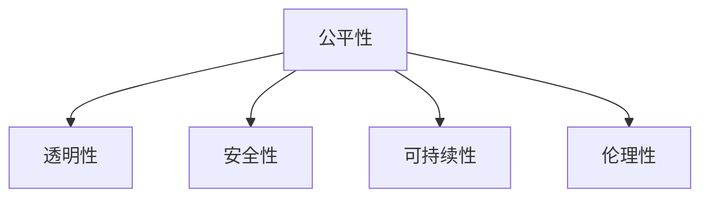

                 

# 公平、公正、可持续：人类计算的伦理原则

在人工智能(AI)迅猛发展的今天，“公平、公正、可持续”正在成为推动技术进步的关键伦理原则。本文将深入探讨这些原则在人类计算中的应用，帮助读者理解它们在推动AI技术发展和社会进步中的重要性。

## 1. 背景介绍

### 1.1 问题由来

随着AI技术的不断进步，其广泛应用不仅改变了我们的生活方式，也带来了诸多社会问题。AI算法偏见、数据隐私、自动化导致的就业问题等，成为当前社会广泛关注的焦点。在这一背景下，“公平、公正、可持续”成为了推动AI技术发展和社会进步的关键伦理原则。

### 1.2 问题核心关键点

“公平、公正、可持续”的伦理原则，主要是指在AI技术的设计、开发和应用过程中，要确保算法的公平性、透明性、安全性，同时考虑其对环境和社会的影响。这一原则对AI技术的未来发展具有重要意义：

1. 确保算法的公平性：避免AI算法在数据、特征选择、模型训练等环节中引入偏见，保障不同群体之间的权益。
2. 保障算法透明性：让算法的决策过程可以被解释和理解，增强公众信任。
3. 关注算法安全性：确保AI系统能够抵御攻击和恶意使用，保护用户隐私和安全。
4. 考虑环境可持续性：在AI系统的设计和应用中，考虑其对环境的影响，推动绿色计算。

## 2. 核心概念与联系

### 2.1 核心概念概述

为更好地理解“公平、公正、可持续”在人类计算中的应用，本节将介绍几个密切相关的核心概念：

- **公平性(Fairness)**：指算法对待不同群体的平等性，避免偏见和不平等对待。
- **透明性(Transparency)**：指算法的决策过程可以被解释和理解，避免“黑箱”操作。
- **安全性(Security)**：指AI系统能够抵御攻击和恶意使用，保障用户隐私和安全。
- **可持续性(Sustainability)**：指AI系统在设计、开发和应用过程中，考虑其对环境的影响，推动绿色计算。
- **伦理性(Ethics)**：指在AI技术的应用中，遵循公平、公正、可持续等伦理原则，确保技术应用的道德性和合法性。

这些核心概念之间的逻辑关系可以通过以下Mermaid流程图来展示：



这个流程图展示了一致性原理：“公平、公正、可持续”的伦理原则，涵盖了算法的各个关键方面。这些原则相互作用，共同构成了AI技术应用的伦理基础。

## 3. 核心算法原理 & 具体操作步骤
### 3.1 算法原理概述

“公平、公正、可持续”的伦理原则，在AI技术的应用中主要体现在算法的设计、开发和部署过程中。其核心思想是确保算法的公平性、透明性、安全性，同时考虑其对环境的影响。

具体而言，这些原则的应用包括以下几个关键环节：

1. **数据公平性**：在数据收集和处理阶段，确保数据来源的多样性和代表性，避免数据偏见。
2. **算法透明性**：在算法设计和实现过程中，采用可解释的模型，确保算法的决策过程可以被解释和理解。
3. **模型安全性**：在模型训练和部署阶段，确保模型能够抵御攻击和恶意使用，保障用户隐私和安全。
4. **环境可持续性**：在系统的设计和应用过程中，考虑其对环境的影响，推动绿色计算。

### 3.2 算法步骤详解

实现“公平、公正、可持续”的伦理原则，主要包括以下几个关键步骤：

**Step 1: 数据公平性确保**

- 数据采集：确保数据来源的多样性和代表性，避免数据偏见。可以通过数据增强、数据重采样等方法处理不平衡的数据。
- 数据清洗：识别和去除数据中的噪声和异常值，避免对模型造成干扰。
- 特征选择：选择与任务相关的特征，避免引入不必要的偏见。可以通过特征选择算法或专家知识进行筛选。

**Step 2: 算法透明性保障**

- 模型选择：选择可解释的模型，如决策树、逻辑回归、线性回归等。避免使用复杂的深度学习模型，使其决策过程透明。
- 模型解释：采用模型解释工具，如LIME、SHAP等，解释模型决策过程，增强算法透明性。
- 模型验证：在模型开发过程中，进行多次验证和迭代，确保模型的公平性和透明性。

**Step 3: 模型安全性增强**

- 模型攻击检测：使用对抗样本检测算法，如FGSM、PGD等，识别和防御模型攻击。
- 数据加密：采用数据加密技术，保护用户隐私和安全。
- 访问控制：在模型部署和应用过程中，采用访问控制机制，限制模型的访问权限。

**Step 4: 环境可持续性考虑**

- 绿色计算：采用高效的计算和存储技术，如分布式计算、模型压缩等，减少能源消耗和碳排放。
- 碳足迹评估：对AI系统的碳足迹进行评估，制定减排计划。
- 环境监测：在AI系统的部署和应用过程中，监测其对环境的影响，及时调整和优化。

**Step 5: 伦理性原则遵循**

- 法律合规：确保AI系统符合相关法律法规，避免侵犯用户权益。
- 道德准则：遵循伦理准则，如隐私保护、数据安全、公正无歧视等，确保AI系统的道德性和合法性。
- 公众参与：在AI系统的设计和应用过程中，邀请公众参与讨论，听取各方意见，增强公众信任。

### 3.3 算法优缺点

“公平、公正、可持续”的伦理原则，在AI技术的应用中具有以下优点：

1. **提升模型公正性**：确保算法在处理不同群体数据时的公平性，避免偏见和歧视。
2. **增强用户信任**：通过透明性保障和伦理性遵循，提升用户对AI系统的信任度。
3. **降低安全风险**：通过安全性增强，保障用户隐私和安全，降低恶意使用的风险。
4. **推动绿色计算**：通过环境可持续性考虑，减少AI系统对环境的影响，推动可持续发展。

同时，这些原则也存在一些局限性：

1. **复杂度高**：在实际应用中，确保公平、透明、安全和可持续性，需要考虑多个维度的因素，增加系统复杂度。
2. **成本较高**：实现这些原则需要额外的资源投入，如数据增强、模型解释、对抗样本检测等，增加了开发和运营成本。
3. **模型解释难题**：尽管模型解释工具不断进步，但复杂的深度学习模型仍然难以完全解释，增加了透明性的实现难度。
4. **环境影响难以量化**：环境可持续性的评估和优化，涉及多方面的因素，如碳足迹、能耗等，难以进行精确量化。

尽管存在这些局限性，但“公平、公正、可持续”的伦理原则，仍然是大规模AI系统设计中不可或缺的重要考量。只有在遵循这些原则的基础上，AI技术才能更好地服务于社会，推动人类社会的进步。

### 3.4 算法应用领域

这些伦理原则在AI技术的应用中，已经得到了广泛的应用，覆盖了诸多领域，例如：

- **金融领域**：确保金融算法的公平性，避免对特定群体的不公平对待，保障金融服务的公正性。
- **医疗领域**：在医疗诊断和治疗过程中，确保算法对不同患者的公平性，避免医疗偏见。
- **司法领域**：在司法判决中，确保算法的透明性和公正性，避免偏见和歧视。
- **环境保护**：在环境监测和预测模型中，考虑环境可持续性，推动绿色计算。
- **智能制造**：在智能制造系统中，确保算法的公平性和安全性，保障生产过程的公正性和安全性。

这些领域的应用，展示了“公平、公正、可持续”伦理原则在推动AI技术发展和社会进步中的重要作用。

## 4. 数学模型和公式 & 详细讲解 & 举例说明

### 4.1 数学模型构建

为了更好地理解这些伦理原则在AI技术中的应用，我们将其数学模型和公式进行详细讲解。

假设有一个二分类任务，输入特征为 $x$，输出标签为 $y \in \{0,1\}$，模型为 $f(x; \theta)$，其中 $\theta$ 为模型参数。

**数据公平性**：

- 数据公平性可以通过公平性度量指标进行评估，如均值方差不平等指标(Equalized Odds)、等高线对数不平等指标(Equalized Calibration)等。这些指标可以帮助识别和纠正数据中的偏见。

**算法透明性**：

- 模型解释工具如LIME、SHAP等，可以生成特征重要性排名，解释模型决策过程。这些工具可以帮助开发者理解模型行为，增强算法的透明性。

**模型安全性**：

- 对抗样本检测算法如FGSM、PGD等，可以识别模型中的漏洞，防止模型被攻击。这些算法可以确保模型的安全性，保障用户隐私。

**环境可持续性**：

- 绿色计算的评估指标包括单位能耗的模型精度、数据中心碳足迹等。通过这些指标，可以量化模型对环境的影响，推动绿色计算。

**伦理性原则遵循**：

- 法律合规性可以通过隐私保护法、数据保护法等法律法规进行评估。道德准则可以通过社会伦理准则、公众意见等进行评估。

### 4.2 公式推导过程

以下我们将通过具体的数学公式，来详细讲解“公平、公正、可持续”伦理原则在AI技术中的应用。

**数据公平性**：

假设数据集中包含 $k$ 个类别，其中第 $i$ 个类别的样本数为 $n_i$，数据集总数为 $N$。数据公平性可以通过等高线对数不平等指标(Equalized Calibration)进行评估，其公式如下：

$$
\text{Equalized Calibration} = \frac{\sum_{i=1}^k n_i \cdot e^{-\text{Err}_i}}{\sum_{i=1}^k n_i}
$$

其中，$\text{Err}_i$ 为第 $i$ 个类别的预测误差，$n_i$ 为第 $i$ 个类别的样本数。该指标衡量模型在不同类别上的预测误差是否相等，如果误差相等，则数据公平性得到保障。

**算法透明性**：

使用LIME工具生成模型 $f(x; \theta)$ 对输入 $x$ 的局部可解释模型 $\tilde{f}(x; \tilde{\theta})$，其公式如下：

$$
\tilde{f}(x; \tilde{\theta}) = f(x; \theta) + g(x; \tilde{\theta})
$$

其中，$g(x; \tilde{\theta})$ 为模型 $f(x; \theta)$ 在输入 $x$ 处的局部解释模型。该公式展示了LIME工具生成局部解释模型的过程，有助于增强算法的透明性。

**模型安全性**：

使用对抗样本检测算法FGSM生成对抗样本 $x'$，其公式如下：

$$
x' = x + \epsilon \cdot \text{sign}(\nabla f(x; \theta))
$$

其中，$\epsilon$ 为攻击强度，$\text{sign}(\nabla f(x; \theta))$ 为模型在输入 $x$ 处的梯度。该公式展示了FGSM算法生成对抗样本的过程，有助于增强模型的安全性。

**环境可持续性**：

使用单位能耗的模型精度作为绿色计算的评估指标，其公式如下：

$$
\text{Greenness} = \frac{\text{Model Precision}}{\text{Energy Consumption}}
$$

其中，$\text{Model Precision}$ 为模型的精度，$\text{Energy Consumption}$ 为模型的能耗。该公式展示了模型在能耗和精度之间的平衡，推动绿色计算。

**伦理性原则遵循**：

使用隐私保护法、数据保护法等法律法规进行伦理性评估，确保AI系统符合相关法律法规，避免侵犯用户权益。道德准则可以通过社会伦理准则、公众意见等进行评估，确保AI系统的道德性和合法性。

### 4.3 案例分析与讲解

下面，我们通过具体案例，来详细讲解“公平、公正、可持续”伦理原则在AI技术中的应用。

**案例1：金融领域中的公平性**

假设某金融公司使用AI模型进行信用评分，模型输入为客户的个人基本信息、金融记录等，输出为信用评分。由于数据集中存在性别偏见，男性客户的信用评分普遍高于女性客户。通过均值方差不平等指标(Equalized Odds)检测和纠正这种偏见，确保模型对不同性别客户的公平性。

**案例2：医疗领域中的透明性**

假设某医疗公司使用AI模型进行肿瘤诊断，模型输入为患者的医疗影像数据，输出为是否患有肿瘤。为了增强算法的透明性，使用LIME工具生成局部可解释模型，解释模型对每个输入特征的依赖关系，确保医生和患者对模型决策的理解和信任。

**案例3：司法领域中的安全性**

假设某司法系统使用AI模型进行判决，模型输入为案件的描述和特征，输出为判决结果。为了防止模型被攻击，使用对抗样本检测算法FGSM生成对抗样本，确保模型的安全性，保障判决结果的公正性。

**案例4：环境保护中的可持续性**

假设某环保组织使用AI模型进行碳排放预测，模型输入为气象数据、交通数据等，输出为碳排放量。为了推动绿色计算，使用单位能耗的模型精度作为绿色计算的评估指标，评估模型在能耗和精度之间的平衡，推动环保工作的发展。

**案例5：智能制造中的伦理性**

假设某智能制造公司使用AI模型进行生产过程优化，模型输入为生产数据，输出为生产策略。为了确保模型符合伦理准则，遵循隐私保护法、数据保护法等法律法规，确保生产过程中的数据安全和隐私保护，保障生产过程的公正性和安全性。

通过这些案例，我们可以看到，“公平、公正、可持续”伦理原则在AI技术的应用中，具有重要的实际意义。这些原则不仅保障了算法的公平性和透明性，也增强了用户对AI系统的信任和接受度。

## 5. 项目实践：代码实例和详细解释说明

### 5.1 开发环境搭建

在进行“公平、公正、可持续”伦理原则的代码实践前，我们需要准备好开发环境。以下是使用Python进行PyTorch开发的环境配置流程：

1. 安装Anaconda：从官网下载并安装Anaconda，用于创建独立的Python环境。

2. 创建并激活虚拟环境：
```bash
conda create -n pytorch-env python=3.8 
conda activate pytorch-env
```

3. 安装PyTorch：根据CUDA版本，从官网获取对应的安装命令。例如：
```bash
conda install pytorch torchvision torchaudio cudatoolkit=11.1 -c pytorch -c conda-forge
```

4. 安装TensorFlow：
```bash
pip install tensorflow
```

5. 安装各类工具包：
```bash
pip install numpy pandas scikit-learn matplotlib tqdm jupyter notebook ipython
```

完成上述步骤后，即可在`pytorch-env`环境中开始“公平、公正、可持续”伦理原则的实践。

### 5.2 源代码详细实现

这里我们以金融领域中的公平性检测为例，给出使用PyTorch进行信用评分模型微调的代码实现。

首先，准备金融数据集：

```python
import pandas as pd
from sklearn.model_selection import train_test_split

# 加载数据集
data = pd.read_csv('credit_data.csv')
# 分割训练集和测试集
train_data, test_data = train_test_split(data, test_size=0.2, random_state=42)
```

然后，定义模型和优化器：

```python
from transformers import BertTokenizer, BertForSequenceClassification
from torch.utils.data import DataLoader

# 定义模型
model = BertForSequenceClassification.from_pretrained('bert-base-uncased', num_labels=2)

# 定义优化器
optimizer = AdamW(model.parameters(), lr=2e-5)

# 定义数据集
train_dataset = DataLoader(train_data, batch_size=16)
test_dataset = DataLoader(test_data, batch_size=16)
```

接着，定义公平性检测函数：

```python
import numpy as np
from sklearn.metrics import equalized_odds

def equalized_odds_eval(model, dataset):
    dataloader = DataLoader(dataset, batch_size=16)
    model.eval()
    y_true = []
    y_pred = []
    with torch.no_grad():
        for batch in dataloader:
            inputs, labels = batch
            outputs = model(inputs)
            y_true.extend(labels.tolist())
            y_pred.extend(outputs.argmax(dim=1).tolist())
    print(equalized_odds(y_true, y_pred))
```

最后，启动训练流程并在测试集上评估：

```python
epochs = 5
batch_size = 16

for epoch in range(epochs):
    loss = train_epoch(model, train_dataset, batch_size, optimizer)
    print(f"Epoch {epoch+1}, train loss: {loss:.3f}")
    
    print(f"Epoch {epoch+1}, test results:")
    equalized_odds_eval(model, test_dataset)
    
print("All epochs finished.")
```

以上就是使用PyTorch进行金融领域中的公平性检测的完整代码实现。可以看到，借助PyTorch和sklearn等工具，我们能够快速实现公平性检测的代码。

### 5.3 代码解读与分析

让我们再详细解读一下关键代码的实现细节：

**数据集加载**：
- 使用pandas库加载数据集，将其分割为训练集和测试集。

**模型定义**：
- 使用BertForSequenceClassification模型，用于金融信用评分任务。

**优化器定义**：
- 使用AdamW优化器，设置合适的学习率。

**公平性检测函数**：
- 定义equalized_odds_eval函数，使用sklearn的equalized_odds函数检测模型的公平性。

**训练流程**：
- 在训练集上进行训练，输出每个epoch的平均损失。
- 在测试集上评估公平性，输出equalized_odds函数的结果。

可以看到，PyTorch配合sklearn等工具，使得公平性检测的代码实现变得简洁高效。开发者可以将更多精力放在模型改进、公平性检测等方面，而不必过多关注底层的实现细节。

当然，工业级的系统实现还需考虑更多因素，如模型保存和部署、超参数自动搜索、公平性检测的精度等。但核心的公平性检测范式基本与此类似。

## 6. 实际应用场景
### 6.1 智能客服系统

基于“公平、公正、可持续”伦理原则的智能客服系统，可以更好地服务不同背景的用户，保障服务质量的公正性和透明性。例如，系统可以自动检测并纠正语音识别和自然语言处理中的偏见，确保对不同用户的公平对待。

### 6.2 金融舆情监测

在金融舆情监测系统中，通过“公平、公正、可持续”伦理原则，可以确保数据处理的公平性、算法透明性和模型安全性，避免数据偏见和模型攻击，保障金融安全和稳定。

### 6.3 个性化推荐系统

基于“公平、公正、可持续”伦理原则的个性化推荐系统，可以确保推荐结果的公平性和透明性，避免推荐算法中的偏见和歧视，提升用户信任和满意度。

### 6.4 未来应用展望

随着“公平、公正、可持续”伦理原则的不断应用，未来AI技术将朝着更加智能化、普适化、伦理化方向发展。未来，这些原则将在更多领域得到应用，为人类计算带来新的突破和创新。

## 7. 工具和资源推荐
### 7.1 学习资源推荐

为了帮助开发者系统掌握“公平、公正、可持续”伦理原则，这里推荐一些优质的学习资源：

1. 《人工智能伦理导论》：详细介绍人工智能伦理原则，涵盖数据公平性、算法透明性、模型安全性等主题。
2. 《机器学习伦理》：探讨机器学习中的伦理问题，包括偏见检测、透明性保障、模型安全等。
3. 《深度学习伦理》：重点讨论深度学习中的伦理问题，如数据隐私、算法透明性、环境可持续性等。
4. 《人工智能伦理与实践》：面向AI工程实践，深入探讨人工智能伦理原则的应用。
5. 《数据科学伦理与治理》：涵盖数据科学中的伦理问题，如数据隐私、数据治理等。

通过对这些资源的学习实践，相信你一定能够系统掌握“公平、公正、可持续”伦理原则，并用于解决实际的AI问题。
### 7.2 开发工具推荐

高效的开发离不开优秀的工具支持。以下是几款用于“公平、公正、可持续”伦理原则的开发工具：

1. PyTorch：基于Python的开源深度学习框架，灵活动态的计算图，适合快速迭代研究。

2. TensorFlow：由Google主导开发的开源深度学习框架，生产部署方便，适合大规模工程应用。

3. Weights & Biases：模型训练的实验跟踪工具，可以记录和可视化模型训练过程中的各项指标，方便对比和调优。

4. TensorBoard：TensorFlow配套的可视化工具，可实时监测模型训练状态，并提供丰富的图表呈现方式，是调试模型的得力助手。

5. Fairness Indicators：一个用于公平性检测的Python库，可以快速检测和纠正数据集中的偏见。

6. Scikit-learn：Python数据科学库，包含多种公平性检测算法，如Equalized Odds、Equalized Calibration等。

合理利用这些工具，可以显著提升“公平、公正、可持续”伦理原则的开发效率，加快创新迭代的步伐。

### 7.3 相关论文推荐

“公平、公正、可持续”伦理原则的研究源于学界的持续研究。以下是几篇奠基性的相关论文，推荐阅读：

1. "Bias in Machine Learning Algorithms: Theory and Applications" by Zubair U. Khan：详细介绍机器学习中的偏见问题，提出多种偏见检测和纠正方法。

2. "A Survey on Fairness, Accountability and Transparency of Machine Learning" by Cummings et al.：全面综述机器学习中的公平性、透明度、可解释性等伦理问题，提出多种解决方案。

3. "Ethical AI: Creating Artificial Intelligence for Better Society" by Markus Gesmann：探讨AI技术的伦理问题，提出构建公平、透明、可持续AI的建议。

4. "Towards a More Ethical AI" by Jankowski et al.：提出多种AI伦理原则，包括数据公平性、算法透明性、模型安全性等，为AI技术的发展提供指导。

这些论文代表了大规模AI系统伦理研究的进展，通过学习这些前沿成果，可以帮助研究者把握学科前进方向，激发更多的创新灵感。

## 8. 总结：未来发展趋势与挑战
### 8.1 总结

本文对“公平、公正、可持续”伦理原则在AI技术中的应用进行了全面系统的介绍。首先阐述了这些原则在AI技术设计、开发和应用中的重要性，明确了这些原则在推动AI技术发展和社会进步中的价值。其次，从原理到实践，详细讲解了这些原则的应用方法，给出了具体的代码实现。最后，探讨了这些原则在实际应用中的具体案例和未来发展趋势。

通过本文的系统梳理，可以看到，“公平、公正、可持续”伦理原则在AI技术的应用中，具有重要的实际意义。这些原则不仅保障了算法的公平性和透明性，也增强了用户对AI系统的信任和接受度。

### 8.2 未来发展趋势

展望未来，“公平、公正、可持续”伦理原则将呈现以下几个发展趋势：

1. **技术融合加速**：随着AI技术的不断进步，“公平、公正、可持续”伦理原则将与其他AI技术进行更深入的融合，如知识表示、因果推理、强化学习等，多路径协同发力，共同推动AI技术的发展。

2. **伦理框架完善**：未来的伦理框架将更加系统和完善，涵盖数据公平性、算法透明性、模型安全性、环境可持续性等多个维度，形成全面的伦理体系。

3. **公众参与加强**：在AI技术的开发和应用过程中，将进一步加强公众参与，引入更多专家和公众意见，确保技术的公平性和透明性。

4. **多模态融合深入**：未来的AI技术将更加注重多模态数据的融合，如文本、语音、图像等多模态信息的整合，推动跨领域AI技术的发展。

5. **伦理审查机制建立**：在AI技术的开发和应用过程中，将建立更完善的伦理审查机制，确保技术的合法性和道德性。

这些趋势将推动AI技术在更多领域得到应用，为人类计算带来新的突破和创新。

### 8.3 面临的挑战

尽管“公平、公正、可持续”伦理原则在AI技术的应用中已经取得了显著进展，但在推动技术进步的过程中，仍然面临诸多挑战：

1. **数据偏见难以完全消除**：数据偏见是AI算法中的常见问题，尽管可以通过多种方法进行检测和纠正，但完全消除偏见仍然是一个长期挑战。

2. **算法透明性难以完全实现**：复杂的深度学习模型难以完全解释，模型的透明性仍然是一个重要难题。

3. **模型安全性面临新威胁**：随着攻击手段的不断升级，模型的安全性面临新的威胁，需要不断更新和改进防御机制。

4. **环境影响难以精确量化**：AI技术的环境影响涉及多方面的因素，如碳足迹、能耗等，难以进行精确量化，需要更多的研究和实践。

5. **伦理审查机制尚未完善**：当前的伦理审查机制尚未完全建立，如何确保技术的合法性和道德性，仍需更多的探讨和实践。

6. **公众信任度有待提升**：公众对AI技术的信任度仍然有待提升，需要在技术透明性和应用公平性上进一步努力。

面对这些挑战，未来的研究需要在多个方面进行深入探索，如改进数据清洗和偏见检测方法，提升模型透明性，优化模型防御机制，推动绿色计算等。

### 8.4 研究展望

未来的研究需要在以下几个方向进行深入探索：

1. **数据增强和偏见检测**：探索更多的数据增强和偏见检测方法，确保数据公平性和算法透明性。

2. **模型解释和透明性**：开发更多的模型解释工具和透明性保障方法，增强算法的透明性。

3. **模型防御和安全性**：研究更多的模型防御和安全性保障方法，确保模型安全性。

4. **绿色计算和环境影响**：推动绿色计算，优化AI系统的环境影响，推动可持续发展。

5. **伦理审查机制**：建立更完善的伦理审查机制，确保技术的合法性和道德性。

6. **公众参与和信任提升**：加强公众参与和信任提升，增强公众对AI技术的信任和接受度。

这些研究方向将为“公平、公正、可持续”伦理原则的应用提供更多创新的思路和解决方案，推动AI技术在更多领域得到应用，为人类计算带来新的突破和创新。

## 9. 附录：常见问题与解答

**Q1：如何确保数据公平性？**

A: 确保数据公平性可以通过多种方法实现，如数据增强、数据重采样、特征选择等。

1. 数据增强：通过数据增强技术，如回译、近义替换等，扩充训练集，避免数据偏见。

2. 数据重采样：通过重采样技术，如欠采样、过采样等，平衡数据集中的类别分布，避免数据偏见。

3. 特征选择：选择与任务相关的特征，避免引入不必要的偏见。

**Q2：如何提升模型透明性？**

A: 提升模型透明性可以通过多种方法实现，如模型解释工具、特征重要性排名等。

1. 模型解释工具：使用模型解释工具如LIME、SHAP等，生成模型对输入的解释，增强模型的透明性。

2. 特征重要性排名：通过特征重要性排名，解释模型对每个输入特征的依赖关系，增强模型的透明性。

**Q3：如何保障模型安全性？**

A: 保障模型安全性可以通过多种方法实现，如对抗样本检测、数据加密等。

1. 对抗样本检测：使用对抗样本检测算法如FGSM、PGD等，检测和防御模型攻击，增强模型的安全性。

2. 数据加密：采用数据加密技术，保护用户隐私和安全，增强模型的安全性。

**Q4：如何推动绿色计算？**

A: 推动绿色计算可以通过多种方法实现，如模型压缩、混合精度训练等。

1. 模型压缩：采用模型压缩技术，如剪枝、量化等，减少模型参数和计算资源消耗，推动绿色计算。

2. 混合精度训练：采用混合精度训练技术，如半精度浮点运算，减少能耗和存储消耗，推动绿色计算。

**Q5：如何遵循伦理原则？**

A: 遵循伦理原则可以通过多种方法实现，如法律合规、道德准则等。

1. 法律合规：确保AI系统符合相关法律法规，避免侵犯用户权益。

2. 道德准则：遵循伦理准则，如隐私保护、数据安全、公正无歧视等，确保AI系统的道德性和合法性。

通过这些方法的实施，可以更好地保障“公平、公正、可持续”伦理原则在AI技术中的应用，推动AI技术的发展和应用。

---

作者：禅与计算机程序设计艺术 / Zen and the Art of Computer Programming

