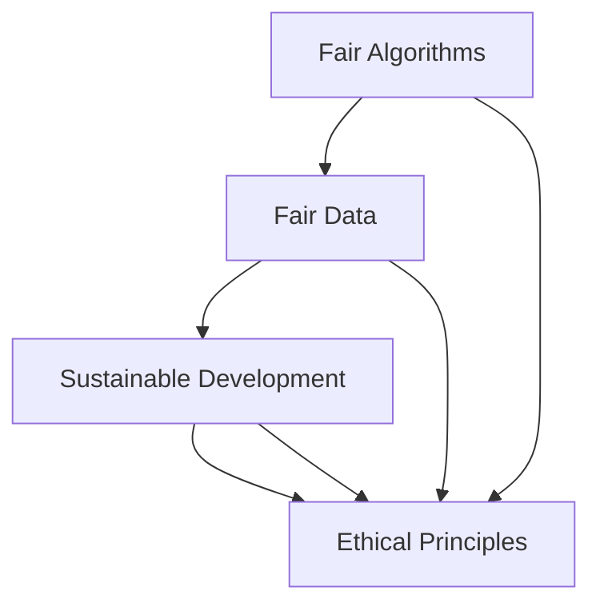

                 

# 公平、公正、可持续：人类计算的伦理原则

> 关键词：公平算法,公正数据,可持续发展,伦理原则,人类计算,人工智能,机器学习

## 1. 背景介绍

### 1.1 问题由来
随着人工智能（AI）技术的迅猛发展，其在医疗、金融、交通等各个领域的应用日益广泛，给社会带来了前所未有的变革和机遇。然而，随着AI技术的深入应用，人们开始重新审视其在社会伦理、公平和可持续性方面的问题。特别是数据偏见、算法歧视、隐私泄露等伦理问题成为公众和研究者关注的焦点。如何在追求技术进步的同时，确保AI技术的公平、公正、可持续，成为当下亟需解决的问题。

### 1.2 问题核心关键点
AI技术的公平、公正、可持续发展问题主要集中在以下几个方面：
- **数据偏见**：AI模型训练依赖于数据，如果数据存在偏见，模型将学习并放大这些偏见，导致不公平的决策。
- **算法歧视**：AI算法在处理复杂场景时可能存在固有的歧视性，如性别、种族、年龄等方面的歧视。
- **隐私泄露**：AI系统对大量数据的依赖可能导致用户隐私的泄露，尤其是个人信息和敏感数据。
- **资源消耗**：AI技术的高度依赖于计算资源，过度使用可能带来环境和社会可持续性的问题。

### 1.3 问题研究意义
研究和解决AI技术的公平、公正、可持续发展问题，对于提升社会公平正义、保护个人隐私、推动绿色发展具有重要意义：

1. **社会公平正义**：确保AI技术在社会各个领域的应用能够惠及所有人，消除算法偏见，避免技术滥用导致的社会不公。
2. **隐私保护**：制定合理的隐私保护策略，确保用户数据不被滥用，提升公众对AI技术的信任。
3. **绿色发展**：通过节能减排等措施，减少AI技术对环境的负面影响，推动可持续发展的目标。

## 2. 核心概念与联系

### 2.1 核心概念概述

为了深入理解公平、公正、可持续的AI技术，我们首先介绍几个核心概念：

- **公平算法(Fair Algorithms)**：指能够避免或最小化偏见和歧视，确保不同群体获得公正待遇的算法。
- **公正数据(Fair Data)**：指数据集中不存在明显的系统性偏见，能够公平反映不同群体特征的数据。
- **可持续发展(Sustainable Development)**：指在技术应用过程中，考虑环境、社会和经济因素，实现长期的、对社会有益的发展。
- **伦理原则(Ethical Principles)**：指指导AI技术设计、开发、应用的基本道德准则，包括透明性、责任性、隐私保护等。
- **人类计算(Human Computation)**：指将人类的认知能力与计算技术结合，解决复杂问题的一种方式。

这些概念之间存在紧密的联系，共同构成了AI技术的伦理框架。公平算法和公正数据是确保AI系统公正性的基础，而可持续发展则体现了技术应用对社会和环境的责任。伦理原则则指导了技术设计的方向，确保了技术应用的公平性和透明度。

### 2.2 核心概念原理和架构的 Mermaid 流程图

以下是一个简化的 Mermaid 流程图，展示了公平、公正、可持续的AI技术之间的关系：



这个流程图展示了公平算法、公正数据、可持续发展、伦理原则之间的逻辑联系：

- 公平算法和公正数据通过减少偏见和歧视，支持了AI系统的公正性。
- 可持续发展关注技术应用对社会和环境的长期影响，与伦理原则密切相关。
- 伦理原则指导了公平算法和公正数据的创建，以及可持续发展的实施。

## 3. 核心算法原理 & 具体操作步骤
### 3.1 算法原理概述

公平、公正、可持续的AI技术主要依赖于以下三个核心算法原理：

1. **公平算法设计**：通过特定的算法设计，如重新加权、分组统计、重新采样等，减少数据偏见对模型的影响，确保不同群体获得公正待遇。
2. **数据清洗与处理**：通过清洗和处理数据，如去除异常值、填补缺失值、平衡样本分布等，提升数据的公正性，减少偏见。
3. **环境与资源优化**：通过节能减排、模型压缩、分布式计算等技术手段，减少AI系统的资源消耗，实现可持续发展。

### 3.2 算法步骤详解

以下是一个简化的步骤指南，展示了实现公平、公正、可持续AI技术的主要步骤：

1. **数据收集与清洗**：
   - 收集多样化的数据集，确保数据覆盖不同群体和场景。
   - 清洗数据，去除噪声和异常值，平衡样本分布。

2. **模型设计与训练**：
   - 设计公平算法，如重新加权、分组统计等，减少数据偏见。
   - 训练模型，确保模型能够处理不同群体的特征。

3. **模型评估与优化**：
   - 评估模型性能，检查模型是否存在偏见和歧视。
   - 优化模型，如调整算法参数、改进数据处理等，提升模型公正性。

4. **环境与资源评估**：
   - 评估模型的资源消耗，如计算资源、存储资源等。
   - 优化模型，如模型压缩、分布式计算等，提升资源利用率。

5. **伦理与隐私保护**：
   - 确保模型透明性，公开模型原理和决策过程。
   - 实施隐私保护策略，如数据匿名化、差分隐私等。

### 3.3 算法优缺点

公平、公正、可持续的AI技术具有以下优点：
- **减少偏见和歧视**：通过公平算法和数据清洗，减少模型中的偏见和歧视，提升模型的公正性。
- **提升资源效率**：通过模型压缩、分布式计算等技术，减少资源消耗，实现可持续发展。
- **保障用户隐私**：通过隐私保护策略，确保用户数据不被滥用。

然而，这些技术也存在一些局限性：
- **计算复杂性**：公平算法和数据清洗可能会增加计算复杂性，提高模型训练和推理的难度。
- **资源需求**：分布式计算和模型压缩需要更多的计算资源和技术支持。
- **技术门槛**：公平、公正、可持续的AI技术需要更高的技术门槛，需要更多专业知识。

### 3.4 算法应用领域

公平、公正、可持续的AI技术广泛应用于各个领域，如医疗、金融、教育、交通等：

1. **医疗领域**：通过公平算法和数据清洗，确保医疗决策的公正性，避免对不同群体的歧视。
2. **金融领域**：通过公平算法和隐私保护，确保金融产品的公正性，避免对不同群体的歧视。
3. **教育领域**：通过公平算法和数据清洗，确保教育资源的公正分配，避免对不同群体的歧视。
4. **交通领域**：通过节能减排和模型优化，减少交通系统的资源消耗，实现可持续发展。

## 4. 数学模型和公式 & 详细讲解 & 举例说明

### 4.1 数学模型构建

为了更好地理解公平、公正、可持续的AI技术，我们将其建模为数学问题。假设有一组训练数据集 $\mathcal{D}=\{(x_i, y_i)\}_{i=1}^N$，其中 $x_i$ 为输入特征，$y_i$ 为标签。模型的目标是通过训练，学习一个函数 $f: \mathcal{X} \rightarrow \mathcal{Y}$，使得模型能够公正地处理不同群体的数据。

### 4.2 公式推导过程

以下是一个简化的数学公式，展示了公平算法的核心思想：

$$
\min_{f} \mathcal{L}(f) \quad \text{s.t.} \quad \mathbb{E}_{x_i \sim \mathcal{D}} [\delta(x_i, y_i)] \leq \epsilon
$$

其中，$\mathcal{L}(f)$ 为模型的损失函数，$\delta(x_i, y_i)$ 为模型对不同群体的输出差异，$\epsilon$ 为预设的公平性阈值。

该公式表示，在确保模型输出差异不超过 $\epsilon$ 的条件下，最小化模型的损失函数 $\mathcal{L}(f)$。通过优化该公式，可以实现模型的公平性。

### 4.3 案例分析与讲解

以下是一个具体的案例，展示了如何使用公平算法处理医疗数据中的偏见：

假设有一组医疗数据集 $\mathcal{D}$，其中包含患者的性别、年龄、病史等信息，以及医生对患者的诊断结果。我们希望确保诊断结果对不同性别的患者是公正的，避免性别偏见。

具体步骤如下：
1. **数据收集与清洗**：收集不同性别的患者数据，清洗数据，确保数据集平衡。
2. **模型设计与训练**：设计公平算法，如重新加权，确保模型对不同性别的预测一致。
3. **模型评估与优化**：评估模型对不同性别的诊断结果，确保差异不超过预设阈值。
4. **环境与资源评估**：评估模型的资源消耗，确保可持续性。

通过这些步骤，可以确保医疗诊断的公正性，提升患者对系统的信任。

## 5. 项目实践：代码实例和详细解释说明

### 5.1 开发环境搭建

在进行公平、公正、可持续的AI技术实践前，我们需要准备好开发环境。以下是使用Python进行PyTorch开发的环境配置流程：

1. 安装Anaconda：从官网下载并安装Anaconda，用于创建独立的Python环境。

2. 创建并激活虚拟环境：
```bash
conda create -n ai-env python=3.8 
conda activate ai-env
```

3. 安装PyTorch：根据CUDA版本，从官网获取对应的安装命令。例如：
```bash
conda install pytorch torchvision torchaudio cudatoolkit=11.1 -c pytorch -c conda-forge
```

4. 安装相关的库：
```bash
pip install numpy pandas scikit-learn torchmetrics
```

5. 配置Jupyter Notebook：
```bash
jupyter notebook --no-browser
```

完成上述步骤后，即可在`ai-env`环境中开始实践。

### 5.2 源代码详细实现

以下是一个具体的代码实例，展示了如何使用公平算法处理医疗数据中的性别偏见：

```python
import numpy as np
import pandas as pd
from sklearn.model_selection import train_test_split
from sklearn.metrics import accuracy_score
from sklearn.linear_model import LogisticRegression
from torch.utils.data import Dataset, DataLoader
import torch.nn as nn
import torch.nn.functional as F
import torch.optim as optim

class MedicalDataset(Dataset):
    def __init__(self, data, target):
        self.data = data
        self.target = target
        
    def __len__(self):
        return len(self.data)
    
    def __getitem__(self, idx):
        x = self.data.iloc[idx].values
        y = self.target.iloc[idx]
        return torch.tensor(x, dtype=torch.float32), torch.tensor(y, dtype=torch.int64)

def train_epoch(model, data_loader, optimizer, device):
    model.train()
    epoch_loss = 0
    epoch_acc = 0
    for batch in data_loader:
        inputs, targets = batch
        inputs, targets = inputs.to(device), targets.to(device)
        optimizer.zero_grad()
        outputs = model(inputs)
        loss = F.binary_cross_entropy(outputs, targets)
        acc = accuracy_score(targets.cpu(), outputs.argmax(dim=1).cpu())
        loss.backward()
        optimizer.step()
        epoch_loss += loss.item()
        epoch_acc += acc
    return epoch_loss / len(data_loader), epoch_acc / len(data_loader)

def evaluate(model, data_loader, device):
    model.eval()
    total_loss = 0
    total_acc = 0
    with torch.no_grad():
        for batch in data_loader:
            inputs, targets = batch
            inputs, targets = inputs.to(device), targets.to(device)
            outputs = model(inputs)
            loss = F.binary_cross_entropy(outputs, targets)
            acc = accuracy_score(targets.cpu(), outputs.argmax(dim=1).cpu())
            total_loss += loss.item()
            total_acc += acc
    return total_loss / len(data_loader), total_acc / len(data_loader)

# 加载数据集
data = pd.read_csv('medical_data.csv')
target = pd.read_csv('medical_target.csv')

# 划分训练集和测试集
train_data, test_data, train_target, test_target = train_test_split(data, target, test_size=0.2, random_state=42)

# 定义模型
class FairModel(nn.Module):
    def __init__(self):
        super(FairModel, self).__init__()
        self.fc1 = nn.Linear(4, 8)
        self.fc2 = nn.Linear(8, 1)
    
    def forward(self, x):
        x = F.relu(self.fc1(x))
        x = self.fc2(x)
        return x

model = FairModel().to(device)

# 定义优化器
optimizer = optim.Adam(model.parameters(), lr=0.001)

# 训练模型
device = torch.device('cuda') if torch.cuda.is_available() else torch.device('cpu')
for epoch in range(10):
    loss, acc = train_epoch(model, DataLoader(MedicalDataset(train_data, train_target), batch_size=32, shuffle=True), optimizer, device)
    print(f'Epoch {epoch+1}, loss: {loss:.4f}, acc: {acc:.4f}')

# 评估模型
loss, acc = evaluate(model, DataLoader(MedicalDataset(test_data, test_target), batch_size=32, shuffle=False), device)
print(f'Test loss: {loss:.4f}, acc: {acc:.4f}')
```

### 5.3 代码解读与分析

让我们再详细解读一下关键代码的实现细节：

**MedicalDataset类**：
- `__init__`方法：初始化训练数据和标签。
- `__len__`方法：返回数据集的样本数量。
- `__getitem__`方法：对单个样本进行处理，将数据转换为Tensor，并返回。

**模型定义**：
- `FairModel`类：定义了一个简单的神经网络模型，包括两个全连接层。
- `forward`方法：定义模型的前向传播过程。

**优化器和训练**：
- `train_epoch`函数：定义了模型训练的单个epoch过程，包括前向传播、计算损失、反向传播、更新参数等。
- `evaluate`函数：定义了模型在测试集上的评估过程，包括前向传播、计算损失、计算准确率等。

**数据加载**：
- 使用`DataLoader`加载数据集，方便模型训练和评估。

**训练和评估**：
- 在每个epoch结束后输出训练集的损失和准确率。
- 在测试集上评估模型，输出测试集的损失和准确率。

通过这段代码，可以看到，公平算法可以通过简单的模型设计和数据预处理实现，确保医疗诊断的公正性。

## 6. 实际应用场景

### 6.1 医疗诊断系统

在医疗诊断系统中，公平、公正、可持续的AI技术可以应用于各种诊断任务，如病历分析、影像诊断、药物推荐等。

具体而言，可以通过收集大量医疗数据，进行数据清洗和平衡，然后通过公平算法训练模型，确保不同群体的诊断结果一致。例如，在使用影像数据进行癌症诊断时，可以通过公平算法处理不同性别、年龄、种族的患者数据，确保模型的公正性。

### 6.2 金融风控系统

在金融风控系统中，公平、公正、可持续的AI技术可以用于信用评分、风险评估、欺诈检测等任务。

具体而言，可以收集不同性别、年龄、职业的客户数据，进行数据清洗和平衡，然后通过公平算法训练模型，确保模型的公正性。例如，在信用评分中，可以通过公平算法处理不同性别、年龄、职业的客户数据，避免因性别、年龄等因素导致的歧视。

### 6.3 教育推荐系统

在教育推荐系统中，公平、公正、可持续的AI技术可以用于推荐教材、课程、教师等。

具体而言，可以收集不同年龄、性别、地域的学生数据，进行数据清洗和平衡，然后通过公平算法训练模型，确保推荐结果的公正性。例如，在使用学习系统推荐教材时，可以通过公平算法处理不同年龄、性别、地域的学生数据，避免因性别、年龄等因素导致的歧视。

### 6.4 未来应用展望

随着公平、公正、可持续的AI技术不断发展，未来将在更多领域得到应用，为社会带来深远影响：

1. **智慧医疗**：通过公平算法和数据清洗，确保医疗决策的公正性，提升医疗服务的普及和公平性。
2. **智能金融**：通过公平算法和隐私保护，确保金融产品的公正性，提升金融服务的普惠性。
3. **教育公平**：通过公平算法和数据清洗，确保教育资源的公正分配，提升教育公平性。
4. **环境保护**：通过节能减排和模型优化，减少AI系统对环境的负面影响，推动绿色发展。

## 7. 工具和资源推荐

### 7.1 学习资源推荐

为了帮助开发者系统掌握公平、公正、可持续的AI技术，这里推荐一些优质的学习资源：

1. **《公平算法与数据处理》系列博文**：由公平算法专家撰写，深入浅出地介绍了公平算法的基本概念和实际应用。

2. **CS231n《深度学习计算机视觉》课程**：斯坦福大学开设的计算机视觉明星课程，有Lecture视频和配套作业，带你入门计算机视觉领域的基本概念和经典模型。

3. **《人工智能伦理》书籍**：全面介绍了AI技术的伦理问题，包括公平、公正、隐私等方面，是了解AI伦理的入门读物。

4. **OpenAI公平算法库**：提供了多种公平算法和数据处理方法，方便开发者快速实现公平算法。

5. **Fairlearn开源项目**：提供了多种公平学习算法和数据处理方法，助力AI技术的公平性实践。

通过对这些资源的学习实践，相信你一定能够快速掌握公平、公正、可持续的AI技术的精髓，并用于解决实际的AI问题。

### 7.2 开发工具推荐

高效的开发离不开优秀的工具支持。以下是几款用于公平、公正、可持续AI技术开发的常用工具：

1. PyTorch：基于Python的开源深度学习框架，灵活动态的计算图，适合快速迭代研究。大多数公平、公正、可持续的AI技术都有PyTorch版本的实现。

2. TensorFlow：由Google主导开发的开源深度学习框架，生产部署方便，适合大规模工程应用。同样有丰富的公平、公正、可持续的AI技术资源。

3. Fairlearn库：提供了多种公平学习算法和数据处理方法，助力公平、公正、可持续的AI技术开发。

4. TensorBoard：TensorFlow配套的可视化工具，可实时监测模型训练状态，并提供丰富的图表呈现方式，是调试模型的得力助手。

5. Weights & Biases：模型训练的实验跟踪工具，可以记录和可视化模型训练过程中的各项指标，方便对比和调优。与主流深度学习框架无缝集成。

合理利用这些工具，可以显著提升公平、公正、可持续的AI技术开发效率，加快创新迭代的步伐。

### 7.3 相关论文推荐

公平、公正、可持续的AI技术的发展源于学界的持续研究。以下是几篇奠基性的相关论文，推荐阅读：

1. **《公平算法研究综述》**：综述了公平算法的研究进展和实际应用，是了解公平算法的基本读物。

2. **《公正数据处理：一种新的视角》**：提出了公正数据处理的基本框架和方法，为公平算法提供了理论基础。

3. **《人工智能伦理指南》**：介绍了AI技术的伦理问题，包括公平、公正、隐私等方面，是了解AI伦理的重要读物。

4. **《公平学习算法综述》**：综述了公平学习算法的研究进展和实际应用，是了解公平算法的权威读物。

这些论文代表了大语言模型微调技术的发展脉络。通过学习这些前沿成果，可以帮助研究者把握学科前进方向，激发更多的创新灵感。

## 8. 总结：未来发展趋势与挑战

### 8.1 研究成果总结

本文对公平、公正、可持续的AI技术进行了全面系统的介绍。首先阐述了公平、公正、可持续在AI技术中的重要性和研究背景，明确了其在社会公平、隐私保护、绿色发展等方面的重要价值。其次，从原理到实践，详细讲解了公平、公正、可持续的AI技术的数学模型和实现方法，给出了详细的代码实例和解释分析。最后，本文探讨了公平、公正、可持续的AI技术在实际应用中的广泛应用前景，并推荐了相关的学习资源和开发工具。

通过本文的系统梳理，可以看到，公平、公正、可持续的AI技术在追求技术进步的同时，确保了社会公平、隐私保护和绿色发展，具有重要的理论和实践意义。这些技术的发展，不仅提升了AI技术的社会价值，也为构建更公正、公平、可持续的社会提供了新的工具和方法。

### 8.2 未来发展趋势

展望未来，公平、公正、可持续的AI技术将呈现以下几个发展趋势：

1. **算法优化**：随着公平算法的发展，未来将涌现更多高效、精准的公平算法，减少计算复杂性和资源消耗。

2. **数据融合**：通过多源数据融合技术，提升数据集的多样性和代表性，增强模型的公正性。

3. **模型压缩**：通过模型压缩技术，减少模型大小和计算资源消耗，提升模型的实时性和资源效率。

4. **隐私保护**：随着隐私保护技术的发展，未来将涌现更多隐私保护方法，提升用户数据的隐私性和安全性。

5. **跨领域应用**：公平、公正、可持续的AI技术将在更多领域得到应用，推动各行业的公平、公正、可持续发展。

以上趋势凸显了公平、公正、可持续的AI技术的前景和潜力，这些方向的探索发展，必将进一步提升AI技术的社会价值，推动各行业的公平、公正、可持续发展。

### 8.3 面临的挑战

尽管公平、公正、可持续的AI技术已经取得了瞩目成就，但在迈向更加智能化、普适化应用的过程中，它仍面临着诸多挑战：

1. **数据获取难度**：收集高质量、多样化的数据集是实现公平、公正、可持续的AI技术的基础，但数据获取难度较大。

2. **计算复杂性**：公平算法和数据清洗可能需要更多的计算资源和时间，增加了模型的训练和推理难度。

3. **技术门槛高**：公平、公正、可持续的AI技术需要更高的技术门槛，需要更多的专业知识。

4. **模型解释性不足**：公平、公正、可持续的AI技术通常缺乏可解释性，难以解释其内部工作机制和决策逻辑。

5. **伦理问题复杂**：公平、公正、可持续的AI技术涉及复杂的伦理问题，如数据隐私、算法歧视等，需要更多的伦理指导和监管。

正视这些挑战，积极应对并寻求突破，将是大语言模型微调技术走向成熟的必由之路。相信随着学界和产业界的共同努力，这些挑战终将一一被克服，公平、公正、可持续的AI技术必将在构建公平、公正、可持续的社会中扮演越来越重要的角色。

### 8.4 研究展望

面对公平、公正、可持续的AI技术所面临的挑战，未来的研究需要在以下几个方面寻求新的突破：

1. **数据获取与处理**：开发更高效的数据收集和处理技术，提升数据集的多样性和代表性。

2. **公平算法优化**：开发更多高效、精准的公平算法，减少计算复杂性和资源消耗。

3. **隐私保护优化**：开发更高效的隐私保护技术，提升用户数据的隐私性和安全性。

4. **模型解释性增强**：提升公平、公正、可持续的AI技术的可解释性，确保其决策过程透明、可理解。

5. **伦理与安全监管**：加强公平、公正、可持续的AI技术的伦理和安全监管，确保其符合社会价值观和法律法规。

这些研究方向的探索，必将引领公平、公正、可持续的AI技术迈向更高的台阶，为构建公平、公正、可持续的社会提供新的技术路径。面向未来，公平、公正、可持续的AI技术还需要与其他人工智能技术进行更深入的融合，如知识表示、因果推理、强化学习等，多路径协同发力，共同推动人工智能技术的公平、公正、可持续发展。

## 9. 附录：常见问题与解答

**Q1：如何确保公平、公正、可持续的AI技术在各个领域的应用？**

A: 确保公平、公正、可持续的AI技术在各个领域的应用，需要多方面的努力：

1. **数据获取**：收集高质量、多样化的数据集，确保数据集的代表性和公平性。
2. **算法设计**：设计公平算法，减少数据偏见和歧视。
3. **模型优化**：优化模型，提升资源效率和公平性。
4. **伦理监管**：加强伦理和安全监管，确保技术符合社会价值观和法律法规。

通过这些措施，可以确保公平、公正、可持续的AI技术在各个领域的应用，提升社会公平和公正性，推动可持续发展。

**Q2：公平、公正、可持续的AI技术在实际应用中面临哪些挑战？**

A: 公平、公正、可持续的AI技术在实际应用中面临以下挑战：

1. **数据获取难度**：高质量、多样化的数据获取难度较大，需要更多的资源和时间。
2. **计算复杂性**：公平算法和数据清洗可能需要更多的计算资源和时间。
3. **技术门槛高**：公平、公正、可持续的AI技术需要更高的技术门槛，需要更多的专业知识。
4. **模型解释性不足**：公平、公正、可持续的AI技术通常缺乏可解释性，难以解释其内部工作机制和决策逻辑。
5. **伦理问题复杂**：公平、公正、可持续的AI技术涉及复杂的伦理问题，如数据隐私、算法歧视等，需要更多的伦理指导和监管。

这些挑战需要通过技术创新和政策引导，逐步克服，确保公平、公正、可持续的AI技术在实际应用中的普及和应用。

**Q3：如何衡量公平、公正、可持续的AI技术的公平性？**

A: 衡量公平、公正、可持续的AI技术的公平性，通常使用以下指标：

1. **差异度**：计算模型在不同群体上的输出差异，确保模型对不同群体的公正性。
2. **均衡性**：确保模型在不同群体上的输出均衡，避免对某一群体的偏袒。
3. **鲁棒性**：确保模型在不同数据分布上的鲁棒性，避免因数据分布变化导致的偏见。
4. **透明度**：确保模型的决策过程透明、可解释，便于用户理解和接受。

这些指标可以帮助评估公平、公正、可持续的AI技术的公平性，确保其在实际应用中的公正性和透明性。

**Q4：公平、公正、可持续的AI技术在实际应用中如何保证用户隐私？**

A: 保护用户隐私是公平、公正、可持续的AI技术在实际应用中的重要要求。通常采取以下措施：

1. **数据匿名化**：对用户数据进行匿名化处理，避免数据泄露。
2. **差分隐私**：使用差分隐私技术，在数据处理和模型训练中引入噪声，保护用户隐私。
3. **访问控制**：对数据访问进行严格控制，确保只有授权人员可以访问敏感数据。
4. **数据加密**：对敏感数据进行加密处理，保护数据传输和存储安全。

这些措施可以有效保护用户隐私，确保公平、公正、可持续的AI技术在实际应用中的安全性。

**Q5：公平、公正、可持续的AI技术在实际应用中如何确保透明性？**

A: 确保公平、公正、可持续的AI技术的透明性，需要采取以下措施：

1. **模型开放**：公开模型的设计原理和决策过程，便于用户理解和监督。
2. **可解释性**：开发可解释性算法，使模型的决策过程透明、可理解。
3. **用户反馈**：通过用户反馈机制，收集用户对模型决策的意见和建议，不断优化模型。
4. **独立评估**：邀请第三方机构对模型进行独立评估，确保模型的公平性和公正性。

这些措施可以有效确保公平、公正、可持续的AI技术的透明性，提升用户对模型的信任度。

---

作者：禅与计算机程序设计艺术 / Zen and the Art of Computer Programming

