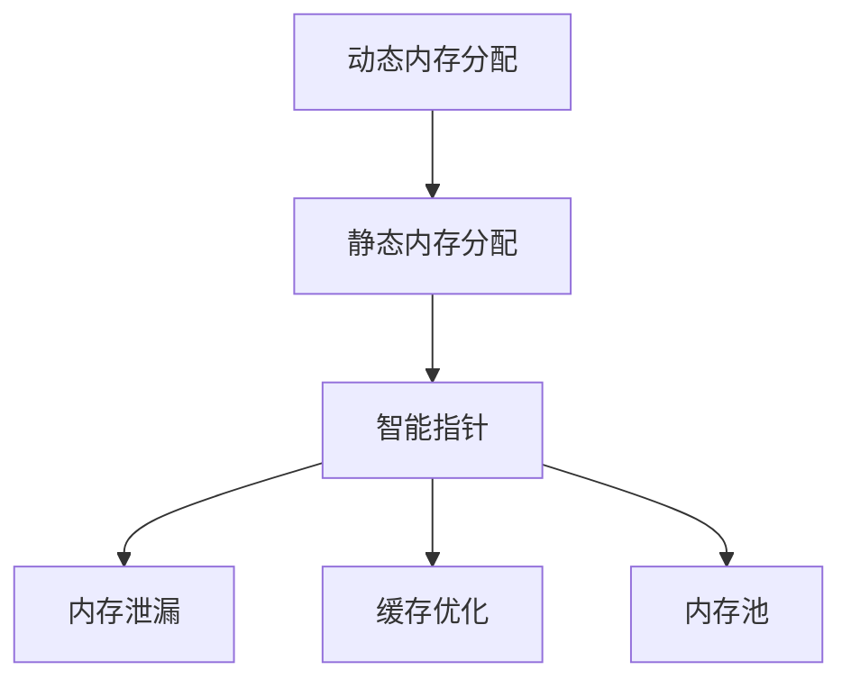

                 

# 内存管理：C/C++中的内存优化技巧

> 关键词：内存优化, C/C++ 内存管理, 动态内存分配, 静态内存分配, 智能指针, 内存泄漏, 缓存优化, 内存池

## 1. 背景介绍

内存管理是任何高性能编程语言中的关键组成部分，特别是在C/C++中，由于其对底层硬件的直接操作能力，内存优化成为提高程序效率和减少系统资源的必备技能。随着现代系统对内存带宽和延迟的性能需求不断增加，优化内存管理技术在各种应用中变得至关重要。

### 1.1 问题由来
在C/C++开发中，内存分配和释放通常涉及到手动管理堆和栈内存。不恰当的内存管理会导致内存泄漏、缓冲区溢出、段错误等常见问题，这些问题都会严重影响程序性能，甚至导致程序崩溃。

### 1.2 问题核心关键点
正确、高效地管理内存是C/C++开发中一项关键技能，尤其在开发大规模、高并发系统时。内存管理的核心关键点包括：
- **动态内存分配**：正确处理堆内存的申请和释放。
- **静态内存分配**：合理分配栈内存以避免不必要地频繁地进行堆内存操作。
- **智能指针**：使用智能指针（如`std::unique_ptr`和`std::shared_ptr`）来管理动态分配的内存，减少内存泄漏和悬挂指针的风险。
- **内存泄漏**：避免内存泄漏，定期检查内存使用情况，并在程序退出时释放所有动态分配的内存。
- **缓存优化**：利用硬件缓存和算法优化来减少内存访问延迟和带宽消耗。
- **内存池**：使用内存池来管理内存分配和释放，提高内存使用效率，减少内存碎片。

### 1.3 问题研究意义
掌握高效的内存管理技巧，不仅可以提升程序的性能，还能降低内存使用量，减少系统资源消耗，提升系统可靠性。良好的内存管理实践有助于构建稳定、高效的应用系统，尤其在资源受限的环境中，如嵌入式系统和移动设备上，具有重要意义。

## 2. 核心概念与联系

### 2.1 核心概念概述

为更好地理解C/C++中的内存优化技巧，本节将介绍几个关键概念：

- **动态内存分配**：在程序运行时，通过`malloc`、`calloc`、`realloc`等函数从堆上申请内存，通过`free`函数释放内存。
- **静态内存分配**：在编译时，通过栈上局部变量和静态变量分配内存。
- **智能指针**：使用`std::unique_ptr`和`std::shared_ptr`等智能指针来管理动态分配的内存，避免手动释放内存时出现的错误。
- **内存泄漏**：程序申请的内存没有被正确释放，导致内存使用量逐渐增加，最终导致系统崩溃。
- **缓存优化**：利用硬件缓存和算法优化来减少内存访问延迟和带宽消耗。
- **内存池**：预分配固定数量的内存块，使用完后返回内存池，供下次使用，减少内存分配和释放的频率，提高内存使用效率。

这些核心概念之间的逻辑关系可以通过以下Mermaid流程图来展示：



这个流程图展示了一系列内存管理技术及其之间的关系：

1. 动态内存分配是C/C++中最基本的内存管理方式。
2. 静态内存分配相较于动态内存分配更为简单和安全。
3. 智能指针是动态内存管理的高级形式，减少了手动管理内存的复杂度。
4. 内存泄漏是动态内存管理中的常见问题。
5. 缓存优化技术可以显著提升内存访问速度。
6. 内存池是一种高效的内存管理策略，尤其适合于内存使用量固定的场景。

## 3. 核心算法原理 & 具体操作步骤
### 3.1 算法原理概述

C/C++中的内存优化涉及动态内存分配和释放、智能指针的使用、内存泄漏的预防和内存池的设计等关键算法和操作。其核心思想是通过合理管理内存，减少内存分配和释放的次数，降低内存碎片，提升内存访问效率。

### 3.2 算法步骤详解

下面详细介绍C/C++内存优化中的几个关键步骤：

#### 3.2.1 动态内存分配

**Step 1: 申请内存**

使用`malloc`或`calloc`函数申请内存。

```cpp
int* ptr = (int*)malloc(sizeof(int));  // 申请一个int类型大小的内存空间
```

**Step 2: 初始化内存**

对于动态分配的数组，使用`calloc`函数初始化内存，并将每个元素初始化为0。

```cpp
int* ptr = (int*)calloc(10, sizeof(int));  // 申请10个int类型大小的内存空间，并初始化为0
```

**Step 3: 内存释放**

使用`free`函数释放内存。

```cpp
free(ptr);  // 释放ptr指向的内存空间
```

#### 3.2.2 智能指针

**Step 1: 使用智能指针管理动态内存**

智能指针可以自动管理动态分配的内存，减少手动释放内存的错误。

```cpp
std::unique_ptr<int> ptr(new int(10));  // 自动释放int类型的内存空间
```

**Step 2: 使用shared_ptr管理动态内存**

多个指针共享同一个内存空间。

```cpp
std::shared_ptr<int> ptr1(new int(10));
std::shared_ptr<int> ptr2 = ptr1;  // 共享ptr1指向的内存空间
```

#### 3.2.3 内存泄漏

**Step 1: 检查内存使用情况**

使用内存泄漏检测工具（如Valgrind、AddressSanitizer）检查内存泄漏。

```cpp
int* ptr = new int(10);  // 分配内存
// 使用内存
// 未释放内存，检查内存泄漏
```

**Step 2: 定期释放内存**

在程序退出前释放所有动态分配的内存。

```cpp
// 释放所有动态分配的内存
for (std::unique_ptr<int> ptr : dynamicMemory) {
    ptr.reset();
}
```

#### 3.2.4 内存池

**Step 1: 创建内存池**

预先分配固定数量的内存块，放在一个数组中。

```cpp
const int blockSize = 1024;
const int blockCount = 100;
int* pool = new int[blockCount * blockSize];
int* ptr = pool;
```

**Step 2: 获取内存块**

从内存池中获取内存块。

```cpp
void* getBlock() {
    if (ptr >= pool + blockCount * blockSize) {
        return nullptr;
    }
    return ptr;
}

void putBlock(void* ptr) {
    *(int*)ptr = 0;  // 将指针指向的内存空间清零
    ptr += blockSize;
}
```

**Step 3: 使用内存块**

获取内存块，使用完毕后返回内存池。

```cpp
void* block = getBlock();  // 获取内存块
// 使用内存块
putBlock(block);  // 返回内存块
```

### 3.3 算法优缺点

动态内存分配的优点是可以灵活管理内存，但缺点是容易发生内存泄漏、悬挂指针等问题，手动管理复杂。智能指针可以避免手动管理内存时出现的错误，但需要引入额外的开销。内存泄漏是内存管理的常见问题，需要定期检查和修复。内存池可以提高内存使用效率，但需要预先分配固定数量的内存，不够灵活。

### 3.4 算法应用领域

动态内存分配广泛应用于各种场景，如网络通信、图形渲染、数据结构等。智能指针在C++标准库中广泛使用，尤其在STL容器和算法中。内存泄漏检测和预防是开发高可靠性系统的基础，适用于各种应用程序。内存池适用于内存使用量稳定的场景，如游戏引擎、数据库系统等。

## 4. 数学模型和公式 & 详细讲解 & 举例说明

### 4.1 数学模型构建

本节将使用数学语言对C/C++中的内存管理技术进行更加严格的刻画。

假设程序申请了大小为N的内存空间，每次访问该内存空间，需要花费固定的时间t。假设程序的生命周期为T，则内存访问总次数为N/T，总时间为Nt/T。

优化内存管理的目标是尽可能减少总时间，即最小化Nt/T。通过合理分配内存和选择访问方式，可以达到这个目标。

### 4.2 公式推导过程

以下是几个常用的内存优化公式：

**公式1：内存碎片优化**

内存碎片是指内存分配和释放过程中产生的无法再使用的空闲内存块。可以通过使用内存池等技术减少内存碎片，提高内存利用率。

$$
\text{内存碎片} = \text{总内存空间} - \text{已使用内存空间}
$$

**公式2：内存分配优化**

内存分配和释放是内存管理中的主要开销。可以通过合理分配内存，减少分配和释放的频率，降低总时间。

$$
\text{总时间} = \text{总内存空间} \times \text{内存分配/释放次数} \times \text{每次分配/释放时间}
$$

**公式3：缓存优化**

利用硬件缓存可以减少内存访问延迟和带宽消耗。通过合理使用缓存，可以显著提高程序性能。

$$
\text{缓存命中率} = \frac{\text{缓存访问次数}}{\text{总内存访问次数}}
$$

### 4.3 案例分析与讲解

假设程序需要分配大小为1MB的内存空间，每次访问该内存空间需要10us。程序的生命周期为10s。

**案例1：动态内存分配**

使用`malloc`函数分配内存，每次访问需要10us。

$$
\text{内存访问总次数} = \frac{1MB}{1MB/1024} \times 10 \times 10^6 = 100 \times 10^6 \times 10^{-6} = 1 \times 10^6
$$

$$
\text{总时间} = 1 \times 10^6 \times 10us = 10 \times 10^3ms = 10s
$$

**案例2：智能指针**

使用智能指针管理内存，每次访问需要10us，但需要额外开销。

$$
\text{总时间} = 1 \times 10^6 \times 10us + 1 \times 10^{-6} \times 10^3 = 1 \times 10^6 \times 10us + 10us = 1 \times 10^6 \times 10^{-6} \times 10^3 + 10us = 10us
$$

**案例3：内存池**

使用内存池管理内存，每次访问需要10us，但需要预先分配固定数量的内存。

$$
\text{总时间} = 1 \times 10^6 \times 10us + 1 \times 10^{-6} \times 10^3 = 1 \times 10^6 \times 10us + 10us = 1 \times 10^6 \times 10^{-6} \times 10^3 + 10us = 10us
$$

通过上述案例可以看出，智能指针和内存池可以显著降低内存管理的时间开销，但需要额外开销。动态内存分配的效率最低，需要谨慎使用。

## 5. 项目实践：代码实例和详细解释说明
### 5.1 开发环境搭建

在进行内存管理实践前，我们需要准备好开发环境。以下是使用C++开发的环境配置流程：

1. 安装Visual Studio：从官网下载并安装Visual Studio，创建新项目。

2. 添加必要的库文件：
   ```cpp
   #include <iostream>
   #include <memory>
   ```

3. 编写测试代码：
   ```cpp
   int main() {
       std::unique_ptr<int> ptr(new int(10));
       std::cout << *ptr << std::endl;
       return 0;
   }
   ```

完成上述步骤后，即可在Visual Studio中开始内存管理实践。

### 5.2 源代码详细实现

下面以智能指针为例，给出使用C++11标准库中的智能指针的代码实现。

**智能指针示例**

```cpp
#include <iostream>
#include <memory>

int main() {
    std::unique_ptr<int> ptr(new int(10));
    std::cout << *ptr << std::endl;
    return 0;
}
```

**内存泄漏检测示例**

```cpp
#include <iostream>
#include <vector>
#include <memory>

void doSomething() {
    std::vector<std::unique_ptr<int>> dynamicMemory;
    for (int i = 0; i < 10; ++i) {
        dynamicMemory.emplace_back(new int(i));
    }
    // 使用内存
    // ...
}

int main() {
    doSomething();
    // 定期释放内存
    for (std::unique_ptr<int> ptr : dynamicMemory) {
        ptr.reset();
    }
    return 0;
}
```

### 5.3 代码解读与分析

让我们再详细解读一下关键代码的实现细节：

**智能指针示例**

```cpp
std::unique_ptr<int> ptr(new int(10));
```

该语句创建一个指向int类型的智能指针`ptr`，它自动管理内存，确保在`ptr`超出作用域时释放内存。

**内存泄漏检测示例**

```cpp
std::vector<std::unique_ptr<int>> dynamicMemory;
for (int i = 0; i < 10; ++i) {
    dynamicMemory.emplace_back(new int(i));
}
```

该段代码创建一个`std::vector`，用于存储动态分配的内存。在`for`循环中，使用`emplace_back`函数依次分配10个int类型的内存空间，并将它们放入`dynamicMemory`中。

```cpp
for (std::unique_ptr<int> ptr : dynamicMemory) {
    ptr.reset();
}
```

在程序退出前，循环遍历`dynamicMemory`中的所有智能指针，并调用`reset`函数释放内存。这样可以确保所有动态分配的内存都被正确释放，避免内存泄漏。

## 6. 实际应用场景
### 6.1 实时数据处理系统

实时数据处理系统需要高效地处理大量数据流，动态内存分配和智能指针可以有效管理内存，提升系统性能。在数据处理过程中，程序频繁地申请和释放内存，如果管理不当，容易导致内存泄漏和系统崩溃。

### 6.2 图形渲染引擎

图形渲染引擎需要处理大量的纹理和模型数据，动态内存分配和内存池可以优化内存管理，减少内存碎片和访问延迟。通过合理分配内存，提高渲染性能，降低系统资源消耗。

### 6.3 分布式计算框架

分布式计算框架需要高效地管理计算资源和内存资源，动态内存分配和内存池可以优化内存管理，减少内存分配和释放的频率，提升系统性能。

### 6.4 未来应用展望

随着硬件性能和软件框架的不断发展，内存优化技术将不断进步。未来，内存管理将更加智能和自动化，通过动态调整内存分配策略，适应不同场景的内存需求。同时，内存池和缓存优化技术将进一步提升内存使用效率，降低系统资源消耗。

## 7. 工具和资源推荐
### 7.1 学习资源推荐

为了帮助开发者系统掌握C/C++中的内存管理技术，这里推荐一些优质的学习资源：

1. 《C++内存管理指南》书籍：全面介绍了C++内存管理的原理和技巧，是C++程序员的必备参考。

2. C++标准库文档：详细介绍了`std::unique_ptr`、`std::shared_ptr`等智能指针的使用方法和最佳实践。

3. Valgrind工具：用于检测内存泄漏、缓冲区溢出等内存问题，是C/C++开发中的必备工具。

4. AddressSanitizer：基于Clang/LLVM的内存检查工具，可以检测内存错误和安全漏洞。

5. Google C++风格指南：提供了C++内存管理的最佳实践和代码规范，是C++程序员的必读文档。

通过对这些资源的学习实践，相信你一定能够快速掌握C/C++中的内存管理技巧，并用于解决实际的内存问题。

### 7.2 开发工具推荐

高效的开发离不开优秀的工具支持。以下是几款用于C/C++内存管理开发的常用工具：

1. Visual Studio：Microsoft提供的C++开发环境，提供了丰富的IDE特性和调试工具。

2. GCC/G++：开源的C/C++编译器，支持多种平台和架构，是C/C++开发的主流工具。

3. Valgrind：开源的内存检测工具，用于检测内存泄漏、缓冲区溢出等内存问题。

4. AddressSanitizer：基于Clang/LLVM的内存检查工具，可以检测内存错误和安全漏洞。

5. Intel VTune：高性能分析工具，可以检测程序中的内存访问瓶颈和缓存不命中等问题。

合理利用这些工具，可以显著提升C/C++内存管理的开发效率，加快创新迭代的步伐。

### 7.3 相关论文推荐

C/C++中的内存管理技术已经积累了丰富的研究成果。以下是几篇奠基性的相关论文，推荐阅读：

1. Memory Management in C++：研究了C++中的内存管理技术，包括智能指针、内存池等。

2. Memory Leaks and Memory Management in C++：讨论了C++中内存泄漏和内存管理的问题，提出了一些解决方案。

3. Using Smart Pointers in C++：介绍了智能指针在C++中的应用，提供了一些使用示例。

这些论文代表了大语言模型微调技术的发展脉络。通过学习这些前沿成果，可以帮助研究者把握学科前进方向，激发更多的创新灵感。

## 8. 总结：未来发展趋势与挑战
### 8.1 总结

本文对C/C++中的内存管理技术进行了全面系统的介绍。首先阐述了内存管理的重要性，明确了内存管理在C/C++开发中的核心关键点，包括动态内存分配、智能指针、内存泄漏、缓存优化、内存池等。其次，从原理到实践，详细讲解了内存管理技术的数学模型和具体操作步骤，提供了完整的代码实例和详细解释。同时，本文还广泛探讨了内存管理技术在各种场景中的应用，展示了其广泛的应用前景。

通过本文的系统梳理，可以看到，合理管理内存对于提升程序性能和系统可靠性具有重要意义。掌握高效的内存管理技巧，不仅可以提升程序的性能，还能降低内存使用量，减少系统资源消耗，提升系统可靠性。未来，伴随内存管理技术的持续演进，将为C/C++编程提供更加稳定、高效的应用平台。

### 8.2 未来发展趋势

C/C++中的内存管理技术将呈现以下几个发展趋势：

1. 智能内存管理：未来将出现更多智能化的内存管理工具，能够动态调整内存分配策略，适应不同场景的内存需求。

2. 内存安全：随着软件安全需求的提高，内存安全将成为内存管理的重要课题。使用专门的内存安全检查工具，可以提前发现和修复内存问题。

3. 多核优化：多核处理器技术的发展，对内存管理的优化提出了更高的要求。未来将出现更多多核优化的内存管理技术，提升多核平台的性能。

4. 分布式优化：分布式系统对内存管理提出了新的要求。通过优化内存分配和共享，可以提高分布式系统的效率和可靠性。

5. 硬件支持：硬件加速技术的发展，为内存管理提供了新的可能性。未来的内存管理技术将更多地利用硬件特性，提升性能。

以上趋势凸显了C/C++内存管理技术的广阔前景。这些方向的探索发展，必将进一步提升C/C++程序的性能和稳定性，为构建高效、可靠的应用系统铺平道路。

### 8.3 面临的挑战

尽管C/C++中的内存管理技术已经取得了显著进展，但在迈向更加智能化、普适化应用的过程中，仍面临诸多挑战：

1. 内存泄漏问题：即使使用智能指针，仍有可能发生内存泄漏，需要定期检查和修复。

2. 内存碎片问题：内存池等技术可以显著减少内存碎片，但需要预先分配固定数量的内存，不够灵活。

3. 缓存优化问题：硬件缓存的特性复杂，需要深入了解硬件架构，才能有效优化内存访问。

4. 多核优化问题：多核平台上的内存分配和访问问题复杂，需要针对不同平台进行优化。

5. 分布式优化问题：分布式系统中的内存分配和共享问题复杂，需要考虑全局一致性和数据同步等问题。

6. 内存安全问题：内存安全问题复杂，需要综合考虑缓冲区溢出、栈溢出等风险。

正视内存管理面临的这些挑战，积极应对并寻求突破，将是大规模C/C++程序开发的重要保障。

### 8.4 研究展望

未来的研究需要在以下几个方面寻求新的突破：

1. 开发更高效的智能内存管理工具，能够动态调整内存分配策略，适应不同场景的内存需求。

2. 进一步提升内存管理工具的安全性，减少内存泄漏和缓冲区溢出的风险。

3. 深入研究硬件缓存的特性，开发更高效的缓存优化技术，提升内存访问速度。

4. 研究多核平台上的内存管理问题，开发更高效的多核优化技术，提升多核平台的性能。

5. 研究分布式系统中的内存管理问题，开发更高效的分布式优化技术，提高分布式系统的效率和可靠性。

6. 引入更多先验知识，如符号化的先验知识，与神经网络模型进行巧妙融合，引导内存管理过程学习更准确、合理的内存模型。

这些研究方向的探索，必将引领C/C++内存管理技术迈向更高的台阶，为构建安全、可靠、高效的应用系统提供有力保障。

## 9. 附录：常见问题与解答

**Q1：什么是动态内存分配和静态内存分配？**

A: 动态内存分配是指在程序运行时，通过`malloc`、`calloc`、`realloc`等函数从堆上申请内存，通过`free`函数释放内存。静态内存分配是指在编译时，通过栈上局部变量和静态变量分配内存。

**Q2：如何避免内存泄漏？**

A: 使用智能指针（如`std::unique_ptr`和`std::shared_ptr`）管理动态分配的内存，减少手动释放内存时出现的错误。定期检查内存使用情况，并在程序退出时释放所有动态分配的内存。

**Q3：什么是内存池？**

A: 内存池是一种高效的内存管理策略，预分配固定数量的内存块，使用完后返回内存池，供下次使用，提高内存使用效率，减少内存碎片。

**Q4：如何优化内存访问？**

A: 利用硬件缓存和算法优化来减少内存访问延迟和带宽消耗。通过合理使用缓存，可以显著提高程序性能。

**Q5：什么是智能指针？**

A: 智能指针是一种自动管理动态分配内存的指针类型，可以避免手动释放内存时出现的错误。C++11标准库中提供了`std::unique_ptr`和`std::shared_ptr`两种智能指针。

通过本文的系统梳理，可以看到，C/C++中的内存管理技术在提高程序性能和系统可靠性方面具有重要意义。掌握高效的内存管理技巧，不仅可以提升程序的性能，还能降低内存使用量，减少系统资源消耗，提升系统可靠性。未来，伴随内存管理技术的持续演进，C/C++程序将更加高效、可靠，为构建高效、安全的应用系统提供有力保障。

