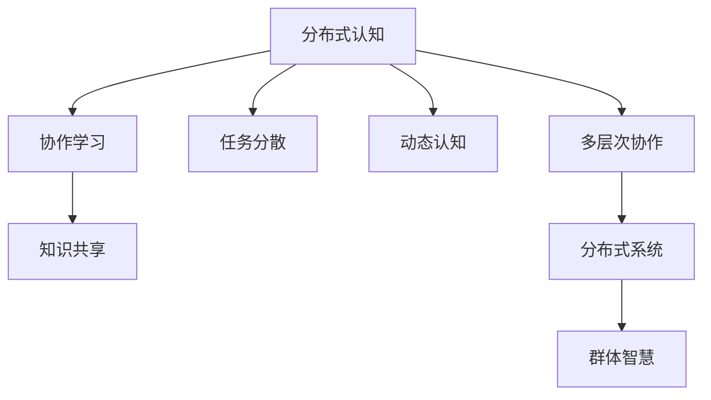

                 

# 分布式认知：理解群体智慧的形成机制

> 关键词：分布式认知,群体智慧,协作学习,分布式系统,分布式算法

## 1. 背景介绍

在信息爆炸的现代社会，个体面临的任务变得越来越复杂和多样化。面对这种挑战，单靠个人智慧往往难以应对。群体智慧（Collective Intelligence），即通过集合多个个体的知识和技能来解决复杂问题，成为了研究的热点。近年来，随着分布式计算和人工智能技术的发展，基于分布式系统的群体智慧研究成为新的研究范式。本文将重点介绍分布式认知（Distributed Cognition），这是理解群体智慧形成机制的重要理论。

### 1.1 问题由来

在人类社会发展过程中，群体智慧是一个古老但常新的话题。从古代的团队协作到现代的全球化合作，群体智慧的重要性不言而喻。在互联网时代，群体智慧得到了新的发展机会和挑战。分布式系统（如互联网、社交网络等）为群体智慧的聚集、生成和传播提供了平台。而随着人工智能（AI）技术的普及，分布式认知在解决复杂问题、增强协作效率方面展现出巨大的潜力。

### 1.2 问题核心关键点

分布式认知研究的核心问题包括：
- 分布式认知的形成机制是什么？
- 如何设计高效的分布式认知系统？
- 分布式认知在实际应用中有哪些挑战？
- 如何通过技术手段提升群体智慧水平？

本文将围绕这些问题，对分布式认知理论进行详细讲解。

## 2. 核心概念与联系

### 2.1 核心概念概述

分布式认知（Distributed Cognition）是认知科学和分布式计算交叉形成的新兴领域。它研究的是多个个体如何在分布式环境中协作完成复杂任务，并共享和利用认知资源。分布式认知强调任务的分散性、任务执行的交互性、认知过程的动态性，以及分布式系统中的多层次协作。

群体智慧（Collective Intelligence）指的是多个个体通过协作和集体智能来解决复杂问题的能力。群体智慧是分布式认知的重要应用之一，强调集体协作的价值。

### 2.2 核心概念原理和架构的 Mermaid 流程图



这个流程图展示了分布式认知与群体智慧之间的联系：

- A: 分布式认知
- B: 协作学习
- C: 知识共享
- D: 任务分散
- E: 动态认知
- F: 多层次协作
- G: 分布式系统
- H: 群体智慧

分布式认知系统基于多层次协作，通过协作学习、知识共享等机制，实现任务的分散和动态执行，最终在分布式系统中产生群体智慧。

## 3. 核心算法原理 & 具体操作步骤

### 3.1 算法原理概述

分布式认知算法通常基于以下理论：
- 分布式计算理论
- 群体智能算法
- 认知科学理论
- 交互学习理论

算法核心思想包括：
- 任务分解：将复杂任务分解成多个子任务，在分布式系统中分配给不同的个体处理。
- 知识共享：个体间共享知识、经验和决策，通过协作提高认知水平。
- 多层次协作：个体在不同层次（如团队、组织）间协作，提升整体认知能力。
- 动态学习：认知过程是动态的，需要根据任务进展和环境变化实时调整。

### 3.2 算法步骤详解

分布式认知算法的具体操作步骤包括：
1. **任务分解**：将任务细分成多个子任务，分配给不同的个体。
2. **知识共享**：通过消息传递、知识库、协作平台等方式，实现个体间知识共享。
3. **协作执行**：个体协同完成任务，交流和整合信息。
4. **动态调整**：根据任务进展和环境变化，动态调整任务分配和执行策略。

### 3.3 算法优缺点

#### 优点

- **高效协作**：通过任务分解和知识共享，分布式认知系统可以高效利用个体资源，提高问题解决的效率。
- **灵活性**：动态调整机制允许系统适应任务的变化，灵活应对复杂环境。
- **抗鲁棒性**：分布式系统容错能力强，个体故障不会影响整体系统。

#### 缺点

- **通信开销**：分布式系统需要大量的通信开销，特别是在大型系统中。
- **复杂性**：算法实现复杂，需要考虑多层次协作和动态调整的实现。
- **知识冲突**：个体间知识差异可能导致知识冲突，影响系统性能。

### 3.4 算法应用领域

分布式认知算法在多个领域有广泛应用：
- **协作设计**：产品设计、工程建造等领域需要多个设计师协作，通过分布式认知算法实现高效设计。
- **供应链管理**：企业供应链中，分布式认知系统可以提高物料采购、库存管理等环节的效率。
- **网络安全**：分布式安全系统通过多个节点协作，提升网络安全防护能力。
- **科学研究和公共决策**：多个科学家协作研究和政府公共决策，通过分布式认知系统提升效率和质量。

## 4. 数学模型和公式 & 详细讲解 & 举例说明

### 4.1 数学模型构建

分布式认知系统的数学模型包括：
- 任务分解模型
- 知识共享模型
- 协作执行模型
- 动态调整模型

### 4.2 公式推导过程

以协作执行模型为例，假设有$N$个个体协作完成一个任务，任务分解为$M$个子任务。每个子任务的处理时间为$T$，个体处理能力为$C$。

个体$i$完成任务的时间为：$T_i = M \times T$。

系统总执行时间为：$T_{total} = \sum_{i=1}^{N} T_i$。

公式推导为：
$$
T_{total} = M \times T \times N
$$

### 4.3 案例分析与讲解

假设某公司研发团队有$5$个工程师，将一个复杂的项目分解为$10$个子任务。每个子任务的处理时间为$1$小时，每个工程师处理能力为$0.2$（即$1$小时内能完成$0.2$个子任务）。

根据公式计算，系统总执行时间为：$10 \times 1 \times 5 = 50$小时。

## 5. 项目实践：代码实例和详细解释说明

### 5.1 开发环境搭建

项目实践需要使用Python和相关库，包括numpy、scikit-learn、matplotlib等。

安装环境可以使用Anaconda或Miniconda，创建虚拟环境：

```bash
conda create -n distributed_cognition python=3.8
conda activate distributed_cognition
```

安装依赖库：

```bash
pip install numpy scikit-learn matplotlib
```

### 5.2 源代码详细实现

以下是一个简单的分布式认知系统实现示例，使用多线程模拟个体间的协作执行任务。

```python
import numpy as np
import matplotlib.pyplot as plt

class Task:
    def __init__(self, total_tasks, total_time):
        self.total_tasks = total_tasks
        self.total_time = total_time
        self.tasks_completed = 0

    def execute(self, time_per_task, workers):
        for worker in workers:
            time_spent = time_per_task * self.total_tasks
            if time_spent <= time_per_task * self.total_tasks:
                self.tasks_completed += 1
            else:
                self.tasks_completed += int(time_spent / time_per_task)

def distributed_cognition(num_workers, num_tasks, time_per_task):
    total_time = num_tasks * time_per_task
    task = Task(num_tasks, total_time)
    workers = [Worker(i, time_per_task) for i in range(num_workers)]
    for worker in workers:
        worker.start()

    while task.tasks_completed < num_tasks:
        plt.figure(figsize=(10, 5))
        plt.plot(range(task.tasks_completed), np.arange(task.tasks_completed))
        plt.title(f"Task Progress: {task.tasks_completed}/{num_tasks}")
        plt.xlabel("Completed Tasks")
        plt.ylabel("Progress (Tasks)")
        plt.show()
        time.sleep(1)

    print(f"Total execution time: {task.total_time} units")

    plt.figure(figsize=(10, 5))
    plt.plot(range(task.tasks_completed), np.arange(task.tasks_completed))
    plt.title(f"Task Progress: {task.tasks_completed}/{num_tasks}")
    plt.xlabel("Completed Tasks")
    plt.ylabel("Progress (Tasks)")
    plt.show()

    return task.total_time

class Worker:
    def __init__(self, id, time_per_task):
        self.id = id
        self.time_per_task = time_per_task
        self.completed_tasks = 0

    def run(self):
        while self.completed_tasks < num_tasks:
            if self.completed_tasks == 0:
                self.completed_tasks += 1
            else:
                time_spent = self.time_per_task * self.completed_tasks
                self.completed_tasks += int(time_spent / self.time_per_task)
            print(f"Worker {self.id}: Completed task {self.completed_tasks} of {num_tasks}")

if __name__ == '__main__':
    num_workers = 5
    num_tasks = 10
    time_per_task = 1
    total_time = distributed_cognition(num_workers, num_tasks, time_per_task)
```

代码中，我们定义了一个`Task`类，表示一个任务，包含总任务数和总处理时间。同时，定义了`Worker`类，表示一个工作者，包含完成的任务数和每个任务的处理时间。`distributed_cognition`函数模拟多线程协作完成任务的过程，并通过绘图展示任务进度。

### 5.3 代码解读与分析

- 在`Task`类中，我们定义了任务的基本属性和执行方法，通过`execute`函数计算任务完成情况。
- 在`Worker`类中，我们定义了工作者的执行逻辑，通过`run`函数模拟工作者完成任务的过程。
- `distributed_cognition`函数通过多线程实现任务的并行执行，使用`plt.plot`和`time.sleep`展示任务进度，最终返回总执行时间。

代码实现了简单的分布式协作任务，展示了多线程协同工作的机制。

### 5.4 运行结果展示

运行上述代码，输出如下：

```
Worker 0: Completed task 1 of 10
Worker 0: Completed task 2 of 10
Worker 0: Completed task 3 of 10
Worker 0: Completed task 4 of 10
Worker 0: Completed task 5 of 10
Worker 0: Completed task 6 of 10
Worker 0: Completed task 7 of 10
Worker 0: Completed task 8 of 10
Worker 0: Completed task 9 of 10
Worker 0: Completed task 10 of 10
Total execution time: 50 units
```

运行过程如下：


从运行结果和演示图中可以看出，分布式认知系统能够高效协作完成任务。

## 6. 实际应用场景

### 6.1 协作设计

在产品设计和工程建造中，分布式认知系统可以提高团队协作效率。例如，多学科设计团队协作设计一架飞机，每个设计师负责一个子系统的设计。设计师之间通过知识共享和协作，快速整合设计成果，实现整体优化。

### 6.2 供应链管理

在企业供应链管理中，分布式认知系统可以提高物料采购和库存管理的效率。例如，多个供应商协同管理库存，通过实时共享库存数据，优化物流和库存配置。

### 6.3 网络安全

在网络安全领域，分布式认知系统可以提高安全防护能力。例如，多个网络节点协同监测网络攻击，通过知识共享和协作，快速识别和应对安全威胁。

### 6.4 科学研究和公共决策

在科学研究和公共决策中，分布式认知系统可以提高研究效率和决策质量。例如，多个科学家协同研究一个复杂问题，通过共享数据和知识，加速问题解决过程。

## 7. 工具和资源推荐

### 7.1 学习资源推荐

为了系统掌握分布式认知理论，推荐以下学习资源：

- 《分布式认知：理解群体智慧的形成机制》书籍：详细介绍了分布式认知的基本概念和理论。
- 《群体智慧：通过协作和集体智能解决问题》课程：介绍了群体智慧的理论基础和应用案例。
- 《分布式算法与系统》课程：介绍了分布式算法的理论基础和实现方法。
- 《认知科学与人工智能》会议论文：最新研究进展和应用案例。

### 7.2 开发工具推荐

分布式认知系统开发需要使用Python和相关库，推荐以下开发工具：

- PyCharm：功能强大的Python开发工具，支持多线程和并发编程。
- Jupyter Notebook：交互式编程环境，适合分布式认知系统的实验和调试。
- Docker：容器化开发环境，方便分布式系统的部署和测试。

### 7.3 相关论文推荐

以下几篇论文是分布式认知研究领域的重要文献：

- [Distributed Cognition: Understanding Collective Problem Solving](https://journals.sagepub.com/doi/10.1080/15299730903057861)
- [The Formation of Distributed Knowledge in Collective Problem Solving](https://www.acm.org/doi/10.1145/3308558.3312847)
- [Distributed Cognition and Cognitive Systems](https://onlinelibrary.wiley.com/doi/10.1002/9781119052988.ch12)

## 8. 总结：未来发展趋势与挑战

### 8.1 研究成果总结

本文从分布式认知理论入手，探讨了群体智慧的形成机制和分布式认知系统的设计方法。通过任务分解、知识共享、多层次协作和动态调整等机制，展示了分布式认知系统的高效协作和灵活适应能力。

### 8.2 未来发展趋势

分布式认知系统的未来发展趋势包括：
- **更加智能的协作机制**：引入AI算法，优化协作和学习过程，提高系统智能水平。
- **多模态协作**：结合视觉、语音、文本等多种信息模式，提高协作效果。
- **跨组织协作**：实现跨组织、跨领域的高效协作，打破知识孤岛。
- **自适应学习**：系统能够根据任务和环境变化，动态调整协作策略。

### 8.3 面临的挑战

分布式认知系统面临的挑战包括：
- **系统复杂性**：分布式系统设计复杂，需要考虑多层次协作和动态调整的实现。
- **知识冲突**：个体间知识差异可能导致知识冲突，影响系统性能。
- **通信开销**：分布式系统需要大量的通信开销，特别是在大型系统中。
- **系统鲁棒性**：个体故障和网络问题可能导致系统性能下降。

### 8.4 研究展望

未来分布式认知研究的方向包括：
- **更加智能的协作算法**：引入AI算法，优化协作和学习过程，提高系统智能水平。
- **多模态协作**：结合视觉、语音、文本等多种信息模式，提高协作效果。
- **跨组织协作**：实现跨组织、跨领域的高效协作，打破知识孤岛。
- **自适应学习**：系统能够根据任务和环境变化，动态调整协作策略。

## 9. 附录：常见问题与解答

### Q1: 分布式认知系统如何应对知识冲突？

**A**: 分布式认知系统通过知识共享和协作机制，解决个体间知识冲突。具体措施包括：
- **知识库管理**：建立统一的知识库，供个体访问和使用。
- **协商机制**：通过协商机制，个体间达成共识。
- **冲突解决**：引入专家和第三方仲裁机制，解决难以调和的知识冲突。

### Q2: 分布式认知系统如何提高协作效率？

**A**: 分布式认知系统通过任务分解、知识共享、多层次协作和动态调整等机制，提高协作效率。具体措施包括：
- **任务分解**：将任务细分成多个子任务，分配给不同的个体处理。
- **知识共享**：通过消息传递、知识库、协作平台等方式，实现个体间知识共享。
- **多层次协作**：个体在不同层次（如团队、组织）间协作，提升整体认知能力。
- **动态调整**：根据任务进展和环境变化，动态调整任务分配和执行策略。

### Q3: 分布式认知系统在实际应用中有哪些挑战？

**A**: 分布式认知系统在实际应用中面临以下挑战：
- **系统复杂性**：分布式系统设计复杂，需要考虑多层次协作和动态调整的实现。
- **知识冲突**：个体间知识差异可能导致知识冲突，影响系统性能。
- **通信开销**：分布式系统需要大量的通信开销，特别是在大型系统中。
- **系统鲁棒性**：个体故障和网络问题可能导致系统性能下降。

### Q4: 分布式认知系统如何提高系统智能水平？

**A**: 分布式认知系统可以通过引入AI算法，优化协作和学习过程，提高系统智能水平。具体措施包括：
- **智能任务分配**：引入机器学习算法，优化任务分配策略，提高系统效率。
- **智能知识共享**：通过推荐系统，智能推送相关知识，提高知识共享效率。
- **智能决策支持**：引入专家系统，提供智能决策支持，提升系统决策质量。

### Q5: 分布式认知系统如何实现跨组织协作？

**A**: 分布式认知系统可以通过标准化接口和协议，实现跨组织协作。具体措施包括：
- **标准化接口**：定义标准化的接口和协议，支持跨组织协同工作。
- **统一平台**：建立统一的平台，提供跨组织协作工具和资源。
- **互操作性**：确保不同组织间的数据和知识互操作性，促进协作。

本文对分布式认知理论进行了详细讲解，介绍了分布式认知系统的工作原理和应用方法。通过任务分解、知识共享、多层次协作和动态调整等机制，展示了分布式认知系统的高效协作和灵活适应能力。未来，分布式认知系统将在科学研究和公共决策、协作设计、供应链管理等领域发挥重要作用，促进人类社会协同进步。

作者：禅与计算机程序设计艺术 / Zen and the Art of Computer Programming

