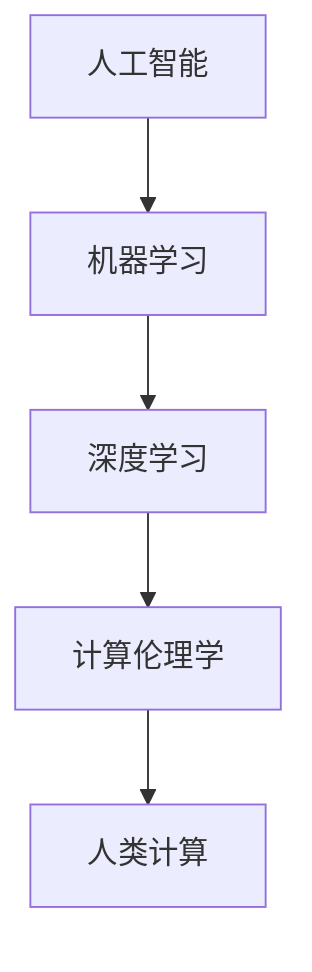

                 

# 创造更美好的世界：人类计算的终极目标

> 关键词：人工智能,机器学习,深度学习,计算伦理学,人类计算,可持续发展

## 1. 背景介绍

### 1.1 问题由来

随着信息技术的迅猛发展，人工智能(AI)技术正在以前所未有的速度改变着我们的生活方式。从智能语音助手、自动驾驶汽车到精准医疗，AI的应用已经渗透到了社会的各个角落。然而，与此同时，AI技术也引发了一系列新的挑战和伦理问题，引发了广泛的讨论和思考。

人工智能的初衷是为了增强人类能力，服务人类社会，但现实中却出现了一些偏离预期的负面影响。例如，自动化导致的失业问题，AI算法中的偏见和歧视，以及数据隐私泄露等问题。这些问题促使我们反思，如何利用AI技术创造更美好的世界，真正实现“人类计算”的终极目标。

### 1.2 问题核心关键点

人类计算的终极目标是实现AI与人类社会价值观的深度融合，让人类社会在技术进步中持续向前发展，同时避免潜在的风险和负面影响。为了实现这一目标，我们需要解决以下几个核心问题：

1. **公平与包容**：确保AI技术在应用中不会加剧社会不平等，而是能够为所有人带来平等的福利。
2. **透明性与可解释性**：增强AI系统的可解释性，确保其决策过程透明，便于社会监督和改进。
3. **责任与问责**：明确AI系统的责任归属，确保出现问题时有明确的问责机制。
4. **数据与隐私保护**：严格保护个人隐私，确保数据使用的合法性和道德性。
5. **可持续性**：推动AI技术在环保、可持续发展等方面发挥积极作用，避免资源浪费和环境破坏。

## 2. 核心概念与联系

### 2.1 核心概念概述

为更好地理解如何实现人类计算的终极目标，本节将介绍几个密切相关的核心概念：

- **人工智能**：通过模拟人类智能行为，实现对复杂问题的解决。
- **机器学习**：一种利用算法使机器通过数据学习的能力，包括监督学习、无监督学习和强化学习。
- **深度学习**：一种基于多层神经网络的机器学习技术，广泛应用于图像识别、语音处理、自然语言处理等领域。
- **计算伦理学**：研究人工智能技术应用中的伦理问题，如何平衡技术进步与人类福祉。
- **人类计算**：一种强调人机协作，利用人工智能辅助人类决策和创新的理念。

这些核心概念之间的逻辑关系可以通过以下Mermaid流程图来展示：



这个流程图展示了大语言模型微调的核心概念及其之间的关系：

1. 人工智能通过机器学习和深度学习技术，不断提升其智能水平。
2. 计算伦理学关注AI技术应用中的伦理问题，引导技术向善。
3. 人类计算强调人机协作，利用AI技术辅助人类决策，实现更高效的创新。

这些概念共同构成了AI技术的发展方向，推动着人类社会向更加智能、可持续的方向前进。

## 3. 核心算法原理 & 具体操作步骤
### 3.1 算法原理概述

人类计算的终极目标，在于通过技术手段实现社会的全面进步，同时避免潜在的负面影响。这一目标可以通过以下步骤来实现：

1. **公平与包容**：通过AI技术，实现资源的公平分配，为所有人提供平等的福利。
2. **透明性与可解释性**：开发可解释的AI系统，确保其决策过程透明，便于社会监督。
3. **责任与问责**：明确AI系统的责任归属，确保出现问题时有明确的问责机制。
4. **数据与隐私保护**：保护个人隐私，确保数据使用的合法性和道德性。
5. **可持续性**：推动AI技术在环保、可持续发展等方面发挥积极作用。

### 3.2 算法步骤详解

实现人类计算的终极目标，需要遵循以下算法步骤：

**Step 1: 数据收集与处理**
- 收集包含社会、环境、经济等各个方面的数据，进行清洗和预处理，确保数据的质量和可用性。

**Step 2: 模型设计与训练**
- 选择合适的机器学习模型，并设计合理的训练流程。在训练过程中，注重模型的公平性和透明性，避免数据偏见。
- 使用公开透明的数据集，确保模型的可复现性和公正性。

**Step 3: 模型评估与验证**
- 在模型训练完成后，进行严格的评估和验证，确保模型的效果和可靠性。
- 使用多种评估指标，如准确率、召回率、F1分数等，全面衡量模型的性能。

**Step 4: 模型部署与应用**
- 将训练好的模型部署到实际应用场景中，进行长期监测和优化。
- 定期更新模型，确保其适应不断变化的社会需求。

**Step 5: 监督与改进**
- 建立社会监督机制，收集用户的反馈和建议，不断改进模型。
- 与学术界、行业专家合作，持续推进技术的创新和应用。

### 3.3 算法优缺点

实现人类计算的终极目标，需要在技术和社会责任之间找到平衡，下面是一些常见的优缺点：

**优点**：
1. **高效性**：AI技术可以快速处理大量数据，辅助决策和创新。
2. **普适性**：AI技术可以应用于各种领域，解决复杂问题。
3. **创新性**：AI技术可以推动新领域的探索和发现，带来新的解决方案。

**缺点**：
1. **偏见与歧视**：AI模型可能会学习数据中的偏见，导致决策不公平。
2. **隐私与数据安全**：数据隐私保护和数据安全问题是AI应用的重要挑战。
3. **透明性与可解释性**：AI系统的决策过程往往难以解释，难以获得社会的信任。
4. **责任归属**：AI系统的责任归属不明确，出现问题时难以追责。

尽管存在这些挑战，但人类计算的终极目标是明确的，通过不断的技术创新和社会实践，相信我们可以找到解决方案，实现更加美好的世界。

### 3.4 算法应用领域

实现人类计算的终极目标，需要在各个领域进行深入探索和应用。以下是几个典型的应用领域：

**医疗健康**：通过AI技术辅助疾病诊断、个性化治疗、药物研发等，提高医疗服务的质量和效率。

**环境保护**：利用AI技术监测环境变化、预测气候变化、优化资源配置，实现绿色发展。

**教育公平**：开发智能教育系统，实现个性化教学、自动批改作业，提升教育公平性。

**社会治理**：通过AI技术提升城市管理水平、优化资源配置、解决社会问题，构建和谐社会。

## 4. 数学模型和公式 & 详细讲解 & 举例说明
### 4.1 数学模型构建

人类计算的终极目标，需要利用数学模型来描述和解决社会问题。以下是一些常见的数学模型：

- **线性回归模型**：用于描述两个变量之间的线性关系。在资源分配问题中，可以用于预测不同资源的消耗量，从而实现公平分配。
- **决策树模型**：用于分类和回归问题，可以用于预测疾病风险、决策支持等。
- **深度学习模型**：用于处理复杂非线性关系，可以用于图像识别、语音处理等。

### 4.2 公式推导过程

以下以线性回归模型为例，展示其公式推导过程：

$$
y = \theta_0 + \theta_1x_1 + \theta_2x_2 + \cdots + \theta_nx_n
$$

其中，$y$ 表示目标变量，$x_1, x_2, \cdots, x_n$ 表示自变量，$\theta_0, \theta_1, \cdots, \theta_n$ 表示模型的参数。

线性回归模型通过最小化误差函数来求解参数：

$$
\theta = \mathop{\arg\min}_{\theta} \sum_{i=1}^m (y_i - (\theta_0 + \theta_1x_{i1} + \theta_2x_{i2} + \cdots + \theta_nx_{in}))^2
$$

其中，$m$ 表示样本数，$y_i$ 表示第 $i$ 个样本的输出，$x_{ij}$ 表示第 $i$ 个样本的第 $j$ 个自变量。

求解上述最小化问题，可以采用梯度下降等优化算法，得到模型参数 $\theta$。

### 4.3 案例分析与讲解

以医疗健康领域为例，线性回归模型可以用于预测患者在不同治疗方案下的恢复时间。假设我们有以下数据：

| 患者ID | 年龄 | 性别 | 治疗方案 | 恢复时间 |
| --- | --- | --- | --- | --- |
| 1 | 45 | M | 方案A | 30天 |
| 2 | 55 | F | 方案B | 45天 |
| ... | ... | ... | ... | ... |

我们可以将这些数据分为训练集和测试集，使用线性回归模型进行训练和预测。训练集用于估计模型参数，测试集用于验证模型性能。

## 5. 项目实践：代码实例和详细解释说明
### 5.1 开发环境搭建

在进行人类计算的终极目标的实践时，我们需要准备好开发环境。以下是使用Python进行TensorFlow开发的环境配置流程：

1. 安装Anaconda：从官网下载并安装Anaconda，用于创建独立的Python环境。

2. 创建并激活虚拟环境：
```bash
conda create -n tensorflow-env python=3.8 
conda activate tensorflow-env
```

3. 安装TensorFlow：根据CUDA版本，从官网获取对应的安装命令。例如：
```bash
conda install tensorflow -c tensorflow -c conda-forge
```

4. 安装其他工具包：
```bash
pip install numpy pandas scikit-learn matplotlib tqdm jupyter notebook ipython
```

完成上述步骤后，即可在`tensorflow-env`环境中开始项目实践。

### 5.2 源代码详细实现

下面我们以医疗健康领域为例，给出使用TensorFlow进行线性回归模型训练和预测的Python代码实现。

```python
import tensorflow as tf
import numpy as np
from sklearn.model_selection import train_test_split

# 定义线性回归模型
def linear_regression_model(features, labels, hidden_units):
    input_layer = tf.keras.layers.Dense(hidden_units, activation='relu')(features)
    output_layer = tf.keras.layers.Dense(1, activation=None)(input_layer)
    return output_layer

# 加载数据集
data = np.loadtxt('data.csv', delimiter=',')
features = data[:, :-1]
labels = data[:, -1]

# 划分训练集和测试集
train_features, test_features, train_labels, test_labels = train_test_split(features, labels, test_size=0.2)

# 定义模型和优化器
model = linear_regression_model(features, labels, 10)
optimizer = tf.keras.optimizers.Adam(learning_rate=0.001)

# 定义损失函数和评估指标
loss_fn = tf.keras.losses.MeanSquaredError()
evaluation_metrics = [tf.keras.metrics.MeanAbsoluteError(), tf.keras.metrics.MeanSquaredError()]

# 训练模型
model.compile(optimizer=optimizer, loss=loss_fn, metrics=evaluation_metrics)
model.fit(train_features, train_labels, epochs=100, validation_data=(test_features, test_labels))

# 预测结果
predictions = model.predict(test_features)
```

### 5.3 代码解读与分析

让我们再详细解读一下关键代码的实现细节：

**线性回归模型定义**：
- `linear_regression_model`函数：定义线性回归模型结构，包括输入层和输出层，以及激活函数。
- `features`和`labels`：分别表示输入特征和目标变量。

**数据加载与处理**：
- `np.loadtxt`：加载CSV格式的数据集。
- `train_test_split`：将数据集划分为训练集和测试集。

**模型定义与训练**：
- `model.compile`：编译模型，定义优化器、损失函数和评估指标。
- `model.fit`：训练模型，使用训练集进行训练，并在验证集上进行评估。

**预测结果**：
- `model.predict`：使用训练好的模型进行预测，输出测试集上的预测结果。

通过以上代码实现，我们可以使用TensorFlow进行线性回归模型的训练和预测，从而实现对医疗健康领域问题的解决。

## 6. 实际应用场景
### 6.1 智能医疗系统

智能医疗系统通过AI技术，提升医疗服务的质量和效率，实现个性化医疗。例如，智能诊断系统可以通过图像识别技术，快速准确地诊断疾病，辅助医生做出更好的诊疗决策。智能推荐系统可以根据患者的病情和治疗历史，推荐最适合的治疗方案和药物，提升治疗效果。

### 6.2 环境保护监测

环境保护监测系统通过AI技术，实时监测环境变化，预测气候变化趋势，优化资源配置，实现绿色发展。例如，智能监测系统可以自动分析环境数据，预警污染事件，辅助政府制定环境保护政策。智能资源管理系统可以根据资源使用情况，优化能源和水资源的配置，实现可持续发展。

### 6.3 教育公平化

教育公平化系统通过AI技术，实现个性化教育，提升教育公平性。例如，智能教育系统可以根据学生的学习情况和兴趣，推荐个性化的学习内容和课程，提高学习效率。智能作业批改系统可以自动批改作业，减轻教师负担，提高教学质量。

### 6.4 社会治理优化

社会治理优化系统通过AI技术，提升城市管理水平，优化资源配置，解决社会问题。例如，智能交通系统可以通过预测交通流量，优化交通信号灯设置，缓解交通拥堵。智能公共安全系统可以自动分析视频监控数据，预警安全事件，保障公共安全。

## 7. 工具和资源推荐
### 7.1 学习资源推荐

为了帮助开发者系统掌握人类计算的终极目标的理论基础和实践技巧，这里推荐一些优质的学习资源：

1. **《深度学习》教材**：由深度学习领域的权威专家撰写，全面介绍了深度学习的原理、算法和应用。

2. **Coursera《机器学习》课程**：由斯坦福大学开设的机器学习课程，涵盖机器学习的基础知识，适合初学者入门。

3. **Kaggle竞赛平台**：Kaggle是数据科学和机器学习领域的重要平台，提供了大量的竞赛和数据集，帮助开发者实践和提升技能。

4. **《人工智能伦理》书籍**：探讨AI技术应用中的伦理问题，提供解决方案和建议。

5. **《人类计算》文章**：包含多篇关于人类计算领域的经典论文，讨论人类计算的实现方法和未来展望。

通过对这些资源的学习实践，相信你一定能够快速掌握人类计算的终极目标的精髓，并用于解决实际的AI问题。

### 7.2 开发工具推荐

高效的开发离不开优秀的工具支持。以下是几款用于人类计算的终极目标的开发工具：

1. **TensorFlow**：由Google主导开发的开源深度学习框架，生产部署方便，适合大规模工程应用。

2. **PyTorch**：基于Python的开源深度学习框架，灵活动态的计算图，适合快速迭代研究。

3. **Keras**：基于TensorFlow和Theano的高层次API，易于上手，适合初学者快速开发。

4. **Jupyter Notebook**：免费的Jupyter Notebook环境，方便开发者快速编写和分享代码。

5. **Weights & Biases**：模型训练的实验跟踪工具，可以记录和可视化模型训练过程中的各项指标，方便对比和调优。

6. **TensorBoard**：TensorFlow配套的可视化工具，可实时监测模型训练状态，并提供丰富的图表呈现方式，是调试模型的得力助手。

合理利用这些工具，可以显著提升人类计算的终极目标的开发效率，加快创新迭代的步伐。

### 7.3 相关论文推荐

人类计算的终极目标的研究源于学界的持续研究。以下是几篇奠基性的相关论文，推荐阅读：

1. **《人工智能伦理》论文**：探讨AI技术应用中的伦理问题，提出解决方案。

2. **《机器学习应用》论文**：介绍机器学习在各个领域的应用，包括医疗、环保、教育等。

3. **《计算伦理学》论文**：探讨计算伦理学的基本问题，提供伦理框架。

4. **《人类计算》论文**：讨论人类计算的实现方法和未来展望，提供理论和实践建议。

这些论文代表了大语言模型微调技术的发展脉络。通过学习这些前沿成果，可以帮助研究者把握学科前进方向，激发更多的创新灵感。

## 8. 总结：未来发展趋势与挑战

### 8.1 总结

本文对人类计算的终极目标进行了全面系统的介绍。首先阐述了实现这一目标的必要性和重要性，明确了公平与包容、透明性与可解释性、责任与问责、数据与隐私保护、可持续性等核心问题。其次，从原理到实践，详细讲解了人类计算的终极目标的数学模型和实现步骤，给出了完整的代码实例。同时，本文还广泛探讨了该目标在医疗健康、环境保护、教育公平、社会治理等领域的实际应用，展示了人类计算的广泛潜力。最后，本文精选了相关学习资源，力求为读者提供全方位的技术指引。

通过本文的系统梳理，可以看到，实现人类计算的终极目标，需要平衡技术进步与人类福祉，构建一个公平、透明、可持续的AI系统。未来，伴随技术的不断进步，相信人类计算将引领AI技术向更加智能化、普适化方向发展，为人类社会带来更加美好的未来。

### 8.2 未来发展趋势

展望未来，人类计算的终极目标将呈现以下几个发展趋势：

1. **更高效的数据处理**：随着计算能力的提升，AI系统将能够更快地处理海量数据，提升决策效率。

2. **更智能的决策支持**：通过AI技术，决策将更加科学、透明，能够提供全面的数据支持和分析。

3. **更广泛的应用场景**：AI技术将应用于更多领域，解决更复杂的问题，推动社会的全面进步。

4. **更强的伦理保障**：AI系统将遵循伦理原则，确保技术应用的公正性和公平性。

5. **更可持续的资源利用**：AI技术将优化资源配置，减少资源浪费，推动可持续发展。

6. **更强大的社会协作**：AI技术将增强人机协作，推动社会协同创新。

这些趋势凸显了人类计算的终极目标的广阔前景。技术进步和社会实践的不断融合，必将推动AI技术向更高的层次发展，为构建更美好的世界提供新的动力。

### 8.3 面临的挑战

尽管人类计算的终极目标具有广阔的前景，但在迈向更加智能化、普适化应用的过程中，仍面临诸多挑战：

1. **数据获取与处理**：高质量数据获取和处理仍是AI应用的主要瓶颈，需要大量资源投入。

2. **算法偏见与歧视**：AI模型可能会学习数据中的偏见，导致决策不公平。

3. **隐私与安全**：数据隐私保护和数据安全问题是AI应用的重要挑战，需要建立完善的数据保护机制。

4. **技术可解释性**：AI系统的决策过程往往难以解释，难以获得社会的信任。

5. **社会责任与问责**：AI系统的责任归属不明确，出现问题时难以追责。

6. **伦理与道德**：AI技术应用中的伦理问题需要广泛讨论和研究，避免技术滥用。

这些挑战需要我们积极应对并寻求突破，才能真正实现人类计算的终极目标。只有通过技术创新和社会实践的协同推进，才能在追求技术进步的同时，保障社会的公平与正义。

### 8.4 研究展望

面对人类计算的终极目标所面临的挑战，未来的研究需要在以下几个方面寻求新的突破：

1. **多模态数据融合**：开发能够处理多模态数据（如文本、图像、语音等）的AI系统，提高综合决策能力。

2. **深度学习优化**：开发更高效、更可解释的深度学习算法，提升模型性能和公平性。

3. **数据隐私保护**：开发数据隐私保护技术，确保数据使用的合法性和道德性。

4. **伦理与道德研究**：深入探讨AI技术应用中的伦理问题，建立伦理框架和规范。

5. **社会责任机制**：建立AI系统的责任机制，明确责任归属，确保问责制度的公平性和公正性。

6. **可持续发展**：推动AI技术在环保、可持续发展等方面发挥积极作用，实现绿色发展。

这些研究方向将推动人类计算的终极目标向更深层次发展，为构建美好社会提供更坚实的技术支撑。面向未来，我们需要不断创新、不断探索，才能真正实现人类计算的终极目标，让人类社会在技术进步中持续向前发展。

## 9. 附录：常见问题与解答

**Q1: 人类计算的终极目标是什么？**

A: 人类计算的终极目标是通过技术手段实现社会的全面进步，同时避免潜在的负面影响。具体来说，包括公平与包容、透明性与可解释性、责任与问责、数据与隐私保护、可持续性等方面。

**Q2: 如何平衡技术进步与人类福祉？**

A: 实现人类计算的终极目标，需要在技术进步与人类福祉之间找到平衡。具体措施包括：
1. 加强伦理研究，建立伦理框架和规范，确保技术应用的公正性和公平性。
2. 开发透明、可解释的AI系统，增强社会监督和改进。
3. 建立责任机制，明确AI系统的责任归属，确保出现问题时有明确的问责机制。
4. 严格保护个人隐私，确保数据使用的合法性和道德性。

**Q3: 如何提升AI系统的公平性？**

A: 提升AI系统的公平性，需要从数据、算法、模型等多个方面进行改进：
1. 数据方面：收集多样化的数据，避免数据偏见。
2. 算法方面：采用公平性评估指标，如均等机会指标（Equal Opportunity Indicator）、公平误差率（Fairness Error Rate）等。
3. 模型方面：开发公平性约束算法，如Fairness-aware Contrastive Learning、FairML等。

**Q4: 如何保护数据隐私？**

A: 保护数据隐私，需要从数据收集、存储、传输、使用等多个环节进行严格控制：
1. 数据收集：采用匿名化处理，去除敏感信息。
2. 数据存储：使用加密技术，保护数据安全。
3. 数据传输：采用安全传输协议，如SSL/TLS。
4. 数据使用：建立严格的数据访问权限，限制数据使用范围。

**Q5: 如何增强AI系统的可解释性？**

A: 增强AI系统的可解释性，需要开发透明、可解释的AI模型：
1. 使用可解释模型，如决策树、线性回归等。
2. 开发可解释算法，如LIME、SHAP等。
3. 建立可解释框架，如Explainable AI（XAI），提供模型解释工具。

通过这些措施，可以提升AI系统的可解释性，增强社会信任和监督能力。

通过本文的系统梳理，可以看到，实现人类计算的终极目标，需要技术创新和社会实践的协同推进。只有在技术进步与人类福祉之间找到平衡，才能真正实现人类社会的全面进步。面向未来，我们期待更多的技术突破和社会实践，共同推动人类计算的终极目标的实现。

