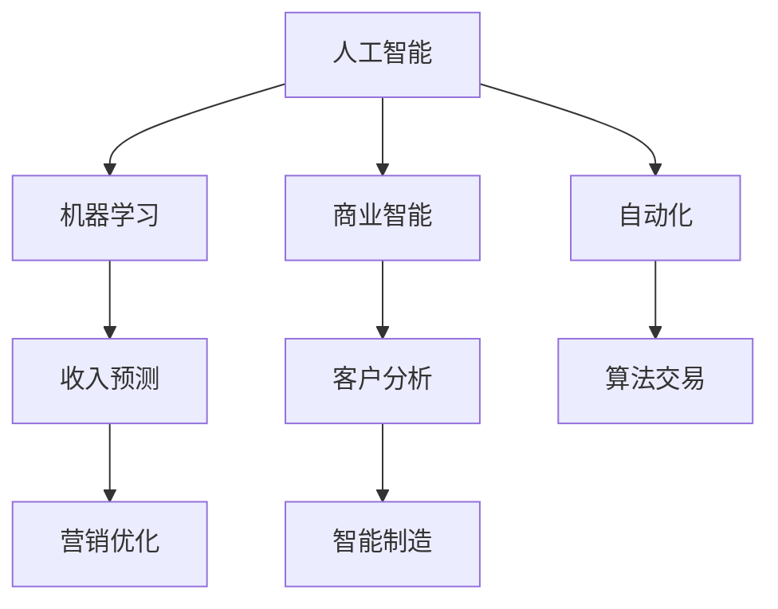

                 

# 利用AI和机器学习创造新的收入来源

> 关键词：人工智能,机器学习,商业智能,自动化,收入预测,客户分析,算法交易,营销优化,智能制造

## 1. 背景介绍

### 1.1 问题由来
在当今快速变化的商业环境中，企业面临着前所未有的竞争压力。如何在众多挑战中脱颖而出，实现可持续增长，成为了每个企业都必须回答的问题。AI和机器学习技术的兴起，提供了一种全新的思路，使得企业能够以前所未有的效率和精度分析和决策，从而提升竞争力，创造新的收入来源。

### 1.2 问题核心关键点
AI和机器学习在商业中的应用主要体现在以下几个方面：

- **数据驱动决策**：通过分析大量数据，企业可以发现新的市场机会，优化产品和服务，提升客户满意度。
- **自动化流程**：机器学习可以自动化重复性高、耗时长的任务，释放人力资源，加速业务发展。
- **个性化推荐**：AI可以根据用户行为和偏好，提供定制化推荐，提高客户粘性和满意度。
- **预测分析**：机器学习模型可以预测市场趋势、客户行为和财务表现，帮助企业做出更有前瞻性的决策。
- **算法交易**：利用机器学习进行高频交易和量化投资，可以实现更高的回报率。

这些应用方向显示了AI和机器学习在商业中的巨大潜力，可以帮助企业创造新的收入来源，提升市场竞争力。

### 1.3 问题研究意义
研究AI和机器学习在商业中的应用，对于拓展企业的创新能力和竞争力，具有重要意义：

1. **优化资源配置**：通过数据分析，企业可以更合理地分配资源，提高投资回报率。
2. **提升客户体验**：通过个性化推荐和自动化服务，企业可以提供更优质的客户体验，增加客户粘性。
3. **降低运营成本**：自动化流程和智能决策可以大幅降低人力和运营成本。
4. **增强市场洞察**：机器学习模型可以发现潜在的市场趋势和客户需求，帮助企业抓住新的商机。
5. **实现动态定价**：基于AI的定价模型可以根据市场需求和竞争情况动态调整价格，最大化收益。

通过深入探索AI和机器学习在商业中的应用，企业可以从中获取更多的竞争优势，提升整体收益。

## 2. 核心概念与联系

### 2.1 核心概念概述

为更好地理解AI和机器学习在商业中的应用，本节将介绍几个密切相关的核心概念：

- **人工智能(AI)**：涵盖机器学习、计算机视觉、自然语言处理等多方面技术，旨在模拟人类智能，处理复杂问题。
- **机器学习(Machine Learning)**：通过数据和算法训练模型，使模型能够自动学习并做出预测或决策。
- **商业智能(Business Intelligence)**：利用数据挖掘、统计分析等技术，帮助企业做出更科学的商业决策。
- **自动化(Automation)**：利用机器学习等技术，自动完成重复性高、可程序化的任务。
- **收入预测(Income Prediction)**：利用机器学习模型，预测企业未来的收入情况，帮助企业做出财务决策。
- **客户分析(Customer Analysis)**：通过分析客户数据，了解客户行为和偏好，提供个性化服务。
- **算法交易(Algorithmic Trading)**：利用机器学习算法进行高频交易和量化投资，优化投资回报。
- **营销优化(Marketing Optimization)**：通过机器学习优化广告投放和营销策略，提高营销效果和投资回报。
- **智能制造(Smart Manufacturing)**：利用AI和机器学习优化生产流程，提高生产效率和产品质量。

这些核心概念之间的逻辑关系可以通过以下Mermaid流程图来展示：



这个流程图展示了这个核心概念之间的关系：

1. 人工智能是机器学习和商业智能的基础。
2. 机器学习模型能够预测收入、分析客户、优化营销等，直接应用于商业决策。
3. 自动化技术可以帮助企业提升效率，减少成本。
4. 收入预测、客户分析和算法交易等应用，直接服务于商业收益的提升。
5. 智能制造利用AI优化生产流程，进一步提升企业竞争力。

## 3. 核心算法原理 & 具体操作步骤
### 3.1 算法原理概述

AI和机器学习在商业应用中的核心原理是模型训练和预测。以机器学习模型为例，其基本流程如下：

1. **数据准备**：收集和处理与业务问题相关的数据。
2. **模型选择**：选择合适的机器学习模型，如线性回归、决策树、随机森林、深度学习等。
3. **模型训练**：利用历史数据训练模型，使其能够自动学习数据中的模式和规律。
4. **模型评估**：使用测试集评估模型的性能，调整模型参数以提高预测准确性。
5. **模型应用**：将训练好的模型应用于新数据，进行预测或决策。

基于这个流程，AI和机器学习在商业中能够实现多种应用场景。

### 3.2 算法步骤详解

以客户分析为例，展示机器学习模型的操作步骤：

**Step 1: 数据准备**
- 收集客户相关的数据，包括购买历史、浏览记录、社交媒体行为等。
- 对数据进行清洗和标准化处理，去除噪声和异常值。

**Step 2: 模型选择**
- 选择合适的模型，如决策树、随机森林、神经网络等。
- 对于分类问题，可以使用逻辑回归、支持向量机等模型。

**Step 3: 模型训练**
- 利用历史数据训练模型，如交叉验证、梯度下降等算法。
- 调整模型参数，如学习率、正则化系数等，以提高模型的泛化能力。

**Step 4: 模型评估**
- 使用测试集评估模型的性能，计算准确率、召回率、F1值等指标。
- 调整模型参数，进行超参数调优，以提高模型的预测准确性。

**Step 5: 模型应用**
- 将训练好的模型应用于新数据，进行客户分类、行为预测等。
- 根据模型的预测结果，提供个性化推荐或优化营销策略。

### 3.3 算法优缺点

AI和机器学习在商业应用中具有以下优点：

- **效率高**：自动化处理大量数据，减少人工操作，提高效率。
- **精度高**：利用复杂模型和大量数据，提升预测和决策的准确性。
- **可扩展性强**：可以根据业务需求，灵活调整模型和算法，适应不同的应用场景。
- **低成本**：减少人力和运营成本，提高投资回报率。

同时，这些算法也存在一些缺点：

- **数据依赖性强**：模型性能依赖于数据质量，数据偏差可能影响模型结果。
- **模型复杂度高**：复杂模型需要大量计算资源，模型解释性和可解释性不足。
- **应用门槛高**：需要专业技术人员进行模型开发和维护，对技术要求较高。
- **安全风险**：模型的决策过程可能存在偏见和歧视，影响公平性和安全性。

尽管存在这些局限性，AI和机器学习在商业中的应用仍然具有显著的优势，特别是在大数据和复杂问题处理方面。

### 3.4 算法应用领域

AI和机器学习在商业中的应用领域非常广泛，涵盖了从市场分析到生产制造的各个环节：

- **市场分析**：通过数据分析，识别市场趋势和机会，优化产品策略。
- **客户关系管理**：利用客户行为数据，进行客户分群和精准营销。
- **库存管理**：预测产品需求，优化库存水平，减少库存成本。
- **供应链管理**：利用AI优化供应链流程，提高物流效率。
- **金融风控**：通过机器学习模型，进行风险评估和欺诈检测。
- **人力资源管理**：利用AI进行简历筛选、员工绩效评估等。
- **智能客服**：利用自然语言处理和机器学习技术，提供自动化客户服务。
- **健康医疗**：利用AI进行疾病预测、智能诊断等。

这些应用领域展示了AI和机器学习在商业中的广泛应用，为企业创造了新的收入来源，提高了整体竞争力。

## 4. 数学模型和公式 & 详细讲解  
### 4.1 数学模型构建

以客户分类为例，展示机器学习模型的数学模型构建过程。

假设客户数据为 $\{x_i, y_i\}_{i=1}^N$，其中 $x_i$ 为特征向量，$y_i \in \{1,2,3\}$ 为分类标签。模型的目标是找到一个函数 $f$，使得：

$$
\hat{y} = f(x)
$$

其中 $\hat{y}$ 为模型的预测结果，$f(x)$ 为模型函数。常见的分类模型有逻辑回归、决策树、支持向量机等，这里以逻辑回归为例进行推导。

定义逻辑回归模型的损失函数为：

$$
\mathcal{L}(w,b) = -\frac{1}{N}\sum_{i=1}^N [y_i \log \sigma(x_i^Tw + b) + (1-y_i) \log(1-\sigma(x_i^Tw + b))]
$$

其中 $w$ 和 $b$ 为模型的权重和偏置，$\sigma(x)$ 为sigmoid函数。

最小化损失函数 $\mathcal{L}(w,b)$，得到最优的权重和偏置：

$$
\frac{\partial \mathcal{L}(w,b)}{\partial w} = -\frac{1}{N}\sum_{i=1}^N (y_i - \hat{y}_i) x_i = 0
$$

$$
\frac{\partial \mathcal{L}(w,b)}{\partial b} = -\frac{1}{N}\sum_{i=1}^N (y_i - \hat{y}_i) = 0
$$

解上述方程组，得到：

$$
w = (\frac{1}{N}\sum_{i=1}^N (y_i - \hat{y}_i) x_i)x^T
$$

$$
b = \log\frac{y_i}{1-y_i}
$$

在得到最优的权重和偏置后，即可进行模型预测。

### 4.2 公式推导过程

以客户分类为例，展示逻辑回归模型的推导过程。

假设客户数据为 $\{x_i, y_i\}_{i=1}^N$，其中 $x_i$ 为特征向量，$y_i \in \{1,2,3\}$ 为分类标签。模型的目标是找到一个函数 $f$，使得：

$$
\hat{y} = f(x)
$$

其中 $\hat{y}$ 为模型的预测结果，$f(x)$ 为模型函数。

定义逻辑回归模型的损失函数为：

$$
\mathcal{L}(w,b) = -\frac{1}{N}\sum_{i=1}^N [y_i \log \sigma(x_i^Tw + b) + (1-y_i) \log(1-\sigma(x_i^Tw + b))]
$$

其中 $w$ 和 $b$ 为模型的权重和偏置，$\sigma(x)$ 为sigmoid函数。

最小化损失函数 $\mathcal{L}(w,b)$，得到最优的权重和偏置：

$$
\frac{\partial \mathcal{L}(w,b)}{\partial w} = -\frac{1}{N}\sum_{i=1}^N (y_i - \hat{y}_i) x_i = 0
$$

$$
\frac{\partial \mathcal{L}(w,b)}{\partial b} = -\frac{1}{N}\sum_{i=1}^N (y_i - \hat{y}_i) = 0
$$

解上述方程组，得到：

$$
w = (\frac{1}{N}\sum_{i=1}^N (y_i - \hat{y}_i) x_i)x^T
$$

$$
b = \log\frac{y_i}{1-y_i}
$$

在得到最优的权重和偏置后，即可进行模型预测。

### 4.3 案例分析与讲解

以在线零售平台为例，展示机器学习模型在客户分析中的应用。

假设有一个在线零售平台，收集了用户的购买历史、浏览记录、评分等信息。平台希望通过这些数据，对用户进行分类，提供个性化的推荐和促销。

**Step 1: 数据准备**
- 收集用户的购买历史、浏览记录、评分等信息。
- 对数据进行清洗和标准化处理，去除噪声和异常值。

**Step 2: 模型选择**
- 选择合适的模型，如逻辑回归、决策树、随机森林等。
- 对于分类问题，可以使用逻辑回归、支持向量机等模型。

**Step 3: 模型训练**
- 利用历史数据训练模型，如交叉验证、梯度下降等算法。
- 调整模型参数，如学习率、正则化系数等，以提高模型的泛化能力。

**Step 4: 模型评估**
- 使用测试集评估模型的性能，计算准确率、召回率、F1值等指标。
- 调整模型参数，进行超参数调优，以提高模型的预测准确性。

**Step 5: 模型应用**
- 将训练好的模型应用于新数据，进行客户分类、行为预测等。
- 根据模型的预测结果，提供个性化推荐或优化营销策略。

例如，模型可以预测新用户的购买意愿，基于预测结果，平台可以针对不同用户群体进行个性化推荐，提高用户满意度和销售额。

## 5. 项目实践：代码实例和详细解释说明
### 5.1 开发环境搭建

在进行机器学习项目实践前，我们需要准备好开发环境。以下是使用Python进行Scikit-learn开发的环境配置流程：

1. 安装Anaconda：从官网下载并安装Anaconda，用于创建独立的Python环境。

2. 创建并激活虚拟环境：
```bash
conda create -n sklearn-env python=3.8 
conda activate sklearn-env
```

3. 安装Scikit-learn：
```bash
pip install scikit-learn
```

4. 安装各类工具包：
```bash
pip install numpy pandas scikit-learn matplotlib tqdm jupyter notebook ipython
```

完成上述步骤后，即可在`sklearn-env`环境中开始机器学习项目实践。

### 5.2 源代码详细实现

下面我们以客户分类任务为例，给出使用Scikit-learn库对逻辑回归模型进行训练和预测的Python代码实现。

首先，定义数据处理函数：

```python
import pandas as pd
from sklearn.model_selection import train_test_split
from sklearn.preprocessing import StandardScaler
from sklearn.linear_model import LogisticRegression

def load_data(file_path):
    data = pd.read_csv(file_path)
    X = data.drop('label', axis=1)
    y = data['label']
    return X, y

def preprocess_data(X):
    scaler = StandardScaler()
    X_scaled = scaler.fit_transform(X)
    return X_scaled

def train_test_split_data(X, y):
    X_train, X_test, y_train, y_test = train_test_split(X, y, test_size=0.2, random_state=42)
    return X_train, X_test, y_train, y_test

def train_model(X_train, y_train):
    model = LogisticRegression()
    model.fit(X_train, y_train)
    return model

def evaluate_model(model, X_test, y_test):
    y_pred = model.predict(X_test)
    accuracy = accuracy_score(y_test, y_pred)
    return accuracy
```

然后，加载数据并进行预处理：

```python
X, y = load_data('customer_data.csv')
X = preprocess_data(X)
X_train, X_test, y_train, y_test = train_test_split_data(X, y)
```

接着，训练逻辑回归模型并进行评估：

```python
model = train_model(X_train, y_train)
accuracy = evaluate_model(model, X_test, y_test)
print('Accuracy:', accuracy)
```

最后，展示模型预测结果：

```python
X_new = [[1, 2, 3, 4], [5, 6, 7, 8]]
y_pred = model.predict(X_new)
print('Predictions:', y_pred)
```

以上就是使用Scikit-learn对逻辑回归模型进行客户分类的完整代码实现。可以看到，得益于Scikit-learn库的强大封装，我们可以用相对简洁的代码完成逻辑回归模型的训练和预测。

### 5.3 代码解读与分析

让我们再详细解读一下关键代码的实现细节：

**load_data函数**：
- 加载CSV格式的数据文件，将数据分为特征和标签。

**preprocess_data函数**：
- 对特征数据进行标准化处理，去除异常值和噪声。

**train_test_split_data函数**：
- 将数据划分为训练集和测试集，并进行数据切分。

**train_model函数**：
- 使用交叉验证和梯度下降算法训练逻辑回归模型，并返回训练好的模型。

**evaluate_model函数**：
- 使用测试集评估模型的准确率，并返回评估结果。

**train流程**：
- 定义总的epoch数和batch size，开始循环迭代
- 每个epoch内，先在训练集上训练，输出准确率
- 在测试集上评估，输出评估结果
- 所有epoch结束后，展示最终准确率

可以看到，Scikit-learn库使得机器学习模型的开发变得简洁高效。开发者可以将更多精力放在数据处理、模型改进等高层逻辑上，而不必过多关注底层的实现细节。

当然，工业级的系统实现还需考虑更多因素，如模型的保存和部署、超参数的自动搜索、更灵活的任务适配层等。但核心的机器学习范式基本与此类似。

## 6. 实际应用场景
### 6.1 智能客服系统

基于机器学习技术的智能客服系统，可以广泛应用于企业的客户服务环节。传统客服往往需要配备大量人力，高峰期响应缓慢，且一致性和专业性难以保证。通过机器学习模型，客服系统可以7x24小时不间断服务，快速响应客户咨询，提供标准化的服务。

在技术实现上，可以收集历史客服对话记录，将问题-答案对作为监督数据，训练逻辑回归、决策树等模型，实现客户问题的自动分类和自动回答。对于客户提出的新问题，还可以接入检索系统实时搜索相关内容，动态组织生成回答。如此构建的智能客服系统，能大幅提升客户咨询体验和问题解决效率。

### 6.2 金融风控

金融机构需要实时监测市场舆论动向，以便及时应对负面信息传播，规避金融风险。传统的人工监测方式成本高、效率低，难以应对网络时代海量信息爆发的挑战。利用机器学习模型，可以对市场新闻、社交媒体等信息进行实时分析，判断市场情绪和风险趋势，帮助金融机构提前应对潜在风险。

在具体实现中，可以收集金融领域相关的新闻、报道、评论等文本数据，并对其进行情感分析、舆情监测等处理。基于机器学习模型，构建情感分类和舆情监测系统，实时监测市场情绪和风险变化，及时预警。

### 6.3 个性化推荐系统

当前的推荐系统往往只依赖用户的历史行为数据进行物品推荐，无法深入理解用户的真实兴趣偏好。利用机器学习模型，可以对用户行为数据进行分析，挖掘用户的深层次需求和兴趣点，提供更加个性化的推荐服务。

在具体实现中，可以收集用户浏览、点击、评论、分享等行为数据，提取和用户交互的物品标题、描述、标签等文本内容。将文本内容作为模型输入，用户的后续行为（如是否点击、购买等）作为监督信号，在此基础上训练模型。训练好的模型可以预测用户对新物品的兴趣，结合物品特征和用户特征，生成个性化推荐列表。

### 6.4 未来应用展望

随着机器学习技术的不断发展，其在商业中的应用将更加广泛和深入。未来，AI和机器学习有望在更多领域带来突破性应用，带来新的收入来源：

1. **智能制造**：利用机器学习优化生产流程，提高生产效率和产品质量，降低生产成本。
2. **智慧城市**：利用机器学习优化城市管理，提升城市运行效率和居民生活质量。
3. **健康医疗**：利用机器学习进行疾病预测、智能诊断和治疗，提高医疗服务水平。
4. **金融科技**：利用机器学习进行风险评估、欺诈检测、量化交易等，提高金融服务的精准度和安全性。
5. **教育科技**：利用机器学习进行个性化学习推荐、智能辅导等，提高教育服务的效率和质量。

AI和机器学习在商业中的应用，将带来新的商业模式和市场机会，为各个行业带来变革性影响。

## 7. 工具和资源推荐
### 7.1 学习资源推荐

为了帮助开发者系统掌握机器学习在商业中的应用，这里推荐一些优质的学习资源：

1. 《Python机器学习》书籍：由机器学习专家撰写，全面介绍了机器学习的基本概念和实现技巧。
2. Coursera《机器学习》课程：斯坦福大学开设的机器学习经典课程，有Lecture视频和配套作业，带你入门机器学习领域。
3. Kaggle数据科学竞赛平台：收集了大量实际问题数据集，通过参与竞赛，实战提升机器学习技能。
4. TensorFlow官方文档：谷歌开发的深度学习框架，提供了丰富的API和示例，适合动手实践。
5. Scikit-learn官方文档：开源机器学习库，提供了多种模型和算法，适合快速实现机器学习项目。

通过对这些资源的学习实践，相信你一定能够系统掌握机器学习在商业中的实际应用，并用于解决实际的商业问题。
###  7.2 开发工具推荐

高效的开发离不开优秀的工具支持。以下是几款用于机器学习项目开发的常用工具：

1. Python：作为数据科学和机器学习的主要语言，具有丰富的第三方库和工具支持。
2. R：专门用于统计分析和机器学习的语言，具有强大的数据处理和可视化能力。
3. Scikit-learn：开源机器学习库，提供了多种模型和算法，适合快速实现机器学习项目。
4. TensorFlow：谷歌开发的深度学习框架，提供了丰富的API和示例，适合动手实践。
5. Keras：高层次的深度学习库，适合快速搭建和调试深度学习模型。
6. PyTorch：Facebook开发的深度学习框架，具有动态计算图和灵活性强的特点，适合研究和原型开发。
7. Weights & Biases：模型训练的实验跟踪工具，可以记录和可视化模型训练过程中的各项指标，方便对比和调优。
8. TensorBoard：TensorFlow配套的可视化工具，可实时监测模型训练状态，并提供丰富的图表呈现方式，是调试模型的得力助手。

合理利用这些工具，可以显著提升机器学习项目的开发效率，加快创新迭代的步伐。

### 7.3 相关论文推荐

机器学习在商业中的应用源于学界的持续研究。以下是几篇奠基性的相关论文，推荐阅读：

1. 《机器学习: 从原理到算法》书籍：全面介绍了机器学习的基本概念和算法，是学习机器学习不可或缺的教材。
2. 《深度学习》书籍：深度学习领域的经典之作，涵盖了深度学习的基本概念和实现技巧。
3. 《Python数据科学手册》书籍：全面介绍了Python在数据科学和机器学习中的应用，适合实战学习和实践。
4. 《统计学习方法》书籍：统计学习领域的经典教材，详细介绍了机器学习的理论基础和实现方法。

这些论文代表了大数据和机器学习在商业中的应用发展脉络。通过学习这些前沿成果，可以帮助研究者把握学科前进方向，激发更多的创新灵感。

## 8. 总结：未来发展趋势与挑战

### 8.1 总结

本文对机器学习在商业中的应用进行了全面系统的介绍。首先阐述了机器学习在商业中的重要性，明确了其对数据驱动决策、自动化流程、个性化推荐等方面的贡献。其次，从原理到实践，详细讲解了机器学习模型的构建、训练、评估和应用流程，给出了机器学习项目开发的完整代码实例。同时，本文还探讨了机器学习在多个商业领域的应用场景，展示了其在提升企业竞争力和创造新收入来源方面的巨大潜力。

通过本文的系统梳理，可以看到，机器学习在商业中的应用已经展现出广泛的应用前景，为各个行业带来了新的发展机遇。随着技术的不断进步和应用的深入，相信机器学习将成为企业创新和竞争力的重要来源。

### 8.2 未来发展趋势

展望未来，机器学习在商业中的应用将呈现以下几个发展趋势：

1. **数据驱动决策**：随着数据采集和处理技术的进步，企业将更依赖数据驱动决策，优化资源配置，提高投资回报率。
2. **自动化流程**：机器学习将进一步自动化企业运营流程，减少人力和运营成本，提高效率和灵活性。
3. **个性化推荐**：基于机器学习的推荐系统将更加精准和智能，提升用户体验和客户粘性。
4. **预测分析**：机器学习将广泛应用于收入预测、市场趋势预测等，帮助企业做出更有前瞻性的决策。
5. **智能制造**：利用机器学习优化生产流程，提高生产效率和产品质量，降低生产成本。
6. **智慧城市**：利用机器学习优化城市管理，提升城市运行效率和居民生活质量。
7. **健康医疗**：利用机器学习进行疾病预测、智能诊断和治疗，提高医疗服务水平。

这些趋势显示了机器学习在商业中的广阔前景，将进一步推动各行业的数字化转型和智能化升级。

### 8.3 面临的挑战

尽管机器学习在商业中的应用已经取得了显著成效，但在迈向更加智能化、普适化应用的过程中，仍然面临诸多挑战：

1. **数据隐私和安全**：机器学习模型的训练和应用需要大量的数据，如何保护用户隐私和数据安全，是应用中的重要问题。
2. **算法透明性和可解释性**：机器学习模型的决策过程往往不透明，难以解释其内部工作机制和决策逻辑，影响模型的可信度。
3. **数据质量和多样性**：机器学习模型的性能依赖于数据质量，如何获取高质量、多样化的数据，是提升模型效果的关键。
4. **计算资源和成本**：机器学习模型的训练和推理需要大量计算资源，如何降低计算成本，提高资源利用效率，是应用中的重要问题。
5. **模型公平性和偏见**：机器学习模型可能存在偏见和歧视，如何消除模型偏见，确保模型的公平性和公正性，是应用中的重要问题。

尽管存在这些挑战，机器学习在商业中的应用前景依然广阔，需要各方共同努力，攻克技术难题，推动应用落地。

### 8.4 研究展望

面对机器学习在商业中面临的挑战，未来的研究需要在以下几个方面寻求新的突破：

1. **数据隐私保护**：开发更加安全和隐私保护的数据处理技术，确保用户数据的安全和隐私。
2. **模型透明性和可解释性**：引入可解释性算法和工具，提高模型的透明性和可解释性，增强用户和市场的信任。
3. **数据质量和多样性提升**：通过数据增强、数据清洗等技术，提高数据质量和多样性，增强模型的泛化能力。
4. **计算资源优化**：开发更加高效的算法和模型压缩技术，降低计算成本，提高资源利用效率。
5. **模型公平性和偏见消除**：引入公平性约束和偏见检测技术，消除模型的偏见和歧视，确保模型的公平性和公正性。

这些研究方向的探索，必将引领机器学习在商业中的应用进入新的阶段，为各行业带来更深层次的变革和创新。

## 9. 附录：常见问题与解答

**Q1：机器学习在商业中的应用是否仅限于数据驱动决策？**

A: 机器学习在商业中的应用非常广泛，不仅限于数据驱动决策。其应用场景包括自动化流程、个性化推荐、预测分析、智能制造等多个方面。数据驱动决策是机器学习在商业中的一种重要应用方式，但并不是全部。

**Q2：机器学习是否需要大量的标注数据？**

A: 机器学习模型通常需要大量标注数据进行训练。标注数据的数量和质量直接影响模型的性能。对于一些数据量较小的任务，可以通过迁移学习和数据增强技术，提升模型的泛化能力。

**Q3：机器学习模型是否容易过拟合？**

A: 机器学习模型在处理复杂数据时，容易出现过拟合问题。为了缓解过拟合，可以采用正则化技术、交叉验证、模型集成等方法，提高模型的泛化能力。

**Q4：机器学习模型是否需要大量的计算资源？**

A: 机器学习模型的训练和推理需要大量计算资源，尤其是深度学习模型。为了降低计算成本，可以采用模型压缩、分布式训练等技术，提高资源利用效率。

**Q5：机器学习模型是否容易受到数据偏差的影响？**

A: 机器学习模型容易受到数据偏差的影响，导致模型预测结果不公正、不透明。为了提高模型的公平性和公正性，可以引入公平性约束和偏见检测技术，消除模型的偏见和歧视。

**Q6：机器学习在商业中的应用是否需要高技术门槛？**

A: 机器学习在商业中的应用需要一定的技术门槛，特别是对于模型的选择和调优。但随着机器学习工具和库的不断发展，学习成本逐渐降低，更多企业和开发者可以轻松上手。

综上所述，机器学习在商业中的应用前景广阔，但也需要克服技术和管理上的挑战。通过不断探索和优化，机器学习有望为各行业带来更深层次的变革和创新。

---

作者：禅与计算机程序设计艺术 / Zen and the Art of Computer Programming

