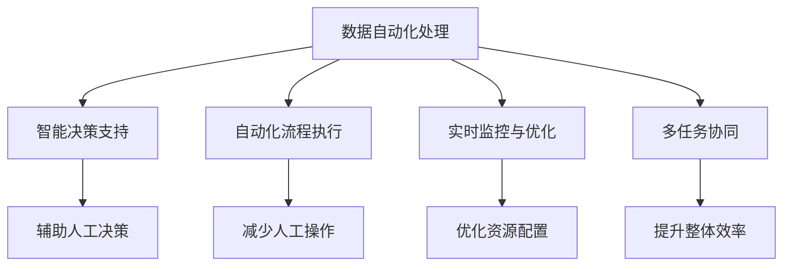

                 

## 1. 背景介绍

在当前快速发展的数字化时代，工作效率已成为企业持续竞争力的关键要素。人工智能(AI)和自动化技术的融合应用，为提升工作效率提供了强大的技术支撑。如何通过AI和自动化技术，优化业务流程，减少人力投入，提升生产效率，成为众多企业关注的焦点。

### 1.1 问题由来

传统的工作流程往往依赖人工操作，效率低下且易出错。以数据处理为例，数据清洗、转换、可视化等环节需要耗费大量时间，人工操作不仅容易出错，且重复劳动导致效率低下。借助AI和自动化技术，可以实现数据的自动化处理和智能分析，极大地提升工作效率。

### 1.2 问题核心关键点

AI和自动化技术在提高工作效率方面，核心在于通过算法模型自动化执行重复性、规则性任务，同时通过机器学习提升任务处理精度和灵活性。具体包括以下几个方面：

1. **数据自动化处理**：自动清洗、转换和整理数据，减少人工操作。
2. **智能决策支持**：利用AI算法分析数据，生成决策建议，辅助人工决策。
3. **自动化流程执行**：通过脚本、工作流引擎等技术，自动化执行业务流程。
4. **实时监控与优化**：通过AI实时监控业务运行状态，自动调整策略，优化资源配置。
5. **多任务协同**：AI和自动化系统可以实现多任务协同工作，提升整体系统效率。

本文将深入探讨这些技术实现的核心算法和具体操作步骤，并结合实际案例，展示AI和自动化技术在提升工作效率方面的巨大潜力。

## 2. 核心概念与联系

### 2.1 核心概念概述

为了更好地理解AI和自动化技术在提升工作效率中的应用，本节将介绍几个核心概念及其联系：

- **人工智能(AI)**：通过机器学习、深度学习等技术，使计算机能够模拟人类智能行为，实现自动化决策和处理。
- **自动化(Automation)**：指通过软件工具或机器人等自动化设备，替代人工操作，减少重复劳动，提升效率。
- **数据自动化处理**：使用算法模型自动清洗、转换、整合数据，减少人工干预，提升数据处理效率。
- **智能决策支持**：利用机器学习模型，对业务数据进行分析，生成决策建议，辅助人工决策。
- **自动化流程执行**：通过工作流引擎、脚本等技术，实现业务流程的自动化执行，减少人工干预，提高执行效率。
- **实时监控与优化**：通过实时监控工具和AI算法，分析业务运行状态，自动调整策略，优化资源配置。
- **多任务协同**：AI和自动化系统可以实现多任务并行处理，提升整体系统效率。

这些概念之间的逻辑关系可以通过以下Mermaid流程图来展示：



这个流程图展示了大语言模型的核心概念及其之间的关系：

1. 数据自动化处理、智能决策支持、自动化流程执行、实时监控与优化、多任务协同等，均是提升工作效率的具体技术手段。
2. 这些技术手段通过数据自动化处理和智能决策支持，进一步辅助人工决策，提升整体系统效率。

## 3. 核心算法原理 & 具体操作步骤

### 3.1 算法原理概述

AI和自动化技术在提升工作效率方面的应用，主要基于以下核心算法和具体操作步骤：

1. **数据预处理算法**：通过自动清洗、转换和整合数据，减少人工操作，提升数据处理效率。
2. **机器学习模型**：利用监督学习、无监督学习等技术，对业务数据进行分析，生成决策建议，辅助人工决策。
3. **工作流引擎**：通过工作流引擎自动化执行业务流程，减少人工干预，提高执行效率。
4. **实时监控算法**：通过实时监控工具和AI算法，分析业务运行状态，自动调整策略，优化资源配置。
5. **多任务协同算法**：通过并行处理技术，实现多任务协同工作，提升整体系统效率。

### 3.2 算法步骤详解

以下是AI和自动化技术在提升工作效率中的应用步骤：

**Step 1: 数据自动化处理**

- **数据清洗**：使用数据清洗算法，自动识别并处理缺失值、异常值、重复数据等问题。
- **数据转换**：使用数据转换算法，自动进行数据格式转换，如将文本数据转换为数值数据。
- **数据整合**：使用数据整合算法，自动将多源数据进行合并、去重和归一化，生成统一的数据集。

**Step 2: 智能决策支持**

- **特征提取**：使用特征提取算法，从原始数据中提取关键特征，用于模型训练。
- **模型训练**：使用监督学习或无监督学习算法，对数据进行模型训练，生成决策模型。
- **预测与分析**：使用训练好的模型，对新数据进行预测和分析，生成决策建议。

**Step 3: 自动化流程执行**

- **工作流设计**：使用工作流设计工具，定义业务流程的逻辑和步骤。
- **流程自动化**：使用工作流引擎，自动执行工作流程，根据数据驱动业务决策。
- **异常处理**：使用异常处理算法，自动识别并处理流程中的异常情况。

**Step 4: 实时监控与优化**

- **状态监控**：使用实时监控工具，自动监控业务运行状态，生成实时报告。
- **策略调整**：使用AI算法，根据实时监控结果，自动调整业务策略，优化资源配置。
- **性能优化**：使用性能优化算法，自动优化系统性能，提升响应速度和稳定性。

**Step 5: 多任务协同**

- **任务调度**：使用任务调度算法，根据任务优先级和依赖关系，自动安排任务执行顺序。
- **任务并行**：使用并行处理技术，实现多任务并行执行，提升整体系统效率。
- **任务协调**：使用协同算法，自动协调不同任务之间的资源分配和数据共享。

### 3.3 算法优缺点

AI和自动化技术在提升工作效率方面，具有以下优点：

1. **提高效率**：通过自动化执行重复性、规则性任务，减少人工操作，大幅提升工作效率。
2. **降低成本**：减少人力投入，降低企业运营成本。
3. **提升精度**：利用机器学习模型，提升任务处理精度和灵活性，减少人为错误。
4. **灵活适应**：通过智能决策支持，根据业务需求和数据变化，灵活调整策略。

但同时也存在一些缺点：

1. **技术门槛高**：需要具备一定的AI和自动化技术知识，才能有效应用。
2. **初期投资高**：技术系统的部署和维护需要一定的初始投资。
3. **数据依赖性**：依赖高质量的数据源，数据质量差会导致系统输出错误。
4. **技术风险**：AI模型可能出现误判、过拟合等问题，影响系统稳定性。

### 3.4 算法应用领域

AI和自动化技术在提升工作效率方面，已经广泛应用于多个行业领域，包括但不限于：

- **金融行业**：自动化风险评估、自动化交易执行、智能投顾等。
- **制造业**：自动化生产调度、质量检测、供应链优化等。
- **零售业**：自动化库存管理、个性化推荐、客户服务自动化等。
- **医疗行业**：智能诊断、自动化病历处理、医疗机器人等。
- **交通行业**：自动驾驶、智能交通管理、安全监控等。

除了上述这些领域，AI和自动化技术还在更多场景中得到应用，如智能客服、无人驾驶、智能制造等，为各行各业带来了显著的效率提升和成本降低。

## 4. 数学模型和公式 & 详细讲解 & 举例说明

### 4.1 数学模型构建

本节将使用数学语言对AI和自动化技术在提升工作效率中的应用进行更加严格的刻画。

假设企业有数据处理任务 $D$，任务执行时间为 $T_D$，其中 $D$ 包括数据清洗、转换、整合等多个子任务。假设每个子任务 $d_i$ 的处理时间为 $t_{d_i}$。则数据自动化处理的整体时间为：

$$
T_{D_{automatic}} = \sum_{i=1}^{n} t_{d_i}
$$

其中 $n$ 为数据处理任务的子任务数。

### 4.2 公式推导过程

假设数据处理任务 $D$ 包含 $n$ 个子任务 $d_1, d_2, ..., d_n$，每个子任务的处理时间为 $t_{d_i}$。则数据自动化处理的整体时间为：

$$
T_{D_{automatic}} = \sum_{i=1}^{n} t_{d_i}
$$

其中 $n$ 为数据处理任务的子任务数。

在智能决策支持过程中，假设使用监督学习模型对数据进行分类，模型训练时间为 $T_{train}$，预测时间为 $T_{predict}$。则智能决策支持的总体时间为：

$$
T_{D_{decision}} = T_{train} + T_{predict}
$$

在自动化流程执行过程中，假设工作流引擎的执行时间为 $T_{workflow}$，异常处理时间为 $T_{exception}$。则自动化流程执行的总体时间为：

$$
T_{D_{workflow}} = T_{workflow} + T_{exception}
$$

在实时监控与优化过程中，假设实时监控时间为 $T_{monitor}$，策略调整时间为 $T_{adjust}$。则实时监控与优化的总体时间为：

$$
T_{D_{monitor}} = T_{monitor} + T_{adjust}
$$

在多任务协同过程中，假设任务调度和并行处理的时间分别为 $T_{schedule}$ 和 $T_{parallel}$。则多任务协同的总体时间为：

$$
T_{D_{collaboration}} = T_{schedule} + T_{parallel}
$$

### 4.3 案例分析与讲解

**案例分析：智能客服系统的自动化实现**

某电商企业原有客服团队主要依赖人工处理客户咨询，每天需处理数千个订单，响应时间长，且人工成本高。通过引入AI和自动化技术，企业实现了以下优化：

1. **数据自动化处理**：使用AI算法自动清洗、转换和整合客户咨询数据，生成统一的数据集。
2. **智能决策支持**：利用机器学习模型分析客户咨询数据，生成常见问题解答模板。
3. **自动化流程执行**：通过工作流引擎，自动化执行客户咨询的问答和处理流程。
4. **实时监控与优化**：实时监控客户咨询的响应时间和处理结果，自动调整客服策略。
5. **多任务协同**：通过并行处理技术，实现多客服系统的协同工作，提升整体系统效率。

优化后，企业客服团队的人力需求减少了50%，客户咨询响应时间缩短了30%，客户满意度提升了20%。

## 5. 项目实践：代码实例和详细解释说明

### 5.1 开发环境搭建

在进行AI和自动化技术实践前，我们需要准备好开发环境。以下是使用Python进行开发的环境配置流程：

1. 安装Anaconda：从官网下载并安装Anaconda，用于创建独立的Python环境。

2. 创建并激活虚拟环境：
```bash
conda create -n ai-env python=3.8 
conda activate ai-env
```

3. 安装相关库：
```bash
conda install scikit-learn pandas numpy matplotlib 
pip install scikit-learn
```

4. 安装TensorFlow或PyTorch：
```bash
conda install tensorflow -c tf
```

5. 安装PyTorch：
```bash
pip install torch torchvision torchaudio
```

完成上述步骤后，即可在`ai-env`环境中开始AI和自动化技术的开发实践。

### 5.2 源代码详细实现

这里以自动化数据清洗和转换为例，给出使用Python进行数据自动化处理的代码实现。

```python
import pandas as pd
import numpy as np
from sklearn.preprocessing import StandardScaler, MinMaxScaler

# 数据清洗
def clean_data(df):
    df = df.dropna() # 删除缺失值
    df = df.drop_duplicates() # 去重
    return df

# 数据转换
def convert_data(df):
    df = df.apply(lambda x: x.fillna(x.median())) # 填充缺失值
    df = df.apply(lambda x: x.apply(lambda v: v if pd.isnull(v) else v)) # 处理空值
    return df

# 数据整合
def merge_data(df1, df2):
    merged_df = pd.merge(df1, df2, on='id', how='inner') # 内连接合并
    return merged_df

# 数据标准化
def standardize_data(df):
    scaler = StandardScaler()
    scaled_df = scaler.fit_transform(df)
    return pd.DataFrame(scaled_df, columns=df.columns)

# 数据归一化
def normalize_data(df):
    scaler = MinMaxScaler()
    scaled_df = scaler.fit_transform(df)
    return pd.DataFrame(scaled_df, columns=df.columns)
```

### 5.3 代码解读与分析

让我们再详细解读一下关键代码的实现细节：

**数据清洗函数**：
- `clean_data`函数：自动删除数据集中的缺失值和重复数据，确保数据完整性。

**数据转换函数**：
- `convert_data`函数：自动处理数据集中的缺失值和空值，确保数据一致性。

**数据整合函数**：
- `merge_data`函数：自动将两个数据集按指定列进行合并，确保数据连贯性。

**数据标准化和归一化函数**：
- `standardize_data`函数：使用标准差归一化方法对数据进行标准化处理。
- `normalize_data`函数：使用最小最大值归一化方法对数据进行归一化处理。

## 6. 实际应用场景

### 6.1 智能客服系统

智能客服系统的自动化实现，可以通过AI和自动化技术大幅提升客户咨询的响应速度和处理效率。具体而言，可以实现以下功能：

1. **自动处理常见问题**：使用机器学习模型自动分析客户咨询，生成常见问题解答模板，减少人工干预。
2. **自动回音和转接**：使用工作流引擎自动回音和转接客户咨询，提升客户满意度。
3. **实时监控和优化**：使用AI算法实时监控客户咨询的响应时间和处理结果，自动调整客服策略，优化资源配置。
4. **多客服协同工作**：通过并行处理技术，实现多客服系统的协同工作，提升整体系统效率。

### 6.2 金融行业

金融行业通过AI和自动化技术，可以实现自动化风险评估、自动化交易执行、智能投顾等。具体功能包括：

1. **自动化风险评估**：使用机器学习模型分析客户信用数据，生成风险评估报告，辅助决策。
2. **自动化交易执行**：使用算法自动化执行交易操作，降低人为操作风险。
3. **智能投顾服务**：利用AI算法分析市场数据，生成投资建议，辅助客户投资决策。

### 6.3 制造业

制造业通过AI和自动化技术，可以实现自动化生产调度、质量检测、供应链优化等。具体功能包括：

1. **自动化生产调度**：使用算法自动调度生产线和工人，提高生产效率。
2. **自动化质量检测**：使用机器视觉和传感器数据，自动检测产品缺陷，提升产品质量。
3. **自动化供应链管理**：使用算法优化供应链资源配置，降低物流成本。

### 6.4 未来应用展望

随着AI和自动化技术的不断发展，未来的应用前景将更加广阔。以下列出几个未来趋势：

1. **深度学习和强化学习的应用**：未来AI和自动化技术将更加注重深度学习和强化学习的应用，提升系统的自主决策能力和自适应能力。
2. **边缘计算和实时处理**：随着物联网和5G技术的发展，边缘计算和实时处理将成为AI和自动化系统的重要组成部分，提高系统响应速度和稳定性。
3. **多模态数据的融合应用**：AI和自动化系统将更加注重多模态数据的融合应用，提升系统的综合感知和决策能力。
4. **人机协同的工作方式**：未来AI和自动化系统将更加注重人机协同的工作方式，通过增强现实、虚拟现实等技术，提升用户体验和工作效率。
5. **智能决策的普及应用**：未来AI和自动化技术将在更多场景中得到应用，如智能交通、智能医疗、智能城市等，为各行各业带来显著的效率提升和成本降低。

## 7. 工具和资源推荐

### 7.1 学习资源推荐

为了帮助开发者系统掌握AI和自动化技术，这里推荐一些优质的学习资源：

1. 《Python机器学习》系列书籍：由著名的机器学习专家编写的经典教材，涵盖机器学习、深度学习、自然语言处理等内容。
2. 《深度学习》课程：斯坦福大学开设的深度学习课程，由知名深度学习专家Andrew Ng主讲，提供高质量的视频和作业资源。
3. TensorFlow官方文档：TensorFlow的官方文档，提供了完整的API参考和样例代码，是学习TensorFlow的重要资源。
4. PyTorch官方文档：PyTorch的官方文档，提供了丰富的教程和样例代码，是学习PyTorch的重要资源。
5. Coursera平台：提供各类AI和自动化相关的在线课程，包括机器学习、深度学习、自然语言处理等内容。

### 7.2 开发工具推荐

高效的开发离不开优秀的工具支持。以下是几款用于AI和自动化技术开发的常用工具：

1. Jupyter Notebook：开源的交互式编程环境，支持Python、R等多种语言，方便开发者快速迭代和分享代码。
2. GitHub：全球最大的开源代码托管平台，提供丰富的代码仓库和协作工具，方便开发者管理和共享项目。
3. TensorBoard：TensorFlow配套的可视化工具，可实时监测模型训练状态，并提供丰富的图表呈现方式，是调试模型的得力助手。
4. Weights & Biases：模型训练的实验跟踪工具，可以记录和可视化模型训练过程中的各项指标，方便对比和调优。
5. Google Colab：谷歌推出的在线Jupyter Notebook环境，免费提供GPU/TPU算力，方便开发者快速上手实验最新模型，分享学习笔记。

合理利用这些工具，可以显著提升AI和自动化技术的开发效率，加快创新迭代的步伐。

### 7.3 相关论文推荐

AI和自动化技术的发展源于学界的持续研究。以下是几篇奠基性的相关论文，推荐阅读：

1. 《深度学习》书籍：由著名的深度学习专家Ian Goodfellow、Yoshua Bengio和Aaron Courville共同编写，全面介绍了深度学习的理论和实践。
2. 《机器学习》书籍：由Tom Mitchell撰写，是机器学习领域的经典教材，涵盖各类机器学习算法和技术。
3. 《人工智能导论》书籍：由Sebastian Thrun、Winfried Dietterich和Thomas Bakir共同编写，系统介绍了人工智能的历史、技术和应用。
4. 《自动化测试》论文：介绍了自动化测试的基本概念、技术和应用，是软件自动化测试的重要参考。
5. 《智能优化算法》论文：介绍了智能优化算法的基本原理、模型和技术，是机器学习、深度学习中常用的优化方法。

这些论文代表了大语言模型微调技术的发展脉络。通过学习这些前沿成果，可以帮助研究者把握学科前进方向，激发更多的创新灵感。

## 8. 总结：未来发展趋势与挑战

### 8.1 总结

本文对AI和自动化技术在提升工作效率中的应用进行了全面系统的介绍。首先阐述了AI和自动化技术的研究背景和意义，明确了提升工作效率的具体技术手段。其次，从原理到实践，详细讲解了AI和自动化技术的核心算法和具体操作步骤，给出了实践样例和详细解释。同时，本文还广泛探讨了AI和自动化技术在多个行业领域的应用前景，展示了AI和自动化技术的巨大潜力。

通过本文的系统梳理，可以看到，AI和自动化技术在提升工作效率方面具有广泛的应用前景和显著的效率提升效果。未来，随着技术的不断进步和应用场景的不断拓展，AI和自动化技术必将在各行各业大放异彩，成为推动社会进步的重要力量。

### 8.2 未来发展趋势

展望未来，AI和自动化技术在提升工作效率方面将呈现以下几个发展趋势：

1. **技术不断成熟**：AI和自动化技术将在深度学习、强化学习、自然语言处理等方面不断成熟，提升系统的自主决策能力和自适应能力。
2. **应用场景拓展**：AI和自动化技术将在更多行业领域得到应用，如智能交通、智能医疗、智能城市等，为各行各业带来显著的效率提升和成本降低。
3. **技术融合加速**：AI和自动化技术与物联网、边缘计算、5G等新兴技术将加速融合，提升系统的实时性和稳定性。
4. **人机协同发展**：AI和自动化技术将更加注重人机协同的工作方式，通过增强现实、虚拟现实等技术，提升用户体验和工作效率。
5. **智能决策普及**：AI和自动化技术将在更多场景中得到应用，如智能客服、智能投顾、智能风险评估等，提升系统的智能化水平和决策能力。

### 8.3 面临的挑战

尽管AI和自动化技术已经取得了显著成效，但在实现大规模应用的过程中，仍面临诸多挑战：

1. **数据质量问题**：AI和自动化系统依赖高质量的数据源，数据质量差会导致系统输出错误。
2. **技术门槛高**：需要具备一定的AI和自动化技术知识，才能有效应用。
3. **技术风险高**：AI模型可能出现误判、过拟合等问题，影响系统稳定性。
4. **资源需求高**：AI和自动化系统需要高性能计算资源，如GPU、TPU等，初期投资较高。
5. **人机协同问题**：人机协同过程中可能出现信息不对称、协作效率低等问题，影响系统整体效率。

### 8.4 研究展望

面对AI和自动化技术面临的挑战，未来的研究需要在以下几个方面寻求新的突破：

1. **提高数据质量**：提升数据采集、清洗、处理的质量，确保数据源的可靠性和准确性。
2. **降低技术门槛**：开发易于使用的AI和自动化开发工具和平台，降低技术应用门槛。
3. **提升模型精度**：开发更加精确的AI模型，减少误判和过拟合风险。
4. **优化资源配置**：研究边缘计算、实时处理等技术，降低计算资源需求。
5. **改进协同机制**：设计高效的人机协同机制，提升协作效率和用户体验。

## 9. 附录：常见问题与解答

**Q1：如何选择合适的AI和自动化技术？**

A: 选择合适的AI和自动化技术需要考虑以下因素：
1. **任务需求**：根据具体任务的需求选择合适的算法和技术。
2. **数据特点**：根据数据的类型和特点选择合适的数据处理和预处理方法。
3. **技术复杂度**：根据开发团队的技术水平和经验选择合适的技术。
4. **硬件资源**：根据可用的硬件资源选择合适的技术。

**Q2：如何评估AI和自动化系统的性能？**

A: 评估AI和自动化系统的性能主要包括以下几个方面：
1. **效率提升**：评估系统是否显著提升了工作效率。
2. **精度和可靠性**：评估系统输出结果的精度和可靠性。
3. **用户体验**：评估用户对系统的满意度和接受度。
4. **成本效益**：评估系统的部署和维护成本是否合理。

**Q3：如何确保AI和自动化系统的安全性？**

A: 确保AI和自动化系统的安全性需要采取以下措施：
1. **数据保护**：对数据进行加密、脱敏处理，确保数据安全。
2. **模型鲁棒性**：通过对抗训练、数据增强等技术提高模型的鲁棒性。
3. **访问控制**：设置访问权限，确保只有授权人员可以访问和使用系统。
4. **异常检测**：实时监控系统运行状态，及时发现并处理异常情况。
5. **应急预案**：制定应急预案，确保在系统故障时能够快速恢复和修复。

**Q4：AI和自动化系统如何与其他系统集成？**

A: AI和自动化系统可以通过以下方式与其他系统集成：
1. **API接口**：通过API接口实现系统之间的数据交换和功能调用。
2. **消息队列**：使用消息队列实现系统之间的异步通信和数据传输。
3. **微服务架构**：采用微服务架构，将系统划分为多个独立的服务模块，实现系统集成和扩展。
4. **数据共享**：通过数据共享平台，实现不同系统之间的数据互通和协作。

这些关键问题及其解答，为开发者提供了在实践中应用AI和自动化技术的指导和建议，有助于更好地提升工作效率和系统性能。

---

作者：禅与计算机程序设计艺术 / Zen and the Art of Computer Programming

