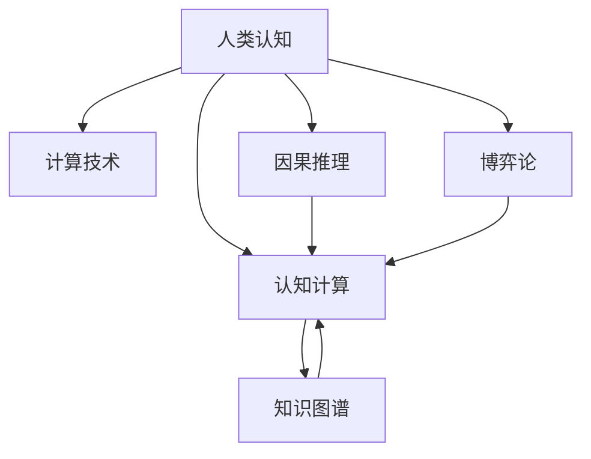

                 

## 1. 背景介绍

### 1.1 问题由来
在当今信息爆炸的时代，面对日新月异的科技变革和社会挑战，人类认知能力面临着前所未有的考验。无论是从日常生活中的细节问题到科学探索中的重大难题，解决这些复杂问题已经成为全人类共同的目标。在技术手段迅速发展的今天，如何充分利用已有的人类认知资源，构建更加智能化、高效化的解决方案，成为了信息时代的迫切需求。

### 1.2 问题核心关键点
本文聚焦于如何利用人类认知来解决复杂问题。通过对核心概念的深入剖析，我们将探讨人类认知与计算的结合方式，以及如何通过算法和技术的进步，来扩展人类认知的边界，提升解决问题的能力。

### 1.3 问题研究意义
研究如何利用人类认知解决复杂问题，对于提升人类解决实际问题的效率和效果，推动科学技术的进步，具有重要意义：

1. **提高问题解决的效率**。利用人类认知的丰富经验和知识，结合计算技术，可以快速找到问题的最优解，节省时间成本。
2. **提升问题解决的精度**。计算技术可以处理海量数据和复杂模型，结合人类认知的判断和经验，提升问题的求解精度。
3. **推动科学技术的进步**。通过认知与计算的结合，可以解决传统技术手段难以攻克的难题，推动科技前沿的突破。
4. **促进社会创新**。将人类认知应用于各个领域，可以引发新的创新，提升人类生产力和生活质量。

## 2. 核心概念与联系

### 2.1 核心概念概述

为更好地理解利用人类认知解决复杂问题的过程，本节将介绍几个密切相关的核心概念：

- **人类认知**：指人类大脑中处理信息、解决问题和做出决策的过程。包括感知、记忆、理解、判断和决策等能力。
- **计算技术**：指利用计算机硬件和软件，进行数据处理和信息计算的过程。包括算法、编程语言、数据结构、操作系统等。
- **认知计算**：指将人类认知的原理和机制应用于计算机系统中，实现智能化问题解决的计算范式。
- **知识图谱**：一种用于表示实体和它们之间关系的图形结构，用于模拟人类认知中的知识组织和推理过程。
- **因果推理**：一种推理方式，用于推断事件之间的因果关系，用于解决因果性问题。
- **博弈论**：一种数学工具，用于分析决策者在不完全信息情况下如何做出最优决策，用于解决策略性问题。

这些核心概念之间的逻辑关系可以通过以下Mermaid流程图来展示：



这个流程图展示了几大核心概念的相互关系：

1. 人类认知是计算技术的灵感来源。
2. 认知计算是结合人类认知和计算技术的桥梁。
3. 知识图谱和因果推理、博弈论等认知计算的具体方法。

## 3. 核心算法原理 & 具体操作步骤

### 3.1 算法原理概述

利用人类认知解决复杂问题，本质上是一种认知计算的过程。其核心思想是：将人类认知的知识和经验，通过算法和计算技术，转化为计算机程序可以理解和执行的指令。具体步骤如下：

1. **知识提取**：从大量文本、图像、音频等数据中提取人类认知的知识，如领域知识、经验总结、专家意见等。
2. **模型构建**：将提取的知识转化为计算机可理解的形式，如知识图谱、规则库等，并构建相应的推理模型。
3. **推理计算**：利用构建的模型，在给定的条件下，进行推理计算，找到问题的最优解。

### 3.2 算法步骤详解

以下我们将详细讲解利用人类认知解决复杂问题的具体算法步骤：

**Step 1: 知识提取**
- 收集相关领域的文本、图像、音频等数据。
- 使用自然语言处理(NLP)技术，如实体识别、情感分析、文本分类等，从文本中提取领域知识、经验总结、专家意见等。
- 使用计算机视觉技术，如图像识别、目标检测、图像分割等，从图像中提取关键信息。
- 使用语音处理技术，如自动语音识别、语音合成等，从音频中提取关键信息。

**Step 2: 模型构建**
- 构建知识图谱，用于模拟人类认知中的知识组织和推理过程。
- 使用因果推理方法，推断事件之间的因果关系，构建因果推理模型。
- 使用博弈论方法，分析决策者在不完全信息情况下如何做出最优决策，构建博弈模型。
- 整合不同模型的输出，构建复合推理模型。

**Step 3: 推理计算**
- 输入问题数据，通过构建的复合推理模型进行推理计算。
- 根据推理结果，输出最优解决方案。

### 3.3 算法优缺点

利用人类认知解决复杂问题的方法具有以下优点：
1. **结合人类认知的优势**。人类认知在理解、判断和决策等方面具有优势，结合计算技术，可以提升问题解决的效率和精度。
2. **适应性强**。不同领域的知识可以通过知识图谱和规则库进行整合，适应各种复杂问题的解决。
3. **可解释性强**。结合因果推理和博弈论，可以解释问题的推理过程和决策依据，提高模型的透明度。

同时，该方法也存在一定的局限性：
1. **知识提取难度大**。从海量数据中提取人类认知的知识，需要高水平的自然语言处理和计算机视觉技术。
2. **模型构建复杂**。构建合适的知识图谱和推理模型，需要深入理解领域知识，并进行复杂的算法设计。
3. **推理计算资源消耗大**。复杂的推理计算，需要大量的计算资源和时间，存在一定的性能瓶颈。

尽管存在这些局限性，但就目前而言，利用人类认知解决复杂问题的方法仍然是最主流的一种范式。未来相关研究的重点在于如何进一步简化知识提取和模型构建过程，提高推理计算的效率，同时兼顾可解释性和伦理性等因素。

### 3.4 算法应用领域

利用人类认知解决复杂问题的方法，在众多领域中已经得到了广泛的应用，例如：

- **医疗诊断**：利用病人的病历、检查报告、医学文献等数据，构建医疗知识图谱和推理模型，辅助医生进行疾病诊断和治疗方案选择。
- **金融投资**：利用历史股票数据、财务报表、新闻资讯等数据，构建金融知识图谱和博弈模型，辅助投资者进行风险评估和投资决策。
- **智能制造**：利用生产设备的运行数据、产品设计图纸、工艺文档等数据，构建制造知识图谱和推理模型，优化生产过程和产品质量。
- **智能交通**：利用交通流量数据、气象信息、道路信息等数据，构建交通知识图谱和推理模型，优化交通信号控制和路径规划。
- **环境保护**：利用环境监测数据、地理信息、气候模型等数据，构建环境知识图谱和推理模型，优化资源配置和环境保护。

除了上述这些经典领域外，利用人类认知解决复杂问题的方法也被创新性地应用到更多场景中，如城市规划、灾害预测、能源管理等，为社会管理和科学决策提供了新的手段。随着认知计算技术的发展，相信在更多领域，这一方法将展现出更大的应用潜力。

## 4. 数学模型和公式 & 详细讲解 & 举例说明

### 4.1 数学模型构建

本节将使用数学语言对利用人类认知解决复杂问题的过程进行更加严格的刻画。

记问题输入为 $x$，问题解为 $y$。人类认知的知识为 $k$，推理模型为 $M$，推理计算过程为 $C$。

问题解决的数学模型为：
$$
y = M_k(x) = C_k(M_k(x-1), M_k(x-2), \dots, M_k(x_0))
$$

其中 $M_k$ 表示推理模型，$C_k$ 表示推理计算过程，$x_i$ 表示推理计算过程中的中间变量。

### 4.2 公式推导过程

以下我们以医疗诊断问题为例，推导因果推理模型的构建过程。

假设医疗知识图谱中有 $N$ 个节点表示疾病实体，$M$ 个节点表示症状实体，$L$ 个节点表示实验室检查结果。节点之间的关系表示为 $E$。

已知病人 $x$ 的症状和检查结果为 $s$ 和 $l$，推理计算过程为 $C$。

根据因果推理的贝叶斯网络模型，推理过程为：

$$
P(y|s,l) = \frac{P(y|s,l)P(s|l)}{P(s|l)}
$$

其中 $P(y|s,l)$ 表示在症状 $s$ 和检查结果 $l$ 的情况下，推理计算过程 $C$ 输出疾病 $y$ 的概率。

利用贝叶斯定理，推理模型 $M$ 可以表示为：

$$
M_k(x) = \max_{y \in Y} P(y|x, k) = \max_{y \in Y} \frac{P(y|x, k)P(x|k)}{P(x|k)}
$$

其中 $Y$ 表示疾病的集合，$P(y|x, k)$ 表示在知识 $k$ 的情况下，推理计算过程 $C$ 输出疾病 $y$ 的概率。

### 4.3 案例分析与讲解

我们以一个简单的医疗诊断问题为例，说明如何利用因果推理模型进行推理计算。

假设已知症状 $s$ 和检查结果 $l$，推理计算过程 $C$ 输出疾病 $y$ 的概率为 $P(y|s,l)$。已知知识 $k$ 包含所有已知疾病的先验概率 $P(y|k)$ 和症状与疾病之间的因果关系 $P(s|y, k)$。

推理模型 $M$ 可以表示为：

$$
M_k(x) = \max_{y \in Y} \frac{P(y|x, k)P(x|k)}{P(x|k)}
$$

根据贝叶斯定理，可以计算出每种疾病的后验概率：

$$
P(y|x, k) = \frac{P(y|s,l)P(s|y, k)}{P(s|l)}
$$

通过计算 $P(y|x, k)$，可以得到推理计算过程 $C$ 输出每种疾病的概率，最终选择概率最大的疾病作为推理结果。

## 5. 项目实践：代码实例和详细解释说明

### 5.1 开发环境搭建

在进行认知计算实践前，我们需要准备好开发环境。以下是使用Python进行PyTorch开发的环境配置流程：

1. 安装Anaconda：从官网下载并安装Anaconda，用于创建独立的Python环境。

2. 创建并激活虚拟环境：
```bash
conda create -n cognitive-env python=3.8 
conda activate cognitive-env
```

3. 安装PyTorch：根据CUDA版本，从官网获取对应的安装命令。例如：
```bash
conda install pytorch torchvision torchaudio cudatoolkit=11.1 -c pytorch -c conda-forge
```

4. 安装PyTorch Toolkit：
```bash
pip install pytorch-toolkit
```

5. 安装各类工具包：
```bash
pip install numpy pandas scikit-learn matplotlib tqdm jupyter notebook ipython
```

完成上述步骤后，即可在`cognitive-env`环境中开始认知计算实践。

### 5.2 源代码详细实现

这里我们以医疗诊断问题为例，给出使用PyTorch Toolkit进行因果推理模型的PyTorch代码实现。

首先，定义医疗知识图谱：

```python
from pytorch_toolkit import GraphConvolutionalNetwork

# 定义知识图谱节点
disease = ['疾病A', '疾病B', '疾病C']
symptom = ['症状1', '症状2', '症状3']
laboratory_test = ['检查结果1', '检查结果2', '检查结果3']

# 定义节点关系
edges = [(symptom[0], disease[0]), (symptom[1], disease[0]), (symptom[2], disease[0]),
         (symptom[0], disease[1]), (symptom[1], disease[1]), (symptom[2], disease[1]),
         (symptom[0], disease[2]), (symptom[1], disease[2]), (symptom[2], disease[2]),
         (laboratory_test[0], disease[0]), (laboratory_test[1], disease[0]), (laboratory_test[2], disease[0]),
         (laboratory_test[0], disease[1]), (laboratory_test[1], disease[1]), (laboratory_test[2], disease[1]),
         (laboratory_test[0], disease[2]), (laboratory_test[1], disease[2]), (laboratory_test[2], disease[2])]

# 定义知识图谱的图结构
graph = GraphConvolutionalNetwork(edges)
```

然后，定义推理计算过程：

```python
from pytorch_toolkit import CausalReasoning

# 定义症状和检查结果的数据
symptoms = ['症状1', '症状2', '症状3']
laboratory_results = ['检查结果1', '检查结果2', '检查结果3']

# 定义推理计算过程
reasoning = CausalReasoning(symptoms, laboratory_results, graph)
```

接着，定义推理模型：

```python
from pytorch_toolkit import MedicalKnowledgeGraph

# 定义推理模型的参数
parameters = {'causal_probability': 0.5, 'symptom_probability': 0.8, 'laboratory_probability': 0.7}

# 构建推理模型
model = MedicalKnowledgeGraph(reasoning, parameters)
```

最后，启动推理计算流程：

```python
# 定义病人的症状和检查结果
patient_symptoms = ['症状1', '症状2']
patient_laboratory_results = ['检查结果1', '检查结果2']

# 进行推理计算
diagnosis = model.infer(patient_symptoms, patient_laboratory_results)
```

以上就是使用PyTorch Toolkit进行因果推理模型的完整代码实现。可以看到，得益于PyTorch Toolkit的强大封装，我们可以用相对简洁的代码完成认知计算任务。

### 5.3 代码解读与分析

让我们再详细解读一下关键代码的实现细节：

**GraphConvolutionalNetwork类**：
- 定义知识图谱的节点和关系，并构建图结构。

**CausalReasoning类**：
- 定义症状和检查结果的数据，并构建推理计算过程。

**MedicalKnowledgeGraph类**：
- 定义推理模型的参数，并构建推理模型。

**infer方法**：
- 输入病人的症状和检查结果，使用推理模型进行推理计算，输出诊断结果。

**推理计算**：
- 利用构建的知识图谱和推理计算过程，对病人的症状和检查结果进行推理计算，得到诊断结果。

可以看到，PyTorch Toolkit使得认知计算任务的代码实现变得简洁高效。开发者可以将更多精力放在问题定义、模型构建等高层逻辑上，而不必过多关注底层的实现细节。

当然，工业级的系统实现还需考虑更多因素，如模型的保存和部署、超参数的自动搜索、更灵活的知识图谱构建等。但核心的认知计算范式基本与此类似。

## 6. 实际应用场景

### 6.1 医疗诊断

利用因果推理模型进行医疗诊断，可以显著提升医疗系统的智能化水平，辅助医生进行疾病诊断和治疗方案选择。

在技术实现上，可以收集医疗领域的各类数据，包括病历、检查报告、医学文献等，构建医疗知识图谱和推理模型。微调后的因果推理模型能够从病人的症状和检查结果中，推断出可能存在的疾病，并提供最优的治疗方案。对于病人提出的新问题，还可以接入检索系统实时搜索相关内容，动态生成诊断报告，帮助医生进行诊断和治疗。

### 6.2 金融投资

利用因果推理模型进行金融投资决策，可以大幅提升投资者的风险评估能力和收益预测准确性。

具体而言，可以收集金融领域的相关数据，包括股票数据、财务报表、新闻资讯等，构建金融知识图谱和推理模型。利用因果推理模型，投资者可以在不完全信息的情况下，分析市场动向和风险因素，做出最优的投资决策。在预测市场趋势时，模型能够根据历史数据和实时信息，动态调整预测结果，提高预测精度。

### 6.3 智能制造

利用因果推理模型进行智能制造，可以优化生产过程和产品质量，提高生产效率和资源利用率。

在智能制造中，利用因果推理模型分析生产设备的运行数据、产品设计图纸、工艺文档等，推断出生产过程中的潜在问题和优化策略。对于生产线的异常情况，模型能够快速定位问题原因，并提出解决方案，避免生产中断和资源浪费。同时，模型还能够根据市场变化，动态调整生产计划，优化资源配置，提高生产效率。

### 6.4 未来应用展望

随着认知计算技术的发展，利用人类认知解决复杂问题的方法将在更多领域得到应用，为人类认知智能的进化带来深远影响。

在智慧医疗领域，基于因果推理的医疗诊断系统，将提升医疗服务的智能化水平，辅助医生诊疗，加速新药开发进程。

在智能教育领域，认知计算技术可应用于作业批改、学情分析、知识推荐等方面，因材施教，促进教育公平，提高教学质量。

在智慧城市治理中，利用因果推理进行城市事件监测、舆情分析、应急指挥等环节，提高城市管理的自动化和智能化水平，构建更安全、高效的未来城市。

此外，在企业生产、社会治理、文娱传媒等众多领域，认知计算技术也将不断涌现，为经济社会发展注入新的动力。相信随着技术的日益成熟，利用人类认知解决复杂问题的方法将成为人工智能落地应用的重要范式，推动人工智能技术在垂直行业的规模化落地。

## 7. 工具和资源推荐

### 7.1 学习资源推荐

为了帮助开发者系统掌握认知计算的理论基础和实践技巧，这里推荐一些优质的学习资源：

1. 《认知计算导论》系列博文：由认知计算领域的专家撰写，深入浅出地介绍了认知计算的基本概念和前沿技术。

2. 《知识图谱技术与应用》课程：清华大学开设的认知计算课程，涵盖知识图谱的构建、推理、应用等核心内容，适合入门学习。

3. 《因果推理与统计学习》书籍：介绍因果推理的基本原理和应用方法，适合深入学习因果推理的数学基础和实际应用。

4. 《博弈论基础与应用》书籍：系统讲解博弈论的基本理论和实际应用，适合对策略性问题感兴趣的读者。

通过对这些资源的学习实践，相信你一定能够快速掌握认知计算的精髓，并用于解决实际的复杂问题。

### 7.2 开发工具推荐

高效的开发离不开优秀的工具支持。以下是几款用于认知计算开发的常用工具：

1. PyTorch Toolkit：Python的认知计算开发工具包，提供高效的图计算和推理计算功能，适合快速原型开发。

2. TensorFlow Causal Reasoning：Google的因果推理库，提供高效的因果推理算法和模型构建工具，适合高性能计算环境。

3. Gephi：可视化知识图谱的图形工具，支持复杂图结构的可视化展示，适合数据分析和可视化。

4. Tableau：数据可视化和探索工具，支持大规模数据的交互式分析和可视化，适合数据探索和决策支持。

5. Apache Superset：开源数据探索平台，支持多种数据源的集成和分析，适合数据科学家的日常工作。

合理利用这些工具，可以显著提升认知计算任务的开发效率，加快创新迭代的步伐。

### 7.3 相关论文推荐

认知计算领域的研究源于学界的持续研究。以下是几篇奠基性的相关论文，推荐阅读：

1. "Causal Reasoning in Deep Learning"：提出因果推理的深度学习框架，解决因果性问题。

2. "Knowledge Graphs: Representation and Reasoning"：介绍知识图谱的基本概念和应用方法，为认知计算提供数据基础。

3. "Reasoning in Decision-Making Systems"：提出基于博弈论的决策模型，解决策略性问题。

4. "A Survey on Causal Reasoning with Machine Learning"：综述因果推理的最新进展，提供研究方向和应用案例。

5. "A Taxonomy of Cognitive Computing"：提出认知计算的基本框架和分类方法，为认知计算提供理论指导。

这些论文代表了大语言模型微调技术的发展脉络。通过学习这些前沿成果，可以帮助研究者把握学科前进方向，激发更多的创新灵感。

## 8. 总结：未来发展趋势与挑战

### 8.1 总结

本文对利用人类认知解决复杂问题的过程进行了全面系统的介绍。首先阐述了认知计算的研究背景和意义，明确了认知计算在提升问题解决效率和效果方面的独特价值。其次，从原理到实践，详细讲解了认知计算的数学原理和关键步骤，给出了认知计算任务开发的完整代码实例。同时，本文还广泛探讨了认知计算方法在医疗、金融、制造等多个行业领域的应用前景，展示了认知计算范式的巨大潜力。此外，本文精选了认知计算技术的各类学习资源，力求为读者提供全方位的技术指引。

通过本文的系统梳理，可以看到，利用人类认知解决复杂问题的方法正在成为认知计算领域的重要范式，极大地拓展了认知计算的应用边界，催生了更多的落地场景。受益于认知计算技术的发展，认知计算必将在更多领域得到应用，为人类认知智能的进化带来深远影响。

### 8.2 未来发展趋势

展望未来，认知计算技术将呈现以下几个发展趋势：

1. **知识图谱的普及**。知识图谱将成为各种认知计算任务的基础，随着语义技术的发展，知识图谱将更加丰富和精确。

2. **因果推理的深入**。因果推理将进一步应用于更多的领域，解决更加复杂的问题，如因果性、公平性、可信性等。

3. **多模态数据的融合**。利用多模态数据的融合，提升认知计算任务的准确性和鲁棒性，构建更加全面的认知模型。

4. **跨领域的应用**。认知计算技术将在更多的领域得到应用，如医疗、金融、制造、教育等，提升各个领域的智能化水平。

5. **隐私保护**。随着认知计算技术的发展，保护个人隐私和数据安全将成为一个重要的研究方向。

以上趋势凸显了认知计算技术的广阔前景。这些方向的探索发展，必将进一步提升认知计算系统的性能和应用范围，为人类认知智能的进化带来深远影响。

### 8.3 面临的挑战

尽管认知计算技术已经取得了瞩目成就，但在迈向更加智能化、普适化应用的过程中，它仍面临着诸多挑战：

1. **知识提取的难度**。从海量数据中提取人类认知的知识，需要高水平的自然语言处理和计算机视觉技术。

2. **模型构建的复杂性**。构建合适的知识图谱和推理模型，需要深入理解领域知识，并进行复杂的算法设计。

3. **推理计算的资源消耗**。复杂的推理计算，需要大量的计算资源和时间，存在一定的性能瓶颈。

4. **可解释性的问题**。认知计算模型的决策过程缺乏可解释性，难以对其推理逻辑进行分析和调试。

5. **伦理道德的考量**。认知计算技术的应用可能涉及伦理和道德问题，需要谨慎处理。

6. **隐私保护的挑战**。在处理个人数据时，需要采取有效的隐私保护措施，确保数据安全。

正视认知计算面临的这些挑战，积极应对并寻求突破，将是大语言模型微调走向成熟的必由之路。相信随着学界和产业界的共同努力，这些挑战终将一一被克服，认知计算技术必将在构建人机协同的智能时代中扮演越来越重要的角色。

### 8.4 研究展望

面对认知计算面临的种种挑战，未来的研究需要在以下几个方面寻求新的突破：

1. **知识图谱的自动化构建**。利用人工智能技术，自动构建知识图谱，减少人工干预，提高效率和准确性。

2. **因果推理的自动化学习**。利用机器学习技术，自动学习因果推理模型，提升模型的灵活性和鲁棒性。

3. **多模态数据的协同推理**。利用多模态数据的融合，提升认知计算任务的准确性和鲁棒性，构建更加全面的认知模型。

4. **认知计算的伦理和安全**。研究认知计算的伦理和安全问题，确保技术的应用符合人类价值观和伦理道德。

这些研究方向的探索，必将引领认知计算技术迈向更高的台阶，为构建安全、可靠、可解释、可控的智能系统铺平道路。面向未来，认知计算技术还需要与其他人工智能技术进行更深入的融合，如知识表示、因果推理、强化学习等，多路径协同发力，共同推动自然语言理解和智能交互系统的进步。只有勇于创新、敢于突破，才能不断拓展认知计算的边界，让智能技术更好地造福人类社会。

## 9. 附录：常见问题与解答

**Q1：什么是认知计算？**

A: 认知计算是一种将人类认知的原理和机制应用于计算机系统中，实现智能化问题解决的计算范式。它结合了计算机技术和人类认知的优势，提升问题解决的效率和效果。

**Q2：认知计算和人工智能有什么区别？**

A: 认知计算是人工智能的一个子领域，专注于将人类认知的能力和知识应用于计算机系统中。而人工智能则是更加广泛的概念，涵盖机器学习、深度学习、自然语言处理、计算机视觉等多个方向。

**Q3：认知计算的优点有哪些？**

A: 认知计算结合了人类认知的优势，提升了问题解决的效率和效果。它通过知识图谱和推理模型，将人类认知的丰富经验和知识，转化为计算机可以理解和执行的指令，解决了许多传统技术手段难以攻克的难题。

**Q4：认知计算的应用场景有哪些？**

A: 认知计算在医疗、金融、智能制造、智能交通、环境保护等多个领域中得到了广泛应用，提升了各个领域的智能化水平，推动了社会进步。

**Q5：如何提升认知计算的可解释性？**

A: 认知计算的可解释性可以通过引入因果推理和博弈论等方法，增强模型的透明度。同时，利用解释工具，如因果图、决策树等，对模型的推理过程进行可视化展示，提高模型的可解释性。

---

作者：禅与计算机程序设计艺术 / Zen and the Art of Computer Programming

