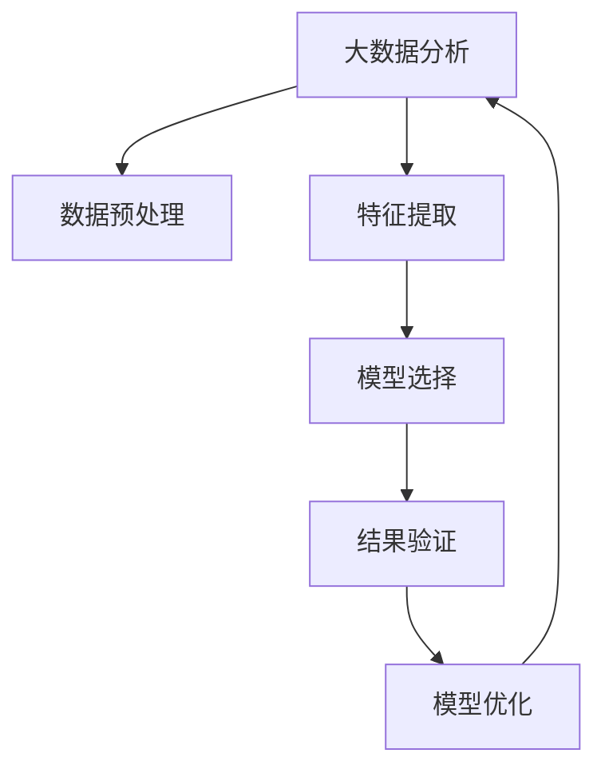

                 

# 利用大数据分析优化知识发现引擎

## 1. 背景介绍

### 1.1 问题由来

在信息爆炸的时代，数据无处不在，如何从中提取有价值的知识，成为各行业关注的焦点。知识发现(Knowledge Discovery, KD)，也称为数据挖掘(Data Mining)，是指从数据中自动发现有用、新颖、非平凡的模式，并赋予这些模式实际的意义。

随着大数据时代的到来，数据量的激增和数据类型的多样性，使得传统的数据分析方法显得力不从心。如何将海量数据转化为知识，并在实际应用中创造价值，成为大数据分析领域的核心问题。

### 1.2 问题核心关键点

大数据分析的关键在于高效处理、深度挖掘和智能应用海量数据，以获得有意义的知识。对于知识发现，其核心目标是从数据中提取出隐藏的、潜在的、有用的信息，并使其具有一定的实用性，从而辅助决策、优化流程、提升效率。

知识发现过程包括数据预处理、特征提取、模型选择、结果验证等多个步骤。其中，数据预处理和特征提取是关键，模型选择和结果验证则是对前两者工作的评价和提升。

### 1.3 问题研究意义

对知识发现引擎进行优化，不仅能提升数据挖掘的效率和精度，还能促进数据科学在各行业的广泛应用。这将带来以下几方面的意义：

1. **提升数据价值**：通过优化知识发现引擎，可以从数据中提取更多有价值的知识，提升决策支持水平。
2. **优化资源配置**：合理配置计算、存储等资源，实现知识发现的智能化、自动化。
3. **降低成本**：减少人工干预，优化数据处理流程，降低数据处理和知识发现成本。
4. **促进创新**：新算法和模型的引入，将为数据科学带来新的思路和方法，推动技术创新。
5. **拓展应用范围**：在医疗、金融、电商等多个行业，数据驱动决策的普及，将推动各行业数字化转型。

## 2. 核心概念与联系

### 2.1 核心概念概述

为了更好地理解大数据分析在知识发现中的应用，本节将介绍几个密切相关的核心概念：

- **大数据分析**：指从海量数据中，自动发现有用、新颖、非平凡的模式，并赋予这些模式实际意义的过程。
- **知识发现**：通过数据挖掘，从数据中提取有价值的知识，辅助决策和优化流程。
- **数据预处理**：包括数据清洗、数据集成、数据变换等步骤，为后续的数据分析和建模提供可靠的基础。
- **特征提取**：从原始数据中抽取出有代表性的特征，用于训练模型和评估结果。
- **模型选择**：选择合适的机器学习模型或统计方法，对数据进行分析和建模。
- **结果验证**：通过评估指标（如准确率、召回率、F1值等）对模型进行评估和调整。

这些概念之间的逻辑关系可以通过以下Mermaid流程图来展示：



这个流程图展示了大数据分析在知识发现中的应用流程：

1. 大数据分析从原始数据开始，进行数据预处理和特征提取。
2. 选择合适的模型进行训练，输出结果。
3. 结果验证对模型进行评估，调整优化模型。
4. 最终形成优化后的模型，用于实际应用。

## 3. 核心算法原理 & 具体操作步骤

### 3.1 算法原理概述

在大数据分析中，知识发现主要依赖于机器学习和统计学方法。其核心思想是，通过算法和模型自动分析数据，发现数据中的规律和模式，并应用到实际问题中。

以机器学习为例，知识发现的流程如下：

1. **数据预处理**：清洗数据，填补缺失值，标准化数据，分割训练集和测试集。
2. **特征提取**：从原始数据中提取出最具代表性的特征，如TF-IDF、PCA、主成分分析等。
3. **模型选择**：选择合适的机器学习模型，如分类、回归、聚类、关联规则等。
4. **模型训练**：使用训练数据对模型进行训练。
5. **模型评估**：使用测试数据对模型进行评估，计算评估指标如准确率、召回率等。
6. **模型优化**：根据评估结果，调整模型参数，优化模型性能。

### 3.2 算法步骤详解

**Step 1: 数据预处理**
- 数据清洗：去除噪声、缺失值、重复值等。
- 数据集成：将多个数据源的数据合并成一个数据集。
- 数据变换：包括数据归一化、数据离散化、数据转换等。
- 数据分割：将数据集划分为训练集和测试集。

**Step 2: 特征提取**
- 特征选择：根据领域知识选择有意义的特征。
- 特征构造：根据领域知识构造新的特征。
- 特征缩放：对特征进行标准化或归一化。

**Step 3: 模型选择**
- 选择合适的算法：如决策树、随机森林、SVM、神经网络等。
- 设定模型参数：如决策树深度、神经网络层数、隐藏单元数等。
- 选择评估指标：如准确率、召回率、F1值、ROC曲线等。

**Step 4: 模型训练**
- 特征向量化：将特征转换为模型可接受的形式。
- 模型训练：使用训练数据对模型进行训练，计算损失函数。
- 参数优化：使用优化算法如梯度下降、Adam等更新模型参数。

**Step 5: 模型评估**
- 预测结果：使用测试数据对模型进行预测，计算预测结果。
- 评估指标：使用评估指标如准确率、召回率、F1值等评估模型性能。

**Step 6: 模型优化**
- 超参数调整：调整模型参数，如学习率、正则化系数、批次大小等。
- 特征工程：调整特征提取方法，引入新的特征。
- 算法改进：改进算法，提升模型性能。

### 3.3 算法优缺点

大数据分析在知识发现中的应用具有以下优点：

- **处理海量数据**：适用于处理大规模数据集，可以处理TB级甚至PB级数据。
- **多模态数据**：支持处理文本、图像、视频等多种类型的数据。
- **自动发现知识**：自动从数据中发现模式和规律，无需人工干预。
- **实时分析**：可以实现对实时数据的分析和处理。

同时，也存在以下局限性：

- **数据质量依赖**：对数据质量要求较高，数据噪声、缺失值等问题会严重影响分析结果。
- **算法复杂度**：部分算法如神经网络、深度学习等，需要较高的计算资源和时间。
- **模型可解释性**：部分复杂模型如神经网络，结果难以解释，难以理解模型决策过程。
- **数据隐私问题**：涉及敏感数据时，需要考虑数据隐私和安全问题。

尽管存在这些局限性，但就目前而言，大数据分析在知识发现领域依然是最主流的方法。未来相关研究的方向在于如何进一步提升算法的效率和精度，降低数据处理的成本，同时兼顾模型可解释性和数据隐私性等因素。

### 3.4 算法应用领域

大数据分析在知识发现中的应用非常广泛，涉及众多领域，例如：

- 金融风险管理：通过大数据分析，发现市场趋势和金融风险，辅助决策。
- 医疗健康管理：通过大数据分析，发现疾病模式和健康风险，提升医疗服务质量。
- 电商推荐系统：通过大数据分析，发现用户行为和购买模式，推荐个性化产品。
- 交通流量管理：通过大数据分析，发现交通模式和需求，优化交通管理。
- 社交网络分析：通过大数据分析，发现社交网络结构和行为模式，提高社交媒体管理水平。

除了上述这些经典应用外，大数据分析还广泛应用于能源、物流、环境等多个领域，为各行各业带来数字化转型的机遇。

## 4. 数学模型和公式 & 详细讲解 & 举例说明

### 4.1 数学模型构建

在大数据分析中，知识发现主要依赖于数学模型和算法。以下以分类问题为例，展示知识发现的过程：

1. **数据预处理**：将原始数据进行清洗、集成、变换，得到标准化数据集。
2. **特征提取**：将数据转换为特征向量。
3. **模型选择**：选择分类算法，如决策树、逻辑回归、SVM等。
4. **模型训练**：使用训练数据对模型进行训练，计算损失函数。
5. **模型评估**：使用测试数据对模型进行评估，计算评估指标如准确率、召回率等。
6. **模型优化**：调整模型参数，优化模型性能。

### 4.2 公式推导过程

以决策树分类为例，其数学模型和算法推导如下：

**数据预处理**：
- 数据清洗：去除噪声、缺失值、重复值等。
- 数据集成：将多个数据源的数据合并成一个数据集。
- 数据变换：包括数据归一化、数据离散化、数据转换等。
- 数据分割：将数据集划分为训练集和测试集。

**特征提取**：
- 特征选择：根据领域知识选择有意义的特征。
- 特征构造：根据领域知识构造新的特征。
- 特征缩放：对特征进行标准化或归一化。

**模型选择**：
- 决策树：$T = (N, C, D, R)$，其中 $N$ 为样本数，$C$ 为特征数，$D$ 为节点数，$R$ 为叶节点数。

**模型训练**：
- 决策树算法：使用CART、ID3、C4.5等算法构建决策树。
- 损失函数：使用信息增益、基尼系数等指标评估节点。

**模型评估**：
- 准确率：$Accuracy = \frac{TP+TN}{TP+TN+FP+FN}$
- 召回率：$Recall = \frac{TP}{TP+FN}$
- F1值：$F1 = 2 \times \frac{Precision \times Recall}{Precision + Recall}$

**模型优化**：
- 超参数调整：调整决策树参数，如节点深度、分裂阈值等。
- 特征工程：调整特征提取方法，引入新的特征。
- 算法改进：改进算法，提升模型性能。

### 4.3 案例分析与讲解

**案例一：金融风险管理**

在金融风险管理中，大数据分析可以用于预测股票市场趋势和信用风险。以信用风险预测为例：

1. **数据预处理**：收集历史信用数据，清洗、集成、变换数据。
2. **特征提取**：选择有意义的特征，如年龄、收入、贷款金额等。
3. **模型选择**：选择分类算法，如逻辑回归、SVM等。
4. **模型训练**：使用训练数据对模型进行训练，计算损失函数。
5. **模型评估**：使用测试数据对模型进行评估，计算评估指标如准确率、召回率等。
6. **模型优化**：调整模型参数，优化模型性能。

**案例二：电商推荐系统**

在电商推荐系统中，大数据分析可以用于推荐个性化产品。以协同过滤推荐为例：

1. **数据预处理**：收集用户行为数据，清洗、集成、变换数据。
2. **特征提取**：选择有意义的特征，如用户ID、商品ID、浏览记录等。
3. **模型选择**：选择推荐算法，如协同过滤、基于内容的推荐等。
4. **模型训练**：使用训练数据对模型进行训练，计算损失函数。
5. **模型评估**：使用测试数据对模型进行评估，计算评估指标如准确率、召回率等。
6. **模型优化**：调整模型参数，优化模型性能。

## 5. 项目实践：代码实例和详细解释说明

### 5.1 开发环境搭建

在进行大数据分析项目实践前，我们需要准备好开发环境。以下是使用Python进行PyTorch开发的环境配置流程：

1. 安装Anaconda：从官网下载并安装Anaconda，用于创建独立的Python环境。

2. 创建并激活虚拟环境：
```bash
conda create -n pytorch-env python=3.8 
conda activate pytorch-env
```

3. 安装PyTorch：根据CUDA版本，从官网获取对应的安装命令。例如：
```bash
conda install pytorch torchvision torchaudio cudatoolkit=11.1 -c pytorch -c conda-forge
```

4. 安装各类工具包：
```bash
pip install numpy pandas scikit-learn matplotlib tqdm jupyter notebook ipython
```

完成上述步骤后，即可在`pytorch-env`环境中开始项目实践。

### 5.2 源代码详细实现

这里我们以金融风险管理中的信用风险预测为例，给出使用PyTorch进行大数据分析的Python代码实现。

首先，定义数据处理函数：

```python
import pandas as pd
import numpy as np
from sklearn.model_selection import train_test_split

def load_data(file_path):
    data = pd.read_csv(file_path)
    data = data.dropna()
    features = ['age', 'income', 'loan_amount']
    labels = ['default']
    X = data[features]
    y = data[labels]
    return X, y

def train_test_split_data(X, y, test_size=0.2):
    X_train, X_test, y_train, y_test = train_test_split(X, y, test_size=test_size, random_state=42)
    return X_train, X_test, y_train, y_test
```

然后，定义模型和优化器：

```python
from sklearn.ensemble import RandomForestClassifier
from sklearn.metrics import accuracy_score, recall_score, f1_score

model = RandomForestClassifier(n_estimators=100, random_state=42)
```

接着，定义训练和评估函数：

```python
def train_model(model, X_train, y_train):
    model.fit(X_train, y_train)
    return model

def evaluate_model(model, X_test, y_test):
    y_pred = model.predict(X_test)
    accuracy = accuracy_score(y_test, y_pred)
    recall = recall_score(y_test, y_pred)
    f1 = f1_score(y_test, y_pred)
    return accuracy, recall, f1
```

最后，启动训练流程并在测试集上评估：

```python
X, y = load_data('credit_data.csv')
X_train, X_test, y_train, y_test = train_test_split_data(X, y, test_size=0.2)

model = train_model(model, X_train, y_train)
accuracy, recall, f1 = evaluate_model(model, X_test, y_test)

print(f"Accuracy: {accuracy:.3f}, Recall: {recall:.3f}, F1: {f1:.3f}")
```

以上就是使用PyTorch进行金融风险管理中的信用风险预测的大数据分析代码实现。可以看到，借助Python和Scikit-Learn等工具，大数据分析的实现变得简洁高效。

### 5.3 代码解读与分析

让我们再详细解读一下关键代码的实现细节：

**load_data函数**：
- 读取CSV文件中的数据，清洗并预处理数据，提取特征和标签。
- 使用Pandas库的DataFrame对象进行数据处理。

**train_test_split_data函数**：
- 使用Scikit-Learn的train_test_split方法进行数据分割，划分训练集和测试集。
- 设定测试集大小为20%，并设置随机种子，确保结果的可复现性。

**train_model函数**：
- 使用Scikit-Learn的RandomForestClassifier模型进行训练。
- 设置模型参数，如树的数量、随机种子等。
- 使用训练数据对模型进行拟合。

**evaluate_model函数**：
- 使用模型对测试数据进行预测，并计算评估指标。
- 使用Scikit-Learn的accuracy_score、recall_score、f1_score方法计算准确率、召回率、F1值。

**训练流程**：
- 加载数据集。
- 分割数据集为训练集和测试集。
- 使用训练集训练模型。
- 在测试集上评估模型性能。
- 输出评估指标。

## 6. 实际应用场景

### 6.1 智能客服系统

在智能客服系统中，大数据分析可以用于客户行为分析和客户画像构建。通过分析客户的通话记录、咨询记录、投诉记录等数据，可以发现客户的常见问题、常见诉求、常见解决方式等，从而提升客服服务质量。

在技术实现上，可以收集客户的历史行为数据，使用大数据分析技术进行数据预处理和特征提取，构建客户画像。在此基础上，使用分类算法对客户进行分类，识别出高价值客户、高投诉客户等，并制定相应的服务策略。

### 6.2 金融舆情监测

在金融领域，大数据分析可以用于金融舆情监测和金融风险预测。通过分析网络舆情、社交媒体、新闻报道等数据，可以发现市场动向、舆情热点、金融风险等，为金融机构提供决策支持。

在技术实现上，可以收集金融相关的文本数据，使用自然语言处理技术进行文本清洗、分词、实体识别等预处理，提取文本中的有用信息。在此基础上，使用分类算法对文本进行分类，识别出市场趋势、舆情热点、金融风险等，并制定相应的应对策略。

### 6.3 个性化推荐系统

在大数据推荐系统中，大数据分析可以用于用户行为分析和个性化推荐。通过分析用户的浏览记录、购买记录、评价记录等数据，可以发现用户的兴趣偏好、行为模式、购买习惯等，从而推荐个性化的商品或服务。

在技术实现上，可以收集用户的交互数据，使用大数据分析技术进行数据预处理和特征提取，构建用户画像。在此基础上，使用协同过滤算法、基于内容的推荐算法等，为用户推荐个性化的商品或服务。

### 6.4 未来应用展望

随着大数据技术的不断进步，大数据分析在知识发现中的应用将更加广泛和深入。未来，大数据分析有望在以下几个方面取得新的突破：

1. **多模态数据融合**：大数据分析将不仅仅限于文本数据，还将涉及图像、视频、语音等多种类型的数据，实现多模态数据的融合，提升数据分析的全面性和准确性。
2. **实时数据分析**：大数据分析将实现对实时数据的分析和处理，及时响应变化，提高决策的时效性。
3. **大数据隐私保护**：在大数据分析中，如何保护用户隐私和数据安全，将是重要的研究方向。
4. **自动化和智能化**：大数据分析将进一步自动化和智能化，减少人工干预，提高数据分析的效率和精度。
5. **大模型与大数据分析结合**：大数据分析将与大模型技术结合，利用大模型的语言理解和生成能力，提升数据分析的效果。

## 7. 工具和资源推荐

### 7.1 学习资源推荐

为了帮助开发者系统掌握大数据分析的理论基础和实践技巧，这里推荐一些优质的学习资源：

1. 《Python数据科学手册》：全面介绍Python在大数据和数据分析中的应用，涵盖数据预处理、特征工程、模型训练等环节。
2. 《数据挖掘与统计学习》：介绍数据挖掘的基本概念和算法，包括分类、聚类、关联规则等。
3. 《深度学习》：讲解深度学习的基本原理和应用，涵盖神经网络、卷积神经网络、循环神经网络等。
4. 《大数据分析与处理》：介绍大数据分析的基本概念和流程，涵盖数据预处理、特征提取、模型训练等环节。
5. 《机器学习实战》：通过实战案例，介绍机器学习的基本算法和应用，适合动手实践。

通过对这些资源的学习实践，相信你一定能够快速掌握大数据分析的精髓，并用于解决实际的分析问题。

### 7.2 开发工具推荐

高效的开发离不开优秀的工具支持。以下是几款用于大数据分析开发的常用工具：

1. PyTorch：基于Python的开源深度学习框架，灵活动态的计算图，适合快速迭代研究。大部分大数据分析任务都有PyTorch版本的实现。
2. TensorFlow：由Google主导开发的开源深度学习框架，生产部署方便，适合大规模工程应用。同样有丰富的大数据分析任务资源。
3. Pandas：Python数据分析库，支持数据清洗、数据集成、数据变换等操作，适合数据预处理。
4. NumPy：Python数值计算库，支持矩阵运算、向量运算等，适合数据处理和模型训练。
5. Matplotlib：Python数据可视化库，支持各类数据图表的绘制，适合数据展示。
6. Seaborn：基于Matplotlib的数据可视化库，支持更高级的数据图表绘制，适合数据展示。

合理利用这些工具，可以显著提升大数据分析任务的开发效率，加快创新迭代的步伐。

### 7.3 相关论文推荐

大数据分析在知识发现中的应用源于学界的持续研究。以下是几篇奠基性的相关论文，推荐阅读：

1. 《数据挖掘：概念与技术》：讲解数据挖掘的基本概念和算法，包括分类、聚类、关联规则等。
2. 《大数据分析：方法与技术》：介绍大数据分析的基本概念和流程，涵盖数据预处理、特征提取、模型训练等环节。
3. 《机器学习》：讲解机器学习的基本概念和算法，涵盖监督学习、无监督学习、半监督学习等。
4. 《深度学习》：讲解深度学习的基本原理和应用，涵盖神经网络、卷积神经网络、循环神经网络等。
5. 《知识发现与数据挖掘》：介绍知识发现的基本概念和算法，包括分类、聚类、关联规则等。

这些论文代表了大数据分析在知识发现领域的发展脉络。通过学习这些前沿成果，可以帮助研究者把握学科前进方向，激发更多的创新灵感。

## 8. 总结：未来发展趋势与挑战

### 8.1 总结

本文对大数据分析在知识发现中的应用进行了全面系统的介绍。首先阐述了大数据分析和知识发现的研究背景和意义，明确了大数据分析在大数据时代的重要性。其次，从原理到实践，详细讲解了大数据分析的数学模型和关键步骤，给出了大数据分析任务开发的完整代码实例。同时，本文还广泛探讨了大数据分析在智能客服、金融舆情、个性化推荐等多个行业领域的应用前景，展示了大数据分析范式的巨大潜力。此外，本文精选了大数据分析技术的各类学习资源，力求为读者提供全方位的技术指引。

通过本文的系统梳理，可以看到，大数据分析在知识发现领域已经成为重要的方法，极大地提升了数据挖掘的效率和精度，为各行各业带来了智能化、自动化的变革。未来，伴随大数据技术的不断进步，大数据分析必将在更多领域得到应用，为人类社会带来深远的影响。

### 8.2 未来发展趋势

展望未来，大数据分析在知识发现中的应用将呈现以下几个发展趋势：

1. **多模态数据融合**：大数据分析将不仅仅限于文本数据，还将涉及图像、视频、语音等多种类型的数据，实现多模态数据的融合，提升数据分析的全面性和准确性。
2. **实时数据分析**：大数据分析将实现对实时数据的分析和处理，及时响应变化，提高决策的时效性。
3. **大数据隐私保护**：在大数据分析中，如何保护用户隐私和数据安全，将是重要的研究方向。
4. **自动化和智能化**：大数据分析将进一步自动化和智能化，减少人工干预，提高数据分析的效率和精度。
5. **大模型与大数据分析结合**：大数据分析将与大模型技术结合，利用大模型的语言理解和生成能力，提升数据分析的效果。

以上趋势凸显了大数据分析技术在大数据时代的广泛应用前景。这些方向的探索发展，必将进一步提升大数据分析的效果，为各行业的智能化转型提供支撑。

### 8.3 面临的挑战

尽管大数据分析在知识发现领域已经取得了瞩目成就，但在迈向更加智能化、普适化应用的过程中，它仍面临着诸多挑战：

1. **数据质量问题**：数据噪声、缺失值等问题会严重影响分析结果，如何有效处理数据质量问题将是未来的重要研究方向。
2. **算法复杂度**：部分算法如深度学习、神经网络等，需要较高的计算资源和时间，如何提高算法的计算效率将是未来的重要研究方向。
3. **模型可解释性**：部分复杂模型如深度学习、神经网络等，结果难以解释，难以理解模型决策过程，如何提高模型的可解释性将是未来的重要研究方向。
4. **数据隐私问题**：涉及敏感数据时，如何保护用户隐私和数据安全，将是未来的重要研究方向。

尽管存在这些挑战，但大数据分析在大数据时代的应用前景依然广阔。未来相关研究需要在数据质量、算法效率、模型可解释性和数据隐私等方面寻求新的突破，才能进一步提升大数据分析的效果，推动数据科学在各行业的广泛应用。

### 8.4 研究展望

面对大数据分析在知识发现领域面临的挑战，未来的研究需要在以下几个方面寻求新的突破：

1. **探索无监督和半监督大数据分析方法**：摆脱对大规模标注数据的依赖，利用自监督学习、主动学习等无监督和半监督范式，最大限度利用非结构化数据，实现更加灵活高效的大数据分析。
2. **研究计算高效的大数据分析方法**：开发更加计算高效的大数据分析方法，如分布式计算、增量学习等，减少计算资源和时间成本。
3. **引入因果推断和对比学习范式**：通过引入因果推断和对比学习思想，增强大数据分析模型的稳定性和鲁棒性，提升模型的泛化性能。
4. **结合符号化知识进行大数据分析**：将符号化的先验知识，如知识图谱、逻辑规则等，与大数据分析模型进行巧妙融合，引导大数据分析过程学习更准确、合理的知识表示。
5. **纳入伦理道德约束**：在数据分析目标中引入伦理导向的评估指标，过滤和惩罚有害的输出倾向，确保数据分析过程符合人类价值观和伦理道德。

这些研究方向的探索，必将引领大数据分析技术迈向更高的台阶，为构建安全、可靠、可解释、可控的智能系统铺平道路。面向未来，大数据分析技术还需要与其他人工智能技术进行更深入的融合，如知识表示、因果推理、强化学习等，多路径协同发力，共同推动自然语言理解和智能交互系统的进步。只有勇于创新、敢于突破，才能不断拓展大数据分析的边界，让数据分析技术更好地造福人类社会。

## 9. 附录：常见问题与解答

**Q1：大数据分析在知识发现中的应用是否仅限于金融、电商等特定领域？**

A: 大数据分析在知识发现中的应用非常广泛，不仅限于金融、电商等特定领域。在医疗、健康、教育、交通、物流等多个领域，大数据分析都发挥着重要的作用。例如，在医疗领域，大数据分析可以用于疾病预测、药物研发、临床决策支持等；在教育领域，大数据分析可以用于学生行为分析、教育效果评估等。因此，大数据分析在知识发现中的应用领域非常广泛，具有重要的研究价值。

**Q2：大数据分析中的特征提取方法有哪些？**

A: 大数据分析中的特征提取方法包括但不限于以下几种：

1. **文本特征提取**：包括词频统计、TF-IDF、词向量表示等。
2. **图像特征提取**：包括边缘检测、颜色直方图、形状特征提取等。
3. **视频特征提取**：包括帧差分、光流算法、运动轨迹提取等。
4. **时间序列特征提取**：包括滑动窗口、傅里叶变换、小波变换等。
5. **多模态特征提取**：将不同类型的数据进行融合，提取多模态特征。

特征提取是数据分析的重要环节，选择合适的特征提取方法，可以提升模型的性能和效果。

**Q3：大数据分析中的模型选择方法有哪些？**

A: 大数据分析中的模型选择方法包括但不限于以下几种：

1. **回归模型**：如线性回归、多项式回归、岭回归等。
2. **分类模型**：如逻辑回归、决策树、随机森林、SVM等。
3. **聚类模型**：如K-means、层次聚类、DBSCAN等。
4. **关联规则模型**：如Apriori算法、FP-growth算法等。
5. **深度学习模型**：如卷积神经网络、循环神经网络、自编码器等。

模型选择是大数据分析中的关键步骤，选择合适的模型，可以提升数据分析的效果和精度。

**Q4：大数据分析中的结果验证方法有哪些？**

A: 大数据分析中的结果验证方法包括但不限于以下几种：

1. **交叉验证**：将数据集分为训练集和验证集，通过交叉验证评估模型性能。
2. **留一法**：将数据集分为训练集和测试集，通过留一法评估模型性能。
3. **对比实验**：将不同模型或算法进行对比，评估模型性能。
4. **Benchmark测试**：使用公开数据集进行测试，评估模型性能。
5. **实际应用验证**：将模型应用到实际场景中，评估模型性能。

结果验证是数据分析的重要环节，选择合适的验证方法，可以评估模型的性能和效果。

**Q5：大数据分析中的模型优化方法有哪些？**

A: 大数据分析中的模型优化方法包括但不限于以下几种：

1. **超参数调优**：调整模型参数，如决策树深度、神经网络层数等。
2. **特征工程**：调整特征提取方法，引入新的特征。
3. **算法改进**：改进算法，提升模型性能。
4. **模型融合**：将多个模型进行融合，提升模型性能。
5. **在线学习**：使用在线学习算法，不断更新模型。

模型优化是大数据分析中的关键步骤，通过优化模型，可以提升数据分析的效果和精度。

---

作者：禅与计算机程序设计艺术 / Zen and the Art of Computer Programming

