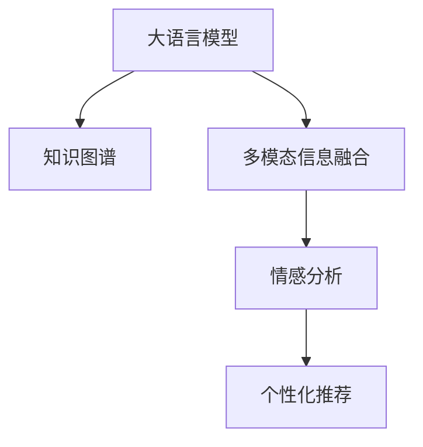

                 

# 利用大模型知识和推理能力理解用户行为

> 关键词：大语言模型,推理能力,用户行为理解,知识图谱,多模态信息融合,情感分析

## 1. 背景介绍

### 1.1 问题由来

在数字化时代，用户行为数据的积累与分析已经成为企业提升竞争力的重要手段。然而，数据量之大、类型之多、语义之丰富，使得传统的统计分析方法难以有效应对。如何更好地理解用户行为，提取关键信息，挖掘潜在价值，成为了当前NLP领域研究的前沿课题。

为此，本文聚焦于利用大语言模型的知识和推理能力，探索如何更深入地理解用户行为，提取出更丰富、更精准的洞察。具体来说，将介绍如何构建基于大模型的知识图谱，以及通过多模态信息融合和情感分析等方法，为用户提供个性化的行为理解服务。

### 1.2 问题核心关键点

1. **大语言模型与知识图谱**：大语言模型在预训练过程中，通过自监督学习，掌握了大量的语言知识和语义关系。这些知识可以借助知识图谱的形式加以组织和表示，从而为理解用户行为提供坚实的基础。

2. **多模态信息融合**：用户行为通常包含文本、图像、语音等多种模态数据。将多模态数据融合到大模型中进行推理，可以更全面、准确地理解用户行为。

3. **情感分析与情感计算**：用户行为背后的情感态度对决策有重要影响。情感分析可以将用户文本中的情感倾向抽取出来，用于分析用户态度和行为动机。

4. **个性化推荐与响应**：通过结合用户历史行为和实时数据，利用大模型的推理能力，可以实现个性化推荐和智能客服等应用。

5. **隐私保护与合规性**：在理解用户行为的过程中，需要确保用户隐私不受侵犯，并符合各类法律法规和伦理标准。

这些关键点构成了利用大语言模型理解用户行为的全景，本文将依次展开详细探讨。

### 1.3 问题研究意义

在互联网和移动设备广泛普及的今天，用户的在线行为数据源源不断地产生。如何高效利用这些数据，提取有价值的洞察，为用户提供个性化的服务，是当前企业数字化转型的重要方向。利用大语言模型理解和推理用户行为，可以帮助企业在竞争中占据先机，提升用户体验，驱动业务增长。

1. **提升用户体验**：通过深入理解用户行为，可以提供更加个性化、精准的服务，增强用户满意度和忠诚度。

2. **优化产品设计**：基于用户行为的洞察，企业可以优化产品功能和设计，提升产品竞争力。

3. **预测市场趋势**：用户行为数据反映了市场动态和消费者偏好，通过对这些数据的分析，可以预测市场趋势，为企业的战略决策提供支持。

4. **提高营销效果**：利用对用户行为的深入理解，可以设计更有效的广告和推荐策略，提高营销效果和ROI。

5. **强化安全防护**：理解用户行为可以帮助识别异常行为和潜在威胁，提高安全防护水平。

## 2. 核心概念与联系

### 2.1 核心概念概述

为了更好地理解利用大语言模型理解用户行为的技术，首先介绍几个核心概念：

- **大语言模型(Large Language Model, LLM)**：指如GPT、BERT、XLNet等基于Transformer架构的深度学习模型，通过大规模文本数据预训练，具备强大的语言理解和生成能力。

- **知识图谱(Knowledge Graph)**：一种结构化的语义知识表示方式，用于描述实体、属性和关系，帮助模型进行推理和决策。

- **多模态信息融合**：指将文本、图像、语音等多种数据源融合到模型中进行推理，以更全面地理解用户行为。

- **情感分析(Affective Analysis)**：通过自然语言处理技术，从文本中分析出用户的情感倾向，用于理解用户情绪和态度。

- **个性化推荐(Personalized Recommendation)**：利用用户行为数据，通过模型推断出用户的偏好和需求，进行个性化推荐。

这些概念之间存在着紧密的联系，构成了一个完整的技术体系。以下是一个简单的Mermaid流程图，展示了大语言模型与知识图谱、多模态信息融合、情感分析和个性化推荐之间的联系：



## 3. 核心算法原理 & 具体操作步骤

### 3.1 算法原理概述

利用大语言模型理解用户行为的核心在于，将模型学到的语言知识、语义关系和多模态信息融合到推理过程中，进行实时的行为理解。具体来说，包括以下几个关键步骤：

1. **预训练语言模型**：首先，使用大规模无标注文本数据对大语言模型进行预训练，使其具备基本的语言理解和生成能力。

2. **知识图谱构建**：根据领域知识，构建知识图谱，将实体、属性和关系进行结构化表示。

3. **多模态数据融合**：将用户的行为数据，如文本、图像、语音等，通过编码器和解码器进行融合，提取多模态特征。

4. **情感分析**：通过大语言模型对用户行为文本进行情感分析，抽取情感倾向。

5. **推理与决策**：将多模态特征和情感信息输入大模型，进行推理和决策，输出对用户行为的理解。

### 3.2 算法步骤详解

#### 3.2.1 预训练语言模型

预训练是大语言模型理解用户行为的基础。以GPT-3为例，其预训练过程包括：

1. 使用大规模无标注文本数据进行预训练，目标是学习语言的共现概率和语义关系。

2. 使用掩码语言模型和下一句预测任务，训练模型预测缺失的单词或句子，增强模型对语义的理解能力。

3. 引入自回归模型，预测文本中的后续单词，提高生成质量。

4. 使用Transformer架构，提升模型的并行计算能力和表示能力。

#### 3.2.2 知识图谱构建

知识图谱用于描述领域知识，帮助模型进行推理和决策。构建知识图谱的主要步骤如下：

1. 识别领域内的实体，如用户、产品、事件等。

2. 定义实体属性，如用户基本信息、产品特性、事件时间等。

3. 描述实体间的关系，如购买、评论、点赞等。

4. 使用图数据库或基于TensorFlow、PyTorch等框架进行图结构建模。

#### 3.2.3 多模态数据融合

多模态数据融合的目的是将用户行为的多样数据源整合起来，形成更全面的用户行为理解。以一个多模态数据融合框架为例：

1. 将用户文本、图像、语音数据分别编码，得到多模态特征。

2. 使用Transformer编码器对多模态特征进行融合，生成融合后的向量。

3. 将融合后的向量输入到大语言模型中进行推理和决策。

#### 3.2.4 情感分析

情感分析的目的是从用户行为文本中抽取情感倾向，用于理解用户情绪和态度。以基于BERT的情感分析为例：

1. 将用户文本输入BERT模型，得到表示用户情感的向量。

2. 使用softmax函数将向量映射到情感类别，如积极、中性、消极。

3. 根据情感类别输出情感倾向，用于后续推理和决策。

#### 3.2.5 推理与决策

推理与决策的目的是基于多模态特征和情感信息，生成对用户行为的全面理解。以推理框架为例：

1. 将多模态特征和情感信息作为输入，输入到大语言模型中进行推理。

2. 大语言模型根据推理结果输出对用户行为的解释，如用户意图、情感倾向、推荐产品等。

3. 根据用户行为的解释，进行后续的决策和响应，如个性化推荐、智能客服等。

### 3.3 算法优缺点

#### 3.3.1 优点

1. **高效理解复杂行为**：大语言模型可以处理大规模语料和复杂语义，能够理解多种模态数据和情感信息，提供全面的用户行为理解。

2. **灵活适应新领域**：通过知识图谱和领域知识的引入，大模型能够快速适应新的领域，提升推理和决策能力。

3. **自动化分析**：通过自动化分析和推理，大模型能够实时处理用户数据，提供实时的行为理解服务。

4. **个性化推荐**：基于用户行为的深度理解，可以提供更精准、个性化的推荐服务，提升用户体验。

5. **多模态融合**：通过多模态数据融合，大模型能够捕捉到更多的用户行为信息，提升行为理解的全面性。

#### 3.3.2 缺点

1. **数据依赖性强**：大模型的性能依赖于预训练数据和领域知识的丰富性，数据质量不高时影响效果。

2. **推理过程复杂**：多模态数据融合和推理过程复杂，计算资源消耗大。

3. **隐私和安全风险**：用户数据涉及隐私和安全，需要确保数据保护和隐私合规。

4. **泛化能力有限**：大模型泛化能力受数据分布和领域知识的影响，面对新领域和新数据可能效果不佳。

5. **可解释性不足**：大模型推理过程黑盒化，难以解释其决策逻辑。

### 3.4 算法应用领域

基于大语言模型的用户行为理解技术，已经在多个领域得到了广泛应用：

1. **电子商务**：通过分析用户购买记录、评论和行为数据，提供个性化推荐和智能客服。

2. **金融服务**：分析用户交易记录和行为数据，进行风险评估和客户管理。

3. **医疗健康**：分析患者就医记录和行为数据，提供个性化诊疗建议和健康管理。

4. **教育培训**：分析学生学习行为和反馈，提供个性化学习推荐和智能辅导。

5. **智能家居**：分析用户家居行为数据，提供智能家居场景推荐和控制。

6. **交通出行**：分析用户出行行为数据，提供个性化出行建议和服务。

## 4. 数学模型和公式 & 详细讲解 & 举例说明

### 4.1 数学模型构建

基于大语言模型理解用户行为的技术，可以通过数学模型进行严谨的表述。以下是一个典型的用户行为理解模型：

1. **输入数据**：用户文本数据 $x$，图像数据 $I$，语音数据 $V$，时间序列数据 $T$。

2. **编码器**：使用Transformer编码器对多模态数据进行融合，生成融合后的向量 $H$。

3. **情感分析**：使用BERT模型对用户文本进行情感分析，输出情感向量 $E$。

4. **推理模型**：将融合向量 $H$ 和情感向量 $E$ 输入到大语言模型中，进行推理和决策，输出行为理解结果 $U$。

5. **解码器**：根据行为理解结果 $U$，生成个性化的推荐、决策或服务。

### 4.2 公式推导过程

以用户情感分析为例，假设用户文本为 $x_i = [x_{i1}, x_{i2}, \dots, x_{in}]$，情感分析模型的目标是最小化预测情感与真实情感之间的差距：

$$
\min_{\theta} \sum_{i=1}^N \mathcal{L}(x_i, \hat{y}_i)
$$

其中 $\mathcal{L}$ 为情感分类损失函数，$\hat{y}_i$ 为模型预测的情感类别。

假设使用BERT模型进行情感分析，输入序列的表示为 $H_i$，情感分类器的输出为 $\hat{y}_i$，则情感分类损失函数可以表示为：

$$
\mathcal{L}(x_i, \hat{y}_i) = -\log P(y_i | H_i; \theta)
$$

其中 $P(y_i | H_i; \theta)$ 为情感类别的概率分布。

### 4.3 案例分析与讲解

假设某电商平台希望通过大语言模型理解用户行为，提供个性化推荐服务。具体步骤如下：

1. **数据收集**：收集用户的浏览记录、购买记录、评论等数据，构建用户行为数据集。

2. **预训练模型选择**：选择BERT或GPT作为预训练模型，进行预训练和微调。

3. **知识图谱构建**：根据领域知识，构建产品、用户、事件等实体和关系，构建知识图谱。

4. **多模态数据融合**：将用户文本、图像、语音数据融合到BERT模型中，生成融合向量。

5. **情感分析**：使用BERT模型对用户评论进行情感分析，输出情感倾向。

6. **推理与决策**：将融合向量、情感信息输入到GPT模型中，进行推理和决策，输出个性化推荐。

7. **服务化部署**：将推理模型服务化部署，提供实时的推荐服务。

## 5. 项目实践：代码实例和详细解释说明

### 5.1 开发环境搭建

要进行用户行为理解项目开发，需要搭建良好的开发环境。以下是一个Python开发环境的搭建步骤：

1. 安装Python：安装最新版本的Python，建议使用虚拟环境。

2. 安装TensorFlow和PyTorch：使用pip或conda安装TensorFlow和PyTorch，建议安装最新版本。

3. 安装相关库：安装其他必要的库，如TensorBoard、scikit-learn等。

4. 安装BERT模型：使用HuggingFace的Transformers库，下载并加载预训练的BERT模型。

5. 安装知识图谱库：安装图数据库库，如Neo4j、TinkerPop等。

### 5.2 源代码详细实现

以下是一个基于BERT和GPT的个性化推荐系统的Python代码实现：

```python
from transformers import BertTokenizer, BertForSequenceClassification, GPT2Tokenizer, GPT2Model
import tensorflow as tf
from keras.layers import Input, Dense, Embedding, Concatenate
from keras.models import Model

# 定义BERT和GPT的预训练模型
bert_model = BertForSequenceClassification.from_pretrained('bert-base-uncased', num_labels=2)
gpt_model = GPT2Model.from_pretrained('gpt2')

# 定义知识图谱
# 假设使用Neo4j数据库，代码略

# 定义编码器
def build_encoder():
    # 定义BERT编码器
    bert_input = Input(shape=(128, ), name='bert_input')
    bert_output = BertTokenizer.encode(bert_input)
    bert_encoder = BertModel(bert_output)
    bert_output = bert_encoder(bert_output)

    # 定义图像编码器
    image_input = Input(shape=(224, 224, 3), name='image_input')
    image_encoder = Dense(256, activation='relu')(image_input)
    
    # 定义语音编码器
    voice_input = Input(shape=(128,), name='voice_input')
    voice_encoder = Dense(256, activation='relu')(voice_input)
    
    # 定义时间序列编码器
    time_input = Input(shape=(48,), name='time_input')
    time_encoder = Dense(256, activation='relu')(time_input)
    
    # 将不同模态的编码器输出进行融合
    fusion_output = Concatenate()([bert_output, image_encoder, voice_encoder, time_encoder])
    
    return fusion_output

# 定义情感分析器
def build_arcade_classifier():
    # 加载BERT模型
    bert_input = Input(shape=(128, ), name='bert_input')
    bert_output = BertTokenizer.encode(bert_input)
    bert_encoder = BertModel(bert_output)
    bert_output = bert_encoder(bert_output)
    bert_output = bert_output[:,0,:] # 取第一个词的表示

    # 加载情感分析器
    arcade_classifier = Dense(128, activation='relu')(bert_output)
    arcade_classifier = Dense(1, activation='sigmoid')(arcade_classifier)
    
    return arcade_classifier

# 定义推理模型
def build_inference_model():
    # 定义编码器输出
    fusion_output = build_encoder()

    # 定义情感分析器输出
    arcade_classifier = build_arcade_classifier()

    # 将编码器输出和情感分析器输出输入到GPT模型进行推理
    gpt_input = Input(shape=(128, ), name='gpt_input')
    gpt_output = GPT2Tokenizer.encode(gpt_input)
    gpt_encoder = GPT2Model(gpt_output)
    gpt_output = gpt_encoder(gpt_output)
    gpt_output = gpt_output[:,0,:] # 取第一个词的表示

    # 将GPT推理输出与编码器输出和情感分析器输出进行融合
    fusion_output = Concatenate()([fusion_output, arcade_classifier, gpt_output])

    # 定义解码器
    inference_output = GPT2Tokenizer.decode(fusion_output)

    return inference_output

# 定义模型训练函数
def train():
    # 定义模型输入
    bert_input = Input(shape=(128, ), name='bert_input')
    image_input = Input(shape=(224, 224, 3), name='image_input')
    voice_input = Input(shape=(128,), name='voice_input')
    time_input = Input(shape=(48,), name='time_input')
    gpt_input = Input(shape=(128, ), name='gpt_input')

    # 定义模型输出
    inference_output = build_inference_model()

    # 定义损失函数
    loss = tf.keras.losses.mean_squared_error(inference_output, gpt_input)

    # 定义模型编译
    model = Model(inputs=[bert_input, image_input, voice_input, time_input, gpt_input], outputs=inference_output)
    model.compile(optimizer=tf.keras.optimizers.Adam(learning_rate=0.001), loss=loss)

    # 定义数据集
    # 假设使用Keras数据集，代码略

    # 训练模型
    model.fit(dataset, epochs=10, batch_size=32)
```

### 5.3 代码解读与分析

上述代码实现了一个基于BERT和GPT的个性化推荐系统。具体步骤如下：

1. **模型加载**：加载预训练的BERT和GPT模型，准备使用。

2. **编码器构建**：构建用于融合多模态数据的编码器，包括BERT编码器、图像编码器、语音编码器和时序编码器。

3. **情感分析器构建**：构建用于情感分析的分类器，使用BERT模型进行情感分析。

4. **推理模型构建**：构建用于推理的模型，将编码器输出、情感分析器输出和GPT推理输出进行融合。

5. **模型训练**：定义模型输入、输出和损失函数，使用Keras编译模型，并定义训练数据集进行训练。

### 5.4 运行结果展示

训练完成后，可以使用推理模型进行个性化推荐。具体步骤如下：

1. **输入用户数据**：输入用户的多模态数据，如文本、图像、语音、时序数据。

2. **预处理数据**：对用户数据进行编码和预处理，形成模型输入。

3. **推理输出**：将处理后的数据输入推理模型，输出推荐结果。

4. **服务化部署**：将推理模型部署为服务，供应用系统调用。

## 6. 实际应用场景

### 6.1 智能推荐系统

智能推荐系统是利用大语言模型理解用户行为的重要应用场景之一。通过分析用户行为数据，提供个性化的商品、内容和服务的推荐，提升用户体验和满意度。

以电商平台的个性化推荐为例：

1. **用户行为数据收集**：收集用户的浏览记录、购买记录、评论等数据。

2. **预训练模型选择**：选择BERT或GPT作为预训练模型，进行预训练和微调。

3. **知识图谱构建**：根据领域知识，构建产品、用户、事件等实体和关系，构建知识图谱。

4. **多模态数据融合**：将用户文本、图像、语音数据融合到BERT模型中，生成融合向量。

5. **情感分析**：使用BERT模型对用户评论进行情感分析，输出情感倾向。

6. **推理与决策**：将融合向量、情感信息输入到GPT模型中，进行推理和决策，输出个性化推荐。

7. **服务化部署**：将推理模型服务化部署，提供实时的推荐服务。

### 6.2 智能客服系统

智能客服系统也是大语言模型理解用户行为的典型应用。通过分析用户的查询和反馈，提供实时的、个性化的客服服务，提升客户满意度和工作效率。

以智能客服为例：

1. **用户查询数据收集**：收集用户的查询记录、反馈、投诉等数据。

2. **预训练模型选择**：选择BERT或GPT作为预训练模型，进行预训练和微调。

3. **知识图谱构建**：根据领域知识，构建问题、答案、场景等实体和关系，构建知识图谱。

4. **多模态数据融合**：将用户文本、语音数据融合到BERT模型中，生成融合向量。

5. **情感分析**：使用BERT模型对用户反馈进行情感分析，输出情感倾向。

6. **推理与决策**：将融合向量、情感信息输入到GPT模型中，进行推理和决策，输出最佳答案或推荐。

7. **服务化部署**：将推理模型服务化部署，提供实时的客服服务。

### 6.3 情感分析系统

情感分析系统是利用大语言模型理解用户情感态度的重要应用。通过分析用户的文本数据，提取情感倾向，用于舆情监控、市场分析、用户满意度评估等场景。

以情感分析系统为例：

1. **用户文本数据收集**：收集用户的评论、反馈、社交媒体帖子等文本数据。

2. **预训练模型选择**：选择BERT或GPT作为预训练模型，进行预训练和微调。

3. **多模态数据融合**：将用户文本、语音数据融合到BERT模型中，生成融合向量。

4. **情感分析**：使用BERT模型对用户文本进行情感分析，输出情感倾向。

5. **情感计算**：结合多模态信息，进行情感综合计算，输出情感评分。

6. **可视化展示**：将情感评分可视化展示，辅助决策和分析。

### 6.4 未来应用展望

未来，基于大语言模型的用户行为理解技术将广泛应用于更多领域，推动数字化转型的深度发展。

1. **智慧医疗**：通过分析患者的就医记录和行为数据，提供个性化的诊疗建议和健康管理服务。

2. **智能教育**：通过分析学生的学习行为和反馈，提供个性化的学习推荐和智能辅导。

3. **智能家居**：通过分析用户的家居行为数据，提供个性化的智能家居场景推荐和控制。

4. **交通出行**：通过分析用户的出行行为数据，提供个性化的出行建议和服务。

5. **金融服务**：通过分析用户的交易记录和行为数据，进行风险评估和客户管理。

6. **娱乐传媒**：通过分析用户的观看、阅读、互动等行为数据，提供个性化的内容推荐和互动服务。

随着技术的不断进步，大语言模型在理解用户行为方面的能力将越来越强，其应用领域也将越来越广泛。

## 7. 工具和资源推荐

### 7.1 学习资源推荐

为了帮助开发者系统掌握大语言模型理解用户行为的技术，以下是一些优质的学习资源：

1. **《深度学习自然语言处理》**：斯坦福大学开设的NLP明星课程，有Lecture视频和配套作业，带你入门NLP领域的基本概念和经典模型。

2. **《Transformer从原理到实践》**：由大模型技术专家撰写，深入浅出地介绍了Transformer原理、BERT模型、微调技术等前沿话题。

3. **《Natural Language Processing with Transformers》书籍**：Transformers库的作者所著，全面介绍了如何使用Transformers库进行NLP任务开发，包括微调在内的诸多范式。

4. **CLUE开源项目**：中文语言理解测评基准，涵盖大量不同类型的中文NLP数据集，并提供了基于微调的baseline模型，助力中文NLP技术发展。

通过对这些资源的学习实践，相信你一定能够快速掌握大语言模型理解用户行为的技术，并用于解决实际的NLP问题。

### 7.2 开发工具推荐

高效的工具支持是开发高质量系统的关键。以下是几款用于大语言模型理解用户行为开发的常用工具：

1. **TensorFlow**：由Google主导开发的开源深度学习框架，生产部署方便，适合大规模工程应用。

2. **PyTorch**：基于Python的开源深度学习框架，灵活动态的计算图，适合快速迭代研究。

3. **Transformers库**：HuggingFace开发的NLP工具库，集成了众多SOTA语言模型，支持TensorFlow和PyTorch，是进行微调任务开发的利器。

4. **Keras**：Keras作为深度学习的高层API，易于使用，适合快速原型开发和实验。

5. **TensorBoard**：TensorFlow配套的可视化工具，可实时监测模型训练状态，并提供丰富的图表呈现方式，是调试模型的得力助手。

6. **Weights & Biases**：模型训练的实验跟踪工具，可以记录和可视化模型训练过程中的各项指标，方便对比和调优。

7. **HuggingFace Transformers库**：提供了丰富的预训练模型和微调范式，适合快速原型开发和实验。

### 7.3 相关论文推荐

大语言模型理解用户行为的技术源于学界的持续研究。以下是几篇奠基性的相关论文，推荐阅读：

1. **"Attention is All You Need"**：提出了Transformer结构，开启了NLP领域的预训练大模型时代。

2. **"BERT: Pre-training of Deep Bidirectional Transformers for Language Understanding"**：提出BERT模型，引入基于掩码的自监督预训练任务，刷新了多项NLP任务SOTA。

3. **"Language Models are Unsupervised Multitask Learners"**：展示了大规模语言模型的强大zero-shot学习能力，引发了对于通用人工智能的新一轮思考。

4. **"Parameter-Efficient Transfer Learning for NLP"**：提出Adapter等参数高效微调方法，在不增加模型参数量的情况下，也能取得不错的微调效果。

5. **"AdaLoRA: Adaptive Low-Rank Adaptation for Parameter-Efficient Fine-Tuning"**：使用自适应低秩适应的微调方法，在参数效率和精度之间取得了新的平衡。

6. **"Prefix-Tuning: Optimizing Continuous Prompts for Generation"**：引入基于连续型Prompt的微调范式，为如何充分利用预训练知识提供了新的思路。

这些论文代表了大语言模型理解用户行为的发展脉络。通过学习这些前沿成果，可以帮助研究者把握学科前进方向，激发更多的创新灵感。

## 8. 总结：未来发展趋势与挑战

### 8.1 总结

本文对利用大语言模型理解用户行为的技术进行了全面系统的介绍。首先阐述了背景和大模型在理解用户行为方面的潜力，明确了多模态信息融合、情感分析和知识图谱等关键技术的重要性。其次，从原理到实践，详细讲解了基于BERT和GPT的推理模型，以及如何通过多模态数据融合和情感分析进行用户行为理解。同时，本文还广泛探讨了该技术在智能推荐、智能客服、情感分析等多个领域的应用前景，展示了其广阔的应用空间。

通过本文的系统梳理，可以看到，利用大语言模型理解用户行为的技术正在成为NLP领域的重要范式，极大地拓展了预训练语言模型的应用边界，催生了更多的落地场景。受益于大规模语料的预训练和强大的推理能力，大模型在理解用户行为方面具备独特的优势，为企业提供个性化服务和优化决策提供了新的可能性。未来，随着大语言模型的持续演进，其理解用户行为的能力将进一步增强，推动NLP技术在更多行业中的应用和发展。

### 8.2 未来发展趋势

展望未来，大语言模型理解用户行为的技术将呈现以下几个发展趋势：

1. **多模态数据融合**：随着技术的进步，多模态数据的融合将更加高效和准确，帮助大模型更好地理解用户行为。

2. **情感计算**：情感分析将结合更多情感特征，提供更精准的情感理解和情感计算。

3. **知识图谱**：知识图谱的应用将更加广泛，帮助大模型更好地进行领域知识推理。

4. **个性化推荐**：个性化推荐将结合用户行为数据和实时数据，提供更加精准和动态的推荐服务。

5. **实时计算**：实时计算和推理能力将得到提升，帮助大模型在动态场景下快速理解用户行为。

6. **跨领域迁移**：大模型将在更多领域进行跨领域迁移和应用，提升通用性。

以上趋势凸显了大语言模型理解用户行为技术的广阔前景。这些方向的探索发展，必将进一步提升NLP系统的性能和应用范围，为构建人机协同的智能系统铺平道路。

### 8.3 面临的挑战

尽管大语言模型理解用户行为技术已经取得了显著进展，但在迈向更加智能化、普适化应用的过程中，仍面临诸多挑战：

1. **数据依赖性强**：大模型的性能依赖于预训练数据和领域知识的丰富性，数据质量不高时影响效果。

2. **推理过程复杂**：多模态数据融合和推理过程复杂，计算资源消耗大。

3. **隐私和安全风险**：用户数据涉及隐私和安全，需要确保数据保护和隐私合规。

4. **泛化能力有限**：大模型泛化能力受数据分布和领域知识的影响，面对新领域和新数据可能效果不佳。

5. **可解释性不足**：大模型推理过程黑盒化，难以解释其决策逻辑。

### 8.4 研究展望

面对大语言模型理解用户行为所面临的挑战，未来的研究需要在以下几个方面寻求新的突破：

1. **无监督和半监督学习**：探索无监督和半监督学习的方法，降低对标注数据的依赖。

2. **参数高效和计算高效**：开发更加参数高效和计算高效的微调方法，提升模型性能和效率。

3. **因果分析和对比学习**：引入因果分析和对比学习思想，增强模型推理和决策的稳定性和鲁棒性。

4. **多模态融合和跨领域迁移**：研究多模态数据融合和跨领域迁移的方法，提升模型的通用性和适应性。

5. **可解释性和隐私保护**：研究模型的可解释性和隐私保护方法，增强用户信任和数据安全。

这些研究方向的探索，必将引领大语言模型理解用户行为技术的进一步发展，为构建安全、可靠、可解释、可控的智能系统铺平道路。面向未来，大语言模型理解用户行为技术还需要与其他人工智能技术进行更深入的融合，如知识表示、因果推理、强化学习等，多路径协同发力，共同推动自然语言理解和智能交互系统的进步。只有勇于创新、敢于突破，才能不断拓展语言模型的边界，让智能技术更好地造福人类社会。

## 9. 附录：常见问题与解答

### Q1: 大语言模型理解用户行为的主要难点是什么？

A: 大语言模型理解用户行为的主要难点包括：

1. **数据质量**：用户行为数据往往存在噪声和不完整，影响模型性能。

2. **多模态融合**：不同模态数据的表示差异大，需要高效融合。

3. **情感分析**：用户情感表达复杂，需要精准的情感分析模型。

4. **知识图谱构建**：领域知识复杂，需要高效构建知识图谱。

5. **隐私保护**：用户行为数据涉及隐私，需要严格的数据保护和隐私合规。

6. **模型复杂度**：大模型计算复杂，需要高效的推理和优化方法。

### Q2: 如何构建高效的用户行为理解模型？

A: 构建高效的用户行为理解模型需要考虑以下几个方面：

1. **预训练模型选择**：选择合适的预训练模型，如BERT或GPT，进行预训练和微调。

2. **多模态数据融合**：高效融合用户的多模态数据，如文本、图像、语音、时序数据。

3. **情感分析**：结合多种情感分析方法，如BERT、GPT等，提高情感分析的准确性。

4. **知识图谱构建**：高效构建知识图谱，描述领域知识和实体关系。

5. **推理模型设计**：设计高效的推理模型，如多模态编码器、推理器等。

6. **模型优化**：优化模型参数和结构，提高推理效率和效果。

### Q3: 如何保护用户隐私和数据安全？

A: 保护用户隐私和数据安全需要考虑以下几个方面：

1. **数据匿名化**：对用户数据进行匿名化处理，保护用户隐私。

2. **差分隐私**：使用差分隐私技术，在保护隐私的同时，提高数据利用率。

3. **访问控制**：严格控制用户数据访问权限，防止数据泄露。

4. **加密存储**：对用户数据进行加密存储，防止数据篡改和泄露。

5. **合规性审查**：确保用户数据处理符合各类法律法规和伦理标准。

通过这些措施，可以有效保护用户隐私和数据安全，确保用户行为理解技术的安全性和合规性。

---

作者：禅与计算机程序设计艺术 / Zen and the Art of Computer Programming

