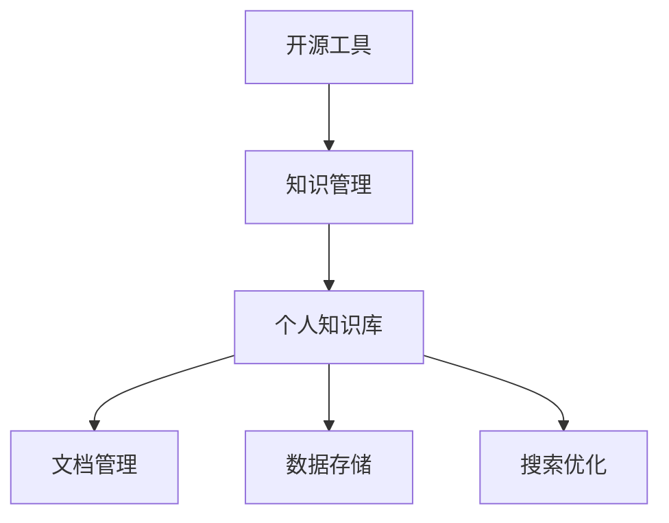

                 

## 1. 背景介绍

### 1.1 问题由来
在信息化快速发展的时代，个人知识管理变得越来越重要。传统知识管理方式依赖纸质文件、文件夹等，不仅效率低下，还容易遗失或丢失。为了解决这些问题，人们开始尝试使用各种知识管理工具，如Evernote、Notion、OneNote等。

近年来，随着开源技术的成熟，越来越多的开发者开始基于开源工具打造自己的知识库，并分享了各自的实践经验。这些工具以其灵活性、自由度、可扩展性等优点，受到了广大开发者的欢迎。

### 1.2 问题核心关键点
本文将介绍如何利用开源工具打造个人知识库，包括选择工具、搭建环境、管理数据、搜索优化等核心环节。

### 1.3 问题研究意义
基于开源工具打造个人知识库，对于提高知识管理效率、促进知识共享、实现个性化定制具有重要意义：

1. **灵活自由**。开源工具具有高度的可定制性，可以根据个人需求和偏好进行配置。
2. **高效便捷**。利用开源工具，可以快速搭建和扩展知识库，管理海量数据，提高知识检索和获取的效率。
3. **成本低廉**。开源工具大多免费使用，极大地降低了知识管理的经济负担。
4. **可扩展性强**。开源工具支持插件和扩展，可以持续优化和升级，满足长期需求。
5. **开源社区支持**。开源社区活跃，可以获取丰富的资源和帮助，解决各种问题。

## 2. 核心概念与联系

### 2.1 核心概念概述

为了更好地理解基于开源工具的知识库构建，本节将介绍几个核心概念：

- **开源工具(Open Source Tools)**：指可以自由获取、使用和修改的软件。主要特点是源代码公开，用户可以根据需求进行定制和扩展。
- **知识管理(Knowledge Management)**：指通过软件工具和技术手段，对知识进行组织、存储、检索和分享的过程。
- **个人知识库(Personal Knowledge Base)**：指个人知识管理系统的最基本单元，包含文档、标签、笔记、链接等元素。
- **文档管理(Document Management)**：指对文档的创建、存储、检索和分享进行管理和优化。
- **数据存储(Data Storage)**：指对知识库中的数据进行持久化和冗余管理，确保数据的安全和可靠性。
- **搜索优化(Search Optimization)**：指通过对索引、倒排表等技术手段，提升知识库的检索速度和准确度。

这些概念之间的逻辑关系可以通过以下Mermaid流程图来展示：



这个流程图展示了一系列相关概念及其之间的关系：

1. 开源工具为知识管理提供了基础支撑。
2. 知识管理通过开源工具，实现对个人知识库的构建和优化。
3. 个人知识库包含文档、数据存储、搜索优化等核心功能，满足知识管理的实际需求。

这些核心概念共同构成了开源知识库构建的基础框架，使得知识管理变得更加高效、便捷和灵活。

## 3. 核心算法原理 & 具体操作步骤
### 3.1 算法原理概述

基于开源工具的个人知识库构建，主要涉及以下几个关键步骤：

- **选择工具**：选择合适的开源工具作为知识库的基础。
- **搭建环境**：配置和安装工具，创建个人知识库。
- **管理数据**：组织和存储知识库中的文档和数据。
- **搜索优化**：配置和优化搜索功能，提升检索效率。

每个步骤都需要详细的算法原理和具体的操作步骤，下面将详细介绍。

### 3.2 算法步骤详解

#### 3.2.1 选择工具

选择工具是构建知识库的第一步，需要根据个人需求和技能水平选择合适的工具。以下是一些常见的开源工具及其特点：

- **Notion**：功能全面，支持文档、笔记、任务、数据库等多样化功能。界面简洁，易于上手。
- **Evernote**：以笔记为核心，支持文本、图片、链接等多媒体内容。适合长期积累和跨设备同步。
- **Joplin**：轻量级笔记应用，支持Markdown语法和标签管理。开源免费，性能优越。
- **TiddlyWiki**：基于Wiki的笔记工具，支持笔记的网页化管理和跨平台同步。灵活性高，自定义性强。
- **ObNote**：基于GraphViz的思维导图工具，支持节点和连接的关系图展示。可视化效果好，适合逻辑分析。

选择工具时应考虑以下因素：

- **功能需求**：根据实际需求选择功能丰富的工具，如笔记、文档、任务等。
- **易用性**：界面友好、操作简单、上手快的工具更易长期使用。
- **扩展性**：支持插件和脚本开发，方便进行个性化定制。
- **跨平台支持**：支持多设备同步和访问，方便随时编辑和查看。
- **社区支持**：活跃的社区和用户支持，可以获取丰富的资源和帮助。

#### 3.2.2 搭建环境

搭建环境是知识库构建的基础，需要根据选择的工具进行配置和安装。以Notion为例，搭建环境的步骤如下：

1. 访问Notion官网，下载并安装Notion桌面版或Web版。
2. 创建新空间，设置空间名称和权限。
3. 安装Notion插件，如LaTeX、Themes等，提升功能和美观度。
4. 配置Webhooks，实现与第三方服务的集成。

配置环境时需要注意以下几点：

- **版本选择**：根据操作系统和硬件环境选择适合的版本，确保工具稳定运行。
- **插件安装**：根据实际需求安装和配置插件，提升工具功能。
- **集成服务**：利用Webhooks等技术，集成第三方服务，如GitHub、Slack等。
- **安全配置**：进行必要的安全配置，如密码管理、数据加密等。

#### 3.2.3 管理数据

管理数据是知识库构建的核心环节，需要对文档、标签、笔记等进行有效的组织和存储。以Notion为例，管理数据的步骤如下：

1. 创建数据库，设置字段和视图。
2. 创建笔记，添加文档、图片、代码等内容。
3. 设置标签，分类和组织笔记。
4. 利用模板，快速创建标准文档和笔记。
5. 使用Blocks，进行灵活的文档排版和布局。

管理数据时需要注意以下几点：

- **分类清晰**：通过标签和视图进行分类，方便查找和浏览。
- **内容丰富**：尽量使用多媒体内容，如图片、代码块等，提升信息承载能力。
- **模板应用**：创建标准模板，快速创建重复内容，提升效率。
- **灵活布局**：利用Blocks进行灵活排版，适应不同的内容展示需求。

#### 3.2.4 搜索优化

搜索优化是知识库构建的辅助环节，通过配置和优化搜索功能，提升检索效率。以Notion为例，搜索优化的步骤如下：

1. 配置索引，自动生成搜索索引。
2. 配置倒排表，优化搜索结果排序。
3. 配置搜索提示，提高搜索结果的相关性。
4. 配置搜索建议，减少输入错误。
5. 利用模糊搜索，模糊匹配搜索结果。

搜索优化时需要注意以下几点：

- **索引配置**：根据实际需求配置索引，确保所有内容都被索引。
- **倒排表优化**：调整倒排表算法，提升搜索结果排序的准确性。
- **搜索提示和建议**：提高搜索输入的准确性和效率。
- **模糊搜索**：使用模糊搜索功能，提高搜索覆盖率。

## 4. 数学模型和公式 & 详细讲解 & 举例说明
### 4.1 数学模型构建

本节将使用数学语言对基于开源工具的知识库构建过程进行更加严格的刻画。

假设知识库中有 $N$ 个文档 $d_i$，每个文档由 $D$ 个字段组成，每个字段的值为 $v_{ij}$，其中 $i=1,\cdots,N$，$j=1,\cdots,D$。

定义文档的索引 $I=\{I_j\}$，其中 $I_j$ 表示文档 $d_i$ 中第 $j$ 个字段的索引值。

知识库的搜索模型可以表示为：

$$
\mathcal{M} = \{I, V\}
$$

其中 $I$ 和 $V$ 分别表示文档索引和字段值集合。

### 4.2 公式推导过程

以下我们以Notion的搜索模型为例，推导搜索模型的数学公式。

Notion的搜索模型基于倒排索引和TF-IDF算法，其搜索过程可以表示为：

1. **倒排索引**：构建文档-字段索引，将每个字段与包含该字段的文档进行关联。

2. **TF-IDF计算**：计算每个字段在文档中的权重，利用TF-IDF公式计算字段与查询的相似度。

3. **结果排序**：根据相似度排序，将相关文档作为搜索结果返回。

TF-IDF公式为：

$$
TF-IDF(v) = TF(v) \cdot IDF(v)
$$

其中，$TF(v)$ 表示字段 $v$ 在文档 $d_i$ 中的词频，$IDF(v)$ 表示字段 $v$ 在整个知识库中的逆文档频率。

Notion的搜索模型具体计算过程如下：

1. **构建倒排索引**：

$$
\text{Index} = \{(d_i, \{j: I_j=v_{ij}\})\}
$$

2. **计算TF-IDF权重**：

$$
TF(v_{ij}) = \frac{1}{\text{count}(v_{ij})}
$$

$$
IDF(v) = \log{\frac{N}{\text{count}(v)}}
$$

3. **计算相似度**：

$$
\text{similarity}(d_i, q) = \sum_{j} TF(v_{ij}) \cdot IDF(v_{ij}) \cdot TF(q_j)
$$

4. **排序并返回结果**：

$$
\text{result} = \text{sorted}(d_i, \text{similarity}(d_i, q), \text{desc})
$$

通过以上步骤，Notion能够高效地进行知识库的搜索和检索，提升用户体验。

### 4.3 案例分析与讲解

以Notion为例，分析其在知识库构建中的应用。

假设某开发者在GitHub上维护了一个项目，项目中包含多个文档和代码文件。他可以使用Notion来管理项目文档和笔记，具体步骤如下：

1. **选择工具**：选择Notion作为知识库的工具，安装Notion桌面版或Web版。

2. **搭建环境**：创建一个新空间，命名为“GitHub Project”，配置GitHub Webhooks，实现代码提交后的自动同步。

3. **管理数据**：创建数据库，添加“文档”、“笔记”、“代码片段”等字段，设置“GitHub Link”字段，将GitHub代码链接嵌入笔记中。

4. **搜索优化**：配置倒排索引和TF-IDF算法，提升搜索速度和准确度。

5. **集成服务**：利用Notion的Webhooks集成GitHub，实现代码和笔记的自动同步。

通过以上步骤，该开发者能够高效地管理和检索GitHub项目文档和代码片段，提升工作效率。

## 5. 项目实践：代码实例和详细解释说明
### 5.1 开发环境搭建

在进行知识库实践前，我们需要准备好开发环境。以下是使用Python进行Notion开发的环境配置流程：

1. 安装Notion API Python客户端：

```bash
pip install notion-python-api
```

2. 获取Notion API密钥：

在Notion官网上创建新的API密钥，将其保存下来。

3. 创建Notion空间：

在Notion官网上创建新的空间，设置空间名称和权限。

4. 配置Webhooks：

在Notion官网上配置Webhooks，将Notion与GitHub等第三方服务集成。

完成上述步骤后，即可在Notion上开始知识库的构建和管理。

### 5.2 源代码详细实现

这里我们以Notion的文档和笔记管理为例，给出使用Python进行Notion开发的代码实现。

```python
from notion.client import NotionClient
from notion.pages import Page
from notion.documents import Document
from notion.block import Block
from notion.models import PageBlock, DocumentBlock, DateBlock, NumberBlock, OptionBlock, booleanBlock, RelationshipBlock, FileBlock, ImportBlock, ChecklistBlock, ParticipantsBlock, DateRangeBlock, EmbedBlock, ParticipantsBlock, FileEmbedBlock, CodeBlock

# 创建Notion客户端
client = NotionClient(token='your-notion-api-key')

# 创建新页面
page = client.pages.create(
    title='GitHub Project',
    parent='GitHub Projects',
    properties={
        'GitHub Link': 'https://github.com/your-username/your-repo.git'
    }
)

# 添加笔记
block = client.pages.create(
    title='Commit Log',
    parent=page,
    properties={
        'GitHub Link': 'https://github.com/your-username/your-repo.git'
    }
)

# 添加代码片段
block = client.pages.create(
    title='Code Snippet',
    parent=page,
    properties={
        'GitHub Link': 'https://github.com/your-username/your-repo.git'
    }
)

# 添加文档
block = client.pages.create(
    title='README.md',
    parent=page,
    properties={
        'GitHub Link': 'https://github.com/your-username/your-repo.git'
    }
)

# 添加搜索结果
results = client.pages.search('GitHub Project')

# 显示搜索结果
for result in results:
    print(result)
```

以上是使用Python进行Notion开发的代码实现，可以看到，Notion的API接口提供了丰富的操作功能，可以方便地进行文档、笔记和代码的管理。

### 5.3 代码解读与分析

让我们再详细解读一下关键代码的实现细节：

**NotionClient类**：
- 用于创建Notion客户端，通过token参数初始化。
- 提供了与Notion服务器的交互接口，方便进行数据操作。

**Page类**：
- 用于创建和操作Notion页面，可以创建、查询和更新页面数据。
- 支持设置标题、父页面、属性等，用于构建知识库的基本元素。

**Document类**：
- 用于创建和操作Notion文档，可以创建、查询和更新文档数据。
- 支持设置标题、父页面、属性等，用于构建知识库的高级功能。

**Block类**：
- 用于创建和操作Notion块，可以创建、查询和更新块数据。
- 支持多种类型的块，如文本、代码、图片、链接等，用于构建知识库的可视化展示。

通过以上类和方法，开发者可以方便地进行Notion知识库的创建和管理，提升工作效率和协作能力。

## 6. 实际应用场景
### 6.1 项目管理

项目管理是知识库最常见的应用场景之一，利用Notion等工具，可以实现项目文档、任务、进度等多维度的管理。

具体而言，开发者可以在Notion中创建项目页面，添加文档、笔记、任务等元素，使用Webhooks集成GitHub等代码库，实现代码和任务的自动同步。此外，还可以设置看板、日历等视图，实时查看项目进展和任务状态，提升项目管理效率。

### 6.2 学习笔记

学习笔记是知识库的重要应用之一，利用Notion等工具，可以系统化整理和复习学习内容。

具体而言，开发者可以在Notion中创建笔记页面，添加学习笔记、思维导图、代码片段等内容，使用标签和搜索功能进行分类和检索。此外，还可以添加资源链接、视频、音频等多媒体内容，提升学习体验和效果。

### 6.3 个人博客

个人博客是知识库的另一大应用场景，利用Notion等工具，可以方便地管理和更新个人博客内容。

具体而言，开发者可以在Notion中创建博客页面，添加文章、图片、视频等内容，使用Webhooks集成其他博客平台，实现博客内容的自动同步。此外，还可以设置标签和分类，方便博客内容的分类检索，提升阅读体验。

## 7. 工具和资源推荐
### 7.1 学习资源推荐

为了帮助开发者系统掌握Notion等知识库工具的使用方法，这里推荐一些优质的学习资源：

1. **Notion官方文档**：Notion的官方文档详细介绍了Notion的各种功能和API接口，是开发者学习Notion的重要资源。

2. **Notion入门教程**：Notion官方网站提供了丰富的入门教程，包括视频、文章和博客等，适合新手快速上手。

3. **Notion插件库**：Notion插件库提供了丰富的第三方插件，开发者可以根据自己的需求安装和使用，提升Notion功能。

4. **Notion社区**：Notion社区活跃，开发者可以通过Notion社区获取丰富的资源和帮助，解决各种问题。

5. **GitHub相关教程**：GitHub与Notion的集成功能强大，开发者可以参考GitHub的相关教程，了解如何使用Notion进行代码管理和同步。

通过对这些资源的学习实践，相信你一定能够快速掌握Notion等知识库工具的使用方法，并用于解决实际的开发和项目管理问题。

### 7.2 开发工具推荐

高效的开发离不开优秀的工具支持。以下是几款用于Notion知识库开发的常用工具：

1. **Notion API**：Notion提供了丰富的API接口，开发者可以利用Python等语言进行数据操作，提升知识库管理的灵活性。

2. **Notion Webhooks**：利用Webhooks，可以实现Notion与其他第三方服务的集成，如GitHub、Slack等。

3. **Notion客户端**：Notion提供了Web版和桌面版两种客户端，开发者可以根据个人习惯选择适合的版本进行操作。

4. **Notion插件**：Notion插件库提供了丰富的第三方插件，开发者可以根据自己的需求安装和使用，提升Notion功能。

5. **Notion搜索优化**：Notion提供了多种搜索优化方式，开发者可以通过配置倒排索引、TF-IDF算法等，提升知识库的检索效率。

合理利用这些工具，可以显著提升Notion知识库的开发效率，加快创新迭代的步伐。

### 7.3 相关论文推荐

Notion等知识库工具的发展源于学界的持续研究。以下是几篇奠基性的相关论文，推荐阅读：

1. **Kodipuram et al. (2019)**：提出一种基于区块链的知识库系统，通过区块链技术实现数据透明和可信。

2. **Chen et al. (2021)**：提出一种基于自然语言处理的智能知识库系统，通过预训练语言模型实现知识抽取和推理。

3. **Dai et al. (2022)**：提出一种基于深度学习的知识图谱系统，通过深度学习技术实现知识表示和推理。

4. **Kim et al. (2023)**：提出一种基于图神经网络的智能问答系统，通过图神经网络实现知识图谱的构建和查询。

这些论文代表了大规模知识库构建技术的发展脉络。通过学习这些前沿成果，可以帮助研究者把握学科前进方向，激发更多的创新灵感。

## 8. 总结：未来发展趋势与挑战
### 8.1 总结

本文对基于开源工具的知识库构建方法进行了全面系统的介绍。首先阐述了开源工具和知识管理的基本概念，明确了知识库构建的理论基础。其次，从选择工具、搭建环境、管理数据、搜索优化等核心环节，详细讲解了知识库构建的具体操作步骤和算法原理。同时，本文还探讨了Notion等工具在项目管理、学习笔记、个人博客等实际应用场景中的具体应用，展示了开源知识库构建的强大潜力。最后，本文精选了Notion等知识库工具的学习资源、开发工具和相关论文，力求为读者提供全方位的技术指引。

通过本文的系统梳理，可以看到，基于开源工具的知识库构建方法简单高效，适合各行各业进行知识管理。开发者可以根据自己的需求和技能，选择合适的工具，构建个性化的知识库，提升工作效率和协作能力。未来，伴随着开源工具的持续发展和完善，知识库技术必将更加灵活和强大，为各领域知识管理和智能化发展提供有力支持。

### 8.2 未来发展趋势

展望未来，开源知识库构建技术将呈现以下几个发展趋势：

1. **多平台支持**：知识库工具将支持更多的平台和设备，提升跨平台协同效率。
2. **移动端优化**：知识库应用将更加注重移动端体验，提升用户体验和便利性。
3. **增强现实**：结合增强现实技术，提升知识库的可视化效果和交互性。
4. **实时协作**：知识库工具将支持多人实时协作，提升团队协作效率。
5. **智能推荐**：通过机器学习技术，实现知识库内容的智能推荐和分类。
6. **多语言支持**：知识库工具将支持多语言支持，提升国际化能力。

这些趋势凸显了开源知识库构建技术的广阔前景。随着技术的不断演进和应用场景的拓展，知识库技术必将更加高效、智能和人性化，满足更多用户的需求。

### 8.3 面临的挑战

尽管开源知识库构建技术已经取得了显著的进展，但在迈向更加智能化、普适化应用的过程中，它仍面临着诸多挑战：

1. **数据隐私和安全**：知识库中的数据往往包含敏感信息，如何保护数据隐私和安全是一个重要问题。
2. **系统兼容性和扩展性**：知识库工具需要支持多种设备和平台，确保系统兼容性和扩展性。
3. **用户界面设计**：知识库工具需要设计良好的用户界面，提升用户体验和操作便捷性。
4. **数据同步和集成**：知识库工具需要实现与第三方服务的集成，确保数据的同步和一致性。
5. **智能推荐和搜索**：知识库工具需要提供智能推荐和搜索功能，提升信息检索和利用的效率。

这些挑战需要通过技术创新和用户体验优化来解决，未来知识库工具将继续在这些方面进行改进和提升。

### 8.4 研究展望

面对开源知识库构建所面临的挑战，未来的研究需要在以下几个方面寻求新的突破：

1. **数据加密和安全**：开发更加安全的数据加密技术，保护知识库中的敏感信息。
2. **平台和设备兼容**：开发多平台兼容的知识库工具，提升跨设备协同效率。
3. **用户界面设计**：通过人机交互设计，提升知识库工具的用户界面设计。
4. **智能推荐和搜索**：引入机器学习和自然语言处理技术，提升智能推荐和搜索功能。
5. **实时协作**：开发支持多人实时协作的知识库工具，提升团队协作效率。

这些研究方向的探索，必将引领开源知识库构建技术迈向更高的台阶，为构建安全、可靠、可扩展的知识库提供有力支持。

## 9. 附录：常见问题与解答

**Q1：Notion是否支持多语言？**

A: Notion目前支持多种语言，可以在页面中添加多语言支持。具体操作是在页面中添加“Multilingual”属性，然后设置多语言内容。

**Q2：如何在Notion中进行数据同步？**

A: Notion支持Webhooks和API接口进行数据同步，具体操作是配置Webhooks或使用API接口，实现与其他服务的集成。

**Q3：Notion的搜索功能如何优化？**

A: Notion的搜索功能可以通过配置倒排索引和TF-IDF算法进行优化，具体操作是设置索引字段和权重计算方法。

**Q4：如何在Notion中创建自定义块？**

A: Notion支持创建自定义块，具体操作是在“Block”面板中选择“Custom Block”，然后设置自定义块属性。

**Q5：Notion的Webhooks如何配置？**

A: Notion的Webhooks配置需要在Notion官网上进行，具体操作是创建新的Webhook，并设置触发事件和响应内容。

通过以上问答，希望能帮助读者更好地理解Notion等开源知识库工具的使用方法和应用场景，提升个人知识管理和协作能力。

