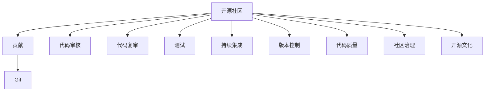

                 

# 利用开源贡献提升职业发展空间

在当今的数字化时代，开源社区已经成为技术创新的重要引擎。无论是初入编程门槛的新手，还是经验丰富的高级开发者，开源项目都是他们积累经验、提升技能、甚至改变职业生涯的关键途径。本文将深入探讨如何通过积极贡献开源项目，有效提升职业发展空间，并在开源社区中实现自我价值的最大化。

## 1. 背景介绍

### 1.1 开源社区的崛起

开源软件的兴起，从20世纪90年代中期的Linux开始，经过Apache、MySQL等众多知名项目的推广，迅速渗透到软件开发、系统管理、云服务等多个领域。现在，开源软件已经成为全球IT基础设施的核心，甚至影响着经济和社会发展的方方面面。

### 1.2 个人贡献的益处

贡献开源项目不仅可以提升技术水平，还有助于构建个人品牌，拓展职业机会，甚至在一定程度上改变个人的职业生涯轨迹。例如，谷歌的前CEOEric Schmidt就是通过为Apache软件基金会做贡献，逐步成长为业界领袖的。

### 1.3 企业对开源的重视

越来越多的公司开始重视开源，将其作为技术创新和品牌建设的重要工具。比如，亚马逊、微软、IBM等巨头，都积极参与开源项目，并从中受益。参与开源也成为了新员工入职培训的重要内容之一。

## 2. 核心概念与联系

### 2.1 核心概念概述

- **开源社区**：基于共享源码的开源项目集聚地，如GitHub、Apache、Linux基金会等。
- **贡献**：对开源项目代码的修改、新增功能、修复漏洞、文档编辑等活动。
- **Git**：分布式版本控制系统，用于管理和控制代码的版本。
- **Gerrit**：用于管理开源项目代码合并的工具。
- **Pull Request**：向开源项目提交修改或新增功能时，通过GitHub等平台提出的合并请求。
- **代码审核**：开源社区对提交的代码进行的审查和验证，以确保代码质量。
- **代码复审**：社区成员对提交的代码进行详细审查，以发现潜在问题。
- **测试**：编写自动化测试用例，确保代码质量。
- **版本控制**：如Git，用于追踪和管理代码变化。
- **持续集成**：在代码每次提交后，自动化运行测试和构建，保证代码质量。
- **贡献者**：积极参与开源项目的人，从新手到专家，都能从中受益。
- **社区治理**：开源项目的组织和运作方式，包括项目管理、贡献者管理等。
- **开源文化**：强调共享、合作、开放、透明等价值观，是开源项目成功的关键。

这些核心概念之间的关系可以用以下Mermaid流程图来表示：



## 3. 核心算法原理 & 具体操作步骤

### 3.1 算法原理概述

贡献开源项目的过程，实际上是对现有代码的增强和完善。贡献者通过Git提交修改，在Pull Request中详细描述修改内容，并接受社区其他成员的代码审核、代码复审和测试。这些流程不仅提高了代码质量，还使贡献者掌握了更全面的技能，提升了在开源社区中的影响力。

### 3.2 算法步骤详解

1. **学习与定位**：
   - 选择一个感兴趣的开源项目，了解其基本原理和代码结构。
   - 阅读文档和代码，定位自己的贡献方向，如Bug修复、新增功能、文档改进等。

2. **代码提交**：
   - 使用Git工具创建本地仓库，克隆开源项目代码到本地。
   - 编写代码并提交到本地仓库。
   - 推送到远程仓库，并发起Pull Request。

3. **代码审核**：
   - 社区成员对Pull Request进行代码审核，提出修改建议。
   - 根据建议修改代码，并重新推送到远程仓库。

4. **代码复审**：
   - 社区成员对修改后的代码进行复审，确保无误后批准合并。

5. **持续集成**：
   - 合并后的代码自动运行持续集成流程，确保无误后部署到生产环境。

6. **反馈与改进**：
   - 接受社区反馈，持续改进贡献内容，提升技能。

### 3.3 算法优缺点

**优点**：
- 提升技能：不断接触新代码和技术，快速提升编程能力。
- 社区认同：通过贡献获得社区认可，增加自信心和职业自豪感。
- 职业机会：通过在开源社区中的表现，拓展更多职业机会。

**缺点**：
- 时间投入：开源项目贡献需要大量时间投入，可能会影响其他工作。
- 学习曲线：一些开源项目代码量大、结构复杂，需要较长时间学习。
- 代码质量：代码质量要求高，需要接受社区的严格审核和审查。

### 3.4 算法应用领域

开源贡献适用于各个技术领域的开发者，包括但不限于：

- Web开发：如Angular、React、Node.js等框架。
- 移动开发：如iOS、Android等平台。
- 数据科学：如TensorFlow、PyTorch、Pandas等。
- 云服务：如AWS、Azure、Google Cloud等。
- DevOps：如Kubernetes、Docker、Jenkins等。
- 嵌入式开发：如Linux内核、FreeRTOS等。
- 系统管理：如Red Hat、VMware等。

## 4. 数学模型和公式 & 详细讲解 & 举例说明

### 4.1 数学模型构建

对于开源项目的代码贡献，主要关注代码的质量、功能和可用性，以及代码的可维护性和可扩展性。这里以一个简单的Bug修复为例，构建数学模型。

设原有代码中的Bug为：

```python
def faulty_func(x):
    if x < 0:
        return x + 1
    else:
        return x - 1
```

设贡献者提出的修正方案为：

```python
def fixed_func(x):
    if x < 0:
        return -x
    else:
        return x
```

贡献者的代码质量可通过以下指标来评估：

- **代码准确性**：修正代码是否正确解决了原有Bug。
- **代码效率**：修正代码的运行效率是否优于原有代码。
- **代码可读性**：修正代码是否易于理解和维护。

### 4.2 公式推导过程

贡献代码的质量可以通过以下数学公式来表示：

$$
Q = \frac{A + E + R}{100}
$$

其中：
- $A$ 为代码准确性评分，取值范围为0到100。
- $E$ 为代码效率评分，取值范围为0到100。
- $R$ 为代码可读性评分，取值范围为0到100。

贡献者通过不断优化代码，逐步提高$Q$值，最终达到开源项目的质量要求。

### 4.3 案例分析与讲解

以Angular项目中的Bug修复为例，贡献者需遵循以下步骤：

1. **学习项目**：了解Angular项目的基本架构和代码风格。
2. **定位Bug**：通过阅读错误信息，找到具体Bug所在位置。
3. **编写代码**：编写修复代码并提交到本地仓库。
4. **提交PR**：在GitHub上提交Pull Request，详细描述问题及其解决方案。
5. **接受审核**：社区成员对PR进行代码审核，提出修改建议。
6. **修改并合并**：根据建议修改代码，并通过审核，最终合并到主分支。

## 5. 项目实践：代码实例和详细解释说明

### 5.1 开发环境搭建

为了高效参与开源项目，需要搭建一个适合的项目开发环境。这里提供一个基于Git和GitHub的开发环境搭建指南：

1. **安装Git**：从官网下载并安装Git，确保Git版本与目标开源项目兼容。
2. **创建GitHub账号**：在GitHub上创建账号并生成SSH密钥。
3. **克隆项目代码**：使用Git克隆开源项目代码到本地。
4. **设置远程仓库**：在本地仓库中设置远程仓库，并关联到目标开源项目。
5. **安装相关工具**：根据需要安装项目所需的编译器、开发工具等。

### 5.2 源代码详细实现

以TensorFlow项目为例，介绍如何通过Git进行代码贡献：

```python
# 克隆项目到本地
git clone https://github.com/tensorflow/tensorflow.git

# 进入项目目录
cd tensorflow

# 配置远程仓库
git remote add origin https://github.com/tensorflow/tensorflow.git

# 编写代码并提交到本地仓库
echo 'def hello():' > hello.py
echo '    print("Hello, TensorFlow!")' >> hello.py
git add hello.py
git commit -m 'Add hello function'

# 推送到远程仓库
git push origin main

# 发起PR
git pull-request -m 'Add hello function'
```

### 5.3 代码解读与分析

**代码解释**：
- `git clone`：从GitHub克隆项目到本地。
- `git remote add origin`：添加远程仓库。
- `git add`：将新编写的代码添加至本地仓库。
- `git commit`：提交本地仓库的修改。
- `git push`：将本地仓库的修改推送到远程仓库。
- `git pull-request`：发起Pull Request。

**代码分析**：
- `git clone`命令需要填写开源项目的Git地址。
- `git remote add origin`需要填写远程仓库的地址。
- `git add`需要指定要提交的本地文件。
- `git commit`需要填写提交的说明信息。
- `git push`需要指定推送的远程分支。
- `git pull-request`需要填写PR的标题和描述。

### 5.4 运行结果展示

成功提交Pull Request后，可以在GitHub上查看代码审核和合并状态。审核人员会给出反馈，并要求修改代码，直至代码通过审核并合并到主分支。

## 6. 实际应用场景

### 6.1 个人品牌构建

通过在开源社区中的积极贡献，可以逐步建立起自己的技术声誉和品牌。比如，维护和改进一个流行的开源项目，可以让更多的人知道你的技术能力，增加职业机会。

### 6.2 技术交流与合作

开源项目通常有活跃的社区，开发者可以在其中交流技术、分享经验、合作开发。这不仅能够提升技能，还能结识行业内的顶尖人才，拓展人脉。

### 6.3 职业发展机会

通过贡献开源项目，可以增加简历的吸引力，提升求职成功率。一些公司甚至将开源贡献作为招聘条件之一，贡献者也因此获得了更多职业机会。

### 6.4 未来应用展望

未来，开源社区将更加注重社区治理和贡献者管理，确保贡献者的权益得到保障。随着开源项目的商业化加速，更多企业将通过开源项目来寻找技术人才，开源贡献者的价值将进一步提升。

## 7. 工具和资源推荐

### 7.1 学习资源推荐

- **Git官方文档**：Git官网提供详尽的文档，适合初学者和进阶开发者。
- **GitHub入门指南**：GitHub官方提供的入门教程，涵盖Git、GitHub和Pull Request的基本操作。
- **开源社区指南**：不同开源社区提供详细的贡献指南，如Apache基金会、Linux基金会等。
- **TensorFlow官方教程**：TensorFlow官方提供的详细教程，包括代码贡献流程。
- **Kubernetes官方文档**：Kubernetes官方提供的详细文档，涵盖部署、开发、贡献等多个方面。

### 7.2 开发工具推荐

- **Git**：最流行的版本控制系统，用于管理和控制代码版本。
- **GitHub**：全球最大的开源代码托管平台，方便开发者提交代码和交流。
- **GitHub Actions**：GitHub提供的持续集成服务，方便开发者自动化测试和部署。
- **GitLab**：与GitHub类似的开源代码托管平台，支持代码管理和持续集成。
- **Bitbucket**：Atlassian公司提供的开源代码托管平台，支持多种编程语言。

### 7.3 相关论文推荐

- **《开源社区的现状与未来》**：探讨开源社区的发展历程和未来趋势。
- **《开源项目中的贡献者行为研究》**：分析开源项目中贡献者的行为模式和动机。
- **《开源社区的治理与规则》**：介绍开源社区的治理机制和规则制定。
- **《开源社区中的技术交流与合作》**：探讨开源社区中的技术交流和合作模式。
- **《开源贡献者的职业发展路径》**：分析开源贡献者从入门到成为专家的职业发展路径。

## 8. 总结：未来发展趋势与挑战

### 8.1 研究成果总结

通过上述分析，可以看出，积极参与开源项目对提升职业发展空间具有重要意义。开源社区不仅提供了技术交流和学习的机会，还为职业发展提供了新的舞台。

### 8.2 未来发展趋势

未来，开源社区将更加注重社区治理和贡献者管理，确保贡献者的权益得到保障。随着开源项目的商业化加速，更多企业将通过开源项目来寻找技术人才，开源贡献者的价值将进一步提升。

### 8.3 面临的挑战

尽管开源贡献对职业发展具有显著益处，但面临的挑战也不容忽视：

1. **时间管理**：开源项目贡献需要大量时间投入，可能会影响其他工作。
2. **技术复杂性**：一些开源项目代码量大、结构复杂，需要较长时间学习。
3. **代码质量要求**：开源项目对代码质量有较高要求，需要接受社区的严格审核和审查。
4. **社区文化差异**：开源社区的文化和工作方式可能与公司内部有所不同，需要适应和融入。

### 8.4 研究展望

未来的研究应聚焦于以下几个方向：

1. **贡献流程优化**：研究如何优化开源项目的贡献流程，减少贡献者的学习成本和时间投入。
2. **社区文化建设**：研究如何建立更加包容、协作的开源社区文化，提升贡献者的参与感和满意度。
3. **技术支持增强**：研究如何提供更好的技术支持和资源，帮助贡献者更好地完成贡献。
4. **职业发展路径**：研究如何为开源贡献者提供清晰的职业发展路径，提升他们的职业期望和成就动机。

总之，开源贡献不仅能够提升技术水平，还能扩展职业机会，提升职业竞争力。通过积极参与开源项目，开发者可以在技术交流、合作和职业发展中不断成长，实现自我价值最大化。

## 9. 附录：常见问题与解答

**Q1: 如何选择一个适合自己的开源项目？**

A: 选择适合自己的开源项目应考虑以下几个因素：
1. 项目规模：选择规模适中、活跃的项目，避免陷入大项目的复杂性。
2. 社区活跃度：选择社区活跃的项目，便于获得支持和交流。
3. 技术栈：选择与自身技术栈相关的项目，便于快速上手。
4. 问题列表：选择问题较多、需求明确的项目，便于找到贡献方向。

**Q2: 如何确保代码质量？**

A: 确保代码质量需要遵循以下步骤：
1. 编写详尽的文档，说明代码改动内容。
2. 使用自动化测试工具，确保代码通过测试。
3. 参与社区讨论，接受社区反馈和审核。
4. 持续改进代码，逐步提升代码质量。

**Q3: 如何提升代码审核速度？**

A: 提升代码审核速度需要以下几个策略：
1. 提供详尽的文档和说明，让审核者快速理解代码改动。
2. 编写高效的测试用例，减少审核者的调试时间。
3. 保持代码风格一致，提升代码的可读性。
4. 快速回复审核意见，及时修正代码。

**Q4: 如何平衡开源贡献与本职工作？**

A: 平衡开源贡献与本职工作需要以下几个策略：
1. 制定明确的时间表，合理安排开源贡献时间。
2. 提高代码效率，减少贡献时间。
3. 利用零碎时间，进行代码审查和测试。
4. 与公司协商，获得一定的开源贡献时间支持。

**Q5: 如何提升代码可读性？**

A: 提升代码可读性需要以下几个策略：
1. 编写清晰的注释，说明代码的作用和目的。
2. 使用一致的命名规范，提高代码的可理解性。
3. 模块化设计，将复杂代码拆分成独立模块。
4. 使用代码格式化工具，保持代码风格一致。

---

作者：禅与计算机程序设计艺术 / Zen and the Art of Computer Programming

