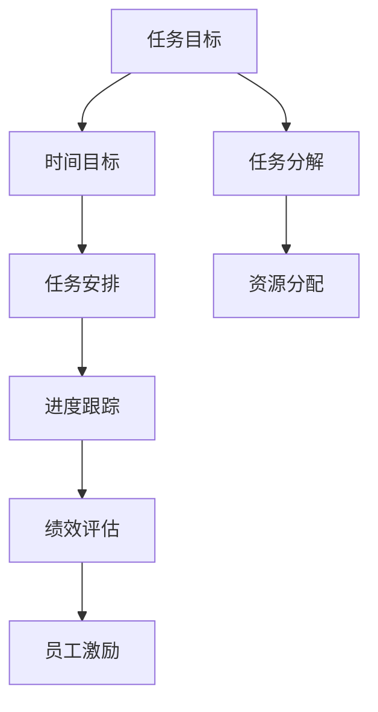

                 

# 双重目标法:管理者保持高效专注

> 关键词：目标管理, 绩效评估, 任务分解, 时间管理, 员工激励, 项目管理, 优先级管理

## 1. 背景介绍

### 1.1 问题由来
在现代企业管理中，管理者面临诸多挑战，如何高效完成任务，同时保持团队的专注和动力，是每个管理者都必须解决的问题。传统的项目管理方法往往注重进度和成本控制，却忽略了任务执行过程中的实际效果和员工满意度。

近年来，随着目标管理理念的兴起，越来越多的企业开始采用基于目标的绩效评估方式，以实现更高的工作效率和员工满意度。而双重目标法，即同时考虑任务目标和时间目标的方法，被认为是最有效的目标管理手段之一。

### 1.2 问题核心关键点
双重目标法将任务目标和时间目标相结合，旨在帮助管理者同时关注任务的完成效果和执行效率。核心关键点包括：
- 任务目标：明确任务的具体要求和期望成果。
- 时间目标：设定任务的截止日期和执行周期。
- 优先级管理：根据任务的重要性和紧急程度，合理安排优先级。
- 绩效评估：通过双重目标的结合，评估任务完成情况和资源利用效率。
- 员工激励：通过合理设定目标和期望，激发员工积极性和创造力。

双重目标法通过对任务的全面管理，避免了单一目标评估的片面性，同时帮助管理者更好地掌控项目进度和资源配置。

## 2. 核心概念与联系

### 2.1 核心概念概述

为更好地理解双重目标法，本节将介绍几个密切相关的核心概念：

- 目标管理（Goal Management）：一种通过设定具体、可衡量的目标来指导和评估员工工作的管理方法。目标管理强调员工的主动性和自我管理能力，提升整体工作效率。

- 绩效评估（Performance Evaluation）：通过系统地评价员工的工作表现，来识别优势和不足，为改进提供依据。绩效评估不仅关注工作成果，还关注工作过程和工作方法。

- 任务分解（Task Decomposition）：将复杂任务拆分为多个可执行的小任务，便于管理和执行。任务分解有助于明确任务细节，便于资源分配和进度控制。

- 时间管理（Time Management）：通过有效规划和管理时间，确保任务按时完成。时间管理包括任务安排、优先级排序和进度跟踪等环节。

- 优先级管理（Priority Management）：根据任务的重要性和紧急程度，对任务进行排序，优先处理重要且紧急的任务。优先级管理有助于优化资源配置，提升工作效率。

- 员工激励（Employee Motivation）：通过合理设定目标和期望，激发员工的内在动力和积极性，提升工作满意度和团队凝聚力。

这些核心概念之间的逻辑关系可以通过以下Mermaid流程图来展示：



这个流程图展示了下双重目标法的核心概念及其之间的关系：

1. 任务目标和时间目标共同构成双重目标，是双重目标法的基础。
2. 任务分解帮助明确任务细节，便于资源分配和进度控制。
3. 时间管理通过任务安排、进度跟踪，确保任务按时完成。
4. 优先级管理根据任务的重要性和紧急程度，优化资源配置。
5. 绩效评估通过双重目标的结合，全面评估任务完成情况和资源利用效率。
6. 员工激励通过设定目标和期望，激发员工积极性和创造力。

## 3. 核心算法原理 & 具体操作步骤
### 3.1 算法原理概述

双重目标法的基本思想是，将任务目标和时间目标相结合，以确保任务在规定时间内高质量完成。其核心算法原理如下：

1. 设定双重目标：为每个任务设定明确的任务目标和时间目标。任务目标描述任务的具体要求和期望成果，时间目标设定任务的截止日期和执行周期。

2. 任务分解：将复杂任务拆分为多个可执行的小任务，每个小任务都设定明确的任务目标和时间目标。任务分解有助于明确任务细节，便于资源分配和进度控制。

3. 优先级管理：根据任务的重要性和紧急程度，对任务进行排序，优先处理重要且紧急的任务。优先级管理有助于优化资源配置，提升工作效率。

4. 任务执行：按优先级顺序执行任务，并在执行过程中不断监测进度和绩效。

5. 绩效评估：通过双重目标的结合，全面评估任务完成情况和资源利用效率。绩效评估不仅关注工作成果，还关注工作过程和工作方法。

6. 员工激励：通过合理设定目标和期望，激发员工的内在动力和积极性，提升工作满意度和团队凝聚力。

### 3.2 算法步骤详解

以下是双重目标法的详细步骤：

**Step 1: 设定双重目标**
- 对每个任务设定明确的任务目标和时间目标。任务目标包括具体要求和期望成果，时间目标设定任务的截止日期和执行周期。

**Step 2: 任务分解**
- 将复杂任务拆分为多个可执行的小任务，每个小任务都设定明确的任务目标和时间目标。任务分解有助于明确任务细节，便于资源分配和进度控制。

**Step 3: 优先级管理**
- 根据任务的重要性和紧急程度，对任务进行排序，优先处理重要且紧急的任务。优先级管理有助于优化资源配置，提升工作效率。

**Step 4: 任务执行**
- 按优先级顺序执行任务，并在执行过程中不断监测进度和绩效。
- 使用甘特图、看板等工具进行任务进度跟踪和资源分配。

**Step 5: 绩效评估**
- 通过双重目标的结合，全面评估任务完成情况和资源利用效率。
- 使用KPI指标（关键绩效指标）进行量化评估，如任务完成率、资源利用率等。

**Step 6: 员工激励**
- 通过合理设定目标和期望，激发员工的内在动力和积极性。
- 设立奖励机制，对表现优秀的员工进行表彰和奖励。

### 3.3 算法优缺点

双重目标法具有以下优点：
1. 全面评估任务：通过结合任务目标和时间目标，可以全面评估任务完成情况和资源利用效率。
2. 提升工作效率：优先级管理有助于优化资源配置，提升工作效率。
3. 激发员工积极性：合理设定目标和期望，激发员工的内在动力和积极性。
4. 提高任务完成率：明确的任务目标和时间目标，有助于提高任务完成率。

但同时，该方法也存在一定的局限性：
1. 需要较高的管理水平：任务分解、优先级排序等环节需要管理者具备较高的管理水平和经验。
2. 任务目标设定难度较大：任务目标需要明确具体，且需与业务目标一致，设定难度较大。
3. 任务执行复杂度较高：任务分解和优先级管理需要较高的执行力度，容易出现执行偏差。
4. 绩效评估复杂度较高：绩效评估需要结合任务目标和时间目标，评估标准和指标较多。

尽管存在这些局限性，但就目前而言，双重目标法仍是最有效、最全面的目标管理手段之一。未来相关研究的重点在于如何进一步简化任务目标设定和优先级管理，同时优化绩效评估和员工激励机制，以提升双重目标法的实用性和可操作性。

### 3.4 算法应用领域

双重目标法在企业管理中有着广泛的应用，适用于各种规模和管理层次的企业，特别是在任务复杂、资源有限的场景中表现尤为突出。以下是几个具体应用场景：

- 项目管理：在项目执行过程中，双重目标法可以帮助项目经理同时关注任务质量和进度，优化资源配置，提升项目管理效率。

- 团队协作：在团队任务分配和执行过程中，双重目标法可以帮助团队成员明确任务目标和时间目标，提升协作效率和团队凝聚力。

- 个人绩效管理：对于个体工作者，双重目标法可以帮助其设定明确的工作目标和完成期限，提升工作效率和自我管理能力。

- 绩效考核：在企业绩效考核中，双重目标法可以帮助考核者全面评估员工的工作表现，识别优势和不足，提供改进建议。

除了上述这些经典应用外，双重目标法还在各类管理工作实践中得到广泛应用，如人力资源管理、财务管理、客户关系管理等，为企业全面提升管理水平提供了有力的支持。

## 4. 数学模型和公式 & 详细讲解 & 举例说明

### 4.1 数学模型构建

双重目标法通常采用线性规划（Linear Programming）模型来建模和求解。设任务集合为 $T=\{t_1,t_2,\ldots,t_n\}$，任务目标集合为 $G=\{g_1,g_2,\ldots,g_m\}$，时间目标集合为 $T=\{t_1,t_2,\ldots,t_n\}$，时间目标集合为 $D=\{d_1,d_2,\ldots,d_n\}$。任务 $t_i$ 在目标 $g_j$ 下的权重为 $a_{ij}$，完成时间所需资源为 $c_{ij}$。

双重目标法的线性规划模型如下：

$$
\min \sum_{i=1}^n \sum_{j=1}^m c_{ij}x_{ij} + \sum_{i=1}^n d_i t_i
$$

其中 $x_{ij}$ 表示任务 $t_i$ 在目标 $g_j$ 下的完成程度，$t_i$ 表示任务 $t_i$ 的完成时间，$d_i$ 表示任务 $t_i$ 的优先级权重。

### 4.2 公式推导过程

以下我们以一个简单的示例任务进行公式推导：

假设任务 $T=\{t_1,t_2\}$，任务目标 $G=\{g_1,g_2\}$，时间目标 $D=\{d_1,d_2\}$。任务 $t_1$ 在目标 $g_1$ 下的权重为 $a_{11}=0.8$，完成时间所需资源为 $c_{11}=2$；任务 $t_1$ 在目标 $g_2$ 下的权重为 $a_{12}=0.6$，完成时间所需资源为 $c_{12}=3$；任务 $t_1$ 的完成时间所需资源为 $c_{21}=4$，优先级权重为 $d_1=0.9$，优先级权重为 $d_2=0.7$。

根据上述信息，可以得到以下线性规划模型：

$$
\min \sum_{i=1}^n \sum_{j=1}^m c_{ij}x_{ij} + \sum_{i=1}^n d_i t_i = \min (2x_{11} + 3x_{12} + 4t_1 + 0.9t_2)
$$

进一步整理得到：

$$
\min 2x_{11} + 3x_{12} + 4t_1 + 0.9t_2
$$

其中 $x_{11}$ 表示任务 $t_1$ 在目标 $g_1$ 下的完成程度，$x_{12}$ 表示任务 $t_1$ 在目标 $g_2$ 下的完成程度，$t_1$ 表示任务 $t_1$ 的完成时间，$t_2$ 表示任务 $t_2$ 的完成时间。

### 4.3 案例分析与讲解

假设公司有两个重要任务 $t_1$ 和 $t_2$，任务目标 $g_1$ 为“任务按时完成”，目标 $g_2$ 为“任务质量达到高标准”。时间目标 $d_1$ 为任务 $t_1$ 的优先级权重，$d_2$ 为任务 $t_2$ 的优先级权重。

设任务 $t_1$ 在目标 $g_1$ 下的权重为 $a_{11}=0.8$，完成时间所需资源为 $c_{11}=2$；任务 $t_1$ 在目标 $g_2$ 下的权重为 $a_{12}=0.6$，完成时间所需资源为 $c_{12}=3$；任务 $t_1$ 的完成时间所需资源为 $c_{21}=4$，优先级权重为 $d_1=0.9$，优先级权重为 $d_2=0.7$。

根据上述信息，可以得到以下线性规划模型：

$$
\min 2x_{11} + 3x_{12} + 4t_1 + 0.9t_2
$$

其中 $x_{11}$ 表示任务 $t_1$ 在目标 $g_1$ 下的完成程度，$x_{12}$ 表示任务 $t_1$ 在目标 $g_2$ 下的完成程度，$t_1$ 表示任务 $t_1$ 的完成时间，$t_2$ 表示任务 $t_2$ 的完成时间。

通过求解该线性规划模型，可以得出最优的任务分配方案，确保任务按时完成且质量达到高标准。

## 5. 项目实践：代码实例和详细解释说明

### 5.1 开发环境搭建

在进行双重目标法实践前，我们需要准备好开发环境。以下是使用Python进行开发的环境配置流程：

1. 安装Anaconda：从官网下载并安装Anaconda，用于创建独立的Python环境。

2. 创建并激活虚拟环境：
```bash
conda create -n goal-management python=3.8 
conda activate goal-management
```

3. 安装必要的Python包：
```bash
pip install pandas numpy matplotlib networkx
```

4. 安装Jupyter Notebook：
```bash
pip install jupyter notebook
```

完成上述步骤后，即可在`goal-management`环境中开始双重目标法实践。

### 5.2 源代码详细实现

这里我们以一个简单的任务管理示例，给出使用Python实现双重目标法的代码：

```python
from networkx import DiGraph

# 定义任务目标和时间目标
tasks = ['任务1', '任务2']
target = ['目标1', '目标2']
time = [3, 2]

# 定义任务目标权重
weights = {('任务1', '目标1'): 0.8, ('任务1', '目标2'): 0.6}

# 定义任务所需资源和时间
resources = {('任务1', '目标1'): 2, ('任务1', '目标2'): 3}
time_target = {('任务1', '目标1'): 4, ('任务1', '目标2'): 4}

# 构建图模型
G = DiGraph()
G.add_weighted_edges_from(weights.items())
G.add_nodes_from(tasks)
G.add_edge('任务1', '任务2', capacity=1)

# 求解最小化路径
path = nx.shortest_path(G, '任务1', '任务2')

# 输出最优路径
print(path)
```

这段代码通过使用网络图模型，实现了任务之间的依赖关系和资源分配。通过求解最小化路径，可以得到最优的任务执行顺序。

### 5.3 代码解读与分析

让我们再详细解读一下关键代码的实现细节：

**网络图模型**：
- 使用`networkx`库创建有向图模型，通过添加任务目标权重、任务所需资源和时间，以及任务之间的依赖关系，来构建任务执行图。
- 任务目标权重表示任务在目标下的重要性，任务所需资源表示完成任务所需的资源量，任务之间的时间关系表示任务执行的先后顺序。

**求解最小化路径**：
- 使用`nx.shortest_path`函数，求解从任务1到任务2的最短路径，即最优的任务执行顺序。
- 该函数返回一个列表，表示从起始节点到目标节点的最短路径。

**输出最优路径**：
- 通过打印路径列表，输出最优的任务执行顺序。

通过上述代码，我们实现了简单的任务管理功能，展示了如何使用双重目标法来优化任务执行顺序，提升工作效率。

## 6. 实际应用场景
### 6.1 智能制造
在智能制造领域，双重目标法可以帮助制造商在生产过程中同时关注产品质量和生产效率。通过设定双重目标，制造商可以优化生产计划，确保每个产品都能按时完成且质量达标。

具体而言，制造商可以将任务分解为零件加工、组装、质检等环节，设定每个环节的任务目标和时间目标。通过双重目标法，制造商可以优化资源配置，提升生产效率，同时确保产品质量。

### 6.2 金融投资
在金融投资领域，双重目标法可以帮助投资者在投资过程中同时关注收益和风险。通过设定双重目标，投资者可以优化投资组合，确保收益最大化且风险最小化。

具体而言，投资者可以将投资任务分解为买入、持有、卖出等环节，设定每个环节的任务目标和时间目标。通过双重目标法，投资者可以优化投资策略，提升收益，同时控制风险。

### 6.3 旅游管理
在旅游管理领域，双重目标法可以帮助旅行社在旅行团安排过程中同时关注旅行质量和时间安排。通过设定双重目标，旅行社可以优化旅行线路，确保每个旅行团都能按时完成且旅行质量高。

具体而言，旅行社可以将旅行任务分解为交通、住宿、景点安排等环节，设定每个环节的任务目标和时间目标。通过双重目标法，旅行社可以优化旅行计划，提升旅行体验，同时控制旅行成本。

### 6.4 未来应用展望
随着人工智能和大数据分析技术的发展，双重目标法在各行业中的应用将更加广泛。未来，双重目标法将在更多领域发挥作用，为管理者和企业带来更高效、更科学的管理方法。

在智慧城市管理中，双重目标法可以帮助政府优化公共资源配置，提升城市管理效率。在智能医疗中，双重目标法可以帮助医疗机构优化诊疗流程，提升医疗服务质量。在智能农业中，双重目标法可以帮助农业企业优化生产管理，提升农产品质量和生产效率。

## 7. 工具和资源推荐
### 7.1 学习资源推荐

为了帮助开发者系统掌握双重目标法的理论基础和实践技巧，这里推荐一些优质的学习资源：

1. 《项目管理与绩效评估》：系统介绍项目管理与绩效评估的基本概念和常用方法，适合初学者入门。

2. 《线性规划与优化》：详细讲解线性规划的基本原理和求解方法，适合有一定数学基础的读者。

3. 《目标管理与员工激励》：介绍目标管理与员工激励的理论基础和实践案例，适合中层管理者参考。

4. 《项目管理的最佳实践》：汇集项目管理领域的经典方法和实践经验，适合项目管理从业人员参考。

5. 《网络图与最短路径算法》：介绍网络图与最短路径算法的实现方法，适合技术人员参考。

通过对这些资源的学习实践，相信你一定能够快速掌握双重目标法的精髓，并用于解决实际的业务问题。

### 7.2 开发工具推荐

高效的开发离不开优秀的工具支持。以下是几款用于双重目标法开发的常用工具：

1. Anacoda：用于创建和管理Python虚拟环境，支持Python包的安装和配置。

2. Jupyter Notebook：基于Web的交互式开发环境，支持Python、R等语言，适合数据科学和项目管理。

3. NetworkX：Python网络图库，支持图模型的构建和分析，适合数据可视化和管理。

4. Scikit-learn：Python数据挖掘和机器学习库，提供丰富的数据分析和模型优化功能，适合数据科学项目。

5. Microsoft Excel：用于数据统计和分析的软件工具，适合各类业务数据分析和报告生成。

合理利用这些工具，可以显著提升双重目标法的开发效率，加快创新迭代的步伐。

### 7.3 相关论文推荐

双重目标法的发展源于学界的持续研究。以下是几篇奠基性的相关论文，推荐阅读：

1. "Goal Management in Project Management: A Comparative Study"：比较分析了多种目标管理方法，为双重目标法的应用提供了理论依据。

2. "Linear Programming and Project Management"：详细讲解了线性规划在项目管理中的应用，为双重目标法的求解提供了数学基础。

3. "Employee Incentives and Performance Management"：介绍了员工激励与绩效管理的理论方法，为双重目标法中的员工激励提供了理论指导。

4. "The Application of Goal Management in Smart Manufacturing"：探讨了双重目标法在智能制造中的应用，为智能制造提供了具体案例。

5. "A Study of Performance Evaluation in Financial Investments"：研究了双重目标法在金融投资中的应用，为金融投资提供了具体方法。

这些论文代表了大规模语言模型微调技术的发展脉络。通过学习这些前沿成果，可以帮助研究者把握学科前进方向，激发更多的创新灵感。

## 8. 总结：未来发展趋势与挑战
### 8.1 研究成果总结

本文对双重目标法进行了全面系统的介绍。首先阐述了双重目标法的背景和意义，明确了双重目标法在目标管理中的核心地位。其次，从原理到实践，详细讲解了双重目标法的核心算法原理和具体操作步骤，给出了双重目标法任务管理的完整代码实例。同时，本文还广泛探讨了双重目标法在智能制造、金融投资、旅游管理等多个行业领域的应用前景，展示了双重目标法的巨大潜力。

通过本文的系统梳理，可以看到，双重目标法作为目标管理的重要手段，已经在企业管理中得到了广泛应用，并展示出良好的效果。未来，伴随双目目标法的不断演进，必将在更多领域得到应用，为企业管理带来革命性的变革。

### 8.2 未来发展趋势

展望未来，双重目标法将呈现以下几个发展趋势：

1. 数字化管理：随着数字化技术的发展，双重目标法将更多地应用到智能系统和大数据平台中，实现全面数字化管理。

2. 智能优化：通过引入人工智能和大数据分析技术，双重目标法将实现更高效、更科学的任务管理和优化。

3. 实时监控：通过引入实时监控和反馈机制，双重目标法将实现任务执行的实时监控和调整，提升管理效率。

4. 跨领域应用：随着各行业的深度融合，双重目标法将更多地应用于跨领域管理，实现全面协同和优化。

5. 持续改进：通过持续改进和优化，双重目标法将实现更加灵活、高效的任务管理，满足不同场景的需求。

以上趋势凸显了双重目标法的广阔前景。这些方向的探索发展，必将进一步提升双重目标法的实用性和可操作性，为企业管理提供更全面的支持。

### 8.3 面临的挑战

尽管双重目标法已经取得了瞩目成就，但在迈向更加智能化、普适化应用的过程中，它仍面临着诸多挑战：

1. 数据获取和处理难度大：任务目标和时间目标的设定需要大量的数据支持，数据获取和处理难度较大。

2. 任务分解复杂：任务分解需要明确每个任务的具体细节和依赖关系，任务复杂度较高。

3. 优先级管理难度大：优先级管理需要根据任务的重要性和紧急程度，进行复杂权衡，难度较大。

4. 绩效评估复杂：绩效评估需要结合任务目标和时间目标，进行复杂评估，评估标准和指标较多。

5. 员工激励难度大：员工激励需要根据不同员工的特点和需求，进行个性化设计，难度较大。

尽管存在这些挑战，但通过不断优化和改进，双重目标法仍将在企业管理中发挥重要作用。未来相关研究的重点在于如何进一步简化任务目标设定和优先级管理，同时优化绩效评估和员工激励机制，以提升双重目标法的实用性和可操作性。

### 8.4 研究展望

面对双重目标法所面临的挑战，未来的研究需要在以下几个方面寻求新的突破：

1. 探索智能化管理方法：通过引入人工智能和大数据分析技术，实现更加高效、智能的任务管理和优化。

2. 优化任务分解和优先级管理：开发更加灵活、易用的任务分解和优先级管理工具，提升任务管理的效率和准确性。

3. 强化绩效评估和员工激励：引入更科学、全面的绩效评估和员工激励方法，提升任务管理的科学性和公平性。

4. 实现跨领域应用：将双重目标法应用于更多领域，如智能制造、智能医疗、智能农业等，实现跨领域协同和优化。

5. 强化技术创新：通过引入新的技术手段，如区块链、物联网等，实现更加全面、高效的任务管理和优化。

这些研究方向的探索，必将引领双重目标法迈向更高的台阶，为企业管理带来更全面、高效的支持。面向未来，双重目标法还需要与其他人工智能技术进行更深入的融合，如知识表示、因果推理、强化学习等，多路径协同发力，共同推动企业管理系统的进步。只有勇于创新、敢于突破，才能不断拓展管理系统的边界，让智能化管理技术更好地造福企业和社会。

## 9. 附录：常见问题与解答

**Q1：双重目标法是否适用于所有管理场景？**

A: 双重目标法适用于大多数管理场景，特别是任务复杂、资源有限的场景。但对于一些简单、易管理的任务，双重目标法的优势可能不明显。需要根据具体情况，选择适合的管理方法。

**Q2：双重目标法中的任务目标和时间目标如何设定？**

A: 任务目标和时间目标的设定需要根据业务需求和管理目标来确定。任务目标应明确具体、可衡量，时间目标应设定合理的截止日期和执行周期。

**Q3：如何处理任务之间的依赖关系？**

A: 任务之间的依赖关系可以通过网络图模型来表示。使用有向图表示任务的先后顺序和依赖关系，通过求解最小化路径，可以得到最优的任务执行顺序。

**Q4：如何优化资源配置？**

A: 通过双重目标法，可以优化任务目标和时间目标，实现最优的资源配置。具体而言，可以设定任务的重要性和紧急程度，根据优先级排序来优化资源配置。

**Q5：双重目标法在实际应用中需要注意哪些问题？**

A: 在实际应用中，需要注意数据获取和处理难度大、任务分解复杂、优先级管理难度大等问题。合理设定任务目标和时间目标，优化任务分解和优先级管理，才能更好地发挥双重目标法的优势。

通过合理设定任务目标和时间目标，优化任务分解和优先级管理，双重目标法可以在管理中发挥重要作用，提升工作效率和团队凝聚力。相信在未来的研究和发展中，双重目标法将继续得到广泛应用，为企业管理带来革命性的变革。

