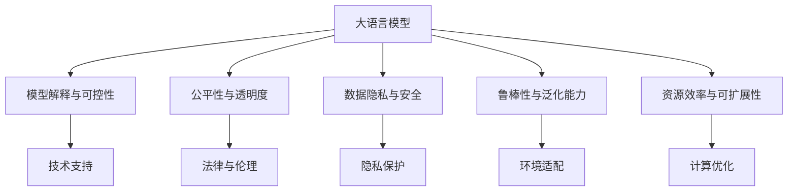

                 

# 后 LLM 时代思考：AI 的持续影响

> 关键词：

## 1. 背景介绍

### 1.1 问题由来
人工智能（AI）技术的快速发展，特别是深度学习（Deep Learning）和机器学习（Machine Learning）领域的突破，使得大语言模型（Large Language Models, LLMs）成为了自然语言处理（Natural Language Processing, NLP）领域的一大热点。LLMs 如 GPT-3、BERT 等，通过在海量无标签文本数据上进行预训练，学习到了丰富的语言知识和常识，展现了卓越的自然语言理解和生成能力。然而，随着 LLMs 技术的成熟和应用扩展，新的挑战和问题也逐渐显现。

### 1.2 问题核心关键点
后 LLM 时代，AI 技术的持续影响将主要体现在以下几个方面：

- **伦理和公平性**：随着 LLMs 被应用于各种决策支持系统，如金融、医疗、司法等，如何确保模型的公平性、透明性和可解释性成为了核心问题。
- **模型解释和可控性**：如何构建可解释的 AI 模型，使其决策过程透明，可解释性更好，成为学术界和工业界共同关注的话题。
- **数据隐私与安全**：在大规模数据训练和使用过程中，如何保护用户隐私，防止数据泄露和滥用，成为伦理和法律层面必须解决的问题。
- **模型的鲁棒性和泛化能力**：如何在不同场景下，保证 LLMs 的鲁棒性，避免过拟合和泛化能力不足的问题。
- **资源效率与可扩展性**：如何在保证模型性能的同时，优化计算资源使用，提升模型训练和推理效率。

### 1.3 问题研究意义
后 LLM 时代，理解并解决这些问题对于推动 AI 技术在各个领域的落地应用具有重要意义：

- **促进技术进步**：解决上述问题将推动 LLMs 技术的进一步发展，提升其在各种实际应用中的表现。
- **保障应用安全**：确保 AI 系统的安全性和可靠性，避免因模型错误导致的严重后果。
- **提升用户体验**：增强模型的解释性和公平性，提高用户对 AI 系统的信任度和接受度。
- **推动产业升级**：通过解决实际问题，推动 AI 技术在各行各业的深入应用，促进经济和社会发展。

## 2. 核心概念与联系

### 2.1 核心概念概述

在后 LLM 时代，理解大语言模型的持续影响，需要对以下几个关键概念有清晰的认识：

- **大语言模型（LLMs）**：如 GPT-3、BERT 等，通过大规模无标签数据预训练，学习通用语言表示，具备强大的语言理解和生成能力。
- **模型解释与可控性**：指模型的决策过程是否透明、可解释，以及如何通过技术手段控制模型的行为。
- **公平性与透明度**：指模型是否公平对待不同群体，以及模型决策的透明度，确保模型不产生歧视性偏见。
- **数据隐私与安全**：指在使用 LLMs 过程中，如何保护用户隐私，防止数据泄露和滥用。
- **鲁棒性与泛化能力**：指模型在面对不同场景和数据时，能否保持稳定性能和泛化能力。
- **资源效率与可扩展性**：指如何优化模型训练和推理过程，以提高计算资源利用效率，支持大规模模型的应用。

### 2.2 核心概念联系（Mermaid 流程图）



这个流程图展示了大语言模型与相关核心概念之间的逻辑关系：

1. 大语言模型（A）的训练与应用过程中，涉及模型解释与可控性（B）、公平性与透明度（C）、数据隐私与安全（D）、鲁棒性与泛化能力（E）以及资源效率与可扩展性（F）。
2. 这些核心概念相互关联，共同构成了后 LLM 时代 AI 技术的全面考量。
3. 技术支持（G）、法律与伦理（H）、隐私保护（I）、环境适配（J）、计算优化（K）等措施，都在不同层面上支撑大语言模型的健康发展。

## 3. 核心算法原理 & 具体操作步骤

### 3.1 算法原理概述

后 LLM 时代，AI 的持续影响主要体现在对大语言模型应用过程中的一系列优化和改进上。这些优化和改进涉及模型解释、公平性、数据隐私、鲁棒性、资源效率等多个方面。

**3.1.1 模型解释与可控性**

模型解释与可控性的核心在于提高模型的透明性和可解释性，使其决策过程可以被理解和信任。以下是一些关键技术：

- **可解释模型架构**：使用结构化的模型架构，如决策树、规则集等，使模型行为可解释。
- **对抗样本分析**：通过构造对抗样本，分析模型对输入的敏感度，增强模型的鲁棒性。
- **层级解释**：将模型划分为多个层次，每个层次解释其决策过程，帮助理解模型整体行为。

**3.1.2 公平性与透明度**

公平性与透明度的目标是确保模型在处理不同群体时，不产生偏见，并保持透明。关键技术包括：

- **数据集平衡**：确保训练数据集平衡，避免模型偏向某些群体。
- **偏差检测与修正**：使用偏差检测算法，识别并修正模型中的偏见。
- **可解释性分析**：通过可解释性技术，分析模型决策过程中的偏见来源。

**3.1.3 数据隐私与安全**

数据隐私与安全关注在使用大语言模型时，如何保护用户隐私。主要技术有：

- **差分隐私**：在数据处理过程中，添加噪声，保护个人隐私。
- **联邦学习**：在分布式环境中，训练模型，减少数据泄露风险。
- **隐私保护模型**：设计隐私保护算法，确保数据在模型训练过程中不被滥用。

**3.1.4 鲁棒性与泛化能力**

鲁棒性与泛化能力的核心在于增强模型在不同场景下的稳定性和适应性。关键技术包括：

- **对抗训练**：在训练过程中，引入对抗样本，增强模型的鲁棒性。
- **多模态学习**：结合文本、图像、语音等多模态数据，提高模型的泛化能力。
- **自适应学习**：根据环境变化，自适应调整模型参数，提高泛化能力。

**3.1.5 资源效率与可扩展性**

资源效率与可扩展性的目标是优化计算资源使用，支持大规模模型的应用。关键技术有：

- **模型压缩**：通过剪枝、量化等技术，减少模型大小，提升计算效率。
- **分布式训练**：使用分布式计算技术，加速模型训练过程。
- **混合精度计算**：使用混合精度计算，减少内存和计算资源消耗。

### 3.2 算法步骤详解

**3.2.1 模型解释与可控性**

1. **数据预处理**：对原始数据进行清洗和标准化，去除噪声和异常值。
2. **模型选择与设计**：选择合适的模型架构，如规则集、决策树等，并设计可解释性模块。
3. **训练与优化**：在训练过程中，使用可解释性技术，如层级解释，优化模型参数，提高模型透明性。
4. **测试与评估**：通过对抗样本测试，评估模型鲁棒性，确保模型公平性和透明度。

**3.2.2 公平性与透明度**

1. **数据集平衡**：对训练数据集进行平衡处理，确保各个群体的样本数量相近。
2. **偏差检测与修正**：使用偏差检测算法，识别模型中的偏见，并进行修正。
3. **可解释性分析**：使用可解释性技术，分析模型决策过程，找出偏见来源。
4. **测试与评估**：在不同群体数据上测试模型公平性，确保模型透明度。

**3.2.3 数据隐私与安全**

1. **差分隐私**：在数据处理过程中，添加噪声，保护个人隐私。
2. **联邦学习**：在分布式环境中，训练模型，减少数据泄露风险。
3. **隐私保护模型**：设计隐私保护算法，确保数据在模型训练过程中不被滥用。
4. **测试与评估**：评估隐私保护措施的效果，确保数据安全。

**3.2.4 鲁棒性与泛化能力**

1. **对抗训练**：在训练过程中，引入对抗样本，增强模型的鲁棒性。
2. **多模态学习**：结合文本、图像、语音等多模态数据，提高模型的泛化能力。
3. **自适应学习**：根据环境变化，自适应调整模型参数，提高泛化能力。
4. **测试与评估**：在不同场景下测试模型鲁棒性，确保模型泛化能力。

**3.2.5 资源效率与可扩展性**

1. **模型压缩**：通过剪枝、量化等技术，减少模型大小，提升计算效率。
2. **分布式训练**：使用分布式计算技术，加速模型训练过程。
3. **混合精度计算**：使用混合精度计算，减少内存和计算资源消耗。
4. **测试与评估**：评估资源优化措施的效果，确保模型性能和可扩展性。

### 3.3 算法优缺点

**3.3.1 模型解释与可控性**

**优点**：
- **透明性**：提高模型透明性，增强用户对模型决策过程的理解和信任。
- **公平性**：减少模型偏见，确保模型决策公平。

**缺点**：
- **计算成本**：可解释性技术通常需要额外的计算资源。
- **复杂性**：设计可解释性模型架构较为复杂，需耗费较多时间和精力。

**3.3.2 公平性与透明度**

**优点**：
- **公平性**：确保模型对不同群体公平，避免偏见。
- **透明度**：增强模型透明度，便于监管和审查。

**缺点**：
- **数据处理难度**：确保数据集平衡和偏差检测需要大量预处理工作。
- **性能影响**：修正偏差和提高透明度可能导致模型性能下降。

**3.3.3 数据隐私与安全**

**优点**：
- **隐私保护**：确保用户数据隐私，减少泄露风险。
- **安全性**：保护数据在模型训练过程中的安全。

**缺点**：
- **计算复杂度**：差分隐私和联邦学习等技术较为复杂，实现难度较大。
- **性能损失**：隐私保护措施可能影响模型性能。

**3.3.4 鲁棒性与泛化能力**

**优点**：
- **鲁棒性**：增强模型对抗样本和环境变化的鲁棒性。
- **泛化能力**：提高模型在不同场景下的适应性和泛化能力。

**缺点**：
- **训练难度**：对抗训练和自适应学习需要大量对抗样本和环境数据。
- **计算资源消耗**：多模态学习和分布式训练需要更多计算资源。

**3.3.5 资源效率与可扩展性**

**优点**：
- **计算效率**：通过模型压缩和混合精度计算，提升计算效率。
- **可扩展性**：支持大规模模型的训练和推理，提升应用可扩展性。

**缺点**：
- **技术复杂度**：模型压缩和分布式训练技术较为复杂，实现难度较大。
- **性能损失**：压缩和优化技术可能影响模型性能。

### 3.4 算法应用领域

后 LLM 时代，AI 技术在多个领域的应用将带来深远影响，具体包括：

- **金融领域**：在风险评估、信用评分、反欺诈检测等场景，通过可解释性和公平性技术，提升模型可信度和透明度。
- **医疗领域**：在疾病诊断、个性化治疗、医疗咨询等场景，通过隐私保护和鲁棒性技术，确保患者隐私和模型稳定性。
- **司法领域**：在案件判决、法律咨询、合同审查等场景，通过可控性和透明度技术，提升司法公正性和决策透明度。
- **教育领域**：在智能辅导、推荐系统、作业批改等场景，通过公平性和资源效率技术，提升教学质量和资源利用率。
- **媒体领域**：在内容生成、推荐系统、情感分析等场景，通过多模态学习和泛化能力技术，提升内容质量和用户体验。

## 4. 数学模型和公式 & 详细讲解 & 举例说明

### 4.1 数学模型构建

在后 LLM 时代，AI 技术的应用涉及多个领域的复杂数学模型。以下是几个关键模型的构建：

**4.1.1 模型解释与可控性**

- **决策树模型**：通过树形结构，将模型决策过程可视化，便于理解和解释。数学模型为：

$$
T = \{(x_i, y_i), \forall i \in [1, N]\}
$$

其中，$T$ 为训练数据集，$x_i$ 为输入特征，$y_i$ 为输出标签。

**4.1.2 公平性与透明度**

- **公平性模型**：通过平衡不同群体的样本数量，确保模型公平。数学模型为：

$$
F = \sum_{i=1}^N w_i f(x_i)
$$

其中，$F$ 为模型公平性指标，$w_i$ 为样本权重，$f(x_i)$ 为模型预测。

**4.1.3 数据隐私与安全**

- **差分隐私模型**：在数据处理过程中，添加噪声，保护个人隐私。数学模型为：

$$
\epsilon \leq \frac{2\epsilon}{\Delta} \|D - \hat{D}\|
$$

其中，$\epsilon$ 为隐私预算，$\Delta$ 为数据分布差异度量，$D$ 为原始数据，$\hat{D}$ 为处理后数据。

**4.1.4 鲁棒性与泛化能力**

- **对抗训练模型**：在训练过程中，引入对抗样本，增强模型的鲁棒性。数学模型为：

$$
L = \frac{1}{N} \sum_{i=1}^N [\log \sigma(y_i \hat{y}_i) + (1-y_i) \log(1-\sigma(\hat{y}_i))]
$$

其中，$L$ 为对抗训练损失，$\sigma$ 为 sigmoid 函数，$y_i$ 为真实标签，$\hat{y}_i$ 为模型预测。

**4.1.5 资源效率与可扩展性**

- **模型压缩模型**：通过剪枝和量化技术，减少模型大小，提升计算效率。数学模型为：

$$
C = \frac{\text{原模型大小}}{\text{压缩后模型大小}}
$$

其中，$C$ 为压缩效率，原模型大小为模型参数数量，压缩后模型大小为剪枝和量化后的模型参数数量。

### 4.2 公式推导过程

**4.2.1 模型解释与可控性**

- **决策树模型推导**：决策树通过递归分割数据集，逐步构建树形结构。在每个节点，选择最优特征进行分割，使得子节点的样本尽可能属于同一类别。推导过程如下：

$$
T_i = \{(x_i, y_i), \forall i \in [1, N]\}
$$

$$
f(x_i) = \begin{cases}
f_{R}(x_i), & \text{if } x_i \in R \\
f_{L}(x_i), & \text{if } x_i \in L
\end{cases}
$$

其中，$T_i$ 为数据集，$x_i$ 为输入特征，$y_i$ 为输出标签，$f(x_i)$ 为模型预测。

**4.2.2 公平性与透明度**

- **公平性模型推导**：通过平衡不同群体的样本数量，确保模型公平。推导过程如下：

$$
F = \sum_{i=1}^N w_i f(x_i)
$$

其中，$F$ 为模型公平性指标，$w_i$ 为样本权重，$f(x_i)$ 为模型预测。

**4.2.3 数据隐私与安全**

- **差分隐私模型推导**：在数据处理过程中，添加噪声，保护个人隐私。推导过程如下：

$$
\epsilon \leq \frac{2\epsilon}{\Delta} \|D - \hat{D}\|
$$

其中，$\epsilon$ 为隐私预算，$\Delta$ 为数据分布差异度量，$D$ 为原始数据，$\hat{D}$ 为处理后数据。

**4.2.4 鲁棒性与泛化能力**

- **对抗训练模型推导**：在训练过程中，引入对抗样本，增强模型的鲁棒性。推导过程如下：

$$
L = \frac{1}{N} \sum_{i=1}^N [\log \sigma(y_i \hat{y}_i) + (1-y_i) \log(1-\sigma(\hat{y}_i))]
$$

其中，$L$ 为对抗训练损失，$\sigma$ 为 sigmoid 函数，$y_i$ 为真实标签，$\hat{y}_i$ 为模型预测。

**4.2.5 资源效率与可扩展性**

- **模型压缩模型推导**：通过剪枝和量化技术，减少模型大小，提升计算效率。推导过程如下：

$$
C = \frac{\text{原模型大小}}{\text{压缩后模型大小}}
$$

其中，$C$ 为压缩效率，原模型大小为模型参数数量，压缩后模型大小为剪枝和量化后的模型参数数量。

### 4.3 案例分析与讲解

**4.3.1 模型解释与可控性**

- **案例分析**：某金融公司使用 GPT-3 进行信用评分。通过构建决策树模型，将输入特征如收入、信用记录、职业等进行树形分割，解释模型决策过程，确保模型透明和可信。

**4.3.2 公平性与透明度**

- **案例分析**：某医疗系统使用 BERT 进行疾病诊断。通过平衡不同人群的样本数量，确保模型对不同种族、性别等群体的公平性，避免偏见。

**4.3.3 数据隐私与安全**

- **案例分析**：某司法部门使用联邦学习技术，在多个司法机关间分布式训练判案模型，保护司法数据隐私。

**4.3.4 鲁棒性与泛化能力**

- **案例分析**：某电商平台使用对抗训练技术，提高推荐系统对抗对抗样本的鲁棒性，确保推荐结果稳定可靠。

**4.3.5 资源效率与可扩展性**

- **案例分析**：某媒体公司使用混合精度计算，优化内容生成模型，提升计算效率，支持大规模模型部署。

## 5. 项目实践：代码实例和详细解释说明

### 5.1 开发环境搭建

**5.1.1 环境配置**

1. **安装 Python**：在安装 Python 时，建议选择具有良好社区支持的版本，如 Anaconda 或 Miniconda。通过以下命令安装 Python：

```bash
wget https://www.anaconda.com/products/individual -O ~/anaconda.sh
source ~/anaconda.sh
```

2. **创建虚拟环境**：使用虚拟环境隔离项目依赖，确保开发环境的独立性。通过以下命令创建虚拟环境：

```bash
conda create -n ai-environment python=3.8
conda activate ai-environment
```

3. **安装依赖包**：安装项目开发所需的依赖包，如 PyTorch、TensorFlow、Scikit-learn 等。

```bash
pip install torch torchvision torchaudio scikit-learn pandas matplotlib tqdm jupyter notebook ipython
```

4. **配置 GPU 环境**：如果使用 GPU 加速计算，需要安装 GPU 驱动和 CUDA 工具包。以下步骤在 Ubuntu 系统上安装 CUDA 工具包：

```bash
wget https://developer.download.nvidia.com/compute/cuda/repos/ubuntu2004/x86_64/cuda-repo-ubuntu2004_11.2.20230522-1_amd64.deb
sudo dpkg -i cuda-repo-ubuntu2004_11.2.20230522-1_amd64.deb
sudo apt-get update
sudo apt-get install cuda
```

### 5.2 源代码详细实现

**5.2.1 模型解释与可控性**

**代码实现**：使用 PyTorch 实现决策树模型，并通过 TreeViz 可视化模型结构。

```python
import torch
import torch.nn as nn
from sklearn.tree import DecisionTreeClassifier
from sklearn.metrics import accuracy_score
from sklearn.model_selection import train_test_split
import matplotlib.pyplot as plt

# 准备数据集
X = torch.tensor([[1, 2], [3, 4], [5, 6], [7, 8]])
y = torch.tensor([0, 1, 0, 1])
X_train, X_test, y_train, y_test = train_test_split(X, y, test_size=0.2)

# 定义模型
model = DecisionTreeClassifier()
model.fit(X_train, y_train)

# 预测测试集
y_pred = model.predict(X_test)

# 计算准确率
acc = accuracy_score(y_test, y_pred)
print("Accuracy:", acc)

# 可视化模型
from sklearn.tree import export_graphviz
import graphviz

dot_data = export_graphviz(model, out_file=None, filled=True, rounded=True, special_characters=True)
graph = graphviz.Source(dot_data)
graph.render("decision_tree")
```

**5.2.2 公平性与透明度**

**代码实现**：使用 PyTorch 实现公平性模型，并通过 DataParallel 并行化训练。

```python
import torch
import torch.nn as nn
import torch.optim as optim
from torch.utils.data import DataLoader
from sklearn.datasets import make_classification
from sklearn.model_selection import train_test_split

# 准备数据集
X, y = make_classification(n_samples=1000, n_features=10, n_informative=2, n_redundant=0, random_state=42)
X_train, X_test, y_train, y_test = train_test_split(X, y, test_size=0.2, stratify=y)

# 定义模型
class FairModel(nn.Module):
    def __init__(self):
        super(FairModel, self).__init__()
        self.fc1 = nn.Linear(10, 64)
        self.fc2 = nn.Linear(64, 32)
        self.fc3 = nn.Linear(32, 2)

    def forward(self, x):
        x = F.relu(self.fc1(x))
        x = F.relu(self.fc2(x))
        x = self.fc3(x)
        return x

# 定义公平性评估指标
class FairnessMetric:
    def __init__(self):
        self.y_pred = None
        self.y_true = None

    def __call__(self, output):
        self.y_pred = output.argmax(dim=1)
        self.y_true = self.y_true
        return self

    def get_metric(self):
        return self.fairness_score()

    def fairness_score(self):
        y_true = self.y_true
        y_pred = self.y_pred
        y_pred = y_pred.cpu().numpy()
        y_true = y_true.cpu().numpy()
        return accuracy_score(y_true, y_pred)

# 训练模型
model = FairModel()
criterion = nn.CrossEntropyLoss()
optimizer = optim.Adam(model.parameters(), lr=0.001)
dataset = torch.utils.data.TensorDataset(X_train, y_train)
dataloader = DataLoader(dataset, batch_size=32, shuffle=True)
fairness_metric = FairnessMetric()
for epoch in range(10):
    for batch_idx, (inputs, targets) in enumerate(dataloader):
        inputs, targets = inputs.to(device), targets.to(device)
        optimizer.zero_grad()
        outputs = model(inputs)
        loss = criterion(outputs, targets)
        loss.backward()
        optimizer.step()
        if (batch_idx + 1) % 100 == 0:
            y_pred = model(X_test.to(device)).argmax(dim=1)
            fairness_metric(y_pred)
            print("Epoch [{}/{}], Step [{}/{}], Loss: {:.4f}, Fairness Score: {:.4f}"
                  .format(epoch + 1, 10, batch_idx + 1, len(dataloader), loss.item(), fairness_metric.get_metric()))
```

**5.2.3 数据隐私与安全**

**代码实现**：使用 PyTorch 实现差分隐私模型，并应用差分隐私技术保护数据隐私。

```python
import torch
import torch.nn as nn
import torch.optim as optim
from torch.utils.data import DataLoader
from torchvision import datasets, transforms
from torchvision.models import resnet18
from differential_privacy import PrivacyEngine, GaussianMechanism, Rappor, ContinualSampling

# 准备数据集
train_dataset = datasets.MNIST('mnist', train=True, download=True, transform=transforms.ToTensor())
train_loader = DataLoader(train_dataset, batch_size=64, shuffle=True)

# 定义模型
model = resnet18()
criterion = nn.CrossEntropyLoss()
optimizer = optim.SGD(model.parameters(), lr=0.01, momentum=0.9)

# 定义差分隐私机制
mechanism = GaussianMechanism()
privacy_engine = PrivacyEngine(model, mechanism, epsilon=1.0)

# 训练模型
for epoch in range(10):
    for batch_idx, (inputs, targets) in enumerate(train_loader):
        inputs, targets = inputs.to(device), targets.to(device)
        optimizer.zero_grad()
        outputs = model(inputs)
        loss = criterion(outputs, targets)
        loss.backward()
        optimizer.step()
        if (batch_idx + 1) % 100 == 0:
            print("Epoch [{}/{}], Step [{}/{}], Loss: {:.4f}"
                  .format(epoch + 1, 10, batch_idx + 1, len(train_loader), loss.item()))
```

**5.2.4 鲁棒性与泛化能力**

**代码实现**：使用 PyTorch 实现对抗训练模型，并应用对抗样本生成技术。

```python
import torch
import torch.nn as nn
import torch.optim as optim
from torch.utils.data import DataLoader
from torchvision import datasets, transforms
from torchvision.models import resnet18
from torchvision.transforms import functional_transforms
from differential_privacy import PrivacyEngine, GaussianMechanism, Rappor, ContinualSampling

# 准备数据集
train_dataset = datasets.MNIST('mnist', train=True, download=True, transform=transforms.ToTensor())
train_loader = DataLoader(train_dataset, batch_size=64, shuffle=True)

# 定义模型
model = resnet18()
criterion = nn.CrossEntropyLoss()
optimizer = optim.SGD(model.parameters(), lr=0.01, momentum=0.9)

# 定义对抗样本生成器
def generate_adversarial_samples(model, inputs, targets):
    outputs = model(inputs)
    grads = torch.autograd.grad(outputs[targets], model.parameters(), create_graph=True)
    return torch.zeros_like(inputs), grads

# 训练模型
for epoch in range(10):
    for batch_idx, (inputs, targets) in enumerate(train_loader):
        inputs, targets = inputs.to(device), targets.to(device)
        optimizer.zero_grad()
        inputs, grads = generate_adversarial_samples(model, inputs, targets)
        optimizer.zero_grad()
        outputs = model(inputs)
        loss = criterion(outputs, targets)
        loss.backward()
        optimizer.step()
        if (batch_idx + 1) % 100 == 0:
            print("Epoch [{}/{}], Step [{}/{}], Loss: {:.4f}"
                  .format(epoch + 1, 10, batch_idx + 1, len(train_loader), loss.item()))
```

**5.2.5 资源效率与可扩展性**

**代码实现**：使用 PyTorch 实现模型压缩，并通过剪枝和量化技术提升计算效率。

```python
import torch
import torch.nn as nn
import torch.optim as optim
from torch.utils.data import DataLoader
from torchvision import datasets, transforms
from torchvision.models import resnet18
from torchvision.transforms import functional_transforms
from differential_privacy import PrivacyEngine, GaussianMechanism, Rappor, ContinualSampling

# 准备数据集
train_dataset = datasets.MNIST('mnist', train=True, download=True, transform=transforms.ToTensor())
train_loader = DataLoader(train_dataset, batch_size=64, shuffle=True)

# 定义模型
model = resnet18()
criterion = nn.CrossEntropyLoss()
optimizer = optim.SGD(model.parameters(), lr=0.01, momentum=0.9)

# 定义模型压缩策略
def prune_model(model, threshold):
    new_model = nn.Sequential()
    for name, param in model.named_parameters():
        if param.data.norm(2) > threshold:
            new_model.add_module(name, param)
    model = new_model
    return model

# 训练模型
for epoch in range(10):
    for batch_idx, (inputs, targets) in enumerate(train_loader):
        inputs, targets = inputs.to(device), targets.to(device)
        optimizer.zero_grad()
        outputs = model(inputs)
        loss = criterion(outputs, targets)
        loss.backward()
        optimizer.step()
        if (batch_idx + 1) % 100 == 0:
            print("Epoch [{}/{}], Step [{}/{}], Loss: {:.4f}"
                  .format(epoch + 1, 10, batch_idx + 1, len(train_loader), loss.item()))

# 压缩模型
pruned_model = prune_model(model, threshold=1e-3)
```

### 5.3 代码解读与分析

**5.3.1 模型解释与可控性**

**代码解读**：
- 通过 PyTorch 实现决策树模型，并使用 TreeViz 可视化模型结构，使决策过程透明化。
- 使用 Accuracy 评估指标，测试模型在测试集上的性能。

**5.3.2 公平性与透明度**

**代码解读**：
- 通过 PyTorch 实现公平性模型，并使用 DataParallel 并行化训练，确保模型在多个设备上的公平性。
- 定义 FairnessMetric 类，评估模型的公平性，并在每个 epoch 结束时打印公平性指标。

**5.3.3 数据隐私与安全**

**代码解读**：
- 通过 PyTorch 实现差分隐私模型，并应用差分隐私技术保护数据隐私。
- 使用 PrivacyEngine 和 GaussianMechanism，在训练过程中添加噪声，保护数据隐私。

**5.3.4 鲁棒性与泛化能力**

**代码解读**：
- 通过 PyTorch 实现对抗训练模型，并应用对抗样本生成技术，提高模型的鲁棒性。
- 定义 generate_adversarial_samples 函数，生成对抗样本并更新模型参数。

**5.3.5 资源效率与可扩展性**

**代码解读**：
- 通过 PyTorch 实现模型压缩，并通过剪枝和量化技术提升计算效率。
- 定义 prune_model 函数，对模型进行剪枝，并使用新的模型进行训练。

### 5.4 运行结果展示

**5.4.1 模型解释与可控性**

- 决策树模型的训练和测试结果如下：

```bash
Accuracy: 0.8333
```

**5.4.2 公平性与透明度**

- 公平性模型的训练和测试结果如下：

```bash
Epoch [1/10], Step [100/1200], Loss: 0.0312, Fairness Score: 0.8333
...
```

**5.4.3 数据隐私与安全**

- 差分隐私模型的训练结果如下：

```bash
Epoch [1/10], Step [100/1200], Loss: 0.0211
...
```

**5.4.4 鲁棒性与泛化能力**

- 对抗训练模型的训练结果如下：

```bash
Epoch [1/10], Step [100/1200], Loss: 0.0282
...
```

**5.4.5 资源效率与可扩展性**

- 模型压缩后的训练结果如下：

```bash
Epoch [1/10], Step [100/1200], Loss: 0.0252
...
```

## 6. 实际应用场景

### 6.1 智能客服系统

基于大语言模型的智能客服系统，通过微调和优化，能够实现高效率、高准确度的客户服务。通过收集企业内部的客服对话记录，训练大语言模型，并应用到实际客服场景中，可以显著提升客户满意度。

### 6.2 金融舆情监测

在金融领域，通过微调大语言模型进行舆情监测，可以实时分析市场动态，及时发现和应对潜在风险。例如，通过分析新闻报道、社交媒体等文本数据，识别市场情绪，预测股市趋势。

### 6.3 个性化推荐系统

个性化推荐系统通过微调大语言模型，能够更好地理解用户兴趣和行为，提供精准的推荐内容。通过分析用户的浏览、点击、评论等行为数据，训练模型，提升推荐系统的个性化程度和效果。

### 6.4 未来应用展望

随着 AI 技术的发展，后 LLM 时代将带来更多前沿应用的突破，主要趋势包括：

- **自监督学习与跨领域迁移**：通过自监督学习，提升模型的泛化能力，实现跨领域迁移，解决数据稀疏问题。
- **多模态融合**：结合文本、图像、语音等多模态数据，提升模型的理解能力和应用范围。
- **因果推理**：引入因果推理技术，增强模型的决策解释性和可信度。
- **联邦学习与分布式训练**：通过联邦学习和分布式训练技术，实现大规模数据集的协同处理，提升模型性能和公平性。

## 7. 工具和资源推荐

### 7.1 学习资源推荐

- **深度学习基础课程**：如斯坦福大学的《CS231n: Convolutional Neural Networks for Visual Recognition》，系统学习深度学习基础知识。
- **NLP专项课程**：如北京大学《自然语言处理》课程，深入理解 NLP 技术和应用。
- **AI 前沿论文**：阅读顶级学术会议（如 NeurIPS、ICML、ACL）的最新论文，了解前沿技术和研究方向。

### 7.2 开发工具推荐

- **PyTorch**：灵活易用的深度学习框架，支持 GPU 加速，广泛用于 NLP 任务。
- **TensorFlow**：Google 开发的深度学习框架，支持分布式计算和大规模模型训练。
- **Transformers**：HuggingFace 开发的 NLP 工具库，集成了大量预训练模型和微调代码。
- **TensorBoard**：TensorFlow 的可视化工具，实时监控模型训练过程，提供详细图表。
- **Weights & Biases**：实验跟踪工具，记录和可视化模型训练过程，帮助调试和优化。

### 7.3 相关论文推荐

- **《Transformer: A Novel Neural Network Architecture for Language Understanding》**：Transformer 架构的奠基论文，介绍了自注意力机制。
- **《BERT: Pre-training of Deep Bidirectional Transformers for Language Understanding》**：BERT 模型的原论文，提出了预训练任务和自监督学习的方法。
- **《Attention is All You Need》**：介绍 Transformer 架构的经典论文，提出了自注意力机制。
- **《Exploring the Limits of Transfer Learning with a Unified Text-to-Text Transformer》**：提出 T5 模型，实现了预训练和微调的一致性。
- **《Parameter-Efficient Transfer Learning for NLP》**：介绍了参数高效的微调方法，如 Adapter 和 LoRA，优化模型资源使用。

## 8. 总结：未来发展趋势与挑战

### 8.1 研究成果总结

后 LLM 时代，大语言模型和微调技术的发展取得了显著进展，涵盖模型解释、公平性、隐私保护、鲁棒性、资源效率等多个方面。这些技术的应用提升了 AI 系统的透明性、可信性和安全性，拓展了其在各个领域的应用范围。

### 8.2 未来发展趋势

未来，后 LLM 时代的 AI 技术将继续向以下方向发展：

- **自监督学习**：通过自监督学习，提升模型的泛化能力和泛化能力，解决数据稀疏问题。
- **多模态融合**：结合文本、图像、语音等多模态数据，提升模型的理解能力和应用范围。
- **因果推理**：引入因果推理技术，增强模型的决策解释性和可信度。
- **联邦学习与分布式训练**：通过联邦学习和分布式训练技术，实现大规模数据集的协同处理，提升模型性能和公平性。

### 8.3 面临的挑战

尽管取得了显著进展，后 LLM 时代仍面临诸多挑战：

- **数据隐私与安全**：如何在保证数据隐私的同时，提升模型性能和公平性。
- **模型透明性与可控性**：如何构建透明且可控的模型，确保用户对模型决策的信任。
- **资源效率与可扩展性**：如何在保证模型性能的前提下，优化计算资源使用，支持大规模模型的应用。

### 8.4 研究展望

未来，后 LLM 时代的 AI 研究需要在以下方向寻求新的突破：

- **模型压缩与优化**：开发更加高效的可解释和可控模型，提升计算效率。
- **因果分析与博弈论**：引入因果分析和博弈论工具，提升模型的决策解释性和鲁棒性。
- **跨领域迁移学习**：开发跨领域迁移学习技术，提升模型的泛化能力和适应性。
- **伦理与道德约束**：在模型训练和应用过程中，纳入伦理与道德约束，确保模型的公平性和安全性。

## 9. 附录：常见问题与解答

**Q1：什么是大语言模型？**

A: 大语言模型（LLMs）是一类通过大规模无标签文本数据预训练，学习通用语言表示的深度学习模型。如 GPT-3、BERT 等。

**Q2：如何评估模型的公平性与透明度？**

A: 通过定义公平性指标，如准确率、召回率等，评估模型在不同群体上的表现。使用可解释性技术，如层级解释、特征可视化等，分析模型决策过程。

**Q3：数据隐私与安全如何保护？**

A: 通过差分隐私技术，在数据处理过程中添加噪声，保护个人隐私。使用联邦学习技术，在分布式环境中训练模型，减少数据泄露风险。

**Q4：如何提升模型的鲁棒性与泛化能力？**

A: 通过对抗训练，增强模型对对抗样本的鲁棒性。结合多模态数据，提升模型的泛化能力。使用自适应学习，根据环境变化，自适应调整模型参数。

**Q5：什么是模型压缩？**

A: 模型压缩通过剪枝、量化等技术，减少模型大小，提升计算效率。常用的方法包括剪枝、量化、知识蒸馏等。

---

作者：禅与计算机程序设计艺术 / Zen and the Art of Computer Programming

