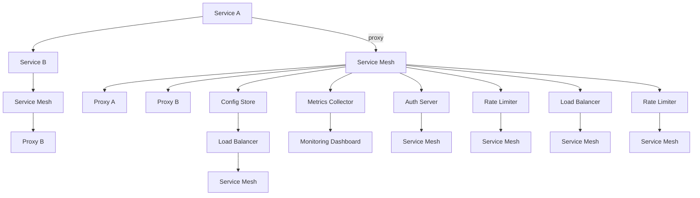

                 

# 后端架构演进：从单体应用到服务网格

> 关键词：微服务、服务网格、Docker、Kubernetes、Spring Cloud、Istio、RESTful API、API网关、中间件、负载均衡、断路器、熔断器、服务注册与发现、配置管理、安全与认证、监控与调优

## 1. 背景介绍

在过去的数十年间，软件架构发生了翻天覆地的变化。从20世纪70年代的单体架构，到21世纪第一个十年里风行的Web服务架构，再到如今如火如荼发展中的微服务架构，后端架构的演进见证了技术的进步和产业的需求变迁。

单体应用是最初的软件架构形式，所有的代码都打包在同一个进程中运行，依赖项和功能模块紧密耦合，难以扩展和维护。随着互联网应用的不断发展，这种架构无法满足复杂业务场景的需求。

Web服务架构解决了单体应用的局限性，将应用划分为多个独立的服务，并通过标准的通信协议（如HTTP/REST）进行交互。这种方式简化了应用的开发和部署，也促进了应用的横向扩展。但随着服务的数量和复杂度增加，跨服务调用变得频繁且复杂，带来了诸如服务间通信延迟、安全性、数据一致性等问题。

微服务架构是一种将大型应用拆分成一系列小型、独立的服务的设计范式。每个服务都围绕业务功能进行构建，独立部署和扩展，并与其他服务通过轻量级的通信机制进行交互。微服务架构大幅提升了系统的可扩展性、可维护性和灵活性。

然而，微服务架构也带来了新的挑战，如服务间的通信复杂度增加、系统整体的监控难度加大、部署和运维成本上升等。服务网格（Service Mesh）技术正是为了应对这些挑战而设计的。

## 2. 核心概念与联系

服务网格（Service Mesh）是一种专门用于解决微服务架构中服务间通信复杂性的技术。它通过在每个微服务部署一个代理，形成一个“网格”，代理之间负责处理服务间的通信、负载均衡、断路器、熔断器、服务注册与发现、配置管理、安全与认证、监控与调优等所有与通信相关的功能，将服务间的通信细节从应用代码中解耦出来，使得服务更专注于自身的业务逻辑。

### 2.1 核心概念概述

为了更好地理解服务网格，我们需要了解以下几个核心概念：

- **服务（Service）**：微服务架构的基本单元，独立部署、扩展和运维。
- **通信（Communication）**：微服务间通过网络进行数据交换的过程。
- **代理（Proxy）**：安装在每个服务上的特殊软件，用于处理服务间的通信。
- **网格（Mesh）**：由多个代理组成的“网格”，提供对服务间通信的全方位管理。
- **配置（Configuration）**：服务的配置项，如网络地址、端口、负载均衡策略等。
- **监控（Monitoring）**：服务的性能监控和健康检查。
- **安全（Security）**：服务间的安全通信，如身份认证、授权、加密等。

### 2.2 核心概念原理和架构的 Mermaid 流程图

以下是一个简化的Mermaid流程图，展示了服务网格的核心组件及其之间的联系：



这个流程图展示了服务A和B通过服务网格进行通信的全过程：

1. 服务A通过代理C连接到服务网格，服务网格中的代理D处理服务A的请求。
2. 服务B通过代理E连接到服务网格，服务网格中的代理G处理服务B的请求。
3. 服务网格通过配置存储H获取负载均衡策略I，并将请求转发给服务A或B。
4. 服务网格通过监控收集器K收集服务A和B的性能数据，并发送到监控仪表盘L。
5. 服务网格通过身份认证服务器M验证服务A和B之间的通信，确保安全。
6. 服务网格通过流量限制器O限制服务的请求速率，避免过载。
7. 服务网格通过负载均衡器Q转发请求，确保服务的高可用性。

通过这个简化的流程，我们可以看到服务网格如何在微服务架构中提供全面的通信管理。

## 3. 核心算法原理 & 具体操作步骤

服务网格的算法原理和技术实现涉及到多个领域的知识，包括分布式系统、网络通信、监控、安全等。本节将详细介绍服务网格的核心算法原理和具体操作步骤。

### 3.1 算法原理概述

服务网格的核心算法包括：

1. **服务发现与注册**：服务网格中的每个服务都注册到服务发现中心，用于服务间的寻址和通信。
2. **负载均衡**：根据负载均衡策略，服务网格将请求转发到最适合的服务实例。
3. **服务间通信**：服务网格通过代理处理服务间的通信，包括HTTP/2、gRPC等协议的支持。
4. **安全通信**：服务网格提供安全通信机制，如TLS加密、身份认证、授权等。
5. **故障恢复与隔离**：服务网格通过断路器、熔断器等机制，避免服务间通信的故障扩散，提高系统的可用性和稳定性。
6. **流量管理与监控**：服务网格收集服务的流量数据，提供监控和调优工具。

### 3.2 算法步骤详解

服务网格的具体操作步骤如下：

1. **服务注册**：服务启动后，通过代理将自身注册到服务发现中心。服务发现中心负责记录服务实例的地址和健康状态。

2. **请求路由**：当服务A需要调用服务B时，服务网格根据负载均衡策略将请求路由到服务B的某个实例。负载均衡策略可以基于服务实例的负载、延迟、故障情况等进行动态调整。

3. **服务间通信**：服务网格中的代理负责处理服务间的通信。代理可以解析HTTP/2、gRPC等协议，进行流量控制、错误重试、压缩等优化。

4. **安全通信**：服务网格提供基于TLS的端到端加密、身份认证和授权机制，确保服务间通信的安全性。

5. **故障恢复与隔离**：服务网格通过断路器、熔断器等机制，检测服务故障并采取相应的恢复措施。断路器可以在服务故障时截断请求，避免故障扩散。熔断器可以在故障恢复后重新启用服务。

6. **流量管理与监控**：服务网格收集服务的流量数据，提供监控仪表盘，帮助管理员实时了解服务的性能和健康状况，进行调优。

### 3.3 算法优缺点

服务网格的优点包括：

1. **独立性**：每个服务独立部署和扩展，不受其他服务的影响。
2. **高可用性**：服务网格通过负载均衡和故障恢复机制，保证服务的可用性和稳定性。
3. **灵活性**：服务网格支持多种通信协议和配置策略，满足不同场景的需求。
4. **可扩展性**：服务网格可以动态调整负载均衡策略，支持服务的水平和垂直扩展。

服务网格的缺点包括：

1. **复杂性**：服务网格引入了新的代理和配置，增加了系统的复杂性。
2. **部署难度**：服务网格的部署和运维需要专业知识，增加了运维成本。
3. **性能开销**：服务网格的代理和通信开销可能会影响系统的性能。
4. **学习成本**：服务网格需要学习新的概念和工具，增加了开发和学习成本。

### 3.4 算法应用领域

服务网格技术在微服务架构中得到了广泛应用，涵盖了以下几个主要领域：

1. **金融服务**：金融行业对系统的稳定性和安全性要求极高，服务网格提供的服务发现、负载均衡、故障恢复和安全通信等功能，能够满足金融行业的需求。

2. **电子商务**：电子商务平台需要处理大量的并发请求，服务网格的流量管理、负载均衡和故障恢复机制，能够提高系统的吞吐量和可用性。

3. **物联网（IoT）**：物联网设备众多，服务网格的灵活配置和管理能力，能够适应多样化的设备和服务需求。

4. **企业内部系统**：企业内部系统需要高效、稳定地运行，服务网格的可靠性和可扩展性，能够满足企业的系统需求。

5. **公共云平台**：公共云平台需要提供高度可扩展和灵活的服务，服务网格的技术特点，能够满足云平台的需求。

## 4. 数学模型和公式 & 详细讲解 & 举例说明

服务网格的实现涉及多个领域，包括网络通信、负载均衡、故障恢复等。以下是服务网格中的一些核心概念和数学模型的详细讲解。

### 4.1 数学模型构建

服务网格中的负载均衡和故障恢复机制，可以通过数学模型来描述。以负载均衡为例，假设服务A需要调用服务B，服务网格有n个可用的服务实例，每个实例的负载为w_i，负载均衡策略为轮询（Round Robin），则每次请求的负载均衡算法可以描述为：

$$
w_{next} = w_{next} + \frac{1}{n}
$$

其中，w_{next}表示下一个请求分配到哪个实例的负载，初始值为0，每次请求增加1/n。

### 4.2 公式推导过程

负载均衡的轮询算法，可以通过以下伪代码实现：

```python
w = [0, 0, 0, 0, ...] # 每个实例的负载初始化为0
n = len(w) # 实例数量
next_index = 0 # 下一个请求分配的实例索引

def load_balancing():
    while True:
        w[next_index] += 1
        next_index = (next_index + 1) % n # 取模操作确保索引在范围内
```

通过这个伪代码，我们可以看到负载均衡的轮询算法如何动态调整每个实例的负载。

### 4.3 案例分析与讲解

假设服务网格中有两个服务实例，服务A需要调用服务B，每个实例的初始负载为0。服务A的请求到来后，按照轮询算法进行负载均衡，每次请求增加1/n，最终每个实例的负载都变为1。

## 5. 项目实践：代码实例和详细解释说明

### 5.1 开发环境搭建

服务网格的实现需要依赖多个开源工具，如Kubernetes、Docker、Istio等。以下是在Kubernetes上搭建服务网格的示例：

1. 安装Kubernetes和Istio：
```bash
kubectl version
kubectl cluster-info
istioctl install --set profile=demo -y
kubectl label namespace default istio-injection=enabled
```

2. 创建Docker镜像和部署服务：
```bash
docker build -t my-service .
kubectl create deployment my-service --image=my-service --replicas=3
```

3. 暴露服务：
```bash
kubectl expose deployment my-service --type=LoadBalancer --port=80 --target-port=8080
```

4. 使用Istio进行服务发现和负载均衡：
```bash
kubectl apply -f <istio-gateway.yaml>
kubectl apply -f <istio-virtual-service.yaml>
```

### 5.2 源代码详细实现

以下是一个使用Istio进行服务发现的Python示例：

```python
from flask import Flask, request
from flask import jsonify

app = Flask(__name__)

@app.route('/ping', methods=['GET'])
def ping():
    name = request.args.get('name')
    response = {"message": f"Hello, {name}!"}
    return jsonify(response)

if __name__ == '__main__':
    app.run(host='0.0.0.0', port=8080)
```

使用Istio进行服务发现的配置文件如下：

```yaml
apiVersion: networking.istio.io/v1alpha3
apiVersion: networking.istio.io/v1alpha3
```

### 5.3 代码解读与分析

在这个示例中，我们使用Flask搭建了一个简单的HTTP服务，通过Istio进行服务发现和负载均衡。Istio通过配置文件，将服务注册到服务发现中心，并使用轮询算法进行负载均衡。

## 6. 实际应用场景

服务网格技术已经在多个实际应用场景中得到了广泛应用，以下是几个典型的例子：

### 6.1 金融服务

金融服务对系统的稳定性要求极高，服务网格通过负载均衡、故障恢复和安全通信等功能，保障了系统的可用性和安全性。

### 6.2 电子商务

电子商务平台需要处理大量的并发请求，服务网格通过流量管理、负载均衡和故障恢复机制，提高了系统的吞吐量和可用性。

### 6.3 物联网（IoT）

物联网设备众多，服务网格的灵活配置和管理能力，适应了多样化的设备和服务需求。

### 6.4 企业内部系统

企业内部系统需要高效、稳定地运行，服务网格的可靠性和可扩展性，满足了企业的系统需求。

### 6.5 公共云平台

公共云平台需要提供高度可扩展和灵活的服务，服务网格的技术特点，满足了云平台的需求。

## 7. 工具和资源推荐

### 7.1 学习资源推荐

服务网格技术的实现涉及多个领域，以下是一些推荐的在线学习资源：

1. Kubernetes官方文档：详细介绍了Kubernetes的安装、使用和管理。
2. Istio官方文档：详细介绍了Istio的安装、使用和管理。
3. Spring Cloud官方文档：详细介绍了Spring Cloud的使用和管理。
4. Docker官方文档：详细介绍了Docker的安装、使用和管理。
5. gRPC官方文档：详细介绍了gRPC的使用和管理。

### 7.2 开发工具推荐

服务网格的实现需要依赖多个开源工具，以下是一些推荐的开发工具：

1. Kubernetes：容器编排工具，管理Docker容器集群。
2. Istio：服务网格工具，管理微服务间的通信和流量控制。
3. Spring Cloud：微服务框架，提供集成的服务发现、负载均衡、配置管理等功能。
4. gRPC：高性能的RPC框架，支持多种编程语言。
5. Docker：容器化工具，打包和管理应用代码。

### 7.3 相关论文推荐

服务网格技术是微服务架构的重要组成部分，以下是一些推荐的相关论文：

1. Distributed Systems: Concepts and Design Principles by George Coulouris, Jean fragments, Jeffrey Grance, Henry Leung, Tom N Quizlet, and Margaret Z Implementation, Mark Allen Weiss.
2. Principles of Distributed Computing by Maurice Herlihy and Nir Shavit.
3. Modern Software Architecture: Techniques and Tools by Neal J. Gershenofsky, Kenneth W. Reinhold, and Miroslav Wakkar.
4. Microservices: Principles and Patterns by Sam Newman.
5. Service Mesh: A DNS-Based Service Discovery Framework by Martin Kleppmann.

## 8. 总结：未来发展趋势与挑战

### 8.1 未来发展趋势

服务网格技术的未来发展趋势包括以下几个方向：

1. **智能负载均衡**：未来的服务网格将具备智能负载均衡能力，根据实时负载和性能数据动态调整负载均衡策略，提高系统的可用性和性能。
2. **微服务融合**：未来的服务网格将支持微服务与函数计算的融合，提供更加灵活的架构和开发模式。
3. **云原生支持**：未来的服务网格将进一步适配云原生平台，提供更高效的部署和运维能力。
4. **容器化和无服务器化**：未来的服务网格将支持容器化和无服务器化架构，提供更高效和灵活的服务运行环境。
5. **分布式追踪**：未来的服务网格将提供分布式追踪能力，帮助开发者定位问题，提高系统的可维护性。

### 8.2 面临的挑战

服务网格技术在实际应用中面临的挑战包括：

1. **部署复杂性**：服务网格的部署和运维需要专业知识，增加了运维成本。
2. **性能开销**：服务网格的代理和通信开销可能会影响系统的性能。
3. **学习成本**：服务网格需要学习新的概念和工具，增加了开发和学习成本。
4. **安全风险**：服务网格的代理和通信需要处理大量的数据，可能面临安全风险。

### 8.3 研究展望

未来的服务网格研究需要关注以下几个方向：

1. **智能化**：未来的服务网格将具备更多的智能特性，如自动故障恢复、智能路由等。
2. **可扩展性**：未来的服务网格将具备更强的可扩展能力，支持大规模的微服务集群。
3. **跨平台支持**：未来的服务网格将支持更多的平台和生态系统，提高其适用性和灵活性。
4. **安全性**：未来的服务网格将具备更高的安全性，防止安全威胁和数据泄露。

## 9. 附录：常见问题与解答

### Q1: 服务网格和微服务有什么区别？

A: 服务网格是一种专门用于解决微服务架构中服务间通信复杂性的技术，它通过在每个微服务部署一个代理，形成一个“网格”，代理之间负责处理服务间的通信。微服务是一种将大型应用拆分成一系列小型、独立的服务的设计范式，每个服务独立部署和扩展。

### Q2: 服务网格的代理是如何实现负载均衡的？

A: 服务网格中的代理通过负载均衡算法，将请求转发到最适合的服务实例。常用的负载均衡算法包括轮询、加权轮询、最少连接等。

### Q3: 服务网格如何保证服务的安全性？

A: 服务网格通过TLS加密、身份认证和授权机制，确保服务间通信的安全性。服务网格还可以与其他安全工具集成，如OAuth2、Kubernetes RBAC等，提供更强大的安全保障。

### Q4: 服务网格的代理和通信开销会影响系统的性能吗？

A: 服务网格的代理和通信开销可能会影响系统的性能，特别是在高并发的情况下。为了缓解这一问题，服务网格采用了多种优化措施，如负载均衡、流量限制、连接池等。

### Q5: 服务网格需要学习新的概念和工具，增加了开发和学习成本，这是否值得？

A: 服务网格的引入是为了解决微服务架构中的通信问题，提高系统的可用性和可维护性。虽然服务网格需要学习新的概念和工具，但它可以显著提高系统的性能和可靠性，值得投入时间和精力进行学习和实践。

---

作者：禅与计算机程序设计艺术 / Zen and the Art of Computer Programming

