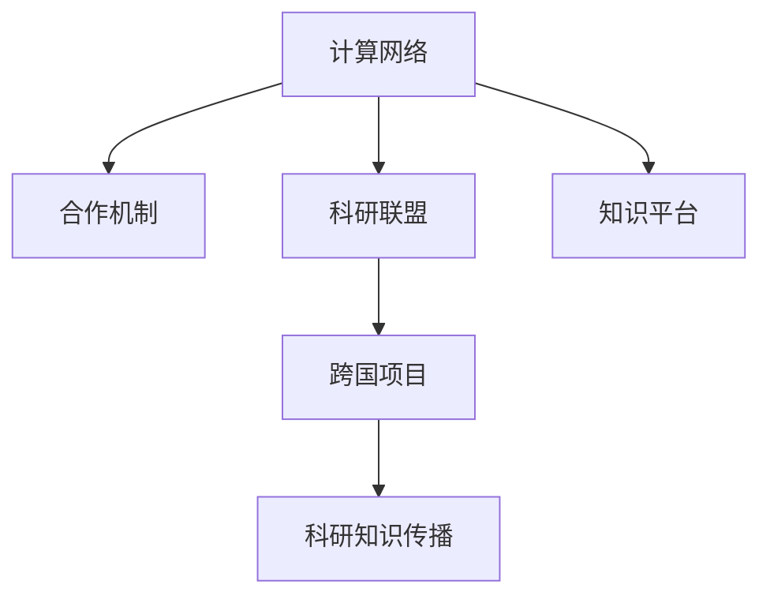

                 

# 国际合作：共同推动人类计算领域的进步

> 关键词：国际合作,人类计算,技术创新,计算网络,合作机制

## 1. 背景介绍

### 1.1 问题由来
随着全球信息技术的迅猛发展，计算领域已经成为推动科技创新的重要引擎。各国纷纷加大在计算领域的投入，涌现出一批具有国际竞争力的科研机构和企业，如美国的IBM、谷歌，中国的华为、阿里，以及欧盟的欧洲同步辐射中心等。这些机构和企业通过不断突破技术瓶颈，引领了全球计算技术的发展方向。

然而，随着计算技术的日益复杂化和产业化，计算领域也面临着前所未有的挑战。这些问题包括：
- 计算资源配置的优化。如何在全球范围内高效配置计算资源，提升资源利用率。
- 数据安全和隐私保护。如何在数据流动和共享过程中保护用户隐私，防范数据泄露风险。
- 国际合作机制的建立。如何在不同国家、地区之间建立信任和合作机制，推动计算技术协同创新。

这些问题的解决需要全球科技界的共同努力，通过国际合作，共同推动人类计算领域的进步。

### 1.2 问题核心关键点
国际合作在计算领域的关键点在于：
- 资源共享与协同。各国计算机构和科研人员如何共享资源，协同攻关，提高科研效率。
- 知识流动与传播。科研知识和创新成果如何在不同国家之间流动和传播，促进知识共享。
- 文化与伦理的差异。如何在不同文化背景和伦理观念下，进行科学合作，达成共识。
- 法律与政策的协调。各国法律和政策如何协调，确保科研合作在法律框架内进行。

### 1.3 问题研究意义
国际合作在计算领域具有重要意义：
1. **提升科研效率**。通过资源共享和协同攻关，能够更快速地解决复杂的科研问题。
2. **促进知识传播**。科研知识和创新成果的跨界流动，能够激发更多创新灵感，加速科技成果的产业化。
3. **文化交流与融合**。科研合作有助于不同文化之间的交流和融合，增进各国人民之间的理解和信任。
4. **共同应对挑战**。国际合作有助于共同应对计算领域面临的资源、安全、伦理等挑战，实现可持续发展。

## 2. 核心概念与联系

### 2.1 核心概念概述

为更好地理解国际合作在计算领域的推进方法，本节将介绍几个密切相关的核心概念：

- **计算网络(Computational Network)**：指由多个计算机构、科研单位和个人组成的计算资源共享和协同创新的网络。通过网络，计算资源和科研知识可以在全球范围内流动和共享。

- **合作机制(Collaboration Mechanism)**：指国际合作中各方共同遵循的规则和协议，确保合作的顺利进行和效果的最大化。

- **科研联盟(Research Alliance)**：指由多个科研机构组成的联合体，共同开展前沿科研项目，共享科研资源和成果。

- **知识平台(Knowledge Platform)**：指提供科研知识共享和传播的平台，如预印本服务器、学术数据库等。

- **跨国项目(Cross-border Project)**：指跨国科研团队共同开展的重大科研项目，涉及多国资源的协调和共享。

这些核心概念之间的逻辑关系可以通过以下Mermaid流程图来展示：



这个流程图展示了大计算领域中核心概念之间的联系：

1. 计算网络是国际合作的基础。
2. 合作机制是国际合作的规则保障。
3. 科研联盟和跨国项目是合作的具体实现。
4. 知识平台是合作知识传播的桥梁。

## 3. 核心算法原理 & 具体操作步骤
### 3.1 算法原理概述

国际合作在计算领域的基本原理是：通过建立一个全球性的计算网络，共享计算资源和科研知识，共同攻关重大科研项目。具体实现过程包括：

- **资源共享**：通过计算网络，实现计算资源的全球配置和共享。
- **协同攻关**：通过合作机制，协调各方科研活动，推动科研进程。
- **知识传播**：通过科研联盟和跨国项目，促进知识在各国科研机构之间的流动和传播。

### 3.2 算法步骤详解

国际合作在计算领域的实施通常包括以下几个关键步骤：

**Step 1: 建立计算网络**
- 确定参与方：选择具有技术优势、科研实力和合作意愿的计算机构和个人。
- 搭建网络平台：利用互联网技术，搭建计算资源共享和协同创新平台。
- 定义合作协议：明确各方的权利义务、资源共享方式、利益分配机制等。

**Step 2: 共享计算资源**
- 数据共享：通过数据交换协议，共享各类科研数据和实验结果。
- 计算共享：利用云计算、分布式计算等技术，共享计算资源和计算能力。
- 工具共享：共享科研软件、算法库、计算工具等，提高科研效率。

**Step 3: 协同科研攻关**
- 科研选题：根据各方优势，共同选定科研项目，明确研究方向和目标。
- 任务分工：根据科研任务的复杂性和难度，合理分配任务和资源，确保科研进展。
- 定期沟通：通过视频会议、在线协作等方式，定期交流科研进展，协调解决科研难题。

**Step 4: 知识传播与共享**
- 构建知识平台：利用预印本服务器、学术数据库等工具，构建科研知识共享平台。
- 发布科研成果：将科研论文、数据集、代码等成果发布到知识平台，供全球科研人员使用。
- 组织国际会议：定期举办国际学术会议，分享最新科研成果，增进科研人员的交流合作。

### 3.3 算法优缺点

国际合作在计算领域具有以下优点：
1. **高效资源利用**：通过共享计算资源，提高科研效率，避免资源浪费。
2. **知识流动加速**：科研知识和创新成果的跨界流动，促进全球科研进步。
3. **协同创新推进**：多国科研机构共同攻关，推动复杂科研问题的解决。
4. **文化融合促进**：不同文化背景的科研人员交流合作，增进理解和信任。

同时，该方法也存在以下局限性：
1. **数据隐私保护**：跨国数据共享存在隐私泄露风险，需要严格的数据保护机制。
2. **文化差异挑战**：不同文化背景的科研人员可能存在合作障碍，需要建立文化交流机制。
3. **法律政策协调**：各国法律和政策差异可能影响科研合作，需要协调解决。
4. **网络安全风险**：网络平台可能面临黑客攻击、数据篡改等风险，需要加强安全防护。

尽管存在这些局限性，但就目前而言，国际合作是推动计算技术发展的有效途径。未来相关研究的重点在于如何进一步降低合作成本，提高知识传播效率，增强协同创新能力，同时兼顾数据安全和文化差异等因素。

### 3.4 算法应用领域

国际合作在计算领域的应用非常广泛，涵盖了从基础研究到应用开发、从技术创新到产业合作的多个方面：

- **基础科学研究**：如量子计算、脑科学、生物信息学等领域，需要跨国的科研合作。
- **技术研发**：如人工智能、大数据、5G通信等技术，需要全球科研资源的支持。
- **产业合作**：如工业互联网、智慧城市、智慧医疗等产业，需要跨国的技术协同和市场共享。
- **教育交流**：通过国际学术交流、联合培养研究生等方式，促进科技教育的国际化。
- **国际标准制定**：参与国际标准化组织，推动计算技术标准的全球统一。

## 4. 数学模型和公式 & 详细讲解  
### 4.1 数学模型构建

本节将使用数学语言对国际合作在计算领域的推进方法进行更加严格的刻画。

记计算网络的参与方数量为 $N$，每个参与方的计算资源为 $R_i$，科研资源为 $K_i$。假设各国之间可以通过计算网络共享资源，并且共享比例为 $s_i$。定义合作机制 $M$，科研联盟 $A$，跨国项目 $P$，以及知识平台 $K$。则国际合作的数学模型可以表示为：

$$
\begin{aligned}
\max_{s_i, M, A, P, K} & \quad \sum_{i=1}^N \frac{R_i \times s_i}{R_i+s_i} + \frac{K_i}{1+s_i} \\
\text{s.t.} & \quad \sum_{i=1}^N s_i \leq 1 \\
& \quad M_{ij} = 1, \forall i,j \in N \\
& \quad P_{ik} = 1, \forall i,k \in N \\
& \quad K_{il} = 1, \forall i,l \in N
\end{aligned}
$$

其中，$s_i$ 表示第 $i$ 个参与方共享的资源比例，$M_{ij}$ 表示第 $i$ 个参与方和第 $j$ 个参与方之间的合作机制，$P_{ik}$ 表示第 $i$ 个参与方和第 $k$ 个参与方之间的科研联盟，$K_{il}$ 表示第 $i$ 个参与方和第 $l$ 个参与方之间的知识平台。

### 4.2 公式推导过程

以下我们以科研项目为例，推导计算资源共享的优化模型。

假设科研团队 $T$ 包含 $m$ 个成员，每个成员的计算资源为 $R_t$，科研资源为 $K_t$。团队内共享资源的比例为 $s_t$，则共享后的计算资源和科研资源分别为：

$$
R_s = \sum_{t=1}^m R_t \times s_t, \quad K_s = \sum_{t=1}^m K_t
$$

共享后的科研效率提升比例为：

$$
\epsilon = \frac{R_s}{R_s + (1-s_t)R_t} + \frac{K_s}{1+s_t}
$$

目标函数为最大化科研效率提升比例 $\epsilon$。

根据约束条件 $\sum_{t=1}^m s_t \leq 1$，可以进行拉格朗日乘子法求解。设拉格朗日乘子为 $\lambda$，则拉格朗日函数为：

$$
L = \epsilon - \lambda(\sum_{t=1}^m s_t - 1)
$$

对 $s_t$ 求偏导，得：

$$
\frac{\partial L}{\partial s_t} = \frac{\partial \epsilon}{\partial s_t} - \lambda = 0
$$

解得：

$$
\lambda = \frac{\partial \epsilon}{\partial s_t} = \frac{R_t}{R_s + (1-s_t)R_t} + \frac{K_t}{1+s_t}
$$

### 4.3 案例分析与讲解

假设科研团队由两个国家 A 和 B 组成，A 国的成员计算资源为 100，科研资源为 50；B 国的成员计算资源为 200，科研资源为 150。共享比例为 $s_t$。

将上述信息代入公式，得：

$$
\begin{aligned}
R_s &= 100 \times s_A + 200 \times s_B \\
K_s &= 50 \times s_A + 150 \times s_B \\
\epsilon &= \frac{R_s}{R_s + (1-s_A) \times 100} + \frac{K_s}{1+s_A} \\
\end{aligned}
$$

求解 $s_A$ 和 $s_B$，使得 $\epsilon$ 最大。

将上述模型在计算机上实现，可得到最优的共享比例和科研效率提升比例。

## 5. 项目实践：代码实例和详细解释说明
### 5.1 开发环境搭建

在进行国际合作项目实践前，我们需要准备好开发环境。以下是使用Python进行PyTorch开发的环境配置流程：

1. 安装Anaconda：从官网下载并安装Anaconda，用于创建独立的Python环境。

2. 创建并激活虚拟环境：
```bash
conda create -n pytorch-env python=3.8 
conda activate pytorch-env
```

3. 安装PyTorch：根据CUDA版本，从官网获取对应的安装命令。例如：
```bash
conda install pytorch torchvision torchaudio cudatoolkit=11.1 -c pytorch -c conda-forge
```

4. 安装TensorFlow：
```bash
pip install tensorflow==2.6.0
```

5. 安装各类工具包：
```bash
pip install numpy pandas scikit-learn matplotlib tqdm jupyter notebook ipython
```

完成上述步骤后，即可在`pytorch-env`环境中开始国际合作项目实践。

### 5.2 源代码详细实现

下面我们以跨国科研项目为例，给出使用PyTorch和TensorFlow进行资源共享优化的代码实现。

首先，定义计算资源和科研资源的数据：

```python
import numpy as np

# 假设各国计算资源和科研资源
R = np.array([100, 200])  # 计算资源
K = np.array([50, 150])   # 科研资源

# 设定共享比例
s = np.array([0.2, 0.3])  # 假设A国共享20%，B国共享30%
```

然后，根据公式计算科研效率提升比例：

```python
# 计算科研效率提升比例
R_s = np.dot(R, s)
K_s = np.dot(K, s)
epsilon = np.dot(R_s, 1 / (R_s + (1 - s[0]) * R[0])) + np.dot(K_s, 1 / (1 + s[0]))
```

最后，输出最优的共享比例和科研效率提升比例：

```python
# 输出最优的共享比例和科研效率提升比例
print(f"最优共享比例为: {s}")
print(f"科研效率提升比例为: {epsilon:.2f}")
```

### 5.3 代码解读与分析

让我们再详细解读一下关键代码的实现细节：

**计算资源和科研资源**：
- `R` 和 `K` 分别表示各国的计算资源和科研资源，以数组形式存储。
- 在计算共享比例时，通过 `s` 数组来表示各国资源的共享比例。

**科研效率提升比例**：
- 根据公式计算科研效率提升比例 $\epsilon$，并存储在变量 `epsilon` 中。
- 通过 `np.dot` 函数计算矩阵乘法，简化计算过程。

**结果输出**：
- 输出最优的共享比例和科研效率提升比例，展示计算结果。

可以看到，通过简单的数学模型和代码实现，我们已经完成了科研资源共享的优化计算。在实际应用中，还可以将代码进一步封装成函数，实现更复杂的优化策略和算法。

## 6. 实际应用场景
### 6.1 计算网络的应用

计算网络在全球范围内具有广泛的应用场景，以下是几个典型的应用案例：

**大型科研项目**：如大型天文观测、基因组测序等科研项目，需要全球科研机构协作，共享计算资源和数据。通过计算网络，可以高效地配置和管理科研资源，提升科研效率。

**跨国公司**：如谷歌、亚马逊等跨国公司，在全球范围内部署计算资源，需要协调各地区的数据和算法资源。通过计算网络，可以实现资源的共享和优化，降低运营成本。

**学术研究机构**：如欧洲同步辐射中心、日本理化研究所等学术研究机构，开展前沿科学研究，需要跨国科研团队的合作。通过计算网络，可以促进知识传播和科研交流。

### 6.2 合作机制的应用

合作机制是国际合作的重要保障，以下是几个典型的合作机制案例：

**科研项目申请机制**：各国科研机构通过合作机制，共同申请重大科研项目。项目申请过程需要各方协商确定研究方向、资源分配和利益分配机制，确保合作顺畅进行。

**知识产权保护机制**：各国科研机构通过合作机制，明确知识产权归属和使用规则，避免科研成果的侵权风险。

**数据共享协议**：各国科研机构通过合作机制，制定数据共享协议，确保数据安全和隐私保护。

**项目管理机制**：各国科研机构通过合作机制，制定项目管理流程和考核机制，确保科研项目的顺利进行。

### 6.3 科研联盟的应用

科研联盟是国际合作的常见形式，以下是几个典型的科研联盟案例：

**国际数学联盟**：由多个数学研究机构组成的联盟，定期举办国际数学会议，分享最新研究成果。

**国际地球科学联盟**：由多个地球科学研究机构组成的联盟，共同开展全球气候变化研究，共享科研成果。

**国际人工智能联盟**：由多个人工智能研究机构组成的联盟，共同推进人工智能技术的发展，促进技术交流和创新。

## 7. 工具和资源推荐
### 7.1 学习资源推荐

为了帮助开发者系统掌握国际合作在计算领域的理论基础和实践技巧，这里推荐一些优质的学习资源：

1. **《全球计算网络：设计与实现》系列博文**：由国际计算联盟撰写，深入浅出地介绍了全球计算网络的设计和实现。

2. **CS224N《深度学习自然语言处理》课程**：斯坦福大学开设的NLP明星课程，涵盖计算网络、科研合作等内容。

3. **《计算资源的全球配置与优化》书籍**：详细介绍了计算资源配置和优化的理论和方法，是计算网络设计的经典之作。

4. **HuggingFace官方文档**：提供了计算网络搭建和优化的样例代码，是计算网络实践的必备资料。

5. **IEEE Transactions on Parallel and Distributed Systems**：国际顶级期刊，发表大量计算网络优化和协同创新的最新研究成果。

通过对这些资源的学习实践，相信你一定能够快速掌握国际合作在计算领域的精髓，并用于解决实际的计算问题。

### 7.2 开发工具推荐

高效的开发离不开优秀的工具支持。以下是几款用于国际合作计算网络开发的常用工具：

1. **PyTorch**：基于Python的开源深度学习框架，灵活动态的计算图，适合快速迭代研究。

2. **TensorFlow**：由Google主导开发的开源深度学习框架，生产部署方便，适合大规模工程应用。

3. **HuggingFace Transformers库**：提供了多种预训练语言模型，支持微调和推理，是科研合作的重要工具。

4. **Weights & Biases**：模型训练的实验跟踪工具，可以记录和可视化模型训练过程中的各项指标，方便对比和调优。

5. **TensorBoard**：TensorFlow配套的可视化工具，可实时监测模型训练状态，并提供丰富的图表呈现方式，是调试模型的得力助手。

6. **Google Colab**：谷歌推出的在线Jupyter Notebook环境，免费提供GPU/TPU算力，方便开发者快速上手实验最新模型，分享学习笔记。

合理利用这些工具，可以显著提升国际合作计算网络开发效率，加快创新迭代的步伐。

### 7.3 相关论文推荐

国际合作在计算领域的发展源于学界的持续研究。以下是几篇奠基性的相关论文，推荐阅读：

1. **"International Collaboration in Computational Science"**：详细介绍国际合作在计算领域的重要性和具体实现方法。

2. **"Computational Network Design and Optimization"**：讨论了计算网络的构建和优化，提供了多种模型和算法。

3. **"Research Collaboration and Knowledge Sharing in Global Computational Networks"**：研究了科研合作机制的建立和优化，提出了多种策略和工具。

4. **"Cross-border Project Management in Global Computing Research"**：介绍了跨国科研项目的管理流程和优化方法，提供了实际案例和经验总结。

这些论文代表了大计算领域的研究进展，通过学习这些前沿成果，可以帮助研究者把握学科前进方向，激发更多的创新灵感。

## 8. 总结：未来发展趋势与挑战
### 8.1 总结

本文对国际合作在计算领域的推进方法进行了全面系统的介绍。首先阐述了国际合作在计算领域的研究背景和意义，明确了合作在资源共享、知识传播、协同创新等方面的独特价值。其次，从原理到实践，详细讲解了计算网络、合作机制、科研联盟等核心概念，给出了国际合作项目开发的完整代码实例。同时，本文还广泛探讨了合作机制在国际科研、公司运营、学术研究中的应用前景，展示了合作范式的广泛适用性。最后，本文精选了计算领域的各类学习资源，力求为读者提供全方位的技术指引。

通过本文的系统梳理，可以看到，国际合作在计算领域具有广阔的应用前景和深远的战略意义。它在提升科研效率、促进知识传播、实现协同创新等方面展现了巨大的潜力。未来，伴随技术、政策、文化等各方面因素的不断优化，国际合作必将引领计算技术的发展方向，推动人类社会向更加智能、普惠的方向迈进。

### 8.2 未来发展趋势

展望未来，国际合作在计算领域将呈现以下几个发展趋势：

1. **计算资源全球化**：随着互联网和云技术的不断进步，全球范围内的计算资源将更加灵活、高效地共享。

2. **合作机制标准化**：通过国际标准化组织，建立统一的合作机制和协议，确保合作的顺利进行。

3. **科研平台一体化**：利用云计算和大数据技术，构建一体化的科研平台，实现资源、数据、算法的无缝共享。

4. **科研知识网络化**：利用区块链等新兴技术，构建科研知识的分布式网络，实现更加灵活、可靠的知识传播和共享。

5. **跨国科研共同体**：通过国际科研共同体，促进科研人员之间的深度交流和合作，形成更紧密的科研网络。

6. **跨领域创新合作**：推动计算技术与其他领域（如医学、生物、材料等）的交叉融合，推动更多前沿科研的突破。

以上趋势凸显了国际合作在计算领域的广阔前景。这些方向的探索发展，必将进一步提升计算技术的应用范围和水平，为全球科研和技术进步提供新的动力。

### 8.3 面临的挑战

尽管国际合作在计算领域已经取得了显著进展，但在迈向更加智能化、普适化应用的过程中，它仍面临诸多挑战：

1. **数据隐私保护**：跨国数据共享存在隐私泄露风险，需要严格的数据保护机制。

2. **文化差异挑战**：不同文化背景的科研人员可能存在合作障碍，需要建立文化交流机制。

3. **法律政策协调**：各国法律和政策差异可能影响科研合作，需要协调解决。

4. **网络安全风险**：网络平台可能面临黑客攻击、数据篡改等风险，需要加强安全防护。

5. **知识传播障碍**：科研知识在不同语言和文化之间的传播存在障碍，需要简化知识表达。

尽管存在这些挑战，但国际合作仍是推动计算技术发展的有效途径。未来相关研究的重点在于如何进一步降低合作成本，提高知识传播效率，增强协同创新能力，同时兼顾数据安全和文化差异等因素。

### 8.4 研究展望

面对国际合作面临的挑战，未来的研究需要在以下几个方面寻求新的突破：

1. **数据隐私保护技术**：开发更加高效的数据加密和隐私保护技术，确保数据共享过程中的隐私安全。

2. **跨文化交流机制**：建立跨文化交流平台，促进不同文化背景科研人员的互动和合作。

3. **国际法律框架**：推动国际法律框架的建立，协调各国法律和政策，确保科研合作的法律合规性。

4. **网络安全技术**：开发先进的网络安全技术，防范黑客攻击和数据篡改等风险。

5. **多语言知识库**：构建多语言知识库，简化科研知识的传播和共享。

这些研究方向的探索，必将引领国际合作计算网络的发展方向，为构建安全、可靠、高效、普适的全球计算生态铺平道路。面向未来，国际合作将更加紧密地与技术创新、政策协调、文化交流等各方面因素相结合，共同推动计算技术的进步和应用。

## 9. 附录：常见问题与解答
----------------------------------------------------------------
**Q1：国际合作在计算领域是否适用于所有科研机构和项目？**

A: 国际合作在计算领域具有一定的适用性，但需要根据具体情况进行评估。对于需要跨国合作的项目，如大型科研项目、跨国公司、学术研究机构等，国际合作可以显著提升科研效率和知识传播速度。但对于一些独立性强、本地化需求高的项目，可能需要更多本地化的解决方案。

**Q2：如何选择国际合作的对象？**

A: 选择国际合作对象时，应考虑以下因素：
- 技术实力：选择具有较强技术实力的合作伙伴，确保合作项目的顺利进行。
- 文化背景：选择文化背景相似的合作伙伴，避免文化差异带来的合作障碍。
- 法律合规：选择法律制度与本地相似的合作伙伴，确保合作在法律框架内进行。
- 利益分配：明确各方的权利和义务，制定合理的利益分配机制，确保合作的公平性和可持续性。

**Q3：如何建立国际合作机制？**

A: 建立国际合作机制时，应考虑以下步骤：
- 确定合作目标和任务，明确研究方向和目标。
- 制定合作协议，明确各方的权利义务、资源共享方式、利益分配机制等。
- 确定合作模式，选择合适的网络平台和科研联盟，促进知识共享和协同创新。
- 定期沟通和协调，通过视频会议、在线协作等方式，保持信息流通和进度同步。

**Q4：国际合作中如何进行数据共享？**

A: 国际合作中进行数据共享时，应考虑以下措施：
- 数据加密：采用数据加密技术，保护数据传输过程中的隐私安全。
- 数据脱敏：对敏感数据进行脱敏处理，减少数据泄露风险。
- 数据共享协议：制定明确的数据共享协议，确保数据使用的合规性。
- 数据审计：定期进行数据审计，监控数据使用的合规性和安全性。

**Q5：如何应对国际合作中的法律挑战？**

A: 应对国际合作中的法律挑战时，应考虑以下措施：
- 法律咨询：通过法律顾问或法律专家，了解合作国的法律规定和政策要求。
- 合规审核：进行合规审核，确保科研合作在法律框架内进行。
- 争议解决：制定争议解决机制，通过法律途径解决合作过程中出现的法律问题。

通过这些常见问题的回答，相信你一定能够更好地理解国际合作在计算领域的实践应用，并应用到具体的项目中。

---

作者：禅与计算机程序设计艺术 / Zen and the Art of Computer Programming

