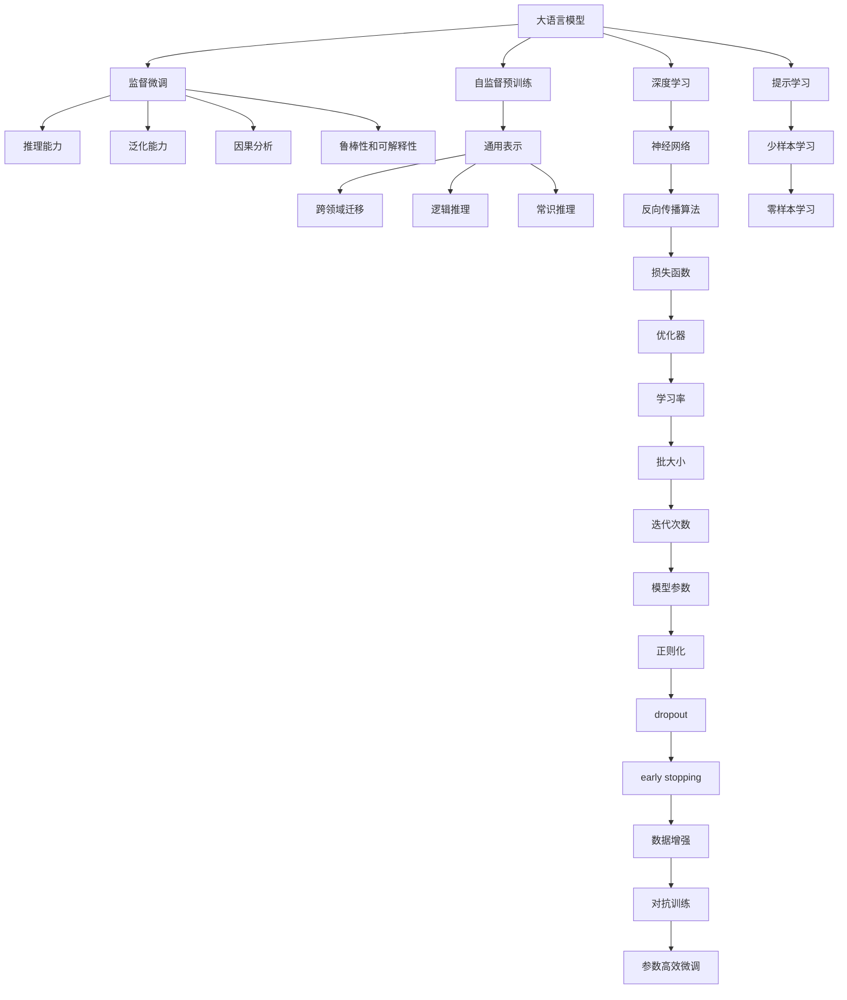

                 

# 图灵完备的LLM:通向通用人工智能之路

> 关键词：大语言模型(LLM)，图灵完备性，通用人工智能，神经网络，深度学习，自然语言处理(NLP)

## 1. 背景介绍

### 1.1 问题由来
自1950年图灵提出著名的图灵测试以来，通用人工智能(AI)一直是人类追求的目标之一。然而，传统人工智能方法在处理复杂任务时表现出的能力边界，使得通用AI的实现面临巨大挑战。近年来，随着深度学习技术的进步，特别是大规模预训练语言模型(Large Language Model, LLM)的出现，通用人工智能展现出新的曙光。

大语言模型（如GPT、BERT等）通过在大量文本数据上进行自监督学习，学习到通用的语言表示和知识，具有强大的自然语言理解和生成能力。这些模型在问答、对话、翻译、文本摘要等NLP任务上取得了显著成果，被视为接近通用AI的重要里程碑。

### 1.2 问题核心关键点
大语言模型的图灵完备性（Turing completeness），即能够通过指令执行任何图灵可计算的任务，是当前研究的重要目标。尽管大模型在处理某些任务时表现出色，但其在逻辑推理、常识推理、跨领域迁移等方面的能力仍有提升空间。如何进一步提升大模型的通用性和图灵完备性，成为了学界和产业界关注的焦点。

大语言模型图灵完备性的提升，主要涉及以下几个关键点：
1. 模型的推理能力：如何使大模型具备更强的逻辑推理和因果关系建模能力。
2. 模型的泛化能力：如何在不同任务和领域间实现高效的跨领域迁移。
3. 模型的因果分析能力：如何使大模型能够从输入中识别因果关系，进行合理的预测和决策。
4. 模型的鲁棒性和可解释性：如何确保大模型在面对新数据和复杂情境时，仍能保持稳健性和可解释性。

## 2. 核心概念与联系

### 2.1 核心概念概述

为更好地理解大语言模型如何走向通用人工智能，本节将介绍几个密切相关的核心概念：

- **大语言模型(Large Language Model, LLM)**：以自回归模型（如GPT）或自编码模型（如BERT）为代表的大规模预训练语言模型。通过在无标签文本数据上进行预训练，学习到通用的语言表示和知识。

- **图灵完备性(Turing completeness)**：指一个系统能够执行任何图灵可计算的任务，即具备解决所有计算问题的能力。大语言模型的图灵完备性意味着其在执行任何图灵可计算任务时，能够达到与通用计算机相同的效率和精度。

- **神经网络(Neural Networks)**：由神经元（节点）和连接（边）组成的网络结构，通过反向传播算法进行训练，广泛用于深度学习和人工智能领域。

- **深度学习(Deep Learning)**：通过多层次的神经网络结构，自动提取和学习数据中的特征和模式，广泛应用于图像识别、自然语言处理等领域。

- **自然语言处理(Natural Language Processing, NLP)**：使计算机能够理解、解释和生成自然语言的技术，是人工智能领域的重要分支。

- **通用人工智能(General Artificial Intelligence, AGI)**：指具备人类智能水平的人工智能系统，能够自主学习、推理、规划和执行复杂任务。

- **认知智能(Cognitive Intelligence)**：指使AI具备理解、学习、推理和决策等高级认知能力。

- **多模态学习(Multimodal Learning)**：指利用多种类型的数据（如文本、图像、声音等）进行联合学习，提升模型的复杂性和适应性。

这些核心概念之间的逻辑关系可以通过以下Mermaid流程图来展示：



这个流程图展示了大语言模型的核心概念及其之间的关系：

1. 大语言模型通过自监督预训练学习通用表示。
2. 通过监督微调进一步优化模型在特定任务上的表现。
3. 微调后的模型具备推理、泛化、因果分析、鲁棒性和可解释性等高级能力。
4. 预训练模型通过深度学习和神经网络结构提取特征，并进行反向传播优化。
5. 微调模型的性能提升依赖于损失函数、优化器、学习率、批大小、迭代次数等关键参数。
6. 优化过程中需考虑正则化、dropout、early stopping等技术以防止过拟合。
7. 数据增强和对抗训练提升模型的鲁棒性。
8. 参数高效微调和提示学习进一步降低对标注数据的需求。
9. 少样本学习和零样本学习使模型在几乎没有标注数据的情况下也能完成任务。

## 3. 核心算法原理 & 具体操作步骤

### 3.1 算法原理概述

大语言模型走向通用人工智能的过程，本质上是一个逐步提升其图灵完备性的过程。其核心思想是：通过自监督预训练，使模型学习到通用的语言表示和知识；然后通过监督微调，进一步优化模型在特定任务上的能力；最终通过不断优化模型推理、泛化、因果分析、鲁棒性和可解释性等高级能力，使其具备图灵完备性。

形式化地，假设预训练语言模型为 $M_{\theta}$，其中 $\theta$ 为预训练得到的模型参数。给定某一图灵可计算任务 $T$，其输入为 $X$，输出为 $Y$。大语言模型的图灵完备性意味着对于任意输入 $X$，模型能够准确输出 $Y$。

微调的目标是优化模型在特定任务上的性能，使得 $M_{\theta}$ 能够根据任务定义生成符合要求的输出 $Y$。具体步骤如下：

1. **自监督预训练**：在无标签文本数据上，通过自监督学习任务（如掩码语言模型、下一个句子预测等）训练模型，学习到通用的语言表示。
2. **监督微调**：在任务相关的标注数据上，通过有监督学习（如分类任务、序列标注任务等）对模型进行微调，使其能够准确完成特定任务。
3. **推理能力增强**：通过引入逻辑推理和因果分析能力，使模型能够处理更复杂、更抽象的任务。
4. **泛化能力提升**：通过跨领域迁移学习，使模型在不同任务和领域间实现高效迁移。
5. **鲁棒性和可解释性优化**：通过对抗训练、数据增强等技术，提升模型的鲁棒性和可解释性，确保模型在各种情况下都能稳定工作。

### 3.2 算法步骤详解

大语言模型的通用人工智能实现过程，可以分为以下几个关键步骤：

**Step 1: 准备数据集**
- 收集无标签文本数据进行自监督预训练，如Common Crawl corpus、Wikipedia等。
- 收集特定任务的相关标注数据，如问答、对话、翻译、文本分类等任务的数据集。

**Step 2: 自监督预训练**
- 选择合适的自监督任务（如掩码语言模型、文本生成、语言模型等）。
- 在预训练数据集上进行训练，学习通用语言表示和知识。
- 冻结预训练参数，仅在微调过程中更新顶层参数。

**Step 3: 监督微调**
- 选择合适的微调任务，如分类、序列标注、问答等。
- 在标注数据集上进行微调，优化模型在特定任务上的性能。
- 选择适当的损失函数和优化器，如交叉熵损失、Adam等。

**Step 4: 推理能力增强**
- 引入逻辑推理和因果分析能力，如因果模型、知识图谱嵌入等。
- 设计特定的推理任务，如推理题、常识推理题等。
- 通过对抗训练、数据增强等技术，提升模型的鲁棒性。

**Step 5: 泛化能力提升**
- 进行跨领域迁移学习，学习不同领域之间的知识。
- 在迁移数据集上微调模型，学习新的领域知识。

**Step 6: 鲁棒性和可解释性优化**
- 通过对抗训练、数据增强等技术，提升模型的鲁棒性。
- 使用可解释性方法，如注意力可视化、梯度归因等，解释模型的决策过程。

### 3.3 算法优缺点

大语言模型走向通用人工智能的过程，具有以下优点：
1. 利用自监督预训练，学习到通用的语言表示和知识，具有较强的泛化能力。
2. 通过监督微调，进一步优化模型在特定任务上的性能，提升模型精度。
3. 通过推理能力增强，使模型具备更强的逻辑推理和因果分析能力。
4. 通过泛化能力提升，使模型在不同领域和任务间实现高效迁移。
5. 通过鲁棒性和可解释性优化，使模型具备更好的稳定性和可解释性。

同时，该方法也存在一些局限性：
1. 数据需求大。自监督预训练和监督微调需要大量数据，数据获取和处理成本较高。
2. 训练复杂度高。大规模模型的训练需要高性能计算资源，训练过程复杂且耗时。
3. 通用性有待提高。模型仍需在特定任务和领域上进行微调，通用性仍有提升空间。
4. 可解释性不足。复杂模型的决策过程难以解释，缺乏透明度。

尽管存在这些局限性，但大语言模型走向通用人工智能的研究方向，已经展示了其在处理复杂任务和现实世界问题中的巨大潜力。未来，随着技术的不断进步，这些挑战将逐步被克服。

### 3.4 算法应用领域

大语言模型在走向通用人工智能的过程中，已经在多个领域展现出其潜力和价值：

- **自然语言理解(NLU)**：如问答系统、对话系统、文本摘要等。通过微调和推理能力增强，使模型能够理解自然语言输入，并输出有用的信息。
- **自然语言生成(NLG)**：如机器翻译、文本生成、代码生成等。通过微调和推理能力增强，使模型能够生成自然流畅的文本和代码。
- **知识图谱**：通过引入知识图谱嵌入技术，使模型能够更好地理解知识图谱中的实体和关系，提升模型在复杂推理任务中的表现。
- **推荐系统**：通过跨领域迁移学习和少样本学习，使模型能够根据用户行为和偏好，推荐合适的产品和服务。
- **科学计算**：通过逻辑推理和因果分析，使模型能够辅助进行科学研究和技术开发。

这些领域的应用展示了大语言模型在走向通用人工智能道路上的广泛前景和巨大潜力。

## 4. 数学模型和公式 & 详细讲解 & 举例说明

### 4.1 数学模型构建

本节将使用数学语言对大语言模型走向通用人工智能的过程进行更加严格的刻画。

假设大语言模型 $M_{\theta}$ 的输入为 $X$，输出为 $Y$，其中 $\theta$ 为模型参数。给定某一图灵可计算任务 $T$，其输入为 $X$，输出为 $Y$。

定义模型 $M_{\theta}$ 在输入 $X$ 上的损失函数为 $\ell(M_{\theta}(X),Y)$，则在数据集 $D$ 上的经验风险为：

$$
\mathcal{L}(\theta) = \frac{1}{N}\sum_{i=1}^N \ell(M_{\theta}(X_i),Y_i)
$$

其中 $X_i$ 和 $Y_i$ 表示第 $i$ 个输入和输出，$N$ 为数据集大小。

大语言模型通过自监督预训练和监督微调，最小化损失函数 $\mathcal{L}(\theta)$，从而提升其在特定任务上的表现。具体来说，自监督预训练的目标是最大化模型在自监督任务上的性能，监督微调的目标是最小化模型在特定任务上的损失。

### 4.2 公式推导过程

以下我们以分类任务为例，推导大语言模型的损失函数及其梯度计算公式。

假设模型 $M_{\theta}$ 在输入 $X$ 上的输出为 $\hat{y}=M_{\theta}(X) \in [0,1]$，表示样本属于正类的概率。真实标签 $Y \in \{0,1\}$。则二分类交叉熵损失函数定义为：

$$
\ell(M_{\theta}(X),Y) = -[Y\log \hat{y} + (1-Y)\log (1-\hat{y})]
$$

将其代入经验风险公式，得：

$$
\mathcal{L}(\theta) = -\frac{1}{N}\sum_{i=1}^N [Y_i\log M_{\theta}(X_i)+(1-Y_i)\log(1-M_{\theta}(X_i))]
$$

根据链式法则，损失函数对参数 $\theta_k$ 的梯度为：

$$
\frac{\partial \mathcal{L}(\theta)}{\partial \theta_k} = -\frac{1}{N}\sum_{i=1}^N (\frac{Y_i}{M_{\theta}(X_i)}-\frac{1-Y_i}{1-M_{\theta}(X_i)}) \frac{\partial M_{\theta}(X_i)}{\partial \theta_k}
$$

其中 $\frac{\partial M_{\theta}(X_i)}{\partial \theta_k}$ 可进一步递归展开，利用自动微分技术完成计算。

### 4.3 案例分析与讲解

假设我们需要训练一个大语言模型，使其能够根据给定的文本，生成对应的分类结果。具体步骤如下：

1. **数据准备**：收集标注数据集 $D=\{(X_i,Y_i)\}_{i=1}^N$，其中 $X_i$ 为输入文本，$Y_i$ 为分类标签。
2. **模型定义**：定义大语言模型 $M_{\theta}$，通常为自回归模型或自编码模型。
3. **损失函数定义**：选择适当的损失函数 $\ell$，如交叉熵损失。
4. **优化器选择**：选择合适的优化算法，如AdamW，设置学习率 $\eta$。
5. **训练过程**：在数据集上使用批量梯度下降算法，计算梯度并更新模型参数。
6. **验证与测试**：在验证集和测试集上评估模型性能，调整参数以提高模型准确率。

以BERT模型为例，其预训练和微调过程的伪代码如下：

```python
# 定义BERT模型
from transformers import BertModel

model = BertModel.from_pretrained('bert-base-cased')

# 定义损失函数和优化器
from torch.nn import CrossEntropyLoss
optimizer = AdamW(model.parameters(), lr=2e-5)

# 定义训练过程
for epoch in range(epochs):
    model.train()
    for batch in dataloader:
        input_ids, attention_mask, labels = batch
        logits = model(input_ids, attention_mask=attention_mask)
        loss = CrossEntropyLoss()(logits, labels)
        loss.backward()
        optimizer.step()
        optimizer.zero_grad()

# 验证与测试
model.eval()
with torch.no_grad():
    preds = model(input_ids, attention_mask=attention_mask)
    loss = CrossEntropyLoss()(preds, labels)
    accuracy = (preds.argmax(dim=1) == labels).float().mean()
```

通过以上代码，我们可以训练一个微调后的BERT模型，使其在特定分类任务上达到较高的精度。

## 5. 项目实践：代码实例和详细解释说明

### 5.1 开发环境搭建

在进行大语言模型微调实践前，我们需要准备好开发环境。以下是使用Python进行PyTorch开发的环境配置流程：

1. 安装Anaconda：从官网下载并安装Anaconda，用于创建独立的Python环境。

2. 创建并激活虚拟环境：
```bash
conda create -n pytorch-env python=3.8 
conda activate pytorch-env
```

3. 安装PyTorch：根据CUDA版本，从官网获取对应的安装命令。例如：
```bash
conda install pytorch torchvision torchaudio cudatoolkit=11.1 -c pytorch -c conda-forge
```

4. 安装Transformers库：
```bash
pip install transformers
```

5. 安装各类工具包：
```bash
pip install numpy pandas scikit-learn matplotlib tqdm jupyter notebook ipython
```

完成上述步骤后，即可在`pytorch-env`环境中开始微调实践。

### 5.2 源代码详细实现

这里我们以自然语言推理任务(NLI)为例，给出使用Transformers库对BERT模型进行微调的PyTorch代码实现。

首先，定义NLI任务的数据处理函数：

```python
from transformers import BertTokenizer
from torch.utils.data import Dataset
import torch

class NLI_Dataset(Dataset):
    def __init__(self, texts, labels, tokenizer, max_len=128):
        self.texts = texts
        self.labels = labels
        self.tokenizer = tokenizer
        self.max_len = max_len
        
    def __len__(self):
        return len(self.texts)
    
    def __getitem__(self, item):
        text1, text2 = self.texts[item]
        label = self.labels[item]
        
        encoding = self.tokenizer(text1, text2, return_tensors='pt', max_length=self.max_len, padding='max_length', truncation=True)
        input_ids = encoding['input_ids'][0]
        attention_mask = encoding['attention_mask'][0]
        
        # 将标签转换为模型所需的输出格式
        encoded_labels = [label2id[label]] * (self.max_len // 2) + [label2id['O']] * (self.max_len // 2)
        labels = torch.tensor(encoded_labels, dtype=torch.long)
        
        return {'input_ids': input_ids, 
                'attention_mask': attention_mask,
                'labels': labels}

# 标签与id的映射
label2id = {'ENTAILMENT': 0, 'CONTRADICT': 1, 'NEUTRAL': 2}
id2label = {v: k for k, v in label2id.items()}

# 创建dataset
tokenizer = BertTokenizer.from_pretrained('bert-base-cased')

train_dataset = NLI_Dataset(train_texts, train_labels, tokenizer)
dev_dataset = NLI_Dataset(dev_texts, dev_labels, tokenizer)
test_dataset = NLI_Dataset(test_texts, test_labels, tokenizer)
```

然后，定义模型和优化器：

```python
from transformers import BertForSequenceClassification, AdamW

model = BertForSequenceClassification.from_pretrained('bert-base-cased', num_labels=3)

optimizer = AdamW(model.parameters(), lr=2e-5)
```

接着，定义训练和评估函数：

```python
from torch.utils.data import DataLoader
from tqdm import tqdm
from sklearn.metrics import accuracy_score, precision_recall_fscore_support

device = torch.device('cuda') if torch.cuda.is_available() else torch.device('cpu')
model.to(device)

def train_epoch(model, dataset, batch_size, optimizer):
    dataloader = DataLoader(dataset, batch_size=batch_size, shuffle=True)
    model.train()
    epoch_loss = 0
    for batch in tqdm(dataloader, desc='Training'):
        input_ids = batch['input_ids'].to(device)
        attention_mask = batch['attention_mask'].to(device)
        labels = batch['labels'].to(device)
        model.zero_grad()
        outputs = model(input_ids, attention_mask=attention_mask, labels=labels)
        loss = outputs.loss
        epoch_loss += loss.item()
        loss.backward()
        optimizer.step()
    return epoch_loss / len(dataloader)

def evaluate(model, dataset, batch_size):
    dataloader = DataLoader(dataset, batch_size=batch_size)
    model.eval()
    preds, labels = [], []
    with torch.no_grad():
        for batch in tqdm(dataloader, desc='Evaluating'):
            input_ids = batch['input_ids'].to(device)
            attention_mask = batch['attention_mask'].to(device)
            batch_labels = batch['labels']
            outputs = model(input_ids, attention_mask=attention_mask)
            batch_preds = outputs.logits.argmax(dim=2).to('cpu').tolist()
            batch_labels = batch_labels.to('cpu').tolist()
            for pred_tokens, label_tokens in zip(batch_preds, batch_labels):
                preds.append(pred_tokens[:len(label_tokens)])
                labels.append(label_tokens)
                
    print('Accuracy: ', accuracy_score(labels, preds))
    print('Precision, Recall, F-score, Support: ', precision_recall_fscore_support(labels, preds, average='micro'))

```

最后，启动训练流程并在测试集上评估：

```python
epochs = 5
batch_size = 16

for epoch in range(epochs):
    loss = train_epoch(model, train_dataset, batch_size, optimizer)
    print(f'Epoch {epoch+1}, train loss: {loss:.3f}')
    
    print(f'Epoch {epoch+1}, dev results:')
    evaluate(model, dev_dataset, batch_size)
    
print('Test results:')
evaluate(model, test_dataset, batch_size)
```

以上就是使用PyTorch对BERT进行自然语言推理任务微调的完整代码实现。可以看到，得益于Transformers库的强大封装，我们可以用相对简洁的代码完成BERT模型的加载和微调。

### 5.3 代码解读与分析

让我们再详细解读一下关键代码的实现细节：

**NLI_Dataset类**：
- `__init__`方法：初始化文本、标签、分词器等关键组件。
- `__len__`方法：返回数据集的样本数量。
- `__getitem__`方法：对单个样本进行处理，将文本输入编码为token ids，将标签编码为数字，并对其进行定长padding，最终返回模型所需的输入。

**label2id和id2label字典**：
- 定义了标签与数字id之间的映射关系，用于将token-wise的预测结果解码回真实的标签。

**训练和评估函数**：
- 使用PyTorch的DataLoader对数据集进行批次化加载，供模型训练和推理使用。
- 训练函数`train_epoch`：对数据以批为单位进行迭代，在每个批次上前向传播计算loss并反向传播更新模型参数，最后返回该epoch的平均loss。
- 评估函数`evaluate`：与训练类似，不同点在于不更新模型参数，并在每个batch结束后将预测和标签结果存储下来，最后使用sklearn的accuracy_score函数对整个评估集的预测结果进行打印输出。

**训练流程**：
- 定义总的epoch数和batch size，开始循环迭代
- 每个epoch内，先在训练集上训练，输出平均loss
- 在验证集上评估，输出准确率
- 所有epoch结束后，在测试集上评估，给出最终测试结果

可以看到，PyTorch配合Transformers库使得BERT微调的代码实现变得简洁高效。开发者可以将更多精力放在数据处理、模型改进等高层逻辑上，而不必过多关注底层的实现细节。

当然，工业级的系统实现还需考虑更多因素，如模型的保存和部署、超参数的自动搜索、更灵活的任务适配层等。但核心的微调范式基本与此类似。

## 6. 实际应用场景
### 6.1 智能客服系统

基于大语言模型微调的对话技术，可以广泛应用于智能客服系统的构建。传统客服往往需要配备大量人力，高峰期响应缓慢，且一致性和专业性难以保证。而使用微调后的对话模型，可以7x24小时不间断服务，快速响应客户咨询，用自然流畅的语言解答各类常见问题。

在技术实现上，可以收集企业内部的历史客服对话记录，将问题和最佳答复构建成监督数据，在此基础上对预训练对话模型进行微调。微调后的对话模型能够自动理解用户意图，匹配最合适的答案模板进行回复。对于客户提出的新问题，还可以接入检索系统实时搜索相关内容，动态组织生成回答。如此构建的智能客服系统，能大幅提升客户咨询体验和问题解决效率。

### 6.2 金融舆情监测

金融机构需要实时监测市场舆论动向，以便及时应对负面信息传播，规避金融风险。传统的人工监测方式成本高、效率低，难以应对网络时代海量信息爆发的挑战。基于大语言模型微调的文本分类和情感分析技术，为金融舆情监测提供了新的解决方案。

具体而言，可以收集金融领域相关的新闻、报道、评论等文本数据，并对其进行主题标注和情感标注。在此基础上对预训练语言模型进行微调，使其能够自动判断文本属于何种主题，情感倾向是正面、中性还是负面。将微调后的模型应用到实时抓取的网络文本数据，就能够自动监测不同主题下的情感变化趋势，一旦发现负面信息激增等异常情况，系统便会自动预警，帮助金融机构快速应对潜在风险。

### 6.3 个性化推荐系统

当前的推荐系统往往只依赖用户的历史行为数据进行物品推荐，无法深入理解用户的真实兴趣偏好。基于大语言模型微调技术，个性化推荐系统可以更好地挖掘用户行为背后的语义信息，从而提供更精准、多样的推荐内容。

在实践中，可以收集用户浏览、点击、评论、分享等行为数据，提取和用户交互的物品标题、描述、标签等文本内容。将文本内容作为模型输入，用户的后续行为（如是否点击、购买等）作为监督信号，在此基础上微调预训练语言模型。微调后的模型能够从文本内容中准确把握用户的兴趣点。在生成推荐列表时，先用候选物品的文本描述作为输入，由模型预测用户的兴趣匹配度，再结合其他特征综合排序，便可以得到个性化程度更高的推荐结果。

### 6.4 未来应用展望

随着大语言模型和微调方法的不断发展，基于微调范式将在更多领域得到应用，为传统行业带来变革性影响。

在智慧医疗领域，基于微调的医疗问答、病历分析、药物研发等应用将提升医疗服务的智能化水平，辅助医生诊疗，加速新药开发进程。

在智能教育领域，微调技术可应用于作业批改、学情分析、知识推荐等方面，因材施教，促进教育公平，提高教学质量。

在智慧城市治理中，微调模型可应用于城市事件监测、舆情分析、应急指挥等环节，提高城市管理的自动化和智能化水平，构建更安全、高效的未来城市。

此外，在企业生产、社会治理、文娱传媒等众多领域，基于大模型微调的人工智能应用也将不断涌现，为经济社会发展注入新的动力。相信随着技术的日益成熟，微调方法将成为人工智能落地应用的重要范式，推动人工智能向更广阔的领域加速渗透。

## 7. 工具和资源推荐
### 7.1 学习资源推荐

为了帮助开发者系统掌握大语言模型走向通用人工智能的理论基础和实践技巧，这里推荐一些优质的学习资源：

1. 《Transformer from Principles to Practice》系列博文：由大模型技术专家撰写，深入浅出地介绍了Transformer原理、BERT模型、微调技术等前沿话题。

2. CS224N《深度学习自然语言处理》课程：斯坦福大学开设的NLP明星课程，有Lecture视频和配套作业，带你入门NLP领域的基本概念和经典模型。

3. 《Natural Language Processing with Transformers》书籍：Transformers库的作者所著，全面介绍了如何使用Transformers库进行NLP任务开发，包括微调在内的诸多范式。

4. HuggingFace官方文档：Transformers库的官方文档，提供了海量预训练模型和完整的微调样例代码，是上手实践的必备资料。

5. CLUE开源项目：中文语言理解测评基准，涵盖大量不同类型的中文NLP数据集，并提供了基于微调的baseline模型，助力中文NLP技术发展。

通过对这些资源的学习实践，相信你一定能够快速掌握大语言模型走向通用人工智能的精髓，并用于解决实际的NLP问题。
###  7.2 开发工具推荐

高效的开发离不开优秀的工具支持。以下是几款用于大语言模型微调开发的常用工具：

1. PyTorch：基于Python的开源深度学习框架，灵活动态的计算图，适合快速迭代研究。大部分预训练语言模型都有PyTorch版本的实现。

2. TensorFlow：由Google主导开发的开源深度学习框架，生产部署方便，适合大规模工程应用。同样有丰富的预训练语言模型资源。

3. Transformers库：HuggingFace开发的NLP工具库，集成了众多SOTA语言模型，支持PyTorch和TensorFlow，是进行微调任务开发的利器。

4. Weights & Biases：模型训练的实验跟踪工具，可以记录和可视化模型训练过程中的各项指标，方便对比和调优。与主流深度学习框架无缝集成。

5. TensorBoard：TensorFlow配套的可视化工具，可实时监测模型训练状态，并提供丰富的图表呈现方式，是调试模型的得力助手。

6. Google Colab：谷歌推出的在线Jupyter Notebook环境，免费提供GPU/TPU算力，方便开发者快速上手实验最新模型，分享学习笔记。

合理利用这些工具，可以显著提升大语言模型微调任务的开发效率，加快创新迭代的步伐。

### 7.3 相关论文推荐

大语言模型和微调技术的发展源于学界的持续研究。以下是几篇奠基性的相关论文，推荐阅读：

1. Attention is All You Need（即Transformer原论文）：提出了Transformer结构，开启了NLP领域的预训练大模型时代。

2. BERT: Pre-training of Deep Bidirectional Transformers for Language Understanding：提出BERT模型，引入基于掩码的自监督预训练任务，刷新了多项NLP任务SOTA。

3. Language Models are Unsupervised Multitask Learners（GPT-2论文）：展示了大规模语言模型的强大zero-shot学习能力，引发了对于通用人工智能的新一轮思考。

4. Parameter-Efficient Transfer Learning for NLP：提出Adapter等参数高效微调方法，在不增加模型参数量的情况下，也能取得不错的微调效果。

5. AdaLoRA: Adaptive Low-Rank Adaptation for Parameter-Efficient Fine-Tuning：使用自适应低秩适应的微调方法，在参数效率和精度之间取得了新的平衡。

6. Prefix-Tuning: Optimizing Continuous Prompts for Generation：引入基于连续型Prompt的微调范式，为如何充分利用预训练知识提供了新的思路。

这些论文代表了大语言模型微调技术的发展脉络。通过学习这些前沿成果，可以帮助研究者把握学科前进方向，激发更多的创新灵感。

## 8. 总结：未来发展趋势与挑战

### 8.1 总结

本文对大语言模型走向通用人工智能的过程进行了全面系统的介绍。首先阐述了大语言模型走向通用AI的背景和重要性，明确了通用AI的实现目标和图灵完备性的概念。其次，从原理到实践，详细讲解了大语言模型走向通用AI的数学模型和算法步骤，给出了微调任务开发的完整代码实例。同时，本文还广泛探讨了大语言模型在智能客服、金融舆情、个性化推荐等多个领域的应用前景，展示了微调范式的广泛潜力。此外，本文精选了微调技术的各类学习资源，力求为读者提供全方位的技术指引。

通过本文的系统梳理，可以看到，大语言模型走向通用AI的过程，在自监督预训练、监督微调、推理能力增强、泛化能力提升、鲁棒性和可解释性优化等方面取得了显著进展。未来，随着预训练语言模型和微调方法的不断演进，大语言模型必将在通用人工智能领域展现出更强的潜力和价值。

### 8.2 未来发展趋势

展望未来，大语言模型走向通用人工智能的过程将呈现以下几个发展趋势：

1. **模型的推理能力增强**：通过引入逻辑推理和因果分析能力，使模型能够处理更复杂、更抽象的任务。
2. **模型的泛化能力提升**：通过跨领域迁移学习，使模型在不同任务和领域间实现高效迁移。
3. **模型的因果分析能力增强**：通过因果模型、知识图谱嵌入等技术，提升模型的因果分析能力。
4. **模型的鲁棒性和可解释性优化**：通过对抗训练、数据增强等技术，提升模型的鲁棒性和可解释性。
5. **模型的多模态融合**：将视觉、声音等多模态信息与文本信息联合建模，提升模型的复杂性和适应性。
6. **模型的可控性增强**：通过提示学习和少样本学习等技术，使模型具备可控性和灵活性。

以上趋势凸显了大语言模型走向通用AI的广阔前景。这些方向的探索发展，必将进一步提升大语言模型的能力边界，使其在更多复杂任务和现实世界问题中发挥作用。

### 8.3 面临的挑战

尽管大语言模型走向通用AI的研究方向已经取得了一定的进展，但在迈向更加智能化、普适化应用的过程中，仍面临诸多挑战：

1. **数据需求大**：自监督预训练和监督微调需要大量数据，数据获取和处理成本较高。
2. **训练复杂度高**：大规模模型的训练需要高性能计算资源，训练过程复杂且耗时。
3. **通用性有待提高**：模型仍需在特定任务和领域上进行微调，通用性仍有提升空间。
4. **可解释性不足**：复杂模型的决策过程难以解释，缺乏透明度。
5. **安全性有待保障**：预训练语言模型难免会学习到有害信息，需要通过伦理导向的评估指标和监管机制保障模型安全性。

尽管存在这些挑战，但大语言模型走向通用AI的研究方向已经展示了其在处理复杂任务和现实世界问题中的巨大潜力。未来，随着技术的不断进步，这些挑战将逐步被克服。

### 8.4 研究展望

面对大语言模型走向通用AI所面临的挑战，未来的研究需要在以下几个方面寻求新的突破：

1. **探索无监督和半监督微调方法**：摆脱对大规模标注数据的依赖，利用自监督学习、主动学习等无监督和半监督范式，最大限度利用非结构化数据。
2. **研究参数高效和计算高效的微调范式**：开发更加参数高效的微调方法，在固定大部分预训练参数的同时，只更新极少量的任务相关参数。
3. **融合因果和对比学习范式**：通过引入因果推断和对比学习思想，增强模型的推理能力和泛化能力。
4. **引入更多先验知识**：将符号化的先验知识与神经网络模型进行巧妙融合，引导微调过程学习更准确、合理的语言模型。
5. **结合因果分析和博弈论工具**：将因果分析方法引入微调模型，识别出模型决策的关键特征，增强输出解释的因果性和逻辑性。
6. **纳入伦理道德约束**：在模型训练目标中引入伦理导向的评估指标，过滤和惩罚有害的输出倾向，确保模型的行为符合人类价值观和伦理道德。

这些研究方向的探索，必将引领大语言模型走向通用AI的技术演进，为构建安全、可靠、可解释、可控的智能系统铺平道路。面向未来，大语言模型走向通用AI的研究方向仍需与其他人工智能技术进行更深入的融合，如知识表示、因果推理、强化学习等，多路径协同发力，共同推动自然语言理解和智能交互系统的进步。只有勇于创新、敢于突破，才能不断拓展语言模型的边界，让智能技术更好地造福人类社会。

## 9. 附录：常见问题与解答

**Q1：大语言模型走向通用AI是否意味着能处理所有问题？**

A: 大语言模型走向通用AI的过程，旨在提升模型在处理复杂任务和现实世界问题中的表现。然而，并不是所有问题都能够被大语言模型处理，有些问题可能涉及到常识推理、物理规律等人类特有的认知能力，大语言模型可能无法胜任。因此，大语言模型走向通用AI的过程，并不意味着能处理所有问题，而是意味着在更多领域和任务上，大语言模型能够提供更好的解决方案。

**Q2：如何提升大语言模型的推理能力？**

A: 提升大语言模型的推理能力，可以通过以下几种方式：
1. 引入因果推理模型：如因果图网络、因果推断器等，使模型能够理解输入中的因果关系。
2. 学习知识图谱：通过引入知识图谱，使模型能够理解实体和关系，从而更好地进行推理。
3. 使用逻辑规则：将逻辑规则与神经网络模型进行融合，引导模型学习更加合理的推理方式。
4. 进行跨领域迁移学习：通过在其他领域中学习到的推理知识，增强模型在特定任务上的推理能力。
5. 引入对抗训练：通过对抗样本训练，提升模型鲁棒性，减少推理错误。

**Q3：大语言模型走向通用AI的难点在哪里？**

A: 大语言模型走向通用AI的难点主要在于以下几个方面：
1. 数据需求大：自监督预训练和监督微调需要大量数据，数据获取和处理成本较高。
2. 训练复杂度高：大规模模型的训练需要高性能计算资源，训练过程复杂且耗时。
3. 通用性有待提高：模型仍需在特定任务和领域上进行微调，通用性仍有提升空间。
4. 可解释性不足：复杂模型的决策过程难以解释，缺乏透明度。
5. 安全性有待保障：预训练语言模型难免会学习到有害信息，需要通过伦理导向的评估指标和监管机制保障模型安全性。

尽管存在这些挑战，但大语言模型走向通用AI的研究方向已经展示了其在处理复杂任务和现实世界问题中的巨大潜力。未来，随着技术的不断进步，这些挑战将逐步被克服。

**Q4：如何提高大语言模型的泛化能力？**

A: 提高大语言模型的泛化能力，可以通过以下几种方式：
1. 进行跨领域迁移学习：通过在其他领域中学习到的知识，增强模型在特定任务上的泛化能力。
2. 引入对抗训练：通过对抗样本训练，提升模型鲁棒性，减少泛化错误。
3. 使用多模态数据：将视觉、声音等多模态信息与文本信息联合建模，提升模型的复杂性和适应性。
4. 进行对抗训练：通过对抗样本训练，提升模型鲁棒性，减少泛化错误。
5. 引入对抗样本：通过对抗样本训练，提升模型鲁棒性，减少泛化错误。

这些方法可以有效提升大语言模型的泛化能力，使其在不同领域和任务上表现更加稳定和一致。

**Q5：如何增强大语言模型的因果分析能力？**

A: 增强大语言模型的因果分析能力，可以通过以下几种方式：
1. 引入因果图网络：通过因果图网络，使模型能够理解输入中的因果关系。
2. 学习知识图谱：通过引入知识图谱，使模型能够理解实体和关系，从而更好地进行因果推理。
3. 使用逻辑规则：将逻辑规则与神经网络模型进行融合，引导模型学习更加合理的因果推理方式。
4. 进行跨领域迁移学习：通过在其他领域中学习到的因果推理知识，增强模型在特定任务上的因果分析能力。
5. 引入对抗训练：通过对抗样本训练，提升模型鲁棒性，减少因果推理错误。

这些方法可以有效增强大语言模型的因果分析能力，使其在处理因果关系复杂的问题上表现更加出色。

**Q6：如何确保大语言模型的鲁棒性？**

A: 确保大语言模型的鲁棒性，可以通过以下几种方式：
1. 引入对抗训练：通过对抗样本训练，提升模型鲁棒性，减少鲁棒性错误。
2. 使用多模态数据：将视觉、声音等多模态信息与文本信息联合建模，提升模型的复杂性和适应性。
3. 引入对抗样本：通过对抗样本训练，提升模型鲁棒性，减少鲁棒性错误。
4. 使用多任务学习：通过同时训练多个相关任务，增强模型的鲁棒性。
5. 引入正则化技术：如L2正则、Dropout等，减少模型过拟合，提高鲁棒性。

这些方法可以有效提升大语言模型的鲁棒性，使其在不同情况下表现更加稳定和一致。

**Q7：如何提高大语言模型的可解释性？**

A: 提高大语言模型的可解释性，可以通过以下几种方式：
1. 引入可解释性方法：如注意力可视化、梯度归因等，解释模型的决策过程。
2. 使用多任务学习：通过同时训练多个相关任务，增强模型的可解释性。
3. 引入因果分析方法：通过因果分析方法，解释模型决策的因果性和逻辑性。
4. 使用逻辑规则：将逻辑规则与神经网络模型进行融合，增强模型的可解释性。
5. 引入对抗训练：通过对抗样本训练，提升模型鲁棒性，减少可解释性错误。

这些方法可以有效提高大语言模型的可解释性，使其在处理复杂任务时表现更加透明和可解释。

总之，大语言模型走向通用AI的研究方向，已经展示了其在处理复杂任务和现实世界问题中的巨大潜力。

