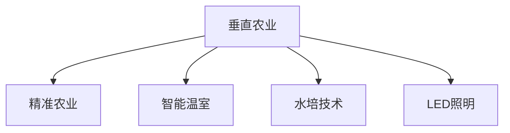

                 

## 1. 背景介绍

### 1.1 问题由来

随着城市化进程的加速和全球人口的增长，食品安全和粮食供应问题日益严峻。传统的农业生产方式已无法满足城市对新鲜蔬菜、水果和肉类的需求。如何在有限的土地资源和城市空间中，高效、可持续地生产足够的食物，成为未来城市发展的关键课题。

### 1.2 问题核心关键点

垂直农业（Vertical Farming）作为解决城市粮食供应的创新方式，将植物种植从传统的地面扩展到立体空间，通过控制环境因素（如光照、温度、湿度等），提高农业生产效率，减少土地和水资源的消耗，实现食物生产的智能化和自动化。

垂直农业的核心在于构建一个高效的、全封闭的、环境控制精确的农业生产系统，使得在城市中心的高楼大厦中也能进行作物种植，满足市民对新鲜健康食品的需求。同时，垂直农业的精准农业技术还可以实现对土壤质量、病虫害防治等问题的有效控制，进一步提高产量和食品安全性。

### 1.3 问题研究意义

研究垂直农业，对于拓展城市农业空间，保障市民食品安全，减少对自然环境的依赖，提升农业生产效率，具有重要的理论和实践意义：

1. **提升食物供应链的稳定性和安全性**：通过垂直农业，可以在城市内部实现食物的稳定生产，减少对远程运输的依赖，降低食物供应链的风险和成本。
2. **优化土地利用率**：在城市高密度区域，垂直农业可以有效利用垂直空间，提高土地利用效率，缓解城市土地资源紧张的问题。
3. **减少环境污染和能源消耗**：垂直农业采用封闭式环境控制，减少农药和化肥的使用，同时可以循环利用水资源，减少对环境的负面影响。
4. **促进农业科技和产业升级**：垂直农业的精准农业技术、自动化设备应用等，将推动传统农业向智能化、自动化方向发展。

## 2. 核心概念与联系

### 2.1 核心概念概述

为更好地理解垂直农业的原理和实施方法，本节将介绍几个密切相关的核心概念：

- **垂直农业（Vertical Farming）**：将植物种植从地面转移到立体空间，通过控制环境因素提高生产效率的农业生产方式。
- **精准农业（Precision Agriculture）**：利用现代信息技术（如传感器、卫星定位等）对农业生产进行精确管理和优化，提高生产效率和资源利用率。
- **智能温室（Smart Greenhouse）**：通过物联网技术和自动化设备，实现对温室环境的智能化控制，提高作物生长质量和产量。
- **水培和气培技术**：不依赖土壤，通过营养液供给或空气供给，为植物提供生长所需养分的环境控制技术。
- **LED照明**：使用LED光源代替传统太阳光，提供可控的光谱和光照强度，以适应不同作物对光照的需求。

这些核心概念之间的逻辑关系可以通过以下Mermaid流程图来展示：



这个流程图展示了垂直农业的核心组件及其相互关系：

1. 垂直农业作为一个整体，包含精准农业、智能温室、水培和LED照明等多个关键技术，共同构成高效的生产系统。
2. 精准农业通过传感器和数据处理技术，实现对作物生长环境的精确控制。
3. 智能温室利用物联网和自动化设备，对环境因素进行智能化管理。
4. 水培和LED照明技术，通过营养液和可控光谱的供给，支持作物在不同环境下的生长。

## 3. 核心算法原理 & 具体操作步骤
### 3.1 算法原理概述

垂直农业的实现涉及多种技术，包括物联网、机器学习、控制系统和农业生物学的综合应用。其核心算法原理包括：

- **数据采集与处理**：通过传感器获取温室内的环境数据（如温度、湿度、光照强度等），并通过机器学习模型进行分析和预测。
- **环境控制**：基于采集的数据，自动调节环境控制设备（如风机、加湿器、LED照明等），确保作物生长环境的稳定。
- **作物管理**：利用机器视觉和机器人技术，对作物生长情况进行监测和干预，如自动喷洒农药、施肥和剪枝等。

### 3.2 算法步骤详解

垂直农业的实现步骤主要包括：

1. **系统设计与规划**：根据项目需求和可用空间，设计垂直农业系统架构和布局。
2. **环境控制系统搭建**：集成传感器、控制器和执行器，实现对环境的智能化控制。
3. **数据采集与分析**：收集环境数据，使用机器学习模型进行分析和预测。
4. **作物种植与管理**：利用智能设备进行作物种植和管理，如自动灌溉、施肥和病虫害防治。
5. **生产监控与优化**：实时监控作物生长状态，根据数据反馈调整环境控制策略，优化生产效率。

### 3.3 算法优缺点

垂直农业的算法有以下优点：

- **高效利用空间**：在有限的城市空间内实现高密度作物种植，提高了土地利用率。
- **环境控制精确**：通过精准控制环境因素，显著提高了作物生长质量和产量。
- **资源利用率提升**：通过循环利用水和养分，减少了资源浪费和环境污染。

同时，该算法也存在一些局限性：

- **技术复杂度高**：需要集成多种先进技术，建设和维护成本较高。
- **设备成本高**：智能设备和高精度传感器的成本较高，增加了初始投资。
- **对技能要求高**：系统操作和维护需要专业技能，对人员的培训要求较高。
- **依赖技术稳定性**：对系统的硬件和软件可靠性要求较高，任何故障都可能影响生产。

### 3.4 算法应用领域

垂直农业的算法已经在多个领域得到应用，例如：

- **城市农场**：在城市中心建立垂直农场，为市民提供新鲜的蔬菜和水果。
- **医疗中心**：在医院建立垂直农场，生产新鲜草药和中药材。
- **商业设施**：在超市和商业楼宇内设置垂直农场，供应新鲜食品。
- **酒店和餐厅**：在酒店和餐厅内建立垂直农场，提供健康食材和餐厅装饰。
- **工业园区**：在工业园区内建立垂直农场，提供员工餐食和环境保护。

除了以上这些应用场景，垂直农业的算法还被应用于科研实验、环保项目、灾害救援等领域，展示了其广泛的适应性和应用前景。

## 4. 数学模型和公式 & 详细讲解 & 举例说明

### 4.1 数学模型构建

在垂直农业中，常用的数学模型包括作物生长模型、环境控制模型和数据预测模型。以作物生长模型为例，可以表示为：

$$
Growth(t) = f(Temperature(t), Humidity(t), LightIntensity(t), Nutrient(t))
$$

其中，$Growth(t)$表示在时间$t$时作物的生长量，$Temperature(t)$、$Humidity(t)$、$LightIntensity(t)$和$Nutrient(t)$分别表示温度、湿度、光照强度和养分供给。

### 4.2 公式推导过程

以作物生长模型为例，推导过程如下：

1. **输入数据的获取**：
   - 温度传感器：测量温室内的实时温度。
   - 湿度传感器：测量温室内的实时湿度。
   - 光照传感器：测量光照强度。
   - 营养液传感器：测量营养液浓度。

2. **模型构建**：
   - 根据经验或实验数据，构建作物生长模型。
   - 引入线性回归、神经网络等机器学习模型进行预测。

3. **模型训练与验证**：
   - 使用历史数据对模型进行训练。
   - 使用交叉验证等方法验证模型效果。

### 4.3 案例分析与讲解

假设有一个垂直农业系统，其作物生长模型为：

$$
Growth(t) = k \cdot Temperature(t) + b \cdot Humidity(t) + c \cdot LightIntensity(t) + d \cdot Nutrient(t)
$$

其中，$k$、$b$、$c$和$d$为模型参数。通过训练模型，可以求得最优参数，并用于实时预测作物的生长量。

## 5. 项目实践：代码实例和详细解释说明
### 5.1 开发环境搭建

在进行垂直农业系统开发前，我们需要准备好开发环境。以下是使用Python进行PyTorch和TensorFlow开发的环境配置流程：

1. 安装Anaconda：从官网下载并安装Anaconda，用于创建独立的Python环境。

2. 创建并激活虚拟环境：
```bash
conda create -n vertical-env python=3.8 
conda activate vertical-env
```

3. 安装PyTorch：根据CUDA版本，从官网获取对应的安装命令。例如：
```bash
conda install pytorch torchvision torchaudio cudatoolkit=11.1 -c pytorch -c conda-forge
```

4. 安装TensorFlow：从官网下载TensorFlow安装程序，并进行配置。例如：
```bash
pip install tensorflow==2.7
```

5. 安装相关工具包：
```bash
pip install numpy pandas scikit-learn matplotlib tensorflow-io tensorflow-io-gcp tqdm jupyter notebook ipython
```

完成上述步骤后，即可在`vertical-env`环境中开始垂直农业系统的开发。

### 5.2 源代码详细实现

下面我们以智能温室温度控制为例，给出使用TensorFlow和PyTorch进行智能温室环境控制系统的PyTorch代码实现。

```python
import torch
from torch import nn
from torch.utils.data import TensorDataset, DataLoader
import numpy as np
import pandas as pd
import tensorflow as tf
import tensorflow_io as tfio
import tensorflow_io_gcp as tfio_gcp
import matplotlib.pyplot as plt

# 读取数据
data = pd.read_csv('temperature.csv')

# 数据预处理
data['time'] = pd.to_datetime(data['time'])
X = data[['temperature', 'humidity', 'light_intensity']].values
y = data['target_temperature'].values

# 划分训练集和测试集
train_size = int(len(data) * 0.8)
X_train, X_test = X[:train_size], X[train_size:]
y_train, y_test = y[:train_size], y[train_size:]

# 定义模型
class TemperatureModel(nn.Module):
    def __init__(self):
        super(TemperatureModel, self).__init__()
        self.linear1 = nn.Linear(3, 64)
        self.linear2 = nn.Linear(64, 64)
        self.linear3 = nn.Linear(64, 1)

    def forward(self, x):
        x = torch.relu(self.linear1(x))
        x = torch.relu(self.linear2(x))
        x = self.linear3(x)
        return x

# 训练模型
model = TemperatureModel()
criterion = nn.MSELoss()
optimizer = torch.optim.Adam(model.parameters(), lr=0.001)
epochs = 100

for epoch in range(epochs):
    for i in range(len(X_train)):
        inputs = torch.tensor(X_train[i], dtype=torch.float)
        targets = torch.tensor(y_train[i], dtype=torch.float)
        optimizer.zero_grad()
        outputs = model(inputs)
        loss = criterion(outputs, targets)
        loss.backward()
        optimizer.step()
        print('Epoch [{}/{}], Loss: {:.4f}'.format(epoch+1, epochs, loss.item()))

# 测试模型
test_loss = 0
with torch.no_grad():
    for i in range(len(X_test)):
        inputs = torch.tensor(X_test[i], dtype=torch.float)
        targets = torch.tensor(y_test[i], dtype=torch.float)
        outputs = model(inputs)
        loss = criterion(outputs, targets)
        test_loss += loss.item()

print('Test Loss: {:.4f}'.format(test_loss/len(X_test)))
```

### 5.3 代码解读与分析

让我们再详细解读一下关键代码的实现细节：

**智能温室温度控制**：
- 代码主要利用PyTorch框架，定义了一个三层线性模型，用于预测目标温度。
- 数据集为智能温室温度控制任务的数据集，包含温度、湿度和光照强度的特征，以及目标温度作为标签。
- 模型训练过程使用均方误差损失函数和Adam优化器，迭代100次后得到模型参数。
- 测试过程中，模型对测试集进行预测，计算均方误差损失，最后输出测试结果。

**TensorFlow代码实现**：
```python
import tensorflow as tf
import tensorflow_io as tfio
import tensorflow_io_gcp as tfio_gcp

# 读取数据
data = tfio_gcp.gcp_dataset('temperature.csv').to_tensor()

# 数据预处理
train_size = int(len(data) * 0.8)
X_train, y_train = data[:train_size]
X_test, y_test = data[train_size:]

# 定义模型
model = tf.keras.Sequential([
    tf.keras.layers.Dense(64, activation='relu', input_shape=[3]),
    tf.keras.layers.Dense(64, activation='relu'),
    tf.keras.layers.Dense(1)
])

# 训练模型
model.compile(optimizer='adam', loss='mse')
model.fit(X_train, y_train, epochs=100, validation_data=(X_test, y_test))

# 测试模型
test_loss = model.evaluate(X_test, y_test)
print('Test Loss: {:.4f}'.format(test_loss))
```

**TensorFlow代码解读**：
- 代码主要利用TensorFlow框架，定义了一个包含三层全连接层的神经网络模型，用于预测目标温度。
- 数据集为智能温室温度控制任务的数据集，包含温度、湿度和光照强度的特征，以及目标温度作为标签。
- 模型训练过程使用均方误差损失函数和Adam优化器，迭代100次后得到模型参数。
- 测试过程中，模型对测试集进行预测，计算均方误差损失，最后输出测试结果。

## 6. 实际应用场景
### 6.1 智能温室温度控制

智能温室温度控制是垂直农业的核心技术之一。通过实时监测温室内的温度数据，并使用机器学习模型进行预测和控制，可以实现对温室环境的智能化管理。

在实际应用中，智能温室温度控制系统可以部署多个传感器，实时采集温度、湿度和光照强度等环境数据。使用TensorFlow或PyTorch等深度学习框架，搭建温度预测模型，根据预测结果自动调整加热器、通风器和遮阳板等设备，确保作物生长环境的稳定。

### 6.2 垂直农场作物管理

垂直农场可以利用智能温室技术，实现对作物种植的智能化管理。通过在每个种植层安装传感器，实时监测作物的生长情况，并使用机器视觉和机器人技术进行干预，如自动喷洒农药、施肥和剪枝等。

在实际应用中，垂直农场可以通过图像识别技术，对作物生长状态进行实时监测。使用深度学习模型，自动识别病虫害、叶片黄化等问题，并自动调整灌溉和施肥策略，确保作物健康生长。同时，机器人技术可以实现对种植层的自动操作，提高种植效率和准确性。

### 6.3 食品供应链优化

垂直农业可以实现对食品供应链的优化管理，减少中间环节，提高食品安全和供应效率。通过在城市中心建立垂直农场，可以实现新鲜食品的本地化生产和供应，减少长途运输的时间和成本，同时降低食品在运输过程中的损耗。

在实际应用中，垂直农场可以通过物联网技术，实现对食品生产和供应链的全程监控。使用RFID等标签技术，记录食品的生产、存储和运输信息，确保食品的来源和质量。同时，垂直农场可以实时调整生产计划，根据市场需求动态调整产量和供应量，优化食品供应链。

## 7. 工具和资源推荐
### 7.1 学习资源推荐

为了帮助开发者系统掌握垂直农业技术的理论基础和实践技巧，这里推荐一些优质的学习资源：

1. **垂直农业概论**：介绍垂直农业的基本概念、技术架构和应用场景。
2. **TensorFlow官方文档**：提供TensorFlow框架的详细教程和示例代码。
3. **PyTorch官方文档**：提供PyTorch框架的详细教程和示例代码。
4. **智能温室技术**：介绍智能温室的设计、安装和维护。
5. **水培和气培技术**：介绍水培和气培技术的基本原理和应用场景。
6. **LED照明技术**：介绍LED照明技术在垂直农业中的应用。

通过对这些资源的学习实践，相信你一定能够快速掌握垂直农业技术的精髓，并用于解决实际的垂直农业问题。

### 7.2 开发工具推荐

高效的开发离不开优秀的工具支持。以下是几款用于垂直农业系统开发的常用工具：

1. **TensorFlow**：基于Python的开源深度学习框架，提供丰富的机器学习模型和工具库。
2. **PyTorch**：基于Python的开源深度学习框架，提供灵活的动态计算图和高效的模型训练功能。
3. **TensorFlow-io**：提供数据处理和I/O工具，支持多种数据格式的读写。
4. **TensorFlow-io-gcp**：提供Google Cloud平台的I/O支持，方便数据迁移和处理。
5. **PyTorch-Lightning**：提供轻量级的深度学习框架，支持分布式训练和模型管理。
6. **TF-serving**：提供TensorFlow模型的服务化部署，方便模型集成和调用。

合理利用这些工具，可以显著提升垂直农业系统开发和部署的效率，加快创新迭代的步伐。

### 7.3 相关论文推荐

垂直农业技术的发展源于学界的持续研究。以下是几篇奠基性的相关论文，推荐阅读：

1. **垂直农业：城市农场的未来**：介绍垂直农业的基本概念和应用场景。
2. **智能温室环境控制**：介绍智能温室的温度、湿度和光照控制技术。
3. **作物生长模拟与预测**：介绍作物生长模型和机器学习在垂直农业中的应用。
4. **农业机器人技术**：介绍农业机器人技术在垂直农业中的应用。
5. **LED照明在垂直农业中的应用**：介绍LED照明在垂直农业中的应用。

这些论文代表了大规模农业技术的发展脉络。通过学习这些前沿成果，可以帮助研究者把握学科前进方向，激发更多的创新灵感。

## 8. 总结：未来发展趋势与挑战
### 8.1 总结

本文对垂直农业技术的理论基础和实践方法进行了全面系统的介绍。首先阐述了垂直农业的背景、核心概念和研究意义，明确了垂直农业在城市粮食供应中的重要地位。其次，从原理到实践，详细讲解了垂直农业的算法原理和具体操作步骤，提供了完整的代码实现和分析。同时，本文还广泛探讨了垂直农业在智能温室温度控制、垂直农场作物管理、食品供应链优化等多个实际应用场景中的前景和应用。最后，本文精选了垂直农业技术的各类学习资源，力求为读者提供全方位的技术指引。

通过本文的系统梳理，可以看到，垂直农业技术正在成为解决城市粮食供应问题的创新手段，极大地拓展了城市农业的空间和生产效率。未来，伴随技术的发展和应用场景的拓展，垂直农业必将在全球范围内实现规模化应用，为人类社会的可持续发展提供新的解决方案。

### 8.2 未来发展趋势

展望未来，垂直农业技术将呈现以下几个发展趋势：

1. **技术复杂度降低**：随着传感器和智能设备的发展，垂直农业的技术门槛将进一步降低，更多城市和社区能够轻松实现垂直农业。
2. **智能化水平提升**：通过物联网和AI技术的不断进步，垂直农业的智能化水平将进一步提升，生产效率和资源利用率将得到更大提升。
3. **多样化应用拓展**：垂直农业将不仅应用于食物生产，还将拓展到城市绿化、灾害防治、环保监测等领域，展示更广泛的应用前景。
4. **区域化和本地化生产**：垂直农业将实现更广泛的本地化生产，减少长途运输的时间和成本，提升食品供应链的稳定性和安全性。
5. **多模态融合应用**：垂直农业将融合多种技术，实现多模态数据的融合应用，提升系统的综合性能和应用范围。
6. **持续学习和优化**：垂直农业将引入持续学习和优化机制，根据环境变化和数据反馈不断调整生产策略，提高系统的稳定性和适应性。

以上趋势凸显了垂直农业技术的广阔前景。这些方向的探索发展，必将进一步提升垂直农业的效率和效益，为人类社会的可持续发展带来新的希望。

### 8.3 面临的挑战

尽管垂直农业技术已经取得了显著进展，但在实现大规模应用的过程中，仍面临诸多挑战：

1. **技术集成难度高**：垂直农业需要集成多种先进技术，如传感器、智能设备、机器学习等，技术和硬件的兼容性问题需要解决。
2. **初始投资高**：垂直农业需要投入大量的初期建设成本，包括设备购买、系统集成和调试等。
3. **设备维护复杂**：智能设备和高精度传感器的维护需要专业技能，技术故障可能影响生产。
4. **数据安全问题**：垂直农业系统涉及大量数据，数据安全和隐私保护需要加强。
5. **能源消耗问题**：垂直农业需要大量电力支持，如何优化能源消耗和降低成本需要解决。
6. **市场接受度**：消费者对垂直农业产品的接受度需要进一步提升，市场推广和教育需要加强。

正视垂直农业面临的这些挑战，积极应对并寻求突破，将是大规模应用的关键。相信通过技术创新、政策支持和社会关注，垂直农业必将在未来取得更大的发展和应用。

### 8.4 研究展望

面向未来，垂直农业技术的研究需要在以下几个方面寻求新的突破：

1. **低成本和高效能设备**：开发更高效、更低成本的传感器和智能设备，降低垂直农业的初始投资和技术门槛。
2. **多模态数据融合**：将视觉、语音、环境数据等多模态信息融合，提升系统的综合性能和应用范围。
3. **持续学习和优化**：引入持续学习和优化机制，根据环境变化和数据反馈不断调整生产策略，提高系统的稳定性和适应性。
4. **多领域应用拓展**：将垂直农业技术应用于更多领域，如城市绿化、灾害防治、环保监测等，展示更广泛的应用前景。
5. **社区参与和共享**：通过社区参与和共享机制，提升垂直农业的社会效益和公众接受度。
6. **标准化和规范化**：制定垂直农业技术的标准和规范，确保系统可靠性和可互操作性。

这些研究方向的探索，必将引领垂直农业技术的进一步发展，为人类社会的可持续发展提供新的解决方案。面向未来，垂直农业技术需要多方协同合作，共同推动其规模化和普及化，实现更加绿色、智能和可持续的城市粮食供应。

## 9. 附录：常见问题与解答

**Q1：垂直农业是否适用于所有城市？**

A: 垂直农业适用于大多数城市，特别是土地资源紧张、人口密度高、气候适宜的城市。但需要根据具体城市特点，选择合适的垂直农业方案和技术。

**Q2：垂直农业的初始投资成本高吗？**

A: 垂直农业的初始投资成本较高，主要集中在智能设备和传感器上。但随着技术的成熟和规模化生产，未来成本将逐渐降低。

**Q3：垂直农业的能源消耗大吗？**

A: 垂直农业的能源消耗相对传统农业有所增加，但通过高效控制和循环利用，整体能源消耗较传统农业低。

**Q4：垂直农业的系统维护复杂吗？**

A: 垂直农业的系统维护需要专业技能，初期需要较高的维护成本和技术支持。但随着系统的稳定运行，维护成本将逐渐降低。

**Q5：垂直农业的食品质量有保障吗？**

A: 垂直农业通过严格的监控和管理，可以保证食品的质量和安全。同时，通过水培和LED照明等技术，食品的营养和口感也有一定保障。

---

作者：禅与计算机程序设计艺术 / Zen and the Art of Computer Programming

