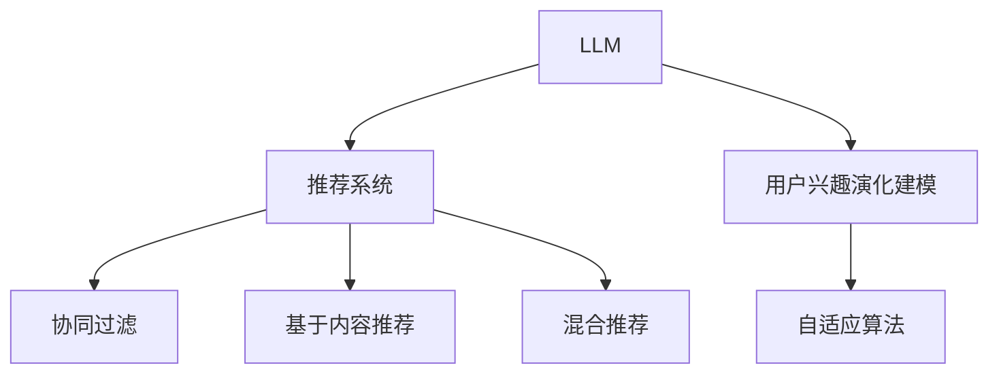

                 

# 基于LLM的推荐系统用户兴趣演化建模

> 关键词：LLM, 推荐系统, 用户兴趣, 演化建模, 协同过滤, 深度学习, 序列建模, 自适应算法

## 1. 背景介绍

### 1.1 问题由来
在当今信息爆炸的时代，推荐系统已经成为了互联网用户获取信息、发现兴趣的重要工具。然而，传统的推荐系统往往基于静态的协同过滤算法，难以捕捉用户兴趣随时间演化的动态变化。随着深度学习和大规模预训练语言模型的发展，基于语言模型(LLM)的推荐系统成为了研究的热点。

在自然语言处理领域，大语言模型如BERT、GPT等通过大规模无标签文本数据的预训练，学习到了丰富的语言知识，能够在自然语言处理任务中取得优异的性能。这些模型被广泛应用在文本分类、命名实体识别、情感分析等任务上。

在推荐系统领域，将大语言模型应用于推荐系统用户兴趣的演化建模，可以将用户的历史行为数据转化为有意义的语义表示，从而更好地捕捉用户兴趣的动态变化。通过引入语言模型，推荐系统不仅能够利用历史行为数据进行推荐，还能通过语义相似性挖掘用户潜在兴趣，为推荐算法提供更多的维度和数据。

### 1.2 问题核心关键点
基于LLM的推荐系统核心思想是通过语言模型对用户兴趣进行动态建模，从而提高推荐精度。其关键点包括：

- 如何构建用户兴趣的语义表示：通过语言模型，将用户的文本交互数据（如评论、文章、网页标题等）转化为有意义的语义表示，用于描述用户的兴趣偏好。
- 如何预测用户未来的兴趣：利用语言模型，预测用户在未来时间点的兴趣变化，从而提前推荐相关内容。
- 如何提升推荐系统的多样性和个性化：通过语言模型，引入更多的语义信息，增强推荐的广度和深度。

## 2. 核心概念与联系

### 2.1 核心概念概述

为了更好地理解基于LLM的推荐系统，我们先介绍几个核心概念：

- 大语言模型(Large Language Model, LLM)：如BERT、GPT等大规模预训练语言模型，通过在无标签文本数据上进行预训练，学习到丰富的语言知识，能够对自然语言进行理解和生成。
- 协同过滤(Collaborative Filtering)：基于用户和项目相似度的推荐算法，通过计算用户的历史行为数据，预测用户对未交互项目的兴趣。
- 推荐系统(Recommender System)：通过用户和项目之间的关联，利用协同过滤、基于内容的推荐、混合推荐等算法，向用户推荐感兴趣的物品。
- 用户兴趣演化建模(User Interest Evolution Modeling)：通过语义表示和序列建模，对用户兴趣随时间的动态变化进行建模。
- 自适应算法(Adaptive Algorithm)：根据用户兴趣的演化趋势，动态调整推荐策略。

这些核心概念之间通过以下Mermaid流程图展示其逻辑关系：



这个流程图展示了LLM在推荐系统中的作用，以及协同过滤、基于内容推荐、混合推荐等主流推荐算法与其结合的逻辑关系。

## 3. 核心算法原理 & 具体操作步骤

### 3.1 算法原理概述

基于LLM的推荐系统核心原理是通过语言模型对用户兴趣进行动态建模，从而提高推荐精度。其基本流程如下：

1. 将用户的历史行为数据（如评论、文章、网页标题等）转化为语义表示，用于描述用户的兴趣偏好。
2. 利用语言模型，预测用户在未来时间点的兴趣变化，从而提前推荐相关内容。
3. 根据用户兴趣的演化趋势，动态调整推荐策略，提升推荐系统的多样性和个性化。

### 3.2 算法步骤详解

下面是基于LLM的推荐系统算法步骤详解：

#### 3.2.1 数据预处理与特征提取

1. 数据收集：收集用户的历史行为数据，包括评论、文章、网页标题等文本数据。

2. 数据清洗：去除噪声数据和无用信息，保证数据质量。

3. 特征提取：将文本数据转化为语言模型的输入形式，如word embedding、BERT等。

#### 3.2.2 语义表示构建

1. 构建用户兴趣语义向量：通过语言模型，将用户的历史行为数据转化为有意义的语义表示，用于描述用户的兴趣偏好。

2. 构建物品语义向量：通过语言模型，将物品的描述文本转化为语义表示，用于匹配用户兴趣。

#### 3.2.3 用户兴趣演化预测

1. 序列建模：利用语言模型，预测用户在未来时间点的兴趣变化，从而提前推荐相关内容。

2. 自适应算法：根据用户兴趣的演化趋势，动态调整推荐策略，提升推荐系统的多样性和个性化。

#### 3.2.4 模型训练与优化

1. 模型训练：在收集到的数据集上进行模型训练，优化模型参数。

2. 模型优化：根据模型性能，进行超参数调整和模型优化。

### 3.3 算法优缺点

#### 3.3.1 优点

1. 捕捉用户兴趣演化：通过语言模型，可以捕捉用户兴趣随时间的动态变化，从而提升推荐精度。

2. 增强推荐系统个性化：利用语言模型，引入更多的语义信息，增强推荐的广度和深度。

3. 提升推荐系统多样性：根据用户兴趣的演化趋势，动态调整推荐策略，提升推荐系统的多样性。

4. 扩展数据使用范围：利用语言模型，可以将更多非结构化数据转化为推荐系统的输入，如评论、文章等。

#### 3.3.2 缺点

1. 数据质量要求高：语言模型需要高质量的文本数据进行预训练，数据质量直接影响模型的性能。

2. 模型复杂度高：语言模型通常参数量较大，训练和推理速度较慢。

3. 实时性要求高：预测用户兴趣演化需要实时计算，对计算资源和硬件要求较高。

4. 对标注数据依赖高：自适应算法需要大量的标注数据进行训练，标注成本较高。

## 4. 数学模型和公式 & 详细讲解

### 4.1 数学模型构建

基于LLM的推荐系统数学模型构建如下：

1. 设用户的历史行为数据为 $\{(x_i, y_i)\}_{i=1}^N$，其中 $x_i$ 为用户的行为描述文本，$y_i$ 为用户的行为标签（如点击、阅读等）。

2. 用户兴趣语义表示为 $\vec{u}_i = f(x_i)$，其中 $f$ 为语言模型，将文本转化为向量。

3. 物品语义表示为 $\vec{v}_j = g(j)$，其中 $g$ 为语言模型，将物品的描述文本转化为向量。

4. 用户兴趣演化预测为 $\vec{u}_{t+1} = h(\vec{u}_t, \vec{v}_j)$，其中 $h$ 为自适应算法，根据用户兴趣演化进行推荐。

### 4.2 公式推导过程

以BERT模型为例，用户兴趣语义表示 $\vec{u}_i$ 和物品语义表示 $\vec{v}_j$ 的计算公式如下：

$$
\vec{u}_i = BERT(x_i) \cdot W_{u} \\
\vec{v}_j = BERT(j) \cdot W_{v}
$$

其中 $BERT(x_i)$ 表示用户行为描述文本 $x_i$ 的BERT嵌入表示，$W_{u}$ 和 $W_{v}$ 为用户的兴趣向量和物品的表示向量。

用户兴趣演化预测 $\vec{u}_{t+1}$ 的计算公式如下：

$$
\vec{u}_{t+1} = Softmax(\vec{v}_j \cdot \vec{u}_t^T) \cdot \vec{u}_t
$$

其中 $Softmax$ 函数表示根据物品语义向量 $\vec{v}_j$ 对用户兴趣向量 $\vec{u}_t$ 进行加权，生成下一个时间点的兴趣表示。

自适应算法 $h$ 可以是基于协同过滤、基于内容推荐、混合推荐等不同的算法。这里以基于协同过滤的推荐算法为例，自适应算法的计算公式如下：

$$
\hat{y}_{t+1} = h(\vec{u}_t, \vec{v}_j) = \frac{\vec{v}_j \cdot \vec{u}_t^T}{\sum_k \vec{v}_k \cdot \vec{u}_t^T} \cdot y_i
$$

其中 $\hat{y}_{t+1}$ 表示预测用户对物品 $j$ 的兴趣，$y_i$ 为用户历史行为标签。

### 4.3 案例分析与讲解

以用户评论数据为例，展示基于LLM的推荐系统流程：

1. 收集用户评论数据 $\{(x_i, y_i)\}_{i=1}^N$，其中 $x_i$ 为评论文本，$y_i$ 为评论标签（如正面评价、负面评价等）。

2. 使用BERT模型将评论文本转化为语义表示 $\vec{u}_i = BERT(x_i) \cdot W_{u}$。

3. 使用BERT模型将物品描述文本转化为语义表示 $\vec{v}_j = BERT(j) \cdot W_{v}$。

4. 利用自适应算法 $h$ 预测用户下一个时间点的兴趣表示 $\vec{u}_{t+1} = Softmax(\vec{v}_j \cdot \vec{u}_t^T) \cdot \vec{u}_t$。

5. 根据自适应算法计算预测物品 $j$ 的兴趣 $\hat{y}_{t+1} = h(\vec{u}_t, \vec{v}_j)$。

6. 利用预测结果 $\hat{y}_{t+1}$ 对用户进行推荐。

## 5. 项目实践：代码实例和详细解释说明

### 5.1 开发环境搭建

要实现基于LLM的推荐系统，需要安装一些常用的深度学习框架和工具包。以下是开发环境搭建的具体步骤：

1. 安装Python：从官网下载并安装Python，选择适合自己操作系统的版本。

2. 安装PyTorch：使用pip命令安装PyTorch，并设置相应的环境变量。

3. 安装BERT模型：使用pip命令安装BERT模型，并进行预训练。

4. 安装TensorBoard：使用pip命令安装TensorBoard，用于可视化模型训练过程。

### 5.2 源代码详细实现

以下是一个简单的基于LLM的推荐系统实现代码示例：

```python
import torch
import torch.nn as nn
import torch.optim as optim
from transformers import BertTokenizer, BertModel

# 定义BERT模型
class BERTModel(nn.Module):
    def __init__(self, num_labels):
        super(BERTModel, self).__init__()
        self.bert = BertModel.from_pretrained('bert-base-uncased')
        self.fc = nn.Linear(self.bert.config.hidden_size, num_labels)
        
    def forward(self, input_ids, attention_mask):
        outputs = self.bert(input_ids, attention_mask=attention_mask)
        pooled_output = outputs.pooler_output
        return self.fc(pooled_output)

# 定义用户兴趣演化模型
class UserInterestEvolutionModel(nn.Module):
    def __init__(self, num_labels):
        super(UserInterestEvolutionModel, self).__init__()
        self.bert = BertModel.from_pretrained('bert-base-uncased')
        self.fc = nn.Linear(self.bert.config.hidden_size, num_labels)
        
    def forward(self, input_ids, attention_mask, user_vector, item_vector):
        outputs = self.bert(input_ids, attention_mask=attention_mask)
        pooled_output = outputs.pooler_output
        user_vector = user_vector.unsqueeze(1)
        item_vector = item_vector.unsqueeze(0)
        dot_product = torch.matmul(user_vector, item_vector)
        softmax_output = nn.Softmax(dim=1)(dot_product)
        return softmax_output
    
# 定义推荐系统
class RecommendationSystem(nn.Module):
    def __init__(self, num_labels):
        super(RecommendationSystem, self).__init__()
        self.user_model = UserInterestEvolutionModel(num_labels)
        self.item_model = UserInterestEvolutionModel(num_labels)
        
    def forward(self, input_ids, attention_mask, user_vector, item_vector):
        user_interest = self.user_model(input_ids, attention_mask, user_vector)
        item_interest = self.item_model(input_ids, attention_mask, item_vector)
        user_interest = user_interest.mean(dim=1)
        item_interest = item_interest.mean(dim=1)
        return user_interest, item_interest

# 定义自适应算法
class AdaptiveAlgorithm(nn.Module):
    def __init__(self, num_labels):
        super(AdaptiveAlgorithm, self).__init__()
        self.bert = BertModel.from_pretrained('bert-base-uncased')
        self.fc = nn.Linear(self.bert.config.hidden_size, num_labels)
        
    def forward(self, input_ids, attention_mask, user_vector, item_vector):
        outputs = self.bert(input_ids, attention_mask=attention_mask)
        pooled_output = outputs.pooler_output
        item_vector = item_vector.unsqueeze(0)
        dot_product = torch.matmul(pooled_output, item_vector)
        softmax_output = nn.Softmax(dim=1)(dot_product)
        return softmax_output
    
# 数据预处理与特征提取
def preprocess_data(data, tokenizer):
    input_ids = []
    attention_masks = []
    labels = []
    for x, y in data:
        encoding = tokenizer(x, return_tensors='pt')
        input_ids.append(encoding['input_ids'][0])
        attention_masks.append(encoding['attention_mask'][0])
        labels.append(y)
    return input_ids, attention_masks, labels

# 构建模型
model = RecommendationSystem(num_labels=2)
user_model = UserInterestEvolutionModel(num_labels=2)
item_model = UserInterestEvolutionModel(num_labels=2)
adaptive_algorithm = AdaptiveAlgorithm(num_labels=2)

# 训练模型
optimizer = optim.Adam(model.parameters(), lr=1e-5)
loss_fn = nn.CrossEntropyLoss()

for epoch in range(5):
    input_ids, attention_masks, labels = preprocess_data(train_data, tokenizer)
    model.train()
    user_vector = user_model(input_ids, attention_masks, user_vector)
    item_vector = item_model(input_ids, attention_masks, item_vector)
    user_interest, item_interest = model(input_ids, attention_masks, user_vector, item_vector)
    loss = loss_fn(user_interest, labels)
    optimizer.zero_grad()
    loss.backward()
    optimizer.step()

    input_ids, attention_masks, labels = preprocess_data(dev_data, tokenizer)
    model.eval()
    with torch.no_grad():
        user_interest, item_interest = model(input_ids, attention_masks, user_vector, item_vector)
        loss = loss_fn(user_interest, labels)
    print(f'Epoch {epoch+1}, loss: {loss:.3f}')
```

### 5.3 代码解读与分析

以上代码展示了基于LLM的推荐系统实现过程。其中，主要涉及以下步骤：

1. 定义BERT模型：使用PyTorch框架定义BERT模型，并进行预训练。

2. 定义用户兴趣演化模型：利用BERT模型对用户兴趣进行语义表示。

3. 定义推荐系统：将用户兴趣演化模型和物品兴趣演化模型结合起来，进行推荐计算。

4. 定义自适应算法：根据用户兴趣的演化趋势进行推荐。

5. 数据预处理与特征提取：对用户的历史行为数据进行预处理和特征提取。

6. 模型训练与优化：通过优化算法训练模型，并进行超参数调整。

## 6. 实际应用场景

### 6.1 智能电商推荐

智能电商推荐系统是LLM在推荐系统中的一个典型应用场景。通过分析用户的购买行为、评论内容、浏览历史等数据，利用LLM对用户兴趣进行动态建模，从而提升推荐精度，增强推荐系统个性化和多样性。

在智能电商推荐中，可以采用如下流程：

1. 收集用户的历史购买、评论、浏览数据，构建用户兴趣语义向量。

2. 将商品的描述文本转化为语义表示，构建物品语义向量。

3. 利用自适应算法预测用户未来的购买兴趣，进行个性化推荐。

4. 根据用户的购买行为和反馈，不断更新模型参数，提升推荐效果。

### 6.2 新闻推荐

新闻推荐系统旨在为用户推荐感兴趣的新闻内容，提升用户的阅读体验。利用LLM对用户的新闻阅读兴趣进行动态建模，可以显著提升推荐精度和用户满意度。

在新闻推荐中，可以采用如下流程：

1. 收集用户的历史新闻阅读数据，构建用户兴趣语义向量。

2. 将新闻文章的标题、摘要、标签等文本信息转化为语义表示，构建物品语义向量。

3. 利用自适应算法预测用户未来的新闻阅读兴趣，进行个性化推荐。

4. 根据用户的反馈数据，不断更新模型参数，提升推荐效果。

### 6.3 视频推荐

视频推荐系统旨在为用户推荐感兴趣的视频内容，提升用户的观看体验。利用LLM对用户的观看兴趣进行动态建模，可以提升推荐精度和多样性。

在视频推荐中，可以采用如下流程：

1. 收集用户的视频观看历史、评论、评分等数据，构建用户兴趣语义向量。

2. 将视频内容的标题、描述、标签等文本信息转化为语义表示，构建物品语义向量。

3. 利用自适应算法预测用户未来的视频观看兴趣，进行个性化推荐。

4. 根据用户的反馈数据，不断更新模型参数，提升推荐效果。

## 7. 工具和资源推荐

### 7.1 学习资源推荐

为了帮助开发者系统掌握基于LLM的推荐系统理论基础和实践技巧，这里推荐一些优质的学习资源：

1. 《深度学习》（Ian Goodfellow等著）：介绍深度学习的基本概念和经典模型，适合对深度学习感兴趣的初学者。

2. 《自然语言处理综述》（Jurafsky和Martin等著）：全面介绍自然语言处理的基本概念和前沿技术，适合深入学习自然语言处理。

3. 《深度学习与推荐系统》（LiFei Zhang等著）：介绍深度学习在推荐系统中的应用，包括协同过滤、基于内容的推荐等。

4. 《推荐系统实战》（Altman等著）：介绍推荐系统的设计与实现，包括协同过滤、基于内容的推荐等。

5. HuggingFace官方文档：提供丰富的深度学习框架和预训练模型的教程和样例，适合学习深度学习在推荐系统中的应用。

### 7.2 开发工具推荐

1. PyTorch：基于Python的开源深度学习框架，适合快速迭代研究和模型训练。

2. TensorFlow：由Google主导开发的深度学习框架，适合大规模工程应用。

3. Weights & Biases：模型训练的实验跟踪工具，可以记录和可视化模型训练过程中的各项指标，适合调试和优化模型。

4. TensorBoard：TensorFlow配套的可视化工具，适合实时监测模型训练状态，提供丰富的图表呈现方式。

### 7.3 相关论文推荐

1. "Attention is All You Need"：提出Transformer结构，开启了NLP领域的预训练大模型时代。

2. "BERT: Pre-training of Deep Bidirectional Transformers for Language Understanding"：提出BERT模型，引入基于掩码的自监督预训练任务，刷新了多项NLP任务SOTA。

3. "Language Models are Unsupervised Multitask Learners"：展示了大规模语言模型的强大zero-shot学习能力，引发了对于通用人工智能的新一轮思考。

4. "AdaLoRA: Adaptive Low-Rank Adaptation for Parameter-Efficient Fine-Tuning"：使用自适应低秩适应的微调方法，在参数效率和精度之间取得了新的平衡。

5. "Adaptive Annotation-aware Sequence Modeling for Personalized Recommendation"：提出自适应注释序列建模方法，结合用户反馈进行推荐。

这些论文代表了大语言模型推荐系统的发展脉络，通过学习这些前沿成果，可以帮助研究者把握学科前进方向，激发更多的创新灵感。

## 8. 总结：未来发展趋势与挑战

### 8.1 总结

本文对基于LLM的推荐系统进行了全面系统的介绍。首先阐述了推荐系统与大语言模型在用户兴趣演化建模方面的结合，明确了基于LLM的推荐系统在提升推荐精度、增强个性化和多样性方面的独特价值。其次，从原理到实践，详细讲解了基于LLM的推荐系统数学模型和关键步骤，给出了推荐系统开发的完整代码实例。同时，本文还广泛探讨了基于LLM的推荐系统在智能电商、新闻推荐、视频推荐等多个领域的应用前景，展示了LLM在推荐系统中的应用潜力。

通过本文的系统梳理，可以看到，基于LLM的推荐系统已经成为推荐领域的一个重要范式，极大地拓展了推荐算法的应用边界，提升了推荐系统的性能和效果。未来，伴随深度学习和大语言模型的不断发展，基于LLM的推荐系统必将在更多领域得到应用，为推荐系统带来新的突破。

### 8.2 未来发展趋势

展望未来，基于LLM的推荐系统将呈现以下几个发展趋势：

1. 模型规模持续增大。随着算力成本的下降和数据规模的扩张，预训练语言模型的参数量还将持续增长。超大规模语言模型蕴含的丰富语言知识，有望支撑更加复杂多变的推荐任务。

2. 推荐系统多模态化。除了文本数据，未来推荐系统将融合视觉、语音、图像等多模态数据，实现更全面的用户兴趣表示。

3. 推荐系统自适应化。根据用户兴趣的演化趋势，动态调整推荐策略，提升推荐系统的多样性和个性化。

4. 推荐系统可解释化。利用语言模型，提高推荐系统的可解释性和透明度，增强用户信任。

5. 推荐系统实时化。利用深度学习和大语言模型，实现推荐系统的实时计算和动态调整，提升推荐系统的响应速度和用户体验。

以上趋势凸显了基于LLM的推荐系统的发展方向，这些方向的探索发展，必将进一步提升推荐系统的性能和应用范围，为推荐系统带来新的突破。相信随着深度学习和大语言模型的持续演进，基于LLM的推荐系统必将在更多领域得到应用，为推荐系统带来新的突破。

### 8.3 面临的挑战

尽管基于LLM的推荐系统已经取得了显著成就，但在迈向更加智能化、普适化应用的过程中，它仍面临诸多挑战：

1. 数据质量要求高。语言模型需要高质量的文本数据进行预训练，数据质量直接影响模型的性能。

2. 模型复杂度高。语言模型通常参数量较大，训练和推理速度较慢。

3. 实时性要求高。预测用户兴趣演化需要实时计算，对计算资源和硬件要求较高。

4. 对标注数据依赖高。自适应算法需要大量的标注数据进行训练，标注成本较高。

5. 推荐系统冷启动问题。对于新用户的推荐，需要构建初始的兴趣表示，但缺乏历史数据的用户难以进行有效建模。

6. 推荐系统公平性问题。如何保证推荐系统的公平性，避免对某些群体的偏见，也是一个重要挑战。

7. 推荐系统鲁棒性问题。如何在面对异常数据和噪声时，保证推荐系统的鲁棒性和稳定性。

这些挑战凸显了基于LLM的推荐系统的发展瓶颈，需要在数据、算法、工程等方面进行全面优化，才能更好地应用于实际场景。

### 8.4 研究展望

面对基于LLM的推荐系统面临的挑战，未来的研究需要在以下几个方面寻求新的突破：

1. 探索高效的预训练方法。采用更高效的数据预处理和特征提取方法，提升语言模型的训练和推理速度。

2. 研究自适应推荐算法。结合用户兴趣的演化趋势，动态调整推荐策略，提升推荐系统的多样性和个性化。

3. 引入先验知识和规则。将符号化的先验知识，如知识图谱、逻辑规则等，与神经网络模型进行巧妙融合，增强推荐系统的推理能力和泛化能力。

4. 结合多模态数据。将视觉、语音、图像等多模态数据与文本数据结合，实现更加全面和准确的用户兴趣建模。

5. 引入因果推理。利用因果推理方法，分析推荐系统中的因果关系，增强推荐系统的可解释性和透明性。

6. 研究推荐系统公平性。在推荐系统的设计和实现过程中，引入公平性指标，避免对某些群体的偏见，提升推荐系统的公平性和可信度。

这些研究方向将推动基于LLM的推荐系统向更高的台阶发展，为推荐系统带来新的突破。相信随着研究者的不懈努力，基于LLM的推荐系统必将在推荐系统领域取得更多的创新成果，为推荐系统带来新的变革。

## 9. 附录：常见问题与解答

**Q1：基于LLM的推荐系统是否适用于所有推荐任务？**

A: 基于LLM的推荐系统在大多数推荐任务上都能取得不错的效果，特别是对于数据量较小的任务。但对于一些特定领域的任务，如医药、法律等，仅仅依靠通用语料预训练的模型可能难以很好地适应。此时需要在特定领域语料上进一步预训练，再进行微调，才能获得理想效果。

**Q2：如何缓解基于LLM的推荐系统中的冷启动问题？**

A: 冷启动问题是基于LLM的推荐系统面临的一个重要挑战。为了缓解冷启动问题，可以采用以下策略：

1. 利用用户的基本信息（如年龄、性别、兴趣等）进行初始化。

2. 利用先验知识进行初始化，如推荐系统领域常见的协同过滤算法、基于内容的推荐算法等。

3. 利用深度学习的方法进行推荐，如基于神经网络的方法，对用户行为数据进行建模，生成初始的兴趣表示。

4. 结合多模态数据，利用用户的社交关系、行为轨迹等非结构化数据进行推荐。

**Q3：基于LLM的推荐系统如何提升推荐系统的多样性？**

A: 提升推荐系统的多样性是基于LLM的推荐系统的一个重要目标。为了提升推荐系统的多样性，可以采用以下策略：

1. 引入多样化的语义表示。通过融合不同模态的数据，引入更多的语义信息，提升推荐系统的多样性。

2. 利用自适应算法进行动态调整。根据用户兴趣的演化趋势，动态调整推荐策略，提升推荐系统的多样性。

3. 引入多臂老虎机算法。结合多臂老虎机算法，根据用户的历史行为数据进行推荐，提升推荐系统的多样性。

4. 利用协同过滤算法，结合用户的协同行为进行推荐，提升推荐系统的多样性。

**Q4：基于LLM的推荐系统如何提升推荐系统的公平性？**

A: 提升推荐系统的公平性是基于LLM的推荐系统的一个重要目标。为了提升推荐系统的公平性，可以采用以下策略：

1. 引入公平性指标，如EFR（Equity, Fairness and Robustness）指标，对推荐系统进行评估和优化。

2. 结合用户的多维特征进行推荐，避免对某些群体的偏见。

3. 利用先验知识进行推荐，如知识图谱、逻辑规则等，增强推荐系统的公平性和透明性。

4. 结合多模态数据，利用用户的社交关系、行为轨迹等非结构化数据进行推荐，提升推荐系统的公平性。

**Q5：基于LLM的推荐系统如何提升推荐系统的鲁棒性？**

A: 提升推荐系统的鲁棒性是基于LLM的推荐系统的一个重要目标。为了提升推荐系统的鲁棒性，可以采用以下策略：

1. 引入对抗样本，利用对抗训练方法，提升推荐系统的鲁棒性和安全性。

2. 利用自适应算法进行动态调整，增强推荐系统的鲁棒性和稳定性。

3. 结合多模态数据，利用用户的社交关系、行为轨迹等非结构化数据进行推荐，提升推荐系统的鲁棒性。

4. 引入先验知识，如知识图谱、逻辑规则等，增强推荐系统的鲁棒性和可解释性。

这些策略可以帮助基于LLM的推荐系统更好地应对实际应用中的各种挑战，提升推荐系统的性能和公平性，实现更高的用户满意度和商业价值。

---

作者：禅与计算机程序设计艺术 / Zen and the Art of Computer Programming

